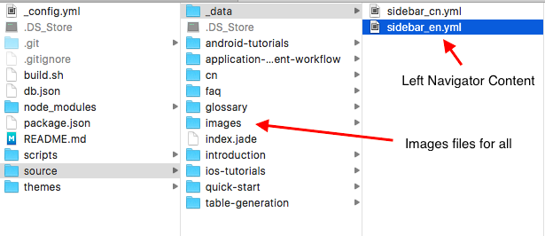
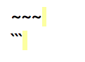
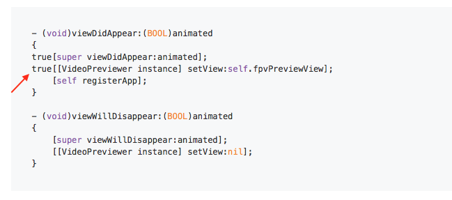
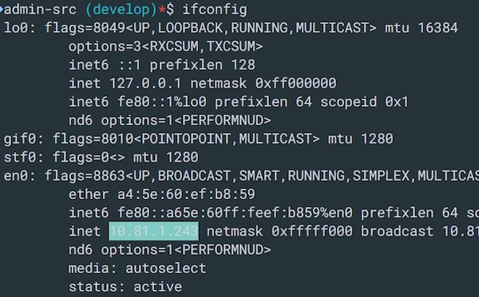

# DJI Mobile SDK Documentation Website

This repository contains source code and markdown files for the documentation page of DJI Mobile SDK Developer Website: <https://developer.dji.com/mobile-sdk/documentation/>

If you come across any mistakes or bugs in the documentations, please let us know using a **Github issue**. Moreover, please feel free to send us **Github pull request** and help us fix any issues of this documentation website.

## Tips to Maintain Documentations

#### Setup the hexo environment on Mac to preview doc content

> Note: Since it's hard to setup hexo environment in Windows, we suggest you to edit and preview the documentation on Mac here.

##### 1. Install nvm (https://github.com/creationix/nvm)

```
curl -o- https://raw.githubusercontent.com/creationix/nvm/v0.31.1/install.sh | bash
```
> **Note**: nvm is shell script, which needs to be sourced in order to be available. To have it sourced in every terminal you open, put the following line in .bash_profile and save it:
> 
> ~~~
> . ~/.nvm/nvm.sh
> ~~~
> 
> You can enter the followings commands in terminal to open the bash_profile file and edit it:
> 
> ~~~
> touch ~/.bash_profile
> open ~/.bash_profile
> ~~~

##### 2. Install stable node

```
nvm install 4.4.4
nvm use 4.4.4
```

##### 3. Install hexo

```
sudo npm install -g hexo
```

##### 4. Install node dependences

```
cd /path/to/your/project/
npm install
```

##### 5. Run the server

```
cd /path/to/your/project/
hexo server
```

##### 6. Visit <http://localhost:4000> to preview the documentation content

#### Github Repo Structure Explanation



- **sidebar_en.yml** file defines the left navigator content, "sidebar_cn.yml" is for Chinese version

- **images** folder stores images for docs

- For other folders, they are your markdown files. You can edit them directly.

- **cn** folder stores Chinese version docs, once you add any new docs for English, please copy paste the docs inside this folder to, otherwise, when the language of the website change, the page will become "404 page not found”

#### Tips for Editing Documentations

##### 1. For image path and documentation refer links, please use relative path.

 For example, refer links should be something like this:  **../get-started/index.html**
 
 Image path should be something like this: 
 
```
 
```
 
##### 2. If meet problem of mixing code block and words in markdown file, try to check if **space** (check yellow part) exist behind "~~~” or "```” as shown below:
 
 
 
otherwise, the words and codes will mix together as shown below:
 
 
 
##### 3. Don’t use **tab** in front of source code line (Use **Space** instead), otherwise, it will show as “true” in the webpage as shown below:



##### 4. Impelement Title reference

Please use 

~~~
 ## Get Started   -> Title
 [link to Get Started](#get-started)   ->title reference code
~~~

Instead of <a name="xx"></a> to jump to specific title inside a documentation. 

We have rules to get the id (get-started). For example, the id of title  **Apply to be developer & (download) DJI-SDK** should be **apply-to-be-developer-download-dji-sdk**. The id only contains character, numbers and **–** sign, for other symbols like **&**, *, (, ), etc, will be deleted. It uses **–** sign to connect the character and numbers.

##### 5. Open a website link in a new tab of web browser:

Please use the following code style to implement the feature:

~~~
<a href=“Your website link" target="_blank”>Title shown in doc</a>.
~~~

For example: 

The following code

~~~
<a href="http://www.dji.com/products/phantom" target="_blank">Phantom series</a>
~~~

will become link this: <a href="http://www.dji.com/products/phantom" target="_blank">Phantom series</a>

##### 6. Jump to another markdown file’s specific title

Example: 
 
~~~
 [Xcode Project Integration](/quick-start/index.html#Xcode-Project-Integration)
~~~
  
 Note: **quick-start** is folder name, **index.html** is the markdown file name(rename md to html), **#Xcode-Project-Integration** is the title name inside the markdown file(Please add – between words and numbers), for the name inside [] is the name shown in the doc.
   
##### 7. Share Map IP Address to Windows IE for previewing

If you want to test the documentation in IE browser, you can run hexo on Mac and share the IP address of the documentation webpage to PC.

Open terminal, enter “ifconfig”, copy the IP address as shown below:



In Windows, open IE browser and enter the following address:

~~~
http://ip:4000 
~~~

>Note: **ip** is the address you just get above.

##### 8. If you want to run two documentation pages at the same time, try to change the port as shown below:

~~~
  hexo server -p 5000/4000/3000
~~~

