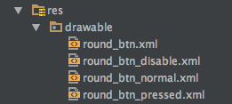
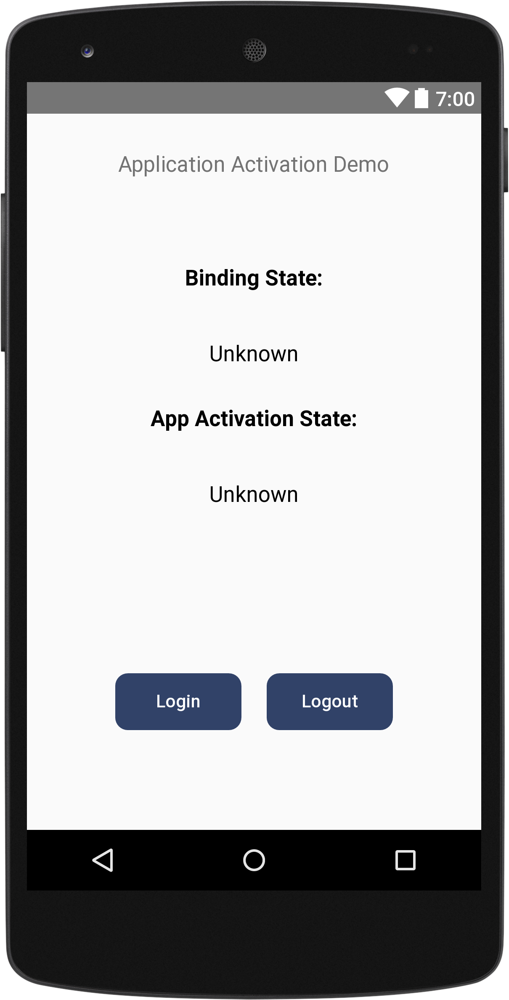
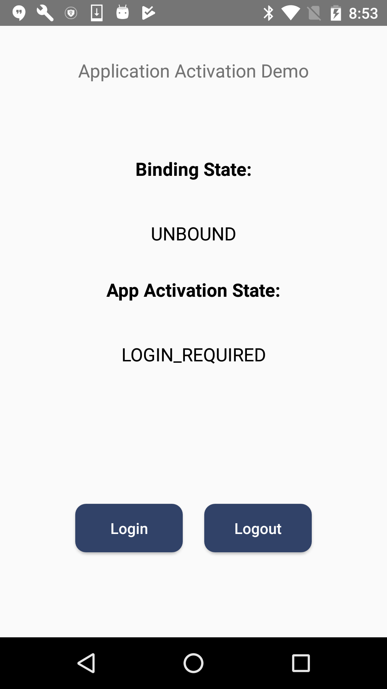
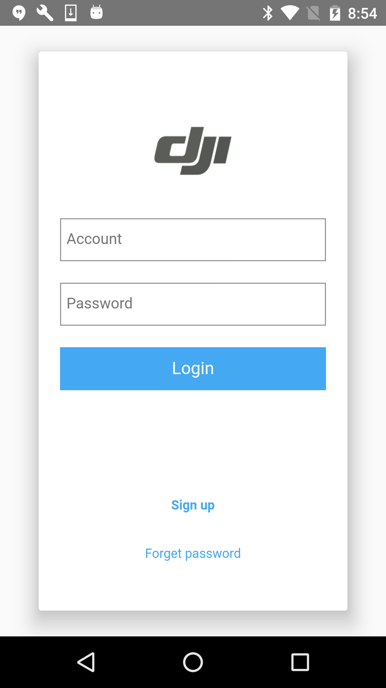
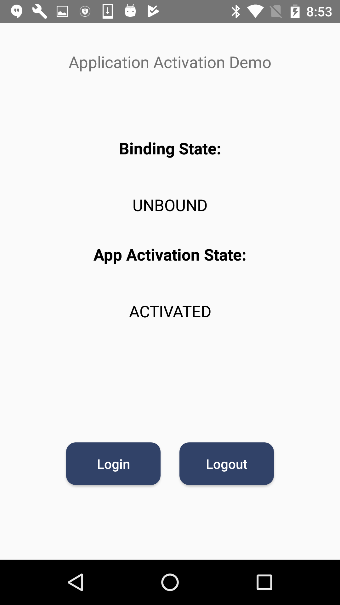
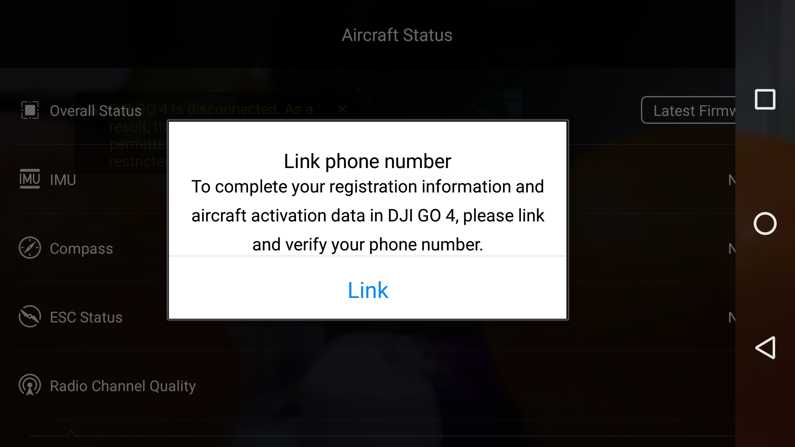
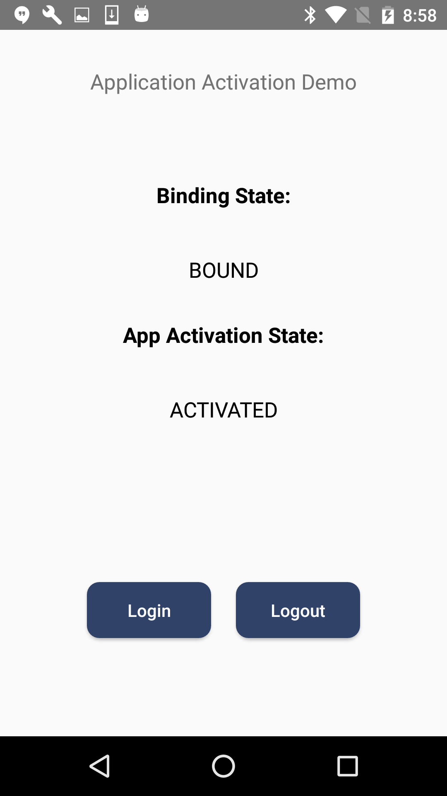

>
> Note: This tutorial only works for applications used in **China**. The same steps can be used for activating application and binding aircraft in an existing application.

You can download the tutorial's final sample project from this [Github Page](https://github.com/DJI-Mobile-SDK-Tutorials/Android-ActivationAndBindingDemo).

## Introduction

DJI aircraft firmware requires mobile applications that control DJI aircraft to be activated with the user's DJI account, if that application is being used in China. This will ensure operators use the correct set of geospatial information and flight functions for their aircrafts, as determined by their geographical location and user profile. A summary  of the activation system is:

- Users in China are required to activate their application  by logging into their DJI account at least once every three months within the application.

- Activation will be persistent in the application until the user logs out.

- Internet connection will be required to log into a DJI account.

- Outside of China, the SDK will automatically activate the application without requiring the user to log in.

- Additionally, users in China are required to bind their aircraft to their user account in DJI Go / DJI Go 4. This is required only once. If an application is not activated, the aircraft not bound (if required), or a legacy version of the SDK (< 4.1) is being used, all **camera live streams** will be **disabled**, and flight will be limited to a zone of 100m diameter and 30m height to ensure the aircraft stays within line of sight. 

## Application Activation

Now, let's create a new project in Android Studio, open Android Studio and select **File -> New -> New Project** to create a new project, named 'ActivationDemo'. Enter the company domain and package name (Here we use "com.dji.activationDemo") you want and press Next. Set the minimum SDK version as `API 18: Android 4.3 (Jelly Bean)` for "Phone and Tablet" and press Next. Then select "Empty Activity" and press Next. Lastly, leave the Activity Name as "MainActivity", and the Layout Name as "activity_main", press "Finish" to create the project.

### Registering the Application

This demo is build based on the [ImportSDKDemo](https://github.com/DJI-Mobile-SDK-Tutorials/Android-ImportAndActivateSDKInAndroidStudio) Github Sample, you can check the [Integrate SDK into Application](../application-development-workflow/workflow-integrate.html#implement-app-registration-and-sdk-callbacks) tutorial to learn how to import the Android SDK Maven Dependency and register the application using DJI Mobile SDK.

### Implementing the UI of Application

#### Working on the ConnectionActivity

Please check the [Creating an Camera Application](./index.html#4-implementing-connectionactivity-class) tutorial and the [sample project](https://github.com/DJI-Mobile-SDK-Tutorials/Android-ActivationAndBindingDemo) of this tutorial for the detail implementations.

#### Working on the MainActivity Class

The MainActivity.java file is created by Android Studio by default. Let's replace the code of it with the following:

~~~java
public class MainActivity extends AppCompatActivity implements View.OnClickListener {

    private static final String TAG = MainActivity.class.getName();
    protected Button loginBtn;
    protected Button logoutBtn;
    protected TextView bindingStateTV;
    protected TextView appActivationStateTV;

    @Override
    protected void onCreate(Bundle savedInstanceState) {
        super.onCreate(savedInstanceState);

        // When the compile and target version is higher than 22, please request the
        // following permissions at runtime to ensure the
        // SDK work well.
        if (Build.VERSION.SDK_INT >= Build.VERSION_CODES.M) {
            ActivityCompat.requestPermissions(this,
                    new String[]{Manifest.permission.WRITE_EXTERNAL_STORAGE, Manifest.permission.VIBRATE,
                            Manifest.permission.INTERNET, Manifest.permission.ACCESS_WIFI_STATE,
                            Manifest.permission.WAKE_LOCK, Manifest.permission.ACCESS_COARSE_LOCATION,
                            Manifest.permission.ACCESS_NETWORK_STATE, Manifest.permission.ACCESS_FINE_LOCATION,
                            Manifest.permission.CHANGE_WIFI_STATE, Manifest.permission.MOUNT_UNMOUNT_FILESYSTEMS,
                            Manifest.permission.READ_EXTERNAL_STORAGE, Manifest.permission.SYSTEM_ALERT_WINDOW,
                            Manifest.permission.READ_PHONE_STATE,
                    }
                    , 1);
        }

        setContentView(R.layout.activity_main);
        initUI();
    }

    @Override
    public void onResume() {
        Log.e(TAG, "onResume");
        super.onResume();
    }

    @Override
    public void onPause() {
        Log.e(TAG, "onPause");
        super.onPause();
    }

    @Override
    public void onStop() {
        Log.e(TAG, "onStop");
        super.onStop();
    }

    public void onReturn(View view){
        Log.e(TAG, "onReturn");
        this.finish();
    }

    @Override
    protected void onDestroy() {
        Log.e(TAG, "onDestroy");
        super.onDestroy();
    }

    private void initUI(){

        bindingStateTV = (TextView) findViewById(R.id.tv_binding_state_info);
        appActivationStateTV = (TextView) findViewById(R.id.tv_activation_state_info);
        loginBtn = (Button) findViewById(R.id.btn_login);
        logoutBtn = (Button) findViewById(R.id.btn_logout);
        loginBtn.setOnClickListener(this);
        logoutBtn.setOnClickListener(this);

    }

    @Override
    public void onClick(View v) {

        switch (v.getId()) {
            case R.id.btn_login:{
                break;
            }
            case R.id.btn_logout:{
                break;
            }
            default:
                break;
        }
    }
}
~~~

In the code shown above, we implement the following features:

**1.** Create the layout UI elements variables, including two TextureView `bindingStateTV` and `appActivationStateTV`, two Buttons `loginBtn`, `logoutBtn`.

**2.** Then invoke the `initUI()` method to initialize UI variables. And implement the `setOnClickListener()` method of Button for all the Buttons. 

**3.** Override the `onClick()` method to implement the three Buttons' click actions.

#### Working on the MainActivity Layout

Open the **activity_main.xml** layout file and replace the code with the following:

~~~xml
<?xml version="1.0" encoding="utf-8"?>
<RelativeLayout xmlns:android="http://schemas.android.com/apk/res/android"
    android:layout_width="match_parent"
    android:layout_height="match_parent"
    android:orientation="vertical">

    <TextView
        android:id="@+id/binding_state_label"
        android:layout_width="wrap_content"
        android:layout_height="60dp"
        android:layout_below="@+id/textView"
        android:layout_centerHorizontal="true"
        android:layout_gravity="center_horizontal"
        android:layout_marginTop="50dp"
        android:gravity="center"
        android:text="Binding State:"
        android:textColor="@color/black"
        android:textSize="17sp"
        android:textStyle="bold" />

    <TextView
        android:id="@+id/tv_binding_state_info"
        android:layout_width="220dp"
        android:layout_height="60dp"
        android:layout_below="@+id/binding_state_label"
        android:layout_centerHorizontal="true"
        android:layout_gravity="center_horizontal"
        android:gravity="center"
        android:text="Unknown"
        android:textColor="@color/black"
        android:textSize="17sp" />

    <Button
        android:id="@+id/btn_login"
        style="@style/common_button"
        android:layout_alignParentBottom="true"
        android:layout_alignStart="@+id/tv_activation_state_info"
        android:layout_gravity="center_horizontal"
        android:layout_marginBottom="79dp"
        android:text="Login" />

    <Button
        android:id="@+id/btn_logout"
        style="@style/common_button"
        android:layout_alignParentBottom="true"
        android:layout_alignEnd="@+id/tv_activation_state_info"
        android:layout_gravity="center_horizontal"
        android:layout_marginBottom="79dp"
        android:text="Logout" />

    <TextView
        android:id="@+id/textView"
        android:layout_width="wrap_content"
        android:layout_height="wrap_content"
        android:layout_marginTop="30dp"
        android:text="Application Activation Demo"
        android:textSize="17sp"
        android:layout_alignParentTop="true"
        android:layout_centerHorizontal="true" />

    <TextView
        android:id="@+id/activation_state_label"
        android:layout_width="wrap_content"
        android:layout_height="60dp"
        android:layout_below="@+id/tv_binding_state_info"
        android:layout_centerHorizontal="true"
        android:layout_marginTop="11dp"
        android:text="App Activation State:"
        android:textColor="@color/black"
        android:textSize="17sp"
        android:textStyle="bold" />

    <TextView
        android:id="@+id/tv_activation_state_info"
        android:layout_width="220dp"
        android:layout_height="60dp"
        android:layout_alignEnd="@+id/tv_binding_state_info"
        android:layout_below="@+id/activation_state_label"
        android:text="Unknown"
        android:textAlignment="center"
        android:textColor="@color/black"
        android:textSize="17sp" />

</RelativeLayout>
~~~

In the xml file, we implement the followings:

1. We implement the `RelativeLayout` element, then declare two `TextView` elements: (id:tv_binding_state_info) and (id:tv_activation_state_info) to show the activation and binding state infos. For the other three `TextView` elements, we declare them as labels to show titles.

2. Then, we create the "Login" button(id: btn_login) and "Logout" button(id: btn_logout) buttons.

For more detail configurations of the layout, please check the **activity_main.xml** file of the tutorial's Github sample project. 

#### Configuring the Resources

Once you finish the above steps, let's add some resources files to the **res** folder on the left navigator of Android Studio.

Copy the following image and xml files from the tutorial Github Sample project's **drawable** folder to your project, they are used for the button's UI:

Next, open the "colors.xml" file and add the following code at the bottom to declare the black color:

~~~xml
<color name="colorBlack">#ff000000</color>
<color name="colorWhite">#FFFFFF</color>
~~~

Moreover, open the "strings.xml" file and replace the content with the followings:

~~~xml
<resources>
    <string name="app_name">ActivationDemo</string>
    <string name="title_activity_connection">ConnectionActivity</string>
    <string name="action_settings">Settings</string>
    <string name="disconnected">Disconnected</string>
    <string name="product_information">Product Information</string>
    <string name="connection_loose">Status: No Product Connected</string>
    <string name="sdk_version">DJI SDK Version: 4.1.1</string>
</resources>
~~~

Here, we define string elements for showing text in the **ConnectionActivity** layout.

Furthermore, open the "styles.xml" file and replace the content with the followings:

~~~xml
<resources>
    <!-- Base application theme. -->
    

    <!-- Common button style -->
    
</resources>
~~~

In the code above, we change the **AppTheme** style and define a common button style.

Now, if you check the **activity_main.xml** file, you can see the preview screenshot of the MainActivity as shown below:

### Working on the AppActivationManager

In order to fetch the updated application activation state and aircraft binding state, we can use the `AppActivationManager` to add listeners to fetch this infos.

Now, let's open the "MainActivity.java" file and create a **AppActivationManager** variable `appActivationManager`, a **AppActivationStateListener** listener `activationStateListener` and a **AircraftBindingStateListener** listener `bindingStateListener`:

~~~java

private AppActivationManager appActivationManager;
private AppActivationState.AppActivationStateListener activationStateListener;
private AircraftBindingState.AircraftBindingStateListener bindingStateListener;

~~~

Next, create an `initData()` method as shown below and invoke it at the bottom of `onCreate()` method:

~~~java

private void initData(){
    setUpListener();

    appActivationManager = DJISDKManager.getInstance().getAppActivationManager();

    if (appActivationManager != null) {
        appActivationManager.addAppActivationStateListener(activationStateListener);
        appActivationManager.addAircraftBindingStateListener(bindingStateListener);
        MainActivity.this.runOnUiThread(new Runnable() {
            @Override
            public void run() {
                appActivationStateTV.setText("" + appActivationManager.getAppActivationState());
                bindingStateTV.setText("" + appActivationManager.getAircraftBindingState());
            }
        });
    }
}

~~~

In the code above, we implement the following features:

1. We initialize the `appActivationManager` variable by invoking the `getAppActivationManager` method of `DJISDKManager`.

2. Then we check if the `appActivationManager` variable exist and invoke the `addAppActivationStateListener()` method and pass the `activationStateListener` listener as param to add listener for the app activation state update. Similarly, we invoke the `addAircraftBindingStateListener()` method and pass the `bindingStateListener` listener as param to add listener for the aircraft binding state update.

3. Lastly, we invoke the `getAppActivationState()` method of `appActivationManager` to get the current app activation state and update the text value of the `appActivationStateTV`. Similarly, we invoke the `getAircraftBindingState()` method of `appActivationManager` to get the current aircraft binding state and update the text value of `bindingStateTV`.

Once you finished the steps above, let's add another two methods: `setUpListener` and `tearDownListener` to setup the listeners and invoke them in the `onResume()` and `onDestroy()` methods as shown below:

~~~java
private void setUpListener() {
    // Example of Listener
    activationStateListener = new AppActivationState.AppActivationStateListener() {
        @Override
        public void onUpdate(final AppActivationState appActivationState) {
            MainActivity.this.runOnUiThread(new Runnable() {
                @Override
                public void run() {
                    appActivationStateTV.setText("" + appActivationState);
                }
            });
        }
    };

    bindingStateListener = new AircraftBindingState.AircraftBindingStateListener() {

        @Override
        public void onUpdate(final AircraftBindingState bindingState) {
            MainActivity.this.runOnUiThread(new Runnable() {
                @Override
                public void run() {
                    bindingStateTV.setText("" + bindingState);
                }
            });
        }
    };
}

private void tearDownListener() {
    if (activationStateListener != null) {
        appActivationManager.removeAppActivationStateListener(activationStateListener);
        MainActivity.this.runOnUiThread(new Runnable() {
            @Override
            public void run() {
                appActivationStateTV.setText("Unknown");
            }
        });
    }
    if (bindingStateListener !=null) {
        appActivationManager.removeAircraftBindingStateListener(bindingStateListener);
        MainActivity.this.runOnUiThread(new Runnable() {
            @Override
            public void run() {
                bindingStateTV.setText("Unknown");
            }
        });
    }
}

@Override
public void onResume() {
    Log.e(TAG, "onResume");
    setUpListener();
    super.onResume();
}

@Override
protected void onDestroy() {
    Log.e(TAG, "onDestroy");
    tearDownListener();
    super.onDestroy();
}
~~~

Here, we implement the following features:

1. In the `setUpListener()` method, we initialize the `activationStateListener` and `bindingStateListener` listeners and override their `onUpdate()` methods to fetch the updated `AppActivationState` and `AircraftBindingState` enum values. Then use them to update the text values of the `appActivationStateTV` and `bindingStateTV` text views. 

2. Next, since we have added the listeners for the app activation state and aircraft binding state update in the `appActivationManager`, we also need to remove them. So in the `tearDownListener()` method, we invoke the `removeAppActivationStateListener` and `removeAircraftBindingStateListener` methods of `appActivationManager` to remove the listeners. Moreover, update the text values of `appActivationStateTV` and `bindingStateTV` textViews to "Unknown". 

3. Lastly, override the `onResume()` method and invoke the `setUpListener()` to setup the listeners. Then override the `onDestroy()` method and invoke the `tearDownListener()` method to remove the listeners in `appActivationManager`.

### Working on Login and Logout DJI User Account

In order to activate the application, we need to login a DJI user account. Now let's create the following methods and invoke them in the `onClick()` method:

~~~java
private void loginAccount(){

    UserAccountManager.getInstance().logIntoDJIUserAccount(this,
            new CommonCallbacks.CompletionCallbackWith<UserAccountState>() {
                @Override
                public void onSuccess(final UserAccountState userAccountState) {
                    showToast("Login Success");
                }
                @Override
                public void onFailure(DJIError error) {
                    showToast("Login Error:"
                            + error.getDescription());
                }
            });

}

private void logoutAccount(){
    UserAccountManager.getInstance().logoutOfDJIUserAccount(new CommonCallbacks.CompletionCallback() {
        @Override
        public void onResult(DJIError error) {
            if (null == error) {
                showToast("Logout Success");
            } else {
                showToast("Logout Error:"
                        + error.getDescription());
            }
        }
    });
}

@Override
public void onClick(View v) {

    switch (v.getId()) {
        case R.id.btn_login:{
            loginAccount();
            break;
        }
        case R.id.btn_logout:{
            logoutAccount();
            break;
        }
        default:
            break;
    }
}
~~~

In the code above, we implement the following things:

1. In the `loginAccount()` method, we invoke the `logIntoDJIUserAccount()` method of `UserAccountManager` to show the login dialog. And override the `onSuccess()` and `onFailure()` methods to show the result messages by invoking the `showToast()` method.

2. Next, in the `logoutAccount()` method, we invoke the `logoutOfDJIUserAccount()` method of `UserAccountManager` to logout the DJI user account. Also, override the `onResult()` method to show the result messages.

For more implementation details, please check this tutorial's Github Sample Project.

Now, let's build and run the project, connect the demo application to your aircraft (Please check the [Run Application](../application-development-workflow/workflow-run.html) for more details) and check the features we have implemented so far.

Here are the steps to activate the application:

1. If the application is not activated, you may see the following screenshot:

2. Now, let's press the **Login** button and fill in your email address and password to login and activate the application:

3. If everything goes well, you may see the `appActivationStateTV`'s text value changes to "Activated":

## Aircraft Binding

After you finish activating the application, you can now connect your aircraft to [DJI Go 4](https://play.google.com/store/apps/details?id=dji.go.v4)/[DJI Go](https://play.google.com/store/apps/details?id=dji.pilot) app and bind your aircraft to your DJI account. This is required only once. If you press the **Enter Device** button, you may see an alertView pop up as shown below:

Now, press the **Link** button to finish the mobile phone link and verification process. After that, connect the aircraft back to the application, you may see the `bindingStateTV`'s text value has changed to "Bound" as shown below:

Congratulations! Now, your mobile application and aircraft can be used in China without issues. In another word, your application can now see the aircraft's camera live streams and the flight will not be limited to a cylinder of 100m diameter and 30m height.

### Summary

In this tutorial, you’ve learned how to use DJI Mobile SDK to activate the SDK mobile application and use DJI Go app to bind the aircraft to your DJI Acccount. The same steps can be used for activating application and binding aircraft in your application. Hope you enjoy this tutorial, and stay tuned for our next one!

