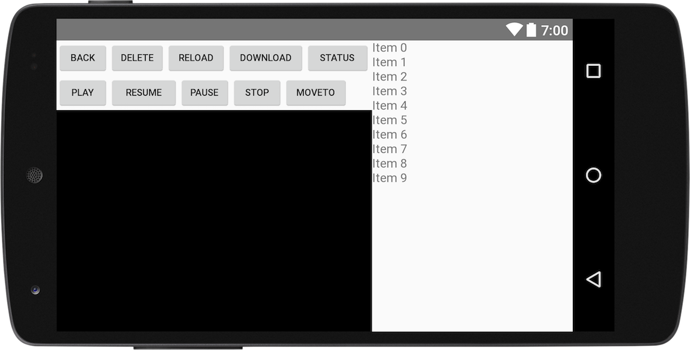
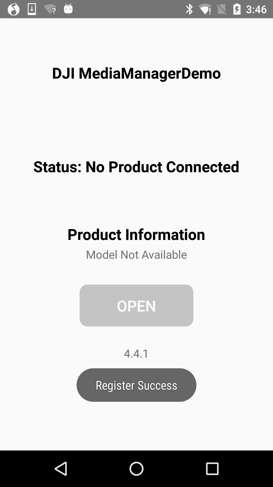
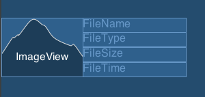
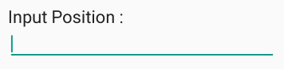

*If you come across any mistakes or bugs in this tutorial, please let us know using a Github issue, a post on the DJI forum. Please feel free to send us Github pull request and help us fix any issues.*

---

In this tutorial, you will learn how to use the `MediaManager` to interact with the file system on the SD card of the aircraft's camera. By the end of this tutorial, you will have an app that you can use to preview photos, play videos, download or delete files and so on.

In order for our app to manage photos and videos, however, it must first be able to take and record them. Fortunately, by using DJI Android UI Library, you can implement shooting photos and recording videos functionalities easily with standard DJI Go UIs.

You can download the tutorial's final sample project from this [Github Page](https://github.com/DJI-Mobile-SDK-Tutorials/Android-MediaManagerDemo).

We use Mavic Pro and Nexus 5 as an example to make this demo. For more details of customizing the layouts for iPhone devices, please check the tutorial's Github Sample Project.

## Application Activation and Aircraft Binding in China

 For DJI SDK mobile application used in China, it's required to activate the application and bind the aircraft to the user's DJI account.

 If an application is not activated, the aircraft not bound (if required), or a legacy version of the SDK (< 4.1) is being used, all **camera live streams** will be disabled, and flight will be limited to a zone of 100m diameter and 30m height to ensure the aircraft stays within line of sight.

 To learn how to implement this feature, please check this tutorial [Application Activation and Aircraft Binding](./ActivationAndBinding.html).

## Importing UI Library Maven Dependency

Now, create a new project in Android Studio, open Android Studio and select **File -> New -> New Project** to create a new project, named 'MediaManagerDemo'. Enter the company domain and package name (Here we use "com.dji.mediaManagerDemo") you want and press Next. Set the minimum SDK version as `API 19: Android 4.4 (KitKat)` for "Phone and Tablet" and press Next. Then select "Empty Activity" and press Next. Lastly, leave the Activity Name as "MainActivity", and the Layout Name as "activity_main", press "Finish" to create the project.

Please check the [Getting Started with UI Library](../android-tutorials/UILibraryDemo.html#import-maven-dependency) tutorial to learned how to import the DJI Android UI Library Maven Dependency to your project. If you haven't read that previously, please take a look at it and implement the related features. Once you've done that, continue to implement the next features.

## Implementing the UI of Application

### Working on the ConnectionActivity Layout

Please check the [Creating an Camera Application](./index.html#5-implementing-the-connectionactivity-layout) tutorial for the detail implementations.

### Building the Default Layout using UI Library

Now, create a new Empty Activity class with the name of "DefaultLayoutActivity" in the `com.dji.mediaManagerDemo` package. Replace the code with the following, remember to import the related classes as Android Studio suggested:

~~~java
public class DefaultLayoutActivity extends AppCompatActivity implements View.OnClickListener{

    private Button mMediaManagerBtn;

    @Override
    protected void onCreate(Bundle savedInstanceState) {
        super.onCreate(savedInstanceState);
        setContentView(R.layout.activity_default_layout);

        mMediaManagerBtn = (Button)findViewById(R.id.btn_mediaManager);
        mMediaManagerBtn.setOnClickListener(this);

    }

    @Override
    public void onClick(View v) {

        switch (v.getId()) {
            case R.id.btn_mediaManager: {
                Intent intent = new Intent(this, MainActivity.class);
                startActivity(intent);
                break;
            }
            default:
                break;
        }
    }
}
~~~

In the code above, we create a Button variable `mMediaManagerBtn` and initialize it in the `onCreate()` method. Moreover, implement the `onClick()` method of the Button and invoke `startActivity()` method to start the `MainActivity`. 

Next, continue to open the "activity_default_layout.xml" file, and replace the code with the following:

~~~xml
<?xml version="1.0" encoding="utf-8"?>
<RelativeLayout xmlns:android="http://schemas.android.com/apk/res/android"
    xmlns:tools="http://schemas.android.com/tools"
    android:id="@+id/activity_main"
    android:layout_width="match_parent"
    android:layout_height="match_parent"
    android:background="@color/background_blue"
    android:orientation="horizontal"
    tools:context=".MainActivity">

    <!-- Widget to see first person view (FPV) -->
    <dji.ui.widget.FPVWidget
        android:layout_width="match_parent"
        android:layout_height="match_parent"/>

    <dji.ui.widget.FPVOverlayWidget
        android:layout_width="match_parent"
        android:layout_height="match_parent"/>

    <!-- Widgets in top status bar -->
    <LinearLayout
        android:id="@+id/signal"
        android:layout_width="match_parent"
        android:layout_height="25dp"
        android:background="@color/dark_gray"
        android:orientation="horizontal">

        <dji.ui.widget.PreFlightStatusWidget
            android:id="@+id/status"
            android:layout_width="238dp"
            android:layout_height="25dp"/>

        <dji.ui.widget.FlightModeWidget
            android:layout_width="103dp"
            android:layout_height="22dp"/>

        <dji.ui.widget.GPSSignalWidget
            android:layout_width="44dp"
            android:layout_height="22dp"/>

        <dji.ui.widget.VisionWidget
            android:layout_width="22dp"
            android:layout_height="22dp"/>

        <dji.ui.widget.RemoteControlSignalWidget
            android:layout_width="38dp"
            android:layout_height="22dp"/>

        <dji.ui.widget.VideoSignalWidget
            android:layout_width="38dp"
            android:layout_height="22dp"/>

        <dji.ui.widget.WiFiSignalWidget
            android:layout_width="22dp"
            android:layout_height="20dp"/>

        <dji.ui.widget.BatteryWidget
            android:layout_width="56dp"
            android:layout_height="22dp"/>

        <dji.ui.widget.ConnectionWidget
            android:layout_marginTop="5dp"
            android:layout_width="22dp"
            android:layout_height="22dp"/>
    </LinearLayout>

    <LinearLayout
        android:id="@+id/camera"
        android:layout_width="wrap_content"
        android:layout_height="wrap_content"
        android:layout_below="@id/signal"
        android:layout_centerHorizontal="true"
        android:layout_margin="12dp"
        android:background="@color/dark_gray"
        android:orientation="horizontal">

        <dji.ui.widget.AutoExposureLockWidget
            android:layout_width="25dp"
            android:layout_height="25dp"/>

        <dji.ui.widget.FocusExposureSwitchWidget
            android:layout_width="25dp"
            android:layout_height="25dp"/>

        <dji.ui.widget.FocusModeWidget
            android:layout_width="25dp"
            android:layout_height="25dp"/>

        <dji.ui.widget.config.CameraConfigISOWidget
            android:layout_width="50dp"
            android:layout_height="25dp"/>

        <dji.ui.widget.config.CameraConfigShutterWidget
            android:layout_width="50dp"
            android:layout_height="25dp"/>

        <dji.ui.widget.config.CameraConfigApertureWidget
            android:layout_width="50dp"
            android:layout_height="25dp"/>

        <dji.ui.widget.config.CameraConfigEVWidget
            android:layout_width="50dp"
            android:layout_height="25dp"/>

        <dji.ui.widget.config.CameraConfigWBWidget
            android:layout_width="50dp"
            android:layout_height="25dp"/>

        <dji.ui.widget.CameraConfigStorageWidget
            android:layout_width="108dp"
            android:layout_height="25dp"/>

    </LinearLayout>
    <dji.ui.widget.RemainingFlightTimeWidget
        android:layout_alignParentTop="true"
        android:layout_marginTop="18dp"
        android:layout_width="match_parent"
        android:background="@color/transparent"
        android:layout_height="20dp"/>
    
    <LinearLayout
        android:layout_width="match_parent"
        android:layout_height="wrap_content"
        android:layout_alignParentBottom="true"
        android:orientation="horizontal"
        android:padding="12dp">

        <dji.ui.widget.dashboard.DashboardWidget
            android:id="@+id/Compass"
            android:layout_width="405dp"
            android:layout_height="91dp"
            android:layout_marginRight="12dp"/>

    </LinearLayout>
    
    <!--Take off and return home buttons on left -->
    <LinearLayout
        android:layout_width="40dp"
        android:layout_height="wrap_content"
        android:layout_centerVertical="true"
        android:layout_marginStart="12dp"
        android:orientation="vertical">

        <dji.ui.widget.TakeOffWidget
            android:layout_width="40dp"
            android:layout_height="40dp"
            android:layout_marginBottom="12dp"/>

        <dji.ui.widget.ReturnHomeWidget
            android:layout_width="40dp"
            android:layout_height="40dp"
            android:layout_marginTop="12dp"/>
    </LinearLayout>

    <dji.ui.widget.controls.CameraControlsWidget
        android:id="@+id/CameraCapturePanel"
        android:layout_width="50dp"
        android:layout_height="213dp"
        android:layout_alignParentRight="true"
        android:layout_below="@id/camera" />

    <dji.ui.panel.CameraSettingExposurePanel
        android:id="@+id/CameraExposureMode"
        android:layout_width="180dp"
        android:layout_height="263dp"
        android:layout_below="@id/camera"
        android:layout_marginLeft="360dp"
        android:layout_toLeftOf="@+id/CameraCapturePanel"
        android:background="@color/transparent"
        android:gravity="center"
        android:visibility="invisible" />

    <dji.ui.panel.CameraSettingAdvancedPanel
        android:id="@+id/CameraAdvancedSetting"
        android:layout_width="180dp"
        android:layout_height="263dp"
        android:layout_below="@id/camera"
        android:layout_marginLeft="360dp"
        android:layout_toLeftOf="@+id/CameraCapturePanel"
        android:background="@color/transparent"
        android:gravity="center"
        android:visibility="invisible" />
    
    <!-- Pre-flight checklist panel -->
    <dji.ui.panel.PreFlightCheckListPanel
        android:id="@+id/PreflightCheckView"
        android:layout_width="400dp"
        android:layout_height="wrap_content"
        android:layout_below="@id/signal"
        android:visibility="gone"/>

    <LinearLayout
        android:layout_width="match_parent"
        android:layout_height="wrap_content"
        android:orientation="horizontal"
        android:padding="12dp"
        android:layout_alignParentBottom="true">

        <Button
            android:id="@+id/btn_mediaManager"
            android:layout_width="38dp"
            android:layout_height="30dp"
            android:layout_alignParentBottom="true"
            android:layout_alignStart="@+id/CameraCapturePanel"
            android:layout_below="@id/CameraCapturePanel"
            android:layout_marginLeft="530dp"
            android:background="@drawable/playback"
            android:visibility="visible" />

    </LinearLayout>
    
</RelativeLayout>
~~~

In the xml file above, we implement the UI Library's default layout. For more details, please check the [Getting Started with UI Library](http://developer.dji.com/mobile-sdk/documentation/android-tutorials/UILibraryDemo.html#building-the-default-layout-using-ui-library) tutorial.

Once you finished the steps above, open the "color.xml" file and replace the content with the following:

~~~xml
<?xml version="1.0" encoding="utf-8"?>
<resources>
    <color name="colorPrimary">#3F51B5</color>
    <color name="colorPrimaryDark">#303F9F</color>
    <color name="colorAccent">#FF4081</color>
    <color name="black_overlay">#000000</color>
    <color name="colorWhite">#FFFFFF</color>
    <color name="background_blue">#242d34</color>
    <color name="transparent">#00000000</color>
    <color name="dark_gray">#80000000</color>
</resources>
~~~

Moreover, open the "styles.xml" file and replace the content with the following:

~~~xml
<resources>
    <!-- Base application theme. -->
    
</resources>
~~~

### Working on the MainActivity Layout

Once you finished the steps above, let's open the "activity_main.xml" file, and replace the content with the following:

~~~xml
<?xml version="1.0" encoding="utf-8"?>
<RelativeLayout xmlns:android="http://schemas.android.com/apk/res/android"
    xmlns:app="http://schemas.android.com/apk/res-auto"
    xmlns:tools="http://schemas.android.com/tools"
    android:layout_width="match_parent"
    android:layout_height="match_parent"
    tools:context="com.dji.mediaManagerDemo.MainActivity">

    <Button
        android:id="@+id/back_btn"
        android:layout_width="60dp"
        android:layout_height="40dp"
        android:layout_alignParentStart="true"
        android:layout_alignParentTop="true"
        android:text="Back"
        android:textSize="11sp" />

    <Button
        android:id="@+id/delete_btn"
        android:layout_width="65dp"
        android:layout_height="40dp"
        android:layout_alignParentTop="true"
        android:layout_toEndOf="@+id/back_btn"
        android:text="Delete"
        android:textSize="11sp" />

    <Button
        android:id="@+id/reload_btn"
        android:layout_width="70dp"
        android:layout_height="40dp"
        android:layout_alignParentTop="true"
        android:layout_toEndOf="@+id/delete_btn"
        android:text="Reload"
        android:textSize="11sp" />

    <Button
        android:id="@+id/download_btn"
        android:layout_width="90dp"
        android:layout_height="40dp"
        android:layout_alignParentTop="true"
        android:layout_toEndOf="@+id/reload_btn"
        android:text="Download"
        android:textSize="11sp" />

    <Button
        android:id="@+id/status_btn"
        android:layout_width="75dp"
        android:layout_height="40dp"
        android:layout_alignParentTop="true"
        android:layout_toEndOf="@+id/download_btn"
        android:text="Status"
        android:textSize="11sp" />

    <Button
        android:id="@+id/play_btn"
        android:layout_width="60dp"
        android:layout_height="40dp"
        android:layout_alignParentStart="true"
        android:layout_below="@+id/back_btn"
        android:text="Play"
        android:textSize="11sp" />

    <Button
        android:id="@+id/resume_btn"
        android:layout_width="80dp"
        android:layout_height="40dp"
        android:layout_below="@+id/back_btn"
        android:layout_toEndOf="@+id/play_btn"
        android:text="Resume"
        android:textSize="11sp" />

    <Button
        android:id="@+id/pause_btn"
        android:layout_width="60dp"
        android:layout_height="40dp"
        android:layout_below="@+id/reload_btn"
        android:layout_toEndOf="@+id/resume_btn"
        android:text="Pause"
        android:textSize="11sp" />

    <Button
        android:id="@+id/stop_btn"
        android:layout_width="60dp"
        android:layout_height="40dp"
        android:layout_below="@+id/reload_btn"
        android:layout_toEndOf="@+id/pause_btn"
        android:text="Stop"
        android:textSize="11sp" />

    <Button
        android:id="@+id/moveTo_btn"
        android:layout_width="75dp"
        android:layout_height="40dp"
        android:layout_below="@+id/reload_btn"
        android:layout_toEndOf="@+id/stop_btn"
        android:text="MoveTo"
        android:textSize="11sp" />

    <!-- Widget to see first person view (FPV) -->
    <dji.ui.widget.FPVWidget
        android:layout_width="match_parent"
        android:layout_height="match_parent"
        android:layout_below="@+id/play_btn"
        android:layout_toStartOf="@+id/pointing_drawer_sd"
        android:id="@+id/FPVWidget" />

    <ImageView
        android:id="@+id/imageView"
        android:layout_width="match_parent"
        android:layout_height="match_parent"
        android:layout_below="@+id/play_btn"
        android:layout_marginTop="0dp"
        android:layout_toStartOf="@+id/pointing_drawer_sd"
        android:background="@color/black_overlay"
        android:visibility="invisible" />

    <android.support.v7.widget.RecyclerView
        android:id="@+id/filelistView"
        android:layout_width="250dp"
        android:layout_height="match_parent"
        android:layout_marginLeft="0dp"
        android:layout_toEndOf="@+id/FPVWidget" />

    <SlidingDrawer
        android:id="@+id/pointing_drawer_sd"
        android:layout_width="230dp"
        android:layout_height="match_parent"
        android:layout_alignParentRight="true"
        android:content="@+id/pointing_drawer_content"
        android:handle="@+id/pointing_handle"
        android:orientation="horizontal">

        <ImageView
            android:id="@id/pointing_handle"
            android:layout_width="wrap_content"
            android:layout_height="wrap_content" />

        <RelativeLayout
            android:id="@+id/pointing_drawer_content"
            android:layout_width="250dp"
            android:layout_height="match_parent"
            android:layout_centerVertical="true"
            android:layout_marginLeft="340dp"
            android:background="@color/black_overlay">

            <ScrollView
                android:layout_width="250dp"
                android:layout_height="fill_parent"
                android:layout_alignParentEnd="true"
                android:layout_alignParentRight="true"
                android:layout_centerVertical="true"
                android:clickable="false"
                android:scrollbars="vertical">

                <TextView
                    android:id="@+id/pointing_push_tv"
                    style="@style/status_text"
                    android:layout_width="200dp"
                    android:layout_height="wrap_content"
                    android:layout_marginLeft="30dp"
                    android:scrollbars="vertical"
                    android:text="@string/push_info" />
            </ScrollView>
        </RelativeLayout>
    </SlidingDrawer>
</RelativeLayout>
~~~

In the xml above, we define the following UI elements:

1. Create 10 **Button**s with the names of "BACK", "DELETE", "RELOAD", "DOWNLOAD", "STATUS", "PLAY", "RESUME", "PAUSE", "STOP" and "MOVETO" on the upper left corner.
2. Create a **FPVWidget** widget below the Buttons to show the live camera video stream. 
3. Create an **ImageView** to show the downloaded photo and overlay it over the **FPVWidget**. 
4. Create a **RecyclerView** on the right side to show the info of media files list.
5. Lastly, create a **ScrollView** with a **TextView** to show the video playback state info.

Here is a screenshot of the implemented UI of MainActivity:

### Initializing the UI Elements in MainActivity

Once you finished the steps above, let's open the "MainActivity.java" file and replace the code with the following:

~~~java

public class MainActivity extends Activity implements View.OnClickListener {

    private static final String TAG = MainActivity.class.getName();
    private static MainActivity activity;

    private Button mBackBtn, mDeleteBtn, mReloadBtn, mDownloadBtn, mStatusBtn;
    private Button mPlayBtn, mResumeBtn, mPauseBtn, mStopBtn, mMoveToBtn;
    private RecyclerView listView;
    private SlidingDrawer mPushDrawerSd;
    private ImageView mDisplayImageView;
    private TextView mPushTv;

    @Override
    protected void onCreate(Bundle savedInstanceState) {
        super.onCreate(savedInstanceState);
        setContentView(R.layout.activity_main);
        initUI();
    }

    @Override
    protected void onResume() {
        super.onResume();
    }

    @Override
    protected void onPause() {
        super.onPause();
    }

    @Override
    protected void onStop() {
        super.onStop();
    }

    @Override
    protected void onDestroy() {    
        super.onDestroy();
    }

    void initUI() {

        //Init RecyclerView
        listView = (RecyclerView) findViewById(R.id.filelistView);
        LinearLayoutManager layoutManager = new LinearLayoutManager(MainActivity.this, OrientationHelper.VERTICAL,false);
        listView.setLayoutManager(layoutManager);

        mPushDrawerSd = (SlidingDrawer)findViewById(R.id.pointing_drawer_sd);
        mPushTv = (TextView)findViewById(R.id.pointing_push_tv);
        mBackBtn = (Button) findViewById(R.id.back_btn);
        mDeleteBtn = (Button) findViewById(R.id.delete_btn);
        mDownloadBtn = (Button) findViewById(R.id.download_btn);
        mReloadBtn = (Button) findViewById(R.id.reload_btn);
        mStatusBtn = (Button) findViewById(R.id.status_btn);
        mPlayBtn = (Button) findViewById(R.id.play_btn);
        mResumeBtn = (Button) findViewById(R.id.resume_btn);
        mPauseBtn = (Button) findViewById(R.id.pause_btn);
        mStopBtn = (Button) findViewById(R.id.stop_btn);
        mMoveToBtn = (Button) findViewById(R.id.moveTo_btn);
        mDisplayImageView = (ImageView) findViewById(R.id.imageView);
        mDisplayImageView.setVisibility(View.VISIBLE);

        mBackBtn.setOnClickListener(this);
        mDeleteBtn.setOnClickListener(this);
        mDownloadBtn.setOnClickListener(this);
        mReloadBtn.setOnClickListener(this);
        mDownloadBtn.setOnClickListener(this);
        mStatusBtn.setOnClickListener(this);
        mPlayBtn.setOnClickListener(this);
        mResumeBtn.setOnClickListener(this);
        mPauseBtn.setOnClickListener(this);
        mStopBtn.setOnClickListener(this);
        mMoveToBtn.setOnClickListener(this);

    }

    @Override
    public void onClick(View v) {
        switch (v.getId()) {
            case R.id.back_btn: {
                break;
            }
            case R.id.delete_btn:{
                break;
            }
            case R.id.reload_btn: {
                break;
            }
            case R.id.download_btn: {
                break;
            }
            case R.id.status_btn: {
                break;
            }
            case R.id.play_btn: {
                break;
            }
            case R.id.resume_btn: {
                break;
            }
            case R.id.pause_btn: {
                break;
            }
            case R.id.stop_btn: {
                break;
            }
            case R.id.moveTo_btn: {
                break;
            }
            default:
                break;
        }
    }
}
~~~

In the code above, we implement the following:

1. Create variables for **Button**, **RecyclerView**, **SlidingDrawer**, **ImageView** and **TextView**.
2. Next, create an `initUI()` method to initialize the UI elements and invoke the `setOnClickListener` method of **Button**s to set `MainActivity` as the listener. Then invoke the `initUI()` method in the `onCreate()` method.
3. Lastly, implement the `onClick()` method for all the **Button**s.

## Registering the Application

After you finish the above steps, let's register our application with the **App Key** you apply from DJI Developer Website. If you are not familiar with the App Key, please check the [Get Started](../quick-start/index.html).

**1.** Let's open the AndroidManifest.xml file and add the following elements on top of the **application** element:

~~~xml
<uses-permission android:name="android.permission.BLUETOOTH" />
<uses-permission android:name="android.permission.BLUETOOTH_ADMIN" />
<uses-permission android:name="android.permission.VIBRATE" />
<uses-permission android:name="android.permission.INTERNET" />
<uses-permission android:name="android.permission.ACCESS_WIFI_STATE" />
<uses-permission android:name="android.permission.WAKE_LOCK" />
<uses-permission android:name="android.permission.ACCESS_COARSE_LOCATION" />
<uses-permission android:name="android.permission.ACCESS_NETWORK_STATE" />
<uses-permission android:name="android.permission.ACCESS_FINE_LOCATION" />
<uses-permission android:name="android.permission.CHANGE_WIFI_STATE" />
<uses-permission android:name="android.permission.MOUNT_UNMOUNT_FILESYSTEMS" />
<uses-permission android:name="android.permission.WRITE_EXTERNAL_STORAGE" />
<uses-permission android:name="android.permission.READ_EXTERNAL_STORAGE" />
<uses-permission android:name="android.permission.SYSTEM_ALERT_WINDOW" />
<uses-permission android:name="android.permission.READ_PHONE_STATE" />

<uses-feature android:name="android.hardware.camera" />
<uses-feature android:name="android.hardware.camera.autofocus" />
<uses-feature
    android:name="android.hardware.usb.host"
    android:required="false" />
<uses-feature
    android:name="android.hardware.usb.accessory"
    android:required="true" />
~~~

Here, we request permissions that the application must be granted in order for it to register DJI SDK correctly. Also, we declare the camera and USB hardwares which are used by the application.

Moreover, let's add the following elements as childs of element on top of the "MainActivity" activity element as shown below:

~~~xml
<!-- DJI SDK -->
<uses-library android:name="com.android.future.usb.accessory" />

<meta-data
    android:name="com.dji.sdk.API_KEY"
    android:value="Please enter your APP Key here." />

<activity
    android:name="dji.sdk.sdkmanager.DJIAoaControllerActivity"
    android:theme="@android:style/Theme.Translucent">
    <intent-filter>
        <action android:name="android.hardware.usb.action.USB_ACCESSORY_ATTACHED" />
    </intent-filter>

    <meta-data
        android:name="android.hardware.usb.action.USB_ACCESSORY_ATTACHED"
        android:resource="@xml/accessory_filter" />
</activity>

<service android:name="dji.sdk.sdkmanager.DJIGlobalService" />
<!-- DJI SDK -->
~~~

In the code above, you should substitute your **App Key** of the application for "Please enter your App Key here." in the **value** attribute under the `android:name="com.dji.sdk.API_KEY"` attribute.

Lastly, update the "MainActivity" and "ConnectionActivity" activity elements as shown below:

~~~xml
<activity
    android:name=".ConnectionActivity"
    android:screenOrientation="portrait">
    <intent-filter>
        <action android:name="android.intent.action.MAIN" />

        <category android:name="android.intent.category.LAUNCHER" />
    </intent-filter>
</activity>
<activity android:name=".DefaultLayoutActivity"
    android:screenOrientation="landscape"></activity>
<activity
    android:name=".MainActivity"
    android:screenOrientation="landscape"></activity>
~~~

In the code above, we add the attributes of "android:screenOrientation" to set "ConnectionActivity" as **portrait**, set "DefaultLayoutActivity" as **landscape** and set "MainActivity" as **landscape**.

**2.** After you finish the steps above, open the "DemoApplication.java" file and replace the code with the same file in the Github Source Code, here we explain the important parts of it:

~~~java
    @Override
    public void onCreate() {
        super.onCreate();
        mHandler = new Handler(Looper.getMainLooper());

        //Check the permissions before registering the application for android system 6.0 above.
        int permissionCheck = ContextCompat.checkSelfPermission(this, android.Manifest.permission.WRITE_EXTERNAL_STORAGE);
        int permissionCheck2 = ContextCompat.checkSelfPermission(this, android.Manifest.permission.READ_PHONE_STATE);
        if (Build.VERSION.SDK_INT < Build.VERSION_CODES.M || (permissionCheck == 0 && permissionCheck2 == 0)) {
            //This is used to start SDK services and initiate SDK.
            DJISDKManager.getInstance().registerApp(this, mDJISDKManagerCallback);
        } else {
            Toast.makeText(getApplicationContext(), "Please check if the permission is granted.", Toast.LENGTH_LONG).show();
        }
    }

    /**
     * When starting SDK services, an instance of interface DJISDKManager.DJISDKManagerCallback will be used to listen to
     * the SDK Registration result and the product changing.
     */

    private DJISDKManager.SDKManagerCallback mDJISDKManagerCallback = new DJISDKManager.SDKManagerCallback() {

        //Listens to the SDK registration result
        @Override
        public void onRegister(DJIError error) {
            if(error == DJISDKError.REGISTRATION_SUCCESS) {
                DJISDKManager.getInstance().startConnectionToProduct();
                Handler handler = new Handler(Looper.getMainLooper());
                handler.post(new Runnable() {
                    @Override
                    public void run() {
                        Toast.makeText(getApplicationContext(), "Register Success", Toast.LENGTH_LONG).show();
                    }
                });
            } else {
                Handler handler = new Handler(Looper.getMainLooper());
                handler.post(new Runnable() {

                    @Override
                    public void run() {
                        Toast.makeText(getApplicationContext(), "Register sdk fails, check network is available", Toast.LENGTH_LONG).show();
                    }
                });

            }
            Log.e("TAG", error.toString());
        }

        //Listens to the connected product changing, including two parts, component changing or product connection changing.
        @Override
        public void onProductChange(BaseProduct oldProduct, BaseProduct newProduct) {

            mProduct = newProduct;
            if(mProduct != null) {
                mProduct.setBaseProductListener(mDJIBaseProductListener);
            }

            notifyStatusChange();
        }
    };

    private BaseProduct.BaseProductListener mDJIBaseProductListener = new BaseProduct.BaseProductListener() {

        @Override
        public void onComponentChange(BaseProduct.ComponentKey key, BaseComponent oldComponent, BaseComponent newComponent) {

            if(newComponent != null) {
                newComponent.setComponentListener(mDJIComponentListener);
            }
            notifyStatusChange();
        }

        @Override
        public void onConnectivityChange(boolean isConnected) {

            notifyStatusChange();
        }

    };
~~~

Here, we implement several features:
  
1. We override the `onCreate()` method to invoke the `registerApp()` method of DJISDKManager to register the application.
2. Implement the two interface methods of `SDKManagerCallback`. You can use the `onRegister()` method to check the Application registration status and show text message here. Using the `onProductChange()` method, we can check the product connection status and invoke the `notifyStatusChange()` method to notify status changes.
3. Implement the two interface methods of `BaseProductListener`. You can use the `onComponentChange()` method to check the product component change status and invoke the `notifyStatusChange()` method to notify status changes. Also, you can use the `onConnectivityChange()` method to notify the product connectivity changes.

**3.** Lastly, open the "ConnectionActivity.java" file and replace the code with the same file in the Github Source Code.

Now let's build and run the project and install it to your Android device. If everything goes well, you should see the "Register Success" textView like the following screenshot when you register the app successfully.

## Refreshing Media File List

### Initializing MediaManager

Now, continue to work on the "MainActivity.java" file. Firstly, add the following codes at the beginning of the `MainActivity` class:

~~~java
private FileListAdapter mListAdapter;
private List<MediaFile> mediaFileList = new ArrayList<MediaFile>();
private MediaManager mMediaManager;
private MediaManager.FileListState currentFileListState = MediaManager.FileListState.UNKNOWN;
private ProgressDialog mLoadingDialog;
private FetchMediaTaskScheduler scheduler;
private int lastClickViewIndex =-1;
private View lastClickView;
~~~

In the code above, we create variables for the `FileListAdapter`, `List<MediaFile>`, `MediaManager`, `FetchMediaTaskScheduler` and so on. 

Next, improve the `onDestroy()` method with the following:

~~~java
@Override
protected void onDestroy() {
    lastClickView = null;
    DemoApplication.getCameraInstance().setMode(SettingsDefinitions.CameraMode.SHOOT_PHOTO, new CommonCallbacks.CompletionCallback() {
            @Override
            public void onResult(DJIError mError) {
              if (mError != null){
                  setResultToToast("Set Shoot Photo Mode Failed" + mError.getDescription());
              }
            }
    });

    if (mediaFileList != null) {
        mediaFileList.clear();
    }
    super.onDestroy();
}
~~~

Here, we implement the following:

1. Invoke the `setMode()` method of `Camera` and set camera mode as `SHOOT_PHOTO` mode and show toast if there is any error in the completion callback.
2. Then invoke the `clear()` method of `List<MediaFile>` to reset the `mediaFileList`. 

Moveover, add the following code in the `initUI()` method:

~~~java
//Init FileListAdapter
mListAdapter = new FileListAdapter();
listView.setAdapter(mListAdapter);

//Init Loading Dialog
mLoadingDialog = new ProgressDialog(MainActivity.this);
mLoadingDialog.setMessage("Please wait");
mLoadingDialog.setCanceledOnTouchOutside(false);
mLoadingDialog.setCancelable(false);
~~~

In the code above, we firstly initialize the `mListAdapter` and invoke the `setAdapter()` method of `RecyclerView` to set it as `listView`'s adapter. Then initialize the `mLoadingDialog` to show messages.

Furthermore, implement the following two methods to show and hide the `mLoadingDialog` dialog:

~~~java
private void showProgressDialog() {
    if (mLoadingDialog != null) {
        runOnUiThread(new Runnable() {
            public void run() {
                mLoadingDialog.show();
            }
        });
    }
}

private void hideProgressDialog() {
    if (null != mLoadingDialog && mLoadingDialog.isShowing()) {
        runOnUiThread(new Runnable() {
            public void run() {
                mLoadingDialog.dismiss();
            }
        });
    }
}
~~~

Lastly, continue to implement the methods as shown below:

~~~java
private MediaManager.FileListStateListener updateFileListStateListener = new MediaManager.FileListStateListener() {
    @Override
    public void onFileListStateChange(MediaManager.FileListState state) {
        currentFileListState = state;
    }
};

private void initMediaManager() {
    if (DemoApplication.getProductInstance() == null) {
        mediaFileList.clear();
        mListAdapter.notifyDataSetChanged();
        DJILog.e(TAG, "Product disconnected");
        return;
    } else {
        if (null != DemoApplication.getCameraInstance() && DemoApplication.getCameraInstance().isMediaDownloadModeSupported()) {
            mMediaManager = DemoApplication.getCameraInstance().getMediaManager();
        } else if (null != DemoApplication.getCameraInstance()
                && !DemoApplication.getCameraInstance().isMediaDownloadModeSupported()) {
            setResultToToast("Media Download Mode not Supported");
        }
    }
    return;
}
~~~

In the code above, we implement the following features:

1. Firslty, initialize the `updateFileListStateListener` and update the value of `currentFileListState` variable inside the `onFileListStateChange` callback method. 

2. Next, in the `initMediaManager()` method, check if the product is connected, if not, reset the `mediaFileList` and invoke the `notifyDataSetChanged()` method of `FileListAdapter` to update the `listView`. 

3. If the product is connected, initialize the `mMediaManager` by invoking the `getMediaManager()` method of `Camera`.

### Fetching Media File List

Once we have finished the steps above, we can start to fetch the media files list from the Camera SD card and show them on the `listView`.

Implement the following methods as shown below:

~~~java
private void getFileList() {
    mMediaManager = DemoApplication.getCameraInstance().getMediaManager();
    if (mMediaManager != null) {

        if ((currentFileListState == MediaManager.FileListState.SYNCING) || (currentFileListState == MediaManager.FileListState.DELETING)){
            DJILog.e(TAG, "Media Manager is busy.");
        }else{
            mMediaManager.refreshFileList(new CommonCallbacks.CompletionCallback() {
                @Override
                public void onResult(DJIError error) {
                    if (null == error) {
                        hideProgressDialog();

                        //Reset data
                        if (currentFileListState != MediaManager.FileListState.INCOMPLETE) {
                            mediaFileList.clear();
                            lastClickViewIndex = -1;
                            lastClickView = null;
                        }

                        mediaFileList = mMediaManager.getFileListSnapshot();
                        Collections.sort(mediaFileList, new Comparator<MediaFile>() {
                            @Override
                            public int compare(MediaFile lhs, MediaFile rhs) {
                                if (lhs.getTimeCreated() < rhs.getTimeCreated()) {
                                    return 1;
                                } else if (lhs.getTimeCreated() > rhs.getTimeCreated()) {
                                    return -1;
                                }
                                return 0;
                            }
                        });
                        scheduler.resume(new CommonCallbacks.CompletionCallback() {
                            @Override
                            public void onResult(DJIError error) {
                                if (error == null) {
                                    getThumbnails();
                                    getPreviews();
                                }
                            }
                        });
                    } else {
                        hideProgressDialog();
                        setResultToToast("Get Media File List Failed:" + error.getDescription());
                    }
                }
            });
        }
    }
}

private void getThumbnailByIndex(final int index) {
    FetchMediaTask task = new FetchMediaTask(mediaFileList.get(index), FetchMediaTaskContent.THUMBNAIL, taskCallback);
    scheduler.moveTaskToEnd(task);
}

private void getPreviewByIndex(final int index) {
    FetchMediaTask task = new FetchMediaTask(mediaFileList.get(index), FetchMediaTaskContent.PREVIEW, taskCallback);
    scheduler.moveTaskToEnd(task);
}

private void getThumbnails() {
    if (mediaFileList.size() <= 0) {
        setResultToToast("No File info for downloading thumbnails");
        return;
    }
    for (int i = 0; i < mediaFileList.size(); i++) {
        getThumbnailByIndex(i);
    }
}

private void getPreviews() {
    if (mediaFileList.size() <= 0) {
        setResultToToast("No File info for downloading previews");
        return;
    }
    for (int i = 0; i < mediaFileList.size(); i++) {
        getPreviewByIndex(i);
    }
}

private FetchMediaTask.Callback taskCallback = new FetchMediaTask.Callback() {
    @Override
    public void onUpdate(MediaFile file, FetchMediaTaskContent option, DJIError error) {
        if (null == error) {
            if (option == FetchMediaTaskContent.PREVIEW) {
                runOnUiThread(new Runnable() {
                    public void run() {
                        mListAdapter.notifyDataSetChanged();
                    }
                });
            }
            if (option == FetchMediaTaskContent.THUMBNAIL) {
                runOnUiThread(new Runnable() {
                    public void run() {
                        mListAdapter.notifyDataSetChanged();
                    }
                });
            }
        } else {
            DJILog.e(TAG, "Fetch Media Task Failed" + error.getDescription());
        }
    }
};

~~~

In the code above, we implement the following features:

1. In the `getFileList()` method, we fetch the latest `mMediaManager` object and check if it's not null. Then check the value of the `currentFileListState` variable. If the state is neither `SYNCING` nor `DELETING`, invoke the `refreshFileList()` method of `MediaManager` to refresh the file list from the SD card. 

2. In the `onResult()` callback method, if there is no error, then check if the `currentFileListState` value is not equal to `MediaManager.FileListState.INCOMPLETE` and reset the `mediaFileList` list, the `lastClickViewIndex` and the `lastClickView` variables. 

3. Invoke the `getFileListSnapshot()` method of `MediaManager` to get the current file list and store it in the `mediaFileList` variable.

4. Sort the media files in the `mediaFileList` based on the created time. Then invoke the `resume()` method of `FetchMediaTaskScheduler` to resume the scheduler and invoke the `getThumbnails()` and `getPreviews()` methods in the `onResult()` callback method. If there is an error, invoke the `hideProgressDialog()` method to hide the progress dialog. 

5. Next, create the `getThumbnailByIndex()` and `getPreviewByIndex()` methods to initialize the `FetchMediaTask` tasks for `FetchMediaTaskContent.THUMBNAIL` and `FetchMediaTaskContent.PREVIEW`, and then move the tasks to the end of `FetchMediaTaskScheduler`.

6. After that, create the `getThumbnails()` and `getPreviews()` methods to go through the files in the `mediaFileList` and invoke the `getThumbnailByIndex()` and `getPreviewByIndex()` methods to initialize the `FetchMediaTask` tasks.

7. Lastly, initialize the `taskCallback` variable and implement the `onUpdate()` callback method. If there is no error, check the value of the `option` variable. If the value is equal to either `FetchMediaTaskContent.PREVIEW` or `FetchMediaTaskContent.THUMBNAIL`, invoke the `notifyDataSetChanged()` method of the `FileListAdapter` in the UI thread to update the `listView`.

Once you finish the steps above, continue to insert the following code below the `mMediaManager = DemoApplication.getCameraInstance().getMediaManager();` in the `initMediaManager()` method:

~~~java
if (null != mMediaManager) {
    mMediaManager.addUpdateFileListStateListener(this.updateFileListStateListener);
    DemoApplication.getCameraInstance().setMode(SettingsDefinitions.CameraMode.MEDIA_DOWNLOAD, new CommonCallbacks.CompletionCallback() {
        @Override
        public void onResult(DJIError error) {
            if (error == null) {
                DJILog.e(TAG, "Set cameraMode success");
                showProgressDialog();
                getFileList();
            } else {
                setResultToToast("Set cameraMode failed");
            }
        }
    });
    if (mMediaManager.isVideoPlaybackSupported()) {
        DJILog.e(TAG, "Camera support video playback!");
    } else {
        setResultToToast("Camera does not support video playback!");
    }
    scheduler = mMediaManager.getScheduler();
}
~~~

In the code above, we implement the following features:

1. Check if the `mMediaManager` is not null, then invoke the `addUpdateFileListStateListener()` method of `mMediaManager` to add listener for file list state update.

2. Invoke the `setMode()` method of `Camera` and set the **CameraMode** to `MEDIA_DOWNLOAD`. In the completion block, if there is no error, invoke the `showProgressDialog()` method to show the fetch file progress and invoke the `getFileList()` method to fetch the media file list. Lastly, initialize the `FetchMediaTaskScheduler` to schedule the fetch media file task.

Furthermore, create a new XML Layout file and name it as "media_info_item.xml" in the **layout** folder, replace the code with the following:

~~~xml
<?xml version="1.0" encoding="utf-8"?>
<RelativeLayout xmlns:android="http://schemas.android.com/apk/res/android"
    android:id="@+id/parent"
    android:layout_width="250dp"
    android:layout_height="wrap_content"
    android:background="@drawable/background_selector"
    android:orientation="horizontal">

    <ImageView
        android:id="@+id/filethumbnail"
        android:layout_width="110dp"
        android:layout_height="80dp"
        android:layout_alignParentStart="true"
        android:layout_alignParentTop="true"
        android:minHeight="150dp"
        android:minWidth="250dp"
        android:scaleType="fitXY" />

    <TextView
        android:id="@+id/filename"
        android:layout_width="140dp"
        android:layout_height="20dp"
        android:layout_alignParentTop="true"
        android:layout_toEndOf="@+id/filethumbnail"
        android:clickable="false"
        android:text="FileName" />

    <TextView
        android:id="@+id/filetype"
        android:layout_width="140dp"
        android:layout_height="20dp"
        android:layout_below="@+id/filename"
        android:layout_toEndOf="@+id/filethumbnail"
        android:clickable="false"
        android:text="FileType" />

    <TextView
        android:id="@+id/fileSize"
        android:layout_width="140dp"
        android:layout_height="20dp"
        android:layout_below="@+id/filetype"
        android:layout_toEndOf="@+id/filethumbnail"
        android:clickable="false"
        android:text="FileSize" />

    <TextView
        android:id="@+id/filetime"
        android:layout_width="140dp"
        android:layout_height="20dp"
        android:layout_below="@+id/fileSize"
        android:layout_toEndOf="@+id/filethumbnail"
        android:clickable="false"
        android:text="FileTime" />

</RelativeLayout>
~~~

In the code above, we define the layout of the ItemHolder in `listView`. Add one `ImageView` on the left side and four `TextView`s on the right side as shown below:

Lastly, continue to implement the following methods to show fetched media files in the `listView`:

~~~java   
private class ItemHolder extends RecyclerView.ViewHolder {
    ImageView thumbnail_img;
    TextView file_name;
    TextView file_type;
    TextView file_size;
    TextView file_time;

    public ItemHolder(View itemView) {
        super(itemView);
        this.thumbnail_img = (ImageView) itemView.findViewById(R.id.filethumbnail);
        this.file_name = (TextView) itemView.findViewById(R.id.filename);
        this.file_type = (TextView) itemView.findViewById(R.id.filetype);
        this.file_size = (TextView) itemView.findViewById(R.id.fileSize);
        this.file_time = (TextView) itemView.findViewById(R.id.filetime);
    }
}

private class FileListAdapter extends RecyclerView.Adapter<ItemHolder> {
    @Override
    public int getItemCount() {
        if (mediaFileList != null) {
            return mediaFileList.size();
        }
        return 0;
    }

    @Override
    public ItemHolder onCreateViewHolder(ViewGroup parent, int viewType) {
        View view = LayoutInflater.from(parent.getContext()).inflate(R.layout.media_info_item, parent, false);
        return new ItemHolder(view);
    }

    @Override
    public void onBindViewHolder(ItemHolder mItemHolder, final int index) {

        final MediaFile mediaFile = mediaFileList.get(index);
        if (mediaFile != null) {
            if (mediaFile.getMediaType() != MediaFile.MediaType.MOV && mediaFile.getMediaType() != MediaFile.MediaType.MP4) {
                mItemHolder.file_time.setVisibility(View.GONE);
            } else {
                mItemHolder.file_time.setVisibility(View.VISIBLE);
                mItemHolder.file_time.setText(mediaFile.getDurationInSeconds() + " s");
            }
            mItemHolder.file_name.setText(mediaFile.getFileName());
            mItemHolder.file_type.setText(mediaFile.getMediaType().name());
            mItemHolder.file_size.setText(mediaFile.getFileSize() + " Bytes");
            mItemHolder.thumbnail_img.setImageBitmap(mediaFile.getThumbnail());
            mItemHolder.thumbnail_img.setOnClickListener(ImgOnClickListener);
            mItemHolder.thumbnail_img.setTag(mediaFile);
            mItemHolder.itemView.setTag(index);

            if (lastClickViewIndex == index) {
                mItemHolder.itemView.setSelected(true);
            } else {
                mItemHolder.itemView.setSelected(false);
            }
            mItemHolder.itemView.setOnClickListener(itemViewOnClickListener);

        }
    }
}

private View.OnClickListener itemViewOnClickListener = new View.OnClickListener() {
    @Override
    public void onClick(View v) {
        lastClickViewIndex = (int) (v.getTag());

        if (lastClickView != null && lastClickView != v) {
            lastClickView.setSelected(false);
        }
        v.setSelected(true);
        lastClickView = v;
    }
};

private View.OnClickListener ImgOnClickListener = new View.OnClickListener() {
    @Override
    public void onClick(View v) {

        MediaFile selectedMedia = (MediaFile )v.getTag();
        final Bitmap previewImage = selectedMedia.getPreview();
        runOnUiThread(new Runnable() {
            public void run() {
                mDisplayImageView.setVisibility(View.VISIBLE);
                mDisplayImageView.setImageBitmap(previewImage);
            }
        });
    }
};
~~~

The code above implements:

1. Define the `ItemHolder` class, which extends from the `RecyclerView.ViewHolder`. Inside the class, define one `ImageView` and four `TextView`s and initialize them by invoking the `findViewById()` method.

2. Define the `FileListAdapter` class and extend it from `RecyclerView.Adapter<ItemHolder>`. In this class, Override the `getItemCount()` method and return the size of the `mediaFileList`. 

3. Moreover, in the `onCreateViewHolder` method, we define the layout of the `ItemHolder` in `listView` using the "media_info_item.xml" file.

4. In the `onBindViewHolder` method, get the `mediaFile` variable from the `mediaFileList` by using the `index` value. Then update the infos of the `ItemHolder` with this `mediaFile`, like `file_name`, `file_type`, `thumbnail_img`, etc. Set the `mediaFile` as the tag of `thumbnail_img` and set the tag of `itemView` as the `index` value. We will use them later. Also, invoke the `setOnClickListener()` method of `ImageView` to register the callback to be invoked when the `thumbnail_img` is clicked. 

5. Furthermore, if the current `ItemHolder` is selected, invoke the `setSelected()` method of its `itemView` variable and pass `true` to it. Then, invoke the `setOnClickListener()` method and pass the `itemViewOnClickListener` variable to register the callback to be invoked when the `itemView` is clicked.

6. Next, initialize the `itemViewOnClickListener` and `ImgOnClickListener` variables and override their `onClick()` methods. When the `itemView` is clicked, update the value of `lastClickViewIndex` and the selected state of `lastClickView`. When the `thumbnail_img` is clicked, create the `selectedMedia` variable by invoking the `getTag()` method of the selected `thumbnail_img` and then invoke the `getPreview()` method of `MediaFile` to fetch the Preview image and store it in the `previewImage` variable. Lastly, show the `mDisplayImageView` and set the `previewImage` as the content of it. 

For more details of the implementation, please check the sample code of this tutorial on Github.

So far, we have finished implementing refreshing the media file list, and show them in the RecyclerView `listView`. Also, you can select a specific media file and preview the image. 

Now, build and run the project and install it to your Android device. If everything goes well, you should see something similar to the following gif animation: 

## Downloading and Editing the Media Files

Once you finish the steps above, continue to add the following codes at the beginning of the `MainActivity` class:

~~~java
private ProgressDialog mDownloadDialog;
File destDir = new File(Environment.getExternalStorageDirectory().getPath() + "/MediaManagerDemo/");
private int currentProgress = -1;
~~~

In the code above, we define the `mDownloadDialog`, `destDir` and `currentProgress` variables for media files downloading.

Moveover, add the following code in the `initUI()` method:

~~~java
//Init Download Dialog
mDownloadDialog = new ProgressDialog(MainActivity.this);
mDownloadDialog.setTitle("Downloading file");
mDownloadDialog.setIcon(android.R.drawable.ic_dialog_info);
mDownloadDialog.setProgressStyle(ProgressDialog.STYLE_HORIZONTAL);
mDownloadDialog.setCanceledOnTouchOutside(false);
mDownloadDialog.setCancelable(true);
mDownloadDialog.setOnCancelListener(new DialogInterface.OnCancelListener() {
    @Override
    public void onCancel(DialogInterface dialog) {
        if (mMediaManager != null) {
            mMediaManager.exitMediaDownloading();
        }
    }
});
~~~

Here, we initialize the `mDownloadDialog` and configure different settings for it. Also, override the `onCancel()` callback method of `OnCancelListener` and invoke the `exitMediaDownloading()` method of `MediaManager` to stop the media fil downloading process when the cancel button is pressed.

Next, implement the following methods to show and hide the download `mDownloadDialog`:

~~~java
private void ShowDownloadProgressDialog() {
    if (mDownloadDialog != null) {
        runOnUiThread(new Runnable() {
            public void run() {
                mDownloadDialog.incrementProgressBy(-mDownloadDialog.getProgress());
                mDownloadDialog.show();
            }
        });
    }
}

private void HideDownloadProgressDialog() {

    if (null != mDownloadDialog && mDownloadDialog.isShowing()) {
        runOnUiThread(new Runnable() {
            public void run() {
                mDownloadDialog.dismiss();
            }
        });
    }
}
~~~

Once you finish the work above, continue to implement the following two methods:

~~~java
private void downloadFileByIndex(final int index){
    if ((mediaFileList.get(index).getMediaType() == MediaFile.MediaType.PANORAMA)
            || (mediaFileList.get(index).getMediaType() == MediaFile.MediaType.SHALLOW_FOCUS)) {
        return;
    }

    mediaFileList.get(index).fetchFileData(destDir, null, new DownloadListener<String>() {
        @Override
        public void onFailure(DJIError error) {
            HideDownloadProgressDialog();
            setResultToToast("Download File Failed" + error.getDescription());
            currentProgress = -1;
        }

        @Override
        public void onProgress(long total, long current) {
        }

        @Override
        public void onRateUpdate(long total, long current, long persize) {
            int tmpProgress = (int) (1.0 * current / total * 100);
            if (tmpProgress != currentProgress) {
                mDownloadDialog.setProgress(tmpProgress);
                currentProgress = tmpProgress;
            }
        }

        @Override
        public void onStart() {
            currentProgress = -1;
            ShowDownloadProgressDialog();
        }

        @Override
        public void onSuccess(String filePath) {
            HideDownloadProgressDialog();
            setResultToToast("Download File Success" + ":" + filePath);
            currentProgress = -1;
        }
    });
}

private void deleteFileByIndex(final int index) {
    ArrayList<MediaFile> fileToDelete = new ArrayList<MediaFile>();
    if (mediaFileList.size() > index) {
        fileToDelete.add(mediaFileList.get(index));
        mMediaManager.deleteFiles(fileToDelete, new CommonCallbacks.CompletionCallbackWithTwoParam<List<MediaFile>, DJICameraError>() {
            @Override
            public void onSuccess(List<MediaFile> x, DJICameraError y) {
                DJILog.e(TAG, "Delete file success");
                runOnUiThread(new Runnable() {
                    public void run() {
                        MediaFile file = mediaFileList.remove(index);

                        //Reset select view
                        lastClickViewIndex = -1;
                        lastClickView = null;

                        //Update recyclerView
                        mListAdapter.notifyItemRemoved(index);
                    }
                });
            }

            @Override
            public void onFailure(DJIError error) {
                setResultToToast("Delete file failed");
            }
        });
    }
}
~~~

In the code above, we implement the following features:

1. In the `downloadFileByIndex()` method, we firstly check if the media type is either `PANORAMA` or `SHALLOW_FOCUS` by invoking the `getMediaType()` method of `MediaFile`, if not, continue to execute.

2. Invoke the `fetchFileData()` method of `MediaFile` to fetch the media files' full resolution data from the SD card. In the `onFailure()` method, invoke the `HideDownloadProgressDialog()` method to hide the `mDownloadDialog`, also reset the value of the `currentProgress` variable to -1.

3. In the `onRateUpdate()` method, we calculate the current download progress and save it to the `tmpProgress` variable. Then update the `mDownloadDialog` and `currentProgress` based on this variable. In the `onStart()` method, reset the `currentProgress` variable and invoke the `ShowDownloadProgressDialog()` method to show the `mDownloadDialog`. 

4. In the `onSuccess()` method, invoke the `HideDownloadProgressDialog()` method to hide the `mDownloadDialog` and reset the `currentProgress` variable.

5. Moreover, in the `deleteFileByIndex()` method, we firstly create an ArrayList variable `fileToDelete`, then check if the size of the `mediaFileList` is bigger than the index. Next, invoke the `add()` method of `ArrayList` and to add the selected media file you want to delete. Invoke the `deleteFiles()` method of `MediaManager()` and pass the `fileToDelete` variable to delete media files from SD card. In the completion block, we override the `onSuccess()` method to reset the selected view, and update the `listView` with the removed item.

Lastly, implement the `onClick()` method of `delete_btn`, `reload_btn` and `download_btn` buttons as shown below:

~~~java
case R.id.delete_btn:{
    deleteFileByIndex(lastClickViewIndex);
    break;
}
case R.id.reload_btn: {
    getFileList();
    break;
}
case R.id.download_btn: {
    downloadFileByIndex(lastClickViewIndex);
    break;
}
~~~

For more details of the implementation, please check the sample code of this tutorial on Github.

Now, we can test the features we have implemented so far. Build and run the project and install it to your Android device. If everything goes well, you should see something similar to the following gif animation: 

## Working on the Video Playback

Now, continue to implement the video playback feature of `MediaManager`. In the `onDestroy()` method, insert the following code below the `lastClickView = null;` :

~~~java
if (mMediaManager != null) {
    mMediaManager.stop(null);
    mMediaManager.removeMediaUpdatedVideoPlaybackStateListener(updatedVideoPlaybackStateListener);
    mMediaManager.exitMediaDownloading();
}
~~~

Here, we invoke the `stop()` method of `MediaManager` to stop the playing video. Then invoke the `removeMediaUpdatedVideoPlaybackStateListener()` method to remove the listener. Lastly, invoke the `exitMediaDownloading()` method to exit the `MEDIA_DOWNLOAD` mode and enter the `SHOOT_PHOTO` mode.

Next, insert the following code below the `mMediaManager.addUpdateFileListStateListener(this.updateFileListStateListener);` in the `initMediaManager()` method:

~~~java
mMediaManager.addMediaUpdatedVideoPlaybackStateListener(this.updatedVideoPlaybackStateListener);
~~~

In the code above, invoke the `addMediaUpdatedVideoPlaybackStateListener()` method and pass the `updatedVideoPlaybackStateListener` variable to add the listener for video playback state update.

Furthermore, initialize the `updatedVideoPlaybackStateListener` variable and implement the `updateStatusTextView()` and `addLineToSB()` methods as shown below:

~~~java
private MediaManager.VideoPlaybackStateListener updatedVideoPlaybackStateListener =
        new MediaManager.VideoPlaybackStateListener() {
            @Override
            public void onUpdate(MediaManager.VideoPlaybackState videoPlaybackState) {
                updateStatusTextView(videoPlaybackState);
            }
        };

private void updateStatusTextView(MediaManager.VideoPlaybackState videoPlaybackState) {
    final StringBuffer pushInfo = new StringBuffer();

    addLineToSB(pushInfo, "Video Playback State", null);
    if (videoPlaybackState != null) {
        if (videoPlaybackState.getPlayingMediaFile() != null) {
            addLineToSB(pushInfo, "media index", videoPlaybackState.getPlayingMediaFile().getIndex());
            addLineToSB(pushInfo, "media size", videoPlaybackState.getPlayingMediaFile().getFileSize());
            addLineToSB(pushInfo,
                    "media duration",
                    videoPlaybackState.getPlayingMediaFile().getDurationInSeconds());
            addLineToSB(pushInfo, "media created date", videoPlaybackState.getPlayingMediaFile().getDateCreated());
            addLineToSB(pushInfo,
                    "media orientation",
                    videoPlaybackState.getPlayingMediaFile().getVideoOrientation());
        } else {
            addLineToSB(pushInfo, "media index", "None");
        }
        addLineToSB(pushInfo, "media current position", videoPlaybackState.getPlayingPosition());
        addLineToSB(pushInfo, "media current status", videoPlaybackState.getPlaybackStatus());
        addLineToSB(pushInfo, "media cached percentage", videoPlaybackState.getCachedPercentage());
        addLineToSB(pushInfo, "media cached position", videoPlaybackState.getCachedPosition());
        pushInfo.append("\n");
        setResultToText(pushInfo.toString());
    }
}

private void addLineToSB(StringBuffer sb, String name, Object value) {
    if (sb == null) return;
    sb.
            append((name == null || "".equals(name)) ? "" : name + ": ").
            append(value == null ? "" : value + "").
            append("\n");
}

private void setResultToText(final String string) {
    if (mPushTv == null) {
        setResultToToast("Push info tv has not be init...");
    }
    MainActivity.this.runOnUiThread(new Runnable() {
        @Override
        public void run() {
            mPushTv.setText(string);
        }
    });
}
~~~

Here, we implement the following features:

1. When intialize the `updatedVideoPlaybackStateListener`, we override the `onUpdate()` method. Then invoke the `updateStatusTextView()` method by passing the `videoPlaybackState` variable as param to update the video playback status info in the `mPushTv` TextView.

2. In the `updateStatusTextView()` method, we create the `pushInfo` variable firstly and invoke the `addLineToSB()` method to append video playback state info. Then invoke the `setResultToText()` method to show it it the `mPushTv` TextView.

Moreover, continue to implement the following methods:

~~~java
private void playVideo() {
    mDisplayImageView.setVisibility(View.INVISIBLE);
    MediaFile selectedMediaFile = mediaFileList.get(lastClickViewIndex);
    if ((selectedMediaFile.getMediaType() == MediaFile.MediaType.MOV) || (selectedMediaFile.getMediaType() == MediaFile.MediaType.MP4)) {
        mMediaManager.playVideoMediaFile(selectedMediaFile, new CommonCallbacks.CompletionCallback() {
            @Override
            public void onResult(DJIError error) {
                if (null != error) {
                    setResultToToast("Play Video Failed" + error.getDescription());
                } else {
                    DJILog.e(TAG, "Play Video Success");
                }
            }
        });
    }
}

private void moveToPosition(){

    LayoutInflater li = LayoutInflater.from(this);
    View promptsView = li.inflate(R.layout.prompt_input_position, null);
    AlertDialog.Builder alertDialogBuilder = new AlertDialog.Builder(this);
    alertDialogBuilder.setView(promptsView);
    final EditText userInput = (EditText) promptsView.findViewById(R.id.editTextDialogUserInput);
    alertDialogBuilder.setCancelable(false).setPositiveButton("OK", new DialogInterface.OnClickListener() {
        public void onClick(DialogInterface dialog, int id) {
            String ms = userInput.getText().toString();
            mMediaManager.moveToPosition(Integer.parseInt(ms),
                    new CommonCallbacks.CompletionCallback() {
                        @Override
                        public void onResult(DJIError error) {
                            if (null != error) {
                                setResultToToast("Move to video position failed" + error.getDescription());
                            } else {
                                DJILog.e(TAG, "Move to video position successfully.");
                            }
                        }
                    });
        }
    })
            .setNegativeButton("Cancel", new DialogInterface.OnClickListener() {
                public void onClick(DialogInterface dialog, int id) {
                    dialog.cancel();
                }
            });
    AlertDialog alertDialog = alertDialogBuilder.create();
    alertDialog.show();

}
~~~

Here, we implement the following features:

1. In the `playVideo()` method, we firstly hide the `mDisplayImageView` image view. Then initialize the `selectedMediaFile` variable and check if the media type is either `MOV` or `MP4`. If so, invoke the `playVideoMediaFile()` method of `MediaManager` and pass the `selectedMediaFile` variable as the param to start the video playback. In the completion block, override the `onResult()` method to show toast message to inform users if there is any error. 

2. In the `moveToPosition()` method, we firstly create the `promptsView` from the layout of `prompt_input_position`. Then initialize the `alertDialogBuilder` and set its view as `promptsView`. After that, initialize the `userInput` variable from the `promptsView`. Invoke the `setCancelable()` method to set dialog as not cancelable. Also invoke the `setPositiveButton()` method to set a listener to be invoked when the positive button of the dialog is pressed. Moreover, override the `onClick()` method and invoke the `moveToPosition()` method of `MediaManager` to skip to the new position in seconds from the start of the video. 

Furthermore, create a new XML Layout file and name it as "prompt_input_position.xml" in the **layout** folder, replace the code with the following:

~~~xml
<?xml version="1.0" encoding="utf-8"?>
<LinearLayout xmlns:android="http://schemas.android.com/apk/res/android"
    android:id="@+id/layout_prompt"
    android:layout_width="fill_parent"
    android:layout_height="fill_parent"
    android:orientation="vertical"
    android:padding="10dp" >

    <TextView
        android:id="@+id/textView1"
        android:layout_width="wrap_content"
        android:layout_height="wrap_content"
        android:text="Input Position : "
        android:textAppearance="?android:attr/textAppearanceLarge" />

    <EditText
        android:id="@+id/editTextDialogUserInput"
        android:layout_width="match_parent"
        android:layout_height="wrap_content"
        android:inputType="number">

        <requestFocus />

    </EditText>

</LinearLayout>
~~~

In the code above, we create a **TextView** and a **EditText** as shown below:

Lastly, let's implement the `onClick()` method of `status_btn`, `play_btn`, `resume_btn`, `pause_btn`, `stop_btn` and `moveTo_btn` as shown below:

~~~java
case R.id.status_btn: {
    if (mPushDrawerSd.isOpened()) {
        mPushDrawerSd.animateClose();
    } else {
        mPushDrawerSd.animateOpen();
    }
    break;
}
case R.id.play_btn: {
    playVideo();
    break;
}
case R.id.resume_btn: {
    mMediaManager.resume(new CommonCallbacks.CompletionCallback() {
        @Override
        public void onResult(DJIError error) {
            if (null != error) {
                setResultToToast("Resume Video Failed" + error.getDescription());
            } else {
                DJILog.e(TAG, "Resume Video Success");
            }
        }
    });
    break;
}
case R.id.pause_btn: {
    mMediaManager.pause(new CommonCallbacks.CompletionCallback() {
        @Override
        public void onResult(DJIError error) {
            if (null != error) {
                setResultToToast("Pause Video Failed" + error.getDescription());
            } else {
                DJILog.e(TAG, "Pause Video Success");
            }
        }
    });
    break;
}
case R.id.stop_btn: {
    mMediaManager.stop(new CommonCallbacks.CompletionCallback() {
        @Override
        public void onResult(DJIError error) {
            if (null != error) {
                setResultToToast("Stop Video Failed" + error.getDescription());
            } else {
                DJILog.e(TAG, "Stop Video Success");
            }
        }
    });
    break;
}
case R.id.moveTo_btn: {
    moveToPosition();
    break;
}
~~~

In the code above, we implement the following features:

1. In the case of `status_btn` button, invoke the `isOpened()` method of the `mPushDrawerSd` variable to check if it's open, if so, invoke the `animateClose()` method of it to close the drawer with an animation. Otherwise, invoke the `animateOpen()` method of it to open the drawer with an animation.

2. In the case of `play_btn` button, invoke the `playVideo()` method to start the video playback. 

3. In the case of `resume_btn` button, invoke the `resume()` method of `MediaManager` to resume the paused video and override the `onResult()` method and show toast message to inform user if there is any error.

4. In the case of `pause_btn` button, invoke the `pause()` method of `MediaManager` to pause the playing video and override the `onResult()` method and show toast message to inform user if there is any error.

5. In the case of `stop_btn` button, invoke the `stop()` method of `MediaManager` to stop the playing video and override the `onResult()` method and show toast message to inform user if there is any error.

6. Lastly, for the case of `moveTo_btn` button, invoke the `moveToPosition()` method to skip to the new position in seconds from the start of the video. 

We have gone through a long way in this tutorial, now let's build and run the project, connect the demo application to  your Mavic Pro (Please check [Run Application](../application-development-workflow/workflow-run.html) for more details) and check all the features we have implemented so far. 

If everything goes well, you should see something similar to the following gif animations like this:

### Summary

In this tutorial, you have learned how to use `MediaManager` to preview photos, play videos, download or delete files, you also learn how to get and show the video playback status info. By using the `MediaManager`, the users can get the metadata for all the multimedia files, and has access to each individual multimedia file. Hope you enjoy it!
