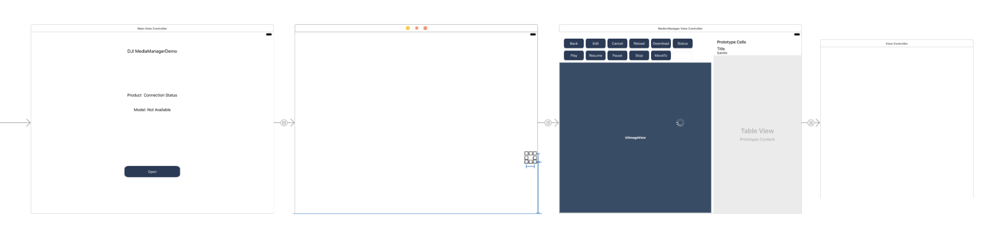
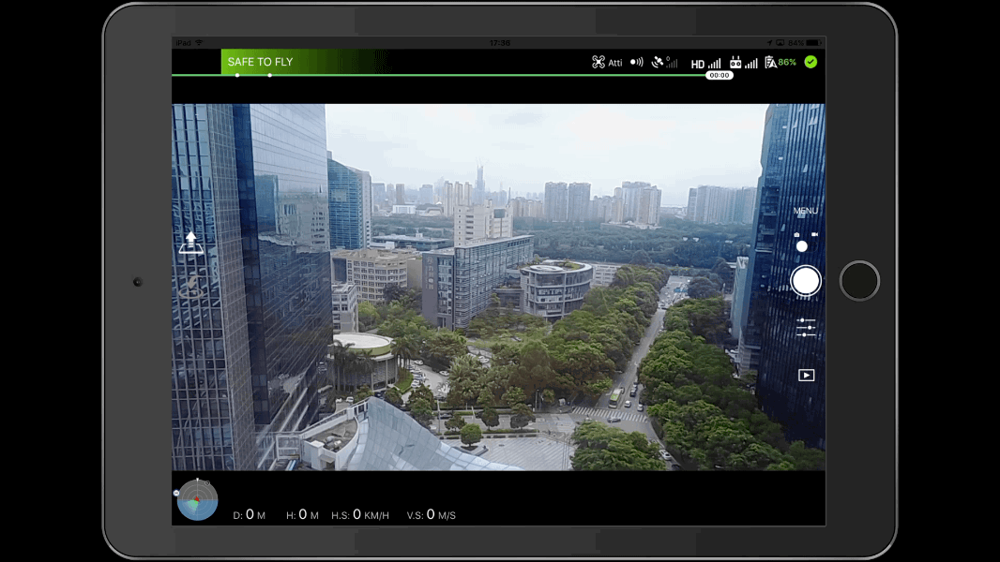

*If you come across any mistakes or bugs in this tutorial, please let us know using a Github issue, a post on the DJI forum. Please feel free to send us Github pull request and help us fix any issues.*

---

In this tutorial, you will learn how to use the `MediaManager` to interact with the file system on the SD card of the aircraft's camera. By the end of this tutorial, you will have an app that you can use to preview photos, play videos, download or delete files and so on.

In order for our app to manage photos and videos, however, it must first be able to take and record them. Fortunately, by using DJI Android UI Library, you can implement shooting photos and recording videos functionalities easily with standard DJI Go UIs.

You can download the tutorial's final sample project from this [Github Page](https://github.com/DJI-Mobile-SDK-Tutorials/Android-MediaManagerDemo).

We use Mavic Pro and Nexus 5 as an example to make this demo. For more details of customizing the layouts for iPhone devices, please check the tutorial's Github Sample Project.

## Application Activation and Aircraft Binding in China

 For DJI SDK mobile application used in China, it's required to activate the application and bind the aircraft to the user's DJI account.

 If an application is not activated, the aircraft not bound (if required), or a legacy version of the SDK (< 4.1) is being used, all **camera live streams** will be disabled, and flight will be limited to a zone of 100m diameter and 30m height to ensure the aircraft stays within line of sight.

 To learn how to implement this feature, please check this tutorial [Application Activation and Aircraft Binding](./ActivationAndBinding.html).

## Importing DJI SDK and UILibrary with AAR file

**1**. Now, create a new project in Android Studio, open Android Studio and select **File -> New -> New Project** to create a new project, named 'MediaManagerDemo'. Enter the company domain and package name (Here we use "com.dji.mediaManagerDemo") you want and press Next. Set the minimum SDK version as `API 19: Android 4.4 (KitKat)` for "Phone and Tablet" and press Next. Then select "Empty Activity" and press Next. Lastly, leave the Activity Name as "MainActivity", and the Layout Name as "activity_main", press "Finish" to create the project.

**2**. Next, download the **dji-sdk.aar** and **dji-uilibrary.aar** files from this [Github link](https://github.com/dji-sdk/Mobile-UILibrary-Android/blob/master/libs/). And check the [Importing DJI SDK and UILibrary](http://developer.dji.com/mobile-sdk/documentation/android-tutorials/UILibraryDemo.html#importing-dji-sdk-and-uilibrary) tutorial to import the DJI Android SDK and UI Library to your Android Studio project. 

## Implementing the UI of Application

### Working on the ConnectionActivity Layout

Please check the [Creating an Camera Application](./index.html#5-implementing-the-connectionactivity-layout) tutorial for the detail implementations.

### Building the Default Layout using UI Library

Now, create a new Empty Activity class with the name of "DefaultLayoutActivity" in the `com.dji.mediaManagerDemo` package. Replace the code with the following, remember to import the related classes as Android Studio suggested:

~~~java
public class DefaultLayoutActivity extends AppCompatActivity implements View.OnClickListener{

    private Button mMediaManagerBtn;

    @Override
    protected void onCreate(Bundle savedInstanceState) {
        super.onCreate(savedInstanceState);
        setContentView(R.layout.activity_default_layout);

        mMediaManagerBtn = (Button)findViewById(R.id.btn_mediaManager);
        mMediaManagerBtn.setOnClickListener(this);

    }

    @Override
    public void onClick(View v) {

        switch (v.getId()) {
            case R.id.btn_mediaManager: {
                Intent intent = new Intent(this, MainActivity.class);
                startActivity(intent);
                break;
            }
            default:
                break;
        }
    }
}
~~~

In the code above, we create a Button variable `mMediaManagerBtn` and initialize it in the `onCreate()` method. Moreover, implement the `onClick()` method of the Button and invoke `startActivity()` method to start the `MainActivity`. 

Next, continue to open the "activity_default_layout.xml" file, and replace the code with the following:

~~~xml
<?xml version="1.0" encoding="utf-8"?>
<RelativeLayout xmlns:android="http://schemas.android.com/apk/res/android"
    xmlns:tools="http://schemas.android.com/tools"
    android:id="@+id/activity_main"
    android:layout_width="match_parent"
    android:layout_height="match_parent"
    android:background="@color/background_blue"
    android:orientation="horizontal"
    tools:context=".MainActivity">

    <!-- Widget to see first person view (FPV) -->
    <dji.ui.widget.FPVWidget
        android:layout_width="match_parent"
        android:layout_height="match_parent"/>

    <dji.ui.widget.FPVOverlayWidget
        android:layout_width="match_parent"
        android:layout_height="match_parent"/>

    <!-- Widgets in top status bar -->
    <LinearLayout
        android:id="@+id/signal"
        android:layout_width="match_parent"
        android:layout_height="25dp"
        android:background="@color/dark_gray"
        android:orientation="horizontal">

        <dji.ui.widget.PreFlightStatusWidget
            android:id="@+id/status"
            android:layout_width="238dp"
            android:layout_height="25dp"/>

        <dji.ui.widget.FlightModeWidget
            android:layout_width="103dp"
            android:layout_height="22dp"/>

        <dji.ui.widget.GPSSignalWidget
            android:layout_width="44dp"
            android:layout_height="22dp"/>

        <dji.ui.widget.VisionWidget
            android:layout_width="22dp"
            android:layout_height="22dp"/>

        <dji.ui.widget.RemoteControlSignalWidget
            android:layout_width="38dp"
            android:layout_height="22dp"/>

        <dji.ui.widget.VideoSignalWidget
            android:layout_width="38dp"
            android:layout_height="22dp"/>

        <dji.ui.widget.WiFiSignalWidget
            android:layout_width="22dp"
            android:layout_height="20dp"/>

        <dji.ui.widget.BatteryWidget
            android:layout_width="56dp"
            android:layout_height="22dp"/>

        <dji.ui.widget.ConnectionWidget
            android:layout_marginTop="5dp"
            android:layout_width="22dp"
            android:layout_height="22dp"/>
    </LinearLayout>

    <LinearLayout
        android:id="@+id/camera"
        android:layout_width="wrap_content"
        android:layout_height="wrap_content"
        android:layout_below="@id/signal"
        android:layout_centerHorizontal="true"
        android:layout_margin="12dp"
        android:background="@color/dark_gray"
        android:orientation="horizontal">

        <dji.ui.widget.AutoExposureLockWidget
            android:layout_width="25dp"
            android:layout_height="25dp"/>

        <dji.ui.widget.FocusExposureSwitchWidget
            android:layout_width="25dp"
            android:layout_height="25dp"/>

        <dji.ui.widget.FocusModeWidget
            android:layout_width="25dp"
            android:layout_height="25dp"/>

        <dji.ui.widget.config.CameraConfigISOWidget
            android:layout_width="50dp"
            android:layout_height="25dp"/>

        <dji.ui.widget.config.CameraConfigShutterWidget
            android:layout_width="50dp"
            android:layout_height="25dp"/>

        <dji.ui.widget.config.CameraConfigApertureWidget
            android:layout_width="50dp"
            android:layout_height="25dp"/>

        <dji.ui.widget.config.CameraConfigEVWidget
            android:layout_width="50dp"
            android:layout_height="25dp"/>

        <dji.ui.widget.config.CameraConfigWBWidget
            android:layout_width="50dp"
            android:layout_height="25dp"/>

        <dji.ui.widget.CameraConfigStorageWidget
            android:layout_width="108dp"
            android:layout_height="25dp"/>

    </LinearLayout>
    <dji.ui.widget.RemainingFlightTimeWidget
        android:layout_alignParentTop="true"
        android:layout_marginTop="18dp"
        android:layout_width="match_parent"
        android:background="@color/transparent"
        android:layout_height="20dp"/>
    
    <LinearLayout
        android:layout_width="match_parent"
        android:layout_height="wrap_content"
        android:layout_alignParentBottom="true"
        android:orientation="horizontal"
        android:padding="12dp">

        <dji.ui.widget.dashboard.DashboardWidget
            android:id="@+id/Compass"
            android:layout_width="405dp"
            android:layout_height="91dp"
            android:layout_marginRight="12dp"/>

    </LinearLayout>
    
    <!--Take off and return home buttons on left -->
    <LinearLayout
        android:layout_width="40dp"
        android:layout_height="wrap_content"
        android:layout_centerVertical="true"
        android:layout_marginStart="12dp"
        android:orientation="vertical">

        <dji.ui.widget.TakeOffWidget
            android:layout_width="40dp"
            android:layout_height="40dp"
            android:layout_marginBottom="12dp"/>

        <dji.ui.widget.ReturnHomeWidget
            android:layout_width="40dp"
            android:layout_height="40dp"
            android:layout_marginTop="12dp"/>
    </LinearLayout>

    <dji.ui.widget.controls.CameraControlsWidget
        android:id="@+id/CameraCapturePanel"
        android:layout_width="50dp"
        android:layout_height="213dp"
        android:layout_alignParentRight="true"
        android:layout_below="@id/camera" />

    <dji.ui.panel.CameraSettingExposurePanel
        android:id="@+id/CameraExposureMode"
        android:layout_width="180dp"
        android:layout_height="263dp"
        android:layout_below="@id/camera"
        android:layout_marginLeft="360dp"
        android:layout_toLeftOf="@+id/CameraCapturePanel"
        android:background="@color/transparent"
        android:gravity="center"
        android:visibility="invisible" />

    <dji.ui.panel.CameraSettingAdvancedPanel
        android:id="@+id/CameraAdvancedSetting"
        android:layout_width="180dp"
        android:layout_height="263dp"
        android:layout_below="@id/camera"
        android:layout_marginLeft="360dp"
        android:layout_toLeftOf="@+id/CameraCapturePanel"
        android:background="@color/transparent"
        android:gravity="center"
        android:visibility="invisible" />
    
    <!-- Pre-flight checklist panel -->
    <dji.ui.panel.PreFlightCheckListPanel
        android:id="@+id/PreflightCheckView"
        android:layout_width="400dp"
        android:layout_height="wrap_content"
        android:layout_below="@id/signal"
        android:visibility="gone"/>

    <LinearLayout
        android:layout_width="match_parent"
        android:layout_height="wrap_content"
        android:orientation="horizontal"
        android:padding="12dp"
        android:layout_alignParentBottom="true">

        <Button
            android:id="@+id/btn_mediaManager"
            android:layout_width="38dp"
            android:layout_height="30dp"
            android:layout_alignParentBottom="true"
            android:layout_alignStart="@+id/CameraCapturePanel"
            android:layout_below="@id/CameraCapturePanel"
            android:layout_marginLeft="530dp"
            android:background="@drawable/playback"
            android:visibility="visible" />

    </LinearLayout>
    
</RelativeLayout>
~~~

In the xml file above, we implement the UI Library's default layout. For more details, please check the [Getting Started with UI Library](http://developer.dji.com/mobile-sdk/documentation/android-tutorials/UILibraryDemo.html#building-the-default-layout-using-ui-library) tutorial.

Once you finished the steps above, open the "color.xml" file and replace the content with the following:

~~~xml
<?xml version="1.0" encoding="utf-8"?>
<resources>
    <color name="colorPrimary">#3F51B5</color>
    <color name="colorPrimaryDark">#303F9F</color>
    <color name="colorAccent">#FF4081</color>
    <color name="black_overlay">#000000</color>
    <color name="colorWhite">#FFFFFF</color>
    <color name="background_blue">#242d34</color>
    <color name="transparent">#00000000</color>
    <color name="dark_gray">#80000000</color>
</resources>
~~~

Moreover, open the "styles.xml" file and replace the content with the following:

~~~xml
<resources>
    <!-- Base application theme. -->
    
</resources>
~~~

### Working on the MainActivity Layout

Once you finished the steps above, let's open the "activity_main.xml" file, and replace the content with the following:

~~~xml
<?xml version="1.0" encoding="utf-8"?>
<RelativeLayout xmlns:android="http://schemas.android.com/apk/res/android"
    xmlns:app="http://schemas.android.com/apk/res-auto"
    xmlns:tools="http://schemas.android.com/tools"
    android:layout_width="match_parent"
    android:layout_height="match_parent"
    tools:context="com.dji.mediaManagerDemo.MainActivity">

    <Button
        android:id="@+id/back_btn"
        android:layout_width="60dp"
        android:layout_height="40dp"
        android:layout_alignParentStart="true"
        android:layout_alignParentTop="true"
        android:text="Back"
        android:textSize="11sp" />

    <Button
        android:id="@+id/delete_btn"
        android:layout_width="65dp"
        android:layout_height="40dp"
        android:layout_alignParentTop="true"
        android:layout_toEndOf="@+id/back_btn"
        android:text="Delete"
        android:textSize="11sp" />

    <Button
        android:id="@+id/reload_btn"
        android:layout_width="70dp"
        android:layout_height="40dp"
        android:layout_alignParentTop="true"
        android:layout_toEndOf="@+id/delete_btn"
        android:text="Reload"
        android:textSize="11sp" />

    <Button
        android:id="@+id/download_btn"
        android:layout_width="90dp"
        android:layout_height="40dp"
        android:layout_alignParentTop="true"
        android:layout_toEndOf="@+id/reload_btn"
        android:text="Download"
        android:textSize="11sp" />

    <Button
        android:id="@+id/status_btn"
        android:layout_width="75dp"
        android:layout_height="40dp"
        android:layout_alignParentTop="true"
        android:layout_toEndOf="@+id/download_btn"
        android:text="Status"
        android:textSize="11sp" />

    <Button
        android:id="@+id/play_btn"
        android:layout_width="60dp"
        android:layout_height="40dp"
        android:layout_alignParentStart="true"
        android:layout_below="@+id/back_btn"
        android:text="Play"
        android:textSize="11sp" />

    <Button
        android:id="@+id/resume_btn"
        android:layout_width="80dp"
        android:layout_height="40dp"
        android:layout_below="@+id/back_btn"
        android:layout_toEndOf="@+id/play_btn"
        android:text="Resume"
        android:textSize="11sp" />

    <Button
        android:id="@+id/pause_btn"
        android:layout_width="60dp"
        android:layout_height="40dp"
        android:layout_below="@+id/reload_btn"
        android:layout_toEndOf="@+id/resume_btn"
        android:text="Pause"
        android:textSize="11sp" />

    <Button
        android:id="@+id/stop_btn"
        android:layout_width="60dp"
        android:layout_height="40dp"
        android:layout_below="@+id/reload_btn"
        android:layout_toEndOf="@+id/pause_btn"
        android:text="Stop"
        android:textSize="11sp" />

    <Button
        android:id="@+id/moveTo_btn"
        android:layout_width="75dp"
        android:layout_height="40dp"
        android:layout_below="@+id/reload_btn"
        android:layout_toEndOf="@+id/stop_btn"
        android:text="MoveTo"
        android:textSize="11sp" />

    <!-- Widget to see first person view (FPV) -->
    <dji.ui.widget.FPVWidget
        android:layout_width="match_parent"
        android:layout_height="match_parent"
        android:layout_below="@+id/play_btn"
        android:layout_toStartOf="@+id/pointing_drawer_sd"
        android:id="@+id/FPVWidget" />

    <ImageView
        android:id="@+id/imageView"
        android:layout_width="match_parent"
        android:layout_height="match_parent"
        android:layout_below="@+id/play_btn"
        android:layout_marginTop="0dp"
        android:layout_toStartOf="@+id/pointing_drawer_sd"
        android:visibility="invisible" />

    <android.support.v7.widget.RecyclerView
        android:id="@+id/filelistView"
        android:layout_width="250dp"
        android:layout_height="match_parent"
        android:layout_marginLeft="0dp"
        android:layout_toEndOf="@+id/FPVWidget" />

    <SlidingDrawer
        android:id="@+id/pointing_drawer_sd"
        android:layout_width="230dp"
        android:layout_height="match_parent"
        android:layout_alignParentRight="true"
        android:content="@+id/pointing_drawer_content"
        android:handle="@+id/pointing_handle"
        android:orientation="horizontal">

        <ImageView
            android:id="@id/pointing_handle"
            android:layout_width="wrap_content"
            android:layout_height="wrap_content" />

        <RelativeLayout
            android:id="@+id/pointing_drawer_content"
            android:layout_width="250dp"
            android:layout_height="match_parent"
            android:layout_centerVertical="true"
            android:layout_marginLeft="340dp"
            android:background="@color/black_overlay">

            <ScrollView
                android:layout_width="250dp"
                android:layout_height="fill_parent"
                android:layout_alignParentEnd="true"
                android:layout_alignParentRight="true"
                android:layout_centerVertical="true"
                android:clickable="false"
                android:scrollbars="vertical">

                <TextView
                    android:id="@+id/pointing_push_tv"
                    style="@style/status_text"
                    android:layout_width="200dp"
                    android:layout_height="wrap_content"
                    android:layout_marginLeft="30dp"
                    android:scrollbars="vertical"
                    android:text="@string/push_info" />
            </ScrollView>
        </RelativeLayout>
    </SlidingDrawer>
</RelativeLayout>
~~~

In the xml above, we define the UIs for the interface.

### Working on the MainViewController and DefaultlayoutViewController

You can check this tutorial's Github Sample Code to learn how to implement the **MainViewController** to do SDK registration and update UIs and show alert views to inform users when DJI product is connected and disconnected. Also, you can learn how to implement shooting photos and recording videos functionalities with standard DJI Go UIs by using **DULDefaultLayoutViewController** of DJI UI Library from the [Getting Started with DJI UI Library](./UILibraryDemo.html#working-on-the-mainviewcontroller-and-defaultlayoutviewcontroller) tutorial.

If everything goes well, you can see the live video feed and test the shoot photo and record video features like this:

Congratulations! We can move forward now.

## Working on the UI of the Application

Now, to create a new file, choose the "Cocoa Touch Class" template and choose **UIViewController** as its subclass, name it as "MediaManagerViewController". We will use it to implement the Media Manager features.

Next, open the **Main.storyboard** file and drag and drop a new "View Controller" object from the Object Library and set its "Class" value as **MediaManagerViewController**.

Moreover, drag and drop a new "Container View" object in the **MediaManagerViewController** and set its ViewController's "Class" value as **DULFPVViewController**, which contains a `DULFPVView` and will show the video playback.

Furthermore, drag and drop a UIImageView object on top of the "Container View" and hide it as default, we will use it to show the downloaded photo. Moreover, drag and drop eleven UIButton objects, one UITextField, one UITableView and a UIActivityIndicatorView, place them in the following positions:

The layout of the UI elements is a bit complicated, for more details of the configuration, please check the **Main.storyboard** in this tutorial's Github Sample Project.

Lastly, drag and place a UIButton on the bottom right corner of the **DefaultLayoutViewController** view and create a segue to show the **MediaManagerViewController** when the user press the button.

If everything goes well, you should see the whole storyboard layout like this:

Once you finish the above steps, open the "DefaultLayoutViewController.m" file and replace the content with the followings:

~~~objc
#import "DefaultLayoutViewController.h"
#import "DemoUtility.h"

@interface DefaultLayoutViewController ()
@property (weak, nonatomic) IBOutlet UIButton *mediaDownloadBtn;

@end

@implementation DefaultLayoutViewController

- (void)viewDidLoad
{
    [super viewDidLoad];

    if (IS_IPAD) {
        [self.mediaDownloadBtn setImage:[UIImage imageNamed:@"mediaDownload_icon_iPad"] forState:UIControlStateNormal];
    }else{
        [self.mediaDownloadBtn setImage:[UIImage imageNamed:@"mediaDownload_icon"] forState:UIControlStateNormal];
    }
}

@end
~~~

In the code above, we create an IBOutlet property for the `mediaDownloadBtn` and set its image in the `viewDidLoad` method. You can get the "mediaDownload_icon.png" and  "mediaDownload_icon_iPad.png" files from this tutorial's Github Sample Project.

Next, open the "MediaManagerViewController.m" file and replace the content with the followings:

~~~objc
#import "MediaManagerViewController.h"
#import "DemoUtility.h"

@interface MediaManagerViewController ()
@property (weak, nonatomic) IBOutlet UITextField *positionTextField;
@property (weak, nonatomic) IBOutlet UITableView *mediaTableView;
@property (weak, nonatomic) IBOutlet UIView *videoPreviewView;
@property (weak, nonatomic) IBOutlet UIButton *editBtn;
@property (weak, nonatomic) IBOutlet UIButton *deleteBtn;
@property (weak, nonatomic) IBOutlet UIButton *cancelBtn;
@property (weak, nonatomic) IBOutlet UIButton *reloadBtn;
@property (weak, nonatomic) IBOutlet UIImageView *displayImageView;
@property (weak, nonatomic) IBOutlet UIActivityIndicatorView *loadingIndicator;

@end

@implementation MediaManagerViewController

- (void)viewWillAppear:(BOOL)animated
{
    [super viewWillAppear:animated];
}

- (void)viewWillDisappear:(BOOL)animated
{
    [super viewWillDisappear:animated];
}

- (void)viewDidLoad {
    [super viewDidLoad];
    [self initData];

}

- (void)didReceiveMemoryWarning {
    [super didReceiveMemoryWarning];
    // Dispose of any resources that can be recreated.
}

- (BOOL)prefersStatusBarHidden {
    return NO;
}

#pragma mark - Custom Methods
- (void)initData
{
    [self.deleteBtn setEnabled:NO];
    [self.cancelBtn setEnabled:NO];
    [self.reloadBtn setEnabled:NO];
    [self.editBtn setEnabled:NO];
}

#pragma mark - IBAction Methods
- (IBAction)backBtnAction:(id)sender {
    [self.navigationController popViewControllerAnimated:YES];
}

- (IBAction)editBtnAction:(id)sender {
    [self.mediaTableView setEditing:YES animated:YES];
    [self.deleteBtn setEnabled:YES];
    [self.cancelBtn setEnabled:YES];
    [self.editBtn setEnabled:NO];
}

- (IBAction)cancelBtnAction:(id)sender {
    [self.mediaTableView setEditing:NO animated:YES];
    [self.editBtn setEnabled:YES];
    [self.deleteBtn setEnabled:NO];
    [self.cancelBtn setEnabled:NO];
}

- (IBAction)reloadBtnAction:(id)sender {
}

- (IBAction)statusBtnAction:(id)sender {
}

- (IBAction)downloadBtnAction:(id)sender {
}

- (IBAction)playBtnAction:(id)sender {
}

- (IBAction)resumeBtnAction:(id)sender {
}

- (IBAction)pauseBtnAction:(id)sender {
}

- (IBAction)stopBtnAction:(id)sender {
}

- (IBAction)moveToPositionAction:(id)sender {
}

- (IBAction)showStatusBtnAction:(id)sender {
}
~~~

In the code above, we implement the following things:

1. Firstly, we define the IBOutlet properties for the UI elements, like UIButton, UITableView, UITextField, etc.

2. Next, we implement the `viewDidLoad` method, and invoke the `initData` method to disable the `deleteBtn`, `cancelBtn`, `reloadBtn` and `editBtn` initially.

3. Lastly, we implement the IBAction methods for all the UIButtons. For the `backBtnAction` method, we invoke the `popViewControllerAnimated` method of UINavigationController to go back to the `DefaultLayoutViewController`.

For the `editBtnAction` method, we make `mediaTableView` goes into editing mode by invoking `setEditing:animated:` method of UITableView. Then enable the `deleteBtn` and `cancelBtn` buttons, disable the `editBtn` button.

For the `cancelBtnAction` method, on contract, we disable the editing mode of `mediaTableView` and enable the `editBtn` button, also disable the `deleteBtn` and `cancelBtn` buttons. We will implement the other IBAction methods later.

## Switching to Media Download Mode

In order to preview, edit or download the photos or videos files from the DJICamera, you need to use the `DJIPlaybackManager` or `DJIMediaManager` of DJICamera. Here, we use `DJIMediaManager` to demonstrate how to implement it.

Now, create a property of `DJIMediaManager` in the class extension part and implement the `viewWillAppear:` and `viewWillDisappear:` methods as shown below:

~~~objc
@property (nonatomic, weak) DJIMediaManager *mediaManager;
~~~

~~~objc
- (void)viewWillAppear:(BOOL)animated
{
    [super viewWillAppear:animated];
    DJICamera *camera = [DemoUtility fetchCamera];
    if (camera != nil) {
        camera.delegate = self;
        self.mediaManager = camera.mediaManager;
        self.mediaManager.delegate = self;
        [camera setMode:DJICameraModeMediaDownload withCompletion:^(NSError *error) {
            if (error) {
                NSLog(@"setMode failed: %@", error.description);
            }
        }];
    }
}

- (void)viewWillDisappear:(BOOL)animated
{
    [super viewWillDisappear:animated];
    DJICamera *camera = [DemoUtility fetchCamera];
    [camera setMode:DJICameraModeShootPhoto withCompletion:^(NSError * _Nullable error) {
        if (error) {
            ShowResult(@"Set CameraWorkModeShootPhoto Failed, %@", error.description);
        }
    }];

    if (camera && camera.delegate == self) {
        [camera setDelegate:nil];
        self.mediaManager.delegate = nil;
    }
}
~~~

In the code above, we implement the following things:

1. In the `viewWillAppear` method, we firstly invoke the `fetchCamera` method of **DemoUtility** class to fetch the DJICamera object. Then check if the camera is nil, if not set its delegate as `MediaManagerViewController`, also initialize the `mediaManager` and set its delegate as `MediaManagerViewController`. Furthermore, invoke the `setMode:withCompletion:` method of **DJICamera** and pass the `DJICameraModeMediaDownload` param to switch the camera mode to media download mode.

2. Similarly, in the `viewWillDisappear` method, we also invoke the `setMode:withCompletion:` method of **DJICamera** and pass the `DJICameraModeShootPhoto` param to switch the camera mode to shoot photo mode. Then reset the delegates of DJICamera and DJIMediaManager. So when the user enter the **MediaManagerViewController**, the DJICamera will switch to media download mode automatically, when user exit back to the **DefaultLayoutViewController**, the DJICamera will switch to shoot photo mode.

## Refreshing Media File List

Once we have finished the steps above, we can start to fetch the media files list from the Camera SD card and show them on the tableView.

Create the following properties in the class extension part and initialize it in the `initData` method:

~~~objc
@property(nonatomic, strong) NSMutableArray* mediaList;
@property (nonatomic, strong) NSIndexPath *selectedCellIndexPath;
~~~

~~~objc
- (void)initData
{
    self.mediaList = [[NSMutableArray alloc] init];
    ...
}
~~~

Next, create two new methods: `loadMediaList` and `updateMediaList:` and invoke the `loadMediaList` method at the bottom of `viewWillAppear:` method and `reloadBtnAction:` IBAction method:

~~~objc
- (void)viewWillAppear:(BOOL)animated
{
    ...
    if (camera != nil) {
        ...
        [self loadMediaList];
    }
}

- (IBAction)reloadBtnAction:(id)sender {
    [self loadMediaList];
}

-(void) loadMediaList
{
    [self.loadingIndicator setHidden:NO];
    if (self.mediaManager.fileListState == DJIMediaFileListStateSyncing ||
             self.mediaManager.fileListState == DJIMediaFileListStateDeleting) {
        NSLog(@"Media Manager is busy. ");
    }else {
        WeakRef(target);
        [self.mediaManager refreshFileListWithCompletion:^(NSError * _Nullable error) {
            WeakReturn(target);
            if (error) {
                ShowResult(@"Fetch Media File List Failed: %@", error.localizedDescription);
            }
            else {
                NSLog(@"Fetch Media File List Success.");
                NSArray *mediaFileList = [target.mediaManager fileListSnapshot];
                [target updateMediaList:mediaFileList];
            }
            [target.loadingIndicator setHidden:YES];
        }];
    }
}

-(void) updateMediaList:(NSArray*)mediaList
{
    [self.mediaList removeAllObjects];
    [self.mediaList addObjectsFromArray:mediaList];

    DJIFetchMediaTaskScheduler *taskScheduler = [DemoUtility fetchCamera].mediaManager.taskScheduler;
    taskScheduler.suspendAfterSingleFetchTaskFailure = NO;
    [taskScheduler resumeWithCompletion:nil];
    for (DJIMediaFile *file in self.mediaList) {
        if (file.thumbnail == nil) {
            WeakRef(target);
            DJIFetchMediaTask *task = [DJIFetchMediaTask taskWithFile:file content:DJIFetchMediaTaskContentThumbnail andCompletion:^(DJIMediaFile * _Nullable file, DJIFetchMediaTaskContent content, NSError * _Nullable error) {
                WeakReturn(target);
                [target.mediaTableView reloadData];
            }];
            [taskScheduler moveTaskToEnd:task];
        }
    }

    [self.reloadBtn setEnabled:YES];
    [self.editBtn setEnabled:YES];
}
~~~

The code above implements:

1. In the `loadMediaList` method, we firstly show the `loadingIndicator` and check the `fileListState` enum value of the `DJIMediaManager`. If the value is `DJIMediaFileListStateSyncing` or `DJIMediaFileListStateDeleting`, we show an NSLog to inform users that the media manager is busy. For other values, we invoke the `refreshFileListWithCompletion:` method of the `DJIMediaManager` to refresh the file list from the SD card. In the completion block, if there is no error, we should get a copy of the current file list by invoking the `fileListSnapshot` method of `DJIMediaManager` and initialize the `mediaFileList` variable. Then invoke the `updateMediaList:` method and pass the `mediaFileList`. Lastly, hide the `loadingIndicator` since the operation of refreshing the file list has finished.

2. In the `updateMediaList:` method, we firstly remove all the objects in the `mediaList` array and add new objects to it from the `mediaList` array. Next, create a `mediaTaskScheduler` variable and assign it with the `taskScheduler` property of `DJIMediaManager`. Then, assign `NO` to the `suspendAfterSingleFetchTaskFailure` property of `DJIFetchMediaTaskScheduler` to prevent from suspending the scheduler when an error occurs during the execution. Moreover, invoke the `resumeWithCompletion` method of `DJIFetchMediaTaskScheduler` to resume the scheduler, which will execute tasks in the queue sequentially.

Furthermore, create a for loop to loop through all the `DJIMediaFile` variables in the `mediaList` array and invoke the `taskWithFile:content:andCompletion:` method of `DJIFetchMediaTaskScheduler` by passing the `file` variable and `DJIFetchMediaTaskContentThumbnail` value to ask the scheduler to download the thumbnail of the media file.

In the completion block, we invoke the `reloadData` method of `UITableView` to reload everything in the table view. After that, invoke the `moveTaskToEnd` method to push the `task` to the back of the queue and be executed after the executing task is complete.

Lastly, we enable the `reloadBtn` and `editBtn` buttons.

Once you finish the steps above, you should implement the following UITableView methods:

~~~objc
- (NSInteger)numberOfSectionsInTableView:(UITableView *)tableView {
    return 1;
}

- (NSInteger)tableView:(UITableView *)tableView numberOfRowsInSection:(NSInteger)section {

    return self.mediaList.count;
}

- (UITableViewCell *)tableView:(UITableView *)tableView cellForRowAtIndexPath:(NSIndexPath *)indexPath {

    UITableViewCell *cell = [tableView dequeueReusableCellWithIdentifier:@"mediaFileCell"];
    if (cell == nil) {
        cell = [[UITableViewCell alloc] initWithStyle:UITableViewCellStyleSubtitle reuseIdentifier:@"mediaFileCell"];
    }

    if (self.selectedCellIndexPath == indexPath) {
        cell.accessoryType = UITableViewCellAccessoryCheckmark;
    }else
    {
        cell.accessoryType = UITableViewCellAccessoryNone;
    }

    DJIMediaFile *media = [self.mediaList objectAtIndex:indexPath.row];
    cell.textLabel.text = media.fileName;
    cell.detailTextLabel.text = [NSString stringWithFormat:@"Create Date: %@ Size: %0.1fMB Duration:%f cusotmInfo:%@", media.timeCreated, media.fileSizeInBytes / 1024.0 / 1024.0,media.durationInSeconds, media.customInformation];
    if (media.thumbnail == nil) {
        [cell.imageView setImage:[UIImage imageNamed:@"dji.png"]];
    }
    else
    {
        [cell.imageView setImage:media.thumbnail];
    }

    return cell;
}
~~~

In the code above, we implement the following features:

1. Return `1` as the section number of the table view.
2. Return the `count` value of the `mediaList` array as the number of rows in section.
3. If the `UITableViewCell` selected, set its `accessoryType` as `UITableViewCellAccessoryCheckmark` to show a checkmark on the right side of the table view cell, otherwise, set the `accessoryType` as `UITableViewCellAccessoryNone` to hide the checkmark.

Next, get the `DJIMediaFile` object in the `self.mediaList` array by using the `indexPath.row` index. Lastly, update the `textLabel`, `detailTextLabel` and `imageView` properties of table view cell according to the `DJIMediaFile` object. For the "dji.png" file, you can get it from the tutorial's Github Sample project.

Now, to build and run the project, connect the demo application to a Mavic Pro (Please check the [Run Application](../application-development-workflow/workflow-run.html) for more details) and enter the `MediaManagerViewController`, you should be able to see something similar to the following screenshot:

## Downloading and Editing the Media Files

After showing all the media files in the table view, we can start to implement the features of downloading and deleting media files.

Now, continue to create the following properties in the class extension part:

~~~objc
@property(nonatomic, strong) DJIAlertView* statusAlertView;
@property(nonatomic) DJIMediaFile *selectedMedia;
@property(nonatomic) NSUInteger previousOffset;
@property(nonatomic) NSMutableData *fileData;
~~~

Next, initialize the properties in the `initData` method:

~~~objc
- (void)initData
{
    ...

    self.fileData = nil;
    self.selectedMedia = nil;
    self.previousOffset = 0;
}
~~~

Moreover, implement the table View delegate method as shown below:

~~~objc
- (void)tableView:(UITableView *)tableView didSelectRowAtIndexPath:(NSIndexPath *)indexPath {

    if (self.mediaTableView.isEditing) {
        return;
    }

    self.selectedCellIndexPath = indexPath;

    DJIMediaFile *currentMedia = [self.mediaList objectAtIndex:indexPath.row];
    if (![currentMedia isEqual:self.selectedMedia]) {
        self.previousOffset = 0;
        self.selectedMedia = currentMedia;
        self.fileData = nil;
    }

    [tableView reloadData];
}
~~~

In the code above, we assign the `selectedCellIndexPath` property with the `indexPath` value. Then get the current selected `currentMedia` object from the `mediaList` array using the `indexPath` param of this method. Moreover, check if the `currentMedia` object is the same as `self.selectedMedia` property.

If not, reset the `previousOffset` and `fileData` properties and update the `self.selectedMedia` object with the `currentMedia`. Lastly, invoke the `reloadData` method to reload everything in the table view.

Once you finish the steps above, we continue to implement the `downloadBtnAction:` method as shown below:

~~~objc
- (IBAction)downloadBtnAction:(id)sender {

    BOOL isPhoto = self.selectedMedia.mediaType == DJIMediaTypeJPEG || self.selectedMedia.mediaType == DJIMediaTypeTIFF;
    WeakRef(target);
    if (self.statusAlertView == nil) {
        NSString* message = [NSString stringWithFormat:@"Fetch Media Data \n 0.0"];
        self.statusAlertView = [DJIAlertView showAlertViewWithMessage:message titles:@[@"Cancel"] action:^(NSUInteger buttonIndex) {
            WeakReturn(target);
            if (buttonIndex == 0) {
                [target.selectedMedia stopFetchingFileDataWithCompletion:^(NSError * _Nullable error) {
                    target.statusAlertView = nil;
                }];
            }
        }];
    }

    [self.selectedMedia fetchFileDataWithOffset:self.previousOffset updateQueue:dispatch_get_main_queue() updateBlock:^(NSData * _Nullable data, BOOL isComplete, NSError * _Nullable error) {
        WeakReturn(target);
        if (error) {
            [target.statusAlertView updateMessage:[[NSString alloc] initWithFormat:@"Download Media Failed:%@",error]];
            [target performSelector:@selector(dismissStatusAlertView) withObject:nil afterDelay:2.0];
        }
        else
        {
            if (isPhoto) {
                if (target.fileData == nil) {
                    target.fileData = [data mutableCopy];
                }
                else {
                    [target.fileData appendData:data];
                }
            }
            target.previousOffset += data.length;
            float progress = target.previousOffset * 100.0 / target.selectedMedia.fileSizeInBytes;
            [target.statusAlertView updateMessage:[NSString stringWithFormat:@"Downloading: %0.1f%%", progress]];
            if (target.previousOffset == target.selectedMedia.fileSizeInBytes && isComplete) {
                [target dismissStatusAlertView];
                if (isPhoto) {
                    [target showPhotoWithData:target.fileData];
                    [target savePhotoWithData:target.fileData];
                }
            }
        }
    }];
}
~~~

In the code above, we implement the following features:

1. We firstly create a BOOL variable `isPhoto` and assign value to it by checking the `mediaType` enum value of the `DJIMediaFile`. For more details of the `DJIMediaType` enum, please check the "DJIMediaFile.h" file.

2. Next, if the `statusAlertView` is nil, we initialize it by invoking the `showAlertViewWithMessage:titles:action:` method of `DJIAlertView`. Here we create a alertView with one button named "Cancel". If user press on the "Cancel" button of the alertView, we invoke the `stopFetchingFileDataWithCompletion:` method of `DJIMediaFile` to stop the fetch file task.

3. Furthermore, invoke the `fetchFileDataWithOffset:updateQueue:updateBlock:` method of `DJIMediaFile` to fetch the media file's full resolution data from the SD card. The full resolution data could be either **image** or **video**. Inside the completion block, if there is an error, update message of the `statusAlertView` to inform users and dismiss the alert view after 2 seconds. If there is no error and the media file is a photo, initialize the `fileData` property or append `data` to it by checking if it is nil.

Next, accumulate the value of the `previousOffset` property by adding the length of the `data` param. Calculate the percentage of the current download progress and assign the value to the `progress` variable. Also, update the message of the `statusAlertView` to inform users of the download progress. Furthermore, check if the download has completed and dismiss the alert view.

Lastly, check if the media file is a photo, and invoke the `showPhotoWithData:` and `savePhotoWithData:` methods to show the full resolution photo and save it to the iOS Photo Library.

You can check the implementations of the `showPhotoWithData:` and `savePhotoWithData:` methods below:

~~~objc
-(void) showPhotoWithData:(NSData*)data
{
    if (data) {
        UIImage* image = [UIImage imageWithData:data];
        if (image) {
            [self.displayImageView setImage:image];
            [self.displayImageView setHidden:NO];
        }
    }
}

#pragma mark Save Download Images
-(void) savePhotoWithData:(NSData*)data
{
    if (data) {
        UIImage* image = [UIImage imageWithData:data];
        if (image) {
            UIImageWriteToSavedPhotosAlbum(image, self, @selector(image:didFinishSavingWithError:contextInfo:), nil);
        }
    }
}

- (void)image:(UIImage *)image didFinishSavingWithError:(NSError *)error contextInfo:(void *)contextInfo
{

    NSString* message = @"";
    if (error != NULL)
    {
        //Show message when save image failed
        message = [NSString stringWithFormat:@"Save Image Failed! Error: %@", error];
    }
    else
    {
        //Show message when save image successfully
        message = [NSString stringWithFormat:@"Saved to Photo Album"];
    }

    WeakRef(target);
    if (self.statusAlertView == nil) {
        self.statusAlertView = [DJIAlertView showAlertViewWithMessage:message titles:@[@"Dismiss"] action:^(NSUInteger buttonIndex) {
            WeakReturn(target);
            if (buttonIndex == 0) {
                [target dismissStatusAlertView];
            }
        }];
    }
}
~~~

In the code above, we implement the following features:

1. In the `showPhotoWithData:` method, we check if the `data` is not nil and create a `UIImage` object from it. Then check if the created `image` is not nil and show it on the `displayImageView` object.

2. Similarly, in the `savePhotoWithData:` method, we create a `UIImage` object from the `data` param and invoke the `UIImageWriteToSavedPhotosAlbum()` method to save the image to the photos album.

3. In the selector method, we firstly create a `NSString` object and set its value by checking if there is an error. Next, show the `statusAlertView` to inform the users of the message and dismiss the alert view when the users press on the **Dismiss** button.

Once you have finished the steps above, we can continue to implement the feature of deleting media files. Here we should implement the delegate methods of UITableView as shown below:

~~~objc
-(BOOL)tableView:(UITableView *)tableView canEditRowAtIndexPath:(NSIndexPath *)indexPath
{
    return YES;
}

-(void)tableView:(UITableView *)tableView commitEditingStyle:(UITableViewCellEditingStyle)editingStyle forRowAtIndexPath:(NSIndexPath *)indexPath{
    DJIMediaFile* currentMedia = [self.mediaList objectAtIndex:indexPath.row];
    [self.mediaManager deleteFiles:@[currentMedia] withCompletion:^(NSArray<DJIMediaFile *> * _Nonnull failedFiles, NSError * _Nullable error) {
        if (error) {
            ShowResult(@"Delete File Failed:%@",error);
            for (DJIMediaFile * media in failedFiles) {
                NSLog(@"%@ delete failed",media.fileName);
            }
        }else
        {
            ShowResult(@"Delete File Successfully");
            [self.mediaList removeObjectAtIndex:indexPath.row];
            [self.mediaTableView deleteRowsAtIndexPaths:@[indexPath] withRowAnimation:UITableViewRowAnimationLeft];
        }

    }];
}
~~~

The code above implements:

1. In the `tableView:canEditRowAtIndexPath:` method, return `YES` to allow the swipe gesture to delete the table view cell.

2. In the `tableView:commitEditingStyle:forRowAtIndexPath:` method, we get the `currentMedia` object from the `mediaList` array firstly. Next, invoke the `deleteFiles:withCompletion:` method of `DJIMediaManager` to delete the select media file. Inside the completion block, if there is an error, show an alert view to inform user of the error description. If not, remove the deleted media file from the `mediaList` array and invoke the `deleteRowsAtIndexPaths:withRowAnimation:` method of `mediaTableView` to remove the table view cell too.

Now, to build and run the project, connect the demo application to a Mavic Pro and enter the `MediaManagerViewController`, try to download an image file from the SD card, display and save it to the photos album. Also, try to swipe right on the table view cell and delete the media file from the table view. If everything goes well, you should be able to see something similar to the following gif animation:

## Working on the Video Playback

After you finish the steps above, you should know how to download and display the image media file using `DJIMediaManager`, we can continue to implement the **Video Playback** features.

Now, implement the following IBAction methods:

~~~objc
- (IBAction)playBtnAction:(id)sender {

    [self.displayImageView setHidden:YES];
    if ((self.selectedMedia.mediaType == DJIMediaTypeMOV) || (self.selectedMedia.mediaType == DJIMediaTypeMP4)) {
        [self.positionTextField setPlaceholder:[NSString stringWithFormat:@"%d sec", (int)self.selectedMedia.durationInSeconds]];
        [self.mediaManager playVideo:self.selectedMedia withCompletion:^(NSError * _Nullable error) {
            if (error) {
                ShowResult(@"Play Video Failed: %@", error.description);
            }
        }];
    }
}

- (IBAction)resumeBtnAction:(id)sender {

    [self.mediaManager resumeWithCompletion:^(NSError * _Nullable error) {
        if (error) {
            ShowResult(@"Resume failed: %@", error.description);
        }
    }];
}

- (IBAction)pauseBtnAction:(id)sender {
    [self.mediaManager pauseWithCompletion:^(NSError * _Nullable error) {
        if (error) {
            ShowResult(@"Pause failed: %@", error.description);
        }
    }];
}

- (IBAction)stopBtnAction:(id)sender {
    [self.mediaManager stopWithCompletion:^(NSError * _Nullable error) {
        if (error) {
            ShowResult(@"Stop failed: %@", error.description);
        }
    }];
}

- (IBAction)moveToPositionAction:(id)sender {
    NSUInteger second = 0;
    if (self.positionTextField.text.length) {
        second = [self.positionTextField.text floatValue];
    }

    WeakRef(target);
    [self.mediaManager moveToPosition:second withCompletion:^(NSError * _Nullable error) {
        WeakReturn(target);
        if (error) {
            ShowResult(@"Move to position failed: %@", error.description);
        }
        [target.positionTextField setText: @""];
    }];

}
~~~

In the code above, we implement the following features:

1. In the `playBtnAction:` method, we firstly hide the `displayImageView` image view. Then check the `mediaType` enum value of the `selectedMedia` object to see if the selected media file is a video. Furthermore, update the `placeholder` string of the `positionTextField` with the video duration and invoke the `playVideo:withCompletion:` method of `DJIMediaManager` to start playing the video.

2. In the `resumeBtnAction:` method, we invoke the `resumeWithCompletion:` method of `DJIMediaManager` to resume the paused video.

3. In the `pauseBtnAction:` method, we invoke the `pauseWithCompletion:` method of `DJIMediaManager` to pause the playing video.

4. In the `stopBtnAction:` method, we call the `stopWithCompletion:` method of `DJIMediaManager` to stop the playing video.

5. In the `moveToPositionAction:` method, we get the text value of the `positionTextField` and convert it to an NSUInteger value `second`. Then invoke the `moveToPosition:withCompletion:` method of `DJIMediaManager` to skip to the input position in seconds from the start of the video. Inside the completion block, we clean up the text content of the `positionTextField`.

Lastly, we can show the video playback state info by implementing the following methods:

~~~objc
- (void)initData
{
    ...

    self.statusView = [DJIScrollView viewWithViewController:self];
    [self.statusView setHidden:YES];
}

- (IBAction)showStatusBtnAction:(id)sender {
    [self.statusView setHidden:NO];
    [self.statusView show];
}

#pragma mark - DJIMediaManagerDelegate Method

- (void)manager:(DJIMediaManager *)manager didUpdateVideoPlaybackState:(DJIMediaVideoPlaybackState *)state {
    NSMutableString *stateStr = [NSMutableString string];
    if (state.playingMedia == nil) {
        [stateStr appendString:@"No media\n"];
    }
    else {
        [stateStr appendFormat:@"media: %@\n", state.playingMedia.fileName];
        [stateStr appendFormat:@"Total: %f\n", state.playingMedia.durationInSeconds];
        [stateStr appendFormat:@"Orientation: %@\n", [self orientationToString:state.playingMedia.videoOrientation]];
    }
    [stateStr appendFormat:@"Status: %@\n", [self statusToString:state.playbackStatus]];
    [stateStr appendFormat:@"Position: %f\n", state.playingPosition];

    [self.statusView writeStatus:stateStr];
}

-(NSString *)statusToString:(DJIMediaVideoPlaybackStatus)status {
    switch (status) {
        case DJIMediaVideoPlaybackStatusPaused:
            return @"Paused";
        case DJIMediaVideoPlaybackStatusPlaying:
            return @"Playing";
        case DJIMediaVideoPlaybackStatusStopped:
            return @"Stopped";
        default:
            break;
    }
    return nil;
}

-(NSString *)orientationToString:(DJICameraOrientation)orientation {
    switch (orientation) {
        case DJICameraOrientationLandscape:
            return @"Landscape";
        case DJICameraOrientationPortrait:
            return @"Portrait";
        default:
            break;
    }
    return nil;
}
~~~

In the code above, we implement the following features:

1. At the bottom of the `initData` method, we initialize `statusView` and hide it. For more details of the `DJIScrollView`, please check the "DJIScrollView.h" and "DJIScrollView.m" files in the tutorial's Github Sample project.
2. In the `showStatusBtnAction:` method, show the `statusView` when the users press the **Status** button.
3. Implement the delegate method of `DJIMediaManagerDelegate`. We create a `stateStr` NSMutableString variable and append different string values to it. Like `fileName`, `durationInSeconds` and `videoOrientation` of the `DJIMediaFile`, for more details, please check the "DJIMediaFile" class. Lastly, invoke the `writeStatus` method of `DJIScrollView` to show the `stateStr` NSMutableString in the `statusTextView` of `DJIScrollView`.
4. In the `statusToString:` and `orientationToString:` methods, return specific NSString values according to the values of the `DJIMediaVideoPlaybackStatus` and `DJICameraOrientation` enums.

Congratulations! You have finished all the features of this demo. Now build and run the project, connect the demo application to a Mavic Pro and enter the `MediaManagerViewController`, try to play with the **Video Playback** features. If everything goes well, you should be able to see something similar to the following gif animation:

### Summary

In this tutorial, you have learned how to use `DJIMediaManager` to preview photos, play videos, download or delete files, you also learn how to get and show the video playback status info. By using the `DJIMediaManager`, the users can get the metadata for all the multimedia files, and has access to each individual multimedia file. Hope you enjoy it!
