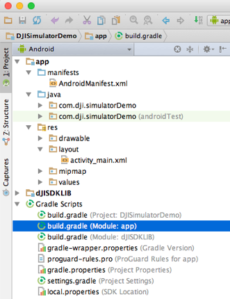
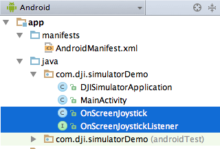
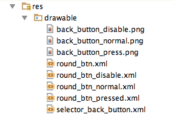
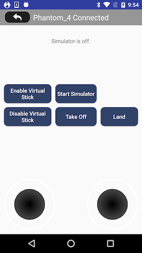
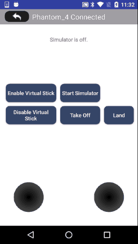

*If you come across any mistakes or bugs in this tutorial, please let us know using a Github issue, a post on the DJI Forum. Please feel free to send us Github pull request and help us fix any issues.*

---

In this tutorial, you will learn how to use the DJISimulator in your Android Studio project using DJI Mobile SDK. With the help of Virtual Stick control, you can input Virtual Stick flight control data and check the changes of simulator state in real time.

You can download the tutorial's final sample code project from this [Github Page](https://github.com/DJI-Mobile-SDK-Tutorials/Android-SimulatorDemo).

We use Mavic Pro as an example to make this demo.

Let's get started!

## Introduction

DJISimulator is used to control the aircraft in a simulated environment based on the virtual stick input. The simulated aircraft state information will also be displayed on the screen.

You can use the `Simulator` class in `FlightController` to control the simulation. It allows both manual and automated flights to be simulated without actually flying the aircraft.

Additionally, simulator initialization, monitoring and termination can be controlled directly through the SDK allowing for application development in continuous integration environments.

## Implementing the UI of Application

In the [Importing and Activating DJI SDK in Android Studio Project](../application-development-workflow/workflow-integrate.html#Android-Studio-Project-Integration) tutorial, you have learned how to import the DJI Android SDK into your Android Studio project and activate your application. If you haven't read that previously, please take a look at it. Once you've done that, let's continue to create the project.

### Importing SDK Library

**1**. Open Android Studio and select **File -> New -> New Project** to create a new project, named 'DJISimulatorDemo'. Enter the company domain and package name (Here we use "com.dji.simulatorDemo") you want and press Next. Set the minimum SDK version as `API 19: Android 4.4 (KitKat)` for "Phone and Tablet" and press Next. Then select "Empty Activity" and press Next. Lastly, leave the Activity Name as "MainActivity", and the Layout Name as "activity_main", press "Finish" to create the project.
 
 **2**. Unzip the Android SDK package downloaded from <a href="http://developer.dji.com/mobile-sdk/downloads/" target="_blank">DJI Developer Website</a>. Go to **File -> New -> Import Module**, enter the "API Library" folder location of the downloaded Android SDK package in the "Source directory" field. A "dJISDKLIB" name will show in the "Module name" field. Press Next and Finish button to finish the settings.
  
 **3**. Next, double click on the "build.gradle(Module: app)" in the project navigator to open it and replace the content with the followings:
 
~~~java
apply plugin: 'com.android.application'

android {
    compileSdkVersion 23
    buildToolsVersion "23.0.1"

    defaultConfig {
        applicationId "com.dji.simulatorDemo"
        minSdkVersion 19
        targetSdkVersion 23
        versionCode 1
        versionName "1.0"
        multiDexEnabled true

    }
    buildTypes {
        release {
            minifyEnabled false
            proguardFiles getDefaultProguardFile('proguard-android.txt'), 'proguard-rules.pro'
        }
    }
}

dependencies {
    compile fileTree(dir: 'libs', include: ['*.jar'])
    testCompile 'junit:junit:4.12'
    compile 'com.android.support:appcompat-v7:23.3.0'
    compile 'com.android.support:multidex:1.0.1'
    compile project(':dJISDKLIB')

}
~~~
 
  Here, we modify its dependencies by adding `compile project(':dJISDKLIB')` in the "dependencies" part at the bottom, and change the **compileSdkVersion**, **buildToolsVersion** number, etc. 
  
 
 
 Then, select the **Tools -> Android -> Sync Project with Gradle Files** on the top bar and wait for Gradle project sync finish.
 
 **4**. Let's right click on the 'app' module in the project navigator and click "Open Module Settings" to open the Project Struture window. Navigate to the "Dependencies" tab, you should find the "dJISDKLIB" appear in the list. Your SDK environmental setup should be ready now!
 
 
 
 **5**. Now, open the MainActivity.java file in `com.dji.simulatorDemo` package and add `import dji.sdk.sdkmanager.DJISDKManager;` at the bottom of the import classes section as shown below:
 
~~~java
package com.dji.simulatorDemo;

import dji.sdk.sdkmanager.DJISDKManager;
~~~

  Wait for a few seconds and check if the words turn red, if they remain gray color, it means you can use DJI Android SDK in your project successfully now.
  
### Building the Layouts of Activity

#### 1. Creating DJISimulatorApplication Class

Right-click on the package `com.dji.simulatorDemo` in the project navigator and choose **New -> Java Class**, Type in "DJISimulatorApplication" in the Name field and select "Class" as Kind field content.
   
Next, Replace the code of the "DJISimulatorApplication.java" file with the following:

~~~java
package com.dji.simulatorDemo;
import android.app.Application;

public class DJISimulatorApplication extends Application {

    @Override
    public void onCreate() {
        super.onCreate();
    }
}
~~~

Here, we override the onCreate() method. We can do some settings when the application is created here.

#### 2. Implementing the Joystick Control

In order to input some simulated data, like `pitch`, `roll`, `yaw` and `verticalThrottle`, you may need a joystick control. Let's work on the implementation of it.

We implement the joystick control base on an open source Github project <a href="https://github.com/Ville-/OnScreenJoystick/tree/master/OnScreenJoystick/src/com/salamientertainment/view/onscreenjoystick" target="_blank"> OnScreenJoystick </a>. You can download the Github project to get the **OnScreenJoystick.java** and **OnScreenJoystickListener.java** files or get them from this tutorial's Github Sample project. Now, copy and paste these two java files to the folder of "com.dji.simulatorDemo" on the left navigator as shown below:

When you touch on the **OnScreenJoystick** view, the `onTouch` method in OnScreenJoystickListener will be called and you can get the "OnScreenJoystick" joystick object, and the x and y coordinate of the knob parameters from this method as shown below:

~~~java
/** Called when the joystick is touched.
 * @param joystick The joystick which has been touched.
 * @param pX The x coordinate of the knob. Values are between -1 (left) and 1 (right).
 * @param pY The y coordinate of the knob. Values are between -1 (down) and 1 (up).
 */
public void onTouch(final OnScreenJoystick joystick, final float pX, final float pY);
~~~

> Note: The values for x coordinate of the knob are between -1 (left) and 1 (right), the values for y coordinate of the knob are between -1 (down) and 1 (up).

Next, copy and paste the **joystick.png** and **joystick_bg.png** files from this tutorial's Github sample project to the **mipmap** folder on the left navigator as shown below:

#### 3. Implementing UI Elements in MainActivity Class

Now, let's open the MainActivity.java file and replace the code with the followings:

~~~java
public class MainActivity extends Activity implements View.OnClickListener {

    private static final String TAG = MainActivity.class.getName();
    protected TextView mConnectStatusTextView;
    private Button mBtnEnableVirtualStick;
    private Button mBtnDisableVirtualStick;
    private ToggleButton mBtnSimulator;
    private Button mBtnTakeOff;
    private Button mBtnLand;
    private TextView mTextView;

    private OnScreenJoystick mScreenJoystickRight;
    private OnScreenJoystick mScreenJoystickLeft;

    @Override
    protected void onCreate(Bundle savedInstanceState) {
        super.onCreate(savedInstanceState);

        // When the compile and target version is higher than 22, please request the
        // following permissions at runtime to ensure the
        // SDK work well.
        if (Build.VERSION.SDK_INT >= Build.VERSION_CODES.M) {
            ActivityCompat.requestPermissions(this,
                    new String[]{Manifest.permission.WRITE_EXTERNAL_STORAGE, Manifest.permission.VIBRATE,
                            Manifest.permission.INTERNET, Manifest.permission.ACCESS_WIFI_STATE,
                            Manifest.permission.WAKE_LOCK, Manifest.permission.ACCESS_COARSE_LOCATION,
                            Manifest.permission.ACCESS_NETWORK_STATE, Manifest.permission.ACCESS_FINE_LOCATION,
                            Manifest.permission.CHANGE_WIFI_STATE, Manifest.permission.MOUNT_UNMOUNT_FILESYSTEMS,
                            Manifest.permission.READ_EXTERNAL_STORAGE, Manifest.permission.SYSTEM_ALERT_WINDOW,
                            Manifest.permission.READ_PHONE_STATE,
                    }
                    , 1);
        }

        setContentView(R.layout.activity_main);
        initUI();
    }

    @Override
    public void onResume() {
        Log.e(TAG, "onResume");
        super.onResume();
    }

    @Override
    public void onPause() {
        Log.e(TAG, "onPause");
        super.onPause();
    }

    @Override
    public void onStop() {
        Log.e(TAG, "onStop");
        super.onStop();
    }

    public void onReturn(View view){
        Log.e(TAG, "onReturn");
        this.finish();
    }

    @Override
    protected void onDestroy() {
        Log.e(TAG, "onDestroy");
        super.onDestroy();
    }

    private void initUI() {

        mBtnEnableVirtualStick = (Button) findViewById(R.id.btn_enable_virtual_stick);
        mBtnDisableVirtualStick = (Button) findViewById(R.id.btn_disable_virtual_stick);
        mBtnTakeOff = (Button) findViewById(R.id.btn_take_off);
        mBtnLand = (Button) findViewById(R.id.btn_land);
        mBtnSimulator = (ToggleButton) findViewById(R.id.btn_start_simulator);
        mTextView = (TextView) findViewById(R.id.textview_simulator);
        mConnectStatusTextView = (TextView) findViewById(R.id.ConnectStatusTextView);
        mScreenJoystickRight = (OnScreenJoystick)findViewById(R.id.directionJoystickRight);
        mScreenJoystickLeft = (OnScreenJoystick)findViewById(R.id.directionJoystickLeft);

        mBtnEnableVirtualStick.setOnClickListener(this);
        mBtnDisableVirtualStick.setOnClickListener(this);
        mBtnTakeOff.setOnClickListener(this);
        mBtnLand.setOnClickListener(this);

        mBtnSimulator.setOnCheckedChangeListener(new CompoundButton.OnCheckedChangeListener() {
            @Override
            public void onCheckedChanged(CompoundButton buttonView, boolean isChecked) {
            }
        });

        mScreenJoystickLeft.setJoystickListener(new OnScreenJoystickListener(){

            @Override
            public void onTouch(OnScreenJoystick joystick, float pX, float pY) {
          }
        });

        mScreenJoystickRight.setJoystickListener(new OnScreenJoystickListener() {

            @Override
            public void onTouch(OnScreenJoystick joystick, float pX, float pY) {
            }
        });
    }

    @Override
    public void onClick(View v) {

        switch (v.getId()) {
            case R.id.btn_enable_virtual_stick:
                break;
            case R.id.btn_disable_virtual_stick:
                break;
            case R.id.btn_take_off:
                break;
            case R.id.btn_land:
                break;
            default:
                break;
        }
    }
}
~~~

In the code above, we implement the following features:

**1.** Create the layout UI elements variables, including two TextView `mConnectStatusTextView`, `mTextView`, four buttons `mBtnEnableVirtualStick`, `mBtnDisableVirtualStick`, `mBtnTakeOff`, `mBtnLand`, one Toggle Button `mBtnSimulator` and two OnScreenJoystick control `mScreenJoystickRight` and `mScreenJoystickLeft`. 

**2.** In the `onCreate()` method, we request several permissions at runtime to ensure the SDK works well when the compile and target SDK version is higher than 22(Like Android Marshmallow 6.0 device and API 23). Then invoke the `initUI()` method to initialize UI variables and their listeners.

**3.** In the `initUI()` method, we first initialize the UI elements variables, then set the click listener of the four buttons to "this". Moreover, implement the `onCheckedChanged()` method of toggle button `mBtnSimulator`'s "setOnCheckedChangeListener". Finally, implement the `onTouch()` method of the two `OnScreenJoystick` objects' "setJoystickListener".

**4.** Override the `onClick()` method to implement the four buttons' click actions.

#### 4. Implementing the MainActivity Layout

Open the **activity_main.xml** layout file and replace the code with the following:

~~~xml
<?xml version="1.0" encoding="utf-8"?>
<RelativeLayout xmlns:android="http://schemas.android.com/apk/res/android"
    xmlns:tools="http://schemas.android.com/tools"
    android:layout_width="match_parent"
    android:layout_height="match_parent"
    android:orientation="vertical">

    <RelativeLayout
        android:id="@+id/main_title_rl"
        android:layout_width="fill_parent"
        android:layout_height="40dp"
        android:background="@color/black_overlay" >

        <ImageButton
            android:id="@+id/ReturnBtn"
            android:layout_width="wrap_content"
            android:layout_height="35dp"
            android:layout_alignParentLeft="true"
            android:layout_centerVertical="true"
            android:layout_marginLeft="5dp"
            android:adjustViewBounds="true"
            android:background="@android:color/transparent"
            android:onClick="onReturn"
            android:scaleType="centerInside"
            android:src="@drawable/selector_back_button" />

        <TextView
            android:id="@+id/ConnectStatusTextView"
            android:layout_width="wrap_content"
            android:layout_height="wrap_content"
            android:layout_centerInParent="true"
            android:text="SimulatorDemo"
            android:textColor="@android:color/white"
            android:textSize="19sp" />
    </RelativeLayout>

    <TextView
        android:layout_marginTop="70dp"
        android:layout_width="wrap_content"
        android:layout_height="wrap_content"
        android:layout_centerHorizontal="true"
        android:text="Simulator is off."
        android:id="@+id/textview_simulator"/>

    <Button
        android:layout_width="wrap_content"
        android:layout_height="wrap_content"
        android:text="Enable Virtual Stick"
        style="@style/common_button"
        android:id="@+id/btn_enable_virtual_stick"
        android:layout_marginLeft="5dp"
        android:layout_alignTop="@+id/btn_start_simulator"
        android:layout_alignStart="@+id/directionJoystickRight"
        android:layout_marginTop="0dp" />

    <Button
        android:layout_width="wrap_content"
        android:layout_height="wrap_content"
        android:text="Disable Virtual Stick"
        style="@style/common_button"
        android:id="@+id/btn_disable_virtual_stick"
        android:layout_below="@+id/btn_enable_virtual_stick"
        android:layout_alignStart="@+id/btn_enable_virtual_stick"
        android:layout_marginLeft="0dp"
        android:layout_alignEnd="@+id/btn_enable_virtual_stick" />

    <Button
        android:layout_width="wrap_content"
        android:layout_height="wrap_content"
        android:text="Take Off"
        style="@style/common_button"
        android:id="@+id/btn_take_off"
        android:layout_alignTop="@+id/btn_disable_virtual_stick"
        android:layout_alignStart="@+id/btn_start_simulator"
        android:layout_marginTop="0dp"
        android:layout_alignEnd="@+id/btn_start_simulator" />

    <ToggleButton
        android:id="@+id/btn_start_simulator"
        android:layout_width="wrap_content"
        android:layout_height="wrap_content"
        android:text="Start Simulator"
        android:textOff="Start Simulator"
        android:textOn="Stop Simulator"
        style="@style/common_button"
        android:layout_below="@+id/textview_simulator"
        android:layout_toEndOf="@+id/btn_enable_virtual_stick"
        android:layout_marginTop="107dp"
        android:layout_marginLeft="10dp" />

    <Button
        android:layout_width="wrap_content"
        android:layout_height="wrap_content"
        android:text="Land"
        style="@style/common_button"
        android:id="@+id/btn_land"
        android:layout_alignTop="@+id/btn_take_off"
        android:layout_marginTop="0dp"
        android:layout_alignEnd="@+id/directionJoystickLeft"
        android:layout_toEndOf="@+id/btn_take_off"
        android:layout_marginLeft="10dp" />

    <com.dji.simulatorDemo.OnScreenJoystick
        android:id="@+id/directionJoystickRight"
        android:layout_width="130dp"
        android:layout_height="130dp"
        android:layout_alignParentLeft="true"
        android:layout_alignParentBottom="true"
        android:layout_marginBottom="10dp"
        android:layout_marginLeft="10dp"
        android:background="@mipmap/joystick_bg"/>

    <com.dji.simulatorDemo.OnScreenJoystick
        android:id="@+id/directionJoystickLeft"
        android:layout_width="130dp"
        android:layout_height="130dp"
        android:layout_alignParentRight="true"
        android:layout_alignParentBottom="true"
        android:layout_marginBottom="10dp"
        android:layout_marginRight="10dp"
        android:background="@mipmap/joystick_bg"/>

</RelativeLayout>
~~~

 In the xml file, first, we implement the RelativeLayout element. We declare an ImageButton(id: ReturnBtnCamera) element to exit the application, and a TextView(id: ConnectStatusTextView) element to show the connection status text. 
  
  Next, create a TextureView(id: textview\_simulator) element to show the simulator state infos. Moreover, create the "Enable Virtual Stick" button(id: btn\_enable\_virtual\_stick), "Disable Virtual Stick" button(id: btn\_disable\_virtual\_stick), "Take Off" button(id: btn\_take\_off), "Land" button(id: btn\_land). Moreover, create the "Start Simulator" toggle button(id: btn\_start\_simulator) and set its **textOn** and **textOff** params to "Start Simulator" and "Stop Simulator".
  
  Lastly, we create two OnScreenJoystick elements (id: directionJoystickRight) and (id:directionJoystickLeft) for joystick control.
  
#### 5. Configuring the Resources

  Once you finish the above steps, let's add some resources files to the **res** folder on the left navigator of Android Studio.
  
  Copy the following image and xml files from the tutorial Github Sample project's **drawable** folder to your project, they are used for the button's UI:
  
  
  
  Next, open the "colors.xml" file and add the following code at the bottom to declare the black overlay color:
  
~~~xml
<color name="black_overlay">#66000000</color>
~~~

 Moreover, open the "strings.xml" file and add the "success" string:
 
~~~xml
<string name="success">Success</string>
~~~

 Lastly, open the "styles.xml" file and add the following code to declare the "common_button" style:
 
~~~xml
<!-- Common button style -->

~~~

### Registering the Application

  Once you finish the above steps, let's register the application on DJI Developer Website and get the **App Key**. If you are not familiar with the App Key, please check [Generate an App Key](../quick-start/index.html#generate-an-app-key) for details.
  
**1.** Open the AndroidManifest.xml file and add the following elements on top of the **application** element: 

~~~xml
<!-- SDK permission requirement -->
    <uses-permission android:name="android.permission.BLUETOOTH" />
    <uses-permission android:name="android.permission.BLUETOOTH_ADMIN" />
    <uses-permission android:name="android.permission.VIBRATE" />
    <uses-permission android:name="android.permission.INTERNET" />
    <uses-permission android:name="android.permission.ACCESS_WIFI_STATE" />
    <uses-permission android:name="android.permission.WAKE_LOCK" />
    <uses-permission android:name="android.permission.ACCESS_COARSE_LOCATION" />
    <uses-permission android:name="android.permission.ACCESS_NETWORK_STATE" />
    <uses-permission android:name="android.permission.ACCESS_FINE_LOCATION" />
    <uses-permission android:name="android.permission.CHANGE_WIFI_STATE" />
    <uses-permission android:name="android.permission.MOUNT_UNMOUNT_FILESYSTEMS" />
    <uses-permission android:name="android.permission.WRITE_EXTERNAL_STORAGE" />
    <uses-permission android:name="android.permission.READ_EXTERNAL_STORAGE" />
    <uses-permission android:name="android.permission.SYSTEM_ALERT_WINDOW" />
    <uses-permission android:name="android.permission.READ_PHONE_STATE" />

    <uses-feature
        android:name="android.hardware.usb.host"
        android:required="false" />
    <uses-feature
        android:name="android.hardware.usb.accessory"
        android:required="true" />

<!-- SDK requirement permission end -->
~~~

Here, we request permissions that the application must be granted in order for it to register DJI SDK correctly. Also we declare the camera and usb hardwares which is used by the application.

Moreover, let's add the following elements as childs of element on top of the "MainActivity" activity element as shown below:

~~~xml
<!-- DJI SDK -->
<meta-data
    android:name="com.dji.sdk.API_KEY"
    android:value="Please enter your APP Key here." />
    
<service android:name="dji.sdk.sdkmanager.DJIGlobalService" >
</service>

<activity
    android:name="dji.sdk.sdkmanager.DJIAoaControllerActivity"
    android:theme="@android:style/Theme.Translucent" >
    <intent-filter>
        <action android:name="android.hardware.usb.action.USB_ACCESSORY_ATTACHED" />
    </intent-filter>

    <meta-data
     android:name="android.hardware.usb.action.USB_ACCESSORY_ATTACHED"
        android:resource="@xml/accessory_filter" />
</activity>

<!-- DJI SDK -->
~~~

In the code above, you should substitude your **App Key** of the application for "Please enter your App Key here." in the **value** attribute under the `android:name="com.dji.sdk.API_KEY"` attribute.

**2.** After you finish the steps above, open the "DJISimulatorApplication.java" file and replace the code with the same file in the Github Source Code, here we explain the important parts of it:

~~~java
@Override
public void onCreate() {
    super.onCreate();

    mHandler = new Handler(Looper.getMainLooper());

    /**
     * handles SDK Registration using the API_KEY
     */
    DJISDKManager.getInstance().registerApp(this, mDJISDKManagerCallback);
}

private DJISDKManager.SDKManagerCallback mDJISDKManagerCallback = new DJISDKManager.SDKManagerCallback() {

    @Override
    public void onRegister(DJIError error) {

        Handler handler = new Handler(Looper.getMainLooper());

        if(error == DJISDKError.REGISTRATION_SUCCESS) {

            handler.post(new Runnable() {

                @Override
                public void run() {
                    Toast.makeText(getApplicationContext(),
                            R.string.success,
                            Toast.LENGTH_LONG).show();
                }
            });

            DJISDKManager.getInstance().startConnectionToProduct();
        } else {
            handler.post(new Runnable() {

                @Override
                public void run() {
                    Toast.makeText(getApplicationContext(),
                            R.string.sdk_registration_message,
                            Toast.LENGTH_LONG).show();
                }
            });

        }
        Log.v(TAG, error.getDescription());
    }

    @Override
    public void onProductChange(BaseProduct oldProduct, BaseProduct newProduct) {

        Log.v(TAG, String.format("onProductChanged oldProduct:%s, newProduct:%s", oldProduct, newProduct));
        mProduct = newProduct;
        if(mProduct != null) {
            mProduct.setBaseProductListener(mDJIBaseProductListener);
        }

        notifyStatusChange();
    }

    private BaseProduct.BaseProductListener mDJIBaseProductListener = new BaseProduct.BaseProductListener() {

        @Override
        public void onComponentChange(BaseProduct.ComponentKey key, BaseComponent oldComponent, BaseComponent newComponent) {

            if(newComponent != null) {
                newComponent.setComponentListener(mDJIComponentListener);
            }
            Log.v(TAG, String.format("onComponentChange key:%s, oldComponent:%s, newComponent:%s", key, oldComponent, newComponent));

            notifyStatusChange();
        }

        @Override
        public void onConnectivityChange(boolean isConnected) {

            Log.v(TAG, "onConnectivityChange: " + isConnected);

            notifyStatusChange();
        }

    };
~~~

Here, we implement several features:
  
1. We override the `onCreate()` method to initialize the DJISDKManager.
2. Implement the two interface methods of `SDKManagerCallback`. You can use the `onRegister()` method to check the Application registration status and show text message here. Using the `onProductChange()` method, we can check the product connection status and invoke the `notifyStatusChange()` method to notify status changes.
3. Implement the two interface methods of `BaseProductListener`. You can use the `onComponentChange()` method to check the product component change status and invoke the `notifyStatusChange()` method to notify status changes. Also, you can use the `onConnectivityChange()` method to notify the product connectivity changes.

Now let's build and run the project and install it to your Android device. If everything goes well, you should see the "success" textView like the following screenshot when you register the app successfully.

> **Important:** Please check if the "armeabi-v7a", "arm64-v8a" and "x86" lib folders has been added to your jnLibs folder in **dJISDKLib** successfully before testing resgistering the app. 
> 
> 
> 

For more details of integrating and activating the SDK in Android Studio, please check: [Android Studio Project Integration](../application-development-workflow/workflow-integrate.html#android-studio-project-integration).

## Working on MainActivity class

### Update Product Connection Status

Now, let's update the product connection status. Open the "MainActivity.java" file and add the following code at the bottom of `onCreate()` method:

~~~java
    IntentFilter filter = new IntentFilter();
    filter.addAction(DJISimulatorApplication.FLAG_CONNECTION_CHANGE);
    registerReceiver(mReceiver, filter);
~~~

The code above register the broadcast receiver for receiving the device connection's changes.

Next, add the following four methods below `onCreate()` and override the `onResume()` and `onDestroy()` methods as shown below:

~~~java
protected BroadcastReceiver mReceiver = new BroadcastReceiver() {

        @Override
        public void onReceive(Context context, Intent intent) {
            updateTitleBar();
        }
    };

public void showToast(final String msg) {
    runOnUiThread(new Runnable() {
        public void run() {
            Toast.makeText(MainActivity.this, msg, Toast.LENGTH_SHORT).show();
        }
    });
}

private void updateTitleBar() {
    if(mConnectStatusTextView == null) return;
    boolean ret = false;
    BaseProduct product = DJISimulatorApplication.getProductInstance();
    if (product != null) {
        if(product.isConnected()) {
            //The product is connected
            mConnectStatusTextView.setText(DJISimulatorApplication.getProductInstance().getModel() + " Connected");
            ret = true;
        } else {
            if(product instanceof Aircraft) {
                Aircraft aircraft = (Aircraft)product;
                if(aircraft.getRemoteController() != null && aircraft.getRemoteController().isConnected()) {
                    // The product is not connected, but the remote controller is connected
                    mConnectStatusTextView.setText("only RC Connected");
                    ret = true;
                }
            }
        }
    }

    if(!ret) {
        // The product or the remote controller are not connected.
        mConnectStatusTextView.setText("Disconnected");
    }
}

@Override
public void onResume() {
    Log.e(TAG, "onResume");
    super.onResume();
    updateTitleBar();
}

@Override
protected void onDestroy() {
    Log.e(TAG, "onDestroy");
    unregisterReceiver(mReceiver);

    super.onDestroy();
}
    
~~~

As the code shown above, we implement the following features:

**1.** Create a BroadcastReceiver object `mReceiver`, override its `onReceive()` method and invoke the `updateTitleBar()` method to update the `mConnectStatusTextView`'s content.

**2.** Create the `showToast()` method to display the toast notification message to users.

**3.** In the `updateTitleBar()` method, we first check if mConnectStatusTextView is null, then create a BaseProduct object by invoking the `getProductInstance()` method of DJISimulatorApplication. 

Moreover, invoke the `isConnected()` method of BaseProduct to check if the product is connected, then invoke the `getModel()` method of BaseProduct to get the model name and show it in `mConnectStatusTextView`. If the product is not connected, cast the `product` object as Aircraft object, and check if the remoteController is not null and if it's connected, then update the `mConnectStatusTextView`'s text content. 

Lastly, if the product or remote controller are not connected, then update the `mConnectStatusTextView`'s text with "Disconnected".

**4.** We override the `onResume()` method to invoke the `updateTitleBar()` method to update `mConnectStatusTextView` when the activity start interacting with the user. Then override the `onDestroy()` method to unregister the BroadcastReceiver object.

Now let's build and run the project and install it to your Android device. Then connect the demo application to your Mavic Pro (Please check [Run Application](../application-development-workflow/workflow-run.html) for more details), if everything goes well, you should see the title textView content updates to "MavicPro Connected" as shown below:

### Implementing Virtual Stick Control

 Since we have implemented the Joystick control, now let's continue to work on sending virtual stick flight control data to the aircraft. First, we create a DJIFlightController variable `mFlightController`, a Timer variable `mSendVirtualStickDataTimer`, a SendVirtualStickDataTask(extends from TimerTask class) variable `mSendVirtualStickDataTask` and four float variables on top of `onCreate()` method as shown below:
 
 ~~~java
    private FlightController mFlightController;
    private Timer mSendVirtualStickDataTimer;
    private SendVirtualStickDataTask mSendVirtualStickDataTask;
    
    private float mPitch;
    private float mRoll;
    private float mYaw;
    private float mThrottle;
 ~~~
 
 We may use the `mPitch`, `mRoll`, `mYaw` and `mThrottle` variables to store the **pitch**, **roll**, **yaw** and **vertical throttle** virtual stick flight control data.
 
 Next, create the `initFlightController()` method, invoke it in the `onResume()` method and implement the SendVirtualStickDataTask class as shown below:
 
~~~java
private void initFlightController() {

    Aircraft aircraft = DJISimulatorApplication.getAircraftInstance();
    if (aircraft == null || !aircraft.isConnected()) {
        showToast("Disconnected");
        mFlightController = null;
        return;
    } else {
        mFlightController = aircraft.getFlightController();
    }
}

@Override
public void onResume() {
    Log.e(TAG, "onResume");
    super.onResume();
    updateTitleBar();
    initFlightController();
}

class SendVirtualStickDataTask extends TimerTask {

        @Override
        public void run() {

            if (mFlightController != null) {
                mFlightController.sendVirtualStickFlightControlData(
                        new FlightControlData(
                                mPitch, mRoll, mYaw, mThrottle
                        ), new CommonCallbacks.CompletionCallback() {
                            @Override
                            public void onResult(DJIError djiError) {

                            }
                        }
                );
            }
        }
    }
~~~

In the code above, we implement the following features:

**1.** In the `initFlightController()` method, we first check if the aircraft is not null and is connected, then invoke the `getFlightController()` method of Aircraft to get the `mFlightController` variable.

**2.** Next, extends from TimerTask class to create the **SendVirtualStickDataTask** class. Inside the class, override the `run()` method to invoke the `sendVirtualStickFlightControlData()` method of FlightController to send virtual stick flight control data. Here, we create the **FlightControlData** object from the four float variables declared before: `mPitch`, `mRoll`, `mYaw` and `mThrottle`.

Once you finish the above steps, let's implement the `setJoystickListener()` methods of `mScreenJoystickLeft` and `mScreenJoystickRight` variables at the bottom of `initUI()` method as shown below:

~~~java
    mScreenJoystickLeft.setJoystickListener(new OnScreenJoystickListener(){

        @Override
        public void onTouch(OnScreenJoystick joystick, float pX, float pY) {
            if(Math.abs(pX) < 0.02 ){
                pX = 0;
            }

            if(Math.abs(pY) < 0.02 ){
                pY = 0;
            }
            float pitchJoyControlMaxSpeed = 10;
            float rollJoyControlMaxSpeed = 10;

            mPitch = (float)(pitchJoyControlMaxSpeed * pY);

            mRoll = (float)(rollJoyControlMaxSpeed * pX);

            if (null == mSendVirtualStickDataTimer) {
                mSendVirtualStickDataTask = new SendVirtualStickDataTask();
                mSendVirtualStickDataTimer = new Timer();
                mSendVirtualStickDataTimer.schedule(mSendVirtualStickDataTask, 0, 200);
            }

        }

    });

    mScreenJoystickRight.setJoystickListener(new OnScreenJoystickListener() {

        @Override
        public void onTouch(OnScreenJoystick joystick, float pX, float pY) {
            if(Math.abs(pX) < 0.02 ){
                pX = 0;
            }

            if(Math.abs(pY) < 0.02 ){
                pY = 0;
            }
                 float verticalJoyStickControlMaxSpeed = 2;
                float yawJoyStickControlMaxSpeed = 3;

                mYaw = (float)(yawJoyStickControlMaxSpeed * pX);
                mThrottle = (float)(yawJoyStickControlMaxSpeed * pY);

            if (null == mSendVirtualStickDataTimer) {
                mSendVirtualStickDataTask = new SendVirtualStickDataTask();
                mSendVirtualStickDataTimer = new Timer();
                mSendVirtualStickDataTimer.schedule(mSendVirtualStickDataTask, 0, 200);
            }

        }
    });
~~~

Here, we implement the following features:

**1.** Override the `onTouch()` method of **setJoystickListener** and filter the `pX` and `pY` variables' value by checking if they are less than 0.02. We should not send the virtual stick data to flight controller too frequently if the value is too small.

**2.** Get the maximum velocity of vertical control and maximum angle velocity of Virtual Stick, then store them to `verticalJoyControlMaxSpeed` and `yawJoyControlMaxSpeed` variables. Since the value of `pX` is between -1 (left) and 1 (right), the value of `pY` is between -1 (down) and 1 (up), we multiply by using the `verticalJoyControlMaxSpeed` and `yawJoyControlMaxSpeed` valures to update the `mYaw` and `mThrottle` data. Here we take Mode 2(American mode) of remote controller as example.

**3.** Lastly, we check if `mSendVirtualStickDataTimer` is null, and create it by invoking the `SendVirtualStickDataTask()` method. Then, create the `mSendVirtualStickDataTimer` and invoke its `schedule()` method to trigger the timer by passing `mSendVirtualStickDataTask` variable, 0 milliseconds of delay and 200 milliseconds between subsequent executions.

**4.** Similarly, implement the `setJoystickListener()` method of `mScreenJoystickRight` variable to update the `mYaw` and `mThrottle` values and trigger the timer to send virtual stick data to the aircraft's flight controller.

Now, when you control the left and right joysticks, they will send the simulated virtual stick data (Including **Yaw**, **Pitch**, **Roll** and **Vertical Throttle**) to the flight controller of aircraft.

Lastly, override the `onClick()` method to implement the enable and disable virtual stick control buttons click actions as shown below:

~~~java
@Override
  public void onClick(View v) {

     switch (v.getId()) {
        case R.id.btn_enable_virtual_stick:
            if (mFlightController != null){

                mFlightController.setVirtualStickModeEnabled(true, new CommonCallbacks.CompletionCallback() {
                    @Override
                    public void onResult(DJIError djiError) {
                        if (djiError != null){
                            showToast(djiError.getDescription());
                        }else
                        {
                            showToast("Enable Virtual Stick Success");
                        }
                    }
                });
            }
            break;

        case R.id.btn_disable_virtual_stick:
            if (mFlightController != null){
                mFlightController.setVirtualStickModeEnabled(false, new CommonCallbacks.CompletionCallback() {
                    @Override
                    public void onResult(DJIError djiError) {
                        if (djiError != null) {
                            showToast(djiError.getDescription());
                        } else {
                            showToast("Disable Virtual Stick Success");
                        }
                    }
                });
            }
            break;
        }
    }
~~~

This invoke the `enableVirtualStickControlMode()` and `disableVirtualStickControlMode()` methods of FlightController to enable and disable the virtual stick control mode.

### Implementing DJISimulator

Let's implement the DJISimulator feature now. In order to update the simulator state data in `mTextView`, we may need to implement the `setStateCallback()` method of DJISimulator in the `initFlightController()` method as shown below:

~~~objc
    private void initFlightController() {

        Aircraft aircraft = DJISimulatorApplication.getAircraftInstance();
        if (aircraft == null || !aircraft.isConnected()) {
            showToast("Disconnected");
            mFlightController = null;
            return;
        } else {
            mFlightController = aircraft.getFlightController();
            mFlightController.getSimulator().setStateCallback(new SimulatorState.Callback() {
                @Override
                public void onUpdate(final SimulatorState stateData) {
                    new Handler(Looper.getMainLooper()).post(new Runnable() {
                        @Override
                        public void run() {

                            String yaw = String.format("%.2f", stateData.getYaw());
                            String pitch = String.format("%.2f", stateData.getPitch());
                            String roll = String.format("%.2f", stateData.getRoll());
                            String positionX = String.format("%.2f", stateData.getPositionX());
                            String positionY = String.format("%.2f", stateData.getPositionY());
                            String positionZ = String.format("%.2f", stateData.getPositionZ());

                            mTextView.setText("Yaw : " + yaw + ", Pitch : " + pitch + ", Roll : " + roll + "\n" + ", PosX : " + positionX +
                                    ", PosY : " + positionY +
                                    ", PosZ : " + positionZ);
                        }
                    });
                }
            });
        }
    }
~~~

In the code above, we override the `onUpdate()` method to get the lastest simulator state data, then invoke the `getYaw()`, `getPitch()`, `getRoll()`, `getPositionX()`, `getPositionY()` and `getPositionZ()` methods of `SimulatorState` to get the updated yaw, pitch, roll, positionX, positionY and positionZ values and show them in `mTextView`.

Next, override the `onCheckedChanged()` method of `mBtnSimulator` toggleButton's  `setOnCheckedChangeListener()` method as shown below:

~~~java
mBtnSimulator.setOnCheckedChangeListener(new CompoundButton.OnCheckedChangeListener() {
    @Override
    public void onCheckedChanged(CompoundButton buttonView, boolean isChecked) {
        if (isChecked) {

            mTextView.setVisibility(View.VISIBLE);

            if (mFlightController != null) {

                mFlightController.getSimulator()
                        .start(InitializationData.createInstance(new LocationCoordinate2D(23, 113), 10, 10),
                                new CommonCallbacks.CompletionCallback() {
                            @Override
                            public void onResult(DJIError djiError) {
                                if (djiError != null) {
                                    showToast(djiError.getDescription());
                                }else
                                {
                                    showToast("Start Simulator Success");
                                }
                            }
                        });
            }

        } else {

            mTextView.setVisibility(View.INVISIBLE);

            if (mFlightController != null) {
                mFlightController.getSimulator()
                        .stop(new CommonCallbacks.CompletionCallback() {
                                    @Override
                                    public void onResult(DJIError djiError) {
                                        if (djiError != null) {
                                            showToast(djiError.getDescription());
                                        }else
                                        {
                                            showToast("Stop Simulator Success");
                                        }
                                    }
                                }
                        );
            }
        }
    }
});
~~~

In the code above, we implement the following features:

**1.** If the `mBtnSimulator` toggle button is checked, then show the `mTextView`. Next, if the `mFlightController` is not null, we invoke the `start()` method of DJISimulator by passing  a `InitializationData` with LocationCoordinate2D struct (lattitude 23 and longitude 113), updateFrequency 10 and satelliteCount 10 parameters to it. For more details of DJISimulatorInitializationData, please check the [Android API Reference](https://developer.dji.com/iframe/mobile-sdk-doc/android/reference/dji/sdk/FlightController/DJISimulatorInitializationData.html).

**2.** Next, overide the `onResult()` method of `start()`, invoke `showToast()` method to show the start simulator result to the user.

**3.** Similarly, if the `mBtnSimulator` toggle button is not checked, then invoke the `stop()` method of DJISimulator to stop the simulator. Furthermore, override the `onResult()` method and invoke the `showToast()` method to show the stop simulator result to the user.

### Working on Takeoff and AutoLanding features

Finally, let's add the following code at the bottom of `onClick()` method to implement the **Take off** and **Land** buttons' click actions as shown below:

~~~java
case R.id.btn_take_off:
    if (mFlightController != null){
        mFlightController.startTakeoff(
                new CommonCallbacks.CompletionCallback() {
                    @Override
                    public void onResult(DJIError djiError) {
                        if (djiError != null) {
                            showToast(djiError.getDescription());
                        } else {
                            showToast("Take off Success");
                        }
                    }
                }
        );
    }

    break;

case R.id.btn_land:
    if (mFlightController != null){

        mFlightController.startLanding(
                new CommonCallbacks.CompletionCallback() {
                    @Override
                    public void onResult(DJIError djiError) {
                        if (djiError != null) {
                            showToast(djiError.getDescription());
                        } else {
                            showToast("Start Landing");
                        }
                    }
                }
        );

    }

    break;
~~~

For the case of "R.id.btn\_take\_off", we invoke the `startTakeoff()` method of FlightController to send the take off command to the aircraft. Similiarly, for the case of "R.id.btn_land", we invoke the `startLanding()` method to send the auto landing command. It's just that simple and easy.

We have gone through a long way in this tutorial, now let's build and run the project, connect the demo application to  your Mavic Pro (Please check [Run Application](../application-development-workflow/workflow-run.html) for more details) and check all the features we have implemented so far. 

If everything goes well, you should see something similiar to the following gif animations like this:

 <html>

</html>
 
- If the demo application is connected with Mavic Pro successfully, you should see the title textView content updates to "MavicPro Connected".

- Press **Enable Virtual Stick** button to enable virtual stick control, then press **Start Simulator** to start the simulator.

- Moreover, press the **Take Off** button to send take off command to the aircraft, if the command executes successfully, you should see the **PosZ** value start to change, means that the aircraft is rising.

- Now you can drag the left and right virtual stick controls to simulate the flight behavious.

- Lastly, press the **Land** button to make the aircraft start auto landing, once it finish, you may notice the **PosZ** value becomes "0.00". Press the **Stop Simulator** button to stop the simulator and then press **Disable Virtual Stick** to disable the virtual stick control.

### Summary

In this tutorial, you've learned how to use the DJISimulator feature to simulate aircraft's flight behaviour in a simulated environment based on the virtual stick control input and show the changes of simulator state(Yaw,Pitch,Roll,PosX,PosY and PosZ) in real time. Also you've learned how to use Virtual Stick control to send virtual stick flight control data to the aircraft.

This demo is a simple demonstration of using DJISimulator, to have a better user experience, you can create a 3D simulated environment using 3D game engine like <a href="https://unity3d.com" target="_blank"> Unity3D </a> to show the simulated data and aircraft flight behavious inside your mobile application (Like the Flight Simulator in DJI Go app)!  

Furthermore, the DJISimulator allows for automated testing in continous integration environment(Like <a href="https://jenkins.io" target="_blank">Jenkins</a>), it would help your DJI-SDK based application testing process. Good luck, and hope you enjoyed this tutorial!

