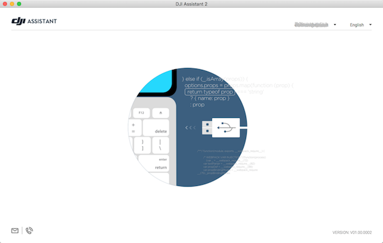
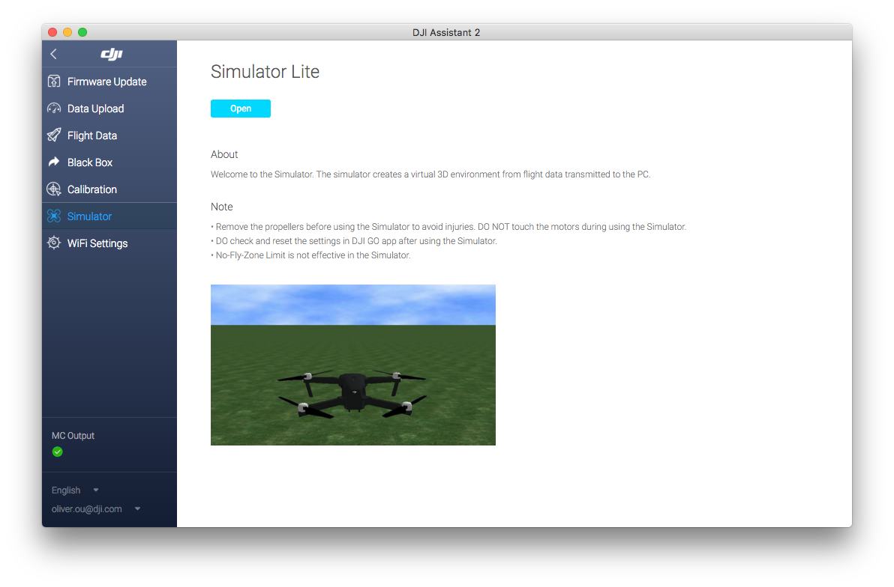
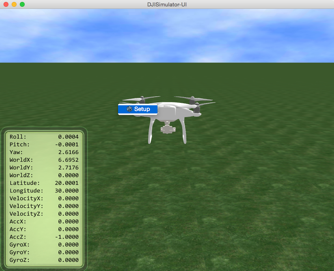
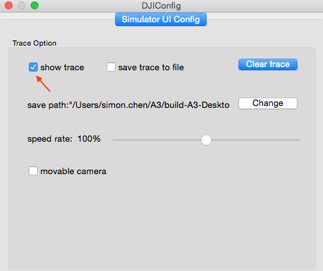
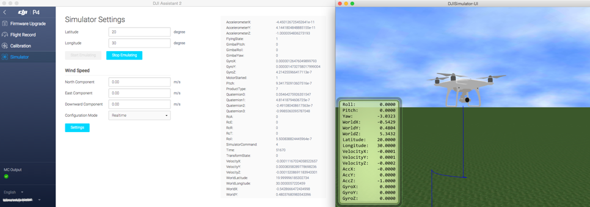
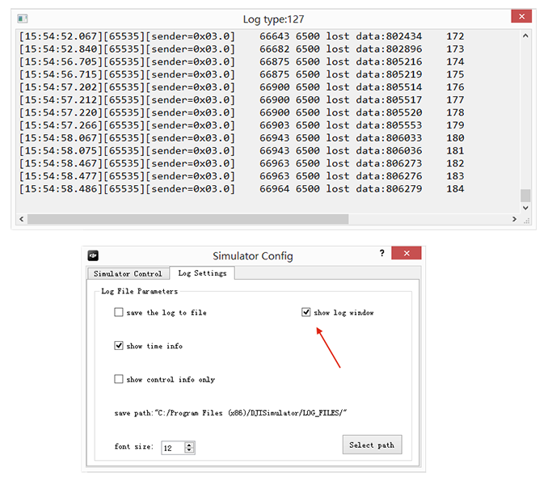
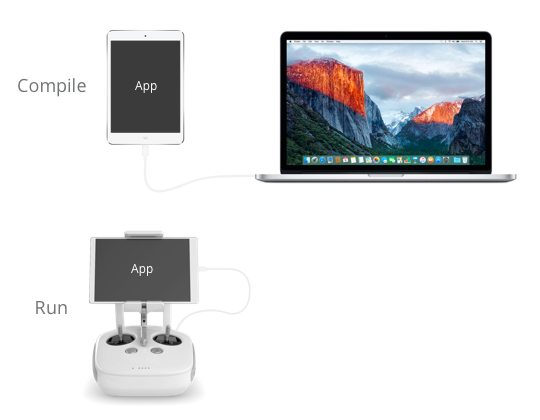
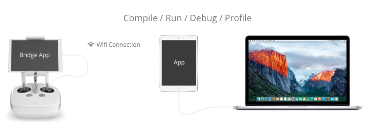

Application development requires extensive testing, profiling and debugging. DJI provides tools including an aircraft simulator, a wireless bridge application and remote logging functionality to make development faster and more convenient.

## Aircraft Simulator

DJI aircraft products include a simulator that resides in the aircraft Flight Controller that can: 

* Take aircraft control input from the remote controller (manual flight) or application (SDK commands)
* Simulate aircraft behavior in a simulated environment based on the input
* Output aircraft state information based on the simulated behavior

This allows both manual and automated flights to be simulated without actually flying the aircraft.

DJI provides tools for Windows and Mac which can be used to initialize the simulator, and visualize the aircraft behavior based on the state information provided by the simulator:

* **DJI Assistant 2** (<a href="http://www.dji.com/phantom-4/info#downloads" target="_blank"> Windows </a> or <a href="http://www.dji.com/phantom-4/info#downloads" target="_blank"> Mac </a>) is used newer aircraft like Mavic Pro, Phantom 4 series, Inspire 2 and Matrice series.
* **DJI PC Simulator** ( <a href="https://dev.dji.com/downloads/dev/0d63fc06-30a9-4818-9b27-66265f777cdd" target="_blank"> Windows </a> only) is used for Phantom 3 series, Inspire 1 series of aircraft.

Additionally, simulator initialization, monitoring and termination can be controlled directly through the SDK allowing for application development in continuous integration environments.

### DJI Assistant 2 Simulator

The DJI Assistant 2 tool is built specifically for SDK developers and can initialize, terminate and provide visualization of the aircraft simulator running in the Flight Controller of the DJI aircraft. DJI Assistant 2 connects to the aircraft through USB.

* Supported DJI Products: Mavic Pro, Matrice series, Phantom 4 Series, Inspire 2.
* Supported Operating Systems: Mac OS X 10, Windows 7, Windows 8, and Windows 8.1

> **Note:** Windows 10 is not officially supported, but generally does work.

#### Installation and Setup

##### Mac

* Download <a href="http://www.dji.com/phantom-4/info#downloads" target="_blank"> DJI Assistant 2 </a> for Mac.
* Install the driver by double clicking on it and following the instructions.
* Open the downloaded **DMG** file.
* Drag **Assistant.app** into the systems **Applications** folder.

##### Windows

* Download <a href="http://www.dji.com/phantom-4/info#downloads" target="_blank"> DJI Assistant 2 </a> for Windows.
* Run the installer executable.
* Follow the installation instructions.
* During installation, confirm the request to install the driver.

#### Using DJI Assistant 2

On launch, a window asking for connection of DJI Assistant 2 to the Aircraft will appear.

Connect the aircraft to the Mac or PC with a **USB cable**.

Turn on the remote controller and then turn on the aircraft. After a few seconds, the application will detect the aircraft.

Select "Mavic Pro" in the connected devices page, and select the **Simulator** tab on the left side. The following screen should be seen:

 

Press the **Open** button and enter the desired starting latitude and longitude and wind speed desired.

Press the **Start Emulating** button. The connected product will be shown, as well as some of the position and speed state information.

 
 
 > **Note:** Positive World X, Y and Z are North, East and Up directions respectively.
 >

Take-off and fly with the remote controller to experiment with the simulator.

The view angle can be changed by left-clicking and dragging in the visualization window. Scrolling within the window will zoom in and out.

While flying, the flight path can be traced by right clicking on the visualization and selecting **Setup**.

 

Then select **show trace** under the simulator UI Config tab to display the flight trace, as shown below:

 

The flight path trace will then be added to the visualization.

 

### DJI PC Simulator

The DJI PC Simulator tool is built specifically for SDK developers and can initialize, terminate and provide visualization of the aircraft simulator running in the Flight Controller of the DJI aircraft. The DJI PC Simulator tool connects to the aircraft through USB.

* Supported DJI Products: Phantom 3 series, Inspire 1 series.
* Supported Operating Systems: Windows 7, Windows 8, Windows 8.1

> **Note:** Windows 10 is not officially supported, but generally does work.

##### Installation and Setup

* Download the **DJI PC Simulator Installer and User Manual** and **WIN Driver Installer** from this page: <http://developer.dji.com/mobile-sdk/downloads/>

* Run the **Win Driver Installer**
    * For earlier product compatibility, a dialog box with the message _Please power on MC and connect it to PC via USB!_ will be shown.
    * No action is required now, so press **Yes** to continue.
    * Follow the remaining installation steps.

* Run the **DJI PC Simulator Installer** 
    * Follow the installation steps to complete installation.

##### Using the DJI PC Simulator

The **DJI PC Simulator** can either be run on a Windows PC or on a virtual machine (like Parallels or VMWare) on a Mac.

First connect the Windows PC to the aircraft using USB and turn on the aircraft.

Start **DJI PC Simulator** to configure and initialize the aircraft simulator. Set latitude and longitude for simulation. 
 

>**Note:** The aircraft will not take off if the latitude and longitude is too close to or inside a <a href="http://flysafe.dji.com/no-fly" target="_blank"> No Fly Zone </a>.
>
 
If the aircraft is on and connected to the PC, then the serial number should be displayed in the **SN:** text view.

Select **show log window** under the **Log Settings** tab to display the log window.
 

Back in the **Simulator Control** tab, press **Start Simulation** to start the aircraft simulator. At this point the aircraft will simulate flight without actually starting the motors.

Press **Display Simulation** to start the visualization.

Take-off and fly with the remote controller to experiment with the simulator.

The visualization will show the connected product (in this case an Inspire 1), as well as some of the position and speed state information.

 
 
 > **Note:** Positive World X, Y and Z are North, East and Up directions respectively.
 >

The view angle can be changed by left-clicking and dragging in the visualization window. Scrolling within the window will zoom in and out.

 
  
While flying, the flight path can be traced by right clicking on the visualization and selecting **Setup**.

 

Then select **show trace** under the simulator UI Config tab to display the flight trace, as shown below:

 

The flight path trace will then be added to the visualization.

 

In the **Simulator Config** window, **Stop Simulation** can be pressed to stop the simulation. 

>**Important:** To stop midway through a Waypoint Mission, stop the mission from the application, then stop the simulator. Otherwise the simulator may run the previous waypoint mission when restarted.
>

For more info about **DJI PC Simulator**, check the User Manual pdf file included in the download of **DJI PC Simulator.** 

### Continuous Integration Simulation

**DJI Assistant 2** and **DJI PC Simulator** both provide visualization of the aircraft simulator which requires a PC or Mac to be connected to the aircraft.

If visualization is not required, the DJI SDK can be used to start and stop the simulator. This means simulation can be performed without aircraft connection to a Mac or PC, allowing for automated testing in continuous integration environments.

The `DJISimulator` class in `DJIFlightController` is used to control the simulation. The class provides the ability to:

* Start and stop simulation
* Seed the simulation with a GPS location
* Retrieve state information about the aircraft relative to the world.

Sample code is provided on using the simulator in a project here: [iOS](../ios-tutorials/SimulatorDemo.html) | [Android](../android-tutorials/SimulatorDemo.html).

## Wireless Bridge App

For both Android and iOS, application development is most efficient when the mobile device is connected directly to Android Studio or Xcode through a USB cable.

However, some DJI aircraft require direct connection between the aircraft's remote controller and mobile device. This means the application cannot be connected to the development environment directly through USB.

 
 
For Android, ADB over WiFi can be used to enable real time development, however there is no such option for iOS.

Therefore, DJI provides a Wireless Bridge Application, or **Bridge App**. 

* The Bridge App connects directly to the remote controller. 
* The mobile device running the developer's application is connected to the Mac. 
* The SDK reroutes all aircraft traffic from USB to a WiFi connection with the Bridge App device.

 
 
>**Note:** If only one mobile device is available, the Bridge App can also be run with the iOS simulator. In this case the mobile device would host the bridge app, while the developer application runs on the iOS simulator.

The Bridge App is provided by DJI under the MIT license from Github <a href="https://github.com/dji-sdk/iOS-Bridge-App" target="_blank"> here </a>.

A tutorial describing how to use the DJI Bridge App is [here](../ios-tutorials/BridgeAppDemo.html).

## Remote Logging

When testing an application in the field some form of logging is often required to understand behavior.

For iOS, the DJI Mobile SDK can be setup to allow remote logging. If the mobile device has an internet connection, messages can be logged to a remote server as they are generated during flight.

A tutorial describing how to use Remote Logging is [here](../ios-tutorials/RemoteLoggerDemo.html).
