**Note: This Tutorial and Sample Project is developed based on Android SDK v3.5.1, an update version for Android SDK v4.0 will be published soon.**

---

In this tutorial, you will learn how to use the `DJIFlyZoneManager` and `DJIFlyZoneInformation` of DJI Mobile SDK to get the fly zone information, and unlock authorization fly zones.

You can download the tutorial's final sample code project from this [Github Page](https://github.com/DJI-Mobile-SDK-Tutorials/Android-GEODemo).

We use Phantom 4 as an example to make this demo. Let's get started!

## Introduction

The [Geospatial Environment Online (GEO) system](http://www.dji.com/flysafe/geo-system) is a best-in-class geospatial information system that provides drone operators with information that will help them make smart decisions about where and when to fly. It combines up-to-date airspace information, a warning and flight-restriction system, a mechanism for [unlocking](http://www.dji.com/flysafe/geo-system/unlock) (self-authorizing) drone flights in locations where flight is permitted under certain conditions, and a minimally-invasive accountability mechanism for these decisions.

## Implementing the UI of the Application

In the [Importing and Activating DJI SDK in Android Studio Project](../application-development-workflow/workflow-integrate.html#Android-Studio-Project-Integration) tutorial, you have learned how to import the DJI Android SDK into your Android Studio project and activate your application. If you haven't read that previously, please take a look at it. Once you've done that, let's continue to create the project.

### Importing SDK Library

**1**. Open Android Studio and select **File -> New -> New Project** to create a new project, named 'DJIGEODemo'. Enter the company domain and package name (Here we use "com.dji.geodemo") you want and press Next. Set the minimum SDK version as `API 19: Android 4.4 (KitKat)` for "Phone and Tablet" and press Next. Then select "Google Maps Activity" and press Next. Lastly, leave the Activity Name as "MainActivity", and the Layout Name as "activity_main", Press "Finish" to create the project.
 
**2**. Unzip the Android SDK package downloaded from <a href="http://developer.dji.com/mobile-sdk/downloads/" target="_blank">DJI Developer Website</a>. Go to **File -> New -> Import Module**, enter the "API Library" folder location of the downloaded Android SDK package in the "Source directory" field. A "dJISDKLib" name will show in the "Module name" field. Press Next and Finish button to finish the settings.
 
 
 
**3**. Next, double click on the "build.gradle(Module: app)" in the project navigator to open it and replace the content with the followings:
 
~~~java
apply plugin: 'com.android.application'

android {
    compileSdkVersion 23
    buildToolsVersion "23.0.3"

    defaultConfig {
        applicationId "com.dji.geodemo"
        minSdkVersion 19
        targetSdkVersion 22
        versionCode 1
        versionName "1.0"
        //Enabling multidex support
        multiDexEnabled true //Mention in the doc
    }
    buildTypes {
        release {
            minifyEnabled false
            proguardFiles getDefaultProguardFile('proguard-android.txt'), 'proguard-rules.pro'
        }
    }
    //Mention in the doc
    dexOptions {
        incremental = true;
        preDexLibraries = false
        javaMaxHeapSize "4g" // 2g should be also OK
    }
}

dependencies {
    compile fileTree(dir: 'libs', include: ['*.jar'])
    testCompile 'junit:junit:4.12'
    compile project(':dJISDKLIB')
    compile 'com.android.support:multidex:1.0.1'

    compile 'com.android.support:appcompat-v7:24.0.0'
    compile 'com.google.android.gms:play-services:9.2.0'
    compile 'com.google.android.gms:play-services-ads:9.2.0'
    compile 'com.google.android.gms:play-services-auth:9.2.0'
    compile 'com.google.android.gms:play-services-gcm:9.2.0'
}
~~~
 
  Here, we modify its dependencies by adding `compile project(':dJISDKLIB')` in the "dependencies" part at the bottom, and change the **compileSdkVersion**, **buildToolsVersion** number. Moreover, we add the Multidex support to avoid the 64K limit with Gradle here.
  
 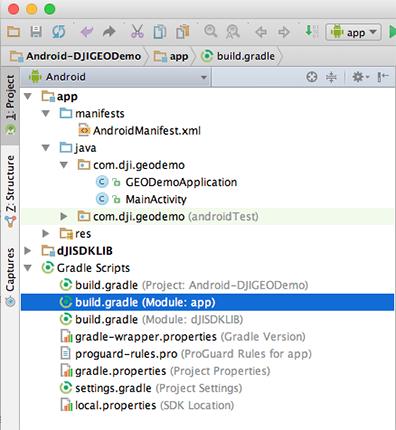
 
 Then, select the **Tools -> Android -> Sync Project with Gradle Files** on the top bar and wait for Gradle project sync finish.
 
 **4**. Let's right click on the 'app' module in the project navigator and click "Open Module Settings" to open the Project Structure window. Navigate to the "Dependencies" tab, you should find the "dJISDKLIB" appear in the list. Your SDK environmental setup should be ready now!
 
 
 
 **5**. Now, open the MainActivity.java file in `com.dji.geodemo` package and add `import dji.sdk.sdkmanager.DJISDKManager;` at the bottom of the import classes section as shown below:
 
~~~java
package com.dji.geodemo;
import dji.sdk.sdkmanager.DJISDKManager;
~~~

  Wait for a few seconds and check if the words turn red, if they remain gray color, it means you can use DJI Android SDK in your project successfully now.
  
### Configurating Google Maps API Key

Since we create this demo project using "Google Maps Activity" of Android Studio, the Google Play Services is set up automatically for you. You can now start using the Google Maps Android APIs to develop your app.

To learn how to generate SHA-1 key and how to apply for an Google Maps API key in <a href="https://console.developers.google.com/apis" target="_blank">Google Developer Console</a>, please refer to the **Setting Up Google Play Services** section of [Creating a MapView and Waypoint Application](../android-tutorials/GSDemo-Google-Map.html#3-generating-sha-1-key) tutorial.

Once you finish the above step, please open the "google\_maps\_api.xml" file in the **values** folder and replace the **YOUR\_KEY_HERE** with the **Google Maps API key** you just get as shown below:

~~~xml
<string name="google_maps_key" translatable="false" templateMergeStrategy="preserve">YOUR_KEY_HERE</string>
~~~

Now build and run the project and install it on an Android device(We use Nexus 5 here), you should see the Google Map loads successfully as shown below:

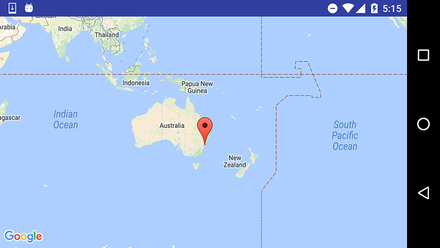

### Building the Layouts of Activity

#### 1. Creating GEODemoApplication Class 

   Right-click on the package `com.dji.geodemo` in the project navigator and choose **New -> Java Class**, Type in "DJIDemoApplication" in the Name field and select "Class" as Kind field content.
   
   Next, Replace the code of the "DJIDemoApplication.java" file with the following:
   
~~~java
package com.dji.geodemo;

import android.app.Application;
import android.content.Context;
import android.support.multidex.MultiDex;

public class GEODemoApplication extends Application {

    @Override
    public void onCreate() {
        super.onCreate();
    }

    protected void attachBaseContext(Context base){
        super.attachBaseContext(base);
        MultiDex.install(this);
    }
}
~~~

  Here, we override the `onCreate()` method. and implement the `attachBaseContext()` method to install the multiDex. We can do some settings when the application is created here.
  
#### 2. Creating the ConnectionActivity

##### Implementing UI Elements in ConnectionActivity Class

  To improve the user experience, we had better create an activity to show the connection status between the DJI Product and the SDK, once it's connected, the user can press the **OPEN** button to enter the **MainActivity**. 
  
  Now let's Right-click on the package `com.dji.geodemo` in the project navigator and choose **New -> Activity -> Basic Activity**, Type in "ConnectionActivity" in the "Activity Name" field and press "Finish" button.
   
  Next, replace the code of the "ConnectionActivity.java" file with the following:

~~~java
public class ConnectionActivity extends Activity implements View.OnClickListener {

    private static final String TAG = ConnectionActivity.class.getName();

    private TextView mTextConnectionStatus;
    private TextView mTextProduct;
    private Button mBtnOpen;

    @Override
    protected void onCreate(Bundle savedInstanceState) {
        super.onCreate(savedInstanceState);
        
        setContentView(R.layout.activity_connection);
        initUI();
    }

    @Override
    public void onResume() {
        Log.e(TAG, "onResume");
        super.onResume();
    }

    @Override
    public void onPause() {
        Log.e(TAG, "onPause");
        super.onPause();
    }

    @Override
    public void onStop() {
        Log.e(TAG, "onStop");
        super.onStop();
    }

    public void onReturn(View view){
        Log.e(TAG, "onReturn");
        this.finish();
    }

    @Override
    protected void onDestroy() {
        Log.e(TAG, "onDestroy");
        super.onDestroy();
    }

    private void initUI() {
        mTextConnectionStatus = (TextView) findViewById(R.id.text_connection_status);
        mTextProduct = (TextView) findViewById(R.id.text_product_info);
        mBtnOpen = (Button) findViewById(R.id.btn_open);
        mBtnOpen.setOnClickListener(this);
    }

    @Override
    public void onClick(View v) {
        switch (v.getId()) {
            case R.id.btn_open: {
                Intent intent = new Intent(this, MainActivity.class);
                startActivity(intent);
                break;
            }
            default:
                break;
        }
    }

}
~~~
  
In the code shown above, we implement the following features:

1. Create the layout UI elements variables, including two TextureViews `mTextConnectionStatus`, `mTextProduct`, and one Button `mBtnOpen`.

2. In the onCreate() method, we request several permissions at runtime to ensure the SDK works well when the compile and target SDK version is higher than 22(Like Android Marshmallow 6.0 device and API 23). Then invoke the `initUI()` methods to initialize the UI elements.

3. Next, implement the `initUI()` method to initialize the three TextViews and the Button. Then invoke `setOnClickListener()` method of `mBtnOpen` and pass `this` as the param.

4. Lastly, override the onClick() method to implement the `btn_open` button action. Here we create an `Intent` object by passing "MainActivity.class" as the component class to be used for the intent. Then invoke the `startActivity()` method to start the MainActivity.

##### Implementing the ConnectionActivity Layout

Open the **activity_connection.xml** layout file and replace the code with the following:

~~~xml
<?xml version="1.0" encoding="utf-8"?>
<RelativeLayout xmlns:android="http://schemas.android.com/apk/res/android"
    xmlns:tools="http://schemas.android.com/tools"
    android:layout_width="match_parent"
    android:layout_height="match_parent"
    android:orientation="vertical">

    <TextView
        android:id="@+id/text_connection_status"
        android:layout_width="wrap_content"
        android:layout_height="wrap_content"
        android:gravity="center"
        android:text="Status: No Product Connected"
        android:textColor="@android:color/black"
        android:textSize="20dp"
        android:textStyle="bold"
        android:layout_alignBottom="@+id/text_product_info"
        android:layout_centerHorizontal="true"
        android:layout_marginBottom="89dp" />

    <TextView
        android:id="@+id/text_product_info"
        android:layout_width="wrap_content"
        android:layout_height="wrap_content"
        android:layout_centerHorizontal="true"
        android:layout_marginTop="270dp"
        android:text="@string/product_information"
        android:textColor="@android:color/black"
        android:textSize="20dp"
        android:gravity="center"
        android:textStyle="bold"
        />

    <Button
        android:id="@+id/btn_open"
        android:layout_width="150dp"
        android:layout_height="55dp"
        android:layout_centerHorizontal="true"
        android:layout_marginTop="350dp"
        android:background="@drawable/round_btn"
        android:text="Open"
        android:textColor="@color/colorWhite"
        android:textSize="20dp"
        />

    <TextView
        android:layout_width="wrap_content"
        android:layout_height="wrap_content"
        android:layout_centerHorizontal="true"
        android:layout_marginTop="430dp"
        android:text="@string/sdk_version"
        android:textSize="15dp"
        android:id="@+id/textView2" />

    <TextView
        android:layout_width="wrap_content"
        android:layout_height="wrap_content"
        android:textAppearance="?android:attr/textAppearanceSmall"
        android:text="DJIGEODemo"
        android:id="@+id/textView"
        android:layout_marginTop="58dp"
        android:textStyle="bold"
        android:textSize="20dp"
        android:textColor="@color/colorBlack"
        android:layout_alignParentTop="true"
        android:layout_centerHorizontal="true" />

</RelativeLayout>
~~~

  In the xml file, we create four TextViews and one Button within a RelativeLayout. We use the TextView(id: text\_connection\_status) to show the product connection status and use the TextView(id:text\_product\_info) to show the connected product name. The Button(id: btn\_open) is used to open the **MainActivity**.
  
##### Configuring the Resource XMLs

  Once you finish the above steps, let's copy all the images file from this Github sample project's **drawable** folder (**app->src->main->res->drawable**) to the same folder in your project.
  
  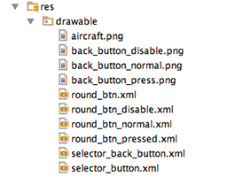
  
  Moreover, open the "colors.xml" file and update the content as shown below:
  
~~~xml
<?xml version="1.0" encoding="utf-8"?>
<resources>
    <color name="colorPrimary">#3F51B5</color>
    <color name="colorPrimaryDark">#303F9F</color>
    <color name="colorAccent">#FF4081</color>
    <color name="title_dark">#212121</color>
    <color name="white">#FFFFFF</color>
    <color name="button_normal">#50808080</color>
    <color name="button_press">#5086BFFF</color>
    <color name="colorWhite">#FFFFFF</color>
    <color name="colorBlack">#000000</color>
</resources>
~~~

  Furthermore, open the "strings.xml" file and replace the content with the followings:
  
~~~xml
<?xml version="1.0" encoding="utf-8"?>
<resources>

    <string name="app_name">DJIGEODemo</string>
    <string name="title_activity_GEODemo">GEODemo</string>
    <string name="action_settings">Settings</string>
    <string name="disconnected">Disconnected</string>
    <string name="product_information">Product Information</string>
    <string name="connection_loose">Status: No Product Connected</string>
    <string name="sdk_version">DJI SDK Version: 3.3</string>

</resources>
~~~

  Lastly, open the "styles.xml" file and replace the content with the followings:
  
~~~xml
<resources>

    <!-- Base application theme. -->
    

</resources>
~~~

Now, if you open the activity_main.xml file, and click on the **Design** tab on the bottom left, you should see the preview screenshot of **ConnectionActivity** as shown below:

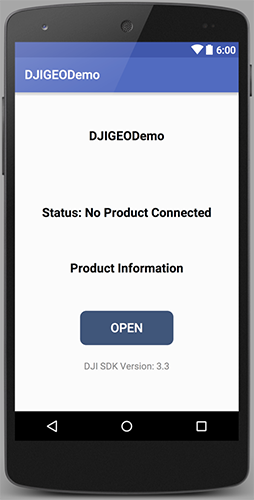
   
#### 3. Creating the MainActivity

##### Implementing the MainActivity Layout

Open the **activity_main.xml** layout file and replace the code with the following:

~~~xml
<LinearLayout xmlns:android="http://schemas.android.com/apk/res/android"
    xmlns:tools="http://schemas.android.com/tools"
    android:layout_width="match_parent"
    android:layout_height="match_parent"
    android:orientation="vertical"
    tools:context="com.dji.geodemo.MainActivity">

    <RelativeLayout
        android:id="@+id/main_title_rl"
        android:layout_width="fill_parent"
        android:layout_height="40dp"
        android:background="@color/title_dark">

        <ImageButton
            android:id="@+id/ReturnBtnCamera"
            android:layout_width="wrap_content"
            android:layout_height="35dp"
            android:layout_alignParentLeft="true"
            android:layout_centerVertical="true"
            android:layout_marginLeft="5dp"
            android:adjustViewBounds="true"
            android:background="@android:color/transparent"
            android:onClick="onReturn"
            android:scaleType="centerInside"
            android:src="@drawable/selector_back_button" />

        <TextView
            android:id="@+id/ConnectStatusTextView"
            android:layout_width="wrap_content"
            android:layout_height="wrap_content"
            android:layout_centerInParent="true"
            android:text="GEODemo"
            android:textColor="@android:color/white"
            android:textSize="21sp" />
    </RelativeLayout>

    <RelativeLayout
        android:layout_width="match_parent"
        android:layout_height="match_parent">

        <fragment xmlns:android="http://schemas.android.com/apk/res/android"
            xmlns:tools="http://schemas.android.com/tools"
            xmlns:map="http://schemas.android.com/apk/res-auto"
            android:layout_width="match_parent"
            android:layout_height="match_parent"
            android:id="@+id/map"
            tools:context="com.dji.myapplication.MainActivity"
            android:name="com.google.android.gms.maps.SupportMapFragment"/>

        <ScrollView
            android:layout_width="wrap_content"
            android:layout_height="wrap_content"
            android:layout_alignParentLeft="true"
            android:layout_alignParentStart="true"
            android:layout_centerVertical="true"
            android:scrollbars="vertical">

            <LinearLayout
                android:layout_width="wrap_content"
                android:layout_height="wrap_content"
                android:orientation="vertical">

                <Button
                    android:id="@+id/geo_login_btn"
                    style="@style/left_button_list_button"
                    android:text="@string/geo_login"/>

                <Button
                    android:id="@+id/geo_logout_btn"
                    style="@style/left_button_list_button"
                    android:text="@string/geo_logout"/>

                <Button
                    android:id="@+id/geo_unlock_nfzs_btn"
                    style="@style/left_button_list_button"
                    android:text="@string/geo_unlock_nfzs"/>

                <Button
                    style="@style/left_button_list_button"
                    android:id="@+id/geo_get_unlock_nfzs_btn"
                    android:text="@string/geo_get_unlock_nfzs"
                    android:layout_width="match_parent"
                    android:layout_height="match_parent" />

                <Button
                    style="@style/left_button_list_button"
                    android:id="@+id/geo_get_surrounding_nfz_btn"
                    android:text="@string/geo_get_surrounding_nfz"
                    android:layout_width="wrap_content"
                    android:layout_height="wrap_content" />

                <Button
                    android:id="@+id/geo_update_location_btn"
                    style="@style/left_button_list_button"
                    android:text="@string/geo_update_location" />

                <Button
                    android:id="@+id/geo_set_geo_enabled_btn"
                    style="@style/left_button_list_button"
                    android:text="@string/geo_set_geo_enabled"/>

                <Button
                    android:id="@+id/geo_get_geo_enabled_btn"
                    style="@style/left_button_list_button"
                    android:text="@string/geo_get_geo_enabled"/>

            </LinearLayout>
        </ScrollView>

        <TextView
            android:layout_width="180dp"
            android:layout_height="wrap_content"
            android:id="@+id/login_status"
            android:textSize="14sp"
            android:textColor="@android:color/black"
            android:layout_alignParentRight="true"
            android:layout_marginRight="0dp"
            android:textAlignment="center" />

        <ScrollView
            android:layout_width="180dp"
            android:layout_height="400dp"
            android:layout_alignParentRight="true"
            android:scrollbars="vertical"
            android:layout_below="@+id/login_status">
            <TextView
                android:layout_width="wrap_content"
                android:layout_height="wrap_content"
                android:textColor="@android:color/black"
                android:id="@+id/fly_zone_tv"
                />
        </ScrollView>
    </RelativeLayout>

</LinearLayout>
~~~

In the xml file, we implement the following UIs:
  
1. Create a RelativeLayout to add a back button and a TextView  to show the SDK connection status on the top.

2. Then create a RelativeLayout and add a scrollView on the left side with eight Buttons from top to bottom: "Login", "Logout", "Unlock NFZs", "Get Unlock NFZs", "Get Surrounding NFZ", "Update Location" and "Set GEO Enabled" and "Get GEO Enabled", place them vertically.

3. Lastly, on the right side, we add a TextView to show the login status and a scrollView with a textView inside to show the fly zone infos.

Next, open the styles.xml file in the "values" folder and add the following code below the "AppTheme" style:

~~~xml
    
~~~

Furthermore, create a xml file named "dimens.xml" inside the "values" folder and replace the code with the followings:

~~~xml
<resources>
    <!-- Default screen margins, per the Android Design guidelines. -->
    <dimen name="activity_horizontal_margin">16dp</dimen>
    <dimen name="activity_vertical_margin">16dp</dimen>

    <!-- left button list -->
    <dimen name="left_button_list_button_width">150dp</dimen>
    <dimen name="left_button_list_button_height">45dp</dimen>
    <dimen name="left_button_list_button_padding_left">5dp</dimen>
    <dimen name="left_button_list_button_padding_right">5dp</dimen>
    <dimen name="left_button_list_button_margin_left">10dp</dimen>
    <dimen name="left_button_list_button_margin_top">10dp</dimen>
    <dimen name="left_button_list_button_text_size">14sp</dimen>

</resources>
~~~

Lastly, open the "strings.xml" file and replace the code with the followings:

~~~xml
<?xml version="1.0" encoding="utf-8"?>
<resources>
    <string name="app_name">DJIGEODemo</string>

    <string name="title_activity_GEODemo">GEODemo</string>

    <string name="action_settings">Settings</string>
    <string name="disconnected">Disconnected</string>
    <string name="product_information">Product Information</string>
    <string name="connection_loose">Status: No Product Connected</string>
    <string name="sdk_version">DJI SDK Version: 3.3</string>

    <!-- GEO with map testing activity-->
    <string name="title_activity_geo_with_map_testing">GeoWithMapTestingActivity</string>
    <string name="demo_desc_geo_with_map">Geo System With Map</string>

    <string name="item_top_left_title">Category</string>
    <string name="item_top_title">EventName</string>
    <string name="Message_WaitStatus">Upload Status</string>

    <string name="title_activity_geo_testing">GeoTestingActivity</string>
    <string name="demo_desc_geo">Geo System</string>
    <string name="geo_get_surrounding_nfz">Get Surrounding NFZ</string>
    <string name="geo_get_location_nfz">Get location NFZ</string>
    <string name="geo_get_unlock_nfz">Get Unlock NFZ</string>
    <string name="geo_refresh_nfz">Refresh Local Data</string>
    <string name="geo_unlock_nfzs">Unlock NFZs</string>
    <string name="geo_get_unlock_nfzs">Get Unlock NFZs</string>
    <string name="geo_login">Login</string>
    <string name="geo_logout">Logout</string>
    <string name="enabled_geo">Enabled GEO</string>
    <string name="start_simulator">Start Simulator</string>
    <string name="stop_simulator">Stop Simulator</string>
    <string name="geo_set_geo_enabled">Set GEO Enabled</string>
    <string name="geo_get_geo_enabled">Get GEO Enabled</string>
    <string name="geo_update_location">Update Location</string>>

</resources>
~~~

  Now, if you open the "activity_maps.xml" file, and click on the **Design** tab on the bottom left, you should see the preview screenshot of MainActivity as shown below:
   
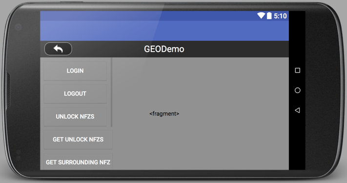

##### Implementing UI Elements in MainActivity Class

Let's come back to the MainActivity.java class, and replace the code with the following, remember to import the related classes as Android Studio suggested:

~~~java
public class MainActivity extends FragmentActivity implements View.OnClickListener, OnMapReadyCallback {

    private static final String TAG = MainActivity.class.getName();
    
    private GoogleMap map;

    protected TextView mConnectStatusTextView;
    private Button btnLogin;
    private Button btnLogout;
    private Button btnUnlock;
    private Button btnGetUnlock;
    private Button btnGetSurroundNFZ;
    private Button btnSetEnableGeoSystem;
    private Button btnGetEnableGeoSystem;
    private Button btnUpdateLocation;

    private TextView loginStatusTv;
    private TextView flyZonesTv;

    @Override
    protected void onCreate(Bundle savedInstanceState) {
        super.onCreate(savedInstanceState);
        setContentView(R.layout.activity_main);

        initUI();

        // Obtain the SupportMapFragment and get notified when the map is ready to be used.
        SupportMapFragment mapFragment = (SupportMapFragment) getSupportFragmentManager()
                .findFragmentById(R.id.map);
        mapFragment.getMapAsync(this);
    }

    private void initUI() {

        mConnectStatusTextView = (TextView) findViewById(R.id.ConnectStatusTextView);

        btnLogin = (Button) findViewById(R.id.geo_login_btn);
        btnLogout = (Button) findViewById(R.id.geo_logout_btn);
        btnUnlock = (Button) findViewById(R.id.geo_unlock_nfzs_btn);
        btnGetUnlock = (Button) findViewById(R.id.geo_get_unlock_nfzs_btn);
        btnGetSurroundNFZ = (Button) findViewById(R.id.geo_get_surrounding_nfz_btn);
        btnSetEnableGeoSystem = (Button) findViewById(R.id.geo_set_geo_enabled_btn);
        btnGetEnableGeoSystem = (Button) findViewById(R.id.geo_get_geo_enabled_btn);
        btnUpdateLocation = (Button) findViewById(R.id.geo_update_location_btn);

        loginStatusTv = (TextView) findViewById(R.id.login_status);
        loginStatusTv.setTextColor(Color.BLACK);
        flyZonesTv = (TextView) findViewById(R.id.fly_zone_tv);
        flyZonesTv.setTextColor(Color.BLACK);

        btnLogin.setOnClickListener(this);
        btnLogout.setOnClickListener(this);
        btnUnlock.setOnClickListener(this);
        btnGetUnlock.setOnClickListener(this);
        btnGetSurroundNFZ.setOnClickListener(this);
        btnSetEnableGeoSystem.setOnClickListener(this);
        btnGetEnableGeoSystem.setOnClickListener(this);
        btnUpdateLocation.setOnClickListener(this);
    }

    @Override
    public void onClick(View v) {
        switch (v.getId()) {
            case R.id.geo_login_btn:
                break;

            case R.id.geo_logout_btn:
                break;

            case R.id.geo_unlock_nfzs_btn:
                break;

            case R.id.geo_get_unlock_nfzs_btn:
                break;

            case R.id.geo_get_surrounding_nfz_btn:
                break;

            case R.id.geo_update_location_btn:
                break;

            case R.id.geo_set_geo_enabled_btn:
                break;

            case R.id.geo_get_geo_enabled_btn:
                break;
        }
    }

    /**
     * Manipulates the map once available.
     * This callback is triggered when the map is ready to be used.
     * This is where we can add markers or lines, add listeners or move the camera. In this case,
     * we just add a marker near Sydney, Australia.
     * If Google Play services is not installed on the device, the user will be prompted to install
     * it inside the SupportMapFragment. This method will only be triggered once the user has
     * installed Google Play services and returned to the app.
     */
    @Override
    public void onMapReady(GoogleMap googleMap) {
        mMap = googleMap;

        // Add a marker in Shenzhen and move the camera
        LatLng shenzhen = new LatLng(22.537018, 113.953640);
        mMap.addMarker(new MarkerOptions().position(shenzhen).title("Marker in shenzhen"));
        mMap.moveCamera(CameraUpdateFactory.newLatLng(shenzhen));
    }
}
~~~

In the code above, we implement the following features:

**1.** In the `onCreate()` method, we invoke the `initUI()` method and create "SupportMapFragment" variable to call the `OnMapReady()` method asynchronously.

**2.** In the `initUI()` method, we create a GoogleMap variable, eight Buttons and three TextViews variables for the UI elements, then create the `initUI()` method to init the UI elements and implement their `setOnClickListener` method and pass "this" as the parameter.

**3.** Next, we override the `onClick()` method for the eight buttons.

**4.** Lastly, we override the `onMapReady()` method to initialize the `mMap`. Then add a marker of Palo Alto, California here for example. So when the Google map is loaded, you will see a red pin tag on Palo Alto, California.

##### Configuring AndroidManifest

Lastly, let's open the AndroidManifest.xml file and update the **\<application>** element content as shown below:

~~~xml
<application
        android:allowBackup="true"
        android:icon="@mipmap/ic_launcher"
        android:label="@string/app_name"
        android:supportsRtl="true"
        android:theme="@style/AppTheme">

        <!--
             The API key for Google Maps-based APIs is defined as a string resource.
             (See the file "res/values/google_maps_api.xml").
             Note that the API key is linked to the encryption key used to sign the APK.
             You need a different API key for each encryption key, including the release key that is used to
             sign the APK for publishing.
             You can define the keys for the debug and release targets in src/debug/ and src/release/. 
        -->
        <meta-data
            android:name="com.google.android.geo.API_KEY"
            android:value="@string/google_maps_key" />

        <activity android:name=".ConnectionActivity"
            android:screenOrientation="portrait">

            <intent-filter>
                <action android:name="android.intent.action.MAIN" />
                <category android:name="android.intent.category.LAUNCHER" />
            </intent-filter>
        </activity>
        <activity android:name=".MainActivity"
            android:screenOrientation="landscape"></activity>
</application>
~~~

For more details, please check the tutorial's Github Sample Project.

We have gone through a long process to setup the UI of the application. Now, let's build and run the project and install it in your Android device to test it. Here we use Nexus 5 for testing. When the application is launched, press the **Open** button in the ConnectionActivity to open the MainActivity view, then you should see the following screenshot:

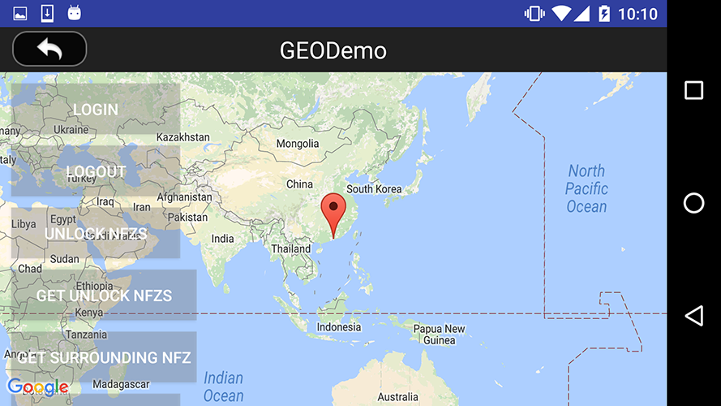

### Registering Your Application

#### 1. Modifying AndroidManifest file

After you finish the above steps, let's register our application with the **App Key** you apply from DJI Developer Website. If you are not familiar with the App Key, please check the [Get Started](../quick-start/index.html).

Let's open the AndroidManifest.xml file and add the following elements on top of `<application>` element:

~~~xml
<!-- SDK permission requirement -->
<uses-permission android:name="android.permission.BLUETOOTH" />
<uses-permission android:name="android.permission.BLUETOOTH_ADMIN" />
<uses-permission android:name="android.permission.INTERNET" />
<uses-permission android:name="android.permission.WRITE_EXTERNAL_STORAGE" />
<uses-permission android:name="android.permission.READ_PHONE_STATE" />
<uses-permission android:name="android.permission.READ_EXTERNAL_STORAGE" />
<uses-permission android:name="android.permission.ACCESS_COARSE_LOCATION" />
<uses-permission android:name="android.permission.ACCESS_NETWORK_STATE" />
<uses-permission android:name="android.permission.ACCESS_FINE_LOCATION" />
<uses-permission android:name="android.permission.CHANGE_WIFI_STATE" />
<uses-permission android:name="android.permission.ACCESS_WIFI_STATE" />
<uses-permission android:name="android.permission.CHANGE_CONFIGURATION" />
<uses-permission android:name="android.permission.SYSTEM_ALERT_WINDOW" />
<uses-permission android:name="android.permission.WRITE_SETTINGS" />
<uses-permission android:name="android.permission.VIBRATE" />
<uses-permission android:name="android.permission.WAKE_LOCK" />
<uses-permission android:name="android.permission.MOUNT_UNMOUNT_FILESYSTEMS" />

<uses-feature
    android:name="android.hardware.usb.host"
    android:required="false"/>
<uses-feature
    android:name="android.hardware.usb.accessory"
    android:required="true"/>
<uses-feature
    android:glEsVersion="0x00020000"
    android:required="true" />

<!-- SDK requirement permission end -->
~~~

In the code above, we specify the permissions of your application needs by adding **\<uses-permission>** elements as children of the **\<manifest>** element.

Moreover, because not all Android-powered devices are guaranteed to support the USB accessory and host APIs, include two <uses-feature> elements that declare that your application uses the "android.hardware.usb.accessory" and "android.hardware.usb.host" feature. 

Finally, we need to specify the requirement for OpenGL ES version 2.

For more details of description on the permissions, refer to <a href="https://developers.google.com/maps/documentation/android/config" target="_blank">https://developers.google.com/maps/documentation/android/config</a>.

Furthermore, let's replace the **\<application>** element with the followings:

~~~xml
<application
    android:name=".GEODemoApplication"
    android:allowBackup="true"
    android:icon="@mipmap/ic_launcher"
    android:label="@string/app_name"
    android:supportsRtl="true"
    android:theme="@style/AppTheme">
        
    <!-- DJI SDK -->
        
    <uses-library android:name="com.android.future.usb.accessory" />
        
    <meta-data
        android:name="com.dji.sdk.API_KEY"
        android:value="Please enter your App Key here" />
    <meta-data
        android:name="com.google.android.geo.API_KEY"
        android:value="@string/google_maps_key" />
    <meta-data
        android:name="com.google.android.gms.version"
        android:value="@integer/google_play_services_version" />
        
    <activity
        android:name="dji.sdk.sdkmanager.DJIAoaControllerActivity"
        android:screenOrientation="landscape"
        android:theme="@android:style/Theme.Translucent">
        <intent-filter>
            <action android:name="android.hardware.usb.action.USB_ACCESSORY_ATTACHED" />
        </intent-filter>
        
        <meta-data
            android:name="android.hardware.usb.action.USB_ACCESSORY_ATTACHED"
            android:resource="@xml/accessory_filter" />
    </activity>
        
    <service android:name="dji.sdk.sdkmanager.DJIGlobalService" />
    <service android:name="dji.internal.geofeature.flyforbid.FlyforbidUpdateService" />
        
    <!-- DJI SDK -->
        
    <activity android:name=".ConnectionActivity"
        android:screenOrientation="portrait">
        
        <intent-filter>
            <action android:name="android.intent.action.MAIN" />
            <category android:name="android.intent.category.LAUNCHER" />
        </intent-filter>
    </activity>
    <activity android:name=".MainActivity"
        android:screenOrientation="landscape"></activity>
</application>
~~~

Please enter the **App Key** of the application in the value part of `android:name="com.dji.sdk.API_KEY"` attribute. For more details of the AndroidManifest.xml file, please check this tutorial's Github source code of the demo project.

#### 2. Implementing GEODemoApplication Class

After you finish the steps above, open the GEODemoApplication.java file and replace the code in the same file in the tutorial's Github Source Code, here we explain the important parts of it:

~~~java
@Override
public void onCreate() {
    super.onCreate();
    mHandler = new Handler(Looper.getMainLooper());

    /**
     * handles SDK Registration using the API_KEY
     */
    DJISDKManager.getInstance().initSDKManager(this, mDJISDKManagerCallback);
}

/**
 * When starting SDK services, an instance of interface DJISDKManager.DJISDKManagerCallback will be used to listen to
 * the SDK Registration result and the product changing.
 */
private DJISDKManager.DJISDKManagerCallback mDJISDKManagerCallback = new DJISDKManager.DJISDKManagerCallback() {

    //Listens to the SDK registration result
    @Override
    public void onGetRegisteredResult(DJIError error) {
        if(error == DJISDKError.REGISTRATION_SUCCESS) {
            DJISDKManager.getInstance().startConnectionToProduct();
            Handler handler = new Handler(Looper.getMainLooper());
            handler.post(new Runnable() {
                @Override
                public void run() {
                    Toast.makeText(getApplicationContext(), "Register Success", Toast.LENGTH_LONG).show();
                }
            });
        } else {
            Handler handler = new Handler(Looper.getMainLooper());
            handler.post(new Runnable() {

                @Override
                public void run() {
                    Toast.makeText(getApplicationContext(), "register sdk fails, check network is available", Toast.LENGTH_LONG).show();
                }
            });

        }
        Log.e("TAG", error.toString());
    }

    //Listens to the connected product changing, including two parts, component changing or product connection changing.
    @Override
    public void onProductChanged(DJIBaseProduct oldProduct, DJIBaseProduct newProduct) {

        mProduct = newProduct;
        if(mProduct != null) {
            mProduct.setDJIBaseProductListener(mDJIBaseProductListener);
        }

        notifyStatusChange();
    }
};
~~~

Here, we implement several features:
  
1. We override the `onCreate()` method to initialize the DJISDKManager.
2. Implement the two interface methods of DJISDKManagerCallback. You can use the `onGetRegisteredResult()` method to check the Application registration status and show text message here. Using the `onProductChanged()` method, we can check the product connection status and invoke the `notifyStatusChange()` method to notify status changes.

#### 3. Request Permissions in ConnectionActivity

Now, let's open the ConnectionActivity.java file and update the `onCreate()` method as shown below:

~~~java
@Override
protected void onCreate(Bundle savedInstanceState) {
    super.onCreate(savedInstanceState);

    // When the compile and target version is higher than 22, please request the
    // following permissions at runtime to ensure the
    // SDK work well.
    if (Build.VERSION.SDK_INT >= Build.VERSION_CODES.M) {
        ActivityCompat.requestPermissions(this,
                new String[]{Manifest.permission.WRITE_EXTERNAL_STORAGE, Manifest.permission.VIBRATE,
                        Manifest.permission.INTERNET, Manifest.permission.ACCESS_WIFI_STATE,
                        Manifest.permission.WAKE_LOCK, Manifest.permission.ACCESS_COARSE_LOCATION,
                        Manifest.permission.ACCESS_NETWORK_STATE, Manifest.permission.ACCESS_FINE_LOCATION,
                        Manifest.permission.CHANGE_WIFI_STATE, Manifest.permission.MOUNT_UNMOUNT_FILESYSTEMS,
                        Manifest.permission.READ_EXTERNAL_STORAGE, Manifest.permission.SYSTEM_ALERT_WINDOW,
                        Manifest.permission.READ_PHONE_STATE,
                }
                , 1);
    }

    setContentView(R.layout.activity_connection);
    initUI();
}
~~~

In the code above, we request several permissions at runtime to ensure the SDK works well when the compile and target SDK version is higher than 22(Like Android Marshmallow 6.0 device and API 23). 

Now let's build and run the project and install it to your Android device. If everything goes well, you should see the "Register Success" textView like the following screenshot when you register the app successfully.

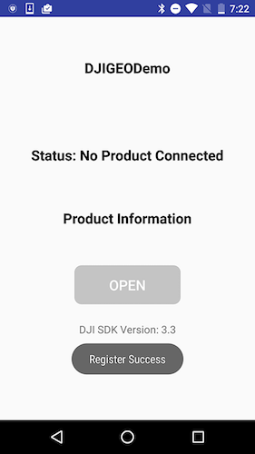

## Implementing the ConnectionActivity

Once you finish the steps above, let's continue to work on the "ConnectionActivity.java" file and add the following code at the bottom of `onCreate()` method:

~~~java
// Register the broadcast receiver for receiving the device connection's changes.
IntentFilter filter = new IntentFilter();
filter.addAction(GEODemoApplication.FLAG_CONNECTION_CHANGE);
registerReceiver(mReceiver, filter);
~~~

In the code above, we register the broadcast receiver for receiving the device connection's changes.

Next, add the following code at the bottom of `initUI()` method to disable the `mBtnOpen` button to prevent entering the MainActivity view if the application does not connect to the DJI Product successfully:

~~~java
mBtnOpen.setEnabled(false);
~~~

Furthermore, add the following methods below the `initUI()` method:

~~~java
protected BroadcastReceiver mReceiver = new BroadcastReceiver() {

    @Override
    public void onReceive(Context context, Intent intent) {
        refreshSDKRelativeUI();
    }
};

@Override
protected void onDestroy() {
    Log.e(TAG, "onDestroy");
    unregisterReceiver(mReceiver);
    super.onDestroy();
}

private void refreshSDKRelativeUI() {
    DJIBaseProduct mProduct = GEODemoApplication.getProductInstance();

    if (null != mProduct && mProduct.isConnected()) {
        Log.v(TAG, "refreshSDK: True");
        mBtnOpen.setEnabled(true);

        String str = mProduct instanceof DJIAircraft ? "DJIAircraft" : "DJIHandHeld";
        mTextConnectionStatus.setText("Status: " + str + " connected");
        mProduct.setDJIVersionCallback(this);

        if (null != mProduct.getModel()) {
            mTextProduct.setText("" + mProduct.getModel().getDisplayName());
        } else {
            mTextProduct.setText(R.string.product_information);
        }
    } else {
        Log.v(TAG, "refreshSDK: False");
        mBtnOpen.setEnabled(false);

        mTextProduct.setText(R.string.product_information);
        mTextConnectionStatus.setText(R.string.connection_loose);
    }
}
    
~~~

In the code above, we implement the following features:

1. Create the "BroadcastReceiver" and override its `onReceive()` method to invoke the `refreshSDKRelativeUI()` method to refresh the UI elements.

2. We override the `onDestroy()` method and invoke the `unregisterReceiver()` method by passing the `mReceiver` variable to unregister the broadcast receiver.

3. In the `refreshSDKRelativeUI()` method, we check the DJIBaseProduct's connection status by invoking `isConnected()` method. If the product is connected, we enable the `mBtnOpen` button, update the `mTextConnectionStatus`'s text content and update the `mTextProduct`'s content with product name. Otherwise, if the product is disconnected, we disable the `mBtnOpen` button and update the `mTextProduct` and `mTextConnectionStatus` textViews' content.

## Implementing GEO Features in MainActivity

### Update the Connection Status TextView

Let's open MainActivity.java file and add the following two methods to update the `mConnectStatusTextView` content when product's connection changes:

~~~java

@Override
public void onResume() {
    Log.e(TAG, "onResume");
    super.onResume();
    updateTitleBar();
}

private void updateTitleBar() {
    if (mConnectStatusTextView == null) return;
    boolean ret = false;
    DJIBaseProduct product = GEODemoApplication.getProductInstance();
    if (product != null) {
        if (product.isConnected()) {
            //The product is connected
            MainActivity.this.runOnUiThread(new Runnable() {
                public void run() {
                    mConnectStatusTextView.setText(GEODemoApplication.getProductInstance().getModel() + " Connected");
                }
            });
            ret = true;
        } else {
            if (product instanceof DJIAircraft) {
                DJIAircraft aircraft = (DJIAircraft) product;
                if (aircraft.getRemoteController() != null && aircraft.getRemoteController().isConnected()) {
                    // The product is not connected, but the remote controller is connected
                    MainActivity.this.runOnUiThread(new Runnable() {
                        public void run() {
                            mConnectStatusTextView.setText("only RC Connected");
                        }
                    });
                    ret = true;
                }
            }
        }
    }

    if (!ret) {
        // The product or the remote controller are not connected.

        MainActivity.this.runOnUiThread(new Runnable() {
            public void run() {
                mConnectStatusTextView.setText("Disconnected");
            }
        });
    }
}
~~~

### Working on Login and Logout Features

Now, let's add the following code at the bottom of `initUI()` method in MainActivity.java file:

~~~java
    MainActivity.this.runOnUiThread(new Runnable() {
        public void run() {
            loginStatusTv.setText(DJIFlyZoneManager.getInstance().getCurrentUserAccountStatus().name());
        }
    });
~~~

In the code above, we invoke the `getCurrentUserAccountStatus()` method of **DJIFlyZoneManager** to fetch the current user account status and update the textView `loginStatusTv`'s text content.

Next, let's implement the `onClick()` method for `btnLogin` and `btnLogout` buttons as shown below:

~~~java
@Override
public void onClick(View v) {
    switch (v.getId()) {
        case R.id.geo_login_btn:
DJIFlyZoneManager.getInstance().LogIntoDJIUserAccount(this, new DJICommonCallbacks.DJICompletionCallbackWith<UserAccountStatus>() {
                @Override
                public void onSuccess(final UserAccountStatus userAccountStatus) {
                    showToast(userAccountStatus.name());
                    MainActivity.this.runOnUiThread(new Runnable() {
                        @Override
                        public void run() {
                            loginStatusTv.setText(userAccountStatus.name());
                        }
                    });
                }
                @Override
                public void onFailure(DJIError error) {
                    showToast(error.getDescription());
                }
            });
            break;

        case R.id.geo_logout_btn:
DJIFlyZoneManager.getInstance().logoutOfDJIUserAccount(new DJICommonCallbacks.DJICompletionCallback() {
                @Override
                public void onResult(DJIError error) {
                    if (null == error) {
                        showToast("logoutOfDJIUserAccount Success");
                          MainActivity.this.runOnUiThread(new Runnable() {
                                @Override
                                public void run() {
                                    loginStatusTv.setText("NotLoggedin");
                                }
                            });
                            
                    } else {
                        showToast(error.getDescription());
                    }
                }
            });
            break;

        case R.id.geo_unlock_nfzs_btn:
            break;

        case R.id.geo_get_unlock_nfzs_btn:
            break;

        case R.id.geo_get_surrounding_nfz_btn:
            break;

        case R.id.geo_update_location_btn:
            break;

        case R.id.geo_set_geo_enabled_btn:
            break;

        case R.id.geo_get_geo_enabled_btn:
            break;
    }
}
~~~

In the code above, we invoke the `LogIntoDJIUserAccount()` method of **DJIFlyZoneManager** to present a login view for the user to login. When login success, we update the `loginStatusTv`'s text content with the user account status. Similarly, invoke the `logoutOfDJIUserAccount()` method of **DJIFlyZoneManager** to log out the user account.

### Working on GEO System Features

#### Enable GEO System

Before using the GEO System feature, we should enable the GEO system first. Let's implement the `onClick()` method for `btnSetEnableGeoSystem` and `btnGetEnableGeoSystem` buttons as shown below:

~~~java
case R.id.geo_set_geo_enabled_btn:

    final AlertDialog.Builder setGEObuilder = new AlertDialog.Builder(this);
    setGEObuilder.setTitle("Set GEO Enable");
    setGEObuilder.setItems(new CharSequence[]
                    {"Enable", "Disable", "Cancel"},
            new DialogInterface.OnClickListener() {
                public void onClick(DialogInterface dialog, int which) {
                    // The 'which' argument contains the index position
                    // of the selected item
                    switch (which) {
                        case 0:
                            DJIFlyZoneManager.getInstance().setGEOSystemEnabled(true, new DJICommonCallbacks.DJICompletionCallback() {
                                @Override
                                public void onResult(DJIError djiError) {
                                    if (null == djiError) {
                                        showToast("set GEO Enabled Success");
                                    } else {
                                        showToast(djiError.getDescription());
                                    }
                                }
                            });
                            break;
                        case 1:
                            DJIFlyZoneManager.getInstance().setGEOSystemEnabled(false, new DJICommonCallbacks.DJICompletionCallback() {
                                @Override
                                public void onResult(DJIError djiError) {
                                    if (null == djiError) {
                                        showToast("set GEO Disable Success");
                                    } else {
                                        showToast(djiError.getDescription());
                                    }
                                }
                            });
                            break;
                        case 2:
                            dialog.dismiss();
                            break;
                    }
                }
            });

    setGEObuilder.show();
    break;

case R.id.geo_get_geo_enabled_btn:

    DJIFlyZoneManager.getInstance().getGEOSystemEnabled(new DJICommonCallbacks.DJICompletionCallbackWith<Boolean>() {

        @Override
        public void onSuccess(Boolean aBoolean) {
            showToast("GEO System Enable");
        }

        @Override
        public void onFailure(DJIError error) {
            showToast(error.getDescription());
        }
    });
    break;
~~~

In the code above, we first present an "AlertDialog" with three buttons: "Enable", "Disable" and "Cancel". When user select "Enable" button, we will invoke the `setGEOSystemEnabled()` method of **DJIFlyZoneManager** and pass `true` as the parameter to enable GEO System feature. Similarly, if select "Disable", pass `false` as the parameter to disable GEO System feature.

Moreover, we invoke the `getGEOSystemEnabled()` method of **DJIFlyZoneManager** to check if the GEO System feature is available.

#### Update Fly Zone Info and Aircraft Location

If you want to unlock a fly zone, you may need to get the fly zone's ID first. Now let's update the fly zone info in the `flyZonesTv` and update the aircraft's location when simulated coordinate data changes.

Create the following variables above the `onCreate()` method as shown below:

~~~java
private Marker marker;
private LatLng latLng;
private double droneLocationLat = 181, droneLocationLng = 181;
private DJIFlightController mFlightController = null;
~~~

Then add the following two methods above the `onMapReady()` method as shown below:

~~~java
private void initFlightController() {

    if (isFlightControllerSupported()) {
        mFlightController = ((DJIAircraft) DJISDKManager.getInstance().getDJIProduct()).getFlightController();

        mFlightController.setUpdateSystemStateCallback(new DJIFlightControllerDelegate.FlightControllerUpdateSystemStateCallback() {
            @Override
            public void onResult(final DJIFlightControllerCurrentState state) {

                if (mMap != null) {
                   droneLocationLat = state.getAircraftLocation().getLatitude();
                   droneLocationLng = state.getAircraftLocation().getLongitude();
                   updateDroneLocation();
                }
            }
        });
    }
}

public static boolean checkGpsCoordinates(double latitude, double longitude) {
    return (latitude > -90 && latitude < 90 && longitude > -180 && longitude < 180) && (latitude != 0f && longitude != 0f);
}

private void updateDroneLocation(){
    runOnUiThread(new Runnable() {
        @Override
        public void run() {
            if (marker != null) {
                marker.remove();
            }
            if (checkGpsCoordinates(droneLocationLat, droneLocationLng)) {

                LatLng pos = new LatLng(droneLocationLat, droneLocationLng);

                //Create MarkerOptions object
                final MarkerOptions markerOptions = new MarkerOptions();
                markerOptions.position(pos);
                markerOptions.icon(BitmapDescriptorFactory.fromResource(R.drawable.aircraft));
                marker = mMap.addMarker(markerOptions);
            }
        }
    });
}

private boolean isFlightControllerSupported() {
    return DJISDKManager.getInstance().getDJIProduct() != null &&
            DJISDKManager.getInstance().getDJIProduct() instanceof DJIAircraft &&
            ((DJIAircraft) DJISDKManager.getInstance().getDJIProduct()).getFlightController() != null;
}

~~~

In the code above, we mainly initialize the `mFlightController` variable and implement the `setUpdateSystemStateCallback()` method of **DJIFlightController** to invoke the `updateDroneLocation()` method to update the aircraft location on the map view when it's moving.

Moreover, let's update the `onMapReady()` method with the following codes:

~~~java
@Override
public void onMapReady(GoogleMap googleMap) {
    LatLng paloAlto = new LatLng(37.4613697, -122.1237315);

    mMap = googleMap;
    mMap.moveCamera(CameraUpdateFactory.newLatLng(paloAlto));
    mMap.animateCamera(CameraUpdateFactory.zoomTo(17.0f));
    if (ActivityCompat.checkSelfPermission(this, android.Manifest.permission.ACCESS_FINE_LOCATION) != PackageManager.PERMISSION_GRANTED && ActivityCompat.checkSelfPermission(this, Manifest.permission.ACCESS_COARSE_LOCATION) != PackageManager.PERMISSION_GRANTED) {
        mMap.setMyLocationEnabled(true);
        return;
    }

    printSurroundFlyZones();
}
~~~

In the code above, we initialize the `mMap` variable and invoke the `moveCamera()` and `animateCamera()` methods of `GoogleMap` class to move the camera and zoom in on the map. Then, invoke the `printSurroundFlyZones()` method to update the fly zone info.

Lastly, add the following two methods below the `onMapReady()` method as shown below:

~~~java
private void printSurroundFlyZones() {

DJIFlyZoneManager.getInstance().getFlyZonesInSurroundingAre(new DJICommonCallbacks.DJICompletionCallbackWith<ArrayList<DJIFlyZoneInformation>>() {
        @Override
        public void onSuccess(ArrayList<DJIFlyZoneInformation> flyZones) {
            showToast("get surrounding Fly Zone Success!");
            showSurroundFlyZonesInTv(flyZones);
        }

        @Override
        public void onFailure(DJIError error) {
            showToast(error.getDescription());
        }
    });
}

private void showSurroundFlyZonesInTv(final ArrayList<DJIFlyZoneInformation> flyZones) {
        MainActivity.this.runOnUiThread(new Runnable() {
            @Override
            public void run() {
                StringBuffer sb = new StringBuffer();
                for (DJIFlyZoneInformation flyZone : flyZones) {
                    if (flyZone != null && flyZone.getCategory() != null){

                        sb.append("FlyZoneId: ").append(flyZone.getFlyZoneId()).append("\n");
                        sb.append("Category: ").append(flyZone.getCategory().name()).append("\n");
                        sb.append("Latitude: ").append(flyZone.getLatitude()).append("\n");
                        sb.append("Longitude: ").append(flyZone.getLongitude()).append("\n");
                        sb.append("FlyZoneType: ").append(flyZone.getFlyZoneType().name()).append("\n");
                        sb.append("Radius: ").append(flyZone.getRadius()).append("\n");
                        sb.append("Shape: ").append(flyZone.getShape().name()).append("\n");
                        sb.append("StartTime: ").append(flyZone.getStartTime()).append("\n");
                        sb.append("EndTime: ").append(flyZone.getEndTime()).append("\n");
                        sb.append("UnlockStartTime: ").append(flyZone.getUnlockStartTime()).append("\n");
                        sb.append("UnlockEndTime: ").append(flyZone.getUnlockEndTime()).append("\n");
                        sb.append("Name: ").append(flyZone.getName()).append("\n");
                        sb.append("\n");
                    }
                }
                flyZonesTv.setText(sb.toString());
            }
        });
}
~~~

In the code above, we invoke the `getFlyZonesInSurroundingAre` method of **DJIFlyZoneManager** to fetch the fly zone informations list, then in the `onSuccess()` method, invoke the `showSurroundFlyZonesInTv()` method to update the fly zone infos on `flyZonesTv` textView.

Lastly, let's implement the `OnClick()` method of `btnGetSurroundNFZ` and `btnUpdateLocation` buttons as shown below:

~~~java
case R.id.geo_get_surrounding_nfz_btn:
    printSurroundFlyZones();
    break;

case R.id.geo_update_location_btn:
    latLng = new LatLng(DataOsdGetPushCommon.getInstance().getLatitude(),
            DataOsdGetPushCommon.getInstance().getLongitude());
    mMap.moveCamera(CameraUpdateFactory.newLatLng(latLng));
    mMap.animateCamera(CameraUpdateFactory.zoomTo(15.0f));
    break;
~~~

When you press the `btnGetSurroundNFZ` button, it will invoke the `printSurroundFlyZones()` method to update the fly zone infos on the `flyZonesTv` textView. When you press the `btnUpdateLocation` method, it will get the updated latitude and longitude data of the aircraft from `DataOsdGetPushCommon` and invoke the `moveCamera()` and `animateCamera()` method of **GoogleMap** to move and zoom in the camera to the aircraft's updated location on the map.

#### Unlock Fly Zones

Once you finished the above steps, let's create more variables on top of `onCreate()` method as shown below:

~~~java
private MarkerOptions markerOptions = new MarkerOptions();
private ArrayList<Integer> unlockFlyZoneIds = new ArrayList<Integer>();
~~~

Next, update the `onResume()` method and add the following methods under the `onCreate()` method: 

~~~java
@Override
public void onResume() {
    Log.e(TAG, "onResume");
    super.onResume();
    updateTitleBar();
    initFlightController();
}

@Override
public void onPause() {
    Log.e(TAG, "onPause");
    super.onPause();
}

@Override
public void onStop() {
    Log.e(TAG, "onStop");
    super.onStop();
}

public void onReturn(View view) {
    Log.e(TAG, "onReturn");
    this.finish();
}

~~~

In the code above, we mainly override methods of android.app.Activity. In the `onResume()` method, we invoke the `initFlightController()` methods to initialize the `mFlightController` variable.

Next, in the `onDestroy()` method, invoke the `unregisterReceiver()` method to unregister the `mReceiver`.

Moreover, add the following code at the bottom of `onCreate()` method:

~~~java        

DJIFlyZoneManager.getInstance().setFlyForbidStatusUpdatedCallback(new DJIFlyZoneManager.FlyForbidStatusUpdatedCallback() {
            @Override
            public void onFlyForbidStatusUpdated(FlyForbidStatus status) {
                showToast(status.name());
            }
        });
~~~

The code above will show the fly forbid status to the user. For example, if the aircraft is approaching a restricted fly area, it will pop up a message to warn the user.

Before we unlock the fly zones, we should show the fly zone on the map by drawing circles with different colors. Let's create the `updateFlyZonesOnTheMap()` method and invoke it in `printSurroundFlyZones()` method as shown below:

~~~objc
private void updateFlyZonesOnTheMap(final ArrayList<DJIFlyZoneInformation> flyZones) {
    if (mMap == null) {
        return;
    }
    MainActivity.this.runOnUiThread(new Runnable() {
        @Override
        public void run() {
            mMap.clear();
            for (DJIFlyZoneInformation flyZone : flyZones) {
                CircleOptions circle = new CircleOptions();
                circle.radius(flyZone.getRadius());
                circle.center(new LatLng(flyZone.getLatitude(), flyZone.getLongitude()));
                switch (flyZone.getCategory()) {
                    case Warning:
                        circle.strokeColor(Color.GREEN);
                        break;
                    case EnhancedWarning:
                        circle.strokeColor(Color.BLUE);
                        break;
                    case Authorization:
                        circle.strokeColor(Color.YELLOW);
                        break;
                    case Restricted:
                        circle.strokeColor(Color.RED);
                        break;

                    default:
                        break;
                }
                mMap.addCircle(circle);
            }
            if (latLng != null) {
                    //Create MarkerOptions object
                    final MarkerOptions markerOptions = new MarkerOptions();
                    markerOptions.position(latLng);
                    markerOptions.icon(BitmapDescriptorFactory.fromResource(R.drawable.aircraft));
                    marker = mMap.addMarker(markerOptions);
             }
        }
    });

}

private void printSurroundFlyZones() {

DJIFlyZoneManager.getInstance().getFlyZonesInSurroundingAre(new DJICommonCallbacks.DJICompletionCallbackWith<ArrayList<DJIFlyZoneInformation>>() {
        @Override
        public void onSuccess(ArrayList<DJIFlyZoneInformation> flyZones) {
            showToast("get surrounding Fly Zone Success!");
            updateFlyZonesOnTheMap(flyZones);
            showSurroundFlyZonesInTv(flyZones);
        }

        @Override
        public void onFailure(DJIError error) {
            showToast(error.getDescription());
        }
    });
}
~~~

In the code above, we implement the following features:

1. In the `updateFlyZonesOnTheMap()` method, we use a for loop to get each `flyZone` object in the flyZones arraylist and then create `CircleOptions` variable and set its radius and center based on the `flyZone` object's infos.
2. Next, invoke the `strokeColor` method of the **CircleOptions** class to stroke different color based the fly zone category. Lastly, invoke the `addCircle()` method of **GoogleMap** class to add the `circle` on the map. Also invoke the `addMarker()` method of **GoogleMap** class to initialize the `marker` variable.

Finally, let's implement the `onClick()` method of `btnUnlock` and `btnGetUnlock` buttons as shown below:

~~~objc
case R.id.geo_unlock_nfzs_btn:

    final AlertDialog.Builder builder = new AlertDialog.Builder(this);
    final EditText input = new EditText(this);
    input.setHint("Enter Fly Zone ID");
    input.setInputType(EditorInfo.TYPE_CLASS_NUMBER);
    builder.setView(input);
    builder.setTitle("Unlock Fly Zones");
    builder.setItems(new CharSequence[]
                    {"Continue", "Unlock", "Cancel"},
            new DialogInterface.OnClickListener() {
                public void onClick(DialogInterface dialog, int which) {
                    // The 'which' argument contains the index position
                    // of the selected item
                    switch (which) {
                        case 0:
                            if (TextUtils.isEmpty(input.getText())) {
                                dialog.dismiss();
                            } else {
                                String value1 = input.getText().toString();
                                unlockFlyZoneIds.add(Integer.parseInt(value1));
                            }
                            break;
                        case 1:
                            if (TextUtils.isEmpty(input.getText())) {
                                dialog.dismiss();
                            } else {
                                String value2 = input.getText().toString();
                                unlockFlyZoneIds.add(Integer.parseInt(value2));
                                DJIFlyZoneManager.getInstance().unlockNFZs(unlockFlyZoneIds, new DJICommonCallbacks.DJICompletionCallback() {
                                    @Override
                                    public void onResult(DJIError error) {

                                        unlockFlyZoneIds.clear();
                                        if (error == null) {
                                            showToast("unlock NFZ Success!");
                                        } else {
                                            showToast(error.getDescription());
                                        }
                                    }
                                });
                            }
                            break;
                        case 2:
                            dialog.dismiss();
                            break;
                    }
                }
            });

    builder.show();
    break;

case R.id.geo_get_unlock_nfzs_btn:

    DJIFlyZoneManager.getInstance().getUnlockedNFZs(new DJICommonCallbacks.DJICompletionCallbackWith<ArrayList<DJIFlyZoneInformation>>() {
        @Override
        public void onSuccess(ArrayList<DJIFlyZoneInformation> djiFlyZoneInformations) {
            showToast("Get Unlock NFZ success");
            showSurroundFlyZonesInTv(djiFlyZoneInformations);
        }

        @Override
        public void onFailure(DJIError djiError) {
            showToast(djiError.getDescription());
        }
    });

    break;
~~~

In the code above, we implement the following features:

**1.** For the case of `btnUnlock` button, we create an "AlertDialog" with the title of "Unlock Fly Zone ID", and add a EditText with the hint of "Enter Fly Zone ID". Then create three items for **Continue**, **Unlock**, and **Cancel** actions:

- Continue Action

  It will add the current input fly zone ID to the `unlockFlyZoneIds` ArrayList and dismiss the "AlertDialog".

- Unlock Action

  It will add the current input fly zone ID to `unlockFlyZoneIds` ArrayList and invoke the `unlockNFZs()` method of **DJIFlyZoneManager** by passing the `unlockFlyZoneIds` array to unlock fly zones. 
  
- Cancel Action

 It will dismiss the "AlertDialog".
  
**2.** For the case of `btnGetUnlock` button, we invoke the `getUnlockedNFZs()` method of **DJIFlyZoneManager** to fetch unlocked fly zone infos, then override the `onSuccess()` method and invoke the `showSurroundFlyZonesInTv()` method by passing the `djiFlyZoneInformations` ArrayList to update the fly zone infos in the right `flyZonesTv` textView.

For more details of the implementation, please check this tutorial's Github Sample Project.

## Running the Sample Code 

We have gone through a long way so far, now, let's build and run the project, connect the demo application to your Phantom 4 (Please check the [Run Application](../application-development-workflow/workflow-run.html) for more details) and check all the features we have implemented so far. 

### Unlock Authorization Fly Zone Workflow

**1.** Login your verified DJI account, if it's a new account, you need to complete the verification process.

**2.** Press **SET GEO ENABLED** button and select "enable" to enable the GEO system and restart the aircraft.

**3.** Open the Simulator of DJI Assistant 2 or DJI PC Simulator and enter the coordinate data (37.453671, -122.118101) (Near Palo Alto Airport) to start simulating the aircraft's coordinate to the authorization area.

**4.** Press **UPDATE LOCATION** and **GET SURROUNDING NFZ** buttons to update the aircraft location on the map and update the fly zone information around the aircraft on the right textView. 

**5.** Get the authorization fly zone ID you want to unlock from the textView, the category of it should be **Authorization**.

**6.** Press **UNLOCK NFZS** button and enter the fly zone ID to unlock it.

**7.** If you unlock the fly zone successfully, you can press the **GET SURROUNDING NFZ** button to refresh the fly zone infos on the right textView, you may notice that one of the yellow circle will disappear in the map. And you can take off the aircraft in the simulator now.

> Note: Limited Simulation Area
> 
> Currently, you can only test the GEO feature within **50km** of (37.453671, -122.118101), which is the location of **Palo Alto Airport** in California, United States.
> 

### Login and Logout DJI Account

#### 1. Login DJI Account

Press the **LOGIN** button and a login view will pop up as shown below:

If it's a new DJI account, it will show a verification view as shown below:

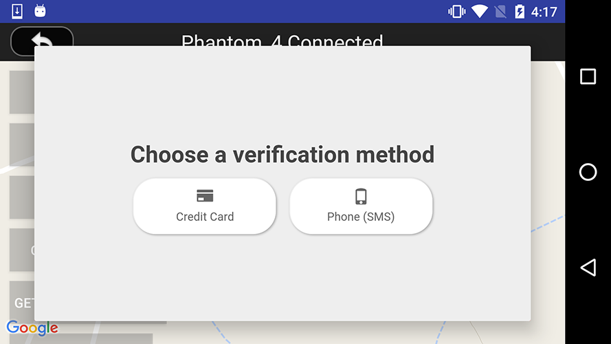

#### 2. Logout DJI Account

Press the **LOGOUT** button to logout your DJI account.

On the upper right corner of the screenshot, you can check the `loginStatusTv`'s info for the user account status as shown below:

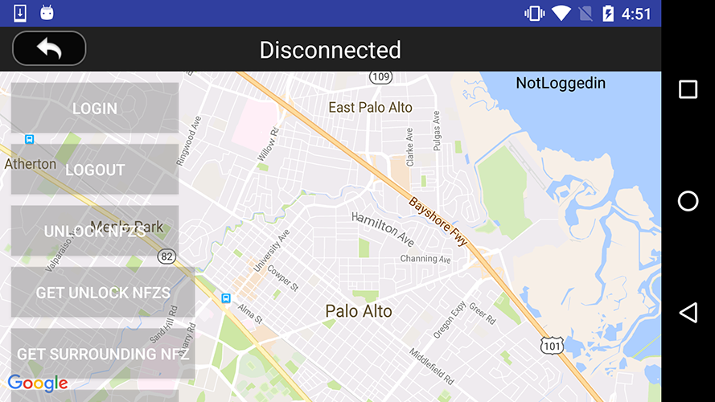

### Use DJISimulator to Simulate Aircraft Location

We will use the DJISimulator to simulate the test environment to locate the aircraft to specific latitude and longitude coordinate.

If you are using Phantom 4 for testing, please check [DJI Assistant 2 Simulator](../application-development-workflow/workflow-testing.html#DJI-Assistant-2-Simulator) tutorial for details, otherwise, if you are using Phantom 3 Professional, Inspire 1, etc, please check [DJI PC Simulator](../application-development-workflow/workflow-testing.html#DJI-PC-Simulator) tutorial for details. 

Open the Simulator of DJI Assistant 2 or DJI PC Simulator and enter the coordinate data (37.4613697, -122.1237315) (Near Palo Alto Airport) to start simulating the aircraft's coordinate to the authorization area.

Press **UPDATE LOCATION** and **GET SURROUNDING NFZ** buttons to update the aircraft's location on the map and update the fly zone information around the aircraft on the right textView.

Wait for a while, you may see there a red aircraft placed inside the yellow circle, which is an authorization fly zone you can unlock as shown below:

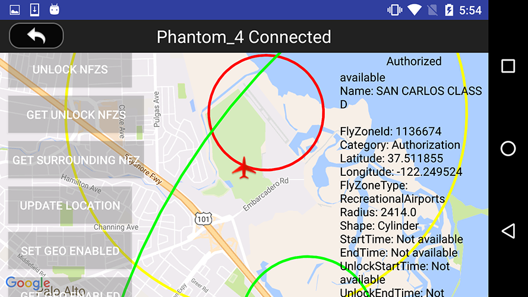

Also the textView on the right side will show the `DJIFlyZoneInformation` info, includes the fly zone name, fly zone id (required in the unlock process), fly zone category, type, etc. 

Here are the explanation of the three fly zone circles:

- Green Circle

  It represents the warning fly zones, which do not restrict flight and are informational to alert the user. In a warning fly zone, users should be prompted with a warning message describing the zone.

- Yellow Circle

  It represents the authorization fly zone, which will restrict the flight by default, it can be unlocked by a GEO verified user.
  
- Red Circle

  It represents the restricted fly zone, it will restrict the flight by default and cannot be unlocked by a GEO verified user.
  
### Unlock and Get Unlock Fly Zones

#### 1. Unlock Fly Zone

After you login with your DJI account and locate the aircraft to the coordinate of (37.4613697, -122.1237315), you can press the **UNLOCK NFZS** button and type in the fly zone ID to unlock it. 

If you unlock the fly zone successfully, you can press the **GET SURROUNDING NFZ** button to refresh the fly zone infos on the right textView, and one of the yellow circle will disappear in the map as shown in the following gif animation:

#### 2. Get Unlock Fly Zone List

You can press the **GET SURROUNDING NFZ** button to get the fly zone you have unlocked before on the right textView as shown below:

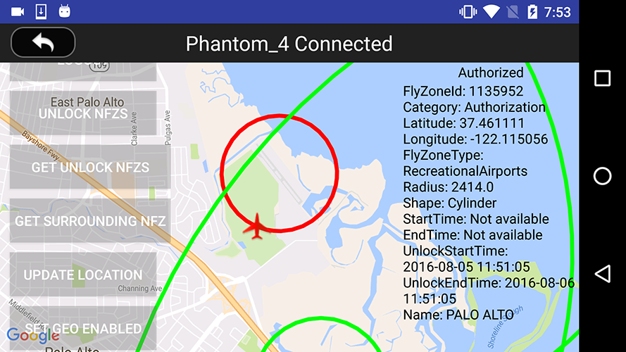

### Enable and Disable GEO

You can press the **SET GEO ENABLED** button to enable or disable the GEO System.

By default, if the GEO system is available at the aircraft's location, GEO system will be enabled. The setting is NOT settable when the aircraft is in the air. The setting will take effect only when the aircraft lands.

When GEO system is disabled, the aircraft reverts back to the previous NFZ (No Fly Zone) system.

Lastly, please restart the aircraft to make the settings become effective. 

## Summary

In this tutorial, you've learned how to use the `DJIFlyZoneManager` and `DJIFlyZoneInformation` of DJI Mobile SDK to get the fly zone information, how to unlock authorization fly zones and how to add aircraft annotation and draw fly zone circle overlays on the map view to represent the fly zones. Moreover, you've learned how to use the DJISimulator to simulate the aircraft's coordinate and test the GEO System feature indoor without flying outside.

Hope this tutorial can help you integrate the GEO System feature in your DJI SDK based Application. Good luck, and hope you enjoyed this tutorial!
