*If you come across any mistakes or bugs in this tutorial, please let us know using a Github issue, a post on the DJI forum. Please feel free to send us Github pull request and help us fix any issues.*

---

In this tutorial, you will learn how to implement the DJIWaypoint Mission feature and get familiar with the usages of MissionManager. 

Also you will know how to test the Waypoint Mission API with DJI Assistant 2 Simulator too. So let's get started!

You can download the tutorial's final sample code project from this [Github Page](https://github.com/DJI-Mobile-SDK-Tutorials/Android-GSDemo-GoogleMap).

> Note: In this tutorial, we will use Mavic Pro for testing, use Android Studio 2.1.1 for developing the demo application, and use the <a href="https://developers.google.com/maps/" target="_blank">Google Map API</a> for navigating.

## Preparation

### Download the SDK

You can download the latest Android SDK from here: <a href="https://developer.dji.com/mobile-sdk/downloads" target="_blank">https://developer.dji.com/mobile-sdk/downloads</a>.

### Setup Android Development Environment
   
  Throughout this tutorial we will be using Android Studio 2.1, which you can download from here: <a href="http://developer.android.com/sdk/index.html" target="_blank">http://developer.android.com/sdk/index.html</a>.

## Implementing the UI of Application

We can use the map view to display waypoints and show the flight route of the aircraft when waypoint mission is being executed. Here, we take Google Map for an example.

### Configurating Google Maps Android API

#### 1. Create the project

 Open Android Studio and select **File -> New -> New Project** to create a new project, named "GSDemo". Enter the company domain and package name (Here we use "com.dji.GSDemo.GoogleMap") you want and press Next. Set the mimimum SDK version as `API 19: Android 4.4 (KitKat)` for "Phone and Tablet" and press Next. Then select "Empty Activity" and press Next. Lastly, leave the Activity Name as "MainActivity", and the Layout Name as "activity_main", Press "Finish" to create the project.

#### 2. Setting Up Google Play Services

You can learn to install and set up the Google Play services SDK by referring to the setup guide presented in: <a href="https://developers.google.com/android/guides/setup" target="_blank">https://developers.google.com/android/guides/setup</a>.

The **Google Maps Android API** is included in the Google Play Services Package. You can install the Google Play services SDK by using **Android SDK Manager** as shown below:

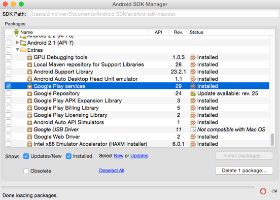

After Google Play Services Package is installed. Open **AndroidManifest.xml** file of your app and add the following element as a child of the **\<application>** element:

~~~xml
    <meta-data android:name="com.google.android.gms.version"
        android:value="@integer/google_play_services_version" />
~~~

You can now start using the Google Maps Android APIs to develop your app.

#### 3. Applying for an Google API Key

Now, let's go to <a href="https://developers.google.com/maps/documentation/android-api/signup?authuser=2" target="_blank">Google's Quick guide to getting a key</a> to apply for a Google API Key. Login with your Google account and press the **GET A Key** button and create a project named "GSDemo"(You can use another name here). You will see the following screenshot like this:

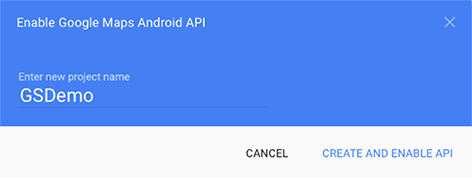

 Then press the **CREATE AND ENABLE API** button to create and enable the Google Maps Android API of this project, wait for a few seconds, you may see the following screenshot:

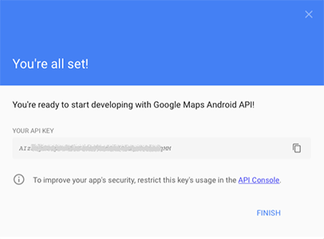 

 Now, you get your **API Key**, copy it and we will use it in the next section.
 
#### 4. Adding Google API Key

Open the AndroidManifest.xml file, add the following element as child of **<application>** element and substitute your Google API Key you have just generated in the **value** attribute as shown below:

~~~xml
    <meta-data
        android:name="com.google.android.geo.API_KEY"
        android:value="" /> //TODO: Enter your Google API Key here
    <meta-data
       android:name="com.google.android.gms.version"
       android:value="@integer/google_play_services_version" />
~~~

The first element sets the key "com.google.android.geo.API_KEY" to the value of your Google API key. The second one set the google play services version number.

For more details of getting Google API Key, please refer to <a href="https://developers.google.com/maps/documentation/android-api/signup" target="_blank">https://developers.google.com/maps/documentation/android-api/signup</a> 
 
Moreover, specify the permissions of your application needs, by adding **\<uses-permission>** elements as children of the **\<manifest>** element in the "AndroidManifest.xml" file. 

~~~xml
    <uses-permission android:name="android.permission.BLUETOOTH" />
    <uses-permission android:name="android.permission.BLUETOOTH_ADMIN" />
    <uses-permission android:name="android.permission.INTERNET" />
    <uses-permission android:name="android.permission.WRITE_EXTERNAL_STORAGE" />
    <uses-permission android:name="android.permission.READ_PHONE_STATE" />
    <uses-permission android:name="android.permission.READ_EXTERNAL_STORAGE" />
    <uses-permission android:name="android.permission.ACCESS_COARSE_LOCATION" />
    <uses-permission android:name="android.permission.ACCESS_NETWORK_STATE" />
    <uses-permission android:name="android.permission.ACCESS_FINE_LOCATION" />
    <uses-permission android:name="android.permission.CHANGE_WIFI_STATE" />
    <uses-permission android:name="android.permission.ACCESS_WIFI_STATE" />
    <uses-permission android:name="android.permission.CHANGE_CONFIGURATION" />
    <uses-permission android:name="android.permission.SYSTEM_ALERT_WINDOW" />
    <uses-permission android:name="android.permission.WRITE_SETTINGS" />
    <uses-permission android:name="android.permission.VIBRATE" />
    <uses-permission android:name="android.permission.WAKE_LOCK" />
    <uses-permission android:name="android.permission.MOUNT_UNMOUNT_FILESYSTEMS" />
~~~

Finally, we need to specify requirement for OpenGL ES version 2 by adding the following element inside the **\<manifest>** element:

~~~xml
   <uses-feature
        android:glEsVersion="0x00020000"
        android:required="true" />
~~~

For more details of description on the permissions, refer to <a href="https://developers.google.com/maps/documentation/android/config" target="_blank">https://developers.google.com/maps/documentation/android/config</a>.

#### 5. Adding Multidex Support with Gradle

In order to use Google Play Service in our project, we need to add Multidex support to avoid the 64K limit with Gradle.

Modify the module-level `build.gradle` file configuration to include the support library and enable multidex output in both **defaultConfig** and **dependencies** parts, as shown in the following code snippet:

~~~xml
android {
    compileSdkVersion 23
    buildToolsVersion "23.0.2"

    defaultConfig {
        ...
        minSdkVersion 19
        targetSdkVersion 23
        ...
        
        // Enabling multidex support.
        multiDexEnabled true
    }
    ...
}

dependencies {
  ...
  compile 'com.google.android.gms:play-services:9.2.0'
  compile 'com.android.support:multidex:1.0.1'
}
~~~

In the code above, we declare the "compileSdkVersion", "buildToolsVersion", "minSdkVersion" and "targetSdkVersion". Furthermore, we add the `compile 'com.google.android.gms:play-services:9.2.0'` to the "dependencies" to support google play service.

Then select **Tools->Android->Sync Project with Gradle Files** to sync the gradle files.

For more details about configuring your App for Multidex with Gradle, please check this link: <a href="http://developer.android.com/tools/building/multidex.html" target="_blank">http://developer.android.com/tools/building/multidex.html</a>.

### Importing the SDK

Unzip the Android SDK package downloaded from <a href="https://developer.dji.com/mobile-sdk/downloads" target="_blank">DJI Developer Website</a>. Go to **File -> New -> Import Module**, enter the "API Library" folder location of the downloaded Android SDK package in the "Source directory" field. A "dJISDKLib" name will show in the "Module name" field. Press Next and Finish button to finish the settings.

Next, double click on the "build.gradle(Module: app)" file to open it and add the `compile project(':dJISDKLIB')` at the bottom of **dependencies** part:

~~~xml
dependencies {
    ...
    compile 'com.google.android.gms:play-services:9.2.0'
    compile 'com.android.support:multidex:1.0.1'
    compile project(':dJISDKLIB')
}
~~~

Like we do before, select the **Tools -> Android -> Sync Project with Gradle Files** on the top bar and wait for Gradle project sync finish.

Now, let's right click on the 'app' module in the project navigator and click "Open Module Settings" to open the Project Struture window. Navigate to the "Dependencies" tab, you should find the "dJISDKLIB" appear in the list. Your SDK environmental setup should be ready now!

 
 
### Building the Layouts of MainActivity

#### 1. Creating DJIDemoApplication Class 

   Right-click on the package `com.dji.GSDemo.GoogleMap` in the project navigator and choose **New -> Java Class**, Type in "DJIDemoApplication" in the Name field and select "Class" as Kind field content.
   
   Next, Replace the code of the "DJIDemoApplication.java" file with the following:
   
~~~java
package com.dji.GSDemo.GoogleMap;
import android.app.Application;

public class DJIDemoApplication extends Application{

    @Override
    public void onCreate() {
        super.onCreate();
    }
    
    protected void attachBaseContext(Context base){
        super.attachBaseContext(base);
        MultiDex.install(this);
    }
}
~~~

   Here, we override the `onCreate()` method. and implement the `attachBaseContext()` method to install the multiDex. We can do some settings when the application is created here.
   
#### 2. Creating the MainActivity

##### Implementing the MainActivity Layout

Open the **activity_main.xml** layout file and replace the code with the following:

~~~xml
<LinearLayout xmlns:android="http://schemas.android.com/apk/res/android"
    xmlns:tools="http://schemas.android.com/tools"
    android:layout_width="match_parent"
    android:layout_height="match_parent"
    android:orientation="vertical"
    android:background="#FFFFFF"
    tools:context="com.dji.GSDemo.GoogleMap.MainActivity">

    <LinearLayout
        android:layout_width="match_parent"
        android:layout_height="wrap_content"
        android:orientation="horizontal">
        <TextView
            android:id="@+id/ConnectStatusTextView"
            android:layout_width="wrap_content"
            android:layout_height="wrap_content"
            android:text="GSDemo"
            android:gravity="center"
            android:textColor="#000000"
            android:textSize="21sp"
            />
    </LinearLayout>
    <LinearLayout
        android:layout_width="match_parent"
        android:layout_height="wrap_content"
        android:orientation="horizontal">
        <Button
            android:id="@+id/locate"
            android:layout_width="match_parent"
            android:layout_height="wrap_content"
            android:text="Locate"
            android:layout_weight="1"/>
        <Button
            android:id="@+id/add"
            android:layout_width="match_parent"
            android:layout_height="wrap_content"
            android:text="Add"
            android:layout_weight="1"/>
        <Button
            android:id="@+id/clear"
            android:layout_width="match_parent"
            android:layout_height="wrap_content"
            android:text="Clear"
            android:layout_weight="1"/>
    </LinearLayout>

    <LinearLayout
        android:layout_width="match_parent"
        android:layout_height="wrap_content"
        android:orientation="horizontal">
        <Button
            android:id="@+id/config"
            android:layout_width="match_parent"
            android:layout_height="wrap_content"
            android:text="Config"
            android:layout_weight="0.9"/>
        <Button
            android:id="@+id/upload"
            android:layout_width="match_parent"
            android:layout_height="wrap_content"
            android:text="Upload"
            android:layout_weight="0.9"/>
        <Button
            android:id="@+id/start"
            android:layout_width="match_parent"
            android:layout_height="wrap_content"
            android:text="Start"
            android:layout_weight="1"/>
        <Button
            android:id="@+id/stop"
            android:layout_width="match_parent"
            android:layout_height="wrap_content"
            android:text="Stop"
            android:layout_weight="1"/>
    </LinearLayout>

    <fragment
        android:id="@+id/map"
        android:layout_width="match_parent"
        android:layout_height="match_parent"
        class="com.google.android.gms.maps.SupportMapFragment" />

</LinearLayout>
~~~

  In the xml file, we implement the following UIs:
  
1. Create a LinearLayout to show a TextView with "GSDemo" title and put it on the top.

2. Create two lines of Buttons: "LOCATE", "ADD", "CLEAR", "CONFIG", "UPLOAD", "START" and "STOP", place them horizontally.

3. Lastly, we create a map view fragment and place it at the bottom.
  
Next, copy the "aircraft.png" and "ic_launcher.png" image files from this Github sample project to the **drawable** folders inside the **res** folder.
    
Furthermore, open the AndroidManifest.xml file and update the ".MainActivity" activity element with several attributes as shown below:
  
~~~xml
<activity
            android:name=".MainActivity"
            android:configChanges="orientation|screenSize"
            android:label="@string/title_activity_mainactivity"
            android:screenOrientation="landscape"
            android:theme="@android:style/Theme.NoTitleBar.Fullscreen" >
            <intent-filter>
                <action android:name="android.intent.action.MAIN" />

                <category android:name="android.intent.category.LAUNCHER" />
            </intent-filter>
</activity>
~~~
   
  Moreover, open the "strings.xml" file in **values** folder and add the following string content:
  
~~~xml
    <string name="title_activity_demo">GSDemoActivity</string>
    <string name="google_app_id">Google_App_ID_String</string>
~~~
 
  Please enter your "Google APP ID" in the "Google_ App_ ID_String" value part.
  
  Now, if you check the "activity_main.xml" file, you should see the preview screenshot of MainActivity as shown below:
   
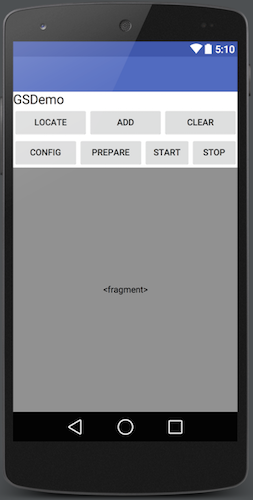

  Lastly, let's create a new xml file named "dialog_waypointsetting.xml" in the layout folder by right-clicking on the "layout" folder and select **New->XML->Layout XML File**. Then replace the code with the same file in Github Sample Project, since the content is too much, we don't show them all here.

This xml file will help to setup a textView to enter "Altitude" and create three RadioButton Groups for selecting **Speed**, **Action After Finished** and **Heading**.

  Now, if you check the dialog_waypointsetting.xml file, you can see the preview screenshot of Waypoint Configuration Dialog as shown below:
   

##### Working on the MainActivity Class

Let's come back to the MainActivity.java class, and replace the code with the following, remember to import the related classes as Android Studio suggested:

~~~java
public class MainActivity extends FragmentActivity implements View.OnClickListener, GoogleMap.OnMapClickListener, OnMapReadyCallback {

    protected static final String TAG = "MainActivity";
    private GoogleMap gMap;
    private Button locate, add, clear;
    private Button config, upload, start, stop;

    @Override
    protected void onResume(){
        super.onResume();
    }

    @Override
    protected void onPause(){
        super.onPause();
    }

    @Override
    protected void onDestroy(){
        super.onDestroy();
    }

    /**
     * @Description : RETURN BTN RESPONSE FUNCTION
     */
    public void onReturn(View view){
        Log.d(TAG, "onReturn");
        this.finish();
    }

    private void initUI() {
        locate = (Button) findViewById(R.id.locate);
        add = (Button) findViewById(R.id.add);
        clear = (Button) findViewById(R.id.clear);
        config = (Button) findViewById(R.id.config);
        upload = (Button) findViewById(R.id.upload);
        start = (Button) findViewById(R.id.start);
        stop = (Button) findViewById(R.id.stop);

        locate.setOnClickListener(this);
        add.setOnClickListener(this);
        clear.setOnClickListener(this);
        config.setOnClickListener(this);
        upload.setOnClickListener(this);
        start.setOnClickListener(this);
        stop.setOnClickListener(this);
    }

    @Override
    protected void onCreate(Bundle savedInstanceState) {
        super.onCreate(savedInstanceState);
        
        // When the compile and target version is higher than 22, please request the
        // following permissions at runtime to ensure the
        // SDK work well.
        if (Build.VERSION.SDK_INT >= Build.VERSION_CODES.M) {
            ActivityCompat.requestPermissions(this,
                    new String[]{Manifest.permission.WRITE_EXTERNAL_STORAGE, Manifest.permission.VIBRATE,
                            Manifest.permission.INTERNET, Manifest.permission.ACCESS_WIFI_STATE,
                            Manifest.permission.WAKE_LOCK, Manifest.permission.ACCESS_COARSE_LOCATION,
                            Manifest.permission.ACCESS_NETWORK_STATE, Manifest.permission.ACCESS_FINE_LOCATION,
                            Manifest.permission.CHANGE_WIFI_STATE, Manifest.permission.MOUNT_UNMOUNT_FILESYSTEMS,
                            Manifest.permission.READ_EXTERNAL_STORAGE, Manifest.permission.SYSTEM_ALERT_WINDOW,
                            Manifest.permission.READ_PHONE_STATE,
                    }
                    , 1);
        }
        
        setContentView(R.layout.activity_main);
        initUI();
        SupportMapFragment mapFragment = (SupportMapFragment) getSupportFragmentManager()
                .findFragmentById(R.id.map);
        mapFragment.getMapAsync(this);

    }

    private void showSettingDialog(){
        LinearLayout wayPointSettings = (LinearLayout)getLayoutInflater().inflate(R.layout.dialog_waypointsetting, null);

        final TextView wpAltitude_TV = (TextView) wayPointSettings.findViewById(R.id.altitude);
        RadioGroup speed_RG = (RadioGroup) wayPointSettings.findViewById(R.id.speed);
        RadioGroup actionAfterFinished_RG = (RadioGroup) wayPointSettings.findViewById(R.id.actionAfterFinished);
        RadioGroup heading_RG = (RadioGroup) wayPointSettings.findViewById(R.id.heading);

        speed_RG.setOnCheckedChangeListener(new RadioGroup.OnCheckedChangeListener(){

            @Override
            public void onCheckedChanged(RadioGroup group, int checkedId) {
                // TODO Auto-generated method stub
                Log.d(TAG, "Select Speed finish");
            }
        });

        actionAfterFinished_RG.setOnCheckedChangeListener(new RadioGroup.OnCheckedChangeListener() {
            @Override
            public void onCheckedChanged(RadioGroup group, int checkedId) {
                // TODO Auto-generated method stub
                Log.d(TAG, "Select action action");
            }
        });

        heading_RG.setOnCheckedChangeListener(new RadioGroup.OnCheckedChangeListener() {

            @Override
            public void onCheckedChanged(RadioGroup group, int checkedId) {
                // TODO Auto-generated method stub
                Log.d(TAG, "Select heading finish");
            }
        });

        new AlertDialog.Builder(this)
                .setTitle("")
                .setView(wayPointSettings)
                .setPositiveButton("Finish",new DialogInterface.OnClickListener(){
                    public void onClick(DialogInterface dialog, int id) {
                    }
                })
                .setNegativeButton("Cancel", new DialogInterface.OnClickListener() {
                    public void onClick(DialogInterface dialog, int id) {
                        dialog.cancel();
                    }
                })
                .create()
                .show();
    }
    
    @Override
    public void onClick(View v) {
        // TODO Auto-generated method stub
        switch (v.getId()) {
            case R.id.config:{
                showSettingDialog();
                break;
            }
            default:
                break;
        }
    }

    @Override
    public void onMapReady(GoogleMap googleMap) {
        // TODO Auto-generated method stub
        // Initializing Amap object
        if (gMap == null) {
            gMap = googleMap;
            setUpMap();
        }

        LatLng shenzhen = new LatLng(22.5362, 113.9454);
        gMap.addMarker(new MarkerOptions().position(shenzhen).title("Marker in Shenzhen"));
        gMap.moveCamera(CameraUpdateFactory.newLatLng(shenzhen));
    }

    private void setUpMap() {
        gMap.setOnMapClickListener(this);// add the listener for click for amap object
    }

    @Override
    public void onMapClick(LatLng point) {
    }
}
~~~

In the code shown above, we implement the following features:

**1.** Create a GoogleMap variable and 7 Button member variables for the UI. Then create the `initUI()` method to init the 7 Button variables and implement their `setOnClickListener` method and pass "this" as parameter.

**2.** In the `onCreate()` method, we request several permissions at runtime to ensure the SDK works well when the compile and target SDK version is higher than 22(Like Android Marshmallow 6.0 device and API 23).

**3.** Then invoke `initUI()` method and create "SupportMapFragment" variable to call the `OnMapReady()` method asynchronously.

**4.** Implement the `showSettingDialog` method to show the **Waypoint Configuration** alert dialog and override the `onClick()` method to show the configuration dialog when press the **Config** button.

**5.** Lastly, we override the `onMapReady()` method to initialize the `gMap` and invoke `setUpMap()` method to implement the `setOnMapClickListener()` method of `gMap` variable. Then add a marker of Shenzhen, China here for example. So when the Google map is loaded, you will see a red pin tag on Shenzhen, China.

For more details, please check the tutorial's Github Sample Project. If you are not familiar with adding a Google map to your application, please follow this <a href="https://developers.google.com/maps/documentation/android-api/utility/setup#library-dependency" target="_blank">guide</a>. 

##### Implementing ConnectionActivity Class

To improve the user experience, we had better create an activity to show the connection status between the DJI Product and the SDK, once it's connected, the user can press the **OPEN** button to enter the **MainActivity**. You can check this section in [Creating a Camera Application](index.html#4-implementing-connectionactivity-class) to learn how to implement the ConnectionActivity Class in this project.

### Registering your Application

#### 1. Modifying AndroidManifest file

After you finish the above steps, let's register our application with the **App Key** you apply from DJI Developer Website. If you are not familiar with the App Key, please check the [Get Started](../quick-start/index.html).

Let's open the AndroidManifest.xml file and add the following elements to it:

~~~xml
<uses-feature
    android:name="android.hardware.usb.host"
    android:required="false" />
<uses-feature
    android:name="android.hardware.usb.accessory"
    android:required="true" />
~~~

Here, because not all Android-powered devices are guaranteed to support the USB accessory and host APIs, include two <uses-feature> elements that declares that your application uses the "android.hardware.usb.accessory" and "android.hardware.usb.host" feature.

Then add the following elements above the **MainActivity** activity element:

~~~xml
    <!-- DJI SDK -->

    <uses-library android:name="com.android.future.usb.accessory" />
    <meta-data
        android:name="com.dji.sdk.API_KEY"
        android:value="Please enter your App Key here." />
    <meta-data
        android:name="com.google.android.geo.API_KEY"
        android:value="YOUR_API_KEY" />
     <meta-data
     android:name="com.google.android.gms.version"
     android:value="@integer/google_play_services_version" />

    <activity
        android:name="dji.sdk.sdkmanager.DJIAoaControllerActivity"
        android:theme="@android:style/Theme.Translucent" >
        <intent-filter>
            <action android:name="android.hardware.usb.action.USB_ACCESSORY_ATTACHED" />
        </intent-filter>
        
        <meta-data
          android:name="android.hardware.usb.action.USB_ACCESSORY_ATTACHED"
            android:resource="@xml/accessory_filter" />
    </activity>
    <service android:name="dji.sdk.sdkmanager.DJIGlobalService" >
    </service>

    <!-- DJI SDK -->
~~~

In the code above, we enter the **App Key** of the application in the value part of `android:name="com.dji.sdk.API_KEY"` attribute. For more details of the AndroidManifest.xml file, please check the Github source code of the demo project.

#### 2. Implementing DJIDemoApplication Class

After you finish the steps above, open the DJIDemoApplication.java file and replace the code with the same file in the Github Source Code, here we explain the important parts of it:

~~~java
@Override
public void onCreate() {
    super.onCreate();
    mHandler = new Handler(Looper.getMainLooper());
    DJISDKManager.getInstance().registerApp(this, mDJISDKManagerCallback);
}
    
private DJISDKManager.SDKManagerCallback mDJISDKManagerCallback = new DJISDKManager.SDKManagerCallback() {
    @Override
    public void onRegister(DJIError error) {
        Log.d(TAG, error == null ? "Success" : error.getDescription());
        if(error == DJISDKError.REGISTRATION_SUCCESS) {
            DJISDKManager.getInstance().startConnectionToProduct();
            Handler handler = new Handler(Looper.getMainLooper());
            handler.post(new Runnable() {
                @Override
                public void run() {
                    Toast.makeText(getApplicationContext(), "Register Success", Toast.LENGTH_LONG).show();
                }
            });
        } else {
            Handler handler = new Handler(Looper.getMainLooper());
            handler.post(new Runnable() {
                @Override
                public void run() {
                    Toast.makeText(getApplicationContext(), "register sdk fails, check network is available", Toast.LENGTH_LONG).show();
                }
            });

            Log.d(TAG, "Register failed");

         }
         Log.e(TAG, error == null ? "success" : error.getDescription());
    }

    @Override
    public void onProductChange(BaseProduct oldProduct, BaseProduct newProduct) {
        mProduct = newProduct;
        if(mProduct != null) {
            mProduct.setBaseProductListener(mDJIBaseProductListener);
        }
        notifyStatusChange();
    }
};
~~~

  Here, we implement several features:
  
1. We override the `onCreate()` method to initialize the DJISDKManager.
2. Implement the two interface methods of SDKManagerCallback. You can use the `onRegister()` method to check the Application registration status and show text message here. Using the `onProductChange()` method, we can check the product connection status and invoke the `notifyStatusChange()` method to notify status changes.

Now let's build and run the project and install it to your Android device. If everything goes well, you should see the "Register Success" textView like the following screenshot when you register the app successfully.

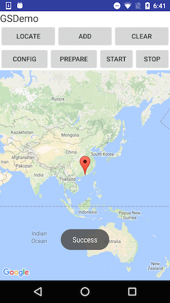

> **Important:** Please check if the "armeabi-v7a", "arm64-v8a" and "x86" lib folders has been added to your jnLibs folder in **dJISDKLib** successfully before testing resgistering the app. 
> 
> 

## Implementing the Waypoint Mission

### Locating Aircraft on Google Map

Before we implementing the waypoint mission feature, we should show the aircraft's location on Google Map and try to zoom in automatically to view the surrounding area of the aircraft.

Let's open MainActivity.java file and declare the following variables first:

~~~java
private double droneLocationLat = 181, droneLocationLng = 181;
private Marker droneMarker = null;
private FlightController mFlightController;
~~~

Then, since we need to detect the product connection status, we should register a BroadcastReceiver in the `onCreate()` method and override the `onReceive()` method of it as shown below:

~~~java

@Override
protected void onDestroy(){
    super.onDestroy();
    unregisterReceiver(mReceiver);
}

@Override
    protected void onCreate(Bundle savedInstanceState) {
        super.onCreate(savedInstanceState);
        setContentView(R.layout.activity_main);

        //Register BroadcastReceiver
        IntentFilter filter = new IntentFilter();
        filter.addAction(DJIDemoApplication.FLAG_CONNECTION_CHANGE);
        registerReceiver(mReceiver, filter);

        initUI();

        SupportMapFragment mapFragment = (SupportMapFragment) getSupportFragmentManager()
                .findFragmentById(R.id.map);

        mapFragment.getMapAsync(this);
    }
    
protected BroadcastReceiver mReceiver = new BroadcastReceiver() {

        @Override
        public void onReceive(Context context, Intent intent) {
            onProductConnectionChange();
        }
    };
~~~

The `onReceive()` method will be invoked when the DJI Product connection status change, we can use it to update our aircraft's location.

Next, let's implement the `initFlightController()` method and invoke it inside the `onProductConnectionChange()` method:

~~~java
private void onProductConnectionChange()
{
    initFlightController();
}

private void initFlightController() {

    BaseProduct product = DJIDemoApplication.getProductInstance();
    if (product != null && product.isConnected()) {
        if (product instanceof Aircraft) {
            mFlightController = ((Aircraft) product).getFlightController();
        }
    }

    if (mFlightController != null) {
        mFlightController.setStateCallback(new FlightControllerState.Callback() {

            @Override
            public void onUpdate(FlightControllerState djiFlightControllerCurrentState) {
                droneLocationLat = djiFlightControllerCurrentState.getAircraftLocation().getLatitude();
                droneLocationLng = djiFlightControllerCurrentState.getAircraftLocation().getLongitude();
                updateDroneLocation();
            }
        });
    }
}
~~~

In the code above, we firstly check the product connection status with the help of `isConnected()` method of DJIBaseProduct. Then initialize `mFlightController` variable and override the `onUpdate()` method to invoke `updateDroneLocation` method. By using the `onUpdate()` method, you can get the flight controller current state from the parameter.

Furthermore, let's implement the `updateDroneLocation()` method and invoke it in `onClick()` method's locate button click action:

~~~java
public static boolean checkGpsCoordination(double latitude, double longitude) {
    return (latitude > -90 && latitude < 90 && longitude > -180 && longitude < 180) && (latitude != 0f && longitude != 0f);
}
    
private void updateDroneLocation(){

    LatLng pos = new LatLng(droneLocationLat, droneLocationLng);
    //Create MarkerOptions object
    final MarkerOptions markerOptions = new MarkerOptions();
    markerOptions.position(pos);
    markerOptions.icon(BitmapDescriptorFactory.fromResource(R.drawable.aircraft));

    runOnUiThread(new Runnable() {
        @Override
        public void run() {
            if (droneMarker != null) {
                droneMarker.remove();
            }

            if (checkGpsCoordinates(droneLocationLat, droneLocationLng)) {
                droneMarker = gMap.addMarker(markerOptions);
            }
        }
    });
}

@Override
public void onClick(View v) {
    // TODO Auto-generated method stub
    switch (v.getId()) {
        case R.id.locate:{
            updateDroneLocation();
            cameraUpdate();
            break;
        }
        case R.id.config:{
            showSettingDialog();
            break;
        }
        default:
            break;
    }
}
~~~

In the `updateDroneLocation()` method, we add the drone location marker on Google map.

Finally, let's implement the `camearUpdate()` method to move camera and zoom in Google Map to the drone's location:

~~~java
private void cameraUpdate(){
    LatLng pos = new LatLng(droneLocationLat, droneLocationLng);
    float zoomlevel = (float) 18.0;
    CameraUpdate cu = CameraUpdateFactory.newLatLngZoom(pos, zoomlevel);
    gMap.moveCamera(cu);
}
~~~

Before going forward, you can check the [Using DJI Assistant 2 Simulator](../application-development-workflow/workflow-testing.html#dji-assistant-2-simulator) for its basic usage.

Now, let's connect the aircraft to your PC or Mac running DJI Assistant 2 via a Micro USB cable, and then power on the aircraft and the remote controller. Press the **Simulator** button in the DJI Assistant 2 and feel free to type in your current location's latitude and longitude data into the simulator.

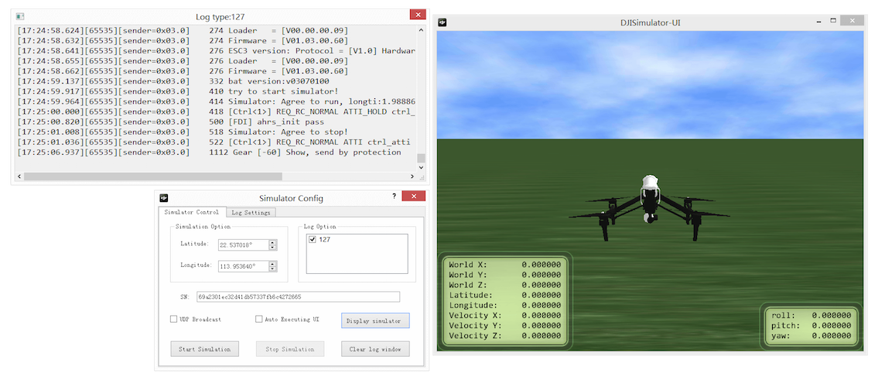

Next, build and run the project and install it in your Android device and connect it to the remote controller using USB cable.

Press the **Start Simulating** button. If you check the application now, a tiny red aircraft will be shown on the map. If you cannot find the aircraft, press the "LOCATE" button to zoom in to the center of the aircraft on the Map. Here is a gif animation for you to check:

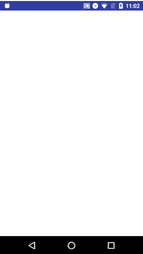

### Adding Waypoint Markers

Since you can see the aircraft clearly on the Google map now, you can add `Marker` on the map to show the waypoints of the Waypoint Mission. Let's continue to declare the `mMarkers` variable first:

~~~java
private boolean isAdd = false;
private final Map<Integer, Marker> mMarkers = new ConcurrentHashMap<Integer, Marker>();
~~~

Then, implement the `onMapClick()` and `markWaypoint()` methods as shown below:

~~~java
private void setResultToToast(final String string){
    MainActivity.this.runOnUiThread(new Runnable() {
        @Override
        public void run() {
            Toast.makeText(MainActivity.this, string, Toast.LENGTH_SHORT).show();
        }
    });
}
    
@Override
public void onMapClick(LatLng point) {
    if (isAdd == true){
        markWaypoint(point);       
    }else{
        setResultToToast("Cannot add waypoint");
    }
}
    
private void markWaypoint(LatLng point){
    //Create MarkerOptions object
    MarkerOptions markerOptions = new MarkerOptions();
    markerOptions.position(point);
    markerOptions.icon(BitmapDescriptorFactory.defaultMarker(BitmapDescriptorFactory.HUE_BLUE));
    Marker marker = gMap.addMarker(markerOptions);
    mMarkers.put(mMarkers.size(), marker);
}
~~~

Here, the `onMapClick()` method will be invoked when user tap on the Map View. When user tap on different position of the Map View, we will create a `MarkerOptions` object and assign the "LatLng" object to it, then invoke "gMap"'s `addMarker()` method by passing the markerOptions parameter to add the waypoint markers on the Google map.

Finally, let's implement the `onClick()` and `enableDisableAdd()` methods to implement the **ADD** and **CLEAR** actions as shown below:

~~~java
 @Override
 public void onClick(View v) {
    switch (v.getId()) {
        case R.id.add:{
            enableDisableAdd();
            break;
        }
        case R.id.clear:{
            runOnUiThread(new Runnable() {
                @Override
                public void run() {
                    gMap.clear();
                }
            });
            break;
        }
        case R.id.config:{
            showSettingDialog();
            break;
        }
        default:
            break;
    }
}
    
private void enableDisableAdd(){
   if (isAdd == false) {
      isAdd = true;
      add.setText("Exit");
   }else{
      isAdd = false;
      add.setText("Add");
   }
 }
~~~

Now, let's try to build and run your application on an Android device and try to add waypoints on the Google map. If everything goes well, you should see the following gif animation:

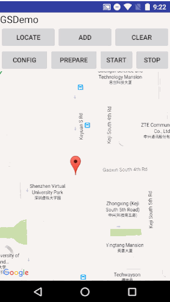

### Implementing Waypoint Missions

#### Configurating Waypoint Mission

Before we upload a Waypoint Mission, we should provide a way for user to configure it, like setting the flying altitude, speed, heading, etc. So let's declare several variables as shown below firstly:

~~~java
private float altitude = 100.0f;
private float mSpeed = 10.0f;

private List<Waypoint> waypointList = new ArrayList<>();

public static WaypointMission.Builder waypointMissionBuilder;
private WaypointMissionOperator instance;
private WaypointMissionFinishedAction mFinishedAction = WaypointMissionFinishedAction.NO_ACTION;
private WaypointMissionHeadingMode mHeadingMode = WaypointMissionHeadingMode.AUTO;
~~~

Here we declare the `altitude`, `mSpeed`, `mFinishedAction` and `mHeadingMode` variable and intialize them with default value. Also, we declare the **WaypointMission.Builder** and **WaypointMissionOperator** variables for setting up missions.

Next, replace the code of `showSettingDialog()` method with the followings:

~~~java
private void showSettingDialog(){
    LinearLayout wayPointSettings = (LinearLayout)getLayoutInflater().inflate(R.layout.dialog_waypointsetting, null);

    final TextView wpAltitude_TV = (TextView) wayPointSettings.findViewById(R.id.altitude);
    RadioGroup speed_RG = (RadioGroup) wayPointSettings.findViewById(R.id.speed);
    RadioGroup actionAfterFinished_RG = (RadioGroup) wayPointSettings.findViewById(R.id.actionAfterFinished);
    RadioGroup heading_RG = (RadioGroup) wayPointSettings.findViewById(R.id.heading);

    speed_RG.setOnCheckedChangeListener(new RadioGroup.OnCheckedChangeListener(){
        @Override
        public void onCheckedChanged(RadioGroup group, int checkedId) {
            if (checkedId == R.id.lowSpeed){
                mSpeed = 3.0f;
            } else if (checkedId == R.id.MidSpeed){
                mSpeed = 5.0f;
            } else if (checkedId == R.id.HighSpeed){
                mSpeed = 10.0f;
            }
        }
    });

    actionAfterFinished_RG.setOnCheckedChangeListener(new RadioGroup.OnCheckedChangeListener() {

        @Override
        public void onCheckedChanged(RadioGroup group, int checkedId) {
            Log.d(TAG, "Select finish action");
            if (checkedId == R.id.finishNone){
                mFinishedAction = WaypointMissionFinishedAction.NO_ACTION;
            } else if (checkedId == R.id.finishGoHome){
                mFinishedAction = WaypointMissionFinishedAction.GO_HOME;
            } else if (checkedId == R.id.finishAutoLanding){
                mFinishedAction = WaypointMissionFinishedAction.AUTO_LAND;
            } else if (checkedId == R.id.finishToFirst){
                mFinishedAction = WaypointMissionFinishedAction.GO_FIRST_WAYPOINT;
            }
        }
    });

    heading_RG.setOnCheckedChangeListener(new RadioGroup.OnCheckedChangeListener() {

        @Override
        public void onCheckedChanged(RadioGroup group, int checkedId) {
            Log.d(TAG, "Select heading");

            if (checkedId == R.id.headingNext) {
                mHeadingMode = WaypointMissionHeadingMode.AUTO;
            } else if (checkedId == R.id.headingInitDirec) {
                mHeadingMode = WaypointMissionHeadingMode.USING_INITIAL_DIRECTION;
            } else if (checkedId == R.id.headingRC) {
                mHeadingMode = WaypointMissionHeadingMode.CONTROL_BY_REMOTE_CONTROLLER;
            } else if (checkedId == R.id.headingWP) {
                mHeadingMode = WaypointMissionHeadingMode.USING_WAYPOINT_HEADING;
            }
        }
    });

    new AlertDialog.Builder(this)
            .setTitle("")
            .setView(wayPointSettings)
            .setPositiveButton("Finish",new DialogInterface.OnClickListener(){
                public void onClick(DialogInterface dialog, int id) {

                    String altitudeString = wpAltitude_TV.getText().toString();
                    altitude = Integer.parseInt(nulltoIntegerDefalt(altitudeString));
                    Log.e(TAG,"altitude "+altitude);
                    Log.e(TAG,"speed "+mSpeed);
                    Log.e(TAG, "mFinishedAction "+mFinishedAction);
                    Log.e(TAG, "mHeadingMode "+mHeadingMode);
                    configWayPointMission();
                }

            })
            .setNegativeButton("Cancel", new DialogInterface.OnClickListener() {
                public void onClick(DialogInterface dialog, int id) {
                    dialog.cancel();
                }

            })
            .create()
            .show();
}

String nulltoIntegerDefault(String value){
    if(!isIntValue(value)) value="0";
    return value;
}

boolean isIntValue(String val)
{
    try {
        val=val.replace(" ","");
        Integer.parseInt(val);
    } catch (Exception e) {return false;}
    return true;
}
~~~

Here, we implement the `setOnCheckedChangeListener()` method of "RadioGroup" class and pass different values to the `mSpeed`, `mFinishedAction` and `mHeadingMode` variables based on the item user select. 

For the finished action of DJIWaypointMission, we provide several enum values here:

- **AUTO_LAND**

   The aircraft will land automatically at the last waypoint. 

- **CONTINUE_UNTIL_END**

  If the user attempts to pull the aircraft back along the flight path as the mission is being executed, the aircarft will move towards the previous waypoint and will continue to do so until there are no more waypoint to move back to or the user has stopped attempting to move the aircraft back. 
  
- **GO_FIRST_WAYPOINT**

  The aircraft will go back to its first waypoint and hover in position. 
  
- **GO_HOME**

  The aicraft will go home when the mission is complete. 

- **NO_ACTION**

  No further action will be taken on completion of mission. 
  
For the heading mode of DJIWaypointMission, we provide these enum values here:

- **AUTO**

  Aircraft's heading will always be in the direction of flight. 
  
- **CONTROL_BY_REMOTE_CONTROLLER**

  Aircraft's heading will be controlled by the remote controller. 
  
- **TOWARD_POINT_OF_INTEREST**

  Aircraft's heading will always toward point of interest. 
  
- **USING_INITIAL_DIRECTION**

  Aircraft's heading will be set to the initial take-off heading. 
  
- **USING_WAYPOINT_HEADING**

Aircraft's heading will be set to the previous waypoint's heading while travelling between waypoints. 
  
Now, let's continue to implement the `getWaypointMissionOperator()` and `configWayPointMission()` methods as shown below:
  
~~~java
public WaypointMissionOperator getWaypointMissionOperator() {
    if (instance == null) {
        instance = DJISDKManager.getInstance().getMissionControl().getWaypointMissionOperator();
    }
    return instance;
}

private void configWayPointMission(){

    if (waypointMissionBuilder == null){

        waypointMissionBuilder = new WaypointMission.Builder().finishedAction(mFinishedAction)
                                                              .headingMode(mHeadingMode)
                                                              .autoFlightSpeed(mSpeed)
                                                              .maxFlightSpeed(mSpeed)
                                                              .flightPathMode(WaypointMissionFlightPathMode.NORMAL);

    }else
    {
        waypointMissionBuilder.finishedAction(mFinishedAction)
                .headingMode(mHeadingMode)
                .autoFlightSpeed(mSpeed)
                .maxFlightSpeed(mSpeed)
                .flightPathMode(WaypointMissionFlightPathMode.NORMAL);

    }

    if (waypointMissionBuilder.getWaypointList().size() > 0){

        for (int i=0; i< waypointMissionBuilder.getWaypointList().size(); i++){
            waypointMissionBuilder.getWaypointList().get(i).altitude = altitude;
        }

        setResultToToast("Set Waypoint attitude successfully");
    }

    DJIError error = getWaypointMissionOperator().loadMission(waypointMissionBuilder.build());
    if (error == null) {
        setResultToToast("loadWaypoint succeeded");
    } else {
        setResultToToast("loadWaypoint failed " + error.getDescription());
    }

}
~~~

In the code above, we firstly get the `WaypointMissionOperator` instance in the `getWaypointMissionOperator()` method, then in the `configWayPointMission()` method, we check if `waypointMissionBuilder` is null and set its `finishedAction`, `headingMode`, `autoFlightSpeed`, `maxFlightSpeed` and `flightPathMode` variables of **WaypointMission.Builder**.  Then we use a for loop to set each DJIWaypoint's altitude in the `waypointMissionBuilder`'s waypointsList. Next, we invoke the `loadMission()` method of WaypointMissionOperator and pass the `waypointMissionBuilder.build()` as its parameter to load the waypoint mission to the operator.
    
#### Upload Waypoint Mission

Now, let's create the following methods to setup `WaypointMissionOperatorListener`:

~~~java
@Override
protected void onCreate(Bundle savedInstanceState) {
   ...
   addListener();
   
}

@Override
protected void onDestroy(){
    ...
    removeListener();
}

//Add Listener for WaypointMissionOperator
private void addListener() {
    if (getWaypointMissionOperator() != null) {
        getWaypointMissionOperator().addListener(eventNotificationListener);
    }
}

private void removeListener() {
    if (getWaypointMissionOperator() != null) {
        getWaypointMissionOperator().removeListener(eventNotificationListener);
    }
}

private WaypointMissionOperatorListener eventNotificationListener = new WaypointMissionOperatorListener() {
    @Override
    public void onDownloadUpdate(WaypointMissionDownloadEvent downloadEvent) {

    }

    @Override
    public void onUploadUpdate(WaypointMissionUploadEvent uploadEvent) {

    }

    @Override
    public void onExecutionUpdate(WaypointMissionExecutionEvent executionEvent) {

    }

    @Override
    public void onExecutionStart() {

    }

    @Override
    public void onExecutionFinish(@Nullable final DJIError error) {
        setResultToToast("Execution finished: " + (error == null ? "Success!" : error.getDescription()));
    }
};
~~~

In the code above, we invoke the `addListener()` and `removeListener()` methods of WaypointMissionOperator to add and remove the `WaypointMissionOperatorListener` and then invoke the `addListener()` method at the bottom of `onCreate()` method and invoke the `removeListener()` method in the `onDestroy()` method.

Next, initialize the `WaypointMissionOperatorListener` instance and implement its `onExecutionFinish()` method to show a message to inform user when the mission execution finished.

Furthermore, let's set waypointList of **WaypointMission.Builder** when user tap on the map to add a waypoint in the `onMapClick()` method and implement the `uploadWayPointMission()` method to upload mission to the operator as shown below:

~~~java
@Override
public void onMapClick(LatLng point) {
    if (isAdd == true){
        markWaypoint(point);
        Waypoint mWaypoint = new Waypoint(point.latitude, point.longitude, altitude);
        //Add Waypoints to Waypoint arraylist;
        if (waypointMissionBuilder != null) {
            waypointList.add(mWaypoint);
            waypointMissionBuilder.waypointList(waypointList).waypointCount(waypointList.size());
        }else
        {
            waypointMissionBuilder = new WaypointMission.Builder();
            waypointList.add(mWaypoint);
            waypointMissionBuilder.waypointList(waypointList).waypointCount(waypointList.size());
        }
    }else{
        setResultToToast("Cannot Add Waypoint");
    }
}

private void uploadWayPointMission(){

    getWaypointMissionOperator().uploadMission(new CommonCallbacks.CompletionCallback() {
        @Override
        public void onResult(DJIError error) {
            if (error == null) {
                setResultToToast("Mission upload successfully!");
            } else {
                setResultToToast("Mission upload failed, error: " + error.getDescription() + " retrying...");
                getWaypointMissionOperator().retryUploadMission(null);
            }
        }
    });

}
~~~

Lastly, let's add the `R.id.upload` case checking in the `onClick()` method:

~~~java
case R.id.upload:{
    uploadWayPointMission();
    break;
}
~~~

#### Start and Stop Mission
  
Once the mission finish uploading, we can invoke the `startMission()` and `stopMission()` methods of WaypointMissionOperator to implement the start and stop mission features as shown below:

~~~java
private void startWaypointMission(){

    getWaypointMissionOperator().startMission(new CommonCallbacks.CompletionCallback() {
        @Override
        public void onResult(DJIError error) {
            setResultToToast("Mission Start: " + (error == null ? "Successfully" : error.getDescription()));
        }
    });

}

private void stopWaypointMission(){

    getWaypointMissionOperator().stopMission(new CommonCallbacks.CompletionCallback() {
        @Override
        public void onResult(DJIError error) {
            setResultToToast("Mission Stop: " + (error == null ? "Successfully" : error.getDescription()));
        }
    });

}
~~~

Lastly, let's improve the `onClick()` method to improve the **clear** button action and implement the **start** and **stop** button actions:

~~~java
@Override
public void onClick(View v) {
    switch (v.getId()) {
        case R.id.locate:{
            updateDroneLocation();
            cameraUpdate(); // Locate the drone's place
            break;
        }
        case R.id.add:{
            enableDisableAdd();
            break;
        }
        case R.id.clear: {
            runOnUiThread(new Runnable() {
                @Override
                public void run() {
                    aMap.clear();
                }

            });
            waypointList.clear();
            waypointMissionBuilder.waypointList(waypointList);
            updateDroneLocation();
            break;
        }
        case R.id.config:{
            showSettingDialog();
            break;
        }
        case R.id.upload:{
            uploadWayPointMission();
            break;
        }
        case R.id.start:{
            startWaypointMission();
            break;
        }
        case R.id.stop:{
            stopWaypointMission();
            break;
        }
        default:
            break;
    }
}
~~~

## Test Waypoint Mission with DJI Simulator  

You've come a long way in this tutorial, and it's time to test the whole application.

**Important**: Make sure the battery level of your aircraft is more than 10%, otherwise the waypoint mission may fail!

Build and run the project to install the application into your android device. After that, please connect the aircraft to your PC or Mac running DJI Assistant 2 Simulator via a Micro USB cable. Then, power on the remote controller and the aircraft, in that order.

Next, press the **Simulator** button in the DJI Assistant 2 and feel free to type in your current location's latitude and longitude data into the simulator.

Then connect your android device to the remote controller using USB cable and run the application. Go back to the DJI Assistant 2 Simulator on your PC or Mac and press the **Start Simulating** button. A tiny red aircraft will appear on the map in your application,  if you press the **LOCATE** button, the map view will zoom in to the region you are in and will center the aircraft:

Next, press the **Add** button and tap on the Map where you want to add waypoints, as shown below:

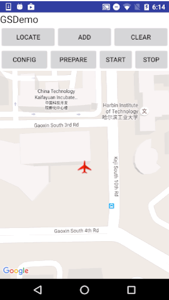

Once you press the **CONFIG** button, the **Waypoint Configuration** dialog will appear. Modify the settings as you want and press **Finish** button. Then press the **UPLOAD** button to upload the mission.

If upload mission success, press the **START** button to start the waypoint mission execution.
  
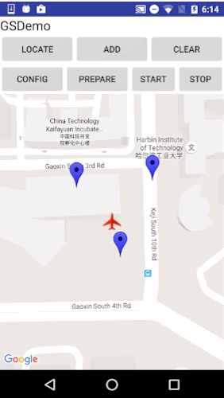  
  
Now you should see the aircraft move towards the waypoints you set previously on the map view, as shown below:

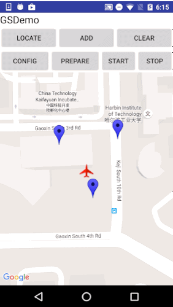

At the same time, you are able to see the Mavic Pro take off and start to fly in the DJI Assistant 2 Simulator.

When the waypoint mission finishes, an "Execution finished: Success!" message will appear and the Mavic Pro will start to go home!

Also, the remote controller will start beeping. Let's take a look at the DJI Assistant 2 Simulator now:

The Mavic Pro will eventually go home, land, and the beeping from the remote controller will stop. The application will go back to its normal status. If you press the **CLEAR** button, all the waypoints you previously set will be cleared. During the mission, if you'd ever like to stop the DJIWaypoint mission, you can do so by pressing the **STOP** button.
  
### Summary

In this tutorial, you’ve learned how to setup and use the DJI Assistant 2 Simulator to test your waypoint mission application, upgrade your aircraft's firmware to the developer version, use the DJI Mobile SDK to create a simple map view, modify annotations of the map view, show the aircraft on the map view by using GPS data from the DJI Assistant 2 Simulator. Next, you learned how to use the **WaypointMission.Builder** to configure waypoint mission settings, how to create and set the waypointList in the **WaypointMission.Builder**. Moreover, you learned how to use WaypointMissionOperator to **upload**, **start** and **stop** missions. 
      
Congratulations! Now that you've finished the demo project, you can build on what you've learned and start to build your own waypoint mission application. You can improve the method which waypoints are added(such as drawing a line on the map and generating waypoints automatically), play around with the properties of a waypoint (such as heading, etc.), and adding more functionality. In order to make a cool waypoint mission application, you still have a long way to go. Good luck and hope you enjoy this tutorial!

