**Note: This Tutorial and Sample Project is developed based on Android SDK v3.5.1, an update version for Android SDK v4.0 will be published soon.**

---

In this tutorial, you will learn how to use the TapFly and ActiveTrack Missions of DJI Android SDK to create a cool application for Phantom 4. Also you will get familiar with DJIMissionManager and using the Simulator of DJI Assistant 2 for testing, which is convenient for you to test the missions indoor. We will use Android Studio 2.1.1 version for demo here. So let's get started!

You can download the tutorial's final sample code project from this [Github Page](https://github.com/DJI-Mobile-SDK-Tutorials/Android-Phantom4Missions).
   
## Phantom 4 New Missions  
   
  The Phantom 4 supports the two new TapFly and ActiveTrack missions, which brings you a more autonomous flying experience.
    
### TapFly Mission

TapFly Mission is only supported on Phantom 4. Given a coordinate in the live video stream (which can come from a user tap), the aircraft will calculate and fly towards the coordinate's direction in the real wold. During flight, the aircraft will automatically detect and avoid obstacles.

During the mission, you can use the remote controller's yaw stick to adjust the heading of the aircraft, which also adjusts the direction of flight to the new yaw. Using any other stick controls will cancel the mission.

Here is a <a href="https://dn-djidl2.qbox.me/cloud/6949e90958a3e0dbf1175cd9bb1f851a/720.mp4" target="_blank"> video </a> for you to get the first impression of the TapFly Mission.

### ActiveTrack Mission

ActiveTrack Mission is only supported on Phantom 4. It allows an aircraft to track a moving subject using the vision system and without a GPS tracker on the subject.

The main camera is used to track the target, so the gimbal cannot be adjusted during an ActiveTrack mission. During the mission the aircraft can be manually flown with pitch, roll and throttle to move around the subject being tracked.

Here is a <a href="https://dn-djidl2.qbox.me/cloud/4ebc02c536baf850f5a568d8c27743fc/720.mp4" target="_blank"> video </a> for you to get the first impression of the ActiveTrack Mission.

## Implementing the UI of Application

Now that you know the details of the two new missions of Phantom 4, we can start working on the application. In our previous tutorial [Importing and Activating DJI SDK in Android Studio Project](../application-development-workflow/workflow-integrate.html#Android-Studio-Project-Integration), you have learned how to import the DJI Android SDK into your Android Studio project and activate your application. If you haven't read that previously, please take a look at it. Once you've done that, let's create the project.

### Importing the Framework and Libraries

 **1**. Open Android Studio and select **File -> New -> New Project** to create a new project, named 'P4MissionsDemo'. Enter the company domain and package name(Here we use "com.dji.P4MissionsDemo") you want and press Next. Set the mimimum SDK version as `API 19: Android 4.4 (KitKat)` for "Phone and Tablet" and press Next. Then select "Empty Activity" and press Next. Lastly, leave the Activity Name as "MainActivity", and the Layout Name as "activity_main", Press "Finish" to create the project.
 
 **2**. Unzip the Android SDK package downloaded from <a href="https://developer.dji.com/mobile-sdk/downloads" target="_blank">DJI Developer Website</a>. Go to **File -> New -> Import Module**, enter the "API Library" folder location of the downloaded Android SDK package in the "Source directory" field. A "dJISDKLib" name will show in the "Module name" field. Press Next and Finish button to finish the settings.
 
 
 
 **3**. Next, double click on the "build.gradle(Module: app)" in the project navigator to open it and replace the content with the following:
 
~~~java
apply plugin: 'com.android.application'
android {
    compileSdkVersion 19
    buildToolsVersion "23.0.2"

    defaultConfig {
        applicationId "com.dji.P4MissionsDemo"
        minSdkVersion 19
        targetSdkVersion 23
        versionCode 1
        versionName "1.0"
    }
    buildTypes {
        release {
            minifyEnabled false
            proguardFiles getDefaultProguardFile('proguard-android.txt'), 'proguard-rules.pro'
        }
    }
}
dependencies {
    compile 'com.android.support:appcompat-v7:23.3.0'
    compile project(':dJISDKLIB')
}
~~~
 
 In the code above, we modify its dependencies by adding `compile project(':dJISDKLIB')` at the bottom, and change the compileSdkVersion, buildToolsVersion number, etc. 
  
 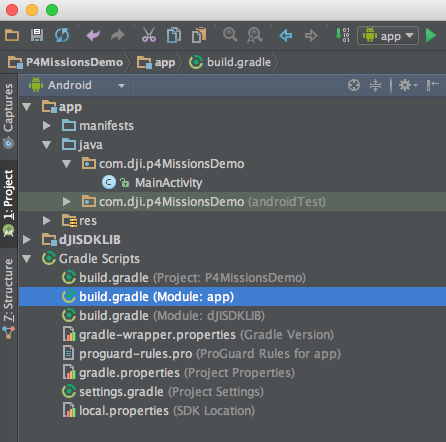
 
 Then, select the **Tools -> Android -> Sync Project with Gradle Files** on the top bar and wait for Gradle project sync finish.
 
 **4**. Let's right click on the 'app' module in the project navigator and click "Open Module Settings" to open the Project Struture window. Navigate to the "Dependencies" tab, you should find the "dJISDKLIB" appear in the list. Your SDK environmental setup should be ready now!
 
 
 
 **5**. Now, open the MainActivity.java file in `com.dji.p4MissionsDemo` package and add `import dji.sdk.sdkmanager.DJISDKManager;` at the bottom of the import classes section as shown below:
 
~~~java
package com.dji.p4MissionsDemo;

import android.support.v7.app.AppCompatActivity;
import android.os.Bundle;
import dji.sdk.sdkmanager.DJISDKManager;
~~~

  Wait for a few seconds and check if the words turn red, if they remain gray color, it means you can use DJI Android SDK in your project successfully now.

### Building the Layouts of Activities

#### 1. Creating DJIDemoApplication Class 

   Right-click on the package `com.dji.p4MissionsDemo` in the project navigator and choose **New -> Java Class**, Type in "DJIDemoApplication" in the Name field and select "Class" as Kind field content.
   
   Next, Replace the code of the "DJIDemoApplication.java" file with the following:
   
~~~java
package com.dji.p4MissionsDemo;
import android.app.Application;

public class DJIDemoApplication extends Application{

    @Override
    public void onCreate() {
        super.onCreate();
    }
}
~~~

   Here, we override the onCreate() method. We can do some settings when the application is created here.

#### 2. Implementing DemoBaseActivity Class

Similiarly, create a new Empty Activity class with the name of "DemoBaseActivity" in the `com.dji.p4MissionsDemo` package. Remember to deselect the "Generate Layout File". Replace the code with the following, remember to import the related classes as Android Studio suggested:
   
~~~java
public class DemoBaseActivity extends FragmentActivity implements TextureView.SurfaceTextureListener {

    @Override
    protected void onCreate(Bundle savedInstanceState) {
        super.onCreate(savedInstanceState);
    }

    @Override
    public void onSurfaceTextureAvailable(SurfaceTexture surface, int width, int height) {
    }

    @Override
    public void onSurfaceTextureSizeChanged(SurfaceTexture surface, int width, int height) {
    }

    @Override
    public boolean onSurfaceTextureDestroyed(SurfaceTexture surface) {
        return false;
    }

    @Override
    public void onSurfaceTextureUpdated(SurfaceTexture surface) {
    }

}
~~~

  We will use this activity class as our base class later. More details of the implementation will be done later.

#### 3. Creating the MainActivity

##### Working on the MainActivity Class

Let's come back to the MainActivity.java class, and replace the code with the following, remember to import the related classes as Android Studio suggested:

~~~java
public class MainActivity extends DemoBaseActivity implements View.OnClickListener {

    public static final String TAG = MainActivity.class.getName();
    private ArrayList<DemoInfo> demos = new ArrayList<DemoInfo>();
    private ListView mListView;
    private DemoListAdapter mDemoListAdapter = new DemoListAdapter();

    @Override
    protected void onCreate(Bundle savedInstanceState) {
        super.onCreate(savedInstanceState);
        
        // When the compile and target version is higher than 22, please request the 
        // following permissions at runtime to ensure the 
        // SDK work well.
        if (Build.VERSION.SDK_INT >= Build.VERSION_CODES.M) {
            ActivityCompat.requestPermissions(this,
                    new String[] { Manifest.permission.WRITE_EXTERNAL_STORAGE, Manifest.permission.VIBRATE,
                            Manifest.permission.INTERNET, Manifest.permission.ACCESS_WIFI_STATE,
                            Manifest.permission.WAKE_LOCK, Manifest.permission.ACCESS_COARSE_LOCATION,
                            Manifest.permission.ACCESS_NETWORK_STATE, Manifest.permission.ACCESS_FINE_LOCATION,
                            Manifest.permission.CHANGE_WIFI_STATE, Manifest.permission.MOUNT_UNMOUNT_FILESYSTEMS,
                            Manifest.permission.READ_EXTERNAL_STORAGE, Manifest.permission.SYSTEM_ALERT_WINDOW,
                            Manifest.permission.READ_PHONE_STATE,
                    }
                    , 1);
        }
        
        setContentView(R.layout.activity_main);

        mListView = (ListView)findViewById(R.id.listView);
        mListView.setAdapter(mDemoListAdapter);

        loadDemoList();
        mDemoListAdapter.notifyDataSetChanged();

    }

    private static class DemoInfo{
        private final int title;
        private final int desc;
        private final Class<? extends android.app.Activity> demoClass;

        public DemoInfo(int title , int desc,Class<? extends android.app.Activity> demoClass) {
            this.title = title;
            this.desc  = desc;
            this.demoClass = demoClass;
        }
    }

    private void loadDemoList() {
        mListView.setOnItemClickListener(new AdapterView.OnItemClickListener() {
            public void onItemClick(AdapterView<?> arg0, View v, int index, long arg3) {
                onListItemClick(index);
            }
        });
        demos.clear();
        demos.add(new DemoInfo(R.string.title_activity_tracking_test, R.string.demo_desc_tracking, TrackingTestActivity.class));
        demos.add(new DemoInfo(R.string.title_activity_pointing_test, R.string.demo_desc_pointing, PointingTestActivity.class));
    }

    private void onListItemClick(int index) {
        Intent intent = null;
        intent = new Intent(MainActivity.this, demos.get(index).demoClass);
        this.startActivity(intent);
    }

    @SuppressLint("ViewHolder")
    private class DemoListAdapter extends BaseAdapter {
        public DemoListAdapter() {
            super();
        }

        @Override
        public View getView(int index, View convertView, ViewGroup parent) {
            convertView = View.inflate(MainActivity.this, R.layout.demo_info_item, null);
            TextView title = (TextView)convertView.findViewById(R.id.title);
            TextView desc = (TextView)convertView.findViewById(R.id.desc);

            title.setText(demos.get(index).title);
            desc.setText(demos.get(index).desc);
            return convertView;
        }
        @Override
        public int getCount() {
            return demos.size();
        }
        @Override
        public Object getItem(int index) {
            return  demos.get(index);
        }

        @Override
        public long getItemId(int id) {
            return id;
        }
    }

    @Override
    public void onClick(View v) {
    }

    @Override
    protected void onDestroy() {
        super.onDestroy();
    }

    public void onReturn(View view){
        Log.d(TAG, "onReturn");
        this.finish();
    }
}
~~~

In the code shown above, we implement the following features:

**1.** Create a ListView to show the "TapFly" and "ActiveTrack" activities' layouts.

**2.** In the `onCreate()` method, we request several permissions at runtime to ensure the SDK works well when the compile and target SDK version is higher than 22(Like Android Marshmallow 6.0 device and API 23).

**3.** Then create the `mListView` and invoke the `loadDemoList()` method to refresh the listView.

**4.** Create a DemoInfo class to includes title, desc and demoClass content. Implement the `loadDemoList()` method to add listView data source and implement the `mListView`'s `setOnItemClickListener()` method. Then implement the `onListItemClick()` method by creating an Intent to launch the "TapFly" and "ActiveTrack" Activities from MainActivity.

**5.** Create the DemoListAdapter class, which extends from the BaseAdapter class, override the `getView()` method to update the `title` and `desc` variables' text content. Also, override the `getCount()`, `getItem()` and `getitemId()` interface methods.

##### Implementing the MainActivity Layout

Open the **activity_main.xml** layout file and replace the code with the following:

~~~xml
<LinearLayout xmlns:android="http://schemas.android.com/apk/res/android"
    xmlns:tools="http://schemas.android.com/tools"
    android:layout_width="fill_parent"
    android:layout_height="fill_parent"
    android:keepScreenOn="true"
    android:orientation="vertical" >

    <RelativeLayout
        android:id="@+id/main_title_rl"
        android:layout_width="fill_parent"
        android:layout_height="40dp"
        android:background="@android:color/black" >

        <ImageButton
            android:id="@+id/ReturnBtnMain"
            android:layout_width="wrap_content"
            android:layout_height="35dp"
            android:layout_alignParentLeft="true"
            android:layout_centerVertical="true"
            android:layout_marginLeft="20dp"
            android:adjustViewBounds="true"
            android:background="@android:color/transparent"
            android:onClick="onReturn"
            android:scaleType="centerInside"
            android:src="@drawable/selector_back_button" />

        <TextView
            android:id="@+id/ConnectStatusTextView"
            android:layout_width="wrap_content"
            android:layout_height="wrap_content"
            android:layout_centerInParent="true"
            android:text="@string/title_activity_mainactivity"
            android:textColor="@android:color/white"
            android:textSize="21sp" />
    </RelativeLayout>
    <TextView android:id="@+id/version_tv"
        android:layout_width="match_parent"
        android:layout_height="wrap_content"
        android:text="Firmware version: N/A"/>
    <ListView
        android:id="@+id/listView"
        android:layout_width="match_parent"
        android:layout_height="match_parent" />

</LinearLayout>
~~~

  In the xml file, firstly, we implement the RelativeLayout element. We declare an ImageButton(id: ReturnBtnMain) element to exit the application, and a TextView(id: ConnectStatusTextView) element to show the connection status text. Next, create a TextView(id:version_tv) element to show the firmware version and a ListView(id:listView) element to show the list items.
  
  Next, copy all the image files from this Github sample project to the **drawable** folders inside the **res** folder.
  
  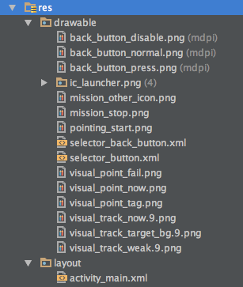
  
  Moreover, open the AndroidManifest.xml file and update the ".MainActivity" activity element with several attributes as shown below:
  
~~~xml
<activity
            android:name=".MainActivity"
            android:configChanges="orientation|screenSize"
            android:label="@string/title_activity_mainactivity"
            android:screenOrientation="landscape"
            android:theme="@android:style/Theme.NoTitleBar.Fullscreen" >
            <intent-filter>
                <action android:name="android.intent.action.MAIN" />

                <category android:name="android.intent.category.LAUNCHER" />
            </intent-filter>
</activity>
~~~
   
  Furthermore, open the "strings.xml" file in **values** folder and add the following string content:
  
~~~xml
 <string name="title_activity_mainactivity">P4MissionsDemo</string>
~~~

   Lastly, let's create a new xml file named "demo_ info_item.xml" in the layout folder by right-clicking on the "layout" folder and select **New->XML->Layout XML File**. Then replace the code of the file with the following:

~~~xml
<?xml version="1.0" encoding="utf-8"?>
<LinearLayout xmlns:android="http://schemas.android.com/apk/res/android"
    android:layout_width="match_parent"
    android:layout_height="match_parent"
    android:orientation="vertical" >
    
    <TextView
        android:id="@+id/title"
        android:layout_width="fill_parent"
        android:layout_height="wrap_content"
        android:textSize="22sp"
        android:layout_marginTop="6dp"
        android:layout_marginBottom="3dp"
        android:layout_marginLeft="10dp"
        android:text="demo title" />

     <TextView 
        android:id="@+id/desc"
        android:layout_width="fill_parent"
        android:layout_height="wrap_content"
        android:textSize="14sp"
        android:layout_marginBottom="6dp"
        android:layout_marginLeft="10dp"
        android:text="demo desc"
        android:textColor="@color/white"/>

</LinearLayout>
~~~

This xml file will help to setup the two TextViews with "title" and "desc" ids for the convertView of DemoListAdapter.

Now, if you check the activity_main.xml file, you can see the preview screenshot of MainActivity as shown below:
   
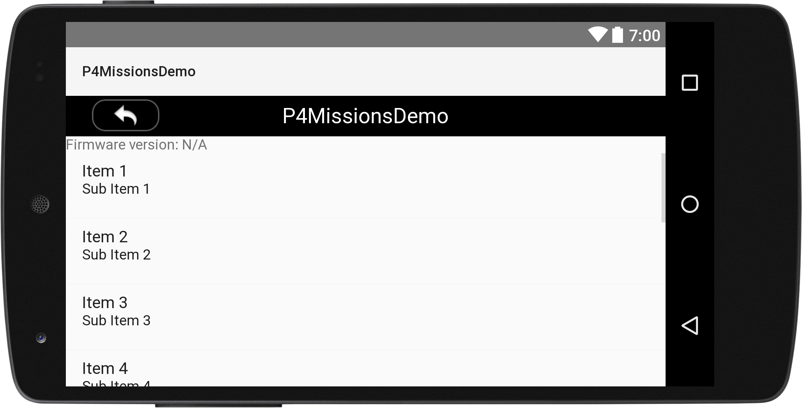

#### 4. Creating the PointingTestActivity

##### Implementing the PointingTestActivity Class

   Let's create a new Empty Activity class with the name of "PointingTestActivity" in the `com.dji.p4MissionsDemo` package. Replace the code with the following, remember to import the related classes as Android Studio suggested: 
  
~~~java
public class PointingTestActivity extends DemoBaseActivity implements TextureView.SurfaceTextureListener, View.OnClickListener {

    private static final String TAG = "PointingTestActivity";
    private ImageButton mPushDrawerIb;
    private SlidingDrawer mPushDrawerSd;
    private Button mStartBtn;
    private ImageButton mStopBtn;
    private TextView mPushTv;
    private RelativeLayout mBgLayout;
    private ImageView mRstPointIv;
    private TextView mAssisTv;
    private Switch mAssisSw;
    private TextView mSpeedTv;
    private SeekBar mSpeedSb;

    @Override
    protected void onCreate(Bundle savedInstanceState) {
        super.onCreate(savedInstanceState);
        setContentView(R.layout.activity_pointing_test);
        initUI();
    }

    @Override
    protected void onResume() {
        super.onResume();
    }

    @Override
    protected void onDestroy() {
        super.onDestroy();
    }

    private void initUI() {
        mPushDrawerIb = (ImageButton)findViewById(R.id.pointing_drawer_control_ib);
        mPushDrawerSd = (SlidingDrawer)findViewById(R.id.pointing_drawer_sd);
        mStartBtn = (Button)findViewById(R.id.pointing_start_btn);
        mStopBtn = (ImageButton)findViewById(R.id.pointing_stop_btn);
        mPushTv = (TextView)findViewById(R.id.pointing_push_tv);
        mBgLayout = (RelativeLayout)findViewById(R.id.pointing_bg_layout);
        mRstPointIv = (ImageView)findViewById(R.id.pointing_rst_point_iv);
        mAssisTv = (TextView)findViewById(R.id.pointing_assistant_tv);
        mAssisSw = (Switch)findViewById(R.id.pointing_assistant_sw);
        mSpeedTv = (TextView)findViewById(R.id.pointing_speed_tv);
        mSpeedSb = (SeekBar)findViewById(R.id.pointing_speed_sb);

        mPushDrawerIb.setOnClickListener(this);
        mStartBtn.setOnClickListener(this);
        mStopBtn.setOnClickListener(this);
        mSpeedSb.setOnSeekBarChangeListener(new SeekBar.OnSeekBarChangeListener() {
            @Override
            public void onProgressChanged(SeekBar seekBar, int progress, boolean fromUser) {
                mSpeedTv.setText(progress + 1 + "");
            }
            @Override
            public void onStartTrackingTouch(SeekBar seekBar) {
            }

            @Override
            public void onStopTrackingTouch(SeekBar seekBar) {
            }
        });
    }

    public void onReturn(View view){
        Log.d(TAG, "onReturn");
        this.finish();
    }

    @Override
    public void onClick(View v) {

        if (v.getId() == R.id.pointing_drawer_control_ib) {
            if (mPushDrawerSd.isOpened()) {
                mPushDrawerSd.animateClose();
            } else {
                mPushDrawerSd.animateOpen();
            }
            return;
        }
    }
}
~~~

 Here, we implement several features: 
 
**1.** Declare the UI member variables like ImageButton, TextView, SeekBar, etc. Then override the `onCreate()` method to invoke the `initUI()` method to initialize the UI elements of the Activity.

**2.** In the `initUI()` method, we create the member variables by invoking the `fineViewById()` method and passing the related id value declared in the associated layout xml file. Then call the `setOnClickListener()` method by assigning "this" to it for all the Button member variables. Next implement the SeekBar's `setOnSeekBarChangeListener()` method and override the three interface methods of OnSeekBarChangeListener. Here we update the text value of SeekBar in the `onProgresshanged()` method. 

**3.** Lastly, we override the `onClick()` method to implement the click action of the `mPushDrawerIb` ImageButton. When you press the `mPushDrawerIb`, it will add animations when open and close the `mPushDrawerSd`, which is a **SlidingDrawer**.

##### Working on PointingTestActivity Layout

  Open the colors.xml file in the **values** folder and replace the content with the following:
  
~~~xml
<?xml version="1.0" encoding="utf-8"?>
<resources>
    <color name="button_normal">#50808080</color>
    <color name="button_press">#5086BFFF</color>
    <color name="white">#FFFFFF</color>
    <color name="black">#000000</color>
</resources>
~~~
  Here, we add button press and normal colors, white and black colors.
  
  Moreover, add the two new string elements to the strings.xml file:
  
~~~xml
<string name="push_info">Push Info</string>
<string name="title_activity_pointing_test">TapFly Sample</string>
~~~

  Then, update the styles.xml with the following code:
  
~~~xml
<resources>
    <!--
        Base application theme, dependent on API level. This theme is replaced
        by AppBaseTheme from res/values-vXX/styles.xml on newer devices.
    -->
    

    <!-- Application theme. -->
    
    

</resources>
~~~
  
   Lastly, jump over to your associated layout in layout/activity_ pointing_test.xml and replace everything with the same xml file from the tutorial of the tutorial's Github Sample Project, since the xml file's content is too much, we don't show them here. 
   
   For the UI, we declare a main title, a return button, a connect status text view, a pointing button, etc. Here is a screenshot of the preview of PointingTestActivity:
   
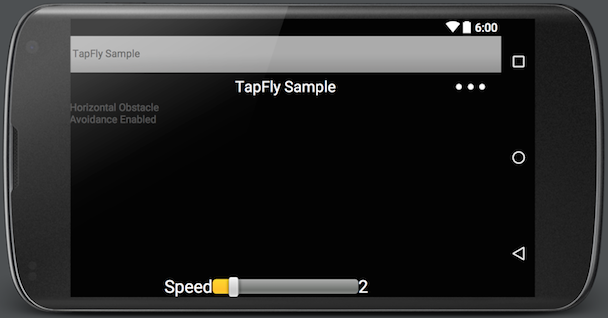
 
#### 5. Creating the TrackingTestActivity

##### Working on TrackingTestActivity Class

  Once you finish the steps above, let's create a new Empty Activity class with the name of "TrackingTestActivity" in the `com.dji.p4MissionsDemo` package. Replace the code with the following: 
  
~~~java
public class TrackingTestActivity extends DemoBaseActivity implements TextureView.SurfaceTextureListener, View.OnClickListener {

    private static final String TAG = "TrackingTestActivity";
    private ImageButton mPushDrawerIb;
    private SlidingDrawer mPushInfoSd;
    private ImageButton mStopBtn;
    private Button mConfirmBtn;
    private RelativeLayout mBgLayout;
    private TextView mPushInfoTv;
    private TextView mPushBackTv;
    private Switch mPushBackSw;
    private ImageView mSendRectIV;

    @Override
    protected void onCreate(Bundle savedInstanceState) {
        super.onCreate(savedInstanceState);
        setContentView(R.layout.activity_tracking_test);
        initUI();
    }

    private void initUI() {
        mPushDrawerIb = (ImageButton)findViewById(R.id.tracking_drawer_control_ib);
        mPushInfoSd = (SlidingDrawer)findViewById(R.id.tracking_drawer_sd);
        mStopBtn = (ImageButton)findViewById(R.id.tracking_stop_btn);
        mConfirmBtn = (Button)findViewById(R.id.tracking_confirm_btn);
        mBgLayout = (RelativeLayout)findViewById(R.id.tracking_bg_layout);
        mPushInfoTv = (TextView)findViewById(R.id.tracking_push_tv);
        mSendRectIV = (ImageView)findViewById(R.id.tracking_send_rect_iv);
        mPushBackSw = (Switch)findViewById(R.id.tracking_pull_back_sw);
        mPushBackTv = (TextView)findViewById(R.id.tracking_backward_tv);
        mStopBtn.setOnClickListener(this);
        mConfirmBtn.setOnClickListener(this);
        mPushDrawerIb.setOnClickListener(this);
    }

    public void onReturn(View view){
        Log.d(TAG, "onReturn");
        this.finish();
    }

    @Override
    public void onClick(View v) {
        switch (v.getId()) {
            case R.id.tracking_stop_btn:

                break;
            case R.id.tracking_confirm_btn:

                break;
            case R.id.tracking_drawer_control_ib:
                if (mPushInfoSd.isOpened()) {
                    mPushInfoSd.animateClose();
                } else {
                    mPushInfoSd.animateOpen();
                }
                break;
            default:
                break;
        }
    }
}
~~~

Here, we implement several features: 
 
**1.** Declare the UI member variables like ImageButton, SlidingDrawer, SeekBar, etc. Then override the `onCreate()` method to invoke the `initUI()` method to initialize the UI elements of the Activity.

**2.** In the `initUI()` method, we create the member variables by invoking the `fineViewById()` method and passing the related id value declared in the associated layout xml file. Then call the `setOnClickListener()` method by assigning "this" to it for all the Button member variables.

**3.** Lastly, we override the `onClick()` method to implement the click action of the `mStopBtn`, `mConfirmBtn` and `mPushDrawerIb` member variables. When you press the `mPushDrawerIb` ImageButton, it will add animation to open and close the `mPushInfoSd`.

Next, open the strings.xml file and add the following code:

~~~xml
    <string name="title_activity_tracking_test">ActiveTrack Sample</string>
    <string name="demo_desc_tracking">ActiveTrack Mission</string>
    <string name="demo_desc_pointing">TapFly Mission</string>
~~~

Finally, jump over to your associated layout in layout/activity_ tracking_test.xml and replace everything with the same xml file from the tutorial's Github Sample Project, since the xml file's content is a lot, we don't show them here. For more details, please check the related xml file from the Github Sample Project of the demo project.

For the UI, we declare a main title, a return button, a connect status text view, a TextureView to show live video stream, an ImageView to show the tracking rectangle, etc. Here is a screenshot of the preview of TrackingTestActivity:
   
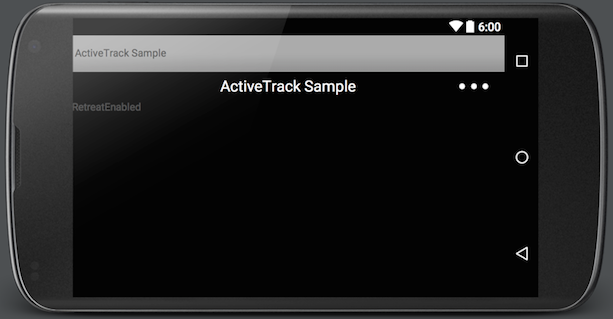

#### 6. Preview the UI of the Application

Now, let's open the dimens.xml file and replace the code with the following:

~~~xml
<?xml version="1.0" encoding="utf-8"?>
<resources>
    <!-- left button list -->
    <dimen name="left_button_list_button_width">150dp</dimen>
    <dimen name="left_button_list_button_height">45dp</dimen>
    <dimen name="left_button_list_button_padding_left">5dp</dimen>
    <dimen name="left_button_list_button_padding_right">5dp</dimen>
    <dimen name="left_button_list_button_margin_left">10dp</dimen>
    <dimen name="left_button_list_button_margin_top">10dp</dimen>
    <dimen name="left_button_list_button_text_size">14sp</dimen>
    
    <dimen name="test_log_textsize">17sp</dimen>
</resources>
~~~

Next, open the AndroidManifest.xml file and modify the **.PointingTestActivity** and **.TrackingTestActivity** elements as shown below:

~~~xml
    <activity
        android:name=".TrackingTestActivity"
        android:label="@string/title_activity_tracking_test"
        android:launchMode="singleInstance"
        android:screenOrientation="landscape"
        android:theme="@android:style/Theme.Holo.NoActionBar.Fullscreen" >
    </activity>
    <activity
        android:name=".PointingTestActivity"
        android:label="@string/title_activity_pointing_test"
        android:launchMode="singleInstance"
        android:screenOrientation="landscape"
        android:theme="@android:style/Theme.Holo.NoActionBar.Fullscreen" >
    </activity>
~~~

In the code above, we modify the label, launchMode, screenOrientation and theme attributes for the two Activities.

We have gone through a long process to setup the UI of the application. Now, let's build and run the project and install it in your Android device to test it. Here we use Nexus 5 for testing. If everything goes well, you should see the following gif animation of the application:

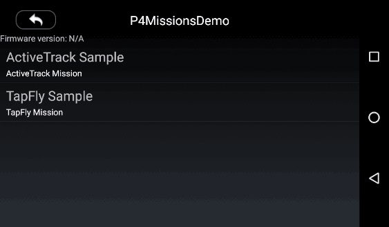

### Registering the Application

After you finish the above steps, let's register our application with the **App Key** you apply from DJI Developer Website. If you are not familiar with the App Key, please check the [Get Started](../quick-start/index.html).

**1.** Let's open the AndroidManifest.xml file and add the following elements to it:

~~~xml
    <uses-permission android:name="android.permission.BLUETOOTH" />
    <uses-permission android:name="android.permission.BLUETOOTH_ADMIN" />
    <uses-permission android:name="android.permission.VIBRATE" />
    <uses-permission android:name="android.permission.INTERNET" />
    <uses-permission android:name="android.permission.ACCESS_WIFI_STATE" />
    <uses-permission android:name="android.permission.WAKE_LOCK" />
    <uses-permission android:name="android.permission.ACCESS_COARSE_LOCATION" />
    <uses-permission android:name="android.permission.ACCESS_NETWORK_STATE" />
    <uses-permission android:name="android.permission.ACCESS_FINE_LOCATION" />
    <uses-permission android:name="android.permission.CHANGE_WIFI_STATE" />
    <uses-permission android:name="android.permission.MOUNT_UNMOUNT_FILESYSTEMS" />
    <uses-permission android:name="android.permission.WRITE_EXTERNAL_STORAGE" />
    <uses-permission android:name="android.permission.READ_EXTERNAL_STORAGE" />
    <uses-permission android:name="android.permission.SYSTEM_ALERT_WINDOW" />
    <uses-permission android:name="android.permission.READ_PHONE_STATE" />

    <uses-feature android:name="android.hardware.camera" />
    <uses-feature android:name="android.hardware.camera.autofocus" />
    <uses-feature
        android:name="android.hardware.usb.host"
        android:required="false" />
    <uses-feature
        android:name="android.hardware.usb.accessory"
        android:required="true" />
~~~

Here, we add uses permissions and uses features for the app. They are required for registeration.

Then add the following elements above the **MainActivity** activity element:

~~~xml
<!-- DJI SDK -->
        <uses-library android:name="com.android.future.usb.accessory" />
        <meta-data
            android:name="com.dji.sdk.API_KEY"
            android:value="Please enter your App Key here." />
        <activity
            android:name="dji.sdk.sdkmanager.DJIAoaControllerActivity"
            android:theme="@android:style/Theme.Translucent" >
            <intent-filter>
                <action android:name="android.hardware.usb.action.USB_ACCESSORY_ATTACHED" />
            </intent-filter>
            <meta-data
                android:name="android.hardware.usb.action.USB_ACCESSORY_ATTACHED"
                android:resource="@xml/accessory_filter" />
        </activity>
        <service android:name="dji.sdk.sdkmanager.DJIGlobalService" >
        </service>
<!-- DJI SDK -->
~~~

In the code above, we enter the **App Key** of the application under the `android:name="com.dji.sdk.API_KEY"` attribute. For more details of the AndroidManifest.xml file, please check the Github source code of the demo project.

**2.** After you finish the steps above, open the DJIDemoApplication.java file and replace the code with the same file in the Github Source Code, here we explain the important parts of it:

~~~java
@Override
public void onCreate() {
    super.onCreate();
    mHandler = new Handler(Looper.getMainLooper());
    DJISDKManager.getInstance().initSDKManager(this, mDJISDKManagerCallback);
}
    
private DJISDKManager.DJISDKManagerCallback mDJISDKManagerCallback = new DJISDKManager.DJISDKManagerCallback() {
    @Override
    public void onGetRegisteredResult(DJIError error) {
        Log.d(TAG, error == null ? "Success" : error.getDescription());
        if(error == DJISDKError.REGISTRATION_SUCCESS) {
            DJISDKManager.getInstance().startConnectionToProduct();
            Handler handler = new Handler(Looper.getMainLooper());
            handler.post(new Runnable() {
                @Override
                public void run() {
                    Toast.makeText(getApplicationContext(), "Success", Toast.LENGTH_LONG).show();
                }
            });
        } else {
            Handler handler = new Handler(Looper.getMainLooper());
            handler.post(new Runnable() {
                @Override
                public void run() {
                    Toast.makeText(getApplicationContext(), "register sdk fails, check network is available", Toast.LENGTH_LONG).show();
                }
            });
        }
        Log.e("TAG", error.toString());
    }

    @Override
    public void onProductChanged(DJIBaseProduct oldProduct, DJIBaseProduct newProduct) {
        mProduct = newProduct;
        if(mProduct != null) {
            mProduct.setDJIBaseProductListener(mDJIBaseProductListener);
        }
        notifyStatusChange();
    }
};
~~~

  Here, we implement several features:
  
1. We override the `onCreate()` method to initialize the DJISDKManager.
2. Implement the two interface methods of DJISDKManagerCallback. You can use the `onGetRegisteredResult()` method to check the Application registration status and show text message here. Using the `onProductChanged()` method, we can check the product connection status and invoke the `notifyStatusChange()` method to notify status changes.

Now let's build and run the project and install it to your Android device. If everything goes well, you should see the "success" textView like the following screenshot when you register the app successfully.

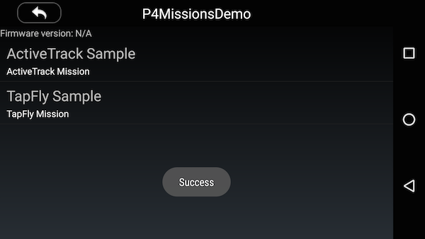

> **Important:** Please check if the "armeabi-v7a", "arm64-v8a" and "x86" lib folders has been added to your jnLibs folder in **dJISDKLib** successfully before testing resgistering the app. 
> 
> 

## Coordinate Transformations for Missions

Before we dive into the implementation of two missions, let's learn something about the special coordinate transformations of them.

### TapFly Mission Coordinate Transformation

If we check the **DJITapFlyMission.DJITapFlyMissionProgressStatus** class, you can see the following two public methods:

~~~java

public DJIVector getDirection ()
public PointF getImageLocation ()

~~~

**1.** The `getDirection ()` method returns a DJIVector object, which represents a cartesian vector in 3D space. You can get the actual flying direction of the aircraft using the N-E-D(North-East-Down) coordinate system when the aircraft is executing a TapFly mission.

**2.** The `getImageLocation ()` method returns a PointF object, which represents the image point from the live video stream where the vision system should calculate the flight direction from. The image point is normalized to [0,1] where (0,0) is the top left corner and (1,1) is the bottom right.

Here is a diagram to show the coordinate transformation of the mission:

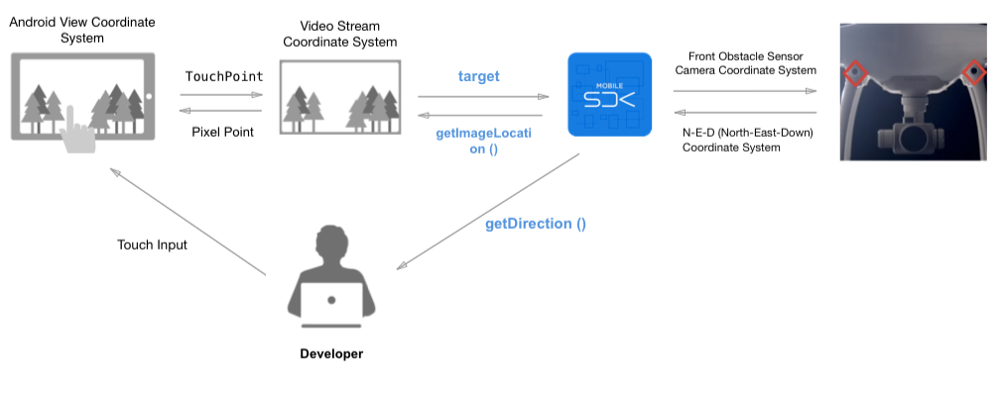

As the diagram shown above, you can see the process of transformation.

- The `imageLocationToCalculateDirection` object shown above is transformed from TouchPoint (PointF) to a Video Stream Coordinate System PointF.

- The `getDirection()` method shown above belongs to the **N-E-D (North-East-Down) Coordinate System** and you can invoke this method to get the field value from the SDK.

- The `imageLocation()` method shown above belongs to the **Video Stream Coordinate System** and you can invoke this method to get the field value from the SDK.

So in our demo application, in order to implement the TapFly mission, we should transform the user's touch location (A PointF object) of Android View Coordinate System into the image location (A PointF object) of Video Stream Coordination System and pass it to the following `imageLocationToCalculateDirection` object of DJITapFlyMission:

~~~java
/**
 *  The image point from the video feed where the vision system should calculate the flight direction from. The image point is normalized to [0,1] where (0,0) is the top left corner and (1,1) is the bottom right.
 */
public PointF imageLocationToCalculateDirection
~~~

### ActiveTrack Mission Coordinate Transformation

Next, let's check the **DJIActiveTrackMission.DJIActiveTrackMissionProgressStatus** class, you may see the following public getter method:

~~~java
public RectF getTrackingRect()
~~~

Check the **DJIActiveTrackMission** class, you can also see this object:

~~~java
public RectF rect
~~~

**1.** You can invoke the `trackingRect ()` method to get a RectF object which is a rectangle in the live video stream view image that represents the target being tracked. The rectangle is normalized to [0,1] where (0,0) is the top left of the video preview and (1,1) is the bottom right.

**2.** The `rect` object is a RectF class object, it represents a bounding box for the target. The rectangle is normalized to [0,1] where (0,0) is the top left of the video preview and (1,1) is the bottom right.

   If the mission is initialized with a PointF object, the vision system will try to recognize object around the point and return the representative rect in the MissionProgressStatusCallback.
   
   Here is a diagram to show the coordinate transformation of the ActiveTrack mission:

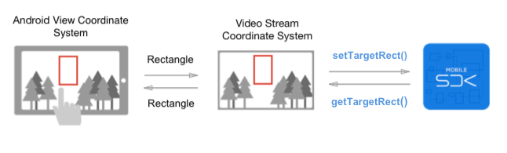

As the diagram shown above, you can see the process of transformation. 

- The `getTrackingRect()` method and `rect` object shown above belongs to the **Video Stream Coordinate System**.

So in order to implement the ActiveTrack Mission, we should transform the user's touch rect (A RectF object) of Android View Coordinate System into the tracking rect (A RectF object) of Video Stream Coordination System and pass it to the `rect` object of DJIActiveTrackMission. You can get the tracking rect object by invoking the `getTrackingRect()` method of SDK. And you can use it to update the rectangle on your screen.

## Implementing the TapFly Mission

### Updating the DemoBaseActivity

Before we implement the TapFly Mission, we should update the DemoBaseActivity.java class to configure the live video streaming feature. Let's open the file and add the following codes to it:

~~~java

protected TextureView mVideoSurface = null;
protected CameraReceivedVideoDataCallback mReceivedVideoDataCallBack = null;
protected DJIOnReceivedVideoCallback mOnReceivedVideoCallback = null;
protected DJICodecManager mCodecManager = null;

@Override
protected void onCreate(Bundle savedInstanceState) {
    super.onCreate(savedInstanceState);
     
    IntentFilter filter = new IntentFilter();  
    filter.addAction(DJIDemoApplication.FLAG_CONNECTION_CHANGE);
    registerReceiver(mReceiver, filter);

    mVideoSurface = (TextureView) findViewById(R.id.video_previewer_surface);
    
    if (null != mVideoSurface) {
        mVideoSurface.setSurfaceTextureListener(this);
        
        mConnectStatusTextView = (TextView) findViewById(R.id.ConnectStatusTextView);

        mReceivedVideoDataCallBack = new CameraReceivedVideoDataCallback() {

            @Override
            public void onResult(byte[] videoBuffer, int size) {
                if(mCodecManager != null){
                    mCodecManager.sendDataToDecoder(videoBuffer, size);
                }
            }
        };
    }
    initPreviewer();
}
~~~

 Here we declare a TextureView(`mVideoSurface` object) to show the live video stream data. We use the `video_previewer_surface` id from its layout xml file to create the object. This id should be the same as PointingTestActivity and TrackingTestActivity's layout settings. Then create the callback variable `mReceivedVideoDataCallBack` to implement the DJICamera's interface methods for receiving video data.
 
 Moreover, we implement the `initPreviewer()` method as shown below to check product connection status and set the DJICameraReceivedVideoDataCallback method to DJICamera  object:
 
~~~java
 private void initPreviewer() {
        try {
            mProduct = DJIDemoApplication.getProductInstance();
        } catch (Exception exception) {
            mProduct = null;
        }
        
        if (null == mProduct || !mProduct.isConnected()) {
            mCamera = null;
            showToast("Disconnect");
        } else {
            if (!mProduct.getModel().equals(Model.UnknownAircraft)) {
                mCamera = mProduct.getCamera();
                if (mCamera != null){
                    mCamera.setDJICameraReceivedVideoDataCallback(mReceivedVideoDataCallBack);
                }
            }
        }
    }
~~~

### Working on the PointingTestActivity

#### Showing the Live Video Stream

  Now let's come back to the PointingTestActivity.java class and override the `onCreate()` method firstly:
  
~~~java
@Override
protected void onCreate(Bundle savedInstanceState) {

    setContentView(R.layout.activity_pointing_test);
    super.onCreate(savedInstanceState);
    initUI();
}
~~~

  In the method shown above, we invoke the `setContentView()` method firstly to show the PointingTestActivity view. Then invoke the DemoBaseActivity class's `onCreate()` method to implement the live video stream showing methods. Lastly, invoke the `initUI()` to initialize all the UI elements.
    
#### Working on the TapFly Mission

Before we start to create the DJITapFlyMission object, let's check the three member variables we can set for each DJITapFlyMission:

**1.** AutoFlightSpeed

You can set the aircraft's auto flight speed during the mission by setting this member variable for DJITapFlyMission. The range for it is [1, 10] m/s.

**2.** IsHorizontalObstacleAvoidanceEnabled

If you want to allow the aircraft to bypass or move around an obstacle by going to the left or right of the obstacle when executing TapFly mission, you can set this member variable to YES. Otherwise, the aircraft will only go over an obstacle to avoid it.

**3.** ImageLocationToCalculateDirection

This is where we should pass the coordinate transformation PointF object to, we can use the `getTapFlyPoint()` method to do the coordinate transformation and return the PointF object. It's the image point from the video feed where the vision system should calculate the flight direction from.

##### Prepare Mission

**1.** Firslty, let's implement the `initMissionManager()` method to initialize the `mMissionManager` and `mTapFlyMission` variables. Also, we set MissionProgressStatusCallback and MissionExecutionFinishedCallback of DJIMissionManager to `this`:
   
~~~java
private void initMissionManager() {
    DJIBaseProduct product = DJIDemoApplication.getProductInstance();
    
    if (product == null || !product.isConnected()) {
        setResultToToast("Disconnected");
        mMissionManager = null;
    } else {
        mMissionManager = product.getMissionManager();
        mMissionManager.setMissionProgressStatusCallback(this);
        mMissionManager.setMissionExecutionFinishedCallback(this);
    }
    mTapFlyMission = new DJITapFlyMission();
}
~~~
   
**2.** Next, implement the following two methods to manage the mission coordinate transformations:

~~~java
private PointF getTapFlyPoint(View iv) {
    if (iv == null) return null;
    View parent = (View)iv.getParent();
    float centerX = iv.getLeft() + iv.getX()  + ((float)iv.getWidth()) / 2;
    float centerY = iv.getTop() + iv.getY() + ((float)iv.getHeight()) / 2;
    centerX = centerX < 0 ? 0 : centerX;
    centerX = centerX > parent.getWidth() ? parent.getWidth() : centerX;
    centerY = centerY < 0 ? 0 : centerY;
    centerY = centerY > parent.getHeight() ? parent.getHeight() : centerY;
    
    return new PointF(centerX / parent.getWidth(), centerY / parent.getHeight());
}
    
private void showPointByTapFlyPoint(final PointF point, final ImageView iv) {
    if (point == null || iv == null) {
        return;
    }
    final View parent = (View)iv.getParent();
     PointingTestActivity.this.runOnUiThread(new Runnable() {

         @Override
         public void run() {
             iv.setX(point.x * parent.getWidth() - iv.getWidth() / 2);
             iv.setY(point.y * parent.getHeight() - iv.getHeight() / 2);
             iv.setVisibility(View.VISIBLE);
             iv.requestLayout();
         }
     });
}
~~~
   
   We can use the `getTapFlyPoint()` method to transform the tap point position of Android View coordinate system to the video stream coordinate system. In contrast, we use the `showPointByTapFlyPoint()` method to transform the tap point position(We use `mRstPointIv` to represent it) from video stream coordinate system back to the Android View coordinate system and show it on screen.

**3.** Moreover, let's override the `onTouch()` method to track the ACTION_UP gesture of MotionEvent:

~~~java

@Override
public boolean onTouch(View v, MotionEvent event) {
    if (v.getId() == R.id.pointing_bg_layout) {
        
        switch (event.getAction()) {
        case MotionEvent.ACTION_UP:
            if (mMissionManager != null) {
                mStartBtn.setVisibility(View.VISIBLE);
                mStartBtn.setX(event.getX() - mStartBtn.getWidth() / 2);
                mStartBtn.setY(event.getY() - mStartBtn.getHeight() / 2);
                mStartBtn.requestLayout();
                mTapFlyMission.imageLocationToCalculateDirection = getTapFlyPoint(mStartBtn);
                mMissionManager.prepareMission(mTapFlyMission, null, new DJICompletionCallback() {

                    @Override
                    public void onResult(DJIError error) {
                        if (error == null) {
                            setVisible(mStartBtn, true);
                        } else {
                            setVisible(mStartBtn, false);
                        }
                        setResultToToast(error == null ? "Success" : error.getDescription());
                    }
                });
            } else {
                setResultToToast("Mission manager is null");
            }
            break;

        default:
            break;
        }
    }
    return true;
}
    
~~~

Here, we update the `mStartBtn`'s position to the position user press. Then we invoke the `getTapFlyPoint()` method to do the coordinate transformation and pass it to DJITapFlyMission's `imageLocationToCalculateDirection` member variable. Lastly, invoke the `prepareMission()` method of DJIMissionManager to prepare the DJITapFlyMission.

##### Start and Stop Mission

Next, let's override the `onClick()` method to implement the click action of `mStartBtn` and `mStopBtn` buttons to start and stop the DJITapFlyMission:

~~~java
    @Override
    public void onClick(View v) {
        if (v.getId() == R.id.pointing_drawer_control_ib) {
            if (mPushDrawerSd.isOpened()) {
                mPushDrawerSd.animateClose();
            } else {
                mPushDrawerSd.animateOpen();
            }
            return;
        }
        if (mMissionManager != null) {
            switch (v.getId()) { 
            case R.id.pointing_start_btn:
                mTapFlyMission.autoFlightSpeed = getSpeed();
                mTapFlyMission.isHorizontalObstacleAvoidanceEnabled = mAssisSw.isChecked();
                mMissionManager.startMissionExecution(new DJICompletionCallback() {
                    @Override
                    public void onResult(DJIError error) {
                        if (error == null) {
                            setVisible(mStartBtn, false);
                            setVisible(mStopBtn, true);
                            setVisible(mAssisTv, false);
                            setVisible(mAssisSw, false);
                        } else {
                            setVisible(mStartBtn, true);
                            setVisible(mStopBtn, false);
                            setVisible(mAssisTv, true);
                            setVisible(mAssisSw, true);
                        }
                        setResultToToast("Start: " + (error == null ? "Success" : error.getDescription()));
                    }
                });
                break;
            case R.id.pointing_stop_btn:
                mMissionManager.stopMissionExecution(new DJICompletionCallback() {

                    @Override
                    public void onResult(DJIError error) {
                        setResultToToast("Stop: " + (error == null ? "Success" : error.getDescription()));
                    } 
                });
                break; 
 
            default:
                break;
            }
        } else {
            setResultToToast("Mission manager is null");
        }
    }
~~~

In the code above, we use a switch statement to identify the `mStartBtn` and `mStopBtn` buttons' click action. In the 'mStartBtn' click action case, firstly set the `autoFlightSpeed` and `isHorizontalObstacleAvoidanceEnabled` member variables of DJITapFlyMission. Then we invoke the `startMissionExecution()` method of DJIMissionManager to start the mission and update the visibilities of buttons. 

In the `mStopBtn` click action case, we invoke the `stopMissionExecution()` method of DJIMissionManager to stop the DJITapFlyMission.

##### MissionManager Callback

Finally, let's override the two Mission Manager's callback methods:

~~~java
    /**
     * @Description : MissionExecutionFinishedCallback Method
     */
    @Override
    public void onResult(DJIError error) {
        setResultToText("Execution finished: " + (error == null ? "Success!" : error.getDescription()));
        setResultToToast("Execution finished: " + (error == null ? "Success!" : error.getDescription()));
        setVisible(mRstPointIv, false);
        setVisible(mStopBtn, false);
        setVisible(mAssisTv, true);
        setVisible(mAssisSw, true);
    }

    /**
     * @Description MissionProgressStatusCallback Method
     */
    @Override
    public void missionProgressStatus(DJIMissionProgressStatus progressStatus) {
        if (progressStatus instanceof DJITapFlyMissionProgressStatus) {
            DJITapFlyMissionProgressStatus pointingStatus = (DJITapFlyMissionProgressStatus)progressStatus;
            StringBuffer sb = new StringBuffer();
            Utils.addLineToSB(sb, "Flight state", pointingStatus.getExecutionState().name());
            Utils.addLineToSB(sb, "pointing direction X", pointingStatus.getDirection().x);
            Utils.addLineToSB(sb, "pointing direction Y", pointingStatus.getDirection().y);
            Utils.addLineToSB(sb, "pointing direction Z", pointingStatus.getDirection().z);
            Utils.addLineToSB(sb, "point x", pointingStatus.getImageLocation().x);
            Utils.addLineToSB(sb, "point y", pointingStatus.getImageLocation().y);
            Utils.addLineToSB(sb, "Bypass state", pointingStatus.getBypassDirection().name());
            Utils.addLineToSB(sb, "Error", pointingStatus.getError());
            setResultToText(sb.toString());
            showPointByTapFlyPoint(pointingStatus.getImageLocation(), mRstPointIv);
        }
    }
~~~

  When the mission finish executing, the `onResult()` callback method will be called, and we can update the UI and show result here. Moreover, we can use the `missionProgressStatus()` callback method to update the mission progress status by showing logs on `mPushTv` TextView and update the `mRstPointIv` location on screen.
  
  BTW, you may notice the `addLineToSB()` method of Tools class here, we should then create a new Java class, named "Utils.java" and replace the code of the file with the same file in Github Source code of this demo project.
  
  For more implementation details of the PointingTestActivity.java file, please check the Github source code. 

Now let's build and run the project to install the app to your Android device, if everything goes well, you should be able to use the TapFly mission of Phantom 4 now.

>**Important**: Remember to switch the remote controller to **P** mode before you test the TapFly mission.
 
   Here are two gif animations for you to get a better understanding of using the TapFly mission, especially the **Horizontal Obstacle Avoidance** feature:

-  Enable Horizontal Obstacle Avoidance

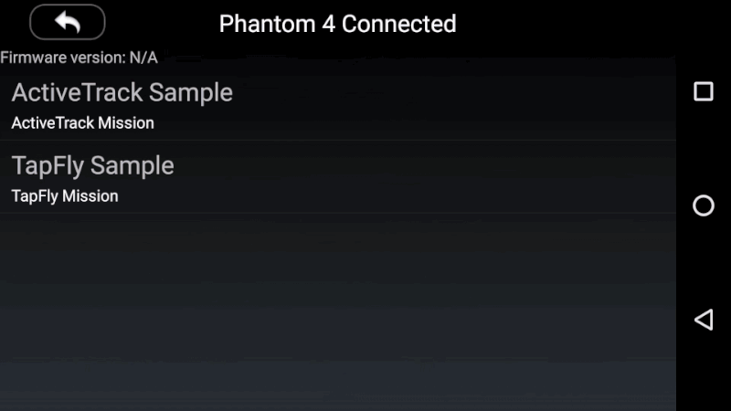

   In the animation, you can see there are two flat surface obstacles stand towards the Phantom 4. We tap on the right obstacle and ask the Phantom 4 to fly towards it. With the help of the front obstacle sensors, Phantom 4 won't hit the obstacle and crash. You may notice that we switch on the "Horizontal Obstacle Avoidance Enable" before the TapFly mission start. 
   
   Press the **GO** button, Phantom 4 will start to fly towards it. When flying close to the obstacle, the Obstacle Sensing System will help to adjust the aircraft's attitude and fly towards the left side of it. 
 
-  Disable Horizontal Obstacle Avoidance

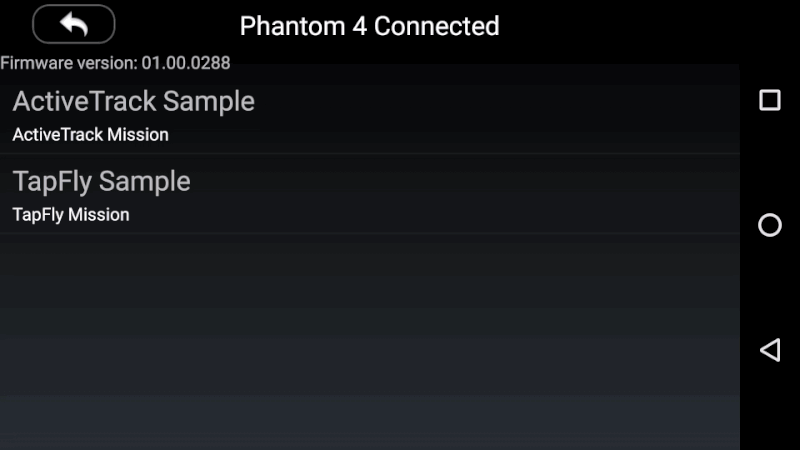

   If we switch off the "Horizontal Obstacle Avoidance Enable", when the Phantom 4 fly close to the obstacle, it will rise to avoid the obstacle and continue to fly towards the origin direction. When you want to stop the mission, just press the **X** button, Phantom 4 will stop immediately and hover there.

## Implementing ActiveTrack Mission

### Working on the TrackingTestActivity

#### Showing the Live Video Stream

  Now let's go to TrackingTestActivity.java class and override the `onCreate()` method firstly:
  
~~~java
    @Override
    protected void onCreate(Bundle savedInstanceState) {
        setContentView(R.layout.activity_tracking_test);
        super.onCreate(savedInstanceState);
        initUI();
    }
~~~

  In the method shown above, we invoke the `setContentView()` method firstly to show the TrackingTestActivity view. Then invoke the DemoBaseActivity class's `onCreate()` method to implement the live video stream showing methods. Lastly, invoke the `initUI()` to initialize all the UI elements.
    
#### Working on the ActiveTrack Mission

##### Prepare and Start Mission

**1.** Now, let's implement the `initMissionManager()` method to initialize the `mMissionManager` variable. Also, we set MissionProgressStatusCallback and MissionExecutionFinishedCallback of DJIMissionManager to `this`:

~~~java
    private void initMissionManager() {
        DJIBaseProduct product = DJIDemoApplication.getProductInstance();

        if (product == null || !product.isConnected()) {
            setResultToToast("Disconnected");
            mMissionManager = null;
        } else {
            mMissionManager = product.getMissionManager();
            mMissionManager.setMissionProgressStatusCallback(this);
            mMissionManager.setMissionExecutionFinishedCallback(this);
        }
    }
~~~
   
**2.** Next, implement the following two methods to manage the mission coordinate transformations:

   We can use the `getActiveTrackRect()` method to transform the tracking rectangle of Android View coordinate system to the video stream coordinate system. In contrast, we use the `updateActiveTrackRect()` method to transform the tracking rectangle (We use `mConfirmBtn` to represent it) from video stream coordinate system back to the Android View coordinate system and show it on screen.
   
~~~java
private RectF getActiveTrackRect(View iv) {
        View parent = (View)iv.getParent();
        return new RectF(
                ((float)iv.getLeft() + iv.getX()) / (float)parent.getWidth(),
                ((float)iv.getTop() + iv.getY()) / (float)parent.getHeight(),
                ((float)iv.getRight() + iv.getX()) / (float)parent.getWidth(),
                ((float)iv.getBottom() + iv.getY()) / (float)parent.getHeight()
        );
    }

    private void updateActiveTrackRect(final TextView iv, final DJIActiveTrackMissionProgressStatus progressStatus) {
        if (iv == null || progressStatus == null) return;
        View parent = (View)iv.getParent();
        RectF trackingRect = progressStatus.getTrackingRect();

        final int l = (int)((trackingRect.centerX() - trackingRect.width() / 2) * parent.getWidth());
        final int t = (int)((trackingRect.centerY() - trackingRect.height() / 2) * parent.getHeight());
        final int r = (int)((trackingRect.centerX() + trackingRect.width() / 2) * parent.getWidth());
        final int b = (int)((trackingRect.centerY() + trackingRect.height() / 2) * parent.getHeight());

        TrackingTestActivity.this.runOnUiThread(new Runnable() {

            @Override
            public void run() {
                if (progressStatus.getExecutionState() == DJIActiveTrackMissionExecutionState.TrackingWithLowConfidence ||
                        progressStatus.getExecutionState() == DJIActiveTrackMissionExecutionState.CannotContinue) {
                    iv.setBackgroundColor(0x55ff0000);
                    iv.setClickable(false);
                    iv.setText("");
                } else if (progressStatus.getExecutionState() == DJIActiveTrackMissionExecutionState.WaitingForConfirmation) {
                    iv.setBackgroundColor(0x5500ff00);
                    iv.setClickable(true);
                    iv.setText("OK");
                } else {
                    iv.setBackgroundResource(R.drawable.visual_track_now);
                    iv.setClickable(false);
                    iv.setText("");
                }
                if (progressStatus.getExecutionState() == DJIActiveTrackMissionExecutionState.TargetLost) {
                    iv.setVisibility(View.INVISIBLE);
                } else {
                    iv.setVisibility(View.VISIBLE);
                }
                iv.setX(l);
                iv.setY(t);
                iv.getLayoutParams().width = r - l;
                iv.getLayoutParams().height = b - t;
                iv.requestLayout();
            }
        });

    }
~~~

  In the implementation of `updateActiveTrackRect()` method, we can use the `getExecutionState()` method of DJIActiveTrackMissionProgressStatus to get the mission execution state and update the UI and tracking rectangle's location. Here is the details of the state:
  
- **CannotContinue** :  Used when tracking cannot continue for reasons other than low confidence. 

- **TargetLost** :  The tracking target is lost. 

- **Tracking** :  The ActiveTrack Mission is tracking a target.

- **TrackingWithLowConfidence** :  The ActiveTrack Mission is tracking a target with low confidence. 

- **Unknown** :  Unknown state. 

- **WaitingForConfirmation** :  At the start of a mission, when a mission is resumed or anytime the aircraft looses sufficient confidence the target it is tracking, the aircraft will ask for confirmation that it is tracking the correct object. 

**3.** The Phantom 4's ActiveTrack Mission can track both moving subjects and humans.

- Track Moving Subjects

  For moving subjests, you need to provide a RectF object of tracking rectangle to the DJIActiveTrackMission method's `RectF` parameter.
  
~~~java
  DJIActiveTrackMission activeTrackMission = new DJIActiveTrackMission(getActiveTrackRect(mSendRectIV));
~~~
  
- Track Humans

  For humans, you can provide a PointF object of tracking point to the DJIActiveTrackMission method's `PointF` parameter. Like you can tap on the human on your Android's screen.
  
~~~java
  DJIActiveTrackMission activeTrackMission = new DJIActiveTrackMission(new PointF(downX / mBgLayout.getWidth(), downY / mBgLayout.getHeight());
~~~

Moreover, let's override the `onTouch()` method to track the ACTION_DOWN, ACTION_MOVE and ACTION_UP gestures of MotionEvent:

~~~java
@Override
    public boolean onTouch(View v, MotionEvent event) {

        switch (event.getAction()) {
            case MotionEvent.ACTION_DOWN:
                isDrawingRect = false;
                downX = event.getX();
                downY = event.getY();
                break;
            case MotionEvent.ACTION_MOVE:
                if (calcManhattanDistance(downX, downY, event.getX(), event.getY()) < 20 && !isDrawingRect) {
                    return true;
                }
                isDrawingRect = true;
                mSendRectIV.setVisibility(View.VISIBLE);
                int l = (int)(downX < event.getX() ? downX : event.getX());
                int t = (int)(downY < event.getY() ? downY : event.getY());
                int r = (int)(downX >= event.getX() ? downX : event.getX());
                int b = (int)(downY >= event.getY() ? downY : event.getY());
                mSendRectIV.setX(l);
                mSendRectIV.setY(t);
                mSendRectIV.getLayoutParams().width = r - l;
                mSendRectIV.getLayoutParams().height = b - t;
                mSendRectIV.requestLayout();
                break;

            case MotionEvent.ACTION_UP:
                if (mMissionManager != null) {
                    DJIActiveTrackMission activeTrackMission = isDrawingRect ? new DJIActiveTrackMission(getActiveTrackRect(mSendRectIV)) : new DJIActiveTrackMission(new PointF(downX / mBgLayout.getWidth(), downY / mBgLayout.getHeight()));
                    activeTrackMission.isRetreatEnabled = mPushBackSw.isChecked();
                    mMissionManager.prepareMission(activeTrackMission, null, new DJICompletionCallback() {
                        @Override
                        public void onResult(DJIError error) {
                            if (error == null) {
                                mMissionManager.startMissionExecution(new DJICompletionCallback() {
                                    @Override
                                    public void onResult(final DJIError error) {
                                        TrackingTestActivity.this.runOnUiThread(new Runnable() {
                                            @Override
                                            public void run() {
                                                if (error == null) {
                                                    mStopBtn.setVisibility(View.VISIBLE);
                                                    mPushBackSw.setVisibility(View.INVISIBLE);
                                                    mPushBackTv.setVisibility(View.INVISIBLE);
                                                }
                                            }
                                        });
                                        setResultToToast("Start: " + (error == null ? "Success" : error.getDescription()));
                                    }
                                });
                            } else {
                                setResultToToast("Prepare: " + (error == null ? "Success" : error.getDescription()));
                            }
                        }
                    });
                } else {
                    setResultToToast("No mission manager!!!");
                }
                mSendRectIV.setVisibility(View.INVISIBLE);
                break;
            default:
                break;
        }

        return true;
    }
~~~

Here, we update the `mSendRectIV`'s size and position according to the user's drawing position on the screen. Then when the user trigger the ACTION_UP gesture, we create the DJIActiveTrackMission object based on the `isDrawingRect` bool variable.

We invoke the `getActiveTrackRect()` method to do the coordinate transformation and pass the RectF to `DJIActiveTrackMission()` method. Also, we pass the `mPushBackSw`'s isChecked() value to the `isRetreatEnabled` member variable of DJIActiveTrackMission to control the retreat feature.

Lastly, invoke the `prepareMission()` method of DJIMissionManager to prepare the DJIActiveTrackMission.

##### Stop Mission

Next, let's override the `onClick()` method to implement the click action features of `mPushDrawerIb`, `mStopBtn` and `mConfirmBtn` buttons.

~~~java
    @Override
    public void onClick(View v) {
        switch (v.getId()) {
            case R.id.tracking_stop_btn:
                mMissionManager.stopMissionExecution(new DJICompletionCallback() {
                    @Override
                    public void onResult(DJIError error) {
                        setResultToToast(error == null ? "Success!" : error.getDescription());
                    }
                });
                break;
            case R.id.tracking_confirm_btn:
                DJIActiveTrackMission.acceptConfirmation(new DJICompletionCallback() {
                    @Override
                    public void onResult(DJIError error) {
                        setResultToToast(error == null ? "Success!" : error.getDescription());
                    }
                });
                break;
            case R.id.tracking_drawer_control_ib:
                if (mPushInfoSd.isOpened()) {
                    mPushInfoSd.animateClose();
                } else {
                    mPushInfoSd.animateOpen();
                }
                break;
            default:
                break;
        }
    }
~~~

In the code above, we use a switch statement to identify the `mPushDrawerIb`, `mStopBtn` and `mConfirmBtn` buttons' click action. In the `mStopBtn` click action case, we invoke the `stopMissionExecution()` method of DJIMissionManager to stop the mission and show result. 

In the `mConfirmBtn` click action case, we invoke the `acceptConfirmation()` method of DJIMissionManager to accept the confirmation of the tracking rectangle.

##### MissionManager Callback

Finally, let's override the two Mission Manager's callback methods:

~~~java
    /**
     * @Description : MissionExecutionFinishedCallback Method
     */
    @Override
    public void onResult(DJIError error) {
        setResultToText("Execution finished: " + (error == null ? "Success!" : error.getDescription()));
        setResultToToast("Execution finished: " + (error == null ? "Success!" : error.getDescription()));
        TrackingTestActivity.this.runOnUiThread(new Runnable() {

            @Override
            public void run() {
                mConfirmBtn.setVisibility(View.INVISIBLE);
                mStopBtn.setVisibility(View.INVISIBLE);
                mStopBtn.setClickable(false);
                mPushBackTv.setVisibility(View.VISIBLE);
                mPushBackSw.setVisibility(View.VISIBLE);
            }
        });
    }

    /**
     * @Description MissionProgressStatusCallback Method
     */
    @Override
    public void missionProgressStatus(DJIMissionProgressStatus progressStatus) {
        if (progressStatus instanceof DJIActiveTrackMissionProgressStatus) {
            DJIActiveTrackMissionProgressStatus trackingStatus = (DJIActiveTrackMissionProgressStatus)progressStatus;
            StringBuffer sb = new StringBuffer();
            Utils.addLineToSB(sb, "center x", trackingStatus.getTrackingRect().centerX());
            Utils.addLineToSB(sb, "center y", trackingStatus.getTrackingRect().centerY());
            Utils.addLineToSB(sb, "width", trackingStatus.getTrackingRect().width());
            Utils.addLineToSB(sb, "height", trackingStatus.getTrackingRect().height());
            Utils.addLineToSB(sb, "Executing State", trackingStatus.getExecutionState().name());
            Utils.addLineToSB(sb, "is human", trackingStatus.isHuman());
            Utils.addLineToSB(sb, "Error", trackingStatus.getError() == null ? "Null" : trackingStatus.getError().getDescription());
            setResultToText(sb.toString());
            updateActiveTrackRect(mConfirmBtn, trackingStatus);
        }
    }
~~~

  When the mission finish executing, the `onResult()` callback method will be called, and we can update the UI and show result here. Moreover, we can use the `missionProgressStatus()` callback method to update the mission progress status by showing logs on `mPushInfoTv` TextView and update the `mConfirmBtn` location on screen.
  
  For more implementation details of the TrackingTestActivity.java file, please check the Github source code. 

Now let's build and run the project, if everything goes well, you should be able to use the ActiveTrack mission of Phantom 4 now. 

>**Important**: Remember to switch the remote controller to **P** mode before you test the ActiveTrack mission.

Here is a gif animation for you to get a better understanding of using the ActiveTrack mission:

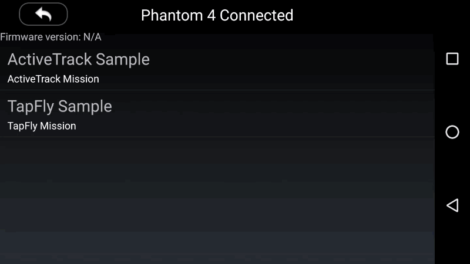

   In the animation, you can see there is a person standing there, you can touch the screen to draw a green rectangle on him. Then the "OK" text will appear on the green rectangle to ask you for confirmation. You can tap on the rectangle to confirm it.

   After the confirmation, the ActiveTrack mission starts. The person walks around and the green rectangle will follow it to track its movement. This means that Phantom 4 is now tracking you automatically!
   
   Press the **X** button if you want to stop the ActiveTrack mission. By the way, you can try to switch on the "RetreatEnabled" switcher on the top left corner of the screen to enable the **Retreat** feature. Once you go towards the Phantom 4, it will fly backwards.

### Using the DJI Assistant 2 for Mission Testing

Since most of our developers don't have a perfect testing environment, like a big indoor space, wide backyard, etc. If we need to go outdoors and bring our latop to debug and test our application everytime, it's time consuming and not efficient. 

Luckily, we have a new DJI Assistant 2 (Includes the 3D Simulator) for you to test the mission easily on your Mac. The simulator creates a virtual 3D environment from flight data transmitted to the Mac.

You can check the [Using DJI Assistant 2 Simulator](../application-development-workflow/workflow-testing.html#DJI-Assistant-2-Simulator) for its basic usage.

Now you can connect your Android which is running the demo application to the remote controller, and start to test the **TapFly** and **ActiveTrack** missions on the simulator of DJI Assistant 2.  

By the way, you can use Wireless Android Debug Bridge (adb) to debug the app using Android Studio when your android device is connecting to the remote controller. If you are not familiar with Android Debug Bridge, please check this <a href="http://developer.android.com/tools/help/adb.html" target="_blank"> link </a> for details.

### Summary

  Congratulations! You've finished the demo project and implement the two cool **TapFly** and **ActiveTrack** missions using DJI Mobile SDK. It's easy and straightforward. You've learned how to use the DJITapFlyMission, DJIActiveTrackMission and DJIMissionManager to implement the features.

  But, In order to make a cool **TapFly** and **ActiveTrack** mission application, you still have a long way to go. You can add more necessary features like showing the battery percentage, GPS signal quality, add a checklist like DJI Go app to check the aircraft status before flying, etc. Good luck and hope you enjoy this tutorial!
  

