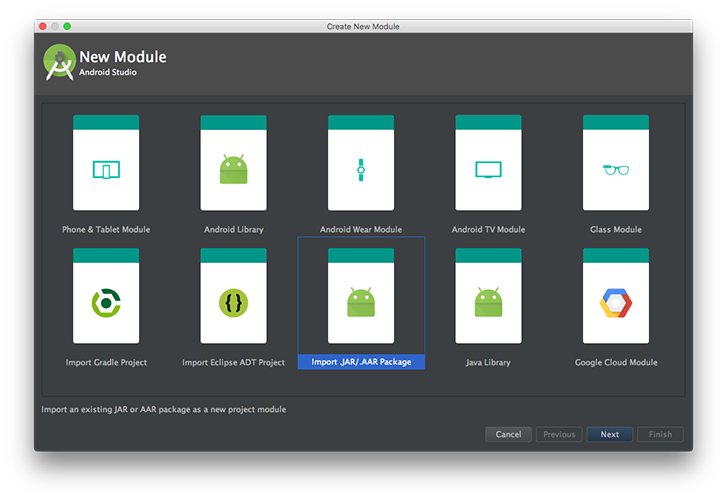
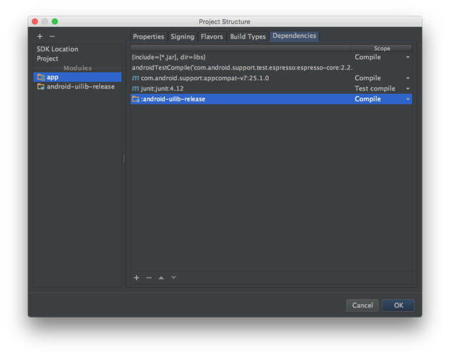
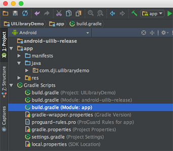
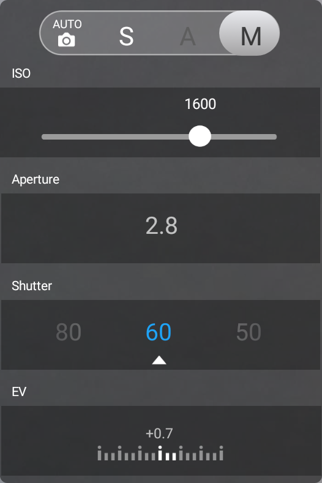
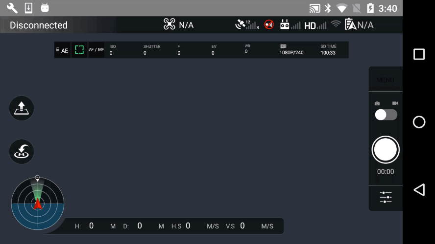
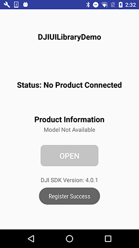

*If you come across any mistakes or bugs in this tutorial, please let us know using a Github issue, a post on the DJI forum. Please feel free to send us Github pull request and help us fix any issues.*

---

In this tutorial, you will learn how to use DJI Android UI Library and DJI Android SDK to create a fully functioning mini-DJI Go app easily, with standard DJI Go UIs and functionalities. By the end of this tutorial you will have an app that you can use to show the camera FPV view, check aircraft status, shoot photos, record videos and so on.

You can download the tutorial's final sample code project from this [Github Page](https://github.com/DJI-Mobile-SDK-Tutorials/xxxxx).

We use Mavic Pro and Nexus 5 as an example to make this demo. For more details of customizing the layouts for iPhone devices, please check the tutorial's Github Sample Project. Let's get started!

## Introduction

DJI UI Library is a visual framework consisting of UI Elements. It helps you simplify the creation of DJI Mobile SDK based apps in Android. With similar design to DJI Go,UI Elements allow you to create consistent UX between your apps and DJI apps.

Additionally, with the ease of use, UILibrary let you focus more on business and application logic. 

As DJI UI Library is built on top of DJI Mobile SDK and VideoPreviewer, you need to use it with them together in your application developement.

## Importing DJI SDK and UILibrary with AAR file

**1**. Now, let's create a new project in Android Studio, open Android Studio and select **File -> New -> New Project** to create a new project, named 'UILibraryDemo'. Enter the company domain and package name (Here we use "com.dji.uilibrarydemo") you want and press Next. Set the minimum SDK version as `API 18: Android 4.3 (Jelly Bean)` for "Phone and Tablet" and press Next. Then select "Empty Activity" and press Next. Lastly, leave the Activity Name as "MainActivity", and the Layout Name as "activity_main", press "Finish" to create the project.

**2**. Next, download the **android-uilib-release.aar** file from this [Github link](https://github.com/dji-sdk/Mobile-UILibrary-Android/blob/master/libs/android-uilib-release.aar). Go to **File -> New -> New Module** on the Android Studio menu:

Choose "Import .JAR/.AAR Package" and click on "Next" button as shown below:

Choose the downloaded **android-uilib-release.aar** file path in the "File name" field. A "android-uilib-release" name will show in the "Subproject name" field. Press "Finish" button to finish the settings.

Moreover, right click on the 'app' module in the project navigator and click "Open Module Settings" to open the Project Structure window. Navigate to the "Dependencies" tab, click on the "+" sign at the bottom and select "3 Module dependency", then choose the ":android-uilib-release" module and press "OK". You should find the ":android-uilib-release" appear in the list now.

**3**. Furthermore, double click on the "build.gradle(Module: app)" in the project navigator to open it and replace the content with the following:

~~~java
apply plugin: 'com.android.application'

android {
    compileSdkVersion 23
    buildToolsVersion '23.0.1'
    defaultConfig {
        applicationId "com.dji.uilibrarydemo"
        minSdkVersion 18
        targetSdkVersion 23
        versionCode 1
        versionName "1.0"
        multiDexEnabled true
    }
    buildTypes {
        release {
            minifyEnabled false
            proguardFiles getDefaultProguardFile('proguard-android.txt'), 'proguard-rules.pro'
        }
    }
    dexOptions {
        javaMaxHeapSize "3g"
    }
    lintOptions{
        abortOnError false
    }
}

dependencies {
    compile fileTree(include: ['*.jar'], dir: 'libs')
    compile 'com.android.support:appcompat-v7:23.3.0'
    testCompile 'junit:junit:4.12'
    compile project(':android-uilib-release')
    compile 'com.android.support:recyclerview-v7:23.4.0'
}
~~~

In the code above, we update the `compileSdkVersion`, `buildToolsVersion`, `targetSdkVersion` number, etc. Also, we add the "compile 'com.android.support:recyclerview-v7:23.4.0'" at the bottom of "dependencies" to add the necessary **recyclerview** library.

 

> Note: We also remove the **compile 'com.android.support:design:23.4.0'** in the "dependencies" to avoid getting the following errors:
> 

Then, select the **Tools -> Android -> Sync Project with Gradle Files** on the top bar and wait for Gradle project sync finish.

**4**. Now, open the MainActivity.java file and add `import dji.sdk.sdkmanager.DJISDKManager;` at the bottom of the import classes section as shown below:
 
~~~java
package com.dji.uilibrarydemo;

import android.support.v7.app.AppCompatActivity;
import android.os.Bundle;
import dji.sdk.sdkmanager.DJISDKManager;
~~~

Wait for a few seconds and check if the words turn red, if they remain gray color, congrats! You have imported the DJI Android SDK and DJI UI Library into your Android Studio project successfully!

## Quick Try on DJI UI Library

### Building the Default Layout using UI Library

Now, let's continue to open the "activity_main.xml" file, and replace the code with the following:

~~~xml
<?xml version="1.0" encoding="utf-8"?>
<RelativeLayout xmlns:android="http://schemas.android.com/apk/res/android"
    xmlns:tools="http://schemas.android.com/tools"
    android:layout_width="match_parent"
    android:layout_height="match_parent"
    android:background="@color/background_blue"
    android:orientation="horizontal"
    tools:context=".MainActivity">

    <!--1-->
    <!-- Widget to see first person view (FPV) -->
    <dji.ui.widget.FPVWidget
        android:layout_width="match_parent"
        android:layout_height="match_parent"/>

    <dji.ui.widget.FPVOverlayWidget
        android:layout_width="match_parent"
        android:layout_height="match_parent"/>

    <!--2-->
    <!-- Widgets in top status bar -->
    <LinearLayout
        android:id="@+id/signal"
        android:layout_width="match_parent"
        android:layout_height="25dp"
        android:background="@color/dark_gray"
        android:orientation="horizontal">

        <dji.ui.widget.PreFlightStatusWidget
            android:id="@+id/status"
            android:layout_width="238dp"
            android:layout_height="25dp"/>

        <dji.ui.widget.FlightModeWidget
            android:layout_width="103dp"
            android:layout_height="22dp"/>

        <dji.ui.widget.GPSSignalWidget
            android:layout_width="44dp"
            android:layout_height="22dp"/>

        <dji.ui.widget.VisionWidget
            android:layout_width="22dp"
            android:layout_height="22dp"/>

        <dji.ui.widget.RemoteControlSignalWidget
            android:layout_width="38dp"
            android:layout_height="22dp"/>

        <dji.ui.widget.VideoSignalWidget
            android:layout_width="38dp"
            android:layout_height="22dp"/>

        <dji.ui.widget.WiFiSignalWidget
            android:layout_width="22dp"
            android:layout_height="20dp"/>

        <dji.ui.widget.BatteryWidget
            android:layout_width="56dp"
            android:layout_height="22dp"/>

        <dji.ui.widget.ConnectionWidget
            android:layout_marginTop="5dp"
            android:layout_width="22dp"
            android:layout_height="22dp"/>
    </LinearLayout>

    <!--3-->
    <LinearLayout
        android:id="@+id/camera"
        android:layout_width="wrap_content"
        android:layout_height="wrap_content"
        android:layout_below="@id/signal"
        android:layout_centerHorizontal="true"
        android:layout_margin="12dp"
        android:background="@color/dark_gray"
        android:orientation="horizontal">

        <dji.ui.widget.AutoExposureLockWidget
            android:layout_width="25dp"
            android:layout_height="25dp"/>

        <dji.ui.widget.FocusExposureSwitchWidget
            android:layout_width="25dp"
            android:layout_height="25dp"/>

        <dji.ui.widget.FocusModeWidget
            android:layout_width="25dp"
            android:layout_height="25dp"/>

        <dji.ui.widget.config.CameraConfigISOWidget
            android:layout_width="50dp"
            android:layout_height="25dp"/>

        <dji.ui.widget.config.CameraConfigShutterWidget
            android:layout_width="50dp"
            android:layout_height="25dp"/>

        <dji.ui.widget.config.CameraConfigApertureWidget
            android:layout_width="50dp"
            android:layout_height="25dp"/>

        <dji.ui.widget.config.CameraConfigEVWidget
            android:layout_width="50dp"
            android:layout_height="25dp"/>

        <dji.ui.widget.config.CameraConfigWBWidget
            android:layout_width="50dp"
            android:layout_height="25dp"/>

        <dji.ui.widget.CameraConfigStorageWidget
            android:layout_width="108dp"
            android:layout_height="25dp"/>

    <!--4-->
    </LinearLayout>
    <dji.ui.widget.RemainingFlightTimeWidget
        android:layout_alignParentTop="true"
        android:layout_marginTop="18dp"
        android:layout_width="match_parent"
        android:background="@color/transparent"
        android:layout_height="20dp"/>

    <!--5-->
    <LinearLayout
        android:layout_width="match_parent"
        android:layout_height="wrap_content"
        android:layout_alignParentBottom="true"
        android:orientation="horizontal"
        android:padding="12dp">

        <dji.ui.widget.dashboard.DashboardWidget
            android:id="@+id/Compass"
            android:layout_width="405dp"
            android:layout_height="91dp"
            android:layout_marginRight="12dp"/>

    </LinearLayout>

    <!--6-->
    <!--Take off and return home buttons on left -->
    <LinearLayout
        android:layout_width="40dp"
        android:layout_height="wrap_content"
        android:layout_centerVertical="true"
        android:layout_marginStart="12dp"
        android:orientation="vertical">

        <dji.ui.widget.TakeOffWidget
            android:layout_width="40dp"
            android:layout_height="40dp"
            android:layout_marginBottom="12dp"/>

        <dji.ui.widget.ReturnHomeWidget
            android:layout_width="40dp"
            android:layout_height="40dp"
            android:layout_marginTop="12dp"/>
    </LinearLayout>

    <!--7-->
    <dji.ui.widget.controls.CameraControlsWidget
        android:id="@+id/CameraCapturePanel"
        android:layout_alignParentRight="true"
        android:layout_below="@id/camera"
        android:layout_width="50dp"
        android:layout_height="213dp"/>

    <!--8-->
    <dji.ui.panel.CameraSettingExposurePanel
        android:id="@+id/CameraExposureMode"
        android:layout_width="180dp"
        android:layout_below="@id/camera"
        android:layout_toLeftOf="@+id/CameraCapturePanel"
        android:background="@color/transparent"
        android:gravity="center"
        android:layout_height="263dp"
        android:visibility="invisible"/>

    <!--9-->
    <dji.ui.panel.CameraSettingAdvancedPanel
        android:id="@+id/CameraAdvancedSetting"
        android:layout_width="180dp"
        android:layout_height="263dp"
        android:layout_below="@id/camera"
        android:layout_toLeftOf="@+id/CameraCapturePanel"
        android:background="@color/transparent"
        android:gravity="center"
        android:visibility="invisible"/>

    <!--10-->
    <!-- Pre-flight checklist panel -->
    <dji.ui.panel.PreFlightCheckListPanel
        android:id="@+id/PreflightCheckView"
        android:layout_width="400dp"
        android:layout_height="wrap_content"
        android:layout_below="@id/signal"
        android:visibility="gone"/>

</RelativeLayout>
~~~

In the xml file above, we implement the following UIs:

1. Firstly, we add the `dji.ui.widget.FPVWidget` and `dji.ui.widget.FPVOverlayWidget` elements to show the first person view (FPV).

2. Next, on top of the screen, we create a **LinearLayout** to group the top status bar widgets, like `PreFlightStatusWidget`, `FlightModeWidget`, `GPSSignalWidget`, `RemoteControlSignalWidget`, etc. 

3. Moreover, we create another **LinearLayout** to group the camera configurations and config widgets below the status bar widgets, like `AutoExposureLockWidget`, `FocusExposureSwitchWidget`, `CameraConfigISOWidget`, `CameraConfigStorageWidget`, etc. Also we add the `dji.ui.widget.RemainingFlightTimeWidget` element to show the remaining flight time widget below the top status bar widgets too.

4. Below the top status bar, we add a `RemainingFlightTimeWidget` to show the remaining flight time.

5. At the bottom of the screen, we add another **LinearLayout** to group the `DashboardWidget`. It includes the circular `CompassWidget`, the `DistanceHomeWidget`, the `HorizontalVelocityWidget`, the `DistanceRCWidget`, the `VerticalVelocityWidget` and the `AltitudeWidget` as shown below:

6. On the left side of the screen, we add a **LinearLayout** to group the `TakeOffWidget` and `ReturnHomeWidget` which will be shown as two buttons.

7. On the right side of the screen, we add the `dji.ui.widget.controls.CameraControlsWidget` element to create a `CameraControlsWidget` to show the camera control widget. Tapping the Menu button on top will toggle between show and hide `CameraSettingAdvancedPanel`. Tapping the switch button in the middle will toggle camera mode between **shoot photo** and **record video**. Tapping the bottom button will toggle between show and hide `CameraSettingExposurePanel`.

8. To add the `CameraSettingExposurePanel`, we add the `dji.ui.panel.CameraSettingExposurePanel` element and configure its attributes.

9. To add the `CameraSettingAdvancedPanel`, we add the `dji.ui.panel.CameraSettingAdvancedPanel` element and configure its attributes.

10. Lastly, we add the `dji.ui.panel.PreFlightCheckListPanel` element to create the `PreFlightCheckListPanel`. When user press on the `PreFlightStatusWidget`, it will show up below the top status bar.

Once you finished the steps above, open the "colors.xml" file and replace the content with the following:

~~~xml
<?xml version="1.0" encoding="utf-8"?>
<resources>
    <color name="colorPrimary">#3F51B5</color>
    <color name="colorPrimaryDark">#303F9F</color>
    <color name="colorAccent">#FF4081</color>
    <color name="background_blue">#242d34</color>
    <color name="transparent">#00000000</color>
    <color name="dark_gray">#80000000</color>
</resources>
~~~

Moreover, let's open the "styles.xml" file and replace the content with the following:

~~~xml
<resources>

    <!-- Base application theme. -->
    

</resources>
~~~

Now, let's build and run the project and install it to your Android device. If everything goes well, you should see something like the gif animation below:

With the help to DJI UI Library, it's dead simple and straightforward to implement the standard DJI Go UIs and functionalities in your own application. So far if you connect the application to DJI Products, the functionalities (Like show live video feed, shoot photo, etc) won't work. You need to implement application registration and start a connection between the DJI SDK and the DJI producst. Let's continue to implement these features.

## Application Registration and Product Connection

Now let's register our application with the **App Key** you apply from DJI Developer Website. If you are not familiar with the App Key, please check the [Get Started](../quick-start/index.html).

### Implementing DemoApplication Class

Right click on the 'com.dji.uilibrarydemo' module in the project navigator and select "New -> Java Class" to create a new file, enter "DemoApplication" as the **Name**. Then replace the code with the same file in this tutorial's Github sample project, here we explain the important parts of it:

~~~java
@Override
    public void onCreate() {
        super.onCreate();
        mHandler = new Handler(Looper.getMainLooper());
        //This is used to start SDK services and initiate SDK.
        DJISDKManager.getInstance().registerApp(this, mDJISDKManagerCallback);
    }

    /**
     * When starting SDK services, an instance of interface DJISDKManager.SDKManagerCallback will be used to listen to 
     * the SDK Registration result and the product changing.
     */
    private DJISDKManager.SDKManagerCallback mDJISDKManagerCallback = new DJISDKManager.SDKManagerCallback() {

        //Listens to the SDK registration result
        @Override
        public void onRegister(DJIError error) {
            if(error == DJISDKError.REGISTRATION_SUCCESS) {
                DJISDKManager.getInstance().startConnectionToProduct();
                Handler handler = new Handler(Looper.getMainLooper());
                handler.post(new Runnable() {
                    @Override
                    public void run() {
                        Toast.makeText(getApplicationContext(), "Register Success", Toast.LENGTH_LONG).show();
                    }
                });

            } else {

                Handler handler = new Handler(Looper.getMainLooper());
                handler.post(new Runnable() {

                    @Override
                    public void run() {
                        Toast.makeText(getApplicationContext(), "Register Failed, check network is available", Toast.LENGTH_LONG).show();
                    }
                });

            }
            Log.e("TAG", error.toString());
        }

        //Listens to the connected product changing, including two parts, component changing or product connection changing.
        @Override
        public void onProductChange(BaseProduct oldProduct, BaseProduct newProduct) {

            mProduct = newProduct;
            if(mProduct != null) {
                mProduct.setBaseProductListener(mDJIBaseProductListener);
            }

            notifyStatusChange();
        }
    };

    private BaseProduct.BaseProductListener mDJIBaseProductListener = new BaseProduct.BaseProductListener() {

        @Override
        public void onComponentChange(BaseProduct.ComponentKey key, BaseComponent oldComponent, BaseComponent newComponent) {

            if(newComponent != null) {
                newComponent.setComponentListener(mDJIComponentListener);
            }
            notifyStatusChange();
        }

        @Override
        public void onConnectivityChange(boolean isConnected) {

            notifyStatusChange();
        }
    };
~~~

Here, we implement several features:
  
1. We override the `onCreate()` method to initialize DJISDKManager and register the application.
2. Implement the two interface methods of `SDKManagerCallback`. You can use the `onRegister()` method to check the Application registration status and show text message to inform users. Using the `onProductChange()` method, we can check the product connection status and invoke the `notifyStatusChange()` method to notify status changes.
3. Implement the two interface methods of `BaseProductListener`. You can use the `onComponentChange()` method to check the product component change status and invoke the `notifyStatusChange()` method to notify status changes. Also, you can use the `onConnectivityChange()` method to notify the product connectivity changes.

### Implementing ConnectionActivity

#### Working on the ConnectionActivity Class

To improve the user experience, we had better create an activity to show the connection status between the DJI Product and the SDK, once it's connected, the user can press the **OPEN** button to enter the **MainActivity**. 

Now let's Right-click on the package `com.dji.uilibrarydemo` in the project navigator and choose **New -> Activity -> Basic Activity**, Type in "ConnectionActivity" in the "Activity Name" field, then press "Finish" button.

Next, replace the code of the "ConnectionActivity.java" file with the same file in this tutorial's Github Sample project, here we explain the important parts of it:

- Define and Setup UI Elements Variables

~~~java
private TextView mTextConnectionStatus;
private TextView mTextProduct;
private TextView mTextModelAvailable;
private Button mBtnOpen;
~~~

~~~java
private void initUI() {
    mTextConnectionStatus = (TextView) findViewById(R.id.text_connection_status);
    mTextModelAvailable = (TextView) findViewById(R.id.text_model_available);
    mTextProduct = (TextView) findViewById(R.id.text_product_info);
    mBtnOpen = (Button) findViewById(R.id.btn_open);
    mBtnOpen.setOnClickListener(this);
    mBtnOpen.setEnabled(false);
}
~~~

~~~java
@Override
public void onClick(View v) {
    switch (v.getId()) {

        case R.id.btn_open: {
            Intent intent = new Intent(this, MainActivity.class);
            startActivity(intent);
            break;
        }
        default:
            break;
    }
}
~~~

In the code shown above, we implement the following features:

1. Create the layout UI elements variables, including three TextureViews `mTextConnectionStatus`, `mTextProduct`, `mTextModelAvailable` and one Button `mBtnOpen`. 

2. In the `initUI()` method, we initialize the UI elements and invoke `setOnClickListener()` method of `mBtnOpen` and set "ConnectionActivity" as the listener.

3. Lastly, override the onClick() method to implement the Button's click action. When user press the "OPEN" button, it will start the "MainActivity".

We will define the UI elements layouts in the "activity_connection.xml" file later.

- Setup the BroadcastReceiver

~~~java
@Override
protected void onCreate(Bundle savedInstanceState) {
    super.onCreate(savedInstanceState);

    // When the compile and target version is higher than 22, please request the
    // following permissions at runtime to ensure the
    // SDK work well.
    if (Build.VERSION.SDK_INT >= Build.VERSION_CODES.M) {
        ActivityCompat.requestPermissions(this,
                new String[]{Manifest.permission.WRITE_EXTERNAL_STORAGE, Manifest.permission.VIBRATE,
                        Manifest.permission.INTERNET, Manifest.permission.ACCESS_WIFI_STATE,
                        Manifest.permission.WAKE_LOCK, Manifest.permission.ACCESS_COARSE_LOCATION,
                        Manifest.permission.ACCESS_NETWORK_STATE, Manifest.permission.ACCESS_FINE_LOCATION,
                        Manifest.permission.CHANGE_WIFI_STATE, Manifest.permission.MOUNT_UNMOUNT_FILESYSTEMS,
                        Manifest.permission.READ_EXTERNAL_STORAGE, Manifest.permission.SYSTEM_ALERT_WINDOW,
                        Manifest.permission.READ_PHONE_STATE,
                }
                , 1);
    }

    setContentView(R.layout.activity_connection);

    initUI();

    // Register the broadcast receiver for receiving the device connection's changes.
    IntentFilter filter = new IntentFilter();
    filter.addAction(DemoApplication.FLAG_CONNECTION_CHANGE);
    registerReceiver(mReceiver, filter);
}
~~~

~~~java
@Override
protected void onDestroy() {
    Log.e(TAG, "onDestroy");
    unregisterReceiver(mReceiver);
    super.onDestroy();
}
~~~

~~~java
protected BroadcastReceiver mReceiver = new BroadcastReceiver() {

    @Override
    public void onReceive(Context context, Intent intent) {
        refreshSDKRelativeUI();
    }
};
~~~

~~~java
private void refreshSDKRelativeUI() {
    BaseProduct mProduct = DemoApplication.getProductInstance();

    if (null != mProduct && mProduct.isConnected()) {
        Log.v(TAG, "refreshSDK: True");
        mBtnOpen.setEnabled(true);

        String str = mProduct instanceof Aircraft ? "DJIAircraft" : "DJIHandHeld";
        mTextConnectionStatus.setText("Status: " + str + " connected");
        updateVersion();

        if (null != mProduct.getModel()) {
            mTextProduct.setText("" + mProduct.getModel().getDisplayName());
        } else {
            mTextProduct.setText(R.string.product_information);
        }
    } else {
        Log.v(TAG, "refreshSDK: False");
        mBtnOpen.setEnabled(false);

        mTextProduct.setText(R.string.product_information);
        mTextConnectionStatus.setText(R.string.connection_loose);
    }
}
~~~

In the code above, we implement the following features:

1. In the `onCreate()` method, we firstly request several permissions at runtime to ensure the SDK works well when the compile and target SDK version is higher than 22(Like Android Marshmallow 6.0 device and API 23). Next, we invoke the `initUI()` method to initialize the UIs. Moreover, we register the broadcast receiver for receiving the device connection's changes.

2. In the `onDestroy()` method, we invoke the `unregisterReceiver()` method by passing the `mReceiver` variable to unregister the broadcast receiver.

3. Create the "BroadcastReceiver" and override its `onReceive()` method to invoke the `refreshSDKRelativeUI()` method to refresh the UI elements.

4. In the `refreshSDKRelativeUI()` method, we check the BaseProduct's connection status by invoking `isConnected()` method. If the product is connected, we enable the `mBtnOpen` button, update the `mTextConnectionStatus`'s text content and update the `mTextProduct`'s content with product name. Otherwise, if the product is disconnected, we disable the `mBtnOpen` button and update the `mTextProduct` and `mTextConnectionStatus` textViews' content.

For more details, please check this tutorial's Github Sample project.

#### Working on the ConnectionActivity Layout

Open the **activity_connection.xml** layout file and replace the code with the following:

~~~xml
<?xml version="1.0" encoding="utf-8"?>
<RelativeLayout xmlns:android="http://schemas.android.com/apk/res/android"
    xmlns:tools="http://schemas.android.com/tools"
    android:layout_width="match_parent"
    android:layout_height="match_parent"
    android:orientation="vertical">

    <TextView
        android:layout_width="wrap_content"
        android:layout_height="wrap_content"
        android:text="@string/sdk_version"
        android:textSize="15dp"
        android:id="@+id/textView2"
        android:layout_alignParentBottom="true"
        android:layout_centerHorizontal="true"
        android:layout_marginBottom="15dp" />

    <TextView
        android:layout_width="wrap_content"
        android:layout_height="wrap_content"
        android:textAppearance="?android:attr/textAppearanceSmall"
        android:text="DJIUILibraryDemo"
        android:id="@+id/textView"
        android:layout_marginTop="18dp"
        android:textStyle="bold"
        android:textSize="20dp"
        android:textColor="@color/black_overlay"
        android:layout_alignParentTop="true"
        android:layout_centerHorizontal="true" />

    <TextView
        android:id="@+id/text_product_info"
        android:layout_width="wrap_content"
        android:layout_height="wrap_content"
        android:text="@string/product_information"
        android:textColor="@android:color/black"
        android:textSize="20dp"
        android:gravity="center"
        android:textStyle="bold"
        android:layout_marginTop="19dp"
        android:layout_below="@+id/text_connection_status"
        android:layout_centerHorizontal="true" />

    <Button
        android:id="@+id/btn_open"
        android:layout_width="150dp"
        android:layout_height="55dp"
        android:background="@drawable/round_btn"
        android:text="Open"
        android:textColor="@color/colorWhite"
        android:textSize="20dp"
        android:layout_alignBottom="@+id/textView2"
        android:layout_alignEnd="@+id/textView2"
        android:layout_marginBottom="43dp" />

    <TextView
        android:id="@+id/text_model_available"
        android:layout_width="match_parent"
        android:layout_height="wrap_content"
        android:gravity="center"
        android:text="@string/model_not_available"
        android:textSize="15dp"
        android:layout_centerVertical="true"
        android:layout_alignParentStart="true" />

    <TextView
        android:id="@+id/text_connection_status"
        android:layout_width="wrap_content"
        android:layout_height="wrap_content"
        android:gravity="center"
        android:text="Status: No Product Connected"
        android:textColor="@android:color/black"
        android:textSize="20dp"
        android:textStyle="bold"
        android:layout_marginTop="35dp"
        android:layout_below="@+id/textView"
        android:layout_centerHorizontal="true" />

</RelativeLayout>
~~~

In the xml file, we create five TextViews and one Button within a RelativeLayout. We use the **TextView(id: text\_connection\_status)** to show the product connection status and use the **TextView(id:text\_product\_info)** to show the connected product name. The **Button(id: btn\_open)** is used to open the "MainActivity".

Moreover, copy all the image files from this tutorial's Github sample project's "drawable" folder (**app->src->main->res->drawable**) to the same folder in the project.

Furthermore, open the "colors.xml" file and update the content as shown below:

~~~xml
<?xml version="1.0" encoding="utf-8"?>
<resources>
    <color name="colorPrimary">#3F51B5</color>
    <color name="colorPrimaryDark">#303F9F</color>
    <color name="colorAccent">#FF4081</color>
    <color name="black_overlay">#000000</color>
    <color name="colorWhite">#FFFFFF</color>
    <color name="transparent">#00000000</color>
    <color name="light_gray">#B3FFFFFF</color>
    <color name="background_blue">#242d34</color>
    <color name="dark_gray">#80000000</color>
</resources>
~~~

Lastly, open the "strings.xml" file and replace the content with the followings:

~~~xml
<resources>
    <string name="app_name">UILibraryDemo</string>
    <string name="action_settings">Settings</string>
    <string name="disconnected">Disconnected</string>
    <string name="product_information">Product Information</string>
    <string name="connection_loose">Status: No Product Connected</string>
    <string name="model_not_available">Model Not Available</string>
    <string name="sdk_version">DJI SDK Version: 4.0.1</string>
</resources>
~~~

### Modifying AndroidManifest file

Once you finished the steps above, let's open the "AndroidManifest.xml" file and add the following elements on top of the **application** element:

~~~xml
<!-- DJI SDK need permission -->
<uses-permission android:name="android.permission.BLUETOOTH" />
<uses-permission android:name="android.permission.BLUETOOTH_ADMIN" />
<uses-permission android:name="android.permission.VIBRATE" />
<uses-permission android:name="android.permission.INTERNET" />
<uses-permission android:name="android.permission.ACCESS_WIFI_STATE" />
<uses-permission android:name="android.permission.WAKE_LOCK" />
<uses-permission android:name="android.permission.ACCESS_COARSE_LOCATION" />
<uses-permission android:name="android.permission.ACCESS_NETWORK_STATE" />
<uses-permission android:name="android.permission.ACCESS_FINE_LOCATION" />
<uses-permission android:name="android.permission.CHANGE_WIFI_STATE" />
<uses-permission android:name="android.permission.MOUNT_UNMOUNT_FILESYSTEMS" />
<uses-permission android:name="android.permission.WRITE_EXTERNAL_STORAGE" />
<uses-permission android:name="android.permission.READ_EXTERNAL_STORAGE" />
<uses-permission android:name="android.permission.SYSTEM_ALERT_WINDOW" />
<uses-permission android:name="android.permission.READ_PHONE_STATE" />

<uses-feature android:name="android.hardware.camera" />
<uses-feature android:name="android.hardware.camera.autofocus" />
<uses-feature
    android:name="android.hardware.usb.host"
    android:required="false" />
<uses-feature
    android:name="android.hardware.usb.accessory"
    android:required="true" />
~~~

Here, we request permissions that the application must be granted in order for it to register DJI SDK correctly. Also, we declare the camera and USB hardwares which are used by the application.

Moreover, let's add the following elements as childs of element on top of the "MainActivity" activity element as shown below:

~~~xml
<!-- DJI SDK -->
<uses-library android:name="com.android.future.usb.accessory" />

<meta-data
    android:name="com.dji.sdk.API_KEY"
    android:value="Please enter your App Key here." />

<activity
    android:name="dji.sdk.sdkmanager.DJIAoaControllerActivity"
    android:theme="@android:style/Theme.Translucent">
    <intent-filter>
        <action android:name="android.hardware.usb.action.USB_ACCESSORY_ATTACHED" />
    </intent-filter>

    <meta-data
        android:name="android.hardware.usb.action.USB_ACCESSORY_ATTACHED"
        android:resource="@xml/accessory_filter" />
</activity>

<service android:name="dji.sdk.sdkmanager.DJIGlobalService"></service>
<!-- DJI SDK -->
~~~

In the code above, you should substitute your **App Key** of the application for "Please enter your App Key here." in the **value** attribute under the `android:name="com.dji.sdk.API_KEY"` attribute. For the "accessory_filter.xml" file, you can get it from this tutorial's Github Sample project.

Lastly, update the "MainActivity" and "ConnectionActivity" activity elements as shown below:

~~~xml
<activity android:name=".ConnectionActivity"
    android:screenOrientation="landscape">
    <intent-filter>
        <action android:name="android.intent.action.MAIN" />
        <category android:name="android.intent.category.LAUNCHER" />
    </intent-filter>
</activity>
<activity android:name=".MainActivity"
    android:screenOrientation="landscape">
</activity>
~~~

In the code above, we add the attributes of "android:screenOrientation" to set "ConnectionActivity" as **landscape** and set "MainActivity" as **landscape**.

Now, let's build and run the project and install it to your Android device. If everything goes well, you should see the "Register Success" textView like the following screenshot when you register the app successfully.

## Connecting to the Aircraft and Run the Project

Now, please check this [Connect Mobile Device and Run Application](../application-development-workflow/workflow-run.html#connect-mobile-device-and-run-application) guide to run the application and try the mini-DJI Go features of UILibrary based on what we've finished of the application so far!
  
If you can see the live video feed and test the features like this, congratulations! Using the DJI UI Library is that easy.

### Summary

In this tutorial, you have learned how to use the DJI Android UI Library and DJI Android SDK to create a fully functioning mini-DJI Go app easily, with standard DJI Go UIs and functionalities. Hope you enjoy it!

