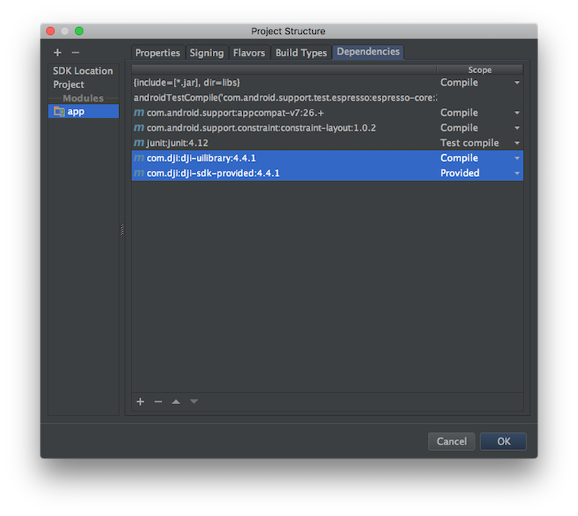
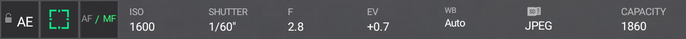
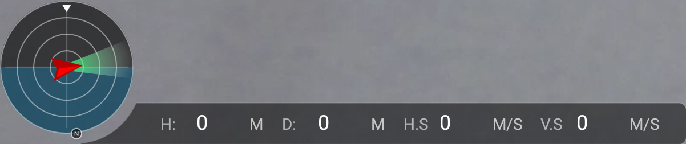
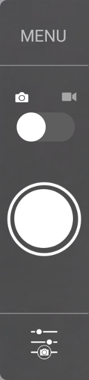
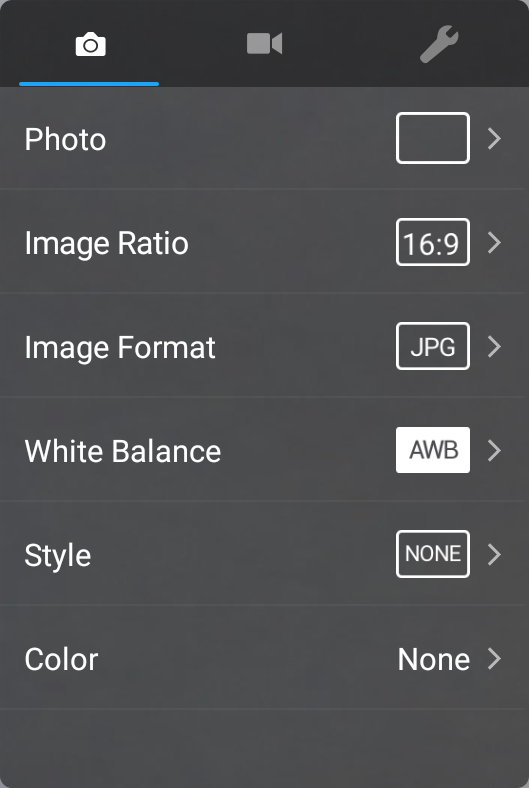
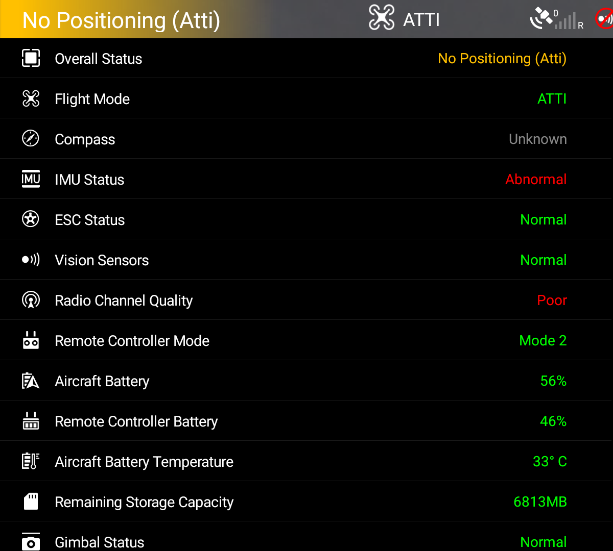

*If you come across any mistakes or bugs in this tutorial, please let us know using a Github issue, a post on the DJI forum. Please feel free to send us Github pull request and help us fix any issues.*

---

In this tutorial, you will learn how to use DJI Android UX SDK and DJI Android SDK to create a fully functioning mini-DJI Go app easily, with standard DJI Go UIs and functionalities. By the end of this tutorial you will have an app that you can use to show the camera FPV view, check aircraft status, shoot photos, record videos and so on.

You can download the tutorial's final sample project from this [Github Page](https://github.com/DJI-Mobile-SDK-Tutorials/Android-UXSDKDemo).

We use Mavic Pro and Nexus 5 as an example to make this demo. For more details of customizing the layouts for iPhone devices, please check the tutorial's Github Sample Project. Let's get started!

## Introduction

DJI UX SDK is a visual sdk consisting of UI Elements. It helps you simplify the creation of DJI Mobile SDK based apps in Android. With similar design to DJI Go,UI Elements allow you to create consistent UX between your apps and DJI apps.

Additionally, with the ease of use, UX SDK let you focus more on business and application logic. 

As DJI UX SDK is built on top of DJI Mobile SDK and VideoPreviewer, you need to use it with them together in your application development.

For an in depth learning on DJI UX SDK, please go to the [UX SDK Introduction](../introduction/ux_sdk_introduction.html).

## Application Activation and Aircraft Binding in China

 For DJI SDK mobile application used in China, it's required to activate the application and bind the aircraft to the user's DJI account. 

 If an application is not activated, the aircraft not bound (if required), or a legacy version of the SDK (< 4.1) is being used, all **camera live streams** will be disabled, and flight will be limited to a zone of 100m diameter and 30m height to ensure the aircraft stays within line of sight.

 To learn how to implement this feature, please check this tutorial [Application Activation and Aircraft Binding](./ActivationAndBinding.html).

## Importing DJI UX SDK

Now, open Android Studio and select **File -> New -> New Project** to create a new project, named "UXSDKDemo". Enter the company domain and package name (Here we use "com.dji.uxsdkdemo") you want and press Next. Set the minimum SDK version as `API 19: Android 4.4 (KitKat)` for "Phone and Tablet" and press Next. Then select "Empty Activity" and press Next. Lastly, leave the Activity Name as "MainActivity", and the Layout Name as "activity_main", press "Finish" to create the project.

### Configure Gradle Script

Double click on the "build.gradle(Module: app)" in the project navigator to open it and add the following code:

~~~gradle
apply plugin: 'com.android.application'

android {

    ...
    defaultConfig {
        ...
    }

    ...

    packagingOptions{
        doNotStrip "*/*/libdjivideo.so"
        doNotStrip "*/*/libSDKRelativeJNI.so"
        doNotStrip "*/*/libFlyForbid.so"
        doNotStrip "*/*/libduml_vision_bokeh.so"
        doNotStrip "*/*/libyuv2.so"
        doNotStrip "*/*/libGroudStation.so"
        doNotStrip "*/*/libFRCorkscrew.so"
        doNotStrip "*/*/libUpgradeVerify.so"
        doNotStrip "*/*/libFR.so"

        pickFirst 'lib/*/libstlport_shared.so'
        pickFirst 'lib/*/libRoadLineRebuildAPI.so'
        pickFirst 'lib/*/libGNaviUtils.so'
        pickFirst 'lib/*/libGNaviMapex.so'
        pickFirst 'lib/*/libGNaviData.so'
        pickFirst 'lib/*/libGNaviMap.so'
        pickFirst 'lib/*/libGNaviSearch.so'

        exclude '/lib/armeabi-v7a/libChineseFontPkg.so'
        exclude 'META-INF/rxjava.properties'
    }
}

dependencies {
   ...
    compile ('com.dji:dji-uxsdk:4.6')
    provided ('com.dji:dji-sdk-provided:4.6')
}
~~~

In the code above, we implement the following features:

1. Add the `packagingOptions` to prevent any unexpected crash of the application.
2. Add the `compile` and `provided` dependencies to import the latest DJI Android UX SDK and SDK Maven dependency.

Once you finished the steps above, select **Tools -> Android -> Sync Project with Gradle Files** and wait for Gradle project sync to finish.

### Double Check Maven Dependency

Select **File->Project Structure** in the Android Studio menu to open the "Project Structure" window. Then select the "app" module and click the **Dependencies** tab. You should see the latest DJI Android UX SDK compile and sdk provided dependencies are already imported.

  

## Application Activation and Aircraft Binding in China

 For DJI SDK mobile application used in China, it's required to activate the application and bind the aircraft to the user's DJI account. 

 If an application is not activated, the aircraft not bound (if required), or a legacy version of the SDK (< 4.1) is being used, all **camera live streams** will be disabled, and flight will be limited to a zone of 100m diameter and 30m height to ensure the aircraft stays within line of sight.

 To learn how to implement this feature, please check this tutorial [Application Activation and Aircraft Binding](./ActivationAndBinding.html).

## Building the Default Layout using UX SDK

Now, let's continue to open the "activity_main.xml" file, and replace the code with the following:

~~~xml
<?xml version="1.0" encoding="utf-8"?>
<RelativeLayout xmlns:android="http://schemas.android.com/apk/res/android"
    xmlns:tools="http://schemas.android.com/tools"
    xmlns:custom="http://schemas.android.com/apk/res-auto"
    android:layout_width="match_parent"
    android:layout_height="match_parent"
    android:background="@color/background_blue"
    android:orientation="horizontal"
    tools:context=".MainActivity">

    <!-- Widget to see first person view (FPV) -->
    <dji.ux.widget.FPVWidget
        android:layout_width="match_parent"
        android:layout_height="match_parent"/>

    <dji.ux.widget.FPVOverlayWidget
        android:layout_width="match_parent"
        android:layout_height="match_parent"/>

    <dji.ux.workflow.CompassCalibratingWorkFlow
        android:layout_width="match_parent"
        android:layout_height="match_parent"/>

    <!-- Widgets in top status bar -->
    <LinearLayout
        android:id="@+id/signal"
        android:layout_width="match_parent"
        android:layout_height="25dp"
        android:background="@color/dark_gray"
        android:orientation="horizontal">

        <dji.ux.widget.PreFlightStatusWidget
            android:layout_width="238dp"
            android:layout_height="25dp"/>

        <dji.ux.widget.FlightModeWidget
            android:layout_width="103dp"
            android:layout_height="22dp"/>

        <dji.ux.widget.GPSSignalWidget
            android:layout_width="44dp"
            android:layout_height="22dp"/>

        <dji.ux.widget.VisionWidget
            android:layout_width="22dp"
            android:layout_height="22dp"/>

        <dji.ux.widget.RemoteControlSignalWidget
            android:layout_width="38dp"
            android:layout_height="22dp"/>

        <dji.ux.widget.VideoSignalWidget
            android:layout_width="38dp"
            android:layout_height="22dp"/>

        <dji.ux.widget.WiFiSignalWidget
            android:layout_width="22dp"
            android:layout_height="20dp"/>

        <dji.ux.widget.BatteryWidget
            android:layout_width="96dp"
            android:layout_height="22dp"
            custom:excludeView="singleVoltage"/>

        <dji.ux.widget.ConnectionWidget
            android:layout_marginTop="3dp"
            android:layout_width="18dp"
            android:layout_height="18dp"/>
    </LinearLayout>

    <LinearLayout
        android:id="@+id/camera"
        android:layout_width="wrap_content"
        android:layout_height="wrap_content"
        android:layout_below="@id/signal"
        android:layout_centerHorizontal="true"
        android:layout_marginTop="20dp"
        android:background="@color/dark_gray"
        android:orientation="horizontal">

        <dji.ux.widget.AutoExposureLockWidget
            android:layout_width="30dp"
            android:layout_height="30dp"/>

        <dji.ux.widget.FocusExposureSwitchWidget
            android:layout_width="30dp"
            android:layout_height="30dp"/>

        <dji.ux.widget.FocusModeWidget
            android:layout_width="30dp"
            android:layout_height="30dp"/>

        <dji.ux.widget.config.CameraConfigISOAndEIWidget
            android:layout_width="60dp"
            android:layout_height="30dp"/>

        <dji.ux.widget.config.CameraConfigShutterWidget
            android:layout_width="60dp"
            android:layout_height="30dp"/>

        <dji.ux.widget.config.CameraConfigApertureWidget
            android:layout_width="60dp"
            android:layout_height="30dp"/>

        <dji.ux.widget.config.CameraConfigEVWidget
            android:layout_width="60dp"
            android:layout_height="30dp"/>

        <dji.ux.widget.config.CameraConfigWBWidget
            android:layout_width="70dp"
            android:layout_height="30dp"/>

        <dji.ux.widget.config.CameraConfigStorageWidget
            android:layout_width="130dp"
            android:layout_height="30dp"/>
    </LinearLayout>

    <dji.ux.widget.ManualFocusWidget
        android:layout_below="@id/camera"
        android:layout_alignLeft="@id/camera"
        android:layout_marginLeft="25dp"
        android:layout_marginTop="5dp"
        android:layout_width="42dp"
        android:layout_height="218dp"
        tools:ignore="RtlHardcoded"/>

    <dji.ux.widget.RemainingFlightTimeWidget
        android:layout_alignParentTop="true"
        android:layout_marginTop="18dp"
        android:layout_width="match_parent"
        android:background="@color/transparent"
        android:layout_height="20dp"/>

    <LinearLayout
        android:layout_width="match_parent"
        android:layout_height="wrap_content"
        android:layout_alignParentBottom="true"
        android:orientation="horizontal"
        android:padding="12dp">

        <dji.ux.widget.dashboard.DashboardWidget
            android:id="@+id/Compass"
            android:layout_width="405dp"
            android:layout_height="91dp"
            android:layout_marginRight="12dp"
            tools:ignore="RtlHardcoded"/>

    </LinearLayout>

    <!--Take off and return home buttons on left -->
    <LinearLayout
        android:layout_width="40dp"
        android:layout_height="wrap_content"
        android:layout_centerVertical="true"
        android:layout_marginStart="12dp"
        android:orientation="vertical">

        <dji.ux.widget.TakeOffWidget
            android:layout_width="40dp"
            android:layout_height="40dp"
            android:layout_marginBottom="12dp"/>

        <dji.ux.widget.ReturnHomeWidget
            android:layout_width="40dp"
            android:layout_height="40dp"
            android:layout_marginTop="12dp"/>
    </LinearLayout>

    <dji.ux.widget.controls.CameraControlsWidget
        android:id="@+id/CameraCapturePanel"
        android:layout_alignParentRight="true"
        android:layout_below="@id/camera"
        android:layout_width="50dp"
        android:layout_height="213dp"
        tools:ignore="RtlHardcoded"/>

    <dji.ux.panel.CameraSettingExposurePanel
        android:layout_width="180dp"
        android:layout_below="@id/camera"
        android:layout_toLeftOf="@+id/CameraCapturePanel"
        android:background="@color/transparent"
        android:gravity="center"
        android:layout_height="263dp"
        android:visibility="invisible"
        tools:ignore="RtlHardcoded"/>

    <dji.ux.panel.CameraSettingAdvancedPanel
        android:layout_width="180dp"
        android:layout_height="263dp"
        android:layout_below="@id/camera"
        android:layout_toLeftOf="@+id/CameraCapturePanel"
        android:background="@color/transparent"
        android:gravity="center"
        android:visibility="invisible"
        tools:ignore="RtlHardcoded"/>

    <!-- Pre-flight checklist panel -->
    <dji.ux.panel.PreFlightCheckListPanel
        android:layout_width="400dp"
        android:layout_height="wrap_content"
        android:layout_below="@id/signal"
        custom:excludeItem="aircraftBatteryTemperature|ESCStatus"
        android:visibility="gone"/>

</RelativeLayout>
~~~

In the xml file above, we implement the following UIs:

1. Firstly, we add the `dji.ui.widget.FPVWidget` and `dji.ui.widget.FPVOverlayWidget` elements to show the first person view (FPV).

2. Next, on top of the screen, we create a **LinearLayout** to group the top status bar widgets, like `PreFlightStatusWidget`, `FlightModeWidget`, `GPSSignalWidget`, `RemoteControlSignalWidget`, etc. 

3. Moreover, we create another **LinearLayout** to group the camera configurations and config widgets below the status bar widgets, like `AutoExposureLockWidget`, `FocusExposureSwitchWidget`, `CameraConfigISOWidget`, `CameraConfigStorageWidget`, etc. Also we add the `dji.ui.widget.RemainingFlightTimeWidget` element to show the remaining flight time widget below the top status bar widgets too.

4. Below the top status bar, we add a `RemainingFlightTimeWidget` to show the remaining flight time.

5. At the bottom of the screen, we add another **LinearLayout** to group the `DashboardWidget`. It includes the circular `CompassWidget`, the `DistanceHomeWidget`, the `HorizontalVelocityWidget`, the `DistanceRCWidget`, the `VerticalVelocityWidget` and the `AltitudeWidget` as shown below:

6. On the left side of the screen, we add a **LinearLayout** to group the `TakeOffWidget` and `ReturnHomeWidget` which will be shown as two buttons.

7. On the right side of the screen, we add the `dji.ui.widget.controls.CameraControlsWidget` element to create a `CameraControlsWidget` to show the camera control widget. Tapping the Menu button on top will toggle between show and hide `CameraSettingAdvancedPanel`. Tapping the switch button in the middle will toggle camera mode between **shoot photo** and **record video**. Tapping the bottom button will toggle between show and hide `CameraSettingExposurePanel`.

8. To add the `CameraSettingExposurePanel`, we add the `dji.ui.panel.CameraSettingExposurePanel` element and configure its attributes.

9. To add the `CameraSettingAdvancedPanel`, we add the `dji.ui.panel.CameraSettingAdvancedPanel` element and configure its attributes.

10. Lastly, we add the `dji.ui.panel.PreFlightCheckListPanel` element to create the `PreFlightCheckListPanel`. When user press on the `PreFlightStatusWidget`, it will show up below the top status bar.

Once you finished the steps above, open the "colors.xml" file and replace the content with the following:

~~~xml
<?xml version="1.0" encoding="utf-8"?>
<resources>
    <color name="colorPrimary">#3F51B5</color>
    <color name="colorPrimaryDark">#303F9F</color>
    <color name="colorAccent">#FF4081</color>
    <color name="background_blue">#242d34</color>
    <color name="transparent">#00000000</color>
    <color name="dark_gray">#80000000</color>
</resources>
~~~

Moreover, let's open the "styles.xml" file and replace the content with the following:

~~~xml
<resources>

    <!-- Base application theme. -->
    

</resources>
~~~

With the help of DJI UX SDK, it's simple and straightforward to implement the standard DJI Go UIs and functionalities in your own application. 

## Application Registration

Now let's register our application with the **App Key** you apply from DJI Developer Website. If you are not familiar with the App Key, please check the [Get Started](../quick-start/index.html).

### Implementing MApplication and DemoApplication

Right click on the 'com.dji.uxsdkdemo' module in the project navigator and select "New -> Java Class" to create a new file, enter "MApplication" as the **Name**. Then replace the code with the following:

~~~java
package com.dji.uxsdkdemo;

import android.app.Application;
import android.content.Context;

import com.secneo.sdk.Helper;

public class MApplication extends Application {

    private DemoApplication demoApplication;
    @Override
    protected void attachBaseContext(Context paramContext) {
        super.attachBaseContext(paramContext);
        Helper.install(MApplication.this);
        if (demoApplication == null) {
            demoApplication = new DemoApplication();
            demoApplication.setContext(this);
        }
    }

    @Override
    public void onCreate() {
        super.onCreate();
        demoApplication.onCreate();
    }
}
~~~

Here, we override the `attachBaseContext()` method to add the `Helper.install(MApplication.this);` line of code. Also, override the `onCreate()` method to invoke the same `onCreate()` method of `DemoApplication` class.

> Note: Since some of SDK classes now need to be loaded before using, the loading process is done by `Helper.install()`. Developer needs to invoke this method before using any SDK functionality. Failing to do so will result in unexpected crashes.

Once we finished the steps above, let's continue to create the `DemoApplication` class, and replace the code with the same file in this tutorial's [sample project](https://github.com/DJI-Mobile-SDK-Tutorials/Android-UXSDKDemo), here we explain the important part of it:

~~~java
@Override
    public void onCreate() {
        super.onCreate();
        mHandler = new Handler(Looper.getMainLooper());

        //Check the permissions before registering the application for android system 6.0 above.
        int permissionCheck = ContextCompat.checkSelfPermission(getApplicationContext(), android.Manifest.permission.WRITE_EXTERNAL_STORAGE);
        int permissionCheck2 = ContextCompat.checkSelfPermission(getApplicationContext(), android.Manifest.permission.READ_PHONE_STATE);
        if (Build.VERSION.SDK_INT < Build.VERSION_CODES.M || (permissionCheck == 0 && permissionCheck2 == 0)) {

            //This is used to start SDK services and initiate SDK.
            DJISDKManager.getInstance().registerApp(getApplicationContext(), mDJISDKManagerCallback);
        } else {
            Toast.makeText(getApplicationContext(), "Please check if the permission is granted.", Toast.LENGTH_LONG).show();
        }

        /**
         * When starting SDK services, an instance of interface DJISDKManager.DJISDKManagerCallback will be used to listen to
         * the SDK Registration result and the product changing.
         */
        mDJISDKManagerCallback = new DJISDKManager.SDKManagerCallback() {

            //Listens to the SDK registration result
            @Override
            public void onRegister(DJIError error) {
                if(error == DJISDKError.REGISTRATION_SUCCESS) {
                    DJISDKManager.getInstance().startConnectionToProduct();
                    Handler handler = new Handler(Looper.getMainLooper());
                    handler.post(new Runnable() {
                        @Override
                        public void run() {
                            Toast.makeText(getApplicationContext(), "Register Success", Toast.LENGTH_LONG).show();
                        }
                    });
                    loginAccount();

                } else {
                    Handler handler = new Handler(Looper.getMainLooper());
                    handler.post(new Runnable() {

                        @Override
                        public void run() {
                            Toast.makeText(getApplicationContext(), "Register Failed, check network is available", Toast.LENGTH_LONG).show();
                        }
                    });

                }
                Log.e("TAG", error.toString());
            }

            @Override
            public void onProductDisconnect() {
                Log.d("TAG", "onProductDisconnect");
                notifyStatusChange();
            }
            @Override
            public void onProductConnect(BaseProduct baseProduct) {
                Log.d("TAG", String.format("onProductConnect newProduct:%s", baseProduct));
                notifyStatusChange();

            }
            @Override
            public void onComponentChange(BaseProduct.ComponentKey componentKey, BaseComponent oldComponent,
                                          BaseComponent newComponent) {
                if (newComponent != null) {
                    newComponent.setComponentListener(new BaseComponent.ComponentListener() {

                        @Override
                        public void onConnectivityChange(boolean isConnected) {
                            Log.d("TAG", "onComponentConnectivityChanged: " + isConnected);
                            notifyStatusChange();
                        }
                    });
                }

                Log.d("TAG",
                        String.format("onComponentChange key:%s, oldComponent:%s, newComponent:%s",
                                componentKey,
                                oldComponent,
                                newComponent));

            }
        };
    }
~~~

Here, we implement several features:

1. We override the `onCreate()` method to check the permissions and invoke the `registerApp()` method of `DJISDKManager` to register the application first.

2. Initialize the `SDKManagerCallback` variable and implement its two interface methods. You can use the `onRegister()` method to check the Application registration status and show text message to inform users. When the product is connected or disconnected, the `onProductConnect()` and `onProductDisconnect()` methods will be invoked. Moreover, we use the `onComponentChange()` method to check the component changes and invoke the `notifyStatusChange()` method to notify the changes.

Please initialize the DJI Android SDK class variables inside the `onCreate()` method of `DemoApplication` class after the `MApplication` class is created, which finished loading the SDK classes by invoking the `Helper.install()`.

For more details, please check this tutorial's Github Sample project.

### Modifying AndroidManifest file

Once you finished the steps above, let's open the "AndroidManifest.xml" file and add the following elements on top of the **application** element:

~~~xml
<!-- DJI SDK need permission -->
<uses-permission android:name="android.permission.BLUETOOTH" />
<uses-permission android:name="android.permission.BLUETOOTH_ADMIN" />
<uses-permission android:name="android.permission.VIBRATE" />
<uses-permission android:name="android.permission.INTERNET" />
<uses-permission android:name="android.permission.ACCESS_WIFI_STATE" />
<uses-permission android:name="android.permission.WAKE_LOCK" />
<uses-permission android:name="android.permission.ACCESS_COARSE_LOCATION" />
<uses-permission android:name="android.permission.ACCESS_NETWORK_STATE" />
<uses-permission android:name="android.permission.ACCESS_FINE_LOCATION" />
<uses-permission android:name="android.permission.CHANGE_WIFI_STATE" />
<uses-permission android:name="android.permission.MOUNT_UNMOUNT_FILESYSTEMS" />
<uses-permission android:name="android.permission.WRITE_EXTERNAL_STORAGE" />
<uses-permission android:name="android.permission.READ_EXTERNAL_STORAGE" />
<uses-permission android:name="android.permission.SYSTEM_ALERT_WINDOW" />
<uses-permission android:name="android.permission.READ_PHONE_STATE" />

<uses-feature android:name="android.hardware.camera" />
<uses-feature android:name="android.hardware.camera.autofocus" />
<uses-feature
    android:name="android.hardware.usb.host"
    android:required="false" />
<uses-feature
    android:name="android.hardware.usb.accessory"
    android:required="true" />
~~~

Here, we request permissions that the application must be granted in order for it to register DJI SDK correctly. Also, we declare the camera and USB hardware which are used by the application.

Moreover, add the `android:name=".MApplication"` at the beginning of the `application` element:

~~~xml
<application
    android:name=".MApplication"
    android:allowBackup="true"
    android:icon="@mipmap/ic_launcher"
    android:label="@string/app_name"
    android:supportsRtl="true"
    android:theme="@style/AppTheme">
~~~

Furthermore, let's add the following elements as childs of element on top of the "MainActivity" activity element as shown below:

~~~xml
<!-- DJI SDK -->
<uses-library android:name="com.android.future.usb.accessory" />

<meta-data
    android:name="com.dji.sdk.API_KEY"
    android:value="Please enter your App Key here." />

<activity
    android:name="dji.sdk.sdkmanager.DJIAoaControllerActivity"
    android:theme="@android:style/Theme.Translucent">
    <intent-filter>
        <action android:name="android.hardware.usb.action.USB_ACCESSORY_ATTACHED" />
    </intent-filter>

    <meta-data
        android:name="android.hardware.usb.action.USB_ACCESSORY_ATTACHED"
        android:resource="@xml/accessory_filter" />
</activity>

<service android:name="dji.sdk.sdkmanager.DJIGlobalService"></service>
<!-- DJI SDK -->
~~~

In the code above, you should substitute your **App Key** of the application for "Please enter your App Key here." in the **value** attribute under the `android:name="com.dji.sdk.API_KEY"` attribute. For the "accessory_filter.xml" file, you can get it from this tutorial's Github Sample project.

Lastly, update the "MainActivity" activity elements as shown below:

~~~xml
<activity android:name=".MainActivity"
    android:screenOrientation="landscape">
    <intent-filter>
        <action android:name="android.intent.action.MAIN" />
        <category android:name="android.intent.category.LAUNCHER" />
    </intent-filter>
</activity>
~~~

In the code above, we add the attributes of "android:screenOrientation" to set "MainActivity" as **landscape** and add an intent filter for it.

### Working on the MainActivity

Finally, let's open the "MainActivity.java" file, replace the code with the following:

~~~java
public class MainActivity extends AppCompatActivity {

    @Override
    protected void onCreate(Bundle savedInstanceState) {
        super.onCreate(savedInstanceState);

        // When the compile and target version is higher than 22, please request the
        // following permissions at runtime to ensure the
        // SDK work well.
        if (Build.VERSION.SDK_INT >= Build.VERSION_CODES.M) {
            ActivityCompat.requestPermissions(this,
                    new String[]{Manifest.permission.WRITE_EXTERNAL_STORAGE, Manifest.permission.VIBRATE,
                            Manifest.permission.INTERNET, Manifest.permission.ACCESS_WIFI_STATE,
                            Manifest.permission.WAKE_LOCK, Manifest.permission.ACCESS_COARSE_LOCATION,
                            Manifest.permission.ACCESS_NETWORK_STATE, Manifest.permission.ACCESS_FINE_LOCATION,
                            Manifest.permission.CHANGE_WIFI_STATE, Manifest.permission.MOUNT_UNMOUNT_FILESYSTEMS,
                            Manifest.permission.READ_EXTERNAL_STORAGE, Manifest.permission.SYSTEM_ALERT_WINDOW,
                            Manifest.permission.READ_PHONE_STATE,
                    }
                    , 1);
        }

        setContentView(R.layout.activity_main);
    }

}
~~~

 In the `onCreate()` method, we request several permissions at runtime to ensure the SDK works well when the compile and target SDK version is higher than 22(Like Android Marshmallow 6.0 device and API 23). 

Now, let's build and run the project and install it to your Android device. If everything goes well, you should see the "Register Success" textView like the following screenshot when you register the app successfully.

## Connecting to the Aircraft and Run the Project

Now, please check this [Connect Mobile Device and Run Application](../application-development-workflow/workflow-run.html#connect-mobile-device-and-run-application) guide to run the application and try the mini-DJI Go features of UX SDK based on what we've finished of the application so far!
  
If you can see the live video feed and test the features like this, congratulations! Using the DJI UX SDK is that easy.

### Summary

In this tutorial, you have learned how to use the DJI Android UX SDK and DJI Android SDK to create a fully functioning mini-DJI Go app easily, with standard DJI Go UIs and functionalities. Hope you enjoy it!
