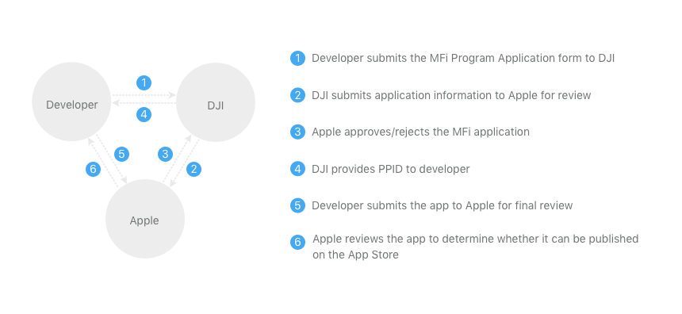
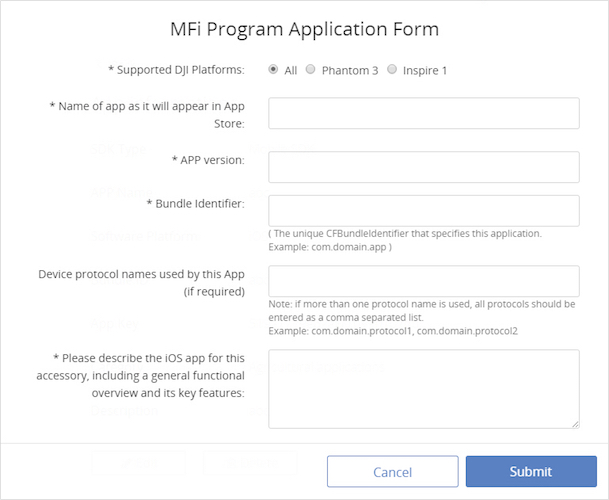
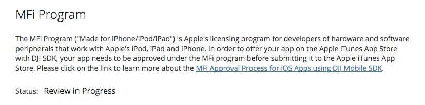
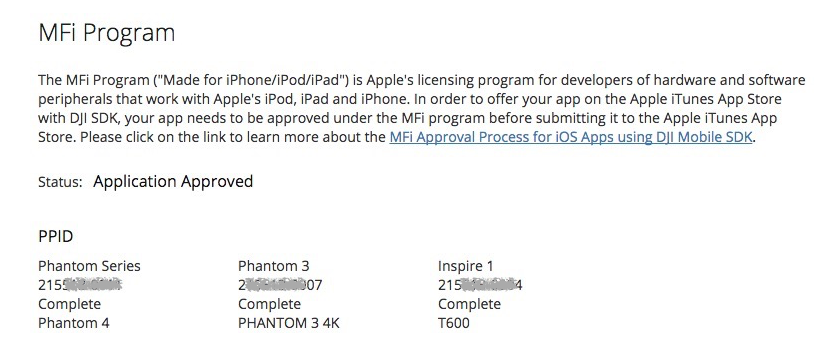
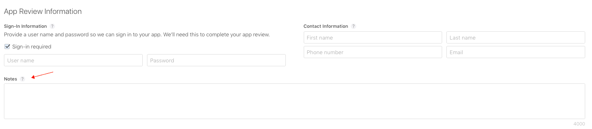

Deploying an Android application using the DJI Mobile SDK does not require any additional steps outside of the typical process.

iOS applications however require proper Xcode configuration as well as MFI accessory authorization.

## Xcode Configuration

A workaround for an App Store submission bug when archiving universal binaries is required:

* Create a new "Run Script Phase" in the application target's "Build Phases"
* Paste the following in the script text field: `bash "${BUILT_PRODUCTS_DIR}/${FRAMEWORKS_FOLDER_PATH}/DJISDK.framework/strip-frameworks.sh"`

  

## MFI Authorization

DJI's products that require an Apple Lightning connection to an iOS mobile device are MFi accessories. Applications that use MFi accessories need authorization from Apple to do so.

Therefore, an application needs to go through the MFi Program Application process before being released on the App Store. This process requires communication between the developer, DJI and Apple and can take several weeks to complete if no challenges come up.

#### How to Apply for the MFi Program

 

The picture above shows the six steps for applying for the MFi Program.

##### 1. Developer Submits the MFi Program Application Form to DJI

Login into the **User Center** at <a href="http://developer.dji.com" target="_blank"> http://developer.dji.com </a> and complete the MFi Program Application Form for the specific application to be released.

##### 2. DJI Submits App Information to Apple for Review

After receiving the application form, DJI will record the application information and send to Apple for review.

##### 3. Apple Approves/Rejects the MFi Application

Typically it takes up to ten business days for Apple to finish the review process. Once approved, a MFi PPID (Product Plan Identification) will be provided by Apple. 

##### 4. DJI Provides PPID to Developer

The PPID will appear in the status bar of the DJI developer User Center. 

##### 5. Developer Submits the App to Apple for Final Review

During the application submission process, enter the PPID in the **Notes** section of the App Review Information webpage:

##### 6. Apple reviews the App to determine whether it can be published on the App Store

The normal Apple review process proceeds.