The examples below import the DJI SDK into a new iOS and Android project. The same steps can be used for integration into an existing application.

## Xcode Project Integration

Screenshots in this section are generated using Xcode 7.3.

### Create a New Application

   * Open Xcode.
   * Select **File->New->Project**.
   * Choose **Single View Application** template.
   * Press **Next**.
        
   * "ImportSDKDemo" will be used as the **Product Name**.
   * Other settings can remain as default.
      

### Install SDK with CocoaPods in the Project

   * In Finder, navigate to the root folder of the project, and create a **Podfile**. To learn more about Cocoapods, please check [this guide](https://guides.cocoapods.org/using/getting-started.html#getting-started).
   * Replace the content of the **Podfile** with the followings:

   ~~~
    # platform :ios, '9.0'

    target 'ImportSDKDemo' do
    pod 'DJI-SDK-iOS', '~> 4.11.1’
    end
   ~~~

   * Run the following command in the root folder path:

   ~~~
    pod install
   ~~~

   * If you install the SDK successfully, you should get the messages similar to the following:

   ~~~
    Analyzing dependencies
    Downloading dependencies
    Installing DJI-SDK-iOS (4.11.1)
    Generating Pods project
    Integrating client project

    [!] Please close any current Xcode sessions and use `ImportSDKDemo.xcworkspace` for this project from now on.
    Pod installation complete! There is 1 dependency from the Podfile and 1 total pod
    installed.
   ~~~

   * The DJI SDK framework should now be downloaded and placed in the `Pods/DJI-SDK-iOS/iOS_Mobile_SDK/DJISDK.framework` path.

### Configure Build Settings

   * Open the **ImportSDKDemo.xcworkspace** file in Xcode.
   * For DJI products that connect to the mobile device through USB, add the "Supported external accessory protocols" key to the **info.plist** file, and add the strings "com.dji.video", "com.dji.protocol" and "com.dji.common" to the key.
   
   * Since iOS 9, App Transport Security has blocked cleartext HTTP (http://) resource loading. The "App Transport Security Settings" key must be added and "Allow Arbitrary Loads" must be set to "YES".
   
   * For Xcode project which uses Swift 3 above, please delete all the paths in **Header Search Paths** except `$(PODS_ROOT)/Headers/Public` in **Build Settings** to help fix the Swift compiler error.
   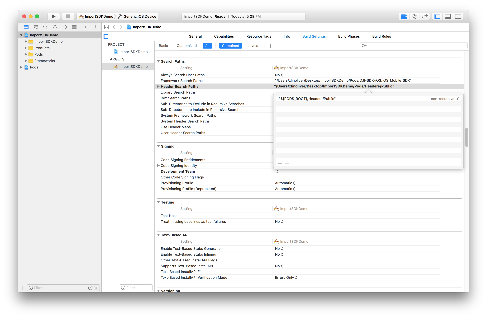
   > Note: The Swift compiler error looks like this: **Inclue of non-modular header inside framework module 'DJISDK'**.
   >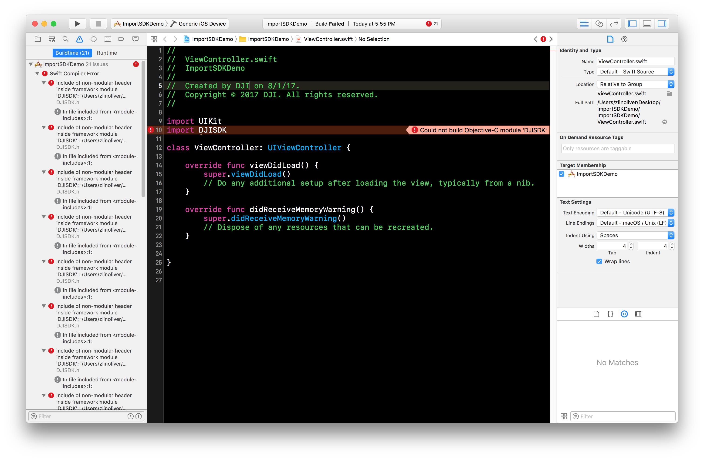

### Register Application

   * Import the DJI SDK header file into `ViewController.m`.
   * Give the view controller the `DJISDKManagerDelegate` protocol to follow.

~~~objc
#import "ViewController.h"
#import <DJISDK/DJISDK.h>

@interface ViewController ()<DJISDKManagerDelegate>
@end
~~~

   * Create a new method `registerApp`.
   * Use the application's Bundle Identifier to [generate an App Key](../quick-start/index.html#Generate-an-App-Key).
   * Create a `DJISDKAppKey` key in the **info.plist** file of the Xcode project and paste the generated App Key string into its string value:

   

   * Invoke `registerApp` in `viewDidAppear` as shown below:

~~~objc
- (void)viewDidAppear:(BOOL)animated
{
    [super viewDidAppear:animated];
    [self registerApp];
}

- (void)registerApp
{
   [DJISDKManager registerAppWithDelegate:self];
}
~~~

   * The `DJISDKManagerDelegate` protocol requires the`appRegisteredWithError` method to be implemented.
   * Additionally implement `showAlertViewWithTitle` to give the registration result in a simple view.

~~~objc
- (void)appRegisteredWithError:(NSError *)error
{
    NSString* message = @"Register App Successed!";
    if (error) {
        message = @"Register App Failed! Please enter your App Key in the plist file and check the network.";
    }else
    {
        NSLog(@"registerAppSuccess");
    }

    [self showAlertViewWithTitle:@"Register App" withMessage:message];
}

- (void)showAlertViewWithTitle:(NSString *)title withMessage:(NSString *)message
{
    UIAlertController *alert = [UIAlertController alertControllerWithTitle:title message:message preferredStyle:UIAlertControllerStyleAlert];
    UIAlertAction *okAction = [UIAlertAction actionWithTitle:@"OK" style:UIAlertActionStyleDefault handler:nil];
    [alert addAction:okAction];
    [self presentViewController:alert animated:YES completion:nil];
}
~~~

### Run Import SDK Demo

The **ImportSDKDemo** project can now be run. You can download the sample code of this project from Github: <a href="https://github.com/DJI-Mobile-SDK-Tutorials/iOS-ImportAndActivateSDKInXcode" target="_blank">Objective-C</a> | <a href="https://github.com/DJI-Mobile-SDK-Tutorials/iOS-ImportAndActivateSDKInXcode-Swift" target="_blank">Swift</a>.

As this application is only checking for registration and not interacting directly with a product, no product needs to be connected to the application for this to run. Therefore, the application can either be run on a mobile device (with or without a DJI product connected) or in the iOS simulator. The application will need internet connectivity to perform registration successfully.

If the App Key was generated correctly and the iOS simulator or mobile device has internet connectivity, then the following should be seen:

   

## Android Studio Project Integration

Screenshots in this section are generated using Android Studio 3.0.

### Create a New Application

A new application can be used to show how to integrate the DJI SDK into an Android Studio project.

   * Open Android Studio and at the initial screen select **Start a new Android Studio project**

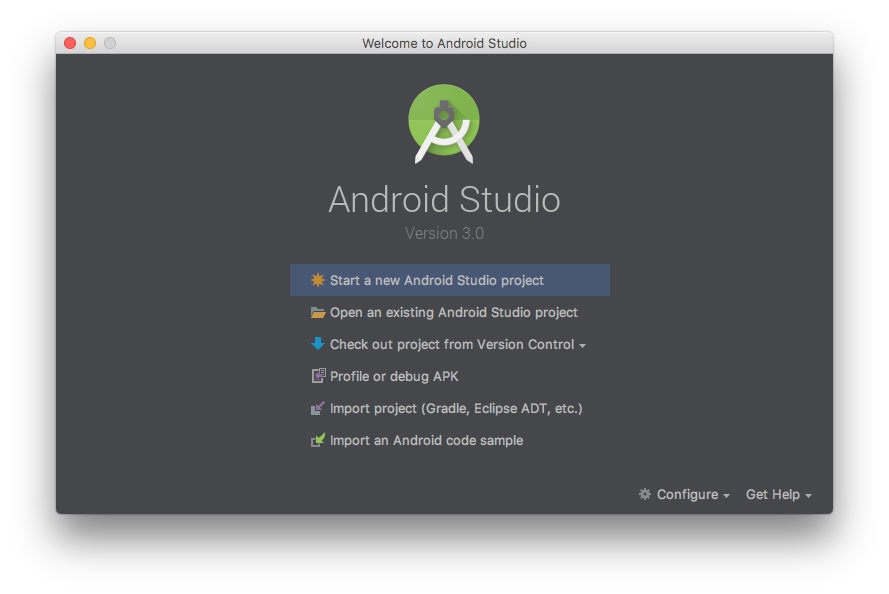

   * In the **New Project** screen:
      * Set the **Application name** to "ImportSDKDemo".
      * Set the **Company Domain** and **Package name** to "com.dji.ImportSDKDemo".

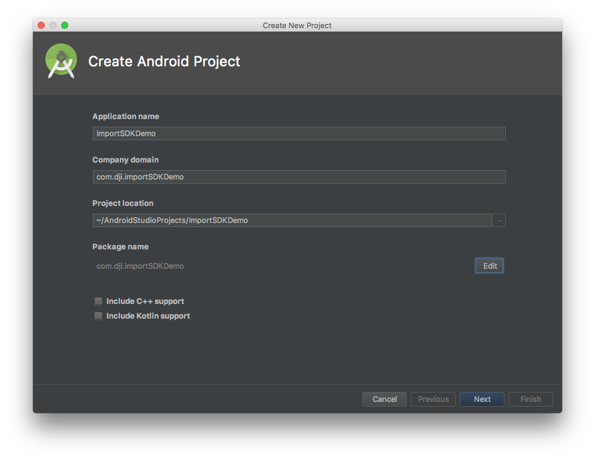

> **Note:** **Package name** is the identifying string required to [generate an App Key](../quick-start/index.html#Generate-an-App-Key).
> The activity java, manifest xml and Gradle script code below assumes **Package name** is "com.dji.ImportSDKDemo"

   * In the **Target Android Devices** screen:
     - Select **Phone and Tablet** form factor.
     - Choose **API 19: Android 4.4 (KitKat)**.

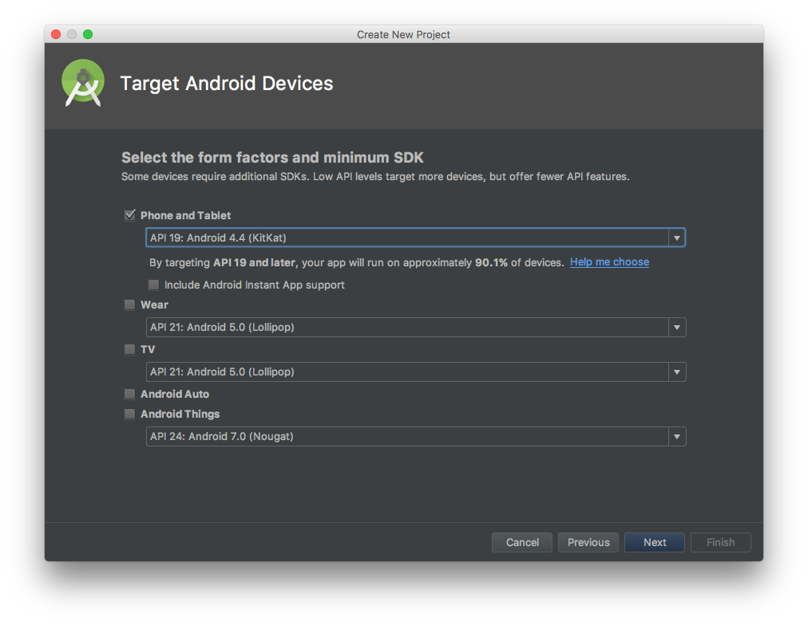

   * In the **Add an Activity to Mobile** screen choose **Empty Activity**.

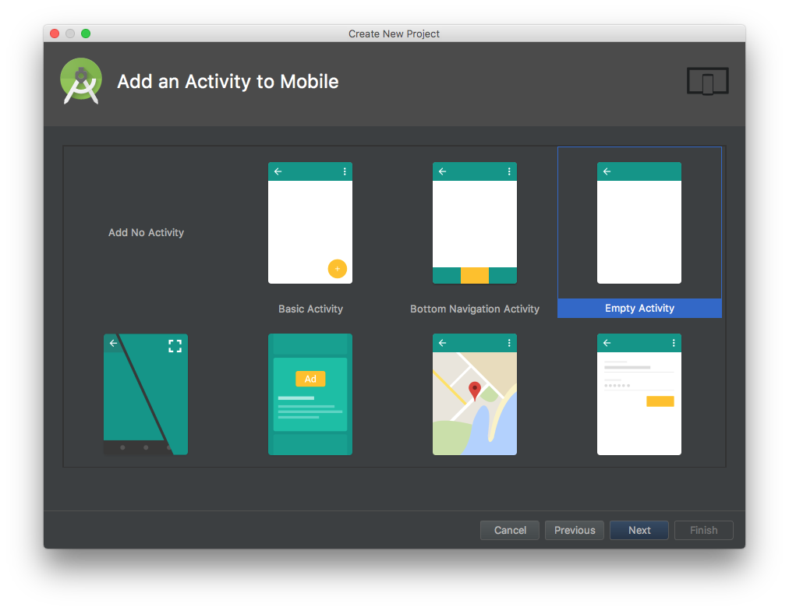

   * In the **Configure Activity** screen:
      * Set **Activity Name:** to "MainActivity".
      * Ensure **Generate Layout File** is checked.
      * Set **Layout Name:** to "activity_main".
      * Click **Finish** when done.

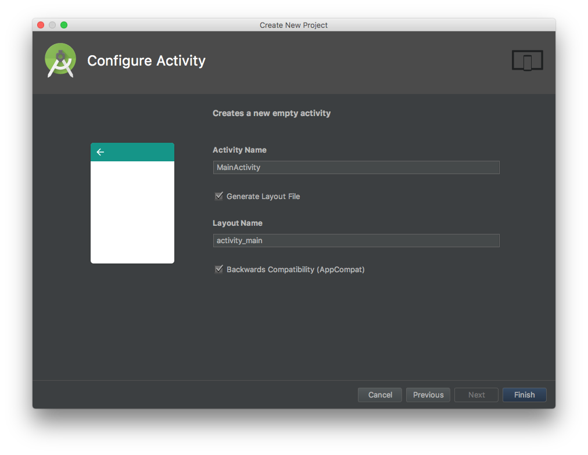

### Configure Gradle Script

  * In **Gradle Scripts** double click on **build.gradle (Module: app)**

  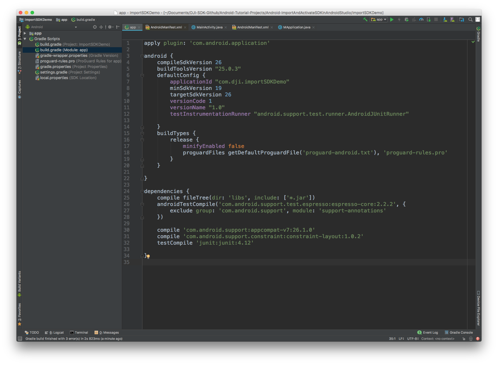

  * Update the content with the following:

~~~gradle
apply plugin: 'com.android.application'

android {

    ...
    defaultConfig {
        ...
    }

    ...

    packagingOptions{
        doNotStrip "*/*/libdjivideo.so"
        doNotStrip "*/*/libSDKRelativeJNI.so"
        doNotStrip "*/*/libFlyForbid.so"
        doNotStrip "*/*/libduml_vision_bokeh.so"
        doNotStrip "*/*/libyuv2.so"
        doNotStrip "*/*/libGroudStation.so"
        doNotStrip "*/*/libFRCorkscrew.so"
        doNotStrip "*/*/libUpgradeVerify.so"
        doNotStrip "*/*/libFR.so"
        doNotStrip "*/*/libDJIFlySafeCore.so"
        doNotStrip "*/*/libdjifs_jni.so"
        doNotStrip "*/*/libsfjni.so"
        exclude 'META-INF/rxjava.properties'
    }
}

dependencies {
   ...
    compile ('com.dji:dji-sdk:4.11.1')
    provided ('com.dji:dji-sdk-provided:4.11.1')
}
~~~

* The main changes should be:

   * Add the `packagingOptions` to prevent any unexpected crash of the application.
   * Add the `compile` and `provided` dependencies to import the latest DJI Android SDK Maven dependency.

   
   * Select **Tools -> Android -> Sync Project with Gradle Files** and wait for Gradle project sync to finish.

* Double Check Maven Dependency

  * Select **File->Project Structure** in the Android Studio menu to open the "Project Structure" window. Then select the "app" module and click the **Dependencies** tab. You should see the latest DJI SDK compile and provided denpendencies are already imported.

  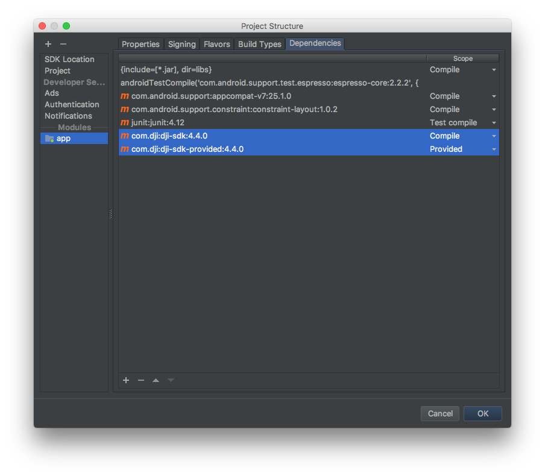

### Implement App Registration and SDK Callbacks

Right click on the `com.dji.importSDKDemo`, and select **New->Java Class** to create a new java class and name it as "MApplication".

  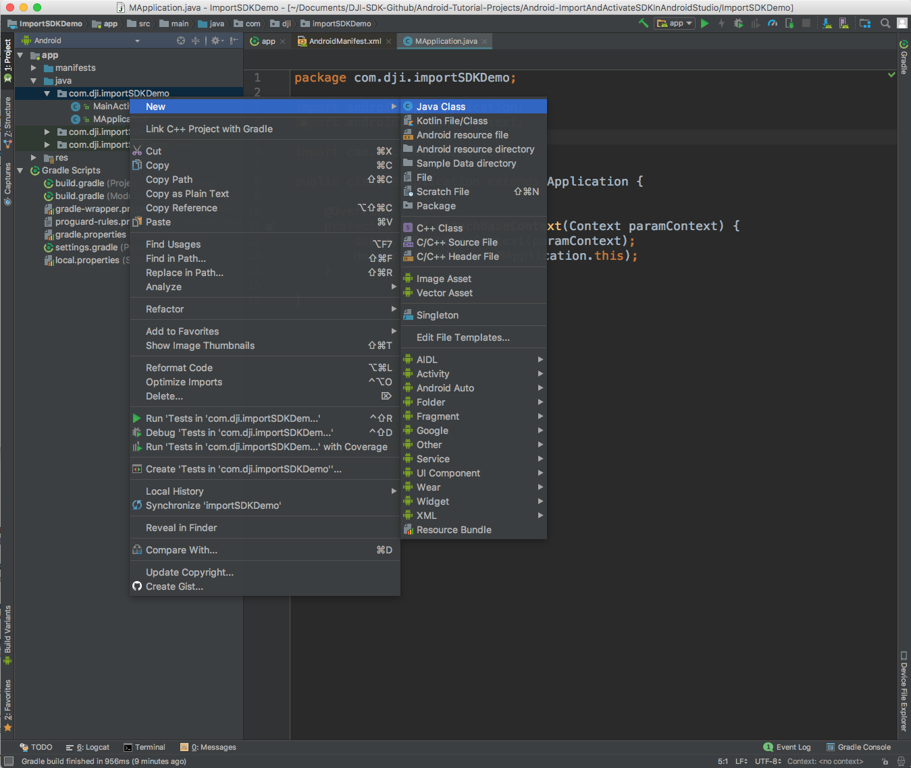

Open the **MApplication.java** file and replace the content with the following:

~~~java
package com.dji.importSDKDemo;

import android.app.Application;
import android.content.Context;

import com.secneo.sdk.Helper;

public class MApplication extends Application {

    @Override
    protected void attachBaseContext(Context paramContext) {
        super.attachBaseContext(paramContext);
        Helper.install(MApplication.this);
    }

}
~~~

Here we override the `attachBaseContext()` method to add the `Helper.install(MApplication.this);` line of code.

> **Note**: Since some of SDK classes now need to be loaded before using, the loading process is done by `Helper.install()`. Developer needs to invoke this method before using any SDK functionality. Failing to do so will result in unexpected crashes.

  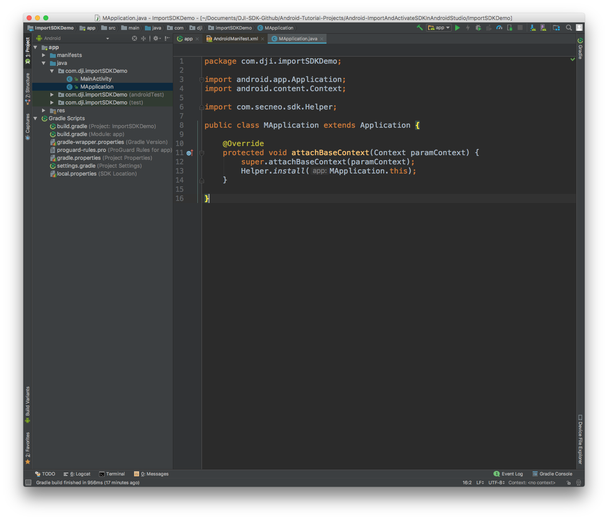

Double click on **MainActivity.java** in the **app** module.
  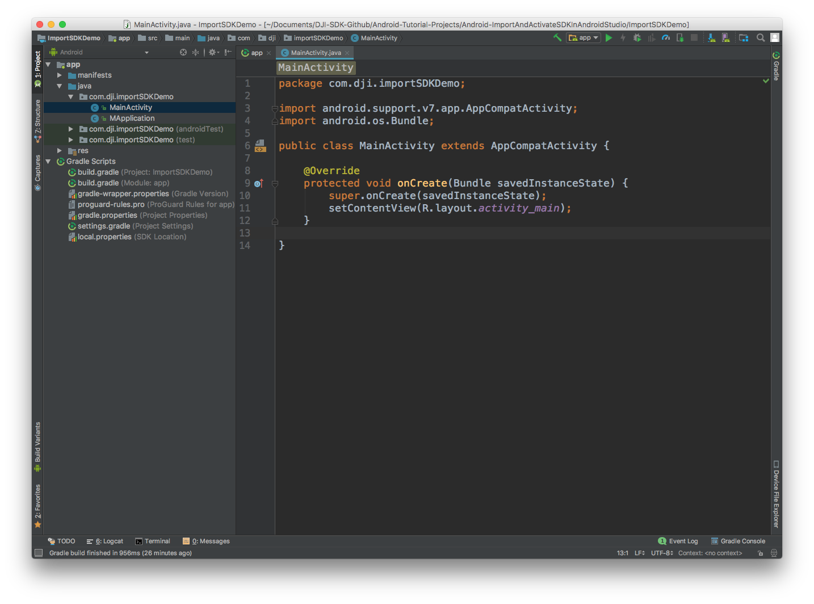

The MainActivity class needs to register the application to get authorization to use the DJI Mobile SDK. It also needs to implement callback methods expected by the SDK.

The MainActivity class will first be modified to include several class variables including `mProduct` which is the object that represents the DJI product connected to the mobile device.

Additionally the `onCreate` method will be modified to invoke the `checkAndRequestPermissions` method to check and request runtime permissions. Also, the `checkAndRequestPermissions` method will help to invoke the `startSDKRegistration()` method to register the application. Moreover, the override `onRequestPermissionsResult` method will help to check if the application has enough permission, if so, invoke the `startSDKRegistration()` method to register the application.

Now, replace the MainActivity class with:

~~~java
public class MainActivity extends AppCompatActivity {

    private static final String TAG = MainActivity.class.getName();
    public static final String FLAG_CONNECTION_CHANGE = "dji_sdk_connection_change";
    private static BaseProduct mProduct;
    private Handler mHandler;

    private static final String[] REQUIRED_PERMISSION_LIST = new String[]{
            Manifest.permission.VIBRATE,
            Manifest.permission.INTERNET,
            Manifest.permission.ACCESS_WIFI_STATE,
            Manifest.permission.WAKE_LOCK,
            Manifest.permission.ACCESS_COARSE_LOCATION,
            Manifest.permission.ACCESS_NETWORK_STATE,
            Manifest.permission.ACCESS_FINE_LOCATION,
            Manifest.permission.CHANGE_WIFI_STATE,
            Manifest.permission.WRITE_EXTERNAL_STORAGE,
            Manifest.permission.BLUETOOTH,
            Manifest.permission.BLUETOOTH_ADMIN,
            Manifest.permission.READ_EXTERNAL_STORAGE,
            Manifest.permission.READ_PHONE_STATE,
    };
    private List<String> missingPermission = new ArrayList<>();
    private AtomicBoolean isRegistrationInProgress = new AtomicBoolean(false);
    private static final int REQUEST_PERMISSION_CODE = 12345;

    @Override
    protected void onCreate(Bundle savedInstanceState) {
        super.onCreate(savedInstanceState);

        // When the compile and target version is higher than 22, please request the following permission at runtime to ensure the SDK works well.
        if (Build.VERSION.SDK_INT >= Build.VERSION_CODES.M) {
            checkAndRequestPermissions();
        }

        setContentView(R.layout.activity_main);

        //Initialize DJI SDK Manager
        mHandler = new Handler(Looper.getMainLooper());

    }

    /**
     * Checks if there is any missing permissions, and
     * requests runtime permission if needed.
     */
    private void checkAndRequestPermissions() {
        // Check for permissions
        for (String eachPermission : REQUIRED_PERMISSION_LIST) {
            if (ContextCompat.checkSelfPermission(this, eachPermission) != PackageManager.PERMISSION_GRANTED) {
                missingPermission.add(eachPermission);
            }
        }
        // Request for missing permissions
        if (missingPermission.isEmpty()) {
            startSDKRegistration();
        } else if (Build.VERSION.SDK_INT >= Build.VERSION_CODES.M) {
            showToast("Need to grant the permissions!");
            ActivityCompat.requestPermissions(this,
                    missingPermission.toArray(new String[missingPermission.size()]),
                    REQUEST_PERMISSION_CODE);
        }

    }

    /**
     * Result of runtime permission request
     */
    @Override
    public void onRequestPermissionsResult(int requestCode,
                                           @NonNull String[] permissions,
                                           @NonNull int[] grantResults) {
        super.onRequestPermissionsResult(requestCode, permissions, grantResults);
        // Check for granted permission and remove from missing list
        if (requestCode == REQUEST_PERMISSION_CODE) {
            for (int i = grantResults.length - 1; i >= 0; i--) {
                if (grantResults[i] == PackageManager.PERMISSION_GRANTED) {
                    missingPermission.remove(permissions[i]);
                }
            }
        }
        // If there is enough permission, we will start the registration
        if (missingPermission.isEmpty()) {
            startSDKRegistration();
        } else {
            showToast("Missing permissions!!!");
        }
    }
}
~~~

The `registerApp()` method of `DJISDKManager` has a callback that needs to process two methods for processing the application registration result, and for when the product connected to the mobile device is changed.

Continue to add the `startSDKRegistration()` method as shown below and implement the `onRegister()`, `onProductDisconnect()`, `onProductConnect()`, `onComponentChange()`, `onInitProcess()` and `onDatabaseDownloadProgress()` methods of the `SDKManagerCallback`:

~~~java
private void startSDKRegistration() {
    if (isRegistrationInProgress.compareAndSet(false, true)) {
        AsyncTask.execute(new Runnable() {
            @Override
            public void run() {
                showToast("registering, pls wait...");
                DJISDKManager.getInstance().registerApp(MainActivity.this.getApplicationContext(), new DJISDKManager.SDKManagerCallback() {
                    @Override
                    public void onRegister(DJIError djiError) {
                        if (djiError == DJISDKError.REGISTRATION_SUCCESS) {
                            showToast("Register Success");
                            DJISDKManager.getInstance().startConnectionToProduct();
                        } else {
                            showToast("Register sdk fails, please check the bundle id and network connection!");
                        }
                        Log.v(TAG, djiError.getDescription());
                    }

                    @Override
                    public void onProductDisconnect() {
                        Log.d(TAG, "onProductDisconnect");
                        showToast("Product Disconnected");
                        notifyStatusChange();

                    }
                    @Override
                    public void onProductConnect(BaseProduct baseProduct) {
                        Log.d(TAG, String.format("onProductConnect newProduct:%s", baseProduct));
                        showToast("Product Connected");
                        notifyStatusChange();

                    }
                    @Override
                    public void onComponentChange(BaseProduct.ComponentKey componentKey, BaseComponent oldComponent,
                                                  BaseComponent newComponent) {

                        if (newComponent != null) {
                            newComponent.setComponentListener(new BaseComponent.ComponentListener() {

                                @Override
                                public void onConnectivityChange(boolean isConnected) {
                                    Log.d(TAG, "onComponentConnectivityChanged: " + isConnected);
                                    notifyStatusChange();
                                }
                            });
                        }
                        Log.d(TAG,
                                String.format("onComponentChange key:%s, oldComponent:%s, newComponent:%s",
                                        componentKey,
                                        oldComponent,
                                        newComponent));

                    }
                    @Override
                    public void onInitProcess(DJISDKInitEvent djisdkInitEvent, int i) {

                    }

                    @Override
                    public void onDatabaseDownloadProgress(long l, long l1) {

                    }
                });
            }
        });
    }
}
~~~

Finally methods for `notifyStatusChange`, `Runnable` and `showToast` need to be implemented:

~~~java
private void notifyStatusChange() {
    mHandler.removeCallbacks(updateRunnable);
    mHandler.postDelayed(updateRunnable, 500);
}

private Runnable updateRunnable = new Runnable() {

    @Override
    public void run() {
        Intent intent = new Intent(FLAG_CONNECTION_CHANGE);
        sendBroadcast(intent);
    }
};

private void showToast(final String toastMsg) {

    Handler handler = new Handler(Looper.getMainLooper());
    handler.post(new Runnable() {
        @Override
        public void run() {
            Toast.makeText(getApplicationContext(), toastMsg, Toast.LENGTH_LONG).show();
        }
    });

}
~~~

The application must be granted permissions to in order for the DJI SDK to operate.

  * Double click on **AndroidManifest.xml** in the **app** module.
   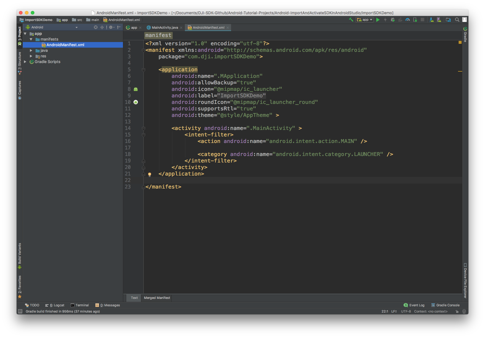

  * After `package=com.dji.ImportSDKDemo` and before `<application` insert:

~~~xml
<!-- Permissions and features -->
<uses-permission android:name="android.permission.BLUETOOTH" />
<uses-permission android:name="android.permission.BLUETOOTH_ADMIN" />
<uses-permission android:name="android.permission.VIBRATE" />
<uses-permission android:name="android.permission.INTERNET" />
<uses-permission android:name="android.permission.ACCESS_WIFI_STATE" />
<uses-permission android:name="android.permission.WAKE_LOCK" />
<uses-permission android:name="android.permission.ACCESS_COARSE_LOCATION" />
<uses-permission android:name="android.permission.ACCESS_NETWORK_STATE" />
<uses-permission android:name="android.permission.ACCESS_FINE_LOCATION" />
<uses-permission android:name="android.permission.CHANGE_WIFI_STATE" />
<uses-permission android:name="android.permission.MOUNT_UNMOUNT_FILESYSTEMS" />
<uses-permission android:name="android.permission.WRITE_EXTERNAL_STORAGE" />
<uses-permission android:name="android.permission.READ_EXTERNAL_STORAGE" />
<uses-permission android:name="android.permission.SYSTEM_ALERT_WINDOW" />
<uses-permission android:name="android.permission.READ_PHONE_STATE" />

<uses-feature android:name="android.hardware.camera" />
<uses-feature android:name="android.hardware.camera.autofocus" />
<uses-feature
    android:name="android.hardware.usb.host"
    android:required="false" />
<uses-feature
    android:name="android.hardware.usb.accessory"
    android:required="true" />

<!-- Permissions and features -->
~~~

  * Add the `android:name=".MApplication"` at the beginning of the `application` element:

~~~xml
<application
    android:name=".MApplication"
    android:allowBackup="true"
    android:icon="@mipmap/ic_launcher"
    android:label="@string/app_name"
    android:roundIcon="@mipmap/ic_launcher_round"
    android:supportsRtl="true"
    android:theme="@style/AppTheme" >
~~~

  * Insert the following after `android:theme="@style/AppTheme">` and before `<activity android:name=".MainActivity">`:

~~~xml
<!-- DJI SDK -->
<uses-library android:name="com.android.future.usb.accessory" />
<meta-data
    android:name="com.dji.sdk.API_KEY"
    android:value="Please enter your App Key here." />
<activity
    android:name="dji.sdk.sdkmanager.DJIAoaControllerActivity"
    android:theme="@android:style/Theme.Translucent" >
    <intent-filter>
        <action android:name="android.hardware.usb.action.USB_ACCESSORY_ATTACHED" />
    </intent-filter>
    <meta-data
        android:name="android.hardware.usb.action.USB_ACCESSORY_ATTACHED"
        android:resource="@xml/accessory_filter" />
</activity>
<service android:name="dji.sdk.sdkmanager.DJIGlobalService" >
</service>
<!-- DJI SDK -->
~~~

  * Insert the `android:configChanges="orientation"` and `android:screenOrientation="portrait"` in the `activity` element as shown below to prevent the activity restarts when the screen orientation changes and also set the activity's screen orientation as portrait mode:

~~~xml
<activity android:name=".MainActivity"
          android:configChanges="orientation"
          android:screenOrientation="portrait">
    <intent-filter>
        <action android:name="android.intent.action.MAIN" />

        <category android:name="android.intent.category.LAUNCHER" />
    </intent-filter>
</activity>
~~~

[Generate an App Key](../quick-start/index.html#Generate-an-App-Key), and replace "Please enter your App Key here." with the App Key string.

### Run Import SDK Demo

The **ImportSDKDemo** project can now be run. You can download the sample code of this project from <a href="https://github.com/DJI-Mobile-SDK-Tutorials/Android-ImportAndActivateSDKInAndroidStudio" target="_blank">Github</a>.

As this application is only checking for registration and not interacting directly with a product, no product needs to be connected to the application for this to run. Therefore, the application can either be run on a mobile device (with or without a DJI product connected) or in the Android simulator. The application will need internet connectivity to perform registration successfully.

If the App Key was generated correctly and the Android simulator or mobile device has internet connectivity, then the following should be seen:

### FFmpeg License

The DJI Android SDK is dynamically linked with unmodified libraries of <a href=http://ffmpeg.org>FFmpeg</a> licensed under the <a href=http://www.gnu.org/licenses/old-licenses/lgpl-2.1.html>LGPLv2.1</a>. The source code of these FFmpeg libraries, the compilation instructions, and the LGPL v2.1 license are provided in [Github](https://github.com/dji-sdk/FFmpeg).
