## How to Capture a Picture

To understand the photography concepts of exposure, aperture, shutter, ISO and focal length it can be useful to consider how a picture is captured.

### Capture Light

When light is incident on an object, it will usually scatter or reflect in all directions. 
<html>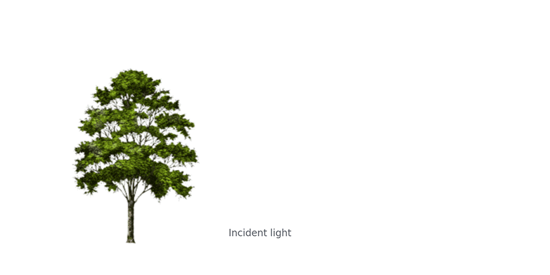</html>

The animation shows just two incident light beams on an object, effectively illuminating two features. In reality light is incident on the entire object, with all light from all features being scattered into space. A single point in space in front of the object will receive light from all features it can see - overlaid on each other. However the simplification of just a few object features being illuminated is easier to visualize. 

Therefore with the exception of active light sources (like a light bulb, computer display or the sun), seeing an object means seeing the light reflected from it. 

To capture a picture, a device that is sensitive to and can record light is needed (a light sensor). In digital cameras, this device is a rectangular piece of silicon that has a grid of light detectors on it. Each light detector records how much light is incident on it, and is a single pixel in your final picture.

However, if you just put the sensor next to the object you want to capture a picture of, you won't recognize the resulting picture. As each pixel can see each feature of the object, then each pixel will almost look the same. 

The image becomes a constant color of all light combined:

<html>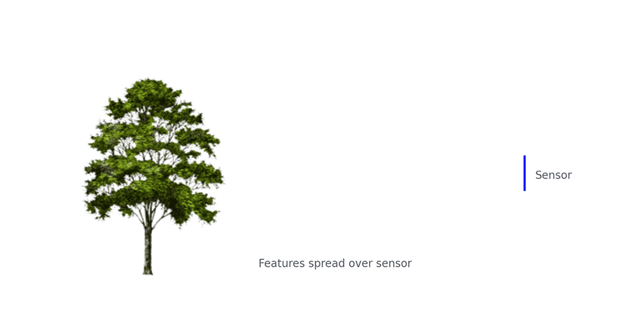</html>

### Resolve the Image

To resolve the image, it is required that light from each feature of the scene only hit one small part of the sensor, or one pixel. This can be achieved by covering the sensor and putting a small hole or **aperture** in the cover to let light through.

<html>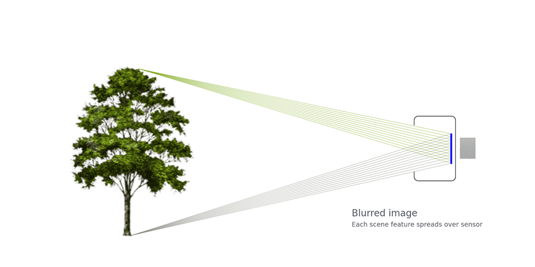</html>

Now, each pixel of the sensor, sees a different part of the scene, and therefore the picture will be completely recognizable, though also upside down.

When very small, the aperture restricts the amount of light hitting the sensor to a minimum, but also lets the camera capture the entire scene in focus, as each pixel can only see a small part (feature) of the scene.

### Capture Time

If the camera or the scene moves a little bit, the features will be captured by a different pixel. This spreading of the features over multiple pixels will start to blur the image, and significant movement will once again make the picture completely unrecognizable.

Therefore, the sensor can only be exposed to the scene for a short period of time. The shorter this period of time, the less chance the image will be blurred, as the less relative motion the scene or camera will have.

Between the sensor and the aperture is a **shutter**. The shutter is normally shut, blocking all light to the sensor. It will momentarily open and close, exposing the sensor to the light from the scene for a brief period of time. 

Light sensitive material, a shutter and a small aperture is all that's required to capture an image and is the basis of a simple camera.

### Exposure

As mentioned previously, each pixel of the sensor is a light detector. The more light that the pixel is exposed to, the brighter the pixel will be in the resulting picture. A picture that is too dark, means the sensor has been exposed to too little light, and often is called an under exposed picture. A picture that is too light, is often called over exposed. 

<html>
<table class="table-pictures">
  <tr>
    <td>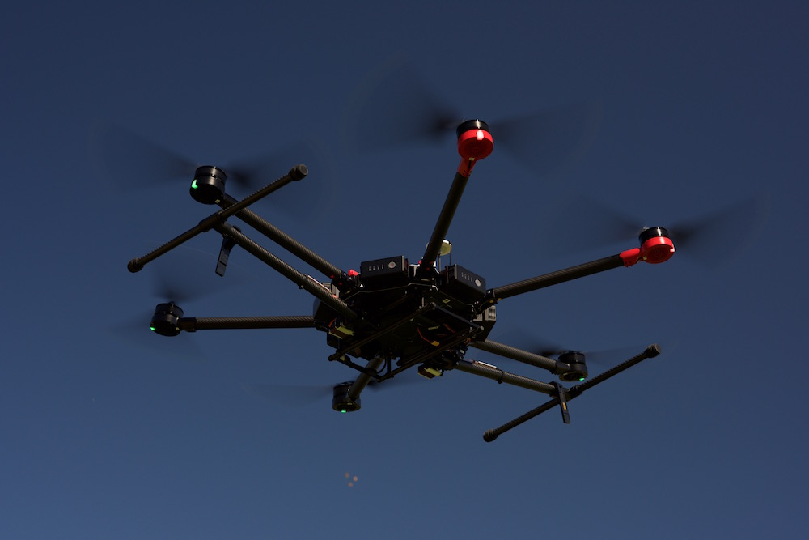</td>
    <td>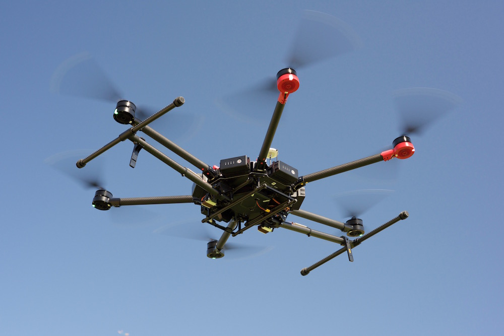</td>
        <td>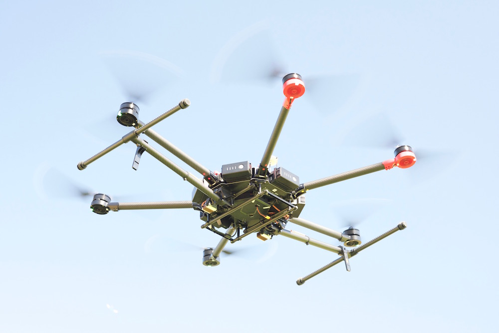</td>
  </tr>
  <tr valign="top">
    <td align="center">Under Exposed </td>
    <td align="center">Good Exposure </td>
    <td align="center">Over Exposed </td>
  </tr>
</table>
</html>

One of the keys to a great, recognizable picture is to get the **exposure** just right. Not too dark, not too light. If the shutter is opened and closed very quickly, the aperture is very small and the scene is not well lit, then each pixel will only be exposed to a small amount of light and the resulting picture may be under exposed. 

Exposure is usually described in **stops**, which is a relative measure where **one stop describes a doubling or halving of light**. Increasing the exposure by **one stop** is achieved by doubling the amount of light on the sensor. 

Thinking about exposure in stops is convenient when using different methods to control the exposure. Doubling the light (increasing the exposure by one stop) with method A can be compensated for by halving the light (decreasing the exposure by one stop) with method B.

So, how can exposure be changed?

### Shutter Speed

How long the shutter stays open controls how much light is incident on the sensor in time. Therefore a slower (longer) shutter speed will increase the exposure while a faster (shorter) shutter speed will decrease the exposure. 

While a slower shutter speed will increase exposure, the trade-off is potential blur in the image due to scene or camera movement. The two pictures below have fast moving (propellors) and slow moving (aircraft body) features. The image of the propellors blur when there is a slow shutter speed, and are sharp when there is a fast shutter speed.

<html>
<table class="table-pictures">
  <tr>
    <td width=50%>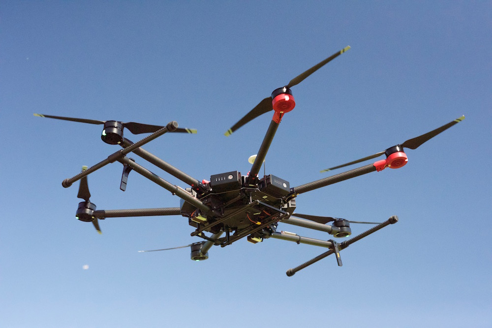</td>
    <td width=50%></td>
  </tr>
  <tr valign="top">
    <td align="center">
Shutter speed 1/8000s Aperture: f/8, ISO: 11400
</td>
    <td align="center">
Shutter speed 1/250s Aperture: f/8, ISO: 800
</td>
  </tr>
</table>
</html>

>
>**Note:** Changing the shutter speed by itself also changes the exposure. To make both images have the same exposure, another exposure control method (ISO) was changed to compensate. ISO is described in the next section.

Shutter speed is usually measured in seconds. As an example, DJI's Zenmuse X5 camera has a shutter speed range of 1/8000 seconds (fast) to 8 seconds (slow).

If the shutter is open for twice the amount of time, then exposure is doubled. Therefore doubling or halving shutter speed is the equivalent of increasing or decreasing the exposure by one stop.

### ISO

Another way to increase exposure is to amplify the light detector reading on the sensor (effectively increase the light detector sensitivity). As the reading is amplified, the resulting pixel brightness will increase, and therefore exposure increases.

However, the light detector reading is never perfect. Electronics have a small amount of noise in them which will make small changes to the reading. Sometimes the reading will be a little brighter than it should be, other times a little darker. If the light reading is much stronger than the noise changes, then the noise (small fluctuations in exposure between adjacent pixels) won't be noticeable. However, as the light reading becomes weaker, then the noise fluctuations will become obvious. 

Any amplification will not just amplify low light detector readings, but also amplify the noise in the readings, making these exposure fluctuations obvious.

This is especially the case for an image of a smooth, simple surface. Instead of all the pixels being the same exposure, they will all be a little different, which will result in a grainy effect (as you can now distinguish each pixel). 

Pixel amplification is called **ISO**. Increasing ISO will increase exposure, but will also make the noise in the image more noticeable resulting in grainy pictures. Typically ISO is set as low as possible to achieve the cleanest image and is used to increase exposure as a last resort. 

In the two pictures below (demonstrating shutter speed difference), the ISO was used to compensate for the change in exposure from the shutter. If you zoom in on the images, the noise in the high ISO image is noticeable, especially on the blue background.

<html>
<table class="table-pictures">
  <tr>
    <td width=50%>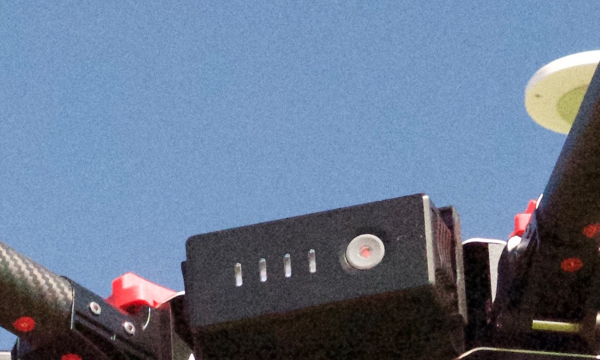</td>
    <td width=50%>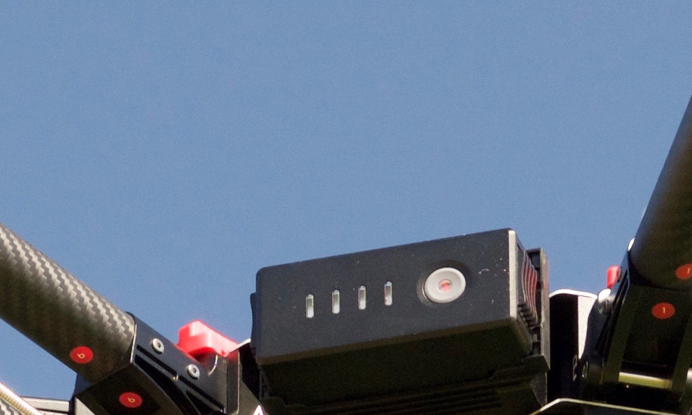</td>
  </tr>
  <tr valign="top">
    <td align="center">
ISO 11400 Aperture: f/8, Shutter: 1/8000s
</td>
    <td align="center">
ISO 800 Aperture: f/8, Shutter: 1/250s
</td>
  </tr>
</table>
</html>

> **Note:** All concepts here apply to both greyscale (monochrome) and color sensors. A color sensor is simply a greyscale sensor that has a color filter in front of it. The color filter is a film with a grid of filters that line up with each pixel. Each filter will only let through one color of light: red, green or blue. The light detector or pixel behind each filter is then only detecting the strength of the light with the specific color and can be thought of as a red, green or blue pixel.
>  
> If a picture is taken of a black scene, then the result should be very little red, green and blue light detected. If the exposure of the image is increased using amplification (ISO), then the red, green and blue pixels will all get brighter, but to slightly different levels. This means the combination of red, green, blue pixels will no longer be black, but instead be slightly red, green or blue depending on which pixel had more additive noise. 

As an example of ISO, DJI's Zenmuse X5 has an ISO range from 100 (low noise) to 25600 (high noise). The ISO number is proportional to the amount of light the sensor is exposed to. Doubling the ISO is the same as increasing the exposure by one stop.

### Aperture

Another way to increase exposure is to increase the aperture. 

Aperture is usually described in f-numbers (also called f-stops):

* The f-number describes the diameter of the aperture
* To double the amount of light, the aperture area must be doubled
* Doubling the aperture area, increases the diameter by 1.414 (square root of 2)
* Therefore to increase an aperture by one exposure stop, the f-number is increased by 1.414

However as shown [previously](#resolve-the-image), as the aperture increases each pixel will see more than one feature in the scene, causing the picture to be increasingly out of focus.  

A lens can be used to bring parts of the scene back into focus. 

<html>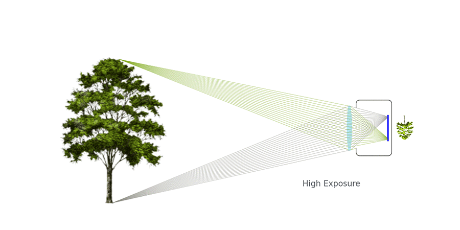</html>

Lenses however can only focus light from a fixed distance in front of it, to a fixed distance behind it. Light coming from a different distance in front of it, will focus at a different distance behind it. When a lens is used to bring a feature into focus, features at different distances to the camera will be out of focus.

<html>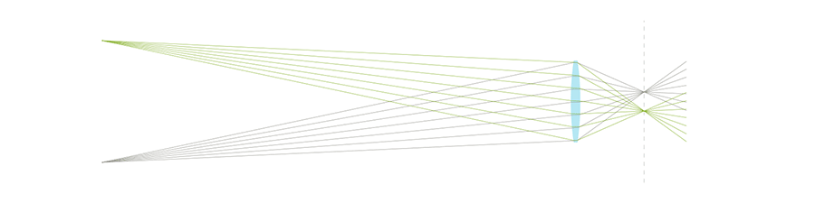</html>

Features that are in focus have more light incident on the lens and then redirected to the pixel. Features that are out of focus have light spread over more pixels. Therefore a larger aperture increases the exposure of the picture.

The difference in focus between features at different distances from the camera is known as **Depth of Field**. Features in a picture captured with a shallow depth of field become strongly out of focus (more blurred) as they change in distance from the camera. Conversely, a picture captured with a deep depth of field will have the same features more in focus.

The two images below show differences in depth of field caused by changing aperture. An M600 is flying in front of a tree. The large f/1.4 aperture creates a depth of field so shallow, that not only is the background strongly out of focus compared to the M600, but some features of the M600 that are closer to or further from the focus plane (front battery) are also slightly out of focus. 

The smaller f/16 aperture image background is significantly more in focus.

<html>
<table class="table-pictures">
  <tr>
    <td width=50%>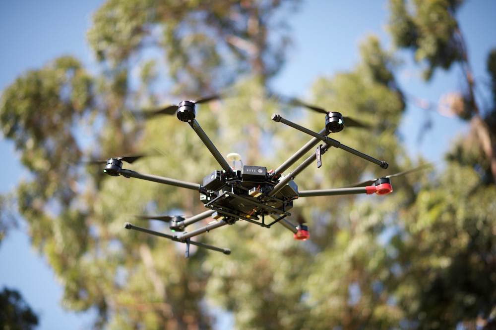</td>
    <td width=50%>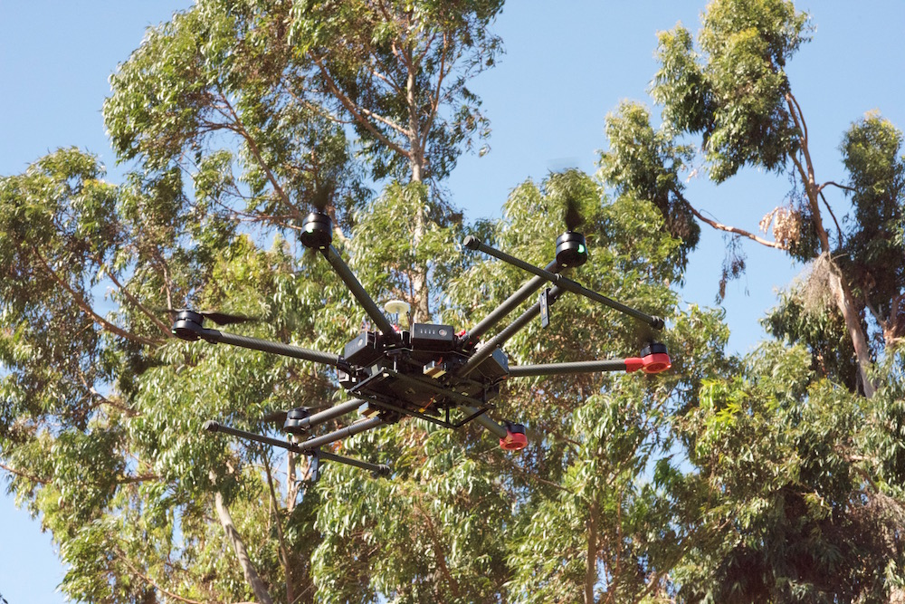</td>
  </tr>
  <tr valign="top">
    <td align="center">
Shallow Depth of Field Aperture: f/1.4 Shutter: 1/1000s, ISO 100
</td>
    <td align="center">
Deep Depth of Field Aperture: f/16 Shutter: 1/1000s, ISO: 10000
</td>
  </tr>
</table>
</html>

Depth of field can be used to highlight the subject of an image. It is easier to distinguish the M600 from the background when the background is out of focus. On the other hand, if the camera is being used to computationally map a scene with many features at different distances, it would be more appropriate to have the entire image in focus (smaller aperture, deeper depth of field).

As an example, DJI's Zenmuse X5 has an aperture adjustable from f/1.7 (large) to f/16 (small). This is a range of 6 1/3 exposure stops.

## Trade-off Between Aperture, Shutter, ISO

[Aperture](#aperture), [shutter speed](#shutter-speed) and [ISO](#iso) need to balanced to achieve a good exposure. However, when each is used to change exposure, depth of field, sharpness, and noise in the picture change.

The diagram below illustrates the effect of changing aperture, shutter and ISO and how it impacts exposure and the resulting picture.

<html>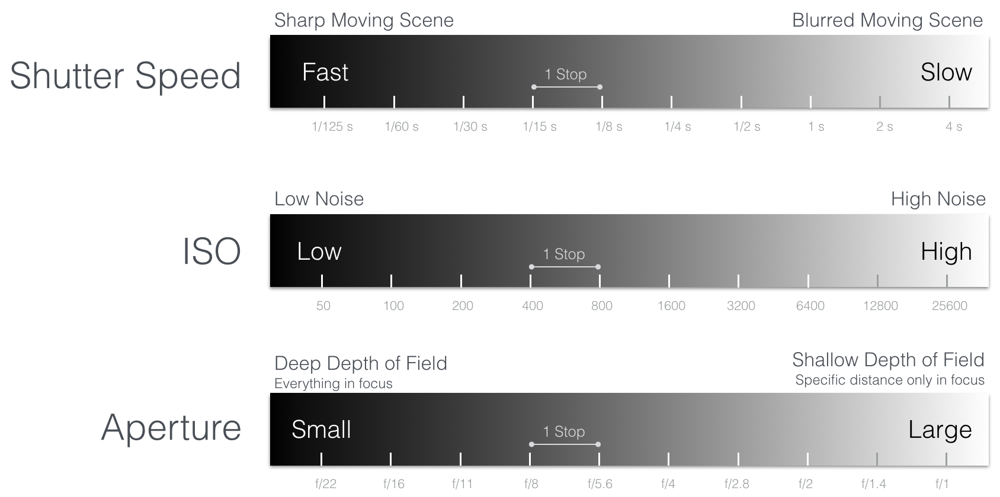</html>

To understand this trade off better, it can be useful to consider several examples.

**Example 1: A well lit, stationary scene.**
The camera receives lots of light from the scene, and underexposure is not a problem. One way to approach this is:

   * **Aperture**: Either shallow or deep depth of field can be selected. Any change in exposure can be compensated for by the shutter as the scene is stationary.
   * **ISO**: Can be set to minimum setting. Shutter will do all exposure compensation, so can minimize noise.
   * **Shutter**: The scene is stationary, so both fast and slow shutter speeds will result in a sharp picture. Shutter is simply used to get the correct exposure.

**Example 2: Poorly lit scene with moving features. Sharp picture with in focus features at different distances to the camera desired.** This example might require a compromise in the desired depth of field, sharpness or noise in the image. The "poorly lit", "moving features", "sharp picture", "features at different depths in focus" requirements compete with each other. Increasing the exposure to compensate for "poorly lit" will make capturing sharp moving features in focus more difficult. One way to approach this where the noise in the image is the most compromised:

   * **Shutter**: Set quick enough to make moving features sharp, but no quicker so the exposure can be maximized. 
   * **Aperture**: As large as possible that allows a depth of field that captures the desired features sufficiently in focus.
   * **ISO**: Finally the ISO is increased to get the correct exposure.

**Example 3: Well lit scene of flowing water. A picture that captures the movement of water by letting it blur is desired.** This example might be difficult as it will be easy to overexpose the image. One way to approach it is:

   * **ISO**: Set as low as possible to reduce noise and exposure.
   * **Aperture**: Set as small as possible to reduce exposure. As a consequence all stationary features in the scene will be in focus.
   * **Shutter**: Normally, a slow shutter would be desired to blur the movement, but as aperture and ISO have already been set to minimize exposure, there will only be one shutter speed that gives correct exposure. If the scene is very well lit, the blurring of water might not be significant.

>
>**Note:** To control over exposure and use a slower shutter speed, a neutral density (ND) filter that reduces exposure by several stops could be used on the camera lens.

**Example 4: Picture taken with correct exposure, but shutter too slow.** Scene motion is blurred in the picture as the shutter speed is too slow. One way to take the next picture is:

   * **Shutter**: Halve the shutter speed, effectively decreasing the exposure by one stop.
   * **Aperture**: Increase the aperture by 1 stop, to compensate for exposure. This assumes depth of field is not a concern.
   * **ISO**: No change.

As a final example, consider three pictures with similar exposure taken with different combinations of aperture, ISO and shutter speed.

<html>
<table class="table-pictures">
  <tr>
    <td>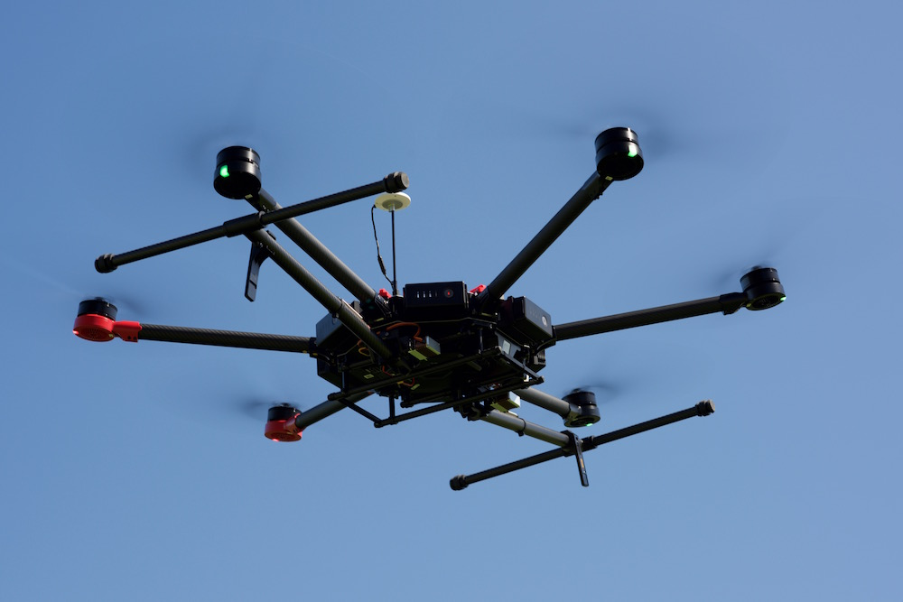</td>
    <td>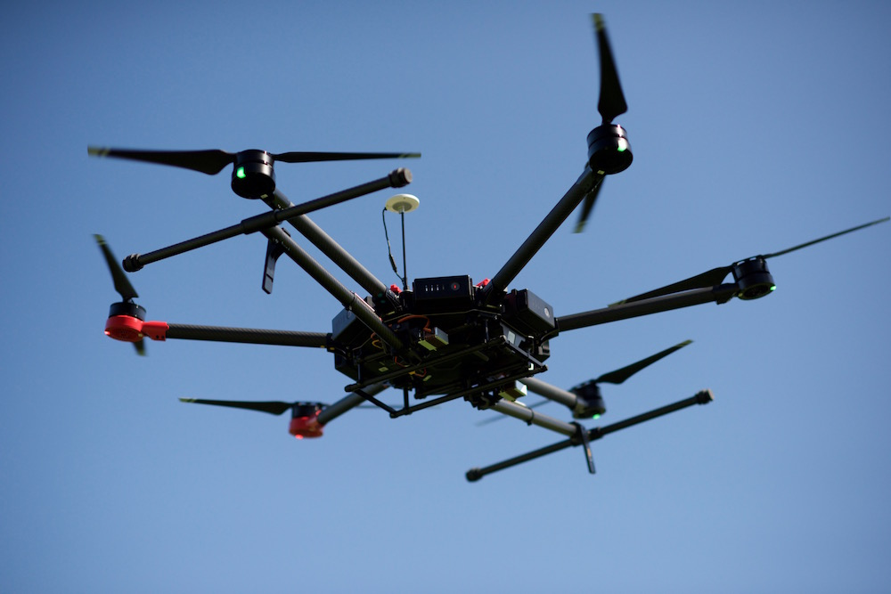</td>
        <td>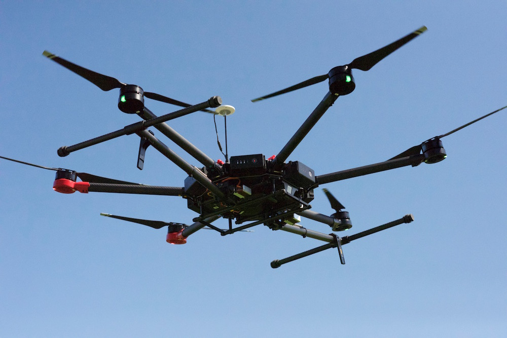</td>
  </tr>
  <tr valign="top">
    <td align="center">
<b>Aperture f/8</b> - Everything in Focus <b>Shutter 1/80s</b> - Propellors Blur <b>ISO 100</b> - Low Noise
</td>
    <td align="center">
<b>Aperture f/2</b> - Some features blurred <b>Shutter 1/8000s</b> - Propellors Sharp <b>ISO 640</b> - Relatively Low Noise
</td>
    <td align="center">
<b>Aperture f/8</b> - Everything in Focus <b>Shutter 1/8000s</b> - Propellors Sharp <b>ISO 12800</b> - High Noise
</td>
  </tr>
</table>
</html>

Calculating the difference in exposure for aperture, shutter and ISO for the second and third image relative to the first shows that all images should be approximately the same exposure (with the third being the brightest).

<html>
<table class="table-exposure">
<tr>
  <td align="center" width=10%> <b>Image </b></td>
  <td align="center" width=30%> <b>1</b> </td>
  <td align="center" width=30%> <b>2</b> </td>
  <td align="center" width=30%> <b>3</b> </td>
</tr>
<tr>
  <td align="center"> <b>Aperture </b></th>
  <td align="center">
 f/8
</td>
   <td align="center">
 Increase 4 stops  f/8->f/2
</td>
  <td align="center">
 No change to exposure f/8->f/8 
</td>
</tr>
<tr>
  <td align="center"> <b>Shutter </b></td>
  <td align="center">
 1/80s
</td>
  <td align="center">
 Decrease 62&frasl;3 stops 1/80s->1/8000s
</td>
<td align="center">
 Decrease 62&frasl;3 stops 1/80s->1/8000s
</td>
</tr>
<tr>
  <td align="center"> <b>ISO </b></td>
   <td align="center">
 100
</td>
   <td align="center">
 Increase 22&frasl;3 stops 100->640
</td>
   <td align="center">
Increase 7 stops 100->12800
</td>
</tr>
<tr>
  <td align="center"> <b>Total Change</b></td>
   <td align="center">
 - 
</td>
   <td align="center">
 0 Stops 
</td>
   <td align="center">
 Exposure increased by 1&frasl;3 stops 
</td>
</tr>
</table>
</html>

## Field of View and Focal Length

The **field of view** defines the extent of a scene a camera can capture and is measured in degrees. A larger field of view sees a larger portion of the scene, while a smaller field of view sees a smaller (but more detailed) portion of the scene. A telephoto lens with high zoom factor is a lens with a narrow field of view.

<html>

The distance between a lens and its focal plane (the sensor is at the focal plane) is called the **focal length**. The focal length is directly related to field of view. As the focal length increases, the field of view decreases (and zoom factor increases). 

In the below diagram, a lens is moved away from the sensor, increasing the focal length. When the focal length is small, the two highlighted features are captured near the middle of the sensor. As the focal length increases, the field of view narrows and the same features spread further apart on the sensor, effectively zooming into a smaller part of the scene. 

Focal length is related to field of view based on sensor size. The diagram above also shows a smaller sensor will have a narrower field of view. Focal lengths are commonly referenced to a full frame sensor (35mm sensor).
  
<html>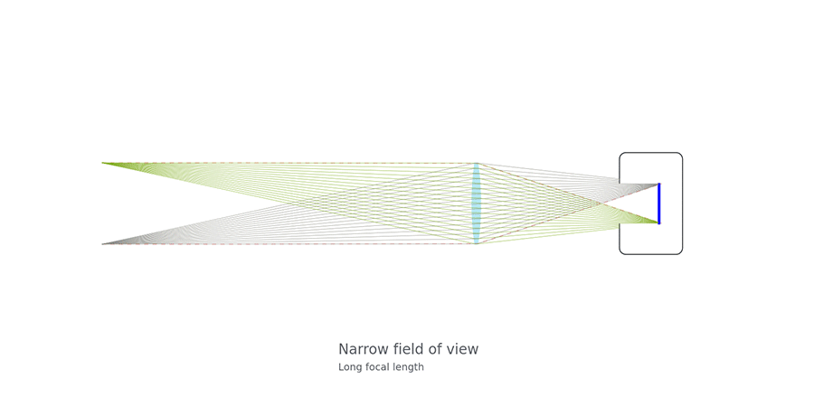

As an example, DJI's Zenmuse X3 camera has a diagonal field of view of 94&deg;, which is equivalent to a 20mm focal length when using a 35mm sensor. Note, the X3 sensor is smaller than 35mm, and so the physical focal length is also smaller. 

A diagonal field of view can be deconstructed to its horizontal and vertical components by using the aspect ratio of the sensor. X3 has a 4000x3000 pixel sensor, and so the horizontal and vertical field of views are 84&deg; and 62&deg; respectively.