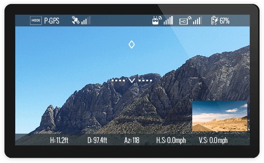

## Introduction

AirLink describes the wireless link between aircraft, remote controllers, handheld cameras and mobile devices.

There are four types of wireless links used in DJI products:

* WiFi
* OcuSync
* Lightbridge
* Auxiliary

Wireless communication links provide great flexibility, but also have limitations. The link will degrade as obstacles come between the devices communicating wirelessly, as the separation between devices increases, and as interference with other communication links increases.

A table detailing the type of wireless link for all aircraft products can be found in the [Product Introduction](./product_introduction.html#remote-controller).

Osmo is not included in this table and uses the WiFi wireless link between itself and mobile device.

## WiFi

WiFi is used as the wireless communication link for both aircraft and handheld camera products. In the case of aircraft, the remote controller acts as a WiFi access point (AP) and the aircraft and mobile device join it as clients. Some aircraft also act as the AP themselves, allowing the mobile device to connect directly. Similarly for Osmo, the mobile device joins the Osmo AP as a client.

Aspects of the wireless link that can customized include:

* SSID
* Password
* WiFi Frequency Band (Osmo Only)

## OcuSync

Part of the Lightbridge family, DJI’s newly developed OcuSync transmission system performs far better than Wi-Fi transmission at all transmission speeds. OcuSync also uses more effective digital compression and channel transmission technologies, allowing it to transmit HD video reliably even in environments with strong radio interference. Compared to traditional analog transmission, OcuSync can transmit video at 720p and 1080p – equivalent to a 4-10 times better quality, without a color cast, static interference, flickering or other problems associated with analog transmission. Even when using the same amount of radio transmission power, OcuSync transmits further than analog at 4.1mi (7km)

Before taking off, OcuSync will automatically scan the environment and choose the frequency band with the lowest interference, ensuring more stable video transmission. During a flight, it sends key flight parameters back for viewing in the SDK and supports a maximum download speed of 40Mb/s for photos and videos.

In use, this is the difference between smooth or interrupted transmission, short or long flight range, and short or long recovery times after interference or GPS signal loss. Additionally, since Wi-Fi uses a traditional protocol stack, it takes longer - from several seconds to tens of seconds – to get connected and to re-connect after signal loss But OcuSync uses Cross-Layer Protocol Design, it can establish or re-establish links within one second.

As well as point-to-point video transmission, OcuSync also supports wireless connections to multiple devices. For example, you can connect the DJI Goggles, remote controller, and Mavic wirelessly to OcuSync all at the same time. You can also add an additional remote so that you can control the Mavic with two remotes or share First Person View (FPV) videos.

## Lightbridge
  
Lightbridge has been developed by DJI specifically for long range, robust aerial communication in the 2.4 GHz band, and is used as the link between remote controller and aircraft. It provides significantly more range than WiFi, with up to 5 km communication in some products.

Lightbridge has 8 selectable channels. Channel selection can either be done manually, or left to the radio to determine what channel has the least interference. Data rate and channel quality can be measured to understand how channel is performing.

Some remote controllers with Lightbridge wireless links also have a secondary video port. This port can be used to send the live stream in HDMI or SDI format to an external device.

### Lightbridge Accessory

DJI also has a stand alone accessory product <a href="http://www.dji.com/product/lightbridge-2" target="_blank">Lightbridge 2</a> that can be integrated into airframes such as the S1000. This product consists of a module that mounts on the aircraft, and a remote controller for ground control. The purpose of the product is to relay remote control commands to the aircraft, and relay telemetry and video data to the remote controller. 

The accessory provides two additional features in the live video stream compared to ready-to-fly systems using Lightbridge technology:

* Multiple video inputs on the aircraft can be combined into a picture in picture live video stream
* An on-screen-display (OSD) mode overlays aircraft attitude information onto the live video stream

#### Picture in Picture

The accessory provides several video inputs to accommodate an FPV (first person view) camera and a DJI HD camera and gimbal integration (like the Zenmuse X3 or X5). HDMI and AV ports are available for the FPV camera, and a HD gimbal port is available HD camera and gimbal integrations. 

The video streams from both cameras can be combined into a single live stream with one stream inside the other in **picture in picture** or **PIP** mode. In this mode, one camera video is placed as a thumbnail in the video from the other camera. 

#### OSD - On Screen Display

OSD is when real time aircraft state information (like altitude, attitude etc.) is overlaid on the live video stream. Using OSD can greatly simplify an FPV application as there is less need to process and display aircraft state through the application.

## Auxiliary

WiFi and Auxiliary wireless links are used simultaneously between aircraft and remote controllers. The auxiliary link is a low bandwidth, but very robust link that carries control information critical to aircraft operation only. The WiFi link is higher bandwidth but is less robust and therefore carries application information and the live video stream.
