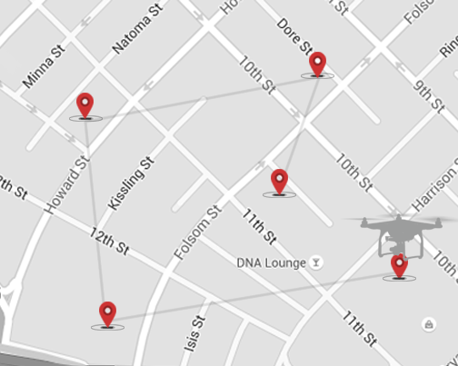
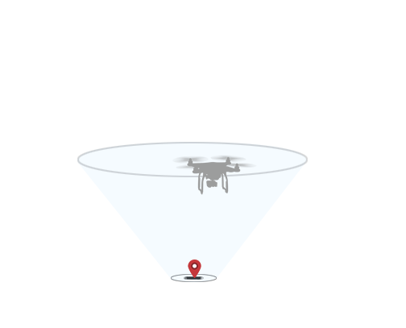
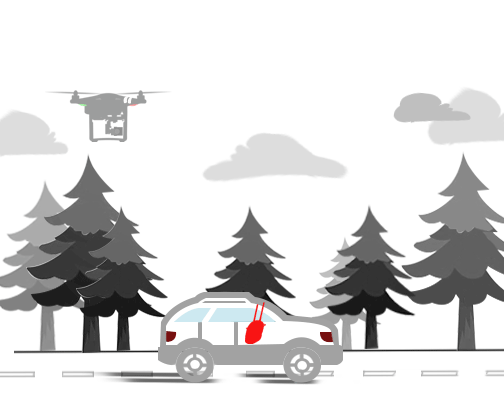
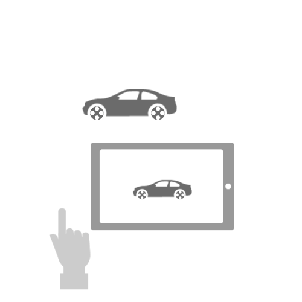
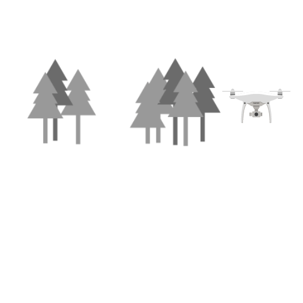

## Introduction

Missions can be used to easily automate flight. There are many different mission types that offer different product behavior. Some missions can be uploaded to and managed by the aircraft, while other missions are managed from the mobile device.

Missions run from the mobile device can offer more complex or customizable behavior, however if the wireless link between remote controller and aircraft is lost then they can be interrupted. In comparison, missions run from the aircraft will be less customizable and be limited by aircraft memory, but be able to continue when there is a loss in the wireless link.

## Mission Manager

All missions are managed through the DJI Mobile SDK's Mission Manager. The Mission Manager provides a consistent execution experience for all missions and allows preparation, starting, pausing, resuming, downloading and ending of missions.

## Waypoint Mission

A waypoint mission is a series of pre-defined locations (waypoints) the aircraft will fly to. A location is a latitude, longitude and altitude. Aircraft heading and altitude between waypoints can change either gradually or at the waypoint itself. A series of actions (such as take photo) can be executed at each waypoint.

During the mission, the mission can be manually adjusted using the remote controller control sticks. The mission speed can be sped up, slowed down or even executed in reverse. 

A Waypoint Mission is uploaded to and executed by the aircraft, but is limited by the amount of storage in the flight controller. Accordingly only 99 waypoints can be executed per mission. Custom Mission can be used to easily queue waypoint missions, in applications that require more than 99 points.

### Hot Point Mission

In a Hot Point Mission, the aircraft will repeatedly fly circles of a constant radius around a specified point called a Hot Point. Altitude, velocity, the Hot Point location, aircraft heading and flight direction can all be defined as part of the mission.

Altitude, heading and radius can also be adjusted manually using the remote controller control sticks during the mission.

### Follow Me Mission

In a Follow Me Mission, the aircraft will follow GPS coordinates continually sent to the aircraft maintaining separation and a constant altitude.

The aircraft will hover in place if it hasn't received a new GPS coordinate for more than 6 seconds. 

### ActiveTrack Mission

The ActiveTrack Mission allows an aircraft to track a moving subject using the vision system and without a GPS tracker on the subject. 

* User defines a rectangle on the live video view that defines the subject to track.
* The rectangle is sent to the aircraft, and which will start to track the object
* The aircraft will send back real-time updates of the rectangle tracking what it thinks is the subject and ask for confirmation it is tracking correctly
* On confirmation, the aircraft will start to move with the subject, following it while tracking
* If the tracking algorithm loses confidence it is tracking the subject correctly the aircraft will return to a hover and ask for confirmation about the subject again

During the mission, the main camera is used to track the object and so the gimbal cannot be controlled by the user or application. The aircraft can be flown manually with pitch, roll and throttle stick commands from the remote controller to move the aircraft around the subject being tracked.

There are three modes of the Active Track Mission:

- Trace Mode

  The aircraft follows behind or in front of the subject keeping a constant distance. Some products like Mavic Pro also support a Gesture Mode and the ability to circle the subject. Gesture mode allows the subject to confirm tracking as well as take pictures using gestures. 
  
- Profile Mode

  Aircraft moves in parallel with the subject instead of behind. 

- Spotlight Mode

  Aircraft's camera will automatically follow the subject, but the aircraft does not automatically keep a constant distance with the subject. You can use the remote controller to control the aircraft move around the subject being tracked. 

### TapFly Mission

The TapFly mission flies the aircraft in the direction of a point on the live video stream that the user chooses. The mission is initialized with a position target from the live video stream. The 3D direction of the coordinate is calculated, and the aircraft proceeds to fly in that direction. The aircraft can automatically avoid obstacles when the scene is sufficiently illuminated (more than 300 lux but less than 10,000 lux). The aircraft stops flying in the direction if it reaches its radius limitation, the mission is stopped, the user pulls back on the pitch stick or if it comes to an obstacle it cannot bypass. 

The Remote Controller yaw stick can be used to adjust the heading of the aircraft during mission execution, which also adjusts the direction of flight to the new yaw. Using any other stick controls will cancel the mission.

TapFly is only supported on newer aircraft with vision systems.

For Phantom 4 Professional, there are three TapFly modes:

- TapFly Forward – Aircraft will fly towards the target. Forward Obstacle Sensing System is active.
- TapFly Backward – Aircraft will fly in the opposite direction from the target. Backward Obstacle Sensing System is active.
- TapFly Free – Aircraft will fly towards the target. User can control the heading by remote controller's stick. Obstacle Sensing Systems may fail to work when aircraft is flying sideward.

### Panorama Mission

The Panorama Mission rotates the camera 180 or 360 degrees while taking photos which can then be downloaded to render a panorama. In full circle mode, 8 photos are taken. In half circle mode, 5 photos are taken. Other commands cannot be sent to the camera until the mission is finished. The Panorama Mission does not support the image stitching feature, so the images must be stitched manually. All the images will be stored on the SD card.

The Panorama Mission is only supported on OSMO. 

### Custom Mission

The Custom Mission serializes multiple missions or mission steps. It is an easy way to create complex, rich missions. Each mission step is uploaded to the aircraft at time of execution. Mission steps available are:

* Waypoint Mission
* Follow Me Mission
* Hot Point Mission
* Aircraft Take off
* Goto Waypoint
* Go Home
* Shoot Photo
* Record Video
* Change Aircraft Yaw
* Change Gimbal Attitude

