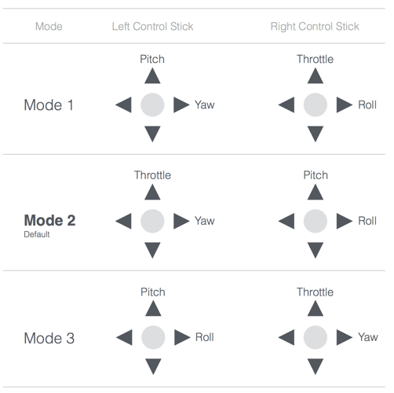
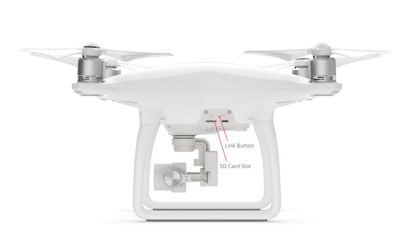

## Introduction

The remote controller allows manual flight, gimbal and camera control, and provides a robust wireless control link for aircraft. The mobile device can connect to the remote controller to communicate to the aircraft and receive the live video stream from the camera.

The remote controller has sticks, wheels, switches and buttons that give control. It has a USB connector for mobile devices, and sometimes additional video output ports to connect with external video equipment.

In some products, remote controllers can be linked together in a master slave relationship where the master controls aircraft flight and the slave controls the gimbal and camera. This is useful for cinematic applications where the pilot can focus on flying while the camera operator on capturing a good shot.

## Control Input

The diagram below illustrates many of the remote controller sticks, buttons and wheels for the Phantom 4 remote controller. Sticks can be used for controlling flight direction and sometimes gimbal. Wheels are usually used for gimbal control, and buttons for camera control, and returning home.

Different products have different remote controllers depending on aircraft features, and so each product's manual should be reviewed for detailed information on each remote controller.

### Control Sticks

The two control sticks (left and right) are typically used for flight control. Moving the left and right stick either horizontally or vertically will control throttle, yaw, pitch and roll. By default, the sticks are mapped to **Mode 2** shown in the table below.

## Flight Mode

DJI aircraft have many flight modes that depend on the remote controller's **Flight Mode Switch** state, what positioning aids are available, and what the aircraft is doing at the time.

The Flight Mode Switch can be used to determine whether the aircraft uses positioning aids to maintain position (like GPS), and whether automated flight control using [Missions](./component-guide-missions.html) and [Virtual Sticks](./component-guide-flightController.html#Virtual-Sticks) is enabled. Therefore the switch can be used to effectively override positioning sensors, and automated flight whenever the pilot needs to.

Four modes are available (P, S, A, F) of which all products have two or three to select from.

### P-Mode (Positioning)

In Positioning Mode, the aircraft uses all positioning aids that are available to fly. These include GPS, the vision positioning system, and the obstacle avoidance system. Positioning systems won't be available if they are not part of the product, if they've been disabled, or if the environment doesn't allow it (e.g. indoor environments won't have sufficiently strong GPS signals for the GPS positioning aid to be available).

P-Mode enables advanced features such as Missions, Virtual Sticks and [Intelligent Orientation Control](./flightController_concepts.html#ioc-intelligent-orientation-control) on remote controllers that do not have an F-Mode. On remote controllers that do have an F-Mode, the advanced features are disabled.

Therefore, if the pilot needs to override automated flight on a Mavic Pro or Phantom 4, they should move the flight mode switch out of P-Mode. Alternatively, if they need to override automated flight on other products, they can move the switch into P-Mode.

### A-Mode (Attitude)

In Attitude Mode, the aircraft does not use any positioning aids to fly. Only the barometer is used to track altitude. No advanced features are enabled in this mode.

For all products, A-Mode can be used to regain manual control from automated flight.

In A-Mode, GPS is still used to return home automatically assuming a sufficiently strong GPS signal is present, and a home location exists.

### F-Mode (Function)

In Function Mode, the aircraft uses all positioning aids available (similar to P-Mode) and also enables advanced features such as [Missions](./component-guide-missions.html) and [Intelligent Orientation Control](./flightController_concepts.html#ioc-intelligent-orientation-control). 

If manual control needs to be regained by the pilot while executing missions or Virtual Stick commands, the Flight Mode Switch should be moved out of F-Mode.

### S-Mode (Sport)

Sport mode uses all positioning aids, adjusts the handling gain values of the aircraft in order to enhance the maneuverability, and increases the maximum flight speed to 20 m/s. The obstacle avoidance system is disabled in S-Mode.

S-Mode can be used to regain manual control from automated flight.

## Linking

Remote controllers are linked to individual aircraft and need to be re-linked if used with a different aircraft. Linking remote controllers with different aircraft that are different product models is possible if the wireless link between aircraft and remote controller is the same. For example, a Phantom 3 Professional remote controller that uses a Lightbridge wireless link will also work with a Phantom 4 aircraft. However, when mixing aircraft and remote controller product models, not all functionality will necessarily be present.

To link, the remote controller must be put in linking mode (through DJI Go or the DJI Mobile SDK APIs). The remote controller will start beeping and its status LED will blink blue. The link button on the aircraft then needs to be pressed to finish the linking process. For example, the link button on the Phantom 4 is shown below.

The linking button is in a different location for each aircraft, and the product manual should be reviewed for specific position.

## Master/Slave Control

Dual remote controllers can be used to simultaneously control some aircraft such as the Inspire 1. The master remote controller communicates directly with the aircraft and controls flight. The slave remote controller receives video from the aircraft, but communicates with the master remote controller to relay gimbal and camera control.

To operate in this mode, the remote controllers must be put in master or slave mode, and then wirelessly linked together using either DJI Go or the DJI Mobile SDK APIs. 

## Custom Buttons

There are two custom buttons on the back of the remote controller. The custom buttons do not communicate with the aircraft, and are only available for mobile applications. Custom button state (whether pressed or not) is available in the DJI Mobile SDK, and so users can use the custom buttons to interact with an application if configured in the application.

Additionally each custom button can have a unique tag value set to it, which can be used as a way to store unique information on each remote controller.

> **Note**: Custom button 1 is by default bound with DJI Go in iOS. When the remote controller is connected to the mobile device, and C1 is pressed, a dialog confirming the user wants to enter DJI Go is displayed. On confirmation, DJI Go will load.
> 
> This behavior can be disabled using the DJI Mobile SDK, but developers should inform users of the behavior change so they don't have an unexpected experience.

## Mobile Remote Controller

A simulated remote controller on the mobile device to control the aircraft when the physical remote controller is absent. It can simulate the vertical and horizontal movement of the left and right stick, which changes the aircraft's pitch, roll, yaw and throttle. The mobile remote controller only supports **Mode 2** control style and [P-Mode](#P-Mode-Positioning). 

It is only supported by Mavic Pro using WiFi.

## Remote Controller GPS Accessory

A GPS Accessory for the Remote Controller improves the accuracy of the remote controller’s positioning. Used with the Inspire 2’s Dynamic Home point function which constantly updates the latest location of the remote controller as its Home point, it allows accurate Return to Home when moving around an environment.

It is only supported by Inspire 2.

