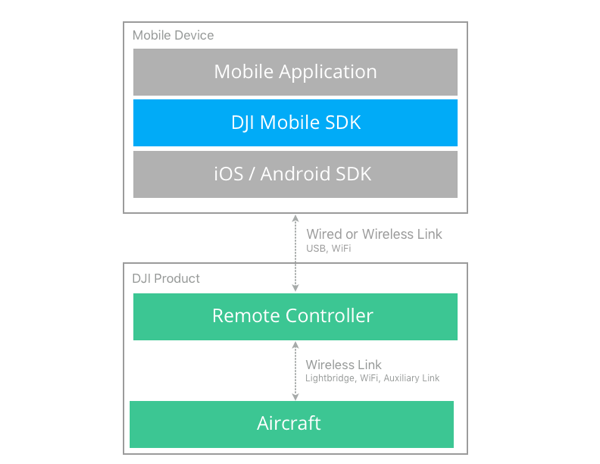
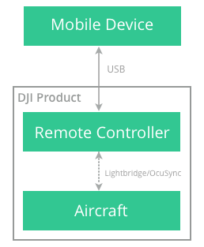
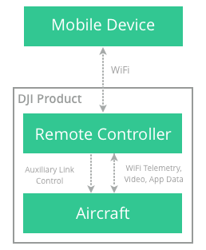
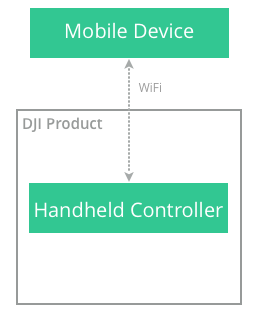

The DJI Mobile SDK is a software development kit designed to give developers access to the capability of DJI's aircraft and handheld camera products. The SDK simplifies the application development process by taking care of lower level functionality such as flight stabilization, battery management, signal transmission and communication. This way, the developer does not require a background in robotics or embedded systems and can instead focus on the application the DJI product is being integrated into.

The SDK includes:

* a library/framework that can be imported into an Android or iOS app that give access to the DJI product
* an aircraft simulator and visualization tool
* debugger and remote logger for iOS
* sample code and tutorials
* this developer guide and API documentation

This introduction will describe how the SDK connects to the products, what functionality the SDK provides, and an introductory architecture of the SDK.

## Feature Overview

Many of DJI's product features and capabilities are accessible to developers through the SDK. Developers can automate flight, control the camera and gimbal, receive real time video and sensor data, download saved media from the product, and monitor state of the other components.

### Flight Control

The DJI Mobile SDK allows three ways to control aircraft flight:

* **Manually**: User pilots aircraft with remote controller while SDK allows monitoring live video and sensor data. 
* **Virtual Stick Commands**: SDK allows generation of remote controller stick movements virtually, simulating a pilot.
* **Missions**: Convenient, easy to implement high level control of the aircraft. For example, defined flight paths can be executed with a Waypoint mission.

Virtual stick commands and missions allow simple but powerful automated flight control of DJI aircraft. 

### Camera

Camera and gimbal functionality is highly programmable and allows:

* **Camera mode**: Video and still image capture
* **Exposure**: Shutter, ISO, aperture and exposure compensation are all available to customize for maximum flexibility
* **Image Parameters**: Aspect ratio, contrast, hue, sharpness, saturation and filters
* **Video Parameters**: Resolution and frame rate
* **Direction**: Using the gimbal, camera direction and motion can be automated

### Live Video

The live video broadcast by the aircraft of the main camera feed is available through the DJI Mobile SDK. Live video is available even when the camera is capturing images or video to it's storage media.

### Sensor Data

Rich sensor data is available through the SDK. GPS position, compass, barometer, flight velocity and altitude are some of the sensor readings available at up to 10 Hz through the Mobile SDK. 

### Download Media

Videos saved to the camera's storage media (SD card or solid state drive) is accessible to view and download through the DJI Mobile SDK. Both previews and full image data can be accessed.

### Remote Controller, Battery, Wireless Link

The remote controller, battery and wireless link can all be accessed through the SDK. Mostly these components provide state information, but some control is also possible.

## Differences with Other SDKs

Most iOS and Android applications will either create, manipulate and/or visualize data. However applications using DJI's Mobile SDK can be fundamentally different as they can interact with the world around the user.

* **Kinetic Energy**: An aircraft can have a mass of several kilograms and move at speeds of up to 20 m/s. While the ability to programmatically change position is tremendously powerful, it also means an application can potentially damage the product it is controlling, or the environment the product is being controlled in.
* **Share Space**: DJI's aircraft move in space shared by other people, structures and aircraft. DJI provides a geofencing system to prevent aircraft from entering critical space, but developers and users must still understand the local and federal rules of the environment the aircraft moves in.
* **Highly Asynchronous**:  Wireless connectively can be unpredictable in challenging wireless environments. Sometimes it can take hundreds of milliseconds for a command to be transferred (assuming it ever does). While many developers are familiar with asynchronous programming techniques in networking, when commands aren't communicated on a robotic system, behavior in the physical world can be unexpected.

It is not possible as a developer to predict or programmatically assess the environment a user will operate in. An easy maneuver in an open environment, can be difficult in a confined space. Environments can be dynamic and might be sometimes safe, and other times not. Therefore it is important that both developers and users understand the capabilities and limitations of the products and their controlling applications.

## Connection to Application and Product

The following diagram illustrates how the DJI Mobile SDK fits into a mobile application, and how it is connected to a DJI aircraft. 

 <html></html>

>
>For a handheld camera product, the Remote Controller is replaced with a Handheld Controller and there is no aircraft or additional wireless link.
>

A mobile application is built with the DJI Mobile SDK, the platform SDK (iOS or Android) and is run on the Mobile Device (Apple iPhone, iPad, Nexus phone, Nexus tablet etc).

The mobile device connects to a DJI product either wirelessly with WiFi or through a USB cable depending on the product. For aircraft products, the mobile device connects to the remote controller, which connects wirelessly to the aircraft through another wireless link (for the Phantom 3 Standard, two wireless links connect the remote controller and aircraft). Detailed connectivity for each product is shown below.

<html>

<table class="table-pictures">
  <tr>
    <td></td>
    <td></td>
        <td></td>
  </tr>
  <tr valign="top">
    <td>
Phantom 4  Phantom 4 Professional   Phantom 3 Professional   Phantom 3 Advanced   Inspire 1   Inspire 1 Pro/Raw   Inspire 2   Matrice 100   Matrice 600   Matrice 600 Pro   Mavic Pro
</td>
    <td>
Phantom 3 4K   Phantom 3 Standard  Spark
</td>
    <td>
Osmo  Osmo Mobile Osmo + Mavic Pro Spark
</td>
  </tr>

</table>
</html>

Therefore, depending on the product, when a command is sent from the DJI Mobile SDK to an aircraft, the command might pass through several wireless links and cable connections. 
