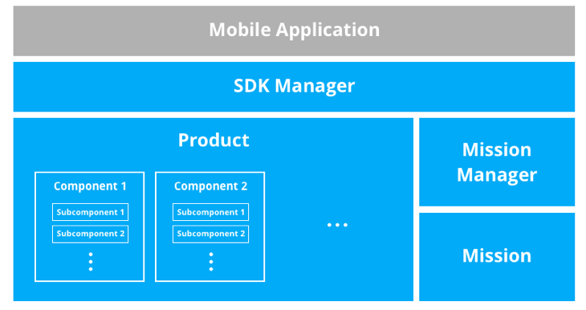
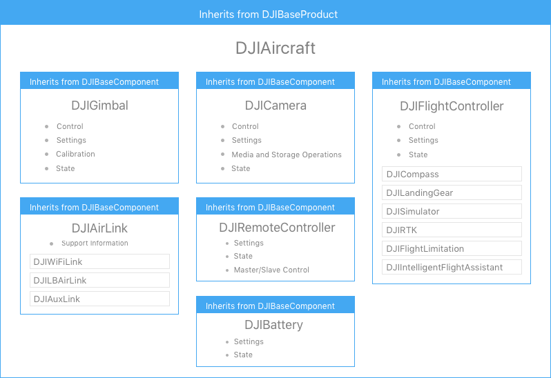
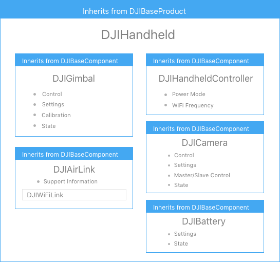
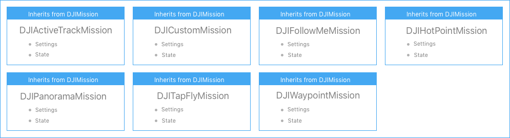

The architecture is designed to be highly extensible. Abstract product and component classes are used so applications can control different products with the same code. Features that are not consistent across all generations of supported products can be queried at runtime, and those that are consistent will simply work.

For example, the large majority of features of the Phantom and Inspire series of products are consistent. Therefore an application written to support the Phantom 4 will, with the exception of unique Inspire 1 features, fully support the Inspire 1. 

This also means when new products are released, they will already work with existing applications (when that application is rebuilt with the latest SDK that supports the new product). Any new features of the new product will need to be added to the application, but all existing features will not need modification.

## Hierarchy

A mobile application accesses the DJI Mobile SDK through several main classes illustrated in the diagram below.

<html></html>

* **SDK Manager**: Manages registration of the SDK, product connection and provides access to the product itself.
* **Product**: The aircraft or handheld product, this class holds basic product properties and contains the main product components.
* **Component**: Component classes describe the gimbal, camera, flight controller, remote controller and wireless link. The classes provide component control, state information and contain subcomponents.
* **Mission**: Classes that describe different missions such as Waypoint and ActiveTrack missions and hold their setup properties and status.
* **Mission Manager**: Missions are controlled through the mission manager. It provides control of mission preparation, execution, termination, pausing and resumption as well as provides access to the currently executing mission.

## Aircraft Product

A more detailed description of the aircraft product class is below. The aircraft product holds a number of components and the component holds a number of subcomponents, all of which are accessible when the mobile device is connected to the aircraft through the remote controller (if the SDK registration is successful). If the connection between the remote controller and aircraft is lost, the remote controller object will persist (if the mobile device is still connected to the remote controller), while the product and all remaining components physically on the aircraft will become null.

<html></html>
 
## Handheld Product

The handheld camera product is simpler and has less components than an aircraft. The shared components are treated the same as on an aircraft, and so any code that controls the camera will work on both aircraft and handheld products.

<html></html> 

## Missions

Missions can be used to easily automate flight. For more details, please check the [Missions](./component-guide-missions.html) section. All missions inherit from DJIMission so they can be handled by the Mission Manager.

<html></html> 

