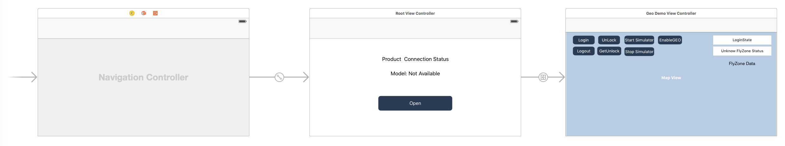
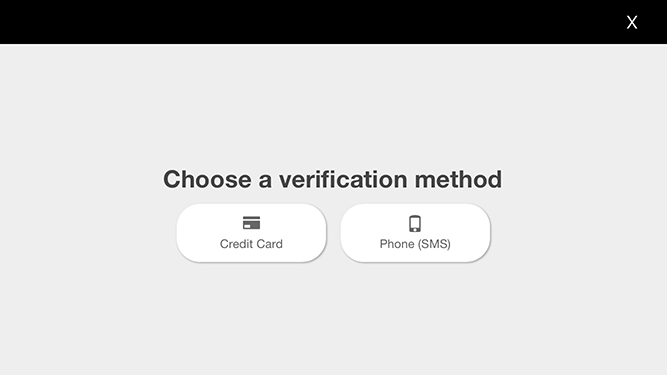
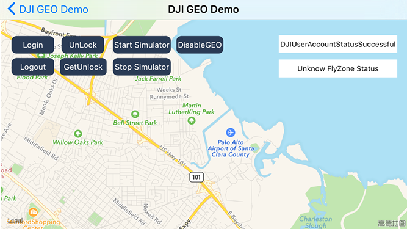
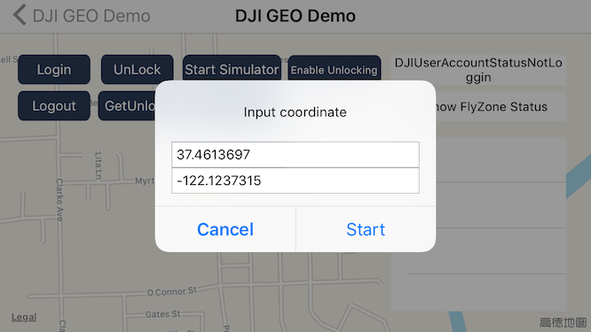
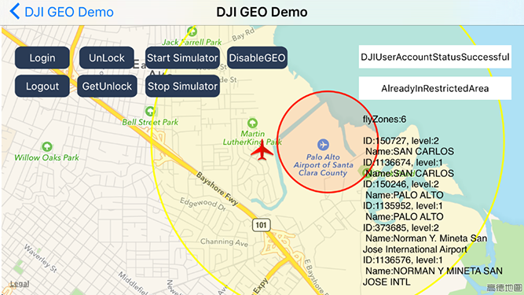
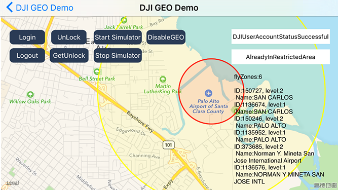
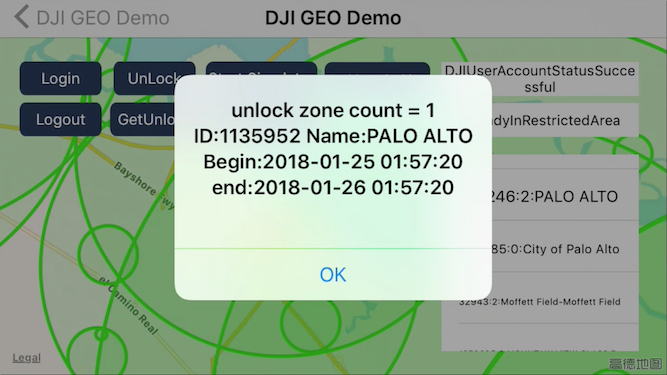

**Note: This Tutorial and Sample Project is developed based on iOS SDK v3.5.1, an update version for iOS SDK v4.0 will be published soon.**

---

In this tutorial, you will learn how to use the `DJIFlyZoneManager` and `DJIFlyZoneInformation` of DJI Mobile SDK to get the fly zone information, and unlock authorization fly zones.

You can download the tutorial's final sample code project from this [Github Page](https://github.com/DJI-Mobile-SDK-Tutorials/iOS-GEODemo).

We use Phantom 4 as an example to make this demo. Let's get started!

## Introduction

The [Geospatial Environment Online (GEO) system](http://www.dji.com/flysafe/geo-system) is a best-in-class geospatial information system that provides drone operators with information that will help them make smart decisions about where and when to fly. It combines up-to-date airspace information, a warning and flight-restriction system, a mechanism for [unlocking](http://www.dji.com/flysafe/geo-system/unlock) (self-authorizing) drone flights in locations where flight is permitted under certain conditions, and a minimally-invasive accountability mechanism for these decisions.

## Implementing the UI of the Application

### Importing SDK and Register Application

Now, let's create a new project in Xcode, choose **Single View Application** template for your project and press "Next", then enter "DJIGeoSample" in the **Product Name** field and keep the other default settings.

Once the project is created, let's delete the **ViewController.h** and **ViewController.m** files, which were created by Xcode when you create the project. Then create a UIView Controller named **RootViewController** and set the class of original ViewController object in the storyboard to "RootViewController".

Next, let's import the **MapKit.framework** and **DJISDK.framework** to the project and implement the registration process in the **RootViewController**. If you are not familiar with the process of importing and activating DJI SDK, please check this tutorial: [Importing and Activating DJI SDK in Xcode Project](../application-development-workflow/workflow-integrate.html#Xcode-Project-Integration) for details.

### Working on the UI of Application

#### Creating the UI of RootViewController 

Let's open the "Main.storyboard" and make the **RootViewController** embed in a Navigation Controller and set it as the Storyboard Entry Point. Next, drag and drop two UILabel objects to the RootViewController and named them as "Product Connection Status" and "Model: Not Available". Moreover, drag and drop a UIButton object and place under the two UILabels, named it as "Open", then set its background image as "btn.png" file, which you can get it from the tutorial's Github Sample Project. Lastly, setup the UI elements' auto layout to support multiple device screen size.

#### Creating the UI of DJIGeoDemoViewController

Drag and drop another ViewController object from the Object Library to the right of **RootViewController** in the storyboard. Then create another UIViewController class file in the navigator and named it as "DJIGeoDemoViewController", then set the class name in storyboard too.

Furthermore, put a **Map View** at the bottom of the ViewController and adjust its size as the ViewController view's size. 

Then drag and drop 7 UIButton objects and place them on the upper left side, named them as "Login", "Logout", "Unlock", "GetUnlock", "Start Simulator", "Stop Simulator" and "EnableGEO". Moreover, drag and drop two UILabels and place them on the right of the 7 UIButton objects, set the text of them as "LoginState" and "Unknown FlyZone Status". Lastly, drag and drop a UITextVeiw under the two UILabels and set its text content as "FlyZone Data".

For more detail configurations of the storyboard, please check the Github sample project. If everything goes well, you should see the following screenshot:

## Working on RootViewController

Let's open RootViewController.m file and create IBOutlets properties to link the UI elements in the storyboard. Then add the following method to update the two UILabel objects' content when product connection update: 

~~~objc
-(void) updateStatusBasedOn:(DJIBaseProduct* )newConnectedProduct {
    if (newConnectedProduct){
        self.connectStatusLabel.text = NSLocalizedString(@"Status: Product Connected", @"");
        self.modelNameLabel.text = [NSString stringWithFormat:NSLocalizedString(@"Model: \%@", @""),newConnectedProduct.model];
        self.modelNameLabel.hidden = NO;
        
    }else {
        self.connectStatusLabel.text = NSLocalizedString(@"Status: Product Not Connected", @"");
        self.modelNameLabel.text = NSLocalizedString(@"Model: Unknown", @"");
    }
}
~~~

Next, invoke the above method at the end of both the `viewDidAppear` method and `sdkManagerProductDidChangeFrom:to:` method as shown below:

~~~objc
- (void)viewDidAppear:(BOOL)animated
{
    ...
    
    if(self.product){
        [self updateStatusBasedOn:self.product];
    }
}
~~~

~~~objc
- (void)sdkManagerProductDidChangeFrom:(DJIBaseProduct *)oldProduct to:(DJIBaseProduct *)newProduct
{
    ...
    
    [self updateStatusBasedOn:newProduct];
}
~~~

For more details of the implementation of RootViewController, please check the tutorial's Github sample project.

## Implementing Annotation and Overlay on Map View

### Working on Aircraft Annotation

Let's continue to add the aircraft annotation on the map to show its position when we are testing the GEO system feature.

Firstly, create a subclass of NSObject and named it as "DJIAircraftAnnotation", replace the code of its header and implementation files as shown below:

- DJIAircraftAnnotation.h

~~~objc
#import <MapKit/MapKit.h>
#import <CoreLocation/CoreLocation.h>

@interface DJIAircraftAnnotation : NSObject <MKAnnotation>

@property (nonatomic) CLLocationCoordinate2D coordinate;
@property (nonatomic, assign) CGFloat heading;

-(id) initWithCoordinate:(CLLocationCoordinate2D)coordinate heading:(CGFloat)heading;
- (void)setCoordinate:(CLLocationCoordinate2D)coordinate;

@end
~~~

- DJIAircraftAnnotation.m

~~~objc
#import "DJIAircraftAnnotation.h"

@implementation DJIAircraftAnnotation

-(id) initWithCoordinate:(CLLocationCoordinate2D)coordinate heading:(CGFloat)heading
{
    self = [super init];
    if (self) {
        self.coordinate = coordinate;
        self.heading = heading;
    }
    return self;
}

- (void)setCoordinate:(CLLocationCoordinate2D)coordinate
{
    _coordinate = coordinate;
}

@end
~~~

In the code above, we implement the **MKAnnotation** protocol and declare a property of CLLocationCoordinate2D object **coordinate**, which will be used to store the coordinate data. Then declare a CGFloat property **heading**, and use it to store the heading value of the aircraft.  

Then implement the `initWithCoordinate:heading:` and `setCoordinate:` methods in the implementation file. 

Once you finish it, let's create a class named "DJIAircraftAnnotationView", which is a subclass of **MKAnnotationView**, and replace the codes of header and implementation files with the followings:

- DJIAircraftAnnotationView.h

~~~objc
#import <MapKit/MapKit.h>

@interface DJIAircraftAnnotationView : MKAnnotationView

- (instancetype)initWithAnnotation:(id <MKAnnotation>)annotation reuseIdentifier:(NSString *)reuseIdentifier;

-(void)updateHeading:(float)heading;

@end
~~~

- DJIAircraftAnnotationView.m

~~~objc
#import "DJIAircraftAnnotationView.h"

@implementation DJIAircraftAnnotationView

- (instancetype)initWithAnnotation:(id <MKAnnotation>)annotation reuseIdentifier:(NSString *)reuseIdentifier
{
    self = [super initWithAnnotation:annotation reuseIdentifier:reuseIdentifier];
    if (self) {
        self.enabled = NO;
        self.draggable = NO;
        self.image = [UIImage imageNamed:@"aircraft.png"];
    }
    
    return self;
}

-(void) updateHeading:(float)heading
{
    self.transform = CGAffineTransformIdentity;
    self.transform = CGAffineTransformMakeRotation(heading);
}

@end
~~~

In the code above, we firstly implement the `initWithAnnotation:resuseIdentifier:` method for initialization and create the `updateHeading:` method to update the heading of the aircraft annotation view.

For the "aircraft.png" file, please get it from this tutorial's Github sample project and put it in the **Assets.xcassets**.

### Working on FlyZone Circle Overlay

Now, let's add circle overlays with different colors to represent Fly Zones on the map view. 

Create an MKCircle class named "DJIFlyZoneCircle" and implement its header file as shown below:

- DJIFlyZoneCircle.h

~~~objc
#import <MapKit/MapKit.h>

@interface DJIFlyZoneCircle : MKCircle

@property (nonatomic, assign) CLLocationCoordinate2D flyZoneCoordinate;

@property (nonatomic, assign) CGFloat flyZoneRadius;
@property (nonatomic, assign) uint8_t category;
@property (nonatomic, assign) NSUInteger flyZoneID;
@property (nonatomic, copy) NSString* name;

@end
~~~

In the code above, we declare the following variables:

1. **flyZoneCoordinate** property is used to store the coordinate data of the fly zone circle
2. **flyZoneRadius** property is used to store the radius of the fly zone circle in meters
3. **category** property is used to store the category of the fly zone circle
4. **flyZoneID** property is used to store the fly zone's identifier, which is required in the unlock process
5. **name** property is used to store the name of the fly zone.

Next, let's create the **DJIFlyZoneCircleView** class, which is a subclass of MKCircleRenderer, and replace the codes with the followings:

- DJIFlyZoneCircleView.h

~~~objc
#import <MapKit/MapKit.h>
#import "DJIFlyZoneCircle.h"

@interface DJIFlyZoneCircleView : MKCircleRenderer

- (id)initWithCircle:(DJIFlyZoneCircle *)circle;

@end
~~~

- DJIFlyZoneCircleView.m

~~~objc
#import "DJIFlyZoneCircleView.h"
#import <DJISDK/DJISDK.h>

#define AuthorizationColor      [UIColor yellowColor]
#define RestrictedColor         [UIColor redColor]
#define WarningColor        [UIColor greenColor]
#define EnhancedWarningColor [UIColor greenColor]

@implementation DJIFlyZoneCircleView

- (id)initWithCircle:(DJIFlyZoneCircle *)circle
{
    self = [super initWithCircle:circle];
    if (self) {
        
        self.fillColor = [[UIColor redColor] colorWithAlphaComponent:0.2];
        self.strokeColor = [[UIColor redColor] colorWithAlphaComponent:0.9];
        
        if (circle.category == DJIFlyZoneCategoryAuthorization) {
            
            self.fillColor = [AuthorizationColor colorWithAlphaComponent:0.1];
            self.strokeColor = [AuthorizationColor colorWithAlphaComponent:1.0];
            
        } else if (circle.category == DJIFlyZoneCategoryRestricted) {

            self.fillColor = [RestrictedColor colorWithAlphaComponent:0.1];
            self.strokeColor = [RestrictedColor colorWithAlphaComponent:1.0];
            
        } else if (circle.category == DJIFlyZoneCategoryWarning) {
            
            self.fillColor = [WarningColor colorWithAlphaComponent:0.1];
            self.strokeColor = [WarningColor colorWithAlphaComponent:1.0];
            
        } else if (circle.category == DJIFlyZoneCategoryEnhancedWarning) {
            
            self.fillColor  = [EnhancedWarningColor colorWithAlphaComponent:0.1];
            self.strokeColor = [EnhancedWarningColor colorWithAlphaComponent:1.0f];
        }
        
        self.lineWidth = 3.0f;
    }
    
    return self;
}

@end
~~~

In the code above, we implement the following feature:

**1.** In the header file, we declare the `initWithCircle:` method for initialization.

**2.** Then we implement the `initWithCircle:` method by setting the `fillColor` and `strokeColor` of **MKCircleRenderer** based on the `category` property value of "DJIFlyZoneCircle":

- Authorization Fly Zone (Yellow Color)
- Restricted Fly Zone (Red Color)
- Warning Fly Zone (Green Color)
- Enhanced Warning Fly Zone (Green Color)

**3.** Finally, assign the `lineWidth` property of **MKCircleRenderer** to "3.0f" to set the fly zone circle's width. 

So far, we have finished implementing the aircraft annotation and fly zone overlay, let's continue to implement the DJIMapViewController to add them on the Map View.

## Implementing DJIMapViewController

### Adding and Updating Aircraft Annotation on the Map View

  Here, we may need to create a Map View to show the map and draw the fly zone circles and aircraft on it. Now create a new **ViewController** class named "DJIMapViewController" and then open the DJIMapViewController.h file and replace the content with the followings:

~~~objc
#import <UIKit/UIKit.h>
#import <MapKit/MapKit.h>
#import <CoreLocation/CoreLocation.h>

@class DJIMapViewController;

@interface DJIMapViewController : NSObject

- (id)initWithMap:(MKMapView*)mapView;

/**
 *  Update aircraft location and heading.
 *
 *  @param coordinate Aircraft location
 *  @param heading    Aircraft heading
 */
-(void)updateAircraftLocation:(CLLocationCoordinate2D)coordinate withHeading:(CGFloat)heading;

/**
 *  Refresh the map view region
 */
- (void)refreshMapViewRegion;

/**
 *  Update fly zones in the surrounding area of aircraft
 */
- (void)updateFlyZonesInSurroundingArea;

/**
 *  Get Update Fly Zone Info Strings
 **/
- (NSString *)fetchUpdateFlyZoneInfo;

@end
~~~

In the code above, we implement the following features:

1. Create the initialization method `initWithMap:` for DJIMapViewController
2. Create the `updateAircraftLocation:withHeading:` method to update the aircraft's location and heading on the map view
3. Add the `refreshMapViewRegion` method to refresh the map view's region
4. Add the `updateFlyZonesInSurroundingArea` method to update the fly zones in the surrounding area of aircraft;
5. Lastly, add the `fetchUpdateFlyZoneInfo` method to fetch the updated fly zone info strings. 

Next let's implement the `initWithMap:` and `updateAircraftLocation:withHeading:` methods in the **DJIMapViewController.m** file. 

Firstly, we should create a **CLLocationCoordinate2D** property, a **DJIAircraftAnnotation** property and a **MKMapView** property, then implement the **MKMapViewDelegate** protocol in the class extension part as shown below:

~~~objc
#import "DJIMapViewController.h"
#import <DJISDK/DJISDK.h>
#import "DJIAircraftAnnotation.h"
#import "DJIAircraftAnnotationView.h"

@interface DJIMapViewController () <MKMapViewDelegate>

@property (nonatomic) CLLocationCoordinate2D aircraftCoordinate;
@property (weak, nonatomic) MKMapView *mapView;
@property (nonatomic, strong) DJIAircraftAnnotation* aircraftAnnotation;

@end
~~~

Next, implement the two methods as shown below:

~~~objc
- (id)initWithMap:(MKMapView*)mapView{
    if (nil != mapView) {
        self = [super init];
        if (self) {
            self.mapView = mapView;
            self.mapView.delegate = self;
        }
        return self;
    }
    return nil;
}

-(void) updateAircraftLocation:(CLLocationCoordinate2D)coordinate withHeading:(CGFloat)heading
{
    if (CLLocationCoordinate2DIsValid(coordinate)) {
        
        self.aircraftCoordinate = coordinate;
        
        if (self.aircraftAnnotation == nil) {
            self.aircraftAnnotation =  [[DJIAircraftAnnotation alloc] initWithCoordinate:coordinate heading:heading];
            [self.mapView addAnnotation:self.aircraftAnnotation];
            MKCoordinateRegion viewRegion = MKCoordinateRegionMakeWithDistance(coordinate, 500, 500);
            MKCoordinateRegion adjustedRegion = [self.mapView regionThatFits:viewRegion];
            [self.mapView setRegion:adjustedRegion animated:YES];
        }
        else
        {
            [self.aircraftAnnotation setCoordinate:coordinate];
            DJIAircraftAnnotationView *annotationView = (DJIAircraftAnnotationView *)[_mapView viewForAnnotation:self.aircraftAnnotation];
            [annotationView updateHeading:heading];
        }
    }
}
~~~

In the code above, we implement the following features:

1. In the `initWithMap:` method, we initialize the DJIMapViewController by passing the **MKMapView** object "mapView", then store it to the `mapView` property and set the `mapView`'s delegate to DJIMapViewController.

2. In the `updateAircraftLocation:withHeading:` method, we firstly check if the `coordinate` is valid, then update the `aircraftCoordinate` property. If the `aircraftAnnotation` property is nil, invoke the `initWithCoordinate:heading:` method of **DJIAircraftAnnotation** to create it, then invoke the **MKMapView**'s `addAnnotation:` method to add the aircraft annotation on the map. Lastly, adjust the map view's region by invoking the `setRegion:animated:` method.

3. If the `aircraftAnnotation` property is not nil, then update its coordinate and the heading of the aircraft annotation view.

Lastly, implement the MKMapViewDelegate method as shown below:

~~~objc
- (MKAnnotationView *)mapView:(MKMapView *)mapView viewForAnnotation:(id <MKAnnotation>)annotation
{
    
    if ([annotation isKindOfClass:[MKUserLocation class]]) {
        return nil;
    }else if ([annotation isKindOfClass:[DJIAircraftAnnotation class]])
    {
        
        static NSString* aircraftReuseIdentifier = @"DJI_AIRCRAFT_ANNOTATION_VIEW";
        DJIAircraftAnnotationView* aircraftAnno = (DJIAircraftAnnotationView*)[self.mapView dequeueReusableAnnotationViewWithIdentifier:aircraftReuseIdentifier];
        if (aircraftAnno == nil) {
            aircraftAnno = [[DJIAircraftAnnotationView alloc] initWithAnnotation:annotation reuseIdentifier:aircraftReuseIdentifier];
        }

        return aircraftAnno;
    }

    return nil;
}
~~~

### Adding Fly Zone Overlay on the Map View

After we have added the aircraft annotation on the map, now let's add some fly zone overlays on the map to show the fly zone visually.

Firstly, import the "DJIFlyZoneCircle.h" and "DJIFlyZoneCircleView.h" header files, then create an NSMutableArray property and named it as 'flyZones' to store the fly zone circle as shown below:

~~~objc
#import "DJIMapViewController.h"
#import <DJISDK/DJISDK.h>
#import "DJIAircraftAnnotation.h"
#import "DJIAircraftAnnotationView.h"
#import "DJIFlyZoneCircle.h"
#import "DJIFlyZoneCircleView.h"
#import "DemoUtility.h"

@interface DJIMapViewController () <MKMapViewDelegate>

@property (nonatomic) CLLocationCoordinate2D aircraftCoordinate;
@property (weak, nonatomic) MKMapView *mapView;
@property (nonatomic, strong) DJIAircraftAnnotation* aircraftAnnotation;
@property (nonatomic, strong) NSMutableArray *flyZones;

@end
~~~

For the "DemoUtility.h" file, we will implement it later.

Next, add the following code to initialize the `flyZones` array at the bottom of `initWithMap:` method:

~~~objc
    self.flyZones = [NSMutableArray array];
~~~

Moreover, implement the `updateFlyZonesInSurroundingArea` method and `updateFlyZoneOverlayWithInfos:` methods as shown below:

~~~objc
-(void) updateAircraftLocation:(CLLocationCoordinate2D)coordinate withHeading:(CGFloat)heading
{
    if (CLLocationCoordinate2DIsValid(coordinate)) {
        
        self.aircraftCoordinate = coordinate;
        
        if (self.aircraftAnnotation == nil) {
            self.aircraftAnnotation =  [[DJIAircraftAnnotation alloc] initWithCoordinate:coordinate heading:heading];
            [self.mapView addAnnotation:self.aircraftAnnotation];
            MKCoordinateRegion viewRegion = MKCoordinateRegionMakeWithDistance(coordinate, 500, 500);
            MKCoordinateRegion adjustedRegion = [self.mapView regionThatFits:viewRegion];
            [self.mapView setRegion:adjustedRegion animated:YES];
            [self updateFlyZonesInSurroundingArea];
        }
        else
        {
            [self.aircraftAnnotation setCoordinate:coordinate];
            DJIAircraftAnnotationView *annotationView = (DJIAircraftAnnotationView *)[_mapView viewForAnnotation:self.aircraftAnnotation];
            [annotationView updateHeading:heading];
            [self updateFlyZonesInSurroundingArea];
        }
        
    }
}

-(void) updateFlyZonesInSurroundingArea
{
    [[DJIFlyZoneManager sharedInstance] getFlyZonesInSurroundingAreaWithCompletion:^(NSArray<DJIFlyZoneInformation *> * _Nullable infos, NSError * _Nullable error) {
        if (nil == error && nil != infos) {
            [self updateFlyZoneOverlayWithInfos:infos];
        }
    }];
}

- (void)updateFlyZoneOverlayWithInfos:(NSArray<DJIFlyZoneInformation*> *_Nullable)flyZoneInfos
{
    NSMutableArray *removeFlyZones = [NSMutableArray array];
    BOOL *flyZoneExistFlag = (BOOL *)malloc(sizeof(BOOL) * flyZoneInfos.count);
    bzero(flyZoneExistFlag, sizeof(BOOL) * flyZoneInfos.count);
    
    for (DJIFlyZoneCircle *flyZoneCircle in self.flyZones) {
        BOOL exist = NO;
        for (int i = 0; i < flyZoneInfos.count; i++) {
            DJIFlyZoneInformation* flyZoneInfo = [flyZoneInfos objectAtIndex:i];
            CLLocationCoordinate2D flyZoneCoordinate = flyZoneInfo.coordinate;
            
            if (fabs(flyZoneCircle.flyZoneCoordinate.latitude - flyZoneCoordinate.latitude) < 0.0001 && fabs(flyZoneCircle.flyZoneCoordinate.longitude - flyZoneCoordinate.longitude) < 0.0001 && flyZoneInfo.category == flyZoneCircle.category) {
                exist = YES;
                flyZoneExistFlag[i] = YES;
                break;
            }
        }
        
        if (!exist) {
            [removeFlyZones addObject:flyZoneCircle];
            if ([NSThread currentThread].isMainThread) {
                [self.mapView removeOverlay:flyZoneCircle];
            } else {
                dispatch_sync(dispatch_get_main_queue(), ^{
                    [self.mapView removeOverlay:flyZoneCircle];
                });
            }
        }
    }
    
    [self.flyZones removeObjectsInArray:removeFlyZones];
    
    if (flyZoneInfos && flyZoneInfos.count > 0) {
        
        WeakRef(target);
        dispatch_block_t block = ^{
            for (int i = 0; i < flyZoneInfos.count; i++) {
                if (!flyZoneExistFlag[i]) {
                    DJIFlyZoneInformation *flyZoneInfo = [flyZoneInfos objectAtIndex:i];
                    CLLocationCoordinate2D flyZoneCoordinate = flyZoneInfo.coordinate;
                    CGFloat radius = flyZoneInfo.radius;
                    
                    CLLocationCoordinate2D coordinateInMap = flyZoneCoordinate;
                    DJIFlyZoneCircle *circle = [DJIFlyZoneCircle circleWithCenterCoordinate:coordinateInMap radius:radius];
                    circle.flyZoneRadius = radius;
                    circle.flyZoneCoordinate = flyZoneCoordinate;
                    circle.category = flyZoneInfo.category;
                    circle.flyZoneID = flyZoneInfo.flyZoneID;
                    circle.name = flyZoneInfo.name;
                    [target.flyZones addObject:circle];
                    [target.mapView addOverlay:circle];
                }
            }
            
            free(flyZoneExistFlag);
        };
        
        if ([NSThread currentThread].isMainThread) {
            block();
        } else {
            dispatch_sync(dispatch_get_main_queue(), ^{
                block();
            });
        }
        
    } else {
        free(flyZoneExistFlag);
    }
}
~~~

In the code above, we implement the following features:

1. We invoke the `updateFlyZonesInSurroundingArea` method in the `updateAircraftLocation:withHeading:` method to update the fly zones when the aircraft location changes.

2. In the `updateFlyZonesInSurroundingArea` method, we invoke the `getFlyZonesInSurroundingAreaWithCompletion:` method of **DJIFlyZoneManager** to get all the fly zones within 20km of the aircraft. If you are using DJISimulator to test the GEO system feature, this method is available only when the aircraft location is within 50km of (37.460484, -122.115312), which is the coordinate of **Palo Alto Airport**. Then in the completion method, if it gets the `infos` array successfully, we invoke the `updateFlyZoneOverlayWithInfos:` method to update the fly zone overlays on the map view.  

3. In the `updateFlyZoneOverlayWithInfos:` method, we firstly create the `removeFlyZones` array to store the fly zone circles need to be removed, then create the `flyZoneExistFlag`  variable to store the fly zone exist flags. Next, use a **for** loop to remove the fly zone circles and fly zone overlay on the map which doesn't exist anymore. Moreover, use a for loop to check if the fly zone exist and add new **DJIFlyZoneCircles** in the `flyZones` array and add fly zone overlay views on the map view.

Finally, let's implement the `refreshMapViewRegion` and `fetchUpdateFlyZoneInfo` methods as shown below:

~~~objc
- (void)refreshMapViewRegion
{
    MKCoordinateRegion viewRegion = MKCoordinateRegionMakeWithDistance(_aircraftCoordinate, 500, 500);
    MKCoordinateRegion adjustedRegion = [self.mapView regionThatFits:viewRegion];
    [self.mapView setRegion:adjustedRegion animated:YES];
}

- (NSString *)fetchUpdateFlyZoneInfo
{
    NSString* flyZoneDataString = @"";
    if ([self.flyZones count] > 0) {
        flyZoneDataString = [NSString stringWithFormat:@"flyZones:%tu\n", [self.flyZones count]];
        for (int i = 0; i < self.flyZones.count; ++i) {
            DJIFlyZoneCircle* flyZoneArea = [self.flyZones objectAtIndex:i];
            NSString* flyZoneInfoString = [NSString stringWithFormat:@"\nID:%lu, level:%d\n Name:%@", (unsigned long)flyZoneArea.flyZoneID, flyZoneArea.category, flyZoneArea.name];
            flyZoneDataString = [flyZoneDataString stringByAppendingString:flyZoneInfoString];
        }
    }
    
    return flyZoneDataString;
}
~~~

In the code above, we implement the following features:

1. Invoke the `setRegion:animated:` method of MKMapView to update the region on the map view when the aircraft coordinate changes.

2. In the `fetchUpdateFlyZoneInfo` method, we get the **flyZoneID**, **category** and **name** info from the fly zone circle, and return a `flyZoneDataString` NSString variable for displaying.

For more details, please check the **DJIMapViewController** class in this tutorial's Github sample code.

## Implementing DJIGeoDemoViewController

### Implementing DemoUtility

Before implement the **DJIGeoDemoViewController**, let's implement the **DemoUtility** class first to implement some common methods. Create an NSObject class named "DemoUtility" and update the codes in the header file and implementation file as shown below:

- DemoUtility.h

~~~objc
#import <Foundation/Foundation.h>
#import <UIKit/UIKit.h>

#define WeakRef(__obj) __weak typeof(self) __obj = self
#define WeakReturn(__obj) if(__obj ==nil)return;

@class DJIBaseProduct;
@class DJIAircraft;
@class DJIGimbal;
@class DJIFlightController;

#define RADIAN(x) ((x)*M_PI/180.0)

extern void ShowResult(NSString *format, ...);

@interface DemoUtility : NSObject

+(DJIBaseProduct*) fetchProduct;
+(DJIAircraft*) fetchAircraft;
+(DJIFlightController*) fetchFlightController;

@end
~~~

- DemoUtility.m

~~~objc
#import "DemoUtility.h"
#import <DJISDK/DJISDK.h>

void ShowResult(NSString *format, ...)
{
    va_list argumentList;
    va_start(argumentList, format);
    
    NSString* message = [[NSString alloc] initWithFormat:format arguments:argumentList];
    va_end(argumentList);
    NSString * newMessage = [message hasSuffix:@":(null)"] ? [message stringByReplacingOccurrencesOfString:@":(null)" withString:@" successful!"] : message;
    dispatch_async(dispatch_get_main_queue(), ^{
        UIAlertController* alertViewController = [UIAlertController alertControllerWithTitle:nil message:newMessage preferredStyle:UIAlertControllerStyleAlert];
        UIAlertAction* okAction = [UIAlertAction actionWithTitle:@"OK" style:UIAlertActionStyleDefault handler:nil];
        [alertViewController addAction:okAction];
        UINavigationController* navController = (UINavigationController*)[[UIApplication sharedApplication] keyWindow].rootViewController;
        [navController presentViewController:alertViewController animated:YES completion:nil];
    });
}

@implementation DemoUtility

+(DJIBaseProduct*) fetchProduct {
    return [DJISDKManager product];
}

+(DJIAircraft*) fetchAircraft {
    if (![DJISDKManager product]) {
        return nil;
    }
    if ([[DJISDKManager product] isKindOfClass:[DJIAircraft class]]) {
        return ((DJIAircraft*)[DJISDKManager product]);
    }
    return nil;
}

+(DJIFlightController*) fetchFlightController {
    if (![DJISDKManager product]) {
        return nil;
    }
    
    if ([[DJISDKManager product] isKindOfClass:[DJIAircraft class]]) {
        return ((DJIAircraft*)[DJISDKManager product]).flightController;
    }
    
    return nil;
}

+ (void)showAlertViewWithTitle:(NSString *)title message:(NSString *)message cancelAlertAction:(UIAlertAction*)cancelAlert defaultAlertAction:(UIAlertAction*)defaultAlert viewController:(UIViewController *)viewController{
    
    UIAlertController *alertController = [UIAlertController alertControllerWithTitle:title message:message preferredStyle:UIAlertControllerStyleAlert];
    
    if (cancelAlert) {
        [alertController addAction:cancelAlert];
    }
    
    if (defaultAlert) {
        [alertController addAction: defaultAlert];
    }
    
    [viewController presentViewController:alertController animated:YES completion:nil];
}

@end
~~~

In the code above, we mainly create the three methods to fetch the **DJIBaseProduct**, **DJIAircraft**, and **DJIFlightController** objects. Moreover, create an extern function `ShowResult` to present a UIAlertController for showing messages.

### Implementing Login and Logout Features

  Now, let's open the DJIGeoDemoViewController.m file and import the following header files and create related IBOutlet properties and IBAction methods to link the UI elements in the storyboard:
  
~~~objc
#import "DJIGeoDemoViewController.h"
#import "DJIMapViewController.h"
#import <DJISDK/DJISDK.h>
#import "DemoUtility.h"

@interface DJIGeoDemoViewController ()

@property (weak, nonatomic) IBOutlet MKMapView *mapView;
@property (weak, nonatomic) IBOutlet UIButton *loginBtn;
@property (weak, nonatomic) IBOutlet UIButton *logoutBtn;
@property (weak, nonatomic) IBOutlet UILabel *loginStateLabel;
@property (weak, nonatomic) IBOutlet UIButton *unlockBtn;
@property (weak, nonatomic) IBOutlet UILabel *flyZoneStatusLabel;
@property (weak, nonatomic) IBOutlet UITextView *flyZoneDataTextView;
@property (weak, nonatomic) IBOutlet UIButton *getUnlockButton;
@property (weak, nonatomic) IBOutlet UIButton *enableGEOButton;

@property (nonatomic, strong) DJIMapViewController* djiMapViewController;
@property (nonatomic, strong) NSTimer* updateLoginStateTimer;

@end
~~~

In the code above, we also create a **DJIMapViewController** property `djiMapViewController` and a **NSTimer** property `updateLoginStateTimer` to update the `loginStateLabel`'s text content.

Next, let's implement the `onLoginButtonClicked:` and `onLogoutButtonClicked:` IBAction methods as shown below:

~~~objc
- (IBAction)onLoginButtonClicked:(id)sender
{
    [[DJIFlyZoneManager sharedInstance] logIntoDJIUserAccountWithCompletion:^(NSError * _Nullable error) {
        if (error) {
            ShowResult([NSString stringWithFormat:@"GEO Login Error: %@", error.description]);
            
        } else {
            ShowResult(@"GEO Login Success");
        }
    }];
}

- (IBAction)onLogoutButtonClicked:(id)sender {
    
    [[DJIFlyZoneManager sharedInstance] logOutOfDJIUserAccountWithCompletion:^(NSError * _Nullable error) {
        if (error) {
            ShowResult(@"Login out error:%@", error.description);
        } else {
            ShowResult(@"Login out success");
        }
    }];
}
~~~

Here, we invoke the `logIntoDJIUserAccountWithCompletion:` method of DJIFlyZoneManager to present a login view controller for users to login their DJI account. Next, we invoke the `logOutOfDJIUserAccountWithCompletion:` method of DJIFlyZoneManager to logout users's DJI account.

Lastly, in order to update the `loginStateLabel` with the user account status, we may need to init the `updateLoginStateTimer` in the `viewWillAppear:` method as shown below:

~~~objc
- (void)viewWillAppear:(BOOL)animated
{
   [super viewWillAppear:animated];

   self.updateLoginStateTimer = [NSTimer scheduledTimerWithTimeInterval:4.0f target:self selector:@selector(onUpdateLoginState) userInfo:nil repeats:YES];
    
}

-(void) viewWillDisappear:(BOOL)animated
{
    [super viewWillDisappear:animated];
    
     if (self.updateLoginStateTimer){
        self.updateLoginStateTimer = nil;
     }
}
 
- (void)onUpdateLoginState
{
    DJIUserAccountStatus state = [[DJIFlyZoneManager sharedInstance] getUserAccountStatus];
    NSString* stateString = @"DJIUserAccountStatusUnknown";
    
    switch (state) {
        case DJIUserAccountStatusNotLoggedIn:
            stateString = @"DJIUserAccountStatusNotLoggin";
            break;
        case DJIUserAccountStatusNotAuthorized:
            stateString = @"DJIUserAccountStatusNotVerified";
            break;
        case DJIUserAccountStatusAuthorized:
            stateString = @"DJIUserAccountStatusSuccessful";
            break;
        case DJIUserAccountStatusTokenOutOfDate:
            stateString = @"DJIUserAccountStatusTokenOutOfDate";
            break;
        default:
            break;
    }
    
    [self.loginStateLabel setText:[NSString stringWithFormat:@"%@", stateString]];
}
~~~

In the code above, we implement the following features:

1. Initialize the `updateLoginStateTimer` to invoke the `onUpdateLoginState` selector method to update the `loginStateLabel` content in the `viewWillAppear:` method.

2. Set the `updateLoginStateTimer` to nil in the `viewWillDisappear:` method.

3. Invoke the `getUserAccountStatus` method of **DJIFlyZoneManager** and assign the value to a **DJIUserAccountStatus** object. Next, use a switch statement to check the value of `state` object and assign related string content to `stateString` variable. Lastly, update `loginStateLabel`'s text content with the `stateString` variable value.

### Working on DJISimulator Feature

With the help of **DJISimulator**, you can simulate the coordinate data of the aircraft to some No Fly Zone areas for testing without actually flying the aircraft. 

Moreover, you can also use the **DJISimulator** to control the aircraft in a simulated environment based on the virtual stick input, this would be helpful when you are testing if the authorization fly zone is unlocked successfully by trying to take off the aircraft.

Now let's implement the start and stop simulator buttons' IBAction methods as shown below:

~~~objc
- (void)viewDidLoad
{
    [super viewDidLoad];
    
    self.djiMapViewController = [[DJIMapViewController alloc] initWithMap:self.mapView];

}

- (IBAction)onStartSimulatorButtonClicked:(id)sender {
    
    DJIFlightController* flightController = [DemoUtility fetchFlightController];
    if (!flightController) {
        return;
    }
    
    UIAlertController *alertController = [UIAlertController alertControllerWithTitle:@"" message:@"Input coordinate" preferredStyle:UIAlertControllerStyleAlert];
    
    [alertController addTextFieldWithConfigurationHandler:^(UITextField * _Nonnull textField) {
        textField.placeholder = @"latitude";
    }];
    
    [alertController addTextFieldWithConfigurationHandler:^(UITextField * _Nonnull textField) {
        textField.placeholder = @"longitude";
    }];
    
    UIAlertAction *cancelAction = [UIAlertAction actionWithTitle:@"Cancel" style:UIAlertActionStyleCancel handler:nil];
    UIAlertAction *startAction = [UIAlertAction actionWithTitle:@"Start" style:UIAlertActionStyleDefault handler:^(UIAlertAction * _Nonnull action) {
        
        UITextField* latTextField = alertController.textFields[0];
        UITextField* lngTextField = alertController.textFields[1];
        
        float latitude = [latTextField.text floatValue];
        float longitude = [lngTextField.text floatValue];
        
        if (latitude && longitude) {
            CLLocationCoordinate2D location = CLLocationCoordinate2DMake(latitude, longitude);
            WeakRef(target);
            [flightController.simulator startSimulatorWithLocation:location updateFrequency:20 GPSSatellitesNumber:10 withCompletion:^(NSError * _Nullable error) {
                WeakReturn(target);
                if (error) {
                    ShowResult(@"Start simulator error:%@", error.description);
                } else {
                    ShowResult(@"Start simulator success");
                    [self.djiMapViewController refreshMapViewRegion];
                }
            }];
        }
    }];
    
    [alertController addAction:cancelAction];
    [alertController addAction:startAction];
    
    [self presentViewController:alertController animated:YES completion:nil];

}

- (IBAction)onStopSimulatorButtonClicked:(id)sender {
    
    DJIFlightController* flightController = [DemoUtility fetchFlightController];
    if (!flightController) {
        return;
    }
    
    [flightController.simulator stopSimulatorWithCompletion:^(NSError * _Nullable error) {
        if (error) {
            ShowResult(@"Stop simulator error:%@", error.description);
        }else
        {
            ShowResult(@"Stop simulator success");
        }
    }];
}
~~~

In the code above, we implement the following features:

1. In the `onStartSimulatorButtonClicked:` method, we firstly fetch the DJIFlightController object and assign it to the `flightController` variable. Next, create a UIAlertController with the message of "Input Coordinate" and the style of "UIAlertControllerStyleAlert". Moreover, add two textFields and set their placeholder content as "latitude" and "longitude". We will use these two textFields to enter the simulated **latitude** and **longitude** data.

2. Then we implement the UIAlertAction handler of `startAction` and invoke the `startSimulatorWithLocation:updateFrequency:GPSSatellitesNumber:withCompletion:` method of DJISimulator to start the simulator by passing the `location` variable, which is made from the two textFields's content, and **20** as frequency, **10** as GPS Satellites number. If starting simulator successfully without error, invoke the `refreshMapViewRegion` method of **DJIMapViewController** to update the map view's region and zoom into the new coordinate we just set. Lastly, add the two UIAlertAction variables and present the UIAlertController.

3. In the `onStopSimulatorButtonClicked:` method, we firstly fetch the DJIFlightController object and then invoke the `stopSimulatorWithCompletion:` method of DJISimulator to stop the simulator.

### Implementing GEO System Features

#### Enable GEO System

Before using the GEO System feature, we should enable the GEO system first. Let's declare the `isGEOSystemEnabled` property in the class extension part first and implement the `setEnableGEOButtonText` and `onEnableGEOButtonClicked:` methods as shown below:

~~~objc
@property (nonatomic, readwrite) BOOL isGEOSystemEnabled;
~~~

~~~objc
- (void)viewWillAppear:(BOOL)animated
{
    [super viewWillAppear:animated];
    
    DJIAircraft* aircraft = [DemoUtility fetchAircraft];
    if (aircraft != nil) {
        [aircraft.flightController.simulator setFlyZoneEnabled:YES withCompletion:^(NSError * _Nullable error) {
            if (error) {
                NSLog(@"setFlyZoneEnabled failed");
            }else
            {
                NSLog(@"setFlyZoneEnabled success");
            }
        }];
    }
            
    WeakRef(target);
    
    [[DJIFlyZoneManager sharedInstance] getGEOSystemEnabled:^(BOOL enabled, NSError * _Nullable error) {
        
        WeakReturn(target);
        if (error) {
            ShowResult(@"Get GEOEnable Status Error:%@", error.description);
        } else {
            [target setEnableGEOButtonText:enabled];
        }
    }];
    
    self.updateLoginStateTimer = [NSTimer scheduledTimerWithTimeInterval:4.0f target:self selector:@selector(onUpdateLoginState) userInfo:nil repeats:YES];
}

-(void) viewWillDisappear:(BOOL)animated
{
    [super viewWillDisappear:animated];
    
    DJIAircraft* aircraft = [DemoUtility fetchAircraft];
    [aircraft.flightController.simulator setFlyZoneEnabled:NO withCompletion:^(NSError * _Nullable error) {
        if (error) {
            NSLog(@"setFlyZone disabled failed");
        }else
        {
            NSLog(@"setFlyZone disabled success");
        }
    }];

    if (self.updateLoginStateTimer)
        self.updateLoginStateTimer = nil;
}

- (void)setEnableGEOButtonText:(BOOL)enabled
{
    self.isGEOSystemEnabled = enabled;
    
    if (enabled) {
        [self.enableGEOButton setTitle:@"DisableGEO" forState:UIControlStateNormal];
    } else {
        [self.enableGEOButton setTitle:@"EnableGEO" forState:UIControlStateNormal];
    }
}

- (IBAction)onEnableGEOButtonClicked:(id)sender
{
    WeakRef(target);
    [[DJIFlyZoneManager sharedInstance] setGEOSystemEnabled:!self.isGEOSystemEnabled withCompletion:^(NSError * _Nullable error) {
        WeakReturn(target);

        if (error) {
            ShowResult(@"Set GEO Enable status error:%@", error.description);
        } else {
        
            [[DJIFlyZoneManager sharedInstance] getGEOSystemEnabled:^(BOOL enabled, NSError * _Nullable error) {
                if (error) {
                    ShowResult(@"Get GEOEnable Status Error:%@", error.description);
                } else {
                    ShowResult(@"Current GEO status is %@", enabled ? @"On" : @"Off");
                    [target setEnableGEOButtonText:enabled];
                }
            }];
        }
    }];
}
~~~

In the code above, we implement the following features:

1. In the `viewWillAppear` method, we firstly fetch the **DJIAircraft** object, and invoke the `setFlyZoneEnabled:withCompletion:` method of **DJISimulator** to enable the fly zone system in the simulator. Here, if we want to use the fly zone system in DJISimulator, we should enable it first. By default, the fly zone system is disabled in the simulator, rebooting the aircraft is required to make the setting take effect.

2. Then invoke the `getGEOSystemEnabled:` method of **DJIFlyZoneManager** to check if the GEO system is enabled or not and update the `enableGEOButton` button's title.

3. In the `viewWillDisappear:` method, we invoke the `setFlyZoneEnabled:withCompletion:` method of DJISimualtor to disable the fly zone system in the simulator.

4. In the `setEnableGEOButtonText:` method, we update the `enableGEOButton`'s title and the `isGEOSystemEnabled` property based on the value of `enabled` parameter.

5. In the `onEnableGEOButtonClicked:` method, we invoke the `setGEOSystemEnabled:withCompletion:` method of **DJIFlyZoneManager** with the parameter of `isGEOSystemEnabled` property to enable or disable GEO System. If it works successfully without error, we may invoke the `getGEOSystemEnabled:` method of **DJIFlyZoneManager** to update the title of `enableGEOButton`.

#### Update Fly Zone Info and Aircraft Location

If you want to unlock a fly zone, you may need to get the fly zone's ID first. Now let's update the fly zone info in the `flyZoneDataTextView` and update the aircraft's location when simulated coordinate data changes.

Implement the **DJIFlyZoneDelegate** and **DJIFlightControllerDelegate** protocols in the class extension part of DJIGeoDemoViewController and declare the `updateFlyZoneDataTimer` and `unlockFlyZoneIDs` properties as shown below:

~~~objc

@interface DJIGeoDemoViewController ()<DJIFlyZoneDelegate, DJIFlightControllerDelegate>

@property (weak, nonatomic) IBOutlet MKMapView *mapView;
@property (weak, nonatomic) IBOutlet UIButton *loginBtn;
@property (weak, nonatomic) IBOutlet UIButton *logoutBtn;
@property (weak, nonatomic) IBOutlet UILabel *loginStateLabel;
@property (weak, nonatomic) IBOutlet UIButton *unlockBtn;
@property (weak, nonatomic) IBOutlet UILabel *flyZoneStatusLabel;
@property (weak, nonatomic) IBOutlet UITextView *flyZoneDataTextView;
@property (weak, nonatomic) IBOutlet UIButton *getUnlockButton;
@property (weak, nonatomic) IBOutlet UIButton *enableGEOButton;

@property (nonatomic, strong) DJIMapViewController* djiMapViewController;
@property (nonatomic, strong) NSTimer* updateLoginStateTimer;
@property (nonatomic, strong) NSTimer* updateFlyZoneDataTimer;
@property (nonatomic, readwrite) BOOL isGEOSystemEnabled;

@end
~~~

Next, let's refactor the `viewDidLoad` method and implement the `initUI` method as shown below:

~~~objc
- (void)viewDidLoad
{
    [super viewDidLoad];
    
    self.title = @"DJI GEO Demo";

    DJIAircraft* aircraft = [DemoUtility fetchAircraft];
    if (aircraft == nil) return;
    
    aircraft.flightController.delegate = self;
    [[DJIFlyZoneManager sharedInstance] setDelegate:self];
    
    [self initUI];
}

- (void)initUI
{
    self.title = @"DJI GEO Demo";

    self.djiMapViewController = [[DJIMapViewController alloc] initWithMap:self.mapView];
    self.isGEOSystemEnabled = NO;
}
~~~

In the code above, we set the `delegate` property of **DJIFlightController** and **DJIFlyZoneManager** to self and initialize the `isGEOSystemEnabled` properties. 

In the `viewWillAppear:` method, let's add the following code at the bottom to update the fly zones in the aircraft's surrounding area and initialize the `updateFlyZoneDataTimer` property:

~~~objc    
  self.updateFlyZoneDataTimer = [NSTimer scheduledTimerWithTimeInterval:4.0f target:self selector:@selector(onUpdateFlyZoneInfo) userInfo:nil repeats:YES];
  
  [self.djiMapViewController updateFlyZonesInSurroundingArea];
~~~
 
Then in the `viewWillDisappear:` method, add the following code to set `updateFlyZoneDataTimer` to nil at the bottom:

~~~objc
   if (self.updateFlyZoneDataTimer)
        self.updateFlyZoneDataTimer = nil;
~~~

Furthermore, implement the selector method of `onUpdateFlyZoneInfo` as shown below:

~~~objc
- (void)onUpdateFlyZoneInfo
{
    [self.flyZoneDataTextView setText:[self.djiMapViewController fetchUpdateFlyZoneInfo]];
}
~~~

In the code above, we invoke the `fetchUpdateFlyZoneInfo` method of DJIMapViewController to get the updated fly zone info and update the `flyZoneDataTextView`'s content.

Lastly, let's implement the delegate methods of **DJIFlyZoneDelegate** and **DJIFlightControllerDelegate** as shown below:

~~~objc
#pragma mark - DJIFlyZoneDelegate Method

-(void)flyZoneManager:(DJIFlyZoneManager *)manager didUpdateFlyZoneStatus:(DJIFlyZoneStatus)status
{
    NSString* flyZoneStatusString = @"Unknown";
    
    switch (status) {
        case DJIFlyZoneStatusClear:
            flyZoneStatusString = @"NoRestriction";
            break;
        case DJIFlyZoneStatusInWarningZone:
            flyZoneStatusString = @"AlreadyInWarningArea";
            break;
        case DJIFlyZoneStatusNearRestrictedZone:
            flyZoneStatusString = @"ApproachingRestrictedArea";
            break;
        case DJIFlyZoneStatusInRestrictedZone:
            flyZoneStatusString = @"AlreadyInRestrictedArea";
            break;
        default:
            break;
    }
    
    [self.flyZoneStatusLabel setText:flyZoneStatusString];
}

#pragma mark - DJIFlightControllerDelegate Method

-(void) flightController:(DJIFlightController*)fc didUpdateSystemState:(DJIFlightControllerCurrentState*)state
{
    if (CLLocationCoordinate2DIsValid(state.aircraftLocation)) {
        double heading = RADIAN(state.attitude.yaw);
        [self.djiMapViewController updateAircraftLocation:state.aircraftLocation withHeading:heading];
    }
}
~~~

In the code above, we implement the following features:

1. In the `flyZoneManager:didUpdateFlyZoneStatus:` delegate method,  we use a switch statement to check the **DJIFlyZoneStatus** enum value and update the `flyZoneStatusLabel` content.
2. In the `flightController:didUpdateSystemState:` delegate method, we get the updated aircraft location and heading data from the **DJIFlightControllerCurrentState** and invoke the `updateAircraftLocation:withHeading:` method of DJIMapViewController to update the aircraft's location and fly zone overlays on the map view.

#### Unlock Fly Zones

Once you finish the above steps, let's implement the unlock fly zone feature. Create the `unlockFlyZoneIDs` property in the class extension part as shown below:

~~~objc
@property (nonatomic, strong) NSMutableArray<NSNumber *> * unlockFlyZoneIDs;
~~~

Then add the following code to initialize the property in the `initUI` method as shown below:

~~~objc
self.unlockFlyZoneIDs = [[NSMutableArray alloc] init];
~~~

Now let's implement the `onUnlockButtonClicked` IBAction method and the `showFlyZoneIDInputView` method as shown below:

~~~objc
- (IBAction)onUnlockButtonClicked:(id)sender
{
    [self showFlyZoneIDInputView];
}

- (void)showFlyZoneIDInputView
{
    WeakRef(target);
    
    UIAlertController *alertController = [UIAlertController alertControllerWithTitle:@"" message:@"Input ID" preferredStyle:UIAlertControllerStyleAlert];
    
    [alertController addTextFieldWithConfigurationHandler:^(UITextField * _Nonnull textField) {
        textField.placeholder = @"Input";
    }];
    
    UIAlertAction *cancelAction = [UIAlertAction actionWithTitle:@"Cancel" style:UIAlertActionStyleCancel handler:nil];
    UIAlertAction *continueAction = [UIAlertAction actionWithTitle:@"Continue" style:UIAlertActionStyleDefault handler:^(UIAlertAction * _Nonnull action) {
        
        UITextField* textField = alertController.textFields[0];
        NSString* content = textField.text;
        if (content) {
            int flyZoneID = [content intValue];
            [target.unlockFlyZoneIDs addObject:@(flyZoneID)];
        }
        [target showFlyZoneIDInputView];
    }];
    
    UIAlertAction *unlockAction = [UIAlertAction actionWithTitle:@"Unlock" style:UIAlertActionStyleDefault handler:^(UIAlertAction * _Nonnull action) {
        UITextField* textField = alertController.textFields[0];
        NSString* content = textField.text;
        if (content) {
            int flyZoneID = [content intValue];
            [target.unlockFlyZoneIDs addObject:@(flyZoneID)];
        }
        [[DJIFlyZoneManager sharedInstance] unlockFlyZones:target.unlockFlyZoneIDs withCompletion:^(NSError * _Nullable error) {
            
            [target.unlockFlyZoneIDs removeAllObjects];

            if (error) {
                ShowResult(@"unlock fly zones failed%@", error.description);
            } else {
                                
                [[DJIFlyZoneManager sharedInstance] getUnlockedFlyZonesWithCompletion:^(NSArray<DJIFlyZoneInformation *> * _Nullable infos, NSError * _Nullable error) {
                    if (error) {
                        ShowResult(@"get unlocked fly zone failed:%@", error.description);
                    } else {
                        NSString* resultMessage = [NSString stringWithFormat:@"unlock zone: %tu ", [infos count]];
                        for (int i = 0; i < infos.count; ++i) {
                            DJIFlyZoneInformation* info = [infos objectAtIndex:i];
                            resultMessage = [resultMessage stringByAppendingString:[NSString stringWithFormat:@"\n ID:%lu Name:%@ Begin:%@ End:%@\n", (unsigned long)info.flyZoneID, info.name, info.unlockStartTime, info.unlockEndTime]];
                        }
                        ShowResult(resultMessage);
                    }
                }];
            }
        }];
    }];
    
    [alertController addAction:cancelAction];
    [alertController addAction:continueAction];
    [alertController addAction:unlockAction];
    
    [self presentViewController:alertController animated:YES completion:nil];
    
}
~~~

In the code above, we create a UIAlertController with the message of "Input ID", and add a textField with the placeholder of "Input". Then create three UIAlertAction objects for **cancel**, **continue**, and **unlock** actions:

- Cancel Action

  It will dismiss the UIAlertController.

- Continue Action

  It will add the current input fly zone ID to the `unlockFlyZoneIDs` array and present the UIAlertController again.

- Unlock Action

  It will add the current input fly zone ID to `unlockFlyZoneIDs` array and invoke the `unlockFlyZones:withCompletion:` method of **DJIFlyZoneManager** by passing the `unlockFlyZoneIDs` array to unlock fly zones. If unlock fly zone success, invoke the `getUnlockedFlyZonesWithCompletion` method of **DJIFlyZoneManager** to fetch the unlock fly zone info. Then, invoke the `ShowResult()` extern function to show a UIAlertViewController to inform the results to the users.
  
Lastly, add the three UIAlertAction objects to the `alertController` and present it. 

## Running the Sample Code 

We have gone through a long way so far, now, let's build and run the project, connect the demo application to your Phantom 4 (Please check the [Run Application](../application-development-workflow/workflow-run.html) for more details) and check all the features we have implemented so far. 

### Unlock Authorization Fly Zone Workflow

1. Login your DJI account, if it's a new account, you may need to complete the verification process.
2. Press **ENABLED GEO** button to enable the GEO system and restart the aircraft.
2. Press **Start Simulator** button and enter coordinate data to simulate the aircraft's coordinate to the authorization area around **Palo Alto Airport** (37.460484, -122.115312)
3. Wait for a while until the fly zone info updated in the textView on the right side.
4. Get the authorization fly zone ID you want to unlock from the textView, which should be **level 1**
5. Press **Unlock** button and enter the fly zone ID to unlock it
6. If you unlock the fly zone successfully, you may notice that the fly zone number and fly zone info are updated on the right textView, and one of the yellow circle will disappear in the map.

> Note: Limited Simulation Area
> 
> Currently, you can only test the GEO feature within **50km** of (37.460484, -122.115312), which is the location of **Palo Alto Airport** in California, United States.
> 

### Login and Logout DJI Account

#### 1. Login DJI Account

Press the **Login** button and a login view controller will pop up as shown below:

If it's a new DJI account, it will show a verification view as shown below:

#### 2. Logout DJI Account

Press the **Logout** button to logout your DJI account.

On the upper right corner of the screenshot, you can check the `loginStateLabel`'s info for the user account status as shown below:

### Start and Stop Simulator

Instead of using [DJI Assistant 2 Simulator](https://developer.dji.com/mobile-sdk/documentation/application-development-workflow/workflow-testing.html#DJI-Assistant-2-Simulator) to simulate the test environment, we use the location simulation feature of `DJISimulator` to locate the aircraft to specific latitude and longitude coordinate. It's more convenient to test the GEO feature in the sample.  

#### 1. Start Simulator

Here is the screenshot of using **Start Simulator** feature in the sample:

Once you locate the aircraft to the coordinate of (37.4613697, -122.1237315), you may see there are some color circles, which represent different types of fly zones. 

Also the textView on the right side will show the `DJIFlyZoneInformation` info, includes the fly zone number, fly zone id (required in the unlock process), fly zone category and name.

At the same time, the fly zone status label's info will be updated according to the aircraft's coordinate changes.

- Yellow Circle

  It represents the authorization fly zone, which will restrict the flight by default, it can be unlocked by a GEO authorized user.
  
- Red Circle

  It represents the restricted fly zone, it will restrict the flight by default and cannot be unlocked by a GEO authorized user.
  
#### 2. Stop Simulator
  
Press the **Stop Simulator** button to stop the simulator, and the aircraft image will dismiss as shown below:

  
### Unlock and Get Unlock Fly Zones

#### 1. Unlock Fly Zone

After you login with your DJI account and locate the aircraft to the coordinate of (37.4613697, -122.1237315), you can press the **Unlock** button and type in the fly zone ID to unlock it. 

If you unlock the fly zone successfully, you may see the yellow circle disappear and the right fly zone info are updated as shown in the following gif animation:

#### 2. Get Unlock Fly Zone list

You can press the **GetUnlock** button to get the fly zone you have unlocked before as shown below:

### Enable and Disable GEO

You can press the **EnableGEO** button to enable or disable the GEO System.

By default, if the GEO system is available at the aircraft's location, GEO system will be enabled. The setting is NOT settable when the aircraft is in the air. The setting will take effect only when the aircraft lands.

When GEO system is disabled, the aircraft reverts back to the previous NFZ (No Fly Zone) system.

Lastly, please restart the aircraft to make the settings become effective. 

## Summary

In this tutorial, you've learned how to use the `DJIFlyZoneManager` and `DJIFlyZoneInformation` of DJI Mobile SDK to get the fly zone information, how to unlock authorization fly zones and how to add aircraft annotation and draw fly zone circle overlays on the map view to represent the fly zones. Moreover, you've learned how to use the DJISimulator feature to simulate the aircraft's coordinate and test the GEO System feature indoor without flying outside.

Hope this tutorial can help you integrate the GEO System feature in your DJI SDK based Application. Good luck, and hope you enjoyed this tutorial!