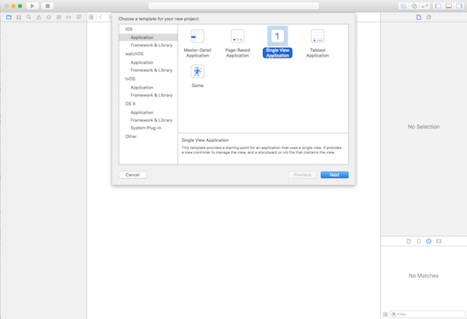
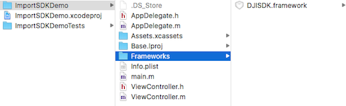
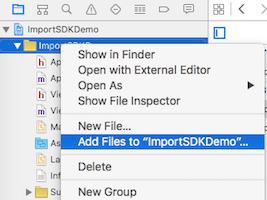
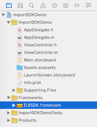
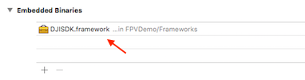
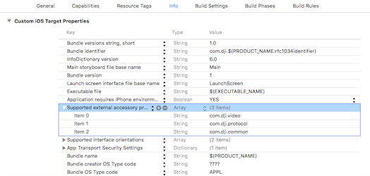
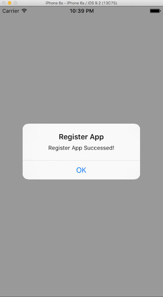

**Note: This Tutorial and Sample Project is developed based on iOS SDK v3.5.1, an update version for iOS SDK v4.0 will be published soon.**

---

In this tutorial, we will use the Xcode's "Single View Application" template project to show you how to import DJI iOS SDK and register the application.

## Downloading the SDK

  You can download DJI iOS SDK from <a href="https://developer.dji.com/mobile-sdk/downloads" target="_blank">DJI Developer Website</a>.

## Creating the Xcode Project

  Open Xcode, select **File->New->Project** to create a new project in Xcode, choose **Single View Application** template for your project and press "Next":
  
  
  
  Then enter "ImportSDKDemo" in the **Product Name** field and keep the other default settings:
  
  
  
## Importing the SDK
  
  Once the project is created, let's navigate to the "FPVDemo" folder of the project and create a new folder named "Frameworks". Next copy the **DJISDK.framework**, which you just download from DJI Developer website to this folder.
  
  
  
  Next, let's come back to the Xcode project navigator and right click on the "ImportSDKDemo" and select "Add Files to "ImportSDKDemo"..." to add the "Frameworks" folder to the Xcode Project.  
  
  
  
 Once you import the SDK successfully, you should see the following project structure screenshot:

   
 
 Furthermore, let's select the "ImportSDKDemo" target and open the "General" tab. In the "Embedded Binaries" section, press "+" to add the "DJISDK.framework" as shown below:
 
  

> **Note**:
> 
> **1.** In order to enable your app to connect to the MFI remote controller, you must add 
>  "Supported external accessory protocols" items in the info.plist file, let's modify it by adding the following content:
> 
>  
   
> **2.** Since in iOS 9, App Transport Security has blocked a cleartext HTTP (http://) resource load since it is insecure. You must add **App Transport Security Settings** items in the info.plist file as shown below too:
> 
>  

## Activating the Project

  Now, let's go to the "ViewController.m" file and import the "DJISDK.h" header file, then implement the `DJISDKManagerDelegate` protocol in the class extension part:
  
~~~objc
#import "ViewController.h"
#import <DJISDK/DJISDK.h>

@interface ViewController ()<DJISDKManagerDelegate>
@end
~~~
  
  Next, create a new method `registerApp`, invoke it in the `viewDidAppear` method as shown below:
  
~~~objc
- (void)viewDidAppear:(BOOL)animated
{
    [super viewDidAppear:animated];
    [self registerApp];
}

- (void)registerApp
{
    NSString *appKey = @"Enter Your App Key Here";
    [DJISDKManager registerApp:appKey withDelegate:self];
}
~~~

  In the code above, we invoke the `registerApp:withDelegate:` method of DJISDKManager to register the application on DJI Server and set "ViewController" as the delegate. Then we call the `registerApp` method in `viewDidAppear:` method when the view appear.

>**Note**: For the **App Key**, you may need to obtain it from the <a href="http://developer.dji.com/en/user/apps" target="_blank">DJI Developer website</a>.  If you are not familiar with the App Key, please check the [Get Started](../quick-start/index.html).

>The **App Key** we generate for you is associated with the Xcode project's **Bundle Identifier**, so you will not be able to use the same App Key in a different Xcode project. Each project must be submitted individually and will receive a unique App Key.
>

  Moreover, let's implement the `sdkManagerDidRegisterAppWithError:` delegate method to check the registration result:

~~~objc
- (void)sdkManagerDidRegisterAppWithError:(NSError *)error
{
    NSString* message = @"Register App Successed!";
    if (error) {
        message = @"Register App Failed! Please enter your App Key and check the network.";
    }else
    {
        NSLog(@"registerAppSuccess");
       [DJISDKManager startConnectionToProduct];
    }
    
    [self showAlertViewWithTitle:@"Register App" withMessage:message];
}

- (void)showAlertViewWithTitle:(NSString *)title withMessage:(NSString *)message
{
    UIAlertController *alert = [UIAlertController alertControllerWithTitle:title message:message preferredStyle:UIAlertControllerStyleAlert];
    UIAlertAction *okAction = [UIAlertAction actionWithTitle:@"OK" style:UIAlertActionStyleDefault handler:nil];
    [alert addAction:okAction];
    [self presentViewController:alert animated:YES completion:nil];
}
~~~

 If you register the app failed, you can check the **error** parameter of the  delegate method to figure out the problem. For more details, please check the **DJISDKRegistrationError** in the "NSError+DJISDK.h" file of DJISDK.

 Finally, build and run the project in Xcode using iOS Simulator. If everything goes well, you should see a "Register App Success!" alert once the application loads. 
  
  
  
## Where to go from here?
  
  If you want to learn how to use DJI iOS SDK to create a simple app, please check this tutorial: [Creating a Camera Application](./FPVDemo.html). It’s our introductory tutorial, which guides you through connecting to your aircraft's camera to displaying a live video feed in your app, through which you can take photos and videos.