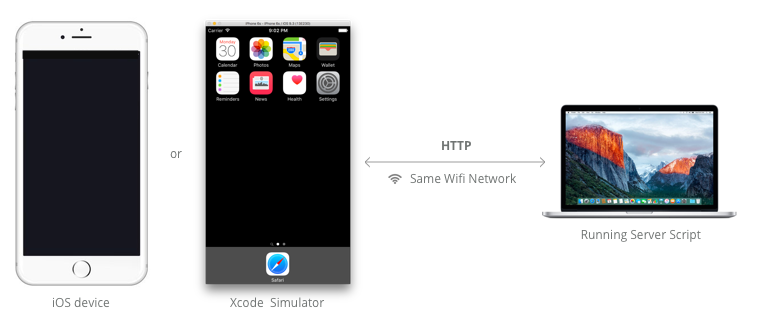
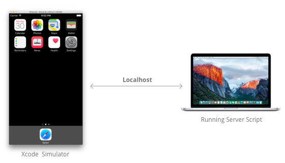
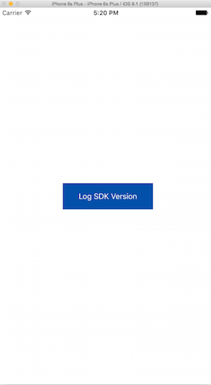

<!-- toc -->

This tutorial is designed for you to obtain a better understanding of the DJI Remote Logger Tool. It will teach you how to use it for showing application log messages on a simple webpage.

You can download the tutorial's final sample code project from this [Github Page](https://github.com/DJI-Mobile-SDK-Tutorials/DJIRemoteLoggerDemo).

## Introduction

  In order to use the DJI Remote Logger Tool, you should have two parts: **DJI iOS Mobile SDK** and **Server Script**. The remote logger feature is integrated inside the SDK, you can use this feature in your application directly. For the server part, there are two connection modes showing below:

### HTTP Mode

You can connect your iOS device and Mac to the same WiFi network or connect to a local wireless connection created on your Mac too. This would be helpful when you test your application outside without internet connection.

### Localhost Mode

If you don't have iOS device, you can use your Xcode Simulator too. Using the url string like **http://localhost:4567** can work well with the server script.

## Setup and Run the Server

  You can get the server script from the **Server** folder from the **Github Page**. Please follow the steps below to setup the server:
  
  1. Open your terminal app and go to the Server folder
  2. Run bash script with the command: `./run_log_server.bash`
  3. Open the webpage with the address shown in the command line

If everything goes well, you should see something similar to the following screenshots:

---  

---

### Troubleshooting

##### **1.** Lack of command line developer tools

If you meet the following error, you may need to install the command line developer tools:

   
Run this command: `xcode-select -install`, then you will see the following dialog:
   

   
After installing it, try `./run_log_server.bash` command again. Problem should be solved.
   
##### **2.** Lack of Ruby install

If you meet the following error, you may need to install ruby:
   

Run this command: `sudo brew install ruby`, after installing ruby successfully, try `./run_log_server.bash` command again. Problem should be solved.
   
For other issues, please check the two problems above.
   
## Download and Import the DJI SDK

 If you are not familiar with the process of installing DJI SDK in your Xcode project, please check the Github source code and this tutorial: [Importing and Activating DJI SDK in Xcode Project](../application-development-workflow/workflow-integrate.html#Xcode-Project-Integration) for details.

## Enable Remote Logging

**1.** Implement the **DJISDKManagerDelegate** protocol method in the ViewController.m file's extension part. Then create a new method named **registerApp** and invoke it in the viewDidAppear method as shown below:

~~~objc
- (void)registerApp
{
    //Please enter your App key in the "DJISDKAppKey" key in info.plist file.     
    [DJISDKManager registerAppWithDelegate:self];
}

- (void)viewDidAppear:(BOOL)animated {
    [super viewDidAppear:animated];
    [self registerApp];    
}
~~~

> **Note:** If you don't know how to apply as a DJI developer and get the App Key, please refer to the [Get Started](../quick-start/index.html).

**2**. Next, let's implement the DJISDKManagerDelegate method as shown below:

~~~objc
- (void)appRegisteredWithError:(NSError *)error
{
    NSString* message = @"Register App Successed!";
    if (error) {
        message = @"Register App Failed! Please enter your App Key and check the network.";
    }else
    {
        [DJISDKManager enableRemoteLoggingWithDeviceID:@"Enter Device ID Here" logServerURLString:@"Enter URL Here"];
    }
    
    [self showAlertViewWithTitle:@"Register App" withMessage:message];
}
~~~

The delegate method above gets called when the app is registered. If the registration is successful, we can call the `+(void) enableRemoteLoggingWithDeviceID: (NSString * _Nullable) deviceID logServerURLString: (NSString*) url;` class method of **DJISDKManager** to enable remote logging feature of the SDK by passing the **deviceID** parameter and **url** parameter, which you can get from the server script command line. 

> **Note:** 
> 
> **1.** The **deviceID** is used to distinguish different iOS devices. You can show log messages from different iOS devices on the same webpage.
> 
> **2.** The **url** is shown in the command line like this:
> 
> 

**3**. Build and run the project in Xcode. If everything is OK, you will see a "Register App Successed!" alert once the application loads. 

## Show Log Message on Webpage

   Go to Main.storyboard and drag a UIButton to the center of the view, name it "Log SDK Version" and create an IBAction method, named `- (IBAction)logSDKVersionButtonAction:(id)sender` for it in the ViewController.m file. Implement the IBAction method shown as below:
   
~~~objc
- (IBAction)logSDKVersionButtonAction:(id)sender {
   DJILogDebug(@"SDK Version: %@", [DJISDKManager SDKVersion]);
}
~~~

   In the code above, we use **DJILogDebug** Macro to show SDK's version info. There are five types of log Macros, you can use them for different purposes:
  
- DJILogError( )
- DJILogWarn( )
- DJILogInfo( )
- DJILogDebug( )
- DJILogVerbose( )

Finally, build and run the project, press the button, you may be able to see the SDK version log message on the webpage like the followings:
   

   

> **Note**: If you cannot see the logs on webpage and got the log message in the Xcode Console like this: 
> 
> 
> You can solve this issue by adding the following item, "App Transport Security Settings" in the **Info.plist** file and modify the "Allow Arbitrary Loads" BOOL value to YES:
> 
> 
> 

 Furthermore, the DJI Remote Logger Tool supports multiple iOS devices logging, you can assign different Device IDs for different iOS devices in the `+(void)enableRemoteLoggingWithDeviceID:logServerURLString:` class method of DJISDKManager.
  
 Also you can use url content filter for specific device's log like this: 
  `http://10.81.9.167:4567/?filter=113`. 
  
 
  
### Summary

  Congratulations! You've learned how to use DJI Remote Logger Tool to show log messages of your application using DJI Mobile SDK. With DJI Remote Logger Tool, you can developer and debug your application with DJI Mobile SDK more efficiently. Hope you enjoy this tutorial, Thanks!

