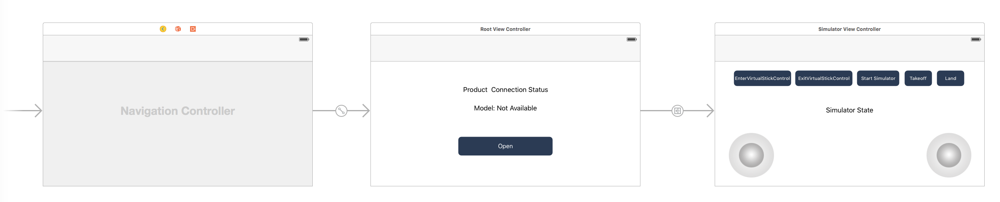

*If you come across any mistakes or bugs in this tutorial, please let us know using a Github issue, a post on the DJI Forum. Please feel free to send us Github pull request and help us fix any issues.*

---

In this tutorial, you will learn how to use the DJISimulator in your Xcode project using DJI Mobile SDK. With the help of Virtual Stick control, you can input Virtual Stick flight control data and check the changes of simulator state in real time.

You can download the tutorial's final sample code project from this [Github Page](https://github.com/DJI-Mobile-SDK-Tutorials/iOS-SimulatorDemo).

We use Mavic Pro as an example to make this demo.

Let's get started!

## Introduction

DJISimulator is used to control the aircraft in a simulated environment based on the virtual stick input. The simulated aircraft state information will also be displayed on the screen.

You can use the `DJISimulator` class in `DJIFlightController` to control the simulation. It allows both manual and automated flights to be simulated without actually flying the aircraft.

Additionally, simulator initialization, monitoring and termination can be controlled directly through the SDK allowing for application development in continuous integration environments.

## Implementing the UI of the Application

### Importing SDK and Register Application

Now, let's create a new project in Xcode, choose **Single View Application** template for your project and press "Next", then enter "DJISimulatorDemo" in the **Product Name** field and keep the other default settings.

Once the project is created, let's delete the **ViewController.h** and **ViewController.m** files, which were created by Xcode when you create the project. Then create a UIView Controller named **RootViewController** and set the class of original ViewController object in storyboard to "RootViewController".

Next, let's import the DJISDK.framework to the project and implement the registration process in the **RootViewController**. If you are not familiar with the process of importing and activating DJI SDK, please check this tutorial: [Importing and Activating DJI SDK in Xcode Project](../application-development-workflow/workflow-integrate.html#Xcode-Project-Integration) for details.

### Working on the UI of Application

#### Creating the UI of RootViewController 

Let's open the "Main.storyboard" and make the **RootViewController** embed in a Navigation Controller and set it as the Storyboard Entry Point. Next, drag and drop two UILabel objects to the RootViewController and named them as "Product Connection Status" and "Model: Not Available". Moreover, drag and drop a UIButton object and place under the two UILabels, named it as "Open", then set its background image as "btn.png" file, which you can get it from the tutorial's Github Sample Project. Lastly, setup the UI elements' auto layout to support multiple device screen size.

#### Creating the UI of DJISimulatorViewController

Drag and drop another ViewController object from the Object Library to the right of **RootViewController** in the storyboard. Then create another UIViewController class file in the navigator and named it as "DJISimulatorViewController", then set the class name in storyboard too.

Furthermore, drag and drop 5 UIButton objects and place them on top, named them from the left to right as "EnterVirtualStickControl", "ExitVirtualStickControl", "Start Simulator", "Takeoff" and "Land". Make sure they are place inside a UIView object as subviews. Next, drag and drop a UILabel and place it under the 5 UIButton objects, named it as "Simulator State". 

Lastly, place two UIImageView objects inside a UIView (Label it as "VirtualStick Left") as subviews, and set their images as "stick\_base.png" and "stick\_normal.png", which you can get them from the tutorial's Github sample project. Now, the left joystick's UI has setuped. Similiarly, let's make the right joystick's UI in the same way. 

For more detail configurations of storyboard, please check the tutorial's Github sample project. If everything goes well, you should see the following screenshot:

## Working on RootViewController

Let's open RootViewController.m file and create IBOutlets properties to link the UI elements in storyboard. Then add the following method to update the two UILabel objects' content when product connection update: 

~~~objc
-(void) updateStatusBasedOn:(DJIBaseProduct* )newConnectedProduct {
    if (newConnectedProduct){
        self.connectStatusLabel.text = NSLocalizedString(@"Status: Product Connected", @"");
        self.modelNameLabel.text = [NSString stringWithFormat:NSLocalizedString(@"Model: \%@", @""),newConnectedProduct.model];
        self.modelNameLabel.hidden = NO;
        
    }else {
        self.connectStatusLabel.text = NSLocalizedString(@"Status: Product Not Connected", @"");
        self.modelNameLabel.text = NSLocalizedString(@"Model: Unknown", @"");
    }
}
~~~

Next, invoke the above method at the end of both the `viewDidAppear` method and `productConnected:` method as shown below:

~~~objc
- (void)viewDidAppear:(BOOL)animated
{
    ...
    
    if(self.product){
        [self updateStatusBasedOn:self.product];
    }
}
~~~

~~~objc
- (void)productConnected:(DJIBaseProduct *)product
{
    ...
    
    [self updateStatusBasedOn:product];
}
~~~

For more details of the implementation of RootViewController, please check the tutorial's Github sample project.

## Implementing VirtualStickView

In order to input some simulated data, like `pitch`, `roll`, `yaw` and `verticalThrottle`, you will need a virtual stick control. In our previous step, we have finished the UI of the virtual stick, let's work on the implementation.

We implement the virtual stick control base on an open source Github project <a href="https://github.com/pyzhangxiang/joystick-ios" target="_blank">joystick_ios</a>, now create a new UIView class and named it as **VirtualStickView**. You can check the same class files in the tutorial's Github Sample Project for implementation details, here we just explain the notification logic.

The following method will be invoked in `touchEvent:`, `touchesEnded:withEvent:`, `touchesCancelled:withEvent:` and `onUpdateTimerTicked:` methods in VirtualStickView.m file:

~~~objc
- (void)notifyDir:(CGPoint)dir
{
    NSValue *vdir = [NSValue valueWithCGPoint:dir];
    NSDictionary *userInfo = [NSDictionary dictionaryWithObjectsAndKeys:
                              vdir, @"dir", nil];
    
    NSNotificationCenter *notificationCenter = [NSNotificationCenter defaultCenter];
    [notificationCenter postNotificationName:@"StickChanged" object:self userInfo:userInfo];
}
~~~

When you touch on the virtual stick image and drag it around inside the **VirtualStickView**, the NSNotificationCenter will post a notification with the name of "StickChanged" and the location of the current virtual stick, which uses a CGPoint to represent it.

## Implementing DJISimulatorViewController

Once you finished implementing the VirtualStickView, let's continue to implement the last **DJISimulatorViewController**. Open the DJISimulatorViewController.m file and import the following header files and create related IBOutlet properties and IBAction methods:

~~~objc
#import "DJISimulatorViewController.h"
#import "VirtualStickView.h"
#import <DJISDK/DJISDK.h>

@interface DJISimulatorViewController ()<DJISimulatorDelegate>

@property(nonatomic, weak) IBOutlet VirtualStickView *joystickLeft;
@property(nonatomic, weak) IBOutlet VirtualStickView *joystickRight;

@property (weak, nonatomic) IBOutlet UIButton *simulatorButton;
@property (weak, nonatomic) IBOutlet UILabel *simulatorStateLabel;
@property (assign, nonatomic) BOOL isSimulatorOn;
@property (assign, nonatomic) float mXVelocity;
@property (assign, nonatomic) float mYVelocity;
@property (assign, nonatomic) float mYaw;
@property (assign, nonatomic) float mThrottle;

- (IBAction) onEnterVirtualStickControlButtonClicked:(id)sender;
- (IBAction) onExitVirtualStickControlButtonClicked:(id)sender;
- (IBAction) onTakeoffButtonClicked:(id)sender;
- (IBAction) onSimulatorButtonClicked:(id)sender;
- (IBAction) onLandButtonClicked:(id)sender;

@end
~~~

Here, we first implement the **DJISimulatorDelegate** protocol in the interface. Then create IBOutlet properties for the left and right `VirtualStickView`, and the `simulatorButton`, `simulatorStateLabel`. The `isSimulatorOn` bool property is used to store the start state of DJISimulator. `mXVelocity`, `mYVelocity`, `mYaw` and `mThrottle` properties are used to store the `DJIVirtualStickFlightControlData` struct data of `DJIFlightController`.

For the remaining five IBAction methods, they are related to the five UIButtons on top. We can use them to **enter** or **exit** virtual stick, **take off** or **auto land** the aircraft and **start** or **stop** simulator.

Before we continue to implement the **DJISimulatorViewController**, let's create the **DemoUtility** class (Inherited from `NSObject`) to define some common methods:

- DemoUtility.h

~~~objc
#import <Foundation/Foundation.h>
#import <UIKit/UIKit.h>

#define WeakRef(__obj) __weak typeof(self) __obj = self
#define WeakReturn(__obj) if(__obj ==nil)return;

@class DJIBaseProduct;
@class DJIAircraft;
@class DJIGimbal;
@class DJIFlightController;

@interface DemoUtility : NSObject

+(DJIBaseProduct*) fetchProduct;
+(DJIAircraft*) fetchAircraft;
+(DJIFlightController*) fetchFlightController;
+ (void)showAlertViewWithTitle:(NSString *)title message:(NSString *)message cancelAlertAction:(UIAlertAction*)cancelAlert defaultAlertAction:(UIAlertAction*)defaultAlert viewController:(UIViewController *)viewController;

@end
~~~

- DemoUtlity.m

~~~objc
#import "DemoUtility.h"
#import <DJISDK/DJISDK.h>

@implementation DemoUtility

+(DJIBaseProduct*) fetchProduct {
    return [DJISDKManager product];
}

+(DJIAircraft*) fetchAircraft {
    if (![DJISDKManager product]) {
        return nil;
    }
    if ([[DJISDKManager product] isKindOfClass:[DJIAircraft class]]) {
        return ((DJIAircraft*)[DJISDKManager product]);
    }
    return nil;
}

+(DJIFlightController*) fetchFlightController {
    if (![DJISDKManager product]) {
        return nil;
    }
    if ([[DJISDKManager product] isKindOfClass:[DJIAircraft class]]) {
        return ((DJIAircraft*)[DJISDKManager product]).flightController;
    }
    return nil;
}

+ (void)showAlertViewWithTitle:(NSString *)title message:(NSString *)message cancelAlertAction:(UIAlertAction*)cancelAlert defaultAlertAction:(UIAlertAction*)defaultAlert viewController:(UIViewController *)viewController{
    
    UIAlertController *alertController = [UIAlertController alertControllerWithTitle:title message:message preferredStyle:UIAlertControllerStyleAlert];
    
    if (cancelAlert) {
        [alertController addAction:cancelAlert];
    }
    if (defaultAlert) {
        [alertController addAction: defaultAlert];
    }
    
    [viewController presentViewController:alertController animated:YES completion:nil];
}

@end
~~~

For the `fetchProduct`, `fetchAircraft` and `fetchFlightController ` methods, they are used to get the latest DJIBaseProduct, DJIAircraft and DJIFlightController object. For the `showAlertViewWithTitle:message: cancelAlertAction:defaultAlertAction:viewController:` method, it's used to show an alertView for our developers.

### Working on the Virtual Stick Control feature

Now, let's come back to the "DJISimulatorViewController.m" file and implement the virtual stick feature. First, we create an NSNotificationCenter variable and invoke the `addObserver:selector:name:object:` method to observe the "StickChanged" notification, which is post from the **VirtualStickView**. When the notification is post, a selector method `onStickChanged:` will be invoked to send virtual stick flight control data as shown below:

~~~objc
- (void)viewDidLoad
{
    [super viewDidLoad];
    
    self.title = @"DJISimulator Demo";
    
    NSNotificationCenter *notificationCenter = [NSNotificationCenter defaultCenter];
    [notificationCenter addObserver: self
                           selector: @selector (onStickChanged:)
                               name: @"StickChanged"
                             object: nil];
                                
~~~

Next, implement the `onStickChanged:` select method and `setThrottle:andYaw:`, `setXVelocity:andYVelocity:` methods as shown below:

~~~objc
- (void)onStickChanged:(NSNotification*)notification
{
    NSDictionary *dict = [notification userInfo];
    NSValue *vdir = [dict valueForKey:@"dir"];
    CGPoint dir = [vdir CGPointValue];
    
    VirtualStickView* virtualStick = (VirtualStickView*)notification.object;
    if (joystick) {
        if (virtualStick == self.virtualStickLeft) {
            [self setThrottle:dir.y andYaw:dir.x];
        }
        else
        {
            [self setXVelocity:-dir.y andYVelocity:dir.x];
        }
    }
}

-(void) setThrottle:(float)y andYaw:(float)x
{
    self.mThrottle = y * -2;
    self.mYaw = x * 30;
    
    [self updateVirtualStick];
}

-(void) setXVelocity:(float)x andYVelocity:(float)y {
    self.mXVelocity = x * 15.0;
    self.mYVelocity = y * 15.0;
    [self updateVirtualStick];
}

-(void) updateVirtualStick
{
    // In rollPitchVelocity mode, the pitch property in DJIVirtualStickFlightControlData represents the Y direction velocity.
    // The roll property represents the X direction velocity.
    DJIVirtualStickFlightControlData ctrlData = {0};
    ctrlData.pitch = self.mYVelocity;
    ctrlData.roll = self.mXVelocity;
    ctrlData.yaw = self.mYaw;
    ctrlData.verticalThrottle = self.mThrottle;
    DJIFlightController* fc = [DemoUtility fetchFlightController];
    if (fc && fc.isVirtualStickControlModeAvailable) {
        [fc sendVirtualStickFlightControlData:ctrlData withCompletion:nil];
    }
}
~~~

In the code above, we implement the following features:

**1.** In the `onStickChanged:` method, we get the CGPoint object of the moving virtual stick's position, cast the notification object to get the `VirtualStickView` object. Then we invoke the `setThrottle:andYaw` and `setXVelocity:andYVelocity:` methods based on the current controlling virtual stick. 

**2.** The range of VirtualStickView's movement is [-1, 1], up and down, left and right. Please check the follow diagram for details:

 So the range of **x** and **y** value of `dir` variable is [-1, 1]. In the `setThrottle:andYaw:` method, we multiply `y` by -2 to change the range to [-2, 2] from bottom to top. Then multiply `x` by 30 to change the range to [-30, 30]. These range are tested by us to achieve a better control experience, you can take them for example. Moreover, you can learn the max and min values of control velocity for throttle and yaw in virtual stick control from the following const variables in `DJIFlightController`:
 
 - Yaw control
 
~~~objc
 /**
 *  Yaw control angular velocity MAX value is 100 degrees/second.
 */
DJI_API_EXTERN const float DJIVirtualStickYawControlMaxAngularVelocity;
/**
 *  Yaw control angular velocity MIN value is -100 degrees/second.
 */
DJI_API_EXTERN const float DJIVirtualStickYawControlMinAngularVelocity; 
~~~
 
 - Throttle Control

~~~objc
 /**
 *  The vertical control velocity MIN value is -4 m/s in `VirtualStickControlMode`. Positive velocity is up.
 */
DJI_API_EXTERN const float DJIVirtualStickVerticalControlMinVelocity;
/**
 *  The vertical control velocity MAX value is 4 m/s in VirtualStickControlMode. Positive velocity is up.
 */
DJI_API_EXTERN const float DJIVirtualStickVerticalControlMaxVelocity;
~~~

Lastly, invoke the `updateVirtualStick` method to send the virtual stick control data.

**3.** In the `setXVelocity:andYVelocity:` method, we multiply the `x` and `y` variables with `DJIVirtualStickRollPitchControlMaxVelocity` to change the range to [-15, 15] for pitch and roll axises velocity control, you can  learn the max and min values of control velocity for roll and pitch in virtual stick control from the following const variables in `DJIFlightController`:

~~~objc
/**
 *  Roll/Pitch control velocity MAX value is 15m/s.
 */
DJI_API_EXTERN const float DJIVirtualStickRollPitchControlMaxVelocity;
/**
 *  Roll/Pitch control velocity MIN value is -15m/s.
 */
DJI_API_EXTERN const float DJIVirtualStickRollPitchControlMinVelocity;
~~~

Then invoke the `updateVirtualStick` method to send the virtual stick control data.

**4.** In the `updateVirtualStick` method, we first create and initialize a `DJIVirtualStickFlightControlData` variable and assign its `pitch`, `roll`, `yaw` and `verticalThrottle` values with `self.mYVelocity`, `self.mXVelocity`, `self.mYaw` and `self.mThrottle`. Then invoke the `sendVirtualStickFlightControlData:withCompletion:` method of DJIFlightController to send the simulated virtual stick control data to the aircraft. 

Once you finished the above step, let's implement the **Enable Virtual Stick** and **Exit Virtual Stick** IBAction methods:

~~~objc
-(IBAction) onEnterVirtualStickControlButtonClicked:(id)sender
{
    DJIFlightController* fc = [DemoUtility fetchFlightController];
    UIAlertAction *cancelAction = [UIAlertAction actionWithTitle:@"OK" style:UIAlertActionStyleCancel handler:nil];
    
    if (fc) {
        fc.yawControlMode = DJIVirtualStickYawControlModeAngularVelocity;
        fc.rollPitchControlMode = DJIVirtualStickRollPitchControlModeVelocity;
        
        WeakRef(target);
        [fc setVirtualStickModeEnabled:YES withCompletion:^(NSError * _Nullable error) {
            WeakReturn(target);
            if (error) {
                [DemoUtility showAlertViewWithTitle:nil message:[NSString stringWithFormat:@"Enter Virtual Stick Mode: %@", error.description] cancelAlertAction:cancelAction defaultAlertAction:nil viewController:target];
            }
            else
            {
                [DemoUtility showAlertViewWithTitle:nil message:@"Enter Virtual Stick Mode:Succeeded" cancelAlertAction:cancelAction defaultAlertAction:nil viewController:target];
            }

        }];
    }
    else
    {
        [DemoUtility showAlertViewWithTitle:nil message:@"Component not exist." cancelAlertAction:cancelAction defaultAlertAction:nil viewController:self];
    }
}
~~~

~~~objc
-(IBAction) onExitVirtualStickControlButtonClicked:(id)sender
{
    DJIFlightController* fc = [DemoUtility fetchFlightController];
    UIAlertAction *cancelAction = [UIAlertAction actionWithTitle:@"OK" style:UIAlertActionStyleCancel handler:nil];
    
    if (fc) {
        WeakRef(target);
        [fc setVirtualStickModeEnabled:NO withCompletion:^(NSError * _Nullable error) {
            WeakReturn(target);
            if (error){
                [DemoUtility showAlertViewWithTitle:nil message:[NSString stringWithFormat:@"Exit Virtual Stick Mode: %@", error.description] cancelAlertAction:cancelAction defaultAlertAction:nil viewController:target];
            } else{
                [DemoUtility showAlertViewWithTitle:nil message:@"Exit Virtual Stick Mode:Succeeded" cancelAlertAction:cancelAction defaultAlertAction:nil viewController:target];
            }
        }];
    }
    else
    {
        [DemoUtility showAlertViewWithTitle:nil message:@"Component not exist." cancelAlertAction:cancelAction defaultAlertAction:nil viewController:self];

    }
}
~~~

In the `onEnterVirtualStickControlButtonClicked:` IBAction method, we first assign the `yawControlMode` and `rollPitchControlMode` properties of DJIFlightController to `DJIVirtualStickYawControlModeAngularVelocity` and `DJIVirtualStickRollPitchControlModeVelocity`. Then invoke the `setVirtualStickModeEnabled:withCompletion:` method of DJIFlightController to enable the virtual stick control. 

Similiarly, in the `onExitVirtualStickControlButtonClicked:` IBAction method, we invoke the `setVirtualStickModeEnabled:withCompletion:` method of DJIFlightController to disable virtual stick control.

### Implementing DJISimulator

  Before we implement the DJISimulator feature, we may need to update the `simulatorButton`'s title and hidden state first. Let's override the `viewWillAppear:` and `viewWillDisappear:` methods as shown below:

~~~objc
-(void)viewWillAppear:(BOOL)animated {
    
    [super viewWillAppear:animated];
    
    DJIFlightController* fc = [DemoUtility fetchFlightController];
    if (fc && fc.simulator) {
        self.isSimulatorOn = fc.simulator.isSimulatorActive;
        [self updateSimulatorUI];
        
        [fc.simulator addObserver:self forKeyPath:@"isSimulatorActive" options:NSKeyValueObservingOptionNew context:nil];
        [fc.simulator setDelegate:self];
    }
}

-(void)viewWillDisappear:(BOOL)animated {
    
    [super viewWillDisappear:animated];
    
    DJIFlightController* fc = [DemoUtility fetchFlightController];
    if (fc && fc.simulator) {
        [fc.simulator removeObserver:self forKeyPath:@"isSimulatorActive"];
        [fc.simulator setDelegate:nil];
    }
}

-(void)observeValueForKeyPath:(NSString *)keyPath ofObject:(id)object change:(NSDictionary<NSString *,id> *)change context:(void *)context {
    if ([keyPath isEqualToString:@"isSimulatorActive"]) {
        self.isSimulatorOn = [[change objectForKey:NSKeyValueChangeNewKey] boolValue];
        [self updateSimulatorUI];
    }
}

-(void) updateSimulatorUI {
    if (!self.isSimulatorOn) {
        [self.simulatorButton setTitle:@"Start Simulator" forState:UIControlStateNormal];
        [self.simulatorStateLabel setHidden:YES];
    }
    else {
        [self.simulatorButton setTitle:@"Stop Simulator" forState:UIControlStateNormal];
    }
}
~~~

In the `viewWillAppear:` method, we first fetch the DJIFlightController object and update the `isSimulatorOn` variable, then invoke the `updateSimulatorUI` method to update the `simulatorButton` label. Furthermore, we use KVO here to observe the changes of `isSimulatorActive` variable value of `DJISimulator`. Then set the delegate of the DJIFlightController's DJISimulator to self(DJISimulatorViewController).

Next in the `viewWillDisappear:` method, we fetch the latest DJIFlightController object, then remove the observer of `isSimulatorActive`, and set the delegate of DJISimulator to nil. 

Moreover, in the NSKeyValueObserving method, we fetch and update the latest `isSimulatorOn` property and invoke the `updateSimulatorUI` method to update the `simulatorButton`.

Now, let's implement the `onSimulatorButtonClicked:` IBAction method as shown below:

~~~objc
- (IBAction)onSimulatorButtonClicked:(id)sender {
    
    DJIFlightController* fc = [DemoUtility fetchFlightController];
    UIAlertAction *cancelAction = [UIAlertAction actionWithTitle:@"OK" style:UIAlertActionStyleCancel handler:nil];

    if (fc && fc.simulator) {
        if (!self.isSimulatorOn) {
            // The initial aircraft's position in the simulator.
            CLLocationCoordinate2D location = CLLocationCoordinate2DMake(22, 113);
            WeakRef(target);
            [fc.simulator startWithLocation:location updateFrequency:20 GPSSatellitesNumber:10 withCompletion:^(NSError * _Nullable error) {
                WeakReturn(target);
                if (error) {
                    [DemoUtility showAlertViewWithTitle:nil message:[NSString stringWithFormat:@"Start simulator error: %@", error.description] cancelAlertAction:cancelAction defaultAlertAction:nil viewController:target];

                } else {
                    [DemoUtility showAlertViewWithTitle:nil message:@"Start Simulator succeeded." cancelAlertAction:cancelAction defaultAlertAction:nil viewController:target];
                }
            }];
        }
        else {
            WeakRef(target);
            [fc.simulator stopWithCompletion:^(NSError * _Nullable error) {
                WeakReturn(target);
                if (error) {
                    [DemoUtility showAlertViewWithTitle:nil message:[NSString stringWithFormat:@"Stop simulator error: %@", error.description] cancelAlertAction:cancelAction defaultAlertAction:nil viewController:target];

                } else {
                    [DemoUtility showAlertViewWithTitle:nil message:@"Stop Simulator succeeded." cancelAlertAction:cancelAction defaultAlertAction:nil viewController:target];
                }
            }];
        }
    }
}
~~~

In the code above, we first check if the simulator is started, if not, then create an initial aircraft location with CLLocationCoordinate2DMake(22, 113). Next invoke the `startWithLocation:updateFrequency:GPSSatellitesNumber:withCompletion:` method of `DJISimulator` with the frequency of 20 and GPS satellite number of 10 to start the simulator. For more details of this method, please check the following method's inline documentations:

~~~objc
/**
 *  Start simulator. Will result in error if simulation is already started.
 *
 *  @param location     Simulator coordinate latitude and longitude in degrees.
 *  @param frequency    Aircraft simulator state push frequency in Hz with range
 *                      [2, 150]. A setting of 10 Hz will result in delegate
 *                      method being called, 10 times per second.
 *  @param number       The initial number of GPS satellites with range [0, 20].
 *  @param completion        The completion block.
 */
- (void)startWithLocation:(CLLocationCoordinate2D)location
          updateFrequency:(NSUInteger)frequency
      GPSSatellitesNumber:(NSUInteger)number
           withCompletion:(DJICompletionBlock)completion;
~~~

if the simulator has already started, we can invoke the `stopWithCompletion:` method of DJISimulator to stop the simulator.

Lastly, let's implement the DJI Simulator delegate method as shown below:

~~~objc
- (void)simulator:(DJISimulator *_Nonnull)simulator didUpdateState:(DJISimulatorState *_Nonnull)state
{
   [self.simulatorStateLabel setHidden:NO];
   self.simulatorStateLabel.text = [NSString stringWithFormat:@"Yaw: %0.2f Pitch: %0.2f, Roll: %0.2f\n PosX: %0.2f PosY: %0.2f PosZ: %0.2f", state.yaw, state.pitch, state.roll, state.positionX, state.positionY, state.positionZ];
}
~~~

This delegate method will be invoked when the simulator state is updated. We can update the `simulatorStateLabel`'s hidden state and its text content here.

### Working on Takeoff and AutoLanding features

In order to simulate the aircraft's flight behaviour in a simulated environment, we will implement the take off and auto landing features here in the following two IBAction methods:

~~~objc
-(IBAction) onTakeoffButtonClicked:(id)sender
{
    DJIFlightController* fc = [DemoUtility fetchFlightController];
    UIAlertAction *cancelAction = [UIAlertAction actionWithTitle:@"OK" style:UIAlertActionStyleCancel handler:nil];
    
    if (fc) {
        WeakRef(target);
        [fc startTakeoffWithCompletion:^(NSError * _Nullable error) {
            WeakReturn(target);
            if (error) {
                [DemoUtility showAlertViewWithTitle:nil message:[NSString stringWithFormat:@"Takeoff: %@", error.description] cancelAlertAction:cancelAction defaultAlertAction:nil viewController:target];
                
            } else {
                [DemoUtility showAlertViewWithTitle:nil message:@"Takeoff Success." cancelAlertAction:cancelAction defaultAlertAction:nil viewController:target];
                
            }
        }];
    }
    else
    {
        [DemoUtility showAlertViewWithTitle:nil message:@"Component not exist." cancelAlertAction:cancelAction defaultAlertAction:nil viewController:self];
    }
}

- (IBAction)onLandButtonClicked:(id)sender {
    
    DJIFlightController* fc = [DemoUtility fetchFlightController];
    UIAlertAction *cancelAction = [UIAlertAction actionWithTitle:@"OK" style:UIAlertActionStyleCancel handler:nil];

    if (fc) {
        WeakRef(target);
        [fc startLandingWithCompletion:^(NSError * _Nullable error) {
            WeakReturn(target);
            if (error) {
                [DemoUtility showAlertViewWithTitle:nil message:[NSString stringWithFormat:@"AutoLand : %@", error.description] cancelAlertAction:cancelAction defaultAlertAction:nil viewController:target];

            } else {
                [DemoUtility showAlertViewWithTitle:nil message:@"AutoLand Started." cancelAlertAction:cancelAction defaultAlertAction:nil viewController:target];
            }
        }];
    }
    else
    {
        [DemoUtility showAlertViewWithTitle:nil message:@"Component not exist." cancelAlertAction:cancelAction defaultAlertAction:nil viewController:self];
    }
}
~~~

In the `onTakeoffButtonClicked:` IBAction method, we invoke the `startTakeoffWithCompletion:` method of DJIFlightController to send the take off command to the aircraft. Similiarly, in the `onLandButtonClicked:` IBAction method, we invoke the `startLandingWithCompletion:` method to send the auto landing command. It's just that simple and easy.

We have gone through a long way so far, now, let's build and run the project, connect the demo application to  your Mavic Pro (Please check the [Run Application](../application-development-workflow/workflow-run.html) for more details) and check all the features we have implemented so far. 

If everything goes well, you should see something similiar to the following gif animation:

- If the demo application is connected with Mavic Pro successfully, you should see the `connectButton` button is available to press and the `connectStatusLabel` and `modelNameLabel` show the correct infos.
- Press **Open** and enter the simulator demo page, press **EnterVirtualStickControl** button to enable virtual stick control, then press "Start Simulator" to start the simulator.
- Moreover, press the **Takeoff** button to send take off command to the aircraft, if the command executes successfully, you should see the **PosZ** value start to change, means that the aircraft is rising.
- Now you can drag the left and right virtual stick controls to simulate the flight behavious.
- Lastly, press the "Land" button to make the aircraft start auto landing, once it finish, you may notice the **PosZ** value become "0.00". Press the "Stop Simulator" button to stop the simulator and then press "ExitVirtualStickControl" to disable the virtual stick control.

### Summary

In this tutorial, you've learned how to use the DJISimulator feature to simulate aircraft's flight behaviour in a simulated environment based on the virtual stick control input and show the changes of simulator state(Yaw,Pitch,Roll,PosX,PosY and PosZ) in real time. Also you've learned how to use Virtual Stick control to send virtual stick flight control data to the aircraft.

This demo is a simple demonstration of using DJISimulator, to have a better user experience, you can create a 3D simulated environment using 3D game engine like <a href="https://unity3d.com" target="_blank"> Unity3D </a> or <a href="http://cocos3d.org" target="_blank"> Cocos3D </a> to show the simulated data and aircraft flight behavious inside your mobile application (Like the Flight Simulator in DJI Go app)!  

Furthermore, the DJISimulator allows for automated testing in continous integration environment(Like <a href="https://jenkins.io" target="_blank"> Jenkins </a>), it would help your DJI-SDK based application testing process. Good luck, and hope you enjoyed this tutorial!

