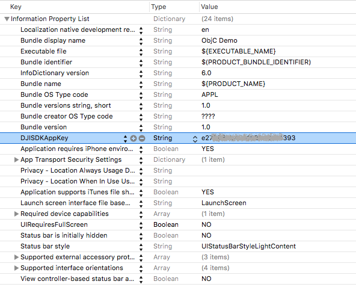

To have a better experience of learning how to get started with the DJI iOS Mobile SDK, please check this <a href="http://www.djivideos.com/video_play/7fefabf9-b8c6-483c-be3d-de1858c48fe8" class="fancybox fancybox.iframe">Getting Started Video</a>.

## Register as a DJI Developer

Register for a DJI Developer account here: <a href="http://developer.dji.com/register" target="_blank">http://developer.dji.com/register</a>.

During the registration process, email information and a credit card or phone number will need to be supplied to verify registration. Any credit card information given will only be used for verification and will not be charged.

This guide assumes Xcode version 7.3 above and Android Studio version 2.1.1.

## Generate an App Key

Every application needs a unique App Key to initialize the SDK.

To create an App Key for an application:

Go to the DJI developer <a href="http://developer.dji.com/en/user/apps" target="_blank">User Center</a>

*    Select the "Apps" tab on the left.
*    Select the "Create App" button on the right.
* Enter the name, platform, package identifier, category and description of the application.

    * For iOS, the package identifier is the <a href="http://developer.dji.com/en/user/mobile-sdk/ios-configuration" target="_blank">Bundle Identifier</a>.
    * For Android, the package identifier is the <a href="http://developer.dji.com/en/user/mobile-sdk/android-configuration/" target="_blank">Package Name</a>.

* An application activation email will be sent to complete App Key generation.
* The App Key will appear in the user center, and can be copied and pasted into the application.

## iOS Sample App

### iOS Sample Code Setup

Download or clone the iOS Sample Github Project from: <a href="https://github.com/dji-sdk/Mobile-SDK-iOS" target="_blank">https://github.com/dji-sdk/Mobile-SDK-iOS</a>.

The sample code includes both an Objective C sample project and a Swift Sample project.

Since the sample code project has been integrated with [DJI iOS SDK CocoaPods](https://cocoapods.org/pods/DJI-SDK-iOS) now, please check the following steps to install **DJISDK.framework** using CocoaPods after you downloading the project:

**1.** Install CocoaPods

Open Terminal and change to the download project's directory, enter the following command to install it:

~~~
sudo gem install cocoapods
~~~

The process may take a long time, please wait. For further installation instructions, please check [this guide](https://guides.cocoapods.org/using/getting-started.html#getting-started).

**2.** Install SDK with CocoaPods in the Project

Run the following command in the **ObjcSampleCode** and **SwiftSampleCode** paths:

~~~
pod install
~~~

If you install it successfully, you should get the messages similar to the following:

~~~
Analyzing dependencies
Downloading dependencies
Installing DJI-SDK-iOS (4.0)
Generating Pods project
Integrating client project

[!] Please close any current Xcode sessions and use `DJISdkDemo.xcworkspace` for this project from now on.
Pod installation complete! There is 1 dependency from the Podfile and 1 total pod
installed.
~~~

> **Note**: If you saw "Unable to satisfy the following requirements" issue during pod install, please run the following commands to update your pod repo and install the pod again:
> 
~~~
 pod repo update
 pod install
~~~

#### Objective C App Key Setup

Navigate to the **ObjcSampleCode** folder and open the **DJISdkDemo.xcworkspace** project in Xcode.

* Change the <a href="http://developer.dji.com/en/user/mobile-sdk/ios-configuration" target="_blank">Bundle Identifier</a> to a unique identifier and use it to generate an [App Key](#generate-an-app-key).

* Paste the generated App Key string into the `DJISDKAppKey` string value of the **info.plist** file of the Xcode project:

#### Swift App Key Setup

Navigate to the **DJISDKSwiftDemo** folder and open the **DJISDKSwiftDemo.xcodeproj** project in Xcode.

* Change the <a href="http://developer.dji.com/en/user/mobile-sdk/ios-configuration" target="_blank">Bundle Identifier</a> to a unique identifier and use it to generate an [App Key](#generate-an-app-key).

* Paste the generated App Key string into the `DJISDKAppKey` string value of the **info.plist** file of the Xcode project the same as the Objective C App Key Setup.

## Android Sample App

The SDK doesn't need to be downloaded to run the Android sample application as it's already included in the project. 

### Android Sample Code Setup

Download or clone the Android Sample Github Project from: <a href="https://github.com/dji-sdk/Mobile-SDK-Android" target="_blank">https://github.com/dji-sdk/Mobile-SDK-Android</a>.

Open the project in Android Studio and paste the generated [App Key](#generate-an-app-key) string into `android:value` in the "com.dji.sdk.API_KEY" meda-data element in the "AndroidManifest.xml" file.

~~~xml
<!--
    ADD API_KEY HERE and make sure you
    are connected to the Internet before
    the app is launched
-->
<meta-data
    android:name="com.dji.sdk.API_KEY"
    android:value="" />
~~~

## Run the Sample App

Compile the sample application to the Android or iOS Mobile Device. Then the Mobile Device can be connected to the DJI product to run the Sample App.

For Aircraft that use Lightbridge as the wireless link between the Remote Controller and the Aircraft, the Mobile Device is connected to the product by USB.

For Aircraft or products that use WiFi as a wireless link, the Mobile Device is connected to the product by WiFi.

#### USB Connection Procedure

_Mavic Pro, Phantom 4, Phantom 4 Professional, Inspire series, Phantom 3 Professional, Phantom 3 Advanced, M100, M600, M600 Pro:_

Turn on the Remote Controller.

* Turn on the Aircraft and wait until the Remote Controller has connected with the Aircraft.
* Connect iOS/Android Mobile Device to the Remote Controller using a **Lightning** (iOS) or **USB** (Android) cable.
* Run Sample App on the Mobile Device.

> **Notes:** 
> 
> If you are using an Android Device, please make sure your DJI Remote Controller supports <a href="https://source.android.com/devices/accessories/protocol.html" target="_blank">AOA</a> before you test the Sample app. You can upgrade your DJI Remote Controller to the latest firmware and check if there is a dialog pops up when you connect the app to it like this:
>
> 
>
> To learn how to change the default app for USB accessory, please check these two FAQs: [Android Device](../faq/index.html#How-do-I-reset-the-default-app-behavior-for-a-USB-Accessory-DJI-Product-on-Android-devices), [Samsung Device](../faq/index.html#How-do-I-reset-the-default-app-behavior-for-a-USB-Accessory-DJI-Product-on-Samsung-devices).
> 

#### WiFi Connection Procedure

_Phantom 3 Standard, Phantom 3 4K:_

Turn on the Remote Controller.  

* Connect Mobile Device to the WiFi network created by the Remote Controller.
* Turn on the Aircraft and wait until the Remote Controller has connected with the Aircraft.
* Run Sample App on the Mobile Device.

_Osmo Series:_

Turn on the Osmo.  

* Connect Mobile Device to the WiFi network created by the Osmo.
* Run Sample App on Mobile Device.
