## Table of Contents

**Getting Started**

* [How can I become a DJI Developer?](#how-can-i-become-a-dji-developer)
* [Where are the DJI Mobile SDK Resources?](#where-are-the-dji-mobile-sdk-resources)
* [Are there any tutorials for the DJI Mobile SDK?](#are-there-any-tutorials-for-the-dji-mobile-sdk)
* [Where can I get the DJI SDK API Reference?](#where-can-i-get-the-dji-sdk-api-reference)
* [If I have questions, where can I get help?](#if-i-have-questions-where-can-i-get-help)
* [How can I import and activate the DJI Mobile SDK in my own project?](#how-can-i-import-and-activate-the-dji-mobile-sdk-in-my-own-project)
* [Why does application registration fail?](#why-does-application-registration-fail)

**Product Related**

* [Can I access SD card data without an SD card reader?](#can-i-access-sd-card-data-without-an-sd-card-reader)
* [How can I update my DJI Aircraft or OSMO's firmware?](#how-can-i-update-my-dji-aircraft-or-osmo-s-firmware)
* [How can I Unlock Travel Mode for Inspire 1?](#how-can-i-unlock-travel-mode-for-inspire-1)
* [How do I link the Remote Controller to an aircraft?](#how-do-i-link-the-remote-controller-to-an-aircraft)

**General SDK**

* [Does the DJI Mobile SDK give access to all the functionality in the DJI GO App?](#does-the-dji-mobile-sdk-give-access-to-all-the-functionality-in-the-dji-go-app)
* [Is a flight simulator available to test applications?](#is-a-flight-simulator-available-to-test-applications)
* [Where can I download the simulator for testing the Mobile SDK app?](#where-can-I-download-the-simulator-for-testing-the-Mobile-SDK-app)
* [Why can’t I use the existing simulator for the Phantom 4?](#why-can-t-i-use-the-existing-simulator-for-the-phantom-4)
* [What path does the aircraft take in a curved waypoint mission?](#what-path-does-the-aircraft-take-in-a-curved-waypoint-mission)
* [Why does yaw rotation cause the drone to drift when using Virtual Stick APIs?](#why-does-yaw-rotation-cause-the-drone-to-drift-when-using-virtual-stick-apis)
* [Does DJIWaypointMission allow only one waypoint?](#Does-DJIWaypointMission-allow-only-one-waypoint)
* [For DJIWaypointTurnMode, if I set one waypoint's `turnMode`, when will it take effect?](#for-djiwaypointturnmode-if-I-set-one-waypoint-s-turnmode-when-will-it-take-effect)
* [How do I fix the Mission Error "Distance between two adjacent waypoints is too large." ?](#how-do-i-fix-the-mission-error-distance-between-two-adjacent-waypoints-is-too-large)
* [How do I fix the Mission Error "The total distance of waypoints is too large." ?](#how-do-i-fix-the-mission-error-the-total-distance-of-waypoints-is-too-large)

**Android**

* [How can I run the Android SDK Sample Code](#how-can-i-run-the-android-sdk-sample-code)
* [How do I reset the default app behavior for a USB Accessory  (DJI Product) on Android devices?](#how-do-i-reset-the-default-app-behavior-for-a-usb-accessory-dji-product-on-android-devices)
* [How do I reset the default app behavior for a USB Accessory  (DJI Product) on Samsung devices?](#how-do-i-reset-the-default-app-behavior-for-a-usb-accessory-dji-product-on-android-devices)
* [Why does my application crash when I run on Android 6.0 Marshmallow？](#why-does-my-application-crash-when-i-run-on-android-6-0-marshmallow)
* [Why can't my Android application connect to a DJI Product when using the DJI Mobile SDK 3.2.1 and Android 6.0 Marshmallow with targetSdkVersion 23?](#why-can-t-my-android-application-connect-to-a-dji-product-when-using-the-dji-mobile-sdk-3-2-1-and-android-6-0-marshmallow-with-targetsdkversion-23)

**iOS**

* [Does DJI iOS SDK Support CocoaPods?](#does-dji-ios-sdk-support-cocoapods)
* [Application Registration fail in iOS 10, how to fix it?](#application-registration-fail-in-ios-10-how-to-fix-it)
* [Enabling Bitcode in Xcode 7 doesn't work for DJI iOS SDK Sample Code, How can I fix it?](#enabling-bitcode-in-xcode-7-doesn-t-work-for-dji-ios-sdk-sample-code-how-can-i-fix-it)
* [Does DJI iOS SDK support Swift? Any Swift Sample Code?](#does-dji-ios-sdk-support-swift-any-swift-sample-code)
* [What is the DJI Remote Logger?](#what-is-the-dji-remote-logger)
* [Will my application work with DJI Aircraft if "Supported external accessory protocols" is removed from info.plist?](#will-my-application-work-with-dji-aircraft-if-supported-external-accessory-protocols-is-removed-from-info-plist)

## Getting Started

### How can I become a DJI Developer?

Becoming a DJI developer is easy. Please see [here](../application-development-workflow/workflow-register.html) for details.

### Where are the DJI Mobile SDK Resources?

All <a href="http://developer.dji.com/mobile-sdk/documentation" target="_blank"> documentation </a> can be found on the DJI developer website.

The SDK can be downloaded from the <a href="https://developer.dji.com/mobile-sdk/downloads" target="_blank"> website </a>. 

All sample code referenced in the tutorials is available on <a href="https://github.com/dji-sdk" target="_blank"> Github </a>.

### Are there any tutorials for the DJI Mobile SDK?

Several tutorials for [Android](../android-tutorials/index.html) and [iOS](../ios-tutorials/index.html) are available. 

### Where can I get the DJI SDK API Reference?

- <a href="http://developer.dji.com/mobile-sdk/documentation/" target="_blank">iOS API Reference</a>

- <a href="http://developer.dji.com/mobile-sdk/documentation/android" target="_blank">Android API Reference</a>

### If I have questions, where can I get help?

You can use the following methods to get help:

- StackOverFlow 

  Post questions in StackOverFlow with DJI SDK tag: <a href="http://stackoverflow.com/questions/tagged/dji-sdk" target="_blank">dji-sdk</a>

- DJI SDK Forum

  <a href="http://forum.dev.dji.com/forum-90-1.html" target="_blank">http://forum.dev.dji.com/forum-90-1.html</a>

- Github Issues
  
  <a href="https://github.com/dji-sdk/Mobile-SDK-iOS/issues" target="_blank">iOS Github Issues</a>

  <a href="https://github.com/dji-sdk/Mobile-SDK-Android/issues" target="_blank">Android Github Issues</a>
  
- Send Email

  If you prefer email, please send to <dev@dji.com> for help.

### How can I import and activate the DJI Mobile SDK in my own project?

The following two links from the documentation can help here:

- [Xcode Project Integration](../application-development-workflow/workflow-integrate.html#xcode-project-integration)

- [Android Studio Project Integration](../application-development-workflow/workflow-integrate.html#android-studio-project-integration)

### Why does application registration fail?

The first time the application is initialized after installation, it connects to a DJI Server to verify it's authorized to use the DJI Mobile SDK by sending the Application Key. This process is called registration. Reasons for why it might fail include:

* Application needs internet connectivity the first time it is run after installation (successful registration is locally cached, so internet connectivity is not required after the first initialization).
* App key is incorrect. Check in the <a href="https://developer.dji.com/user/apps/#all" target="_blank"> User Center </a> to confirm the application key, or [create](../quick-start/index.html#generate-an-app-key) one if it hasn't been created yet.
* Bundle Identifier (iOS) or Package Name (Android) isn't the same as the one associated with the App Key. See how to [create](../quick-start/index.html#generate-an-app-key) an application key and associate it with the correct application identifier.
* If you are using iOS 10, please check [here](#application-registration-fail-in-ios-10-how-to-fix-it) to enable "Data Protection" in your Xcode project.

## Product Related

### Can I access SD card data without an SD card reader?

Yes, you can use a USB cable to connect between DJI Products and your computer to access the SD card data directly. Each product's manual illustrates the location of the USB port on the product.

### How can I update my DJI Aircraft or OSMO's firmware?
  
Each product's web page at <a href="http://www.dji.com" target="_blank">www.dji.com</a> has a firmware installation manual in the **Downloads** section.

### How can I Unlock Travel Mode for Inspire 1?

The aircraft is in Travel Mode during delivery. In this mode, the landing gear is half way between the retracted (up) and deployed (down) state. The landing gear needs to be deployed to attach a camera. Follow these steps to deploy the landing gear (put the aircraft in Landing Mode):

1. Place the Inspire on a flat surface clear of any obstructions (the propellors do not need to be installed).
2. Insert the battery into the battery compartment.
3. Power on the Remote Controller and the Inspire.
4. Toggle the Transformation Switch up and down at least four times.
5. The aircraft body will slowly raise as the landing gear deploys.
6. Power off the aircraft.

 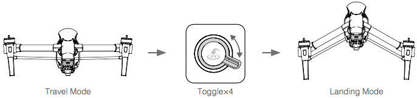

> **Note:** 
>- If you have purchased the dual remote controller version, you must use the Master remote controller to deactivate Travel Mode. 
>- Be sure to remove the camera from the aircraft before switch from Landing Mode to Travel Mode. 
>- The ultrasonic sensor underneath the aircraft is used to determine when the landing gear is at the right position. Smooth reflective surfaces will work better than rough, sound-absorbing surfaces (e.g. carpet). 

### How do I link the Remote Controller to an aircraft?

The remote controller is linked to your aircraft before delivery. Linking is only required when using a remote controller with an aircraft it did not ship with for the first time. Follow these steps to link a new remote controller:

 1. Turn on the remote controller and connect to the mobile device. Launch the DJI GO app.
 2. Turn on the aircraft.
 3. Enter “Remote Controller Settings” and tap “Linking Remote Controller” button as shown below.

 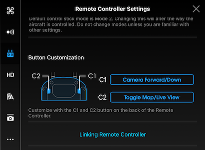
 
 4. The remote controller is ready to link. The Remote Controller Status Indicator blinks blue and a beep is
emitted.
 
 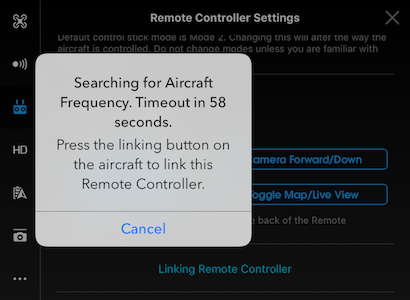

 5. Locate the linking button on the side of the aircraft. The figures below show the Phantom 3, Phantom 4 and Inspire button positions. The M100 and M600 positions can be found in their respective manuals. Press the link button to start linking. The Remote Controller Status Indicator LED will display a solid green once the remote controller is successfully linked to the aircraft.

 - Phantom 3 Series

 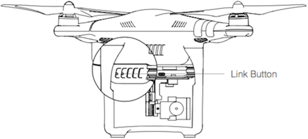

 - Phantom 4

 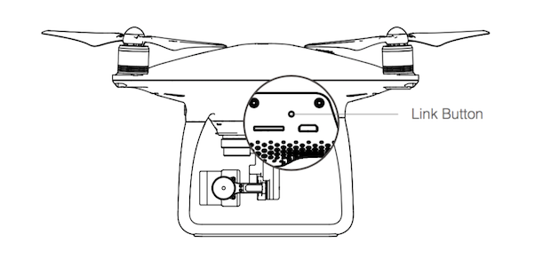

 - Inspire Series

 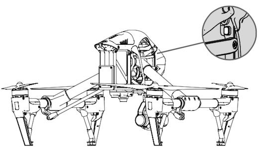
 
>**Note:** The remote controller will un-link itself from an aircraft if a new remote controller is linked to the same aircraft.
 
## General SDK

### Does the DJI Mobile SDK give access to all the functionality in the DJI GO App?

Almost all of the functionality found in DJI GO is exposed in the Mobile SDK.  

### Is a flight simulator available to test applications?

Yes, a flight simulator is available for all products and can be used both as visual verification that flight behavior is correct, and as an automated tool for CI systems.

[Documentation](../application-development-workflow/workflow-testing.html) describing setup and use of the simulator.

<!-- plus a tutorial ([iOS](TODO), [Android](TODO) are available to get you started. -->

### Where can I download the simulator for testing the Mobile SDK app?

- For Phantom 3 Series and Inspire 1 series, you can use the [DJI PC Simulator](https://developer.dji.com/mobile-sdk/downloads/) for testing.
- For Phantom 4 series, Inspire 2, M100, M600 and Mavic Pro, you can use [DJI Assistant 2](http://www.dji.com/phantom-4/info#downloads) for testing.

For more details of using the simulator, please refer to this tutorial: [Aircraft Simulator](https://developer.dji.com/mobile-sdk/documentation/application-development-workflow/workflow-testing.html).

### Why can’t I use the existing simulator for the Phantom 4?

The Phantom 4 uses a different simulator application compared to Phantom 3, Inspire and Matrice series of aircraft. 

The Phantom 4 simulator can be downloaded from <a href="http://www.dji.com/product/phantom-4/info#downloads" target="_blank">here</a> and an explanation of how to use it can be found [here](../application-development-workflow/workflow.html#DJI-Assistant-2-Simulator).

### What path does the aircraft take in a curved waypoint mission?

Waypoint missions have two flight path modes:
1. Aircraft flies from waypoint to waypoint
2. Aircraft flies a curved path where the waypoints define the curve, but the aircraft doesn't necessarily fly through the waypoint.

The curve is formed using a quadratic Bezier curve. The corner radius defines the start point of the Bezier curve.

*  Consider three waypoints W0, W1, W2 where the curve is defined for W1.
*  P0 and P2 are the start and end points of the Bezier curve defined by P0,P1,P2
*  d01 is the cornerRadiusInMeters.

<html>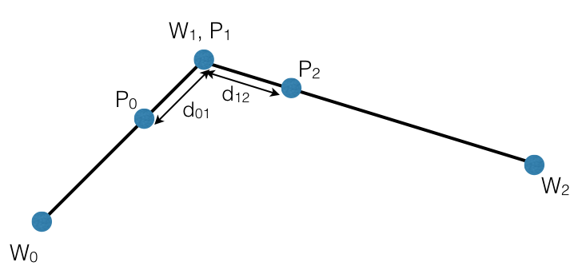</html>

### Why does yaw rotation cause the drone to drift when using Virtual Stick APIs?

This is a firmware bug. Virtual stick yaw angle can be set with either angle or angular velocity commands. This behavior is seen when using angle mode. As a temporary workaround, angular velocity can be used instead.

**iOS:**

~~~objc

DJIFlightController *flightController = ...; //Get the flightController instance

flightController.yawControlMode = DJIVirtualStickYawControlModeAngularVelocity;
flightController.rollPitchControlMode = DJIVirtualStickRollPitchControlModeAngle;
flightController.verticalControlMode = DJIVirtualStickVerticalControlModeVelocity;
...
//Invoke the "sendVirtualStickFlightControlData:withCompletion:" method of DJIFlightController
...

~~~

**Android:**

~~~java

DJIFlightController flightController = ...; //Get the flightController instance

flightController.setYawControlMode(DJIFlightControllerDataType.DJIVirtualStickYawControlMode.AngularVelocity);

flightController.setRollPitchControlMode(DJIFlightControllerDataType.DJIVirtualStickRollPitchControlMode.Angle);
            flightController.setVerticalControlMode(DJIFlightControllerDataType.DJIVirtualStickVerticalControlMode.Velocity);         

...
//Invoke the "sendVirtualStickFlightControlData()" method of DJIFlightController
            
~~~

When yaw is controlled by angular velocity, the aircraft's yaw position can be controlled precisely by using a [PID controller algorithm](https://en.wikipedia.org/wiki/PID_controller).  

### Does DJIWaypointMission allow only one waypoint?

No, the minimum number of waypoints allowed in a DJIWaypointMission is 2.

### For DJIWaypointTurnMode, if I set one waypoint's `turnMode`, when will it take effect?

When the `headingMode` value of DJIWaypointMission is set to `DJIWaypointMissionHeadingUsingWaypointHeading` (iOS) or `UsingWaypointHeading` (android), the `turnMode` of Waypoint N takes effect when flying between Waypoint N and Waypoint N+1. 

### How do I fix the Mission Error "Distance between two adjacent waypoints is too large."?

The Waypoint Mission automates the aircraft to fly through a list of waypoints, visiting one after the other. A limitation of the mission is that consecutive waypoints must have a separation of less than 2km and greater than 0.5m. In addition, the first and last waypoint of the mission must also have a separation of less than 2km and greater than 0.5m. If the separation of any consecutive waypoints or the separation of the first and last waypoint is larger than 2km, then this error will be raised.

### How do I fix the Mission Error "The total distance of waypoints is too large." ?

For a waypoint mission, the total planned flight distance must be less than 40km. The total planned flight distance includes the sum of the:

 * Distance from current aircraft location to first waypoint
 * Sum of all distances between waypoints in mission
 * Distance from last waypoint to the homepoint.

Please check the following diagram for more details:

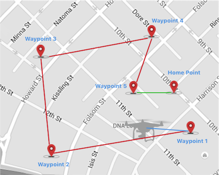

> Note: The **blue** line represents "Distance 1", **red** line represents "Distance 2", and **green** line represents "Distance 3".

The home location can be set using:

- iOS:

~~~objc
- (void)setHomeLocation:(CLLocationCoordinate2D)homePoint
         withCompletion:(DJICompletionBlock)completion;
~~~

~~~objc
- (void)setHomeLocationUsingAircraftCurrentLocationWithCompletion:(DJICompletionBlock)completion;
~~~

- Android:

~~~java
public abstract void setHomeLocation (DJILocationCoordinate2D homePoint, DJICommonCallbacks.DJICompletionCallback callback)
~~~

~~~java
public abstract void setHomeLocationUsingAircraftCurrentLocation (DJICommonCallbacks.DJICompletionCallback callback)
~~~

For iOS, the **DJISDKMissionError** will be `DJISDKMissionErrorMissionTotalDistanceTooLarge`, and for Android, the **DJIMissionManagerError** will be `MISSION_RESULT_WAYPOINT_TOTAL_TRACE_TOO_LONG`.

Generally the total distance couldn't be larger than **40km**, if that error occurs, it might be something related to the improper settings for the homepoint. 

## Android

### How can I run the Android SDK Sample Code?

The following tutorial can help here: [Run Android Sample Application](../quick-start/index.html#android-sample-app).

### How do I reset the default app behavior for a USB Accessory  (DJI Product) on Android devices?

DJI Products that connect to Android mobile devices over USB do so through the AOA (Android Open Accessory) protocol. DJI GO, and DJI Mobile SDK applications support this protocol. When a USB accessory (DJI Product) is connected to the Android mobile device, Android will automatically open the application which supports it, or has been designated the default application for that accessory.

If there is more than one application that supports the accessory, and no application has been designated as the default, then the user will be given an option for which application to open. Usually, the user will also be able to select whether the application should only be opened for this connection, or should be considered the default application going forward.

Once an application is tied as the default application to an accessory, no other applications will be able to use that accessory. For example, if DJI GO is the default application, then no other SDK based application will work the DJI products.

To solve this, the default behavior needs to be removed for the accessory. For example, if the DJI GO is the default application, navigate in Android to **Settings->Apps->DJI GO->Open by default** and you should see a similar screen to this:
 
 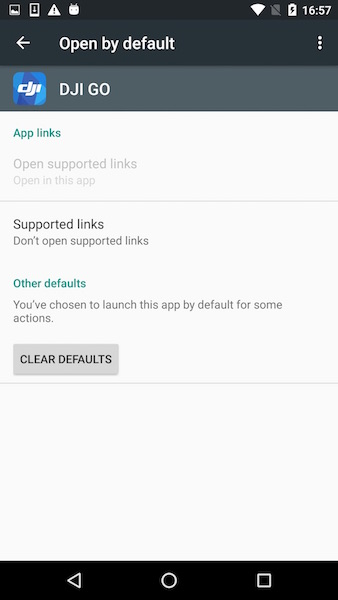

Click on the **CLEAR DEFAULTS** button. 

If you want to change the default application from DJI GO to the SDK-based app, make sure both applications are completely terminated. Then, after clearing defaults as above, reconnect the remote controller and Android should ask which application to open and whether to make it default or not.
 
### How do I reset the default app behavior for a USB Accessory  (DJI Product) on Samsung devices?

DJI Products that connect to Android mobile devices over USB do so through the AOA (Android Open Accessory) protocol. DJI GO, and DJI Mobile SDK applications support this protocol. When a USB accessory (DJI Product) is connected to the Android mobile device, Android will automatically open the application which supports it, or has been designated the default application for that accessory.

If there is more than one application that supports the accessory, and no application has been designated as the default, then the user will be given an option for which application to open. Usually, the user will also be able to select whether the application should only be opened for this connection, or should be considered the default application going forward. **However, some Samsung devices do not give this additional option, and will instead make the selected application the default application.**

Once an application is tied as the default application to an accessory, no other applications will be able to use that accessory. For example, if DJI GO is the default application, then no other SDK based application will work the DJI products.

To solve this, the default behavior needs to be removed for the accessory. For example, if the DJI GO is the default application, navigate in Android to **Settings->Apps->DJI GO->Set as default** and you should see a similar screen to this:
 
 

Click on the **CLEAR DEFAULTS** button. The next time the DJI product is connected to the mobile device, the user will be given the option to select the application to open with it.

### Why does my application crash when I run on Android 6.0 Marshmallow?

  Please update your application‘s Android SDK to the latest 3.2.2 version. You can download it from <a href="https://developer.dji.com/mobile-sdk/downloads/"> here </a>. 

  For more details, please check the [Importing and Activating DJI SDK in Android Studio Project](../application-development-workflow/workflow-integrate.html#Android-Studio-Project-Integration) tutorial.

### Why can't my Android application connect to a DJI Product when using the DJI Mobile SDK 3.2.1 and Android 6.0 Marshmallow with targetSdkVersion 23?
  
 <a href="https://developer.android.com/about/versions/marshmallow/android-6.0-changes.html" target="_blank"> Runtime Permissions </a> are a new feature of Android 6.0.

  You can add the following code to request permissions before you connect to the internet to register your application to use the DJI SDK:
  
~~~java
  // When the compile and target version is higher than 22, request the following permissions at runtime.
        if (Build.VERSION.SDK_INT >= Build.VERSION_CODES.M) {
            ActivityCompat.requestPermissions(this,
                    new String[]{Manifest.permission.WRITE_EXTERNAL_STORAGE, Manifest.permission.VIBRATE,
                            Manifest.permission.INTERNET, Manifest.permission.ACCESS_WIFI_STATE,
                            Manifest.permission.WAKE_LOCK, Manifest.permission.ACCESS_COARSE_LOCATION,
                            Manifest.permission.ACCESS_NETWORK_STATE, Manifest.permission.ACCESS_FINE_LOCATION,
                            Manifest.permission.CHANGE_WIFI_STATE, Manifest.permission.MOUNT_UNMOUNT_FILESYSTEMS,
                            Manifest.permission.READ_EXTERNAL_STORAGE, Manifest.permission.SYSTEM_ALERT_WINDOW,
                            Manifest.permission.READ_PHONE_STATE,
                    }
                    , 1);
        }
~~~

 Then build and run your application, press "Allow" in the permission request alert as shown below:
  
 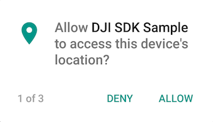
  
 After restarting the application, it should now. This process only needs to be completed once.  
  
## iOS

### Does DJI iOS SDK Support CocoaPods?

Yes, DJI iOS SDK supports CocoaPods. You can check this link for details: <a href="https://cocoapods.org/pods/DJI-SDK-iOS" target="_blank">https://cocoapods.org/pods/DJI-SDK-iOS</a>.

### Application Registration Fail in iOS 10, How to Fix it?

Please try to turn on the **Data Protection** in Capabilities of your Xcode project using Xcode 8 as shown below:

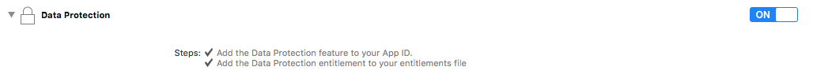 

If you use the same project's Bundle Identifier in multiple Macs, please try to change it to a different one and try again. 

Remember to do a clean test:

1. Delete the app on your iOS device or Simulator
2. **Clean** the project and rebuild it agian.

### Enabling Bitcode in Xcode 7 doesn't work for DJI iOS SDK Sample Code, How can I fix it?

We have a temporary way to enable bitcode in the <a href="https://github.com/dji-sdk/Mobile-SDK-iOS" target="_blank">iOS Sample Project</a>:

1. Enable bitcode for both demo project and VideoPreviewer project. 
2. Remove "Other Linker Flags" in VideoPreviewer. 

Then you can compile the demo with bitcode enabled to your mobile device. However, there will be error when compiling the demo with this setting to the iPhone simulator. So if you want to debug your application on the iPhone simulator, please use the original setting. We will keep looking for a better way to do this.

### Does DJI iOS SDK support Swift? Any Swift Sample Code?

Yes, the DJI Mobile SDK for iOS does support Swift. Swift sample code is available <a href="https://github.com/dji-sdk/Mobile-SDK-iOS/tree/master/Sample%20Code/SwiftSampleCode" target="_blank"> here</a>.

### What is the DJI Remote Logger?

The DJI Remote Logger allows iOS applications to log remotely. Field testing is critical in application development, and remote logging allows simple ways to log events in real time to a remote server. For more details, see the [DJI Remote Logger Tutorial](../ios-tutorials/RemoteLoggerDemo.html).

### Will my application work with DJI Aircraft if "Supported external accessory protocols" is removed from info.plist?

If the connection between mobile device and DJI Aircraft is USB, the “Supported external accessory protocols” must be added and will enable your SDK-based Application to connect to the MFI compatible remote controller of the DJI Aircraft. For WiFi connection product, like Phantom 4K, this setting is not necessary to be added to info.plist file.

