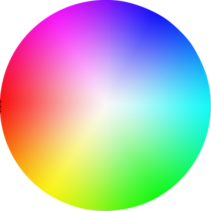

## Introduction

The camera captures photos and videos. Many different modes of operation, resolutions, frame rates, exposure settings, picture settings and file types can be selected. Cameras have local storage to hold the media which will typically be an SD card, and in some cases an SSD (solid state drive). 

This guide covers the large array of settings, modes and functionality provided by DJI cameras. A more general description of camera concepts can be found [here](./camera_concepts.html).

## Operation (Work) Modes

DJI cameras have several modes of operation:

* Still image capture
* Video capture
* Playback
* Media Download
* Broadcast

The camera can only operate in one mode at any one time. For example, media download cannot happen during image capture.

##### Still Image Capture Modes

There are several ways to capture a still image with DJI cameras. 

* **Single**: Takes a single picture every time the `shootPhoto` command is given.
* **Burst**: Takes a small burst of photos every time the `shootPhoto` command is given. This can be useful for capturing action scenes.
* **RAW Burst**: Takes a small burst of RAW photos every time the `shootPhoto` command is given. RAW photos can be shot faster with a continuous RAW burst than using **Interval** as the burst is used in conjunction with SSD storage.
* **HDR**: Takes a high dynamic range photo. This results in several photos with different exposure levels being taken and then combined into one photo. The different exposure levels increase contrast in both dark and light areas, and therefore the dynamic range of the photo.
* **AEB (Auto Exposure Bracketing)**: Captures multiple photos at different exposure levels and saves them separately every time the `shootPhoto` command is given.
* **Interval**: The camera will take photos at a predetermined time interval (for example every 5 seconds) for either a set number of shots, or indefinitely.
* **Timelapse**: The camera will take photos at a predetermined time interval and then combine the photos into a time lapse video.

##### Quick View

After a still image is captured, some cameras can be configured to display the captured image for a short period of time. By default, this is turned off, but a quick view for a set duration can be configured.

## Image Quality, Resolution and Frame Rate

##### Video Resolution and Frame Rate

DJI Cameras typically support video resolutions of 1280x720 (720p), 1920x1080 (1080p), 2704x1520, 3840x2160 and 4096x2160 (4K). 

Resolution will determine the maximum frame rate able to be captured. The combinations of resolution and frame rate can be queried directly in the SDK, but typically choosing 4K resolution will limit the frame rate to 24/25 fps. Some cameras support up to 120 fps, but only at 1080p resolutions.

##### Still Image Resolution and Aspect Ratio

DJI Cameras have a fixed still image resolution. On some cameras the aspect ratio can be changed between 4:3 and 16:9. Keep in mind that a 16:9 picture is simply a cropped version of a 4:3 image, as the sensor's aspect ratio is 4:3.

##### Compression

All of DJI's cameras support compression for both still images and videos. Some cameras also support uncompressed (RAW) file formats.

The trade-off between capturing RAW and compressed images is:

<table id="t01">
  <thead>
    <tr>
      <th colspan="4">RAW vs Compressed</th>
    </tr>
    <tr>
      <th width=180>Metric</th>
      <th width=100>Raw</th>
      <th width=100>Compressed</th>
      <th>Notes</th>
    </tr>
  </thead>
  <tbody>
    <tr>
      <td>Image Quality</th>
      <td>Higher</td>
      <td>Lower</td>        
      <td>Compression algorithms are lossy. On small screens this is sometimes not noticeable, but on larger prints, or when capturing scenes with high contrast and color, the difference is more noticeable.</td>
    </tr>
    <tr>
      <td>Post Processing Quality</td>
      <td>Higher</td>        
      <td>Lower</td>
      <td>RAW images use more bits to describe each pixel. This translates to more brightness levels making exposure compensation easier. In a color image where each color is represented by the brightness of a red, green and blue pixel, it also means there are more colors, making white balance adjustments easier.</td>
    </tr>
    <tr>
      <td>Post Processing Necessity</td>
      <td>More Often</td>        
      <td>Less Often</td>
      <td>When exposure and white balance are fine, compressed images will usually require less post processing. If nothing else, to share a RAW image it usually needs to be compressed to a more common file format.</td>
    </tr>
    <tr>
      <td>Compatibility with Media Viewers and Editors</td>
      <td>Fewer</td>        
      <td>More</td>
      <td>Most cameras use different uncompressed image formats making them less likely to be supported by all media viewing and editing programs.</td>
    </tr>
    <tr>
      <td>File Size</td>
      <td>High</td>        
      <td>Low</td>
      <td>Lower file sizes makes storing and sharing media much easier.</td>
    </tr>
    <tr>
      <td>Time Between Shots</td>
      <td>Longer</td>        
      <td>Shorter</td>
      <td>It takes a longer time to process and save a RAW image compared to JPEG. On fixed interval shooting, the difference can be as large as 2s minimum interval for JPEG and 10s for RAW.</td>
    </tr>

  </tbody>
</table>

For still images, DIJ cameras typically support JPEG (compressed) and DNG (RAW) image formats. Cameras can also capture in JPEG + RAW, saving two images for each shot.

For video, only the Zenmuse X5 RAW and X5S supports capturing raw video. RAW video files have a high data rate and large file size and therefore can only be captured onto a solid state drive (SSD). All cameras support compressed formats MP4 (MPEG – 4 AVC) and MOV (H.264).

##### Photo Quality

As a JPEG image is compressed increased, it's file size and image quality reduces. Quality options of **Normal**, **Fine** and **Excellent** are available for users and developers to choose the right balance for their application.
 
## Exposure Options

Getting the exposure right is important to capture a great, recognizable picture. Under exposed (too dark) or over exposed (too light) pictures will lack detail of the subject. The concepts behind exposure, aperture, shutter, ISO, stops, field of view and depth of field are described and compared in detail in [Camera Concepts](./camera_concepts.html).

##### Shutter Speed

The time the camera shutter exposes the camera sensor to light is described by the **Shutter Speed**. DJI cameras typically have shutter speeds from 1/8000 s to 8 s. Faster shutter speeds can capture moving features in a scene sharply, but will expose the sensor to less light.

The shutter speed should not be set slower than the video frame rate when the camera recording video. For example, if the video frame rate is 30 fps, the shutter speed must be <= 1/30 s.

##### ISO

ISO relates to the amount of amplification applied to each pixel. Higher ISO will increase amplification and therefore exposure, but will also increase noise in the picture. Higher ISO is effectively making the camera more sensitive to light, and is useful when trying to capture darker scenes. 

Different DJI cameras have different ISO ranges. The Zenmuse X5 has an ISO range of 100-25600.
  
##### Aperture

The camera aperture controls how large the **window** the sensor can see the world through. Increasing the aperture will increase the amount of light incident on the camera, and therefore increase the exposure. It will also make the depth of field shallower. A shallower depth of field will mean that features at different distances to the camera will be more out of focus. This can create a great effect if trying to highlight the subject (in focus foreground, blurred background), but can be challenging if trying to capture both the foreground and background in focus.

Aperture is measured in f-numbers or f-stops, where the numbers relate to the aperture diameter. A doubling of aperture area, is equivalent to multiplying the diameter by 1.414 (square root of 2), and increases the exposure by one stop.

Cameras on the Phantom and Mavic series of products have fixed aperture lenses (e.g. f/2.8). The Zenmuse X5 has an aperture range of f/1.7 to f/16.

##### Exposure Mode

There are 4 exposure modes available that vary with how exposure is automatically or manually adjusted.

1. **Program**: The camera automatically adjusts shutter, aperture (if available) and ISO automatically to find the best exposure. On cameras with adjustable aperture, ISO can either be set manually, or automatically based on preference.
2. **Shutter Priority**: Allows manual setting of the shutter speed. Aperture and ISO are automatically adjusted to find the best exposure. On cameras with adjustable aperture, ISO can either be set manually, or automatically based on preference. This mode is useful when trying to control the sharpness of a scene with moving features.
3. **Aperture Priority**: Allows manual setting of the aperture. Shutter speed and ISO are automatically adjusted to find the best exposure. On cameras with adjustable aperture, ISO can either be set manually, or automatically based on preference. This mode is useful when trying to control the depth of field of a scene.
4. **Manual**: ISO, aperture and shutter speed are all manually set. The `exposureCompensation` property can be monitored to understand how many stops away the picture is from good exposure.

Camera Concepts contains a [description](./camera_concepts.html#trade-off-between-aperture-shutter-iso) and several examples on what to consider when setting aperture, shutter speed and ISO to get good exposure.

##### Exposure Compensation

In the Program, Aperture Priority and Shutter Priority exposure modes, the exposure compensation value changes the exposure target the camera is using to calculate correct exposure and is set by the user. This can be used to capture darker or lighter images.

In the Manual exposure mode, this value is reported from the camera and reports how much the exposure needs to be compensated for to get to what the camera thinks is the correct exposure. 

##### AE (Auto Exposure) Metering

Exposure is measured by the camera by examining (metering) the pixels in an image. Metering can be set to either the whole image, or just part of the image (the center position or a custom position). This allows scenes that have a high dynamic range of light to be captured with the desired parts having correct exposure.

##### AE (Auto Exposure) Lock

If exposure is being calculated automatically, shutter, aperture and ISO settings might be changing dynamically. AELock allows a freeze of exposure setting changes without needing to change the exposure mode. This can be used to automatically set the exposure of a subject in a scene before moving the camera to frame the subject in a more interesting way (without the exposure changing).

## Picture Settings

##### White Balance and Color Temperature

The color of the light (also known as color temperature) illuminating a scene determines the color of the captured image. A fluorescent white light will be cooler (have more blue than light) than light from the sun, and so a scene illuminated with a fluorescent light will look cooler. An outside scene and inside scene can be adjusted to have more similar colors if the white balance of the pictures are adjusted. If the white balance is adjusted so the white and grey colors in different pictures look similar, then the other colors in the pictures should also be similar.

The DJI SDK offers several color temperature and white balance related settings:

* Auto white balance
* Preset white balance (e.g. sunny, cloudy, fluorescent etc)
* Custom color temperature

Another way to adjust the color temperature is to capture the image in RAW format and change the color temperature in post processing.

##### Anti-Flicker

Light sources that flicker due to the frequency of their power source (50 Hz or 60 Hz) can sometime look weird when captured on video. The camera detects these oscillations in a light source and will try to only capture an image when the flicker's effect on the exposure or color is minimal.

The setting can either be manually selected, or put in automatic mode.

##### Sharpness

The sharpness of an image describes how well defined details in the image are.

The sharpness of an image is dependent on many factors including the shutter speed, lens design and manufacturing quality, aperture, focal length, distance from the image center and the sensor (number of pixels and anti-aliasing filter).

A picture can be further sharpened or softened using high and low pass filters on the image. Sharpening the image will highlight changes in brightness, and emphasize details. Sharpening will therefore also increase the noise as noise is seen as small changes in brightness.

In comparison, softening an image will reduce changes in brightness, reduce noise, but also make finer details harder to see. 

DJI cameras offer three sharpness settings: **Standard**, **Hard** and **Soft**.

##### Contrast

Contrast is the difference or gradient of color and brightness. The larger the difference, the higher the contrast. Increasing the contrast of an image can make it more vivid, but can also reduce the amount of detail.

DJI cameras offer three contrast settings: **Standard**, **Hard** and **Soft**.

##### Hue and Saturation

Hue is another word for a pure color. Saturation is the amount of grey in the color. A lower saturation has more grey in the color, and makes it look duller. Higher saturation decreases the grey in a color, making it more pure.

Hue and saturation can be seen on a color wheel.

<html></html>

The outside of the color wheel has complete color saturation, and is the hue. The center of the color wheel is grey, and is no saturation.

Camera hue and saturation can both be adjusted. Adjusting the hue of an image will adjust the tint. Adjusting the saturation will make the image more or less grey. Images with high saturation can be very vivid, but also look false. 

##### Digital Filter

DJI cameras include several built-in filters that allow for interesting and creative effects. Many filters are available, some of which are **Oil Painting**, **Water Color**, and **Art**.

## Lens and Focus

Most DJI cameras come with a fixed lens, fixed aperture and fixed focus at infinity.

The Zenmuse X5 camera however has a variable aperture, variable focus and the ability to swap lenses between DJI and third party options.

DJI cameras with variable focus allow both manual and automatic focusing. When in automatic mode, the camera will calculate focus from an area in the image, which can be set through the SDK.

Manual focusing is achieved by programmatically (or physically) setting the focus ring value.

For some lenses, the minimum focus ring value (which corresponds with infinity focus) varies slightly between models and units. Therefore, when using a lens for the first time, a calibration needs to be done:

* Set focus mode to auto
* Point the camera at distant scene
* Ensure the focus target area is pointing at features >30m away
* Let the camera auto focus
* Read the minimum focus ring value

This focus ring value can be tied to the serial number of the camera for future reference.

## Live Video Feed
 
Developers can get live H.264 video data from Camera using the Mobile SDK. The H.264 is a video coding format that is currently one of the most commonly used formats for compression, and distribution of video content. 

Even though most cameras can capture in 1080p or 4K, the live video stream is typically 720p to conserve wireless bandwidth. The live video stream is highly dependent on the quality of the wireless link. Wireless systems are complex, with many variables contributing to overall quality, however generally as the transmission distance increases, or obstacles start to occlude the signal, video quality can deteriorate rapidly.

## Broadcast Mode

For Inspire 2, a new Broadcast Mode for TV broadcasters has been created, allowing videos to be streamed from the Inspire 2 in broadcast standard 720p60 (NTSC) or 1080i50 (PAL). Once connected to broadcasting equipment, footage can be sent live on-air without signal conversion. 

In this camera mode, videos can be recorded. Still photos can also be taken only when video is recording. The only way to exit broadcast mode is to change modes to **Video capture**.

It is only supported by Inspire 2.

## Playback Manager

DJI cameras support a media playback mode. The live video stream is replaced with a media preview stream. Commands can be sent to the camera to:
 
* View single previews or as pages of smaller thumbnails
* Navigate single and page previews
* Select and deselect files
* Delete files
* Play/pause/stop video previews
* Download Files

## Media Manager

Media manager is used to interact with the file system on the SD card.
By using the media manager, metadata for all the multimedia files can be read, and files can be downloaded or deleted.

During media download, the live video feed is paused so all wireless bandwidth can be dedicated to transferring files.

## Media 

##### Storage

DJI Cameras typically use SD cards to store photos and videos. Depending on whether Class 10 or UHS-1 Micro SD cards of up to 64 GB are required to accommodate the video bandwidths of the various cameras.

The Zenmuse X5 RAW also has a 512 GB solid state drive (SSD) to record video. 4K RAW video data rates can peak at 2.4 Gbps compared to 60 Mbps for MP4 or MOV.

The Inspire 2 (X5S and X4S) uses on aircraft SSD and SD storage instead of on camera storage, while all other cameras use SD cards located on the camera itself, or the gimbal the camera is integrated into.

##### File Index

There are two file index modes for storing media: **Reset** and **Sequence**. 

**Reset mode**: The camera will reset the newest file's index to be one larger than the largest number of photos taken on the SD card.

**Sequence mode**, the camera will set the newest file's index to the larger of either the maximum number of photos taken on the SD card or the camera. 

