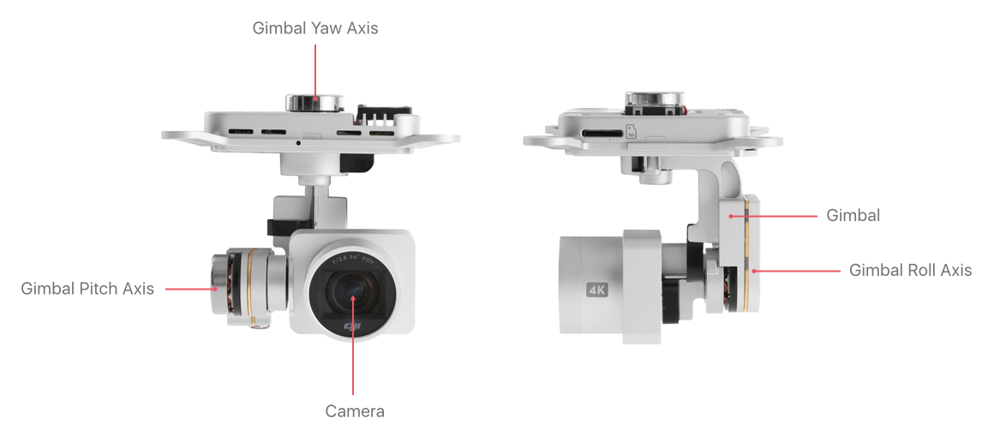
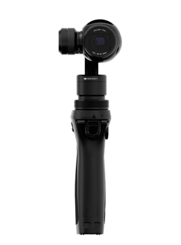
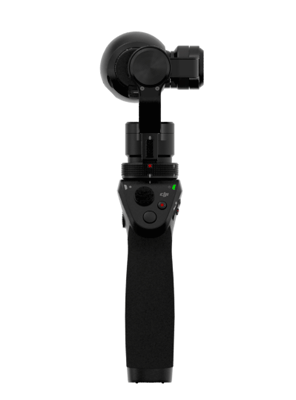
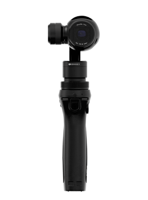

## Introduction

Cameras fixed to an aircraft will record images that pitch and roll with the aircraft as it moves. Multi rotor aircraft need to pitch and roll simply to move horizontally, and so getting a stable horizontal shot is not possible.

A gimbal is used to keep a camera or sensor horizontal when its mount (e.g. aircraft) is moving. The gimbal has three motors controlling rotation in perpendicular axes. The gimbal feeds gyroscope information back to the motor controllers to compensate for rotational movement of the mount.

In addition to stabilization, the three motors can be used to control the direction the camera is pointing, and can be used to smoothly track a target, or pan a shot. The three axes of rotation are referred to as Pitch, Roll and Yaw, and the gimbal orientation is referred to as its attitude. Explanations of these axes can be found in the [Flight Control Concepts](./flightController_concepts.html).

Gimbals have mechanical limits (or stops) to their rotation around each axis. When a sensor is mounted on a gimbal, many data and control lines are required to go from mount to sensor. These control lines are usually bundled in a cable assembly or flex circuit, both of which will limit the available rotation of the gimbal. Additionally, gimbals will also limit rotation so cameras cannot see landing gear or the product itself.

The DJI Mobile SDK gives access to gimbal capabilities, state, and control. Numerous settings are possible with the gimbal that define its work mode and how it compensates for movement.

## Gimbal Capabilities

Gimbal features vary significantly across product lines. Therefore the DJI Mobile SDK provides a dictionary of gimbal capabilities for runtime use. Gimbal capabilities include:

* Which axes are controllable
* Mechanical stops of each axis
* Whether response speeds to manual control are customizable
* Whether [SmoothTrack](#smoothTrack) is available and customizable
* Whether [End point](#endPoint) settings are available and customizable
* Whether [Motor control](#motor-control) settings are available and customizable

## Work Modes

The gimbal has several work modes that define how the gimbal follows aircraft movement, and how many axes are available for control.

- **FPV (First Person View) Mode**: Only pitch is controllable. Yaw and roll will be fixed relative to the product while pitch remains controllable.
- **Yaw Follow Mode**: Pitch and roll are controllable. Yaw will follow the products heading.
- **Free Mode**: Pitch, roll and yaw are all controllable, meaning the gimbal can move independently of the product's yaw. In this mode, even if the product yaw changes, the camera will continue pointing in the same world direction. 

## Gimbal State

The gimbal component pushes state information back to the Mobile device at up to 10 Hz. State information includes current attitude, calibration state, calibration offsets, work mode, and whether the gimbal is at a mechanical stop.

## Moving the Gimbal

### Custom Control
 
Through the DJI Mobile SDK, the gimbal can be moved in two ways:

* Move to an angle over a duration
* Move at a speed in a direction

When using angle mode to rotate the gimbal's pitch, roll and yaw, the rotation angle of the gimbal can be defined as either **Absolute**(relative to the aircraft heading), or **Relative** (relative to its current angle). 

When using speed to rotate the gimbal's pitch, roll and yaw, the direction can either be set to clockwise or counter-clockwise.

### Reset
   
The gimbal can be reset, and its pitch, roll and yaw will be set to 0 degrees. The reset position is pointing horizontally and being in the same direction as product heading. 

For X3, X5 and X5R, the pitch doesn't get set to 0 degrees, but remains at the current pitch.

## Calibration

Gimbals will be automatically calibrated on power up, but can also be calibrated through SDK APIs. Users will see the camera rotate around all three axes for several seconds when the gimbal is calibrating.

The product should be stationary (not flying, or being held) and horizontal during calibration. For gimbal with adjustable payloads, the payload should be present and [balanced](#balancing) before doing a calibration.

### Fine Tune Roll

The gimbal roll can be fine tuned with a custom offset. The range for the custom offset is [-10, 10] degrees. If the offset is negative, the gimbal will be fine tuned the specified number of degrees in the counterclockwise direction.

### Balancing

Gimbals that can accommodate custom payloads (like the Ronin MX) require the payload's center of mass to be at the gimbal's rotational center. The process of adjusting the payload position to achieve this is called balancing.

Balancing APIs are provided to initiate balancing tests and return balancing results. A payload needs to be properly balanced before starting gimbal calibration.

## Osmo and Ronin-MX Functionality

Osmo and Ronin-MX can be used in a handheld configuration, and allow additional customizations to how the gimbal responds to user movement.

### SmoothTrack

SmoothTrack describes how and when the gimbal will compensate for yaw and pitch movement at it's mount (e.g. Osmo handle). SmoothTrack speed, acceleration and deadband can be customized. The animation below shows the gimbal compensating for handle yaw rotation relatively slowly. Roll is not supported with SmoothTrack as a horizontal image is usually preferred.

 

* **SmoothTrack Speed** is the gimbal's *catch-up* speed to large mount rotations. A faster speed will be more responsive for tracking fast moving objects, but also produce less smooth video.

* **SmoothTrack Acceleration** determines how closely the gimbal will compensate for handle movement (how quickly it will reach the SmoothTrack speed). A fast acceleration will be more responsive to small handle rotations, and therefore less able to smooth out small unwanted rotations.

* **SmoothTrack Deadband** determines the amount of rotation required before the gimbal starts to compensate. A larger deadband requires more mount movement before the gimbal will start to move. Having a large deadband is useful for when the camera is moving a lot, and the subject is relatively stationary. Smaller deadbands are required if quicker response is needed to mount movement.

### Physical Controller

The gimbal can be manually moved around the pitch and yaw axes using the joystick on OSMO and the remote controller on Ronin-MX. The joystick and remote controller are physical controllers on the handles of the products.
  
The gimbal's response to the physical controller can be customized using speed, smoothing and deadband settings. The animation below shows the gimbal following movement of the Osmo joystick.

 

* **Controller Speed** is the gimbal's movement speed when controlled with the physical controller. When the controller is at full deflection (displacement), the gimbal will be moving at the controller speed.

* **Controller Smoothing** controls the deceleration of the gimbal when the physical controller deflection reduces. 

* **Controller Deadband** determines the amount of deflection required in the physical controller before the gimbal starts to move. 

### Selfie

The Osmo gimbal can quickly adjust the camera into a selfie position by pressing the trigger three times rapidly. The camera yaw will rotate to 180 degrees (facing the back of the handle), and the pitch will be adjusted to be horizontal.

Pressing the trigger two times will adjust the camera yaw to 0 degrees, and pitch to be horizontal.

The DJI Mobile SDK has an API that can toggle between the selfie, and 0 position.
    
### Orientation Lock
  
Holding the trigger will lock the camera to it's current orientation. Any rotation in pitch, roll and yaw of the handle will be compensated for by the gimbal up to the gimbal stops. The below animation illustrates an Osmo in orientation Lock.

### Endpoint

All gimbals have mechanical stops, but the Ronin MX can also have logical stops (Endpoints) that limit rotation when using the physical controller. The DJI Mobile SDK has APIs to enable and set Endpoints in the directions of **PitchUp**, **PitchDown**, **YawLeft** and **YawRight**.

### Motor Control

For gimbals with adjustable payloads, finer level motor control is useful to compensate for payloads with different masses. The controller is a proportional-integral-derivative (PID) type, and it's coefficients can all be adjusted.

* **Stiffness:** The proportional term of a PID controller
* **Strength:** The coefficient for the integral term of a PID controller
* **Precontrol:** The coefficient for the derivative term of a PID controller
* **Gyro Filtering:** The coefficient for denoising the output

### Range Extension

Some gimbals have stops in place to prevent the camera from being impeded by the landing gear or other parts of the product when the product is at extreme attitudes. For some applications, it can be useful to extend the range of motion of the gimbal, as long as the developer and user understand that some shots might be compromised.

Therefore the DJI Mobile SDK provides APIs that enable some axes on some products to have range extensions. The gimbal capability dictionary can be used to determine when range extensions are available.

<!--### Upright Mode

The M600 allows the Ronin MX to be mounted on top of the aircraft instead of underneath the aircraft. This is especially useful when doing inspections underneath structures like bridges. The DJI Mobile SDK provides APIs that can set the gimbal upright mode.
-->
