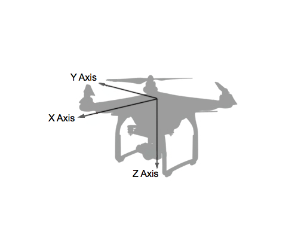
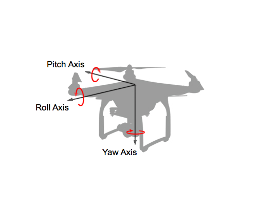
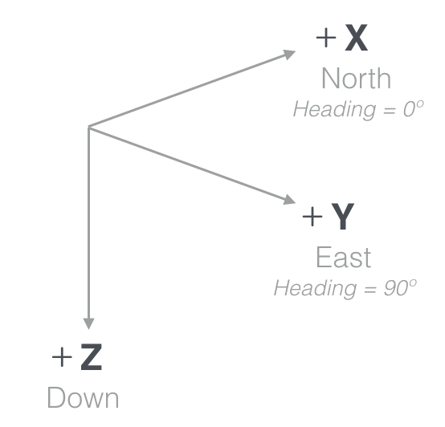
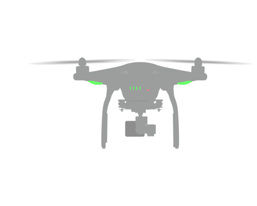
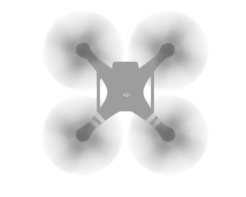
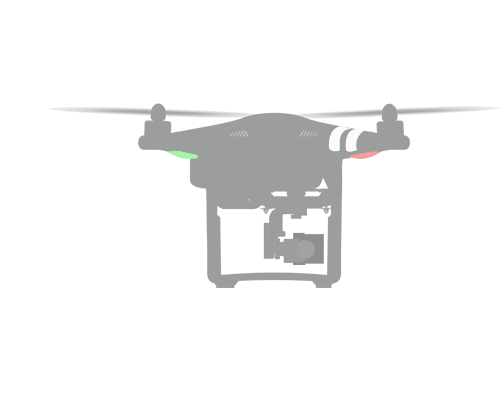
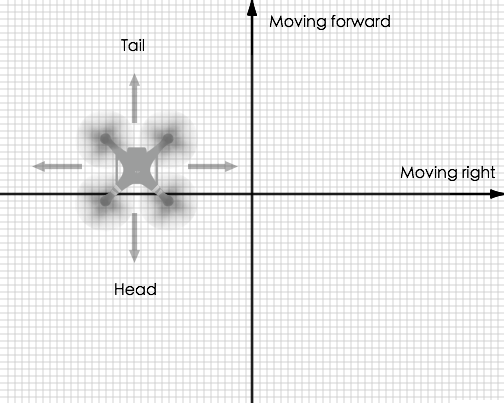
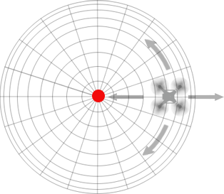

## Coordinate Systems

Description of aircraft movement is dependent on the location and orientation of coordinate axes that make a coordinate system (or frame of reference). Many coordinate systems exist, but the two used in the DJI Mobile SDK are relative to the aircraft body (body frame), and relative to the ground (world frame).

### Body Coordinate System

The body coordinate system is relative to the aircraft itself. Three perpendicular axes are defined such that the origin is the center of mass, and the **X** axis is directed through the front of the aircraft and the **Y** axis through the right of the aircraft. Using the <a href="https://en.wikipedia.org/wiki/Right-hand_rule" target="_blank">coordinate right hand rule</a>, the **Z** axis is then through the bottom of the aircraft.

Aircraft translation in positive X, Y and Z is therefore defined in the Body Coordinate System as forward, right and downward translation respectively.

Aircraft rotation is also described with these same axes using the <a href="https://en.wikipedia.org/wiki/Right-hand_rule" target="_blank">coordinate right hand rule</a> to define the direction of positive rotation. When describing rotational movement, the X, Y and Z axes are renamed **Roll**, **Pitch** and **Yaw**.

The definition of X, Y, Z, roll, pitch and yaw is consistent with aircraft body coordinate systems, but can sometimes be unintuitive to a developer seeing it for the first time.

For instance, if the aircraft rotates around the Pitch axis (Y axis) it will move in the X axis direction. Moreover, if the Pitch angle is positive, the direction will be backwards, or in the negative X axis. Care must therefore be taken when using roll, pitch and yaw to move an aircraft.

### Ground (World) Coordinate System

A popular ground or world coordinate system used for aircraft aligns the positive **X**, **Y** and **Z** axes with the directions of **North**, **East** and **down**. This convention is called **North-East-Down** or **NED**. 

Positive Z pointing downward can take some getting used to, but it is convenient as X and Y are then consistent with the right hand rule and normal navigation heading angles. A heading angle of 0&deg; will point toward the North, and +90&deg; toward the East.

The origin for a NED coordinate system is usually a point in the world frame (like take-off location).

<html></html>

## Attitude and Flight

The orientation of the aircraft and gimbal is known as its **attitude** and defined by the rotation around the pitch, roll and yaw axes in the body coordinate system. 

Combined with **throttle**, rotating the aircraft in pitch, roll and yaw orients the aircraft and moves it in space.

### Pitch

The above diagram shows the aircraft from the side. Pitch measures an object's rotation about the lateral (Y, pitch) axis. Adjusting the pitch will tilt the aircraft forwards or backwards.

To pitch forward, the back propellors spin faster and have more thrust than the front propellors. The flight controller automatically balances the thrust on each propellor and so the DJI Mobile SDK simply provides APIs to adjust the velocity along the X axis, or the pitch angle and throttle.

### Roll

The above diagram shows the aircraft from the front. Roll measures an object's rotation about the longitudinal (X, roll) axis. Adjusting the roll will tilt the aircraft left or right.

To roll left, the right propellors spin faster and have more thrust than the left propellors. The DJI Mobile SDK provides APIs to adjust the roll angle and velocity to achieve movement.

### Yaw

The above diagram shows the aircraft from above. Yaw measures an object's rotation about the vertical (Z, yaw) axis. Adjusting the yaw will change the heading of the aircraft.

Half of the aircraft's propellors spin clockwise, while the other half anti-clockwise. When all spin with equal speed, the aircraft heading will be constant. If one half spin faster than the other half, the aircraft will rotate around the yaw axis. The flight controller balances the speed of each propellor and so the DJI SDK simply provides APIs to set the heading.

## Throttle

Throttle controls the aircraft's average thrust from its propulsion system. When the aircraft is level, adjusting the throttle will move the aircraft up or down as all the thrust is in the vertical direction. However, when the aircraft is not level (has non-zero pitch or roll), the thrust will have a horizontal component, and therefore the aircraft will move horizontally. A larger pitch or roll angle will result in more horizontal thrust and therefore faster horizontal movement.

## IOC (Intelligent Orientation Control)

IOC (referred to as Flight Orientation Mode in the Mobile SDK) defines how the aircraft will interpret horizontal flight commands (forward, backward, left and right).

By default, the aircraft will fly relative to itself, so a left command causes the aircraft to fly to its left. This makes sense if an aircraft is being piloted from the first person view. However, when the aircraft is being piloted remotely from a fixed location it can be confusing or inconvenient.

When the pilot can't determine the heading of the aircraft, then it is hard to predict how the aircraft will move relative to the pilot. If the aircraft is facing the pilot, then from the pilot's perspective, the aircraft will move right when a left command is issued.

Therefore **Course Lock** and **Home Lock** orientation modes are provided, which make movement relative to the pilot instead of the aircraft. These orientation modes only work when the remote controller flight mode switch is in "F" for remote controllers with an "F" mode option, and in "P" for all other remote controllers.

### Course Lock

The **Course Lock** orientation mode makes the aircraft move relative to a fixed heading. If a heading of 0&deg; (North) is chosen, then no matter the yaw of the aircraft, whenever a left command is given, the aircraft will move West.

The diagram below illustrates an aircraft that is oriented in the opposite direction of the course lock heading, and shows that when a forward or right command is issued, the aircraft will backwards or left respectively relative to itself.

### Home Lock
The **Home Lock** orientation mode makes the aircraft move radially relative to the home point. Forward and backwards commands will move the aircraft further from and closer to the home point respectively. Left and right commands will move the aircraft in a circle around the home point at the current radius.

