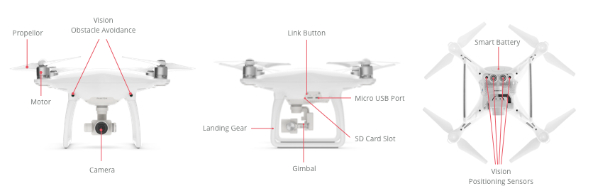
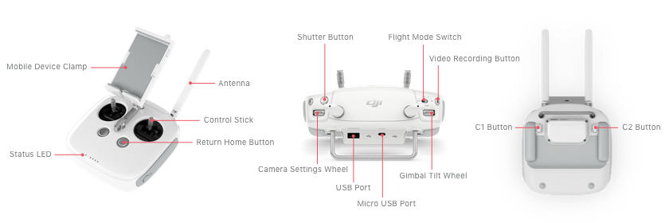
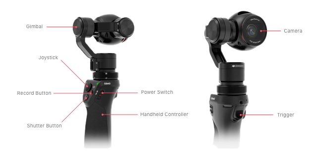
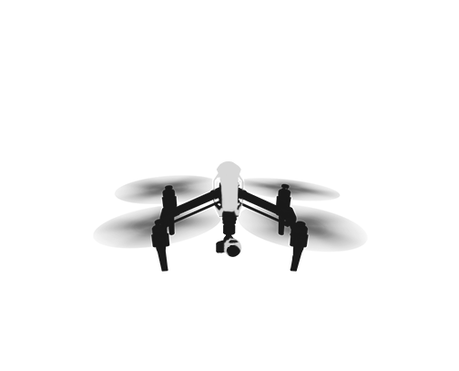

DJI produces small, highly capable, remotely controlled aircraft as well as hand held cameras and stabilizers perfect for both consumer and commercial applications. The products are very accessible being easy to use and affordable, and have a quality and feature set unmatched in the industry.

### Aircraft

DJI has a range of multi-rotor aircraft that can be automated with the Mobile SDK including the Mavic Pro, Phantom series, Inspire series, Matrice 100 and Matrice 600.

One of the key features of DJI aircraft is the camera's ability to stay horizontal no matter how the aircraft is flying. The camera is mounted on a gimbal, which actively compensates for any aircraft rotation, producing clear, beautiful images and videos.

There are many DJI aircraft to choose from that provide a range of features, performance, size and price. Specific metrics developers and users should be aware of when they consider an aircraft include:

* Flight time
* Size and weight
* Camera specifications (image quality and movement control)
* Swappable cameras
* Obstacle avoidance
* Customizable payloads
* Maximum service ceiling
* Available accessories
* Remote controller features
* Price

### Handheld Camera

DJI's handheld camera Osmo series allows users to take smooth, professional videos when the user is moving by integrating DJI's aircraft camera stabilization gimbal technology onto an easy to carry handle.

### Stand Alone Components

Two components of the aircraft (flight controller, wireless link) can be used on DJI or third party airframes. Some of these components are supported to a limited degree in the DJI Mobile SDK.

### Accessories

DJI aircraft and handheld cameras are compatible with a number of DJI accessories. Some of these accessories are also supported by the DJI Mobile SDK, meaning the mobile device will be able to interact with the accessory to some degree.

## Components

Before doing a detailed product comparison it is useful to understand the components of a product and their function.

All products comprise component modules that provide an important feature or function. An introduction to typical components is below with more details in the [Component Guide](./component-guide-flightController.html).

#### Propulsion

Motor mounted propellors provide vertical thrust. The vertical thrust can be adjusted at each motor to allow the aircraft to hover, rotate, ascend, descend or fly horizontally.

#### Sensors

DJI aircraft have a large number of sensors including accelerometers, gyroscopes, compasses, barometers, ultrasonic sensors, cameras and satellite positioning systems. These sensors are used to determine the current and predict the future state of the aircraft and the environment around it.

#### Flight Controller

The Flight Controller is an onboard computer that couples control information from the pilot with sensor information to adjust the thrust at each propellor and fly the aircraft as desired.

#### Camera

The camera can record image and video data locally or transfer it wirelessly to an Android or iOS mobile device. Wireless transfer includes the option of a live video stream from the camera. Camera exposure and settings are highly customizable allowing capture of the perfect shot.

#### Gimbal

The gimbal holds the camera and can rotate it around three axes. The rotation can be used to both control the direction the camera points, and provide rotational stabilization when the aircraft is not horizontal. The gimbal is mounted on a damped plate, meaning the camera is both stabilized from lateral vibrations and rotational movement.

#### Vision Obstacle Avoidance & Positioning

Advanced sensors help the aircraft perceive the world around it. Stereo cameras are used to detect obstacles near the product. Downward facing cameras and ultrasonic sensors are used to determine relative ground position providing accurate velocity estimates and stable hover position in GPS denied environments (like indoors).

#### Smart Battery

Smart batteries provide the energy required to run the system. Together with the flight controller, the smart battery can estimate remaining flight time and provide warnings when low battery thresholds are crossed. Batteries are easily swapped between flights, extending product use considerably.

#### Remote Controller

The remote controller provides control sticks, buttons, and wheels that give control of the aircraft flight, camera and gimbal. The remote controller maintains a wireless link with the aircraft with some products having up to a 5km range in ideal environments. The **Flight Mode Switch** on the remote controller can be used to switch between manual and automated flight.

#### Mobile Device

An Android or iOS device can be connected to the remote controller through either USB or WiFi to give an augmented flight experience showing the live camera feed, and showing aircraft state information. Using the Mobile SDK, the mobile device can also be used to control the aircraft.

#### Handheld Controller

The handheld controller provides a joystick and buttons for that give control of the camera and gimbal. The handheld controller connects to the mobile device through a WiFi access point inside the handle.

## Supported Products

Below is a table listing the aircraft, handheld cameras and stand alone components supported by the DJI Mobile SDK.

<html><table class="table-product-accessories">
  <thead>
    <tr>
      <th colspan="4">Products and Accessories</th>
    </tr>
    <tr>
      <th>Category</th>
      <th>Product</th>
      <th>Cameras</th>
      <th>SDK Supported Accessories</th>
    </tr>
  </thead>
  <tbody>
    <tr>
      <td rowspan="12">Aircraft</th>
      <td>Mavic Pro</td>
      <td>Fixed</td>        
      <td> — </td>
    </tr>
    <tr>
      <td>Phantom 4</td>
      <td>Fixed</td>        
      <td> — </td>
    </tr>
     <tr>
      <td>Phantom 4 Professional</td>
      <td>Fixed</td>        
      <td> — </td>
    </tr>
    <tr>
      <td>Phantom 3 Professional</td>
      <td>Fixed</td>        
      <td> — </td>
    </tr>
    <tr>
      <td>Phantom 3 4K</td>
      <td>Fixed</td>        
      <td> — </td>
    </tr>
    <tr>
      <td>Phantom 3 Advanced</td>
      <td>Fixed</td>        
      <td> — </td>
    </tr>
    <tr>
      <td>Phantom 3 Standard</td>
      <td>Fixed</td>        
      <td> — </td>
    </tr>
    <tr>
      <td>Inspire 1</td>
      <td>X3, X5, X5R, XT, Z3</td>        
      <td> Focus* </td>
    </tr>
    <tr>
      <td>Inspire 2</td>
      <td>X4S, X5S</td>        
      <td> CineSSD, Focus* </td>
    </tr>
    <tr>
      <td>Matrice 100</td>
      <td>X3, X5, X5R, XT, Z3, Z30</td>        
      <td> N1 Video Encoder, Focus* </td>
    </tr>
    <tr>
      <td>Matrice 600</td>
      <td>X3, X5, X5R, XT, Z3, Z30</td>        
      <td> DRTK, Ronin MX, Focus* </td>
    </tr>
    <tr>
      <td>Matrice 600 Pro</td>
      <td>X3, X5, X5R, XT, Z3, Z30</td>        
      <td> DRTK, Ronin MX, Focus* </td>
    </tr>
    <tr>
      <td rowspan="3">Handheld Device</th>
      <td>Osmo</td>
      <td>X3, X5, X5R, Z3</td>        
      <td> — </td>
    </tr>
    <tr>
      <td>Osmo Pro</td>
      <td>Fixed</td>        
      <td> — </td>
    </tr>
    <tr>
       <td>Osmo Mobile</td>
      <td> — </td>        
      <td> — </td>
    </tr>
    <tr>
      <td rowspan="3">Components</th>
      <td>Lightbridge 2 with A2</td>
      <td> — </td>        
      <td> — </td>
    </tr>
      <tr>
      <td>Lightbridge 2 with A3</td>
      <td> X3, X5, X5R, XT, Z3, Z30 </td>        
      <td> DRTK, Ronin MX, Focus* </td>
    </tr>
    </tr>
      <tr>
      <td>Lightbridge 2 with N3</td>
      <td> X3, X5, X5R, XT, Z3, Z30 </td>        
      <td> DRTK, Ronin MX, Focus* </td>
    </tr>
  </tbody>
</table></html>

> Note: DJI Focus is only compatible with DJI cameras.

Detailed specifications are listed on each product's webpage **specs** section at <a href="http://www.dji.com" target="_blank">www.dji.com</a>.

## Product Comparison

### Aircraft Comparison

Some defining product features that distinguish aircraft series are:

### Phantom and Mavic Pro

* Small and portable
* Easiest to use
* Phantom 4 and Mavic Pro includes:
    * Built in obstacle avoidance
    * Advanced vision features like being able to track a moving target selected by the user.
    * A **sport flight mode** for a more dynamic flying experience
* Mavic Pro also:
    * Can either be controlled with a remote controller, or directly from a mobile device.
    * Has a small and portable remote controller.

### Inspire

* Swappable cameras
* Cameras with larger sensors, aperture and focus control
* Thermal camera available
* Gimbal can rotate camera completely through the horizontal (640&deg;)
* Landing gear can raise out of the camera's field of view
 
* Remote controller has embedded GPS
* Inspire 2 also:
    * Optional onboard SSD storage
    * Optional Remote Controller GPS Accessory
    * Upward facing obstacle avoidance
    * Additional in first person view (FPV) camera

### Matrice

* Industrial and developer platform
* Highly customizable, with up to 6 kg payloads supported
* Payloads can communicate with the flight controller directly through a serial port and the DJI Onboard SDK
* Mechanical mounting features
* Can use same cameras as Inspire series
* Additional accessories including

    * <a href="http://www.dji.com/product/matrice600" target="_blank"> DRTK </a> - cm precision positioning
    * <a href="http://www.dji.com/product/guidance" target="_blank"> Guidance </a> - 5 direction stereo camera and ultrasonic sensor module
    * <a href="http://www.dji.com/product/ronin-mx" target="_blank"> Ronin MX </a> - Gimbal that can support custom payloads up to 4.5 kg

Aircraft comparison can be difficult due to the large selection of products, features and functionality. Three summarized aircraft comparison tables are below to introduce the differences in aircraft and features.

<html><table class="table-aircraft-comparison">
<thead><tr><th colspan="9">Aircraft Comparison: <b>Aircraft</th></tr></thead>
<tbody>
<tr>
<th width = 20%>
Product
</th>
<th width = 10%>
Max Flight Time min
</th>
<th>
Max Speed m/s
</th>
<th>
Max Ascent Speed m/s
</th>
<th>
Max Descent Speed m/s
</th>
<th>
Max Service Ceiling m
</th>
<th>
Propellors
</th>
<th width = 10%>
Mass g
</th>
<th width = 15%>
Max dimension Without propellors mm
</th>
</tr>
<tr>
<td>Inspire 1</td><td>18</td><td>22</td><td>5</td><td>4</td><td>4500</td><td>4</td><td>2935 
With X3 Camera
</td><td>581</td></tr>
<tr>
<td>Inspire 1 Pro/Raw</td><td>15</td><td>18</td><td>5</td><td>4</td><td>4500</td><td>4</td><td>3396 
With X5 Camera
</td><td>581</td></tr>
<tr>
<td>Inspire 2</td><td>27</td><td>30</td><td>6</td><td>9</td><td>2500 
5000 with special propellors
</td><td>4</td><td>3543 
With 2x batteries, X4S Camera
</td><td>605</td></tr>
<tr>
<td>Matrice 100</td><td>16-40*</td><td>18</td><td>5</td><td>4</td><td>4500</td><td>4</td><td>2355 
With TB47 Battery
</td><td>650</td></tr>
<tr>
<td>Matrice 600</td><td>18-40*</td><td>18</td><td>5</td><td>3</td><td>2500</td><td>6</td><td>9100 
With 6x TB47 Batteries
</td><td>1133</td></tr>
<tr>
<td>Matrice 600 Professional</td><td>18-40*</td><td>18</td><td>5</td><td>3</td><td>2500</td><td>6</td><td>9500 
With 6x TB47S Batteries
</td><td>1133</td></tr>
<tr>
<td>Mavic Pro</td><td>27</td><td>18</td><td>5</td><td>3</td><td>5000</td><td>4</td><td>743 
With gimbal cover
</td><td>335</td></tr>
<tr>
<td>Phantom 3 4K</td><td>25</td><td>16</td><td>5</td><td>3</td><td>6000</td><td>4</td><td>1280</td><td>350</td></tr>
<tr>
<td>Phantom 3 Advanced</td><td>23</td><td>16</td><td>5</td><td>3</td><td>6000</td><td>4</td><td>1280</td><td>350</td></tr>
<tr>
<td>Phantom 3 Professional</td><td>23</td><td>16</td><td>5</td><td>3</td><td>6000</td><td>4</td><td>1280</td><td>350</td></tr>
<tr>
<td>Phantom 3 Standard</td><td>25</td><td>16</td><td>5</td><td>3</td><td>6000</td><td>4</td><td>1216</td><td>350</td></tr>
<tr>
<td>Phantom 4</td><td>28</td><td>20</td><td>6</td><td>4</td><td>6000</td><td>4</td><td>1380</td><td>350</td></tr>
<tr>
<td>Phantom 4 Professional</td><td>30</td><td>20</td><td>6</td><td>4</td><td>6000</td><td>4</td><td>1388</td><td>350</td></tr>
</tbody></table></html>

> Note:
>
> 1. See **Payload & Flight Time** table for more information
> 2. Difference between Inspire vs Inspire Pro:
>  - Inspire 1 Pro has more powerful propulsion making it able to lift heavier loads
>  - Inspire 1 Pro comes with a gimbal mounting bracket able to support the X5 and X5R
>  - Inspire 1 Pro comes with the X5 as default configuration
>

<html><table class="table-aircraft-comparison">
<thead><tr><th colspan="9">Aircraft Comparison: <b>Features</th></tr></thead>
<tbody>
<tr>
<th width = 20%>
Product
</th>
<th>
Camera
</th>
<th>
FPV Camera
</th>
<th>
Wireless Range US / EU km
</th>
<th>
Batteries
</th>
<th>
Landing Gear
</th>
<th>
Custom Payload g
</th>
<th>
Compatible Accessories
</th>
</tr>
<tr>
<td>Inspire 1</td><td>X3, Z3, XT</td><td>-</td><td>5 / 3.1</td><td>1</td><td>Moveable</td><td>-</td><td>Focus</td></tr>
<tr>
<td>Inspire 1 Pro/Raw</td><td>X3, Z3, XT, X5, X5R</td><td>-</td><td>5 / 3.1</td><td>1</td><td>Moveable</td><td>-</td><td>-</td></tr>
<tr>
<td>Inspire 2</td><td>X4S, X5S</td><td>Yes</td><td>7 / 3.5</td><td>2</td><td>Moveable</td><td>-</td><td>Focus, CineSSD</td></tr>
<tr>
<td>Matrice 100</td><td>X3, Z3, X5, X5R, XT, Z30</td><td>-</td><td>5 / 3.1</td><td>1-2</td><td>Fixed</td><td>1000</td><td>Guidance, Manifold, Focus</td></tr>
<tr>
<td>Matrice 600</td><td>X3, Z3, X5, X5R, XT, Custom with Ronin MX</td><td>-</td><td>5 / 3.1</td><td>6</td><td>Moveable</td><td>6000</td><td>Guidance, Manifold, DRTK, Ronin MX, Focus</td></tr>
<tr>
<td>Matrice 600 Professional</td><td>X3, Z3, X5, X5R, XT, Custom with Ronin MX, Z30</td><td>-</td><td>5 / 3.1</td><td>6</td><td>Moveable</td><td>6000</td><td>Guidance, Manifold, DRTK, Ronin MX, Focus</td></tr>
<tr>
<td>Mavic Pro</td><td>Fixed</td><td>-</td><td>7 / 4</td><td>1</td><td>Fixed</td><td>-</td><td>-</td></tr>
<tr>
<td>Phantom 3 4K</td><td>Fixed</td><td>-</td><td>1.2 / 0.5</td><td>1</td><td>Fixed</td><td>-</td><td>-</td></tr>
<tr>
<td>Phantom 3 Advanced</td><td>Fixed</td><td>-</td><td>5 / 3.1</td><td>1</td><td>Fixed</td><td>-</td><td>-</td></tr>
<tr>
<td>Phantom 3 Professional</td><td>Fixed</td><td>-</td><td>1 / 0.5</td><td>1</td><td>Fixed</td><td>-</td><td>-</td></tr>
<tr>
<td>Phantom 3 Standard</td><td>Fixed</td><td>-</td><td>1 / 0.5</td><td>1</td><td>Fixed</td><td>-</td><td>-</td></tr>
<tr>
<td>Phantom 4</td><td>Fixed</td><td>-</td><td>5 / 3.1</td><td>1</td><td>Fixed</td><td>-</td><td>-</td></tr>
<tr>
<td>Phantom 4 Professional</td><td>Fixed</td><td>-</td><td>7 / 3.5</td><td>1</td><td>Fixed</td><td>-</td><td>-</td></tr>
</tbody></table></html>

<html><table class="table-aircraft-comparison">
<thead><tr><th colspan="9">Aircraft Comparison: <b>Vision System and Missions</th></tr></thead>
<tbody>
<tr>
<th width = 20%>
Product
</th>
<th>
Obstacle Avoidance
</th>
<th>
Infrared Sensing
</th>
<th>
Vision Positioning
</th>
<th>
Waypoint
</th>
<th>
Hotpoint
</th>
<th>
Follow Me
</th>
<th>
Active Track
</th>
<th>
Tap Fly
</th>
</tr>
<tr>
<td>Inspire 1</td><td>-</td><td>-</td><td>Yes</td><td>Yes</td><td>Yes</td><td>Yes</td><td>-</td><td>-</td></tr>
<tr>
<td>Inspire 1 Pro/Raw</td><td>-</td><td>-</td><td>Yes</td><td>Yes</td><td>Yes</td><td>Yes</td><td>-</td><td>-</td></tr>
<tr>
<td>Inspire 2</td><td>Front 
0.7-30m
</td><td>Top 
0-5m
</td><td>Yes</td><td>Yes</td><td>Yes</td><td>Yes</td><td>Yes</td><td>Yes</td></tr>
<tr>
<td>Matrice 100</td><td>With Guidance</td><td>-</td><td>With Guidance</td><td>Yes</td><td>Yes</td><td>Yes</td><td>-</td><td>-</td></tr>
<tr>
<td>Matrice 600</td><td>With Guidance</td><td>-</td><td>With Guidance</td><td>Yes</td><td>Yes</td><td>Yes</td><td>-</td><td>-</td></tr>
<tr>
<td>Matrice 600 Professional</td><td>With Guidance</td><td>-</td><td>With Guidance</td><td>Yes</td><td>Yes</td><td>Yes</td><td>-</td><td>-</td></tr>
<tr>
<td>Mavic Pro</td><td>Front 
0.7-30m
</td><td>-</td><td>Yes</td><td>Yes</td><td>Yes</td><td>Yes</td><td>Yes</td><td>Yes</td></tr>
<tr>
<td>Phantom 3 4K</td><td>-</td><td>-</td><td>Yes</td><td>Yes</td><td>Yes</td><td>Yes</td><td>-</td><td>-</td></tr>
<tr>
<td>Phantom 3 Advanced</td><td>-</td><td>-</td><td>Yes</td><td>Yes</td><td>Yes</td><td>Yes</td><td>-</td><td>-</td></tr>
<tr>
<td>Phantom 3 Professional</td><td>-</td><td>-</td><td>Yes</td><td>Yes</td><td>Yes</td><td>Yes</td><td>-</td><td>-</td></tr>
<tr>
<td>Phantom 3 Standard</td><td>-</td><td>-</td><td>-</td><td>Yes</td><td>Yes</td><td>Yes</td><td>-</td><td>-</td></tr>
<tr>
<td>Phantom 4</td><td>Front 
0.7-15m
</td><td>-</td><td>Yes</td><td>Yes</td><td>Yes</td><td>Yes</td><td>Yes</td><td>Yes</td></tr>
<tr>
<td>Phantom 4 Professional</td><td>Front, Rear, Bottom 
0.7-30 m
</td><td>Left, Right 
0.2-7 m
</td><td>Yes</td><td>Yes</td><td>Yes</td><td>Yes</td><td>Yes</td><td>Yes</td></tr>
</tbody></table></html>

> Note: For mission descriptions, see [Missions](./component-guide-missions.html) in **Guides**.
> 

### Flight Time

Product flight time is determined by total aircraft mass and the available stored (battery) energy on the aircraft. The available energy is determined by the number of batteries, the battery energy density and the maximum mass the propulsion system can support.

#### Battery Energy Density

DJI provides two series of batteries for the Inspire and Matrice product lines. The TB47 series is the default 99 Wh battery that comes with all aircraft. The TB48 series is a 130 Wh battery. While the TB48 battery has a 10-15% higher energy density, it is less practical as batteries >100 Wh often have transport restrictions.

Using a battery with a higher energy density will always translate to longer flight time if all else is kept constant. However, as the TB48 battery is a little heavier than the TB47 battery, it is important to remember that its use will restrict the maximum custom payload. This is particularly noticeable on the Matrice series of products when using more than one battery.

#### Using More Batteries

Increasing the number of batteries on a product will:

* Increase the available energy for flight (increasing flight time)
* Increase the aircraft mass and therefore:
     * Decrease flight time
     * Decrease the allowable additional payload

#### Flight Time Comparison

To help understand the potential functionality and flight time of different aircraft configurations, a detailed summary of payload and flight times is below:

<html><table class="table-flight-time" id="t03">
 <thead>
  <tr>
    <th colspan="9">Payload & Flight Time</th>
  </tr>
  <tr>
    <td width=20%>Product</td>
    <td width=10%>Camera</td>
    <td width=10%>Battery Configuration</td>
    <td width=10%>Aircraft Mass</td>
    <td width=10%>Battery Mass</td>
    <td width=10%>Camera Mass</td>
    <td width=10%>Payload</td>
    <td width=10%>Take-off Mass</td>
    <td width=10%>Max Flight Time (Approx.)</td>
  </tr>
  <tr>
    <td></td>
    <td></td>
    <td></td>
    <td>
grams
</td>
    <td>
grams
</td>
    <td>
grams
</td>
    <td>
grams
</td>
    <td>
grams
</td>
    <td>
min
</td>
  </tr>
 </thead>
 <tbody>
  <tr>
    <td rowspan="3">
    Inspire 1
    
Max Take-off Mass: 3000g  Compatible with XT, X3

    </td>
    <td >X3</td>
    <td>TB47</td>        
    <td>2118</td>        
    <td>570</td>        
    <td>247</td>        
    <td>0</td>        
    <td>2935</td>        
    <td>18</td>        
  </tr>
  <tr>
    <td>X3</td>        
    <td>TB48</td>        
    <td>2118</td>        
    <td>670</td>        
    <td>247</td>        
    <td>0</td>        
    <td>3035</td>        
    <td>21</td>            
  </tr>
  <tr>
    <td>XT</td>
    <td>TB48</td>        
    <td>2118</td>        
    <td>670</td>        
    <td>270</td>        
    <td>0</td>        
    <td>3058</td>        
    <td>21</td>            
  </tr>
  <tr>
    <td rowspan="4">
    Inspire 1 Pro/Raw
    
Max Take-off Mass: 3500g Compatible with XT, X3, X5, X5R

    </td>
    <td>X5</td>
    <td>TB47</td>        
    <td>2300</td>        
    <td>570</td>        
    <td>526</td>        
    <td>0</td>        
    <td>3396</td>        
    <td>15</td>        
  </tr>
  <tr>
    <td>X5</td>
    <td>TB48</td>        
    <td>2300</td>        
    <td>670</td>        
    <td>526</td>        
    <td>0</td>        
    <td>3496</td>        
    <td>18</td>        
  </tr>
  <tr>
    <td>X5R</td>
    <td>TB48</td>        
    <td>2300</td>        
    <td>670</td>        
    <td>583</td>        
    <td>0</td>        
    <td>3553</td>        
    <td>18</td>        
  </tr>
  <tr>
    <td>XT</td>
    <td>TB48</td>        
    <td>2300</td>        
    <td>670</td>        
    <td>270</td>        
    <td>0</td>        
    <td>3240</td>        
    <td>20</td>        
  </tr>
  <tr>
    <td rowspan="11">
    Matrice 100
    
Max Take-off Mass: 3600g Compatible with XT, X3, X5, X5R, Guidance, Manifold

    </td>
    <td align= "center">-</td>
    <td>TB47D</td>        
    <td>1755</td>        
    <td>600</td>        
    <td>0</td>        
    <td>0</td>        
    <td>2355</td>        
    <td>22</td>        
  </tr>
  <tr>
    <td align= "center">-</td>
    <td>TB47D</td>        
    <td>1755</td>        
    <td>600</td>        
    <td>0</td>        
    <td>500</td>        
    <td>2855</td>        
    <td>17</td>
  </tr>
    <tr>
    <td align= "center">-</td>
    <td>TB47D</td>        
    <td>1755</td>        
    <td>600</td>        
    <td>0</td>        
    <td>1000</td>        
    <td>3355</td>        
    <td>13</td>
  </tr>
    <tr>
    <td align= "center">-</td>
    <td>TB48D</td>        
    <td>1755</td>        
    <td>676</td>        
    <td>0</td>        
    <td>0</td>        
    <td>2431</td>        
    <td>28</td>
  </tr>
    <tr>
    <td align= "center">-</td>
    <td>TB48D</td>        
    <td>1755</td>        
    <td>676</td>        
    <td>0</td>        
    <td>500</td>        
    <td>2931</td>        
    <td>20</td>
  </tr>
    <tr>
    <td align= "center">-</td>
    <td>TB48D</td>        
    <td>1755</td>        
    <td>676</td>        
    <td>0</td>        
    <td>1000</td>        
    <td>3431</td>        
    <td>16</td>
  </tr>
    <tr>
    <td align= "center">-</td>
    <td>2x TB47D</td>        
    <td>1915</td>        
    <td>1200</td>        
    <td>0</td>        
    <td>0</td>        
    <td>3115</td>        
    <td>33</td>
  </tr>
    <tr>
    <td align= "center">-</td>
    <td>2x TB48D</td>        
    <td>1915</td>        
    <td>1352</td>        
    <td>0</td>        
    <td>0</td>        
    <td>3267</td>        
    <td>40</td>
  </tr>
    <tr>
    <td>X3</td>
    <td>TB47D</td>        
    <td>1755</td>        
    <td>600</td>        
    <td>247</td>        
    <td>0</td>        
    <td>2602</td>        
    <td>19</td>
  </tr>
    <tr>
    <td>X3</td>
    <td>TB48D</td>        
    <td>1755</td>        
    <td>676</td>        
    <td>247</td>        
    <td>0</td>        
    <td>2678</td>        
    <td>23</td>
  </tr>
    <tr>
    <td>X3</td>
    <td>2x TB48D</td>        
    <td>1915</td>        
    <td>1352</td>        
    <td>247</td>        
    <td>0</td>        
    <td>3514</td>        
    <td>33</td>
  </tr>
  <tr>
    <td rowspan="4">
    Matrice 600
    
Max Take-off Mass: 15100g Compatible with XT, X3, X5, X5R, Guidance, Ronin MX, DRTK, Manifold

    </td>
    <td align= "center">-</td>
    <td>6x TB47S</td>        
    <td>5530</td>        
    <td>3570</td>        
    <td>0</td>        
    <td>0</td>        
    <td>9100</td>        
    <td>35</td>        
  </tr>
    <tr>
    <td align= "center">-</td>
    <td>6x TB47S</td>        
    <td>5530</td>        
    <td>3570</td>        
    <td>0</td>        
    <td>6000</td>        
    <td>15100</td>        
    <td>16</td>
  </tr>
    <tr>
    <td align= "center">-</td>
    <td>6x TB48S</td>        
    <td>5530</td>        
    <td>4080</td>        
    <td>0</td>        
    <td>0</td>        
    <td>9610</td>        
    <td>40</td>
  </tr>
    <tr>
    <td align= "center">-</td>
    <td>6x TB48S</td>        
    <td>5530</td>        
    <td>4080</td>        
    <td>0</td>        
    <td>5500</td>        
    <td>15110</td>        
    <td>18</td>
  </tr>
 </tbody>
</table></html>

### Camera

DJI provides several camera configurations. For the Phantom and Mavic lines of products, the cameras are fixed to the product. For the Inspire and Matrice lines of products, cameras can be interchanged (Zenmuse X3, X5, X5R, Z3, XT, Z30, X4S, X5S) however not all cameras are compatible with all Inspire and Matrice aircraft. The [Products and Accessories](#supported-products) table at the top of the page details the combinations of camera and aircraft compatibility.

The Zenmuse XT is a thermal camera. It's specifications are difficult to compare directly to other cameras, however it is included in the comparison for it's mass for payload calculation. More details on the specifications of the Zenmuse XT can be found <a href="http://www.dji.com/product/zenmuse-xt/info#specs" target="_blank"> here </a>.

<html><table class="table-aircraft-comparison">
<thead><tr><th colspan="9">Camera Comparison: <b>Sensor</th></tr></thead>
<tbody>
<tr>
<th width = 20%>
Product
</th>
<th>
Sensor Size
</th>
<th>
Image Pixels Megapixels
</th>
<th>
Max Video Resolution
</th>
<th>
ISO
</th>
<th>
Mechanical Shutter
</th>
<th>
Shutter Speed s
</th>
</tr>
<tr>
<td>Mavic Pro</td><td>1/2.3"</td><td>12</td><td>4K</td><td>100-1600</td><td>-</td><td>8-1/8000</td></tr>
<tr>
<td>Osmo +</td><td>1/2.3"</td><td>12</td><td>4K</td><td>100-1600</td><td>-</td><td>8-1/8000</td></tr>
<tr>
<td>Phantom 3 4K</td><td>1/2.3"</td><td>12</td><td>4K</td><td>100-1600</td><td>-</td><td>8-1/8000</td></tr>
<tr>
<td>Phantom 3 Advanced</td><td>1/2.3"</td><td>12</td><td>2.7K</td><td>100-1600</td><td>-</td><td>8-1/8000</td></tr>
<tr>
<td>Phantom 3 Professional</td><td>1/2.3"</td><td>12</td><td>4K</td><td>100-1600</td><td>-</td><td>8-1/8000</td></tr>
<tr>
<td>Phantom 3 Standard</td><td>1/2.3"</td><td>12</td><td>2.7K</td><td>100-1600</td><td>-</td><td>8-1/8000</td></tr>
<tr>
<td>Phantom 4</td><td>1/2.3"</td><td>12</td><td>4K</td><td>100-1600</td><td>-</td><td>8-1/8000</td></tr>
<tr>
<td>Phantom 4 Professional</td><td>1"</td><td>20</td><td>4K</td><td>100-12800</td><td>Yes</td><td>Mechanical 8-1/2000 Electronic 1/2000-1/8000</td></tr>
<tr>
<td>Zenmuse X3</td><td>1/2.3"</td><td>12</td><td>4K</td><td>100-1600</td><td>-</td><td>8-1/8000</td></tr>
<tr>
<td>Zenmuse X4S</td><td>1"</td><td>20</td><td>4K</td><td>100-12800</td><td>Yes</td><td>Mechanical 8-1/2000 Electronic 1/2000-1/8000</td></tr>
<tr>
<td>Zenmuse X5</td><td>4/3"</td><td>16</td><td>4K</td><td>100-25600</td><td>-</td><td>8-1/8000</td></tr>
<tr>
<td>Zenmuse X5R</td><td>4/3"</td><td>16</td><td>4K</td><td>100-25600</td><td>-</td><td>8-1/8000</td></tr>
<tr>
<td>Zenmuse X5S</td><td>4/3"</td><td>20.8</td><td>5.2K</td><td>100-25600</td><td>-</td><td>8-1/8000</td></tr>
<tr>
<td>Zenmuse XT</td><td>NA</td><td>0.32 
Depending on Model
</td><td>640 x 512 
Depending on Model
</td><td>NA</td><td>-</td><td>NA</td></tr>
<tr>
<td>Zenmuse Z3</td><td>1/2.3"</td><td>12</td><td>4K</td><td>100-1600</td><td>-</td><td>8-1/8000</td></tr>
<tr>
<td>Zenmuse Z30</td><td>1/2.3"</td><td>2.13</td><td>1080p</td><td>1600</td><td>-</td><td>1-1/6000</td></tr>
</tbody></table></html>

<html><table class="table-aircraft-comparison">
<thead><tr><th colspan="9">Camera Comparison: <b>Lens</th></tr></thead>
<tbody>
<tr>
<th width = 20%>
Product
</th>
<th>
Swappable Lens
</th>
<th>
FOV degrees
</th>
<th>
Focal Length
</th>
<th>
Aperture
</th>
<th>
Focus m
</th>
</tr>
<tr>
<td>Mavic Pro</td><td>-</td><td>78.8</td><td>28</td><td>f/2.2</td><td>0.5 - &#8734</td></tr>
<tr>
<td>Osmo +</td><td>-</td><td>92-35</td><td>22-77</td><td>f/2.8 - f/5.2</td><td>0.5 - &#8734</td></tr>
<tr>
<td>Phantom 3 4K</td><td>-</td><td>94</td><td>20</td><td>f/2.8</td><td>&#8734</td></tr>
<tr>
<td>Phantom 3 Advanced</td><td>-</td><td>94</td><td>20</td><td>f/2.8</td><td>&#8734</td></tr>
<tr>
<td>Phantom 3 Professional</td><td>-</td><td>94</td><td>20</td><td>f/2.8</td><td>&#8734</td></tr>
<tr>
<td>Phantom 3 Standard</td><td>-</td><td>94</td><td>20</td><td>f/2.8</td><td>&#8734</td></tr>
<tr>
<td>Phantom 4</td><td>-</td><td>94</td><td>20</td><td>f/2.8</td><td>&#8734</td></tr>
<tr>
<td>Phantom 4 Professional</td><td>-</td><td>84</td><td>24</td><td>f/2.8 - f/11</td><td>1 - &#8734</td></tr>
<tr>
<td>Zenmuse X3</td><td>-</td><td>94</td><td>20</td><td>f/2.8</td><td>&#8734</td></tr>
<tr>
<td>Zenmuse X4S</td><td>-</td><td>84</td><td>24</td><td>f/2.8-f/11</td><td>1-&#8734</td></tr>
<tr>
<td>Zenmuse X5</td><td>Yes</td><td>72 
Standard Lens
</td><td>30 
Standard Lens
</td><td>f/1.7 - f/16 
Standard Lens
</td><td>0.2 - &#8734</td></tr>
<tr>
<td>Zenmuse X5R</td><td>Yes</td><td>72 
Standard Lens
</td><td>30 
Standard Lens
</td><td>f/1.7 - f/16 
Standard Lens
</td><td>0.2 - &#8734</td></tr>
<tr>
<td>Zenmuse X5S</td><td>Yes</td><td>72 
Standard Lens
</td><td>30 
Standard Lens
</td><td>f/1.7 - f/16 
Standard Lens
</td><td>0.2 - &#8734</td></tr>
<tr>
<td>Zenmuse XT</td><td>-</td><td>13-90 
Depending on Lens
</td><td>NA</td><td>f/1.25 - f/1.4 
Fixed - Value Depends on Lens
</td><td>NA</td></tr>
<tr>
<td>Zenmuse Z3</td><td>-</td><td>92-35</td><td>22-77</td><td>f/2.8 - f/5.2</td><td>0.5 - &#8734</td></tr>
<tr>
<td>Zenmuse Z30</td><td>-</td><td>63.7-2.3</td><td>22-77</td><td>f/1.6 (Wide) - f/4.7 (Tele)</td><td>0.1 - &#8734 (Wide) 1.2 to &#8734 (Tele)</td></tr>
</tbody></table></html>

<html><table class="table-aircraft-comparison">
<thead><tr><th colspan="9">Camera Comparison: <b>Gimbal, Media and Mass</th></tr></thead>
<tbody>
<tr>
<th width = 20%>
Product
</th>
<th>
Controllable Gimbal Pan degrees
</th>
<th>
Stabilization
</th>
<th>
Controllable Gimbal Tilt degrees
</th>
<th>
Storage Media
</th>
<th>
Mass With Gimbal g
</th>
</tr>
<tr>
<td>Mavic Pro</td><td>-</td><td>roll, pitch, yaw</td><td>-90 to 30</td><td>Micro SD</td><td>-</td></tr>
<tr>
<td>Osmo +</td><td>+/- 320</td><td>roll, pitch, yaw</td><td>-90 to 30</td><td>Micro SD</td><td>262</td></tr>
<tr>
<td>Phantom 3 4K</td><td>-</td><td>roll, pitch, yaw</td><td>-90 to 30</td><td>Micro SD</td><td>-</td></tr>
<tr>
<td>Phantom 3 Advanced</td><td>-</td><td>roll, pitch, yaw</td><td>-90 to 30</td><td>Micro SD</td><td>-</td></tr>
<tr>
<td>Phantom 3 Professional</td><td>-</td><td>roll, pitch, yaw</td><td>-90 to 30</td><td>Micro SD</td><td>-</td></tr>
<tr>
<td>Phantom 3 Standard</td><td>-</td><td>roll, pitch, yaw</td><td>-90 to 30</td><td>Micro SD</td><td>-</td></tr>
<tr>
<td>Phantom 4</td><td>+/- 15</td><td>roll, pitch, yaw</td><td>-90 to 30</td><td>Micro SD</td><td>-</td></tr>
<tr>
<td>Phantom 4 Professional</td><td>+/- 15</td><td>roll, pitch, yaw</td><td>-90 to 30</td><td>Micro SD</td><td>-</td></tr>
<tr>
<td>Zenmuse X3</td><td>+/- 320</td><td>roll, pitch, yaw</td><td>-90 to 30</td><td>Micro SD</td><td>247</td></tr>
<tr>
<td>Zenmuse X4S</td><td>+/- 320</td><td>roll, pitch, yaw</td><td>-90 to 30</td><td>CineSSD and SD on aircraft</td><td>253</td></tr>
<tr>
<td>Zenmuse X5</td><td>+/- 320</td><td>roll, pitch, yaw</td><td>-90 to 30</td><td>Micro SD</td><td>526</td></tr>
<tr>
<td>Zenmuse X5R</td><td>+/- 320</td><td>roll, pitch, yaw</td><td>-90 to 30</td><td>Micro SD, SSD</td><td>583</td></tr>
<tr>
<td>Zenmuse X5S</td><td>+/- 320</td><td>roll, pitch, yaw</td><td>-90 to 30</td><td>CineSSD and SD on aircraft</td><td>461</td></tr>
<tr>
<td>Zenmuse XT</td><td>+/- 320</td><td>roll, pitch, yaw</td><td>-90 to 30</td><td>Micro SD</td><td>270</td></tr>
<tr>
<td>Zenmuse Z3</td><td>+/- 320</td><td>roll, pitch, yaw</td><td>-90 to 30</td><td>Micro SD</td><td>262</td></tr>
<tr>
<td>Zenmuse Z30</td><td>+/- 320</td><td>roll, pitch, yaw</td><td>-90 to 30</td><td>Micro SD</td><td>556</td></tr>
</tbody></table></html>

### Remote Controller

Remote controllers will differ in:

* How they connect to a mobile device
* What wireless technology they use to connect with the aircraft
* Whether they have GPS built-in
* If they can output secondary video
* If they can be used in a dual configuration (one flys the aircraft while the other controls the gimbal and camera)

Remote Controllers that use WiFi to connect to the mobile device will act as a WiFi access point and will need to be joined.

<html><table class="table-aircraft-comparison">
<thead><tr><th colspan="9"><b>Remote Controller Comparison</th></tr></thead>
<tbody>
<tr>
<th width = 20%>
Product
</th>
<th>
Remote Controller
</th>
<th>
Connectivity to Mobile Device
</th>
<th>
Connectivity to Aircraft
</th>
<th>
Supports Dual RC
</th>
<th>
Built-in GPS
</th>
<th>
Secondary Video Output
</th>
<th>
Flight Mode Switch To use SDK
</th>
</tr>
<tr>
<td>Inspire 1</td><td>Required</td><td>USB</td><td>Lightbridge</td><td>Yes</td><td>Yes</td><td>Mini HDMI</td><td>F</td></tr>
<tr>
<td>Inspire 1 Pro/Raw</td><td>Required</td><td>USB</td><td>Lightbridge</td><td>Yes</td><td>Yes</td><td>Mini HDMI</td><td>F</td></tr>
<tr>
<td>Inspire 2</td><td>Required</td><td>USB</td><td>Lightbridge</td><td>Yes</td><td>-</td><td>Mini HDMI</td><td>P</td></tr>
<tr>
<td>Matrice 100</td><td>Required</td><td>USB</td><td>Lightbridge</td><td>Yes</td><td>Yes</td><td>Mini HDMI</td><td>F</td></tr>
<tr>
<td>Matrice 600</td><td>Required</td><td>USB</td><td>Lightbridge</td><td>Yes</td><td>Yes</td><td>Mini HDMI, SDI</td><td>F</td></tr>
<tr>
<td>Matrice 600 Professional</td><td>Required</td><td>USB</td><td>Lightbridge</td><td>Yes</td><td>Yes</td><td>Mini HDMI, SDI</td><td>F</td></tr>
<tr>
<td>Mavic Pro</td><td>Optional</td><td>USB</td><td>OcuSync</td><td>-</td><td>-</td><td>-</td><td>P</td></tr>
<tr>
<td>Phantom 3 4K</td><td>Required</td><td>WiFi</td><td>WiFi, Aux</td><td>-</td><td>-</td><td>-</td><td>F</td></tr>
<tr>
<td>Phantom 3 Advanced</td><td>Required</td><td>USB</td><td>Lightbridge</td><td>-</td><td>-</td><td>-</td><td>F</td></tr>
<tr>
<td>Phantom 3 Professional</td><td>Required</td><td>USB</td><td>Lightbridge</td><td>-</td><td>-</td><td>-</td><td>F</td></tr>
<tr>
<td>Phantom 3 Standard</td><td>Required</td><td>WiFi</td><td>WiFi, Aux</td><td>-</td><td>-</td><td>-</td><td>F</td></tr>
<tr>
<td>Phantom 4</td><td>Required</td><td>USB</td><td>Lightbridge</td><td>-</td><td>-</td><td>-</td><td>P</td></tr>
<tr>
<td>Phantom 4 Professional</td><td>Required</td><td>USB</td><td>Lightbridge</td><td>-</td><td>-</td><td>-</td><td>P</td></tr>
</tbody></table></html>

