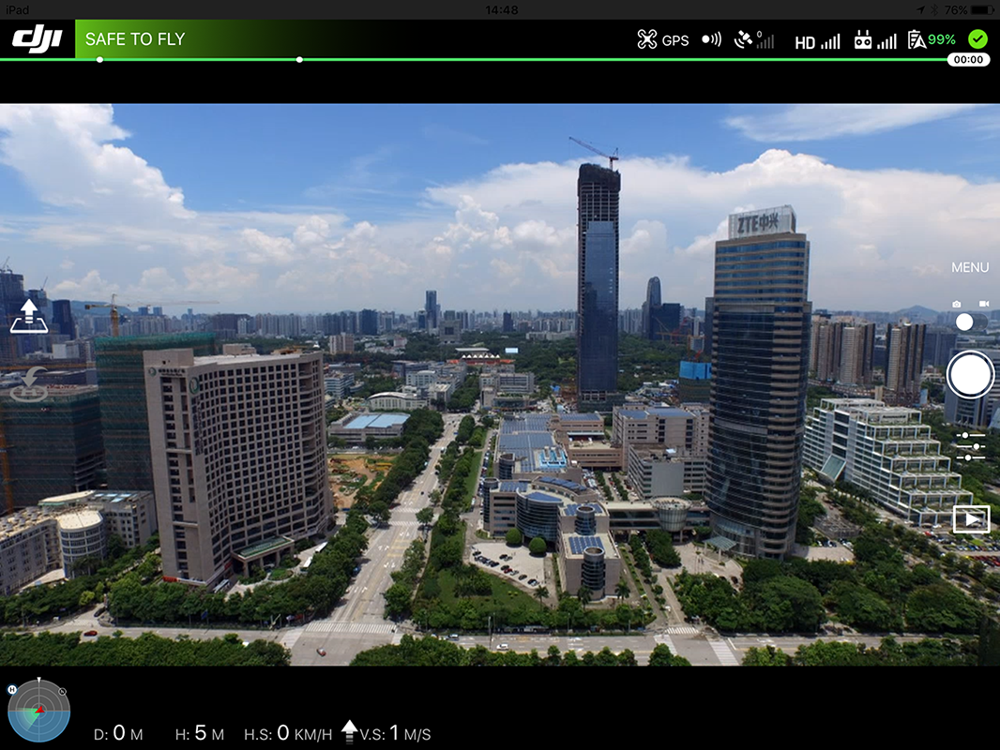

Many applications that control DJI products using the DJI Mobile SDK have similar core functionality. They will typically:

* Show a live view of the camera feed
* Show product state (aircraft telemetry, battery level, signal strength, etc.)
* Allow the user to review and change product settings
* Have basic functionality such as automatic take off, land, go home.

When a developer makes an application, they typically have to provide this set of core functionality before adding their own, unique features.

The DJI UILibrary provides UI objects that have this core functionality, and so can be used to greatly speed development time. In fact, using the default UILibrary, an application can be created with no additional lines of code that looks like:

Developers can pick and choose which parts of the UILibrary they want to use, not use and customize. 

UILibrary is available in the DJI Mobile SDK v4.0 and later. 

## Concepts Overview

UILibrary comprises three main categories of UI element:

* **Widget**: An independent UI element that gives state or simple control (like battery indicator or automatic take-off button)
* **Collection**: An organized collection of widgets that are related to each other (e.g. camera exposure state)
* **Panel**: Complicated, information rich UI elements (e.g. camera settings)

All UI elements can simply be used in an application without maintenance. They are already tied to the DJI Mobile SDK, and will start automatically updating themselves after instantiation.

The [Android](http://developer.dji.com/api-reference/android-uilib-api/index.html) and [iOS](http://developer.dji.com/api-reference/ios-uilib-api/index.html) UILibrary API reference has the complete list of UI elements available.

## Widget

A widget is the simplest component of the UILibrary. It typically represents a simple state element or gives a simple control. Some examples of widgets include:
<html>
<table class="table-pictures">
<tbody>
  <tr valign="top">
    <td>
Aircraft Battery Percentage 
</td>
    <td>
Flight Mode 
</td>
    <td>
Video Signal Strength 
</td>
    <td>
Return to Home Button 
</td>
  </tr>

  <tr>
    <td align="center"></td>
    <td align="center"></td>
    <td align="center"></td>
    <td align="center"></td>
  </tr>
</tbody>
</table>
</html>

### Customization

Widgets can be customized by either swapping the asset, or subclassing the widget.

#### Asset Swap

Swapping the asset keeps the widget's behavior and logic, but changes its look.

##### iOS

  1. Open the **DJIUILibrary.framework**
  2. Replace assets in the "DJIUILibrary.framework/Assets/"" directory
  3. Replace the orignal **DJIUILibrary.framework** file in the Xcode project

> Note: The image assets are required to be of the same names and pixel dimensions as the original ones.

##### Android

  1. Rename AAR file to have a zip extension
  2. Unzip AAR file
  3. Replace assets in the following directories:
    - res/drawable
    - res/drawable-hdpi-v4
    - res/drawable-mdpi-v4
    - res/drawable-xhdpi-v4
    - res/drawable-xxhdpi-v4
    - res/drawable-xxxhdpi-v4
  4. Zip file and rename to replace the original AAR file 

> Note: The image assets are required to be of the same pixel dimensions as the original ones.

#### Subclassing

##### iOS

  You can subclass widgets to override initialize and view update methods to customize the look. For easy customization, each widget exposes the underlying data it is using as properties. Please refer to [API documentation](http://developer.dji.com/api-reference/ios-uilib-api/Widgets/AutoExposureLockWidget.html) for more details.

##### Android
  
  In Android, subclassing can completely change the behavior and the look of Widgets. The steps are:

  1. Override `void initView(Context var1, AttributeSet var2, int var3)` and inflate/initialize the custom layout. Remember, **do not call** `super.initView()`.

  2. To get updated with information changes, override methods with the name following the `onXXXChange` pattern (for example, the `onBatteryPercentageChange(int percentage)` in `BatteryWidget`). This method will be called every time battery percentage changes. Overriding this method will give you the integer value of battery percentage. Remember, **do not call** `super.initView()`.              

  3. To perform actions, use methods that follow the naming pattern `performXXXAction`.

## Collection

A widget collection groups multiple, often related widgets together in an organized way. It controls the layout of the widgets relative to each other.

Collections can also be created and used to organize pre-existing widgets.

Widget collections are used in iOS Only.

## Panels

Panels are more complex elements with rich information and control, such as settings menus or the pre-flight checklist. 

Examples of panels include:

<html>

<table class="table-pictures">

  <tr valign="top">
    <td>
Camera Settings Panel 
</td>
    <td>
Camera Exposure Settings Panel 
</td>
    <td>
Preflight Checklist 
</td>
  </tr>

  <tr>
    <td align="center"></td>
    <td align="center"></td>
    <td align="center"></td>
  </tr>

</table>
</html>

### Customization

Due to the complexity of panels, customization is not currently provided.

## Samples & Tutorials

We provide sample projects for the DJI UI Library, please check below:

- [iOS UI Library Github Sample](https://github.com/dji-sdk/Mobile-UILibrary-iOS)

- [Android UI Library Github Sample](https://github.com/dji-sdk/Mobile-UILibrary-Android)

Moreover, an iOS UI Library tutorial is provided as an example on how to use the iOS UI Library.

- [Creating a Simplified DJI Go app using DJI Mobile UI Library](TODO)
 
