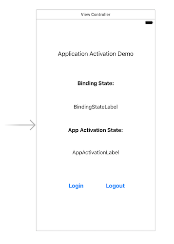
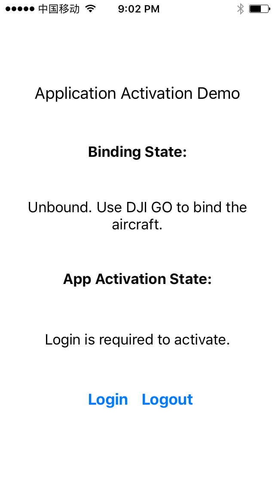
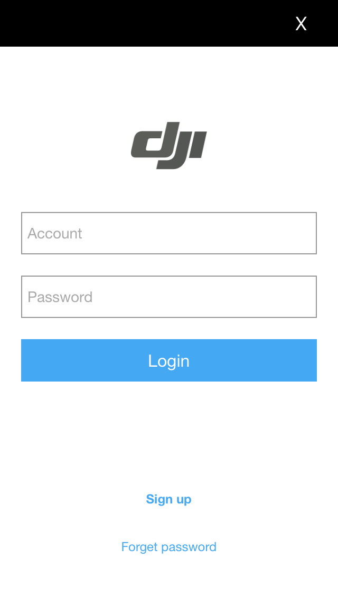
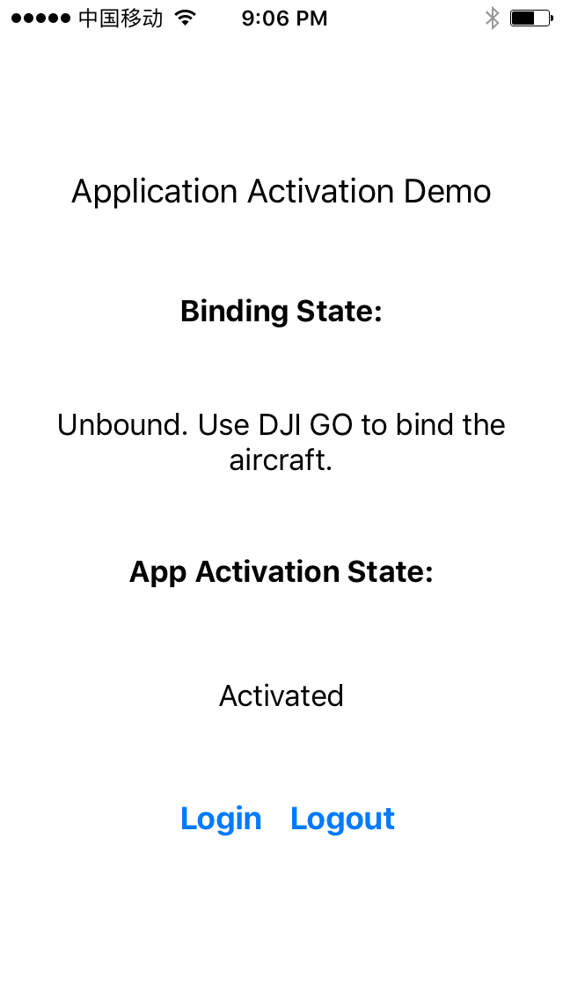
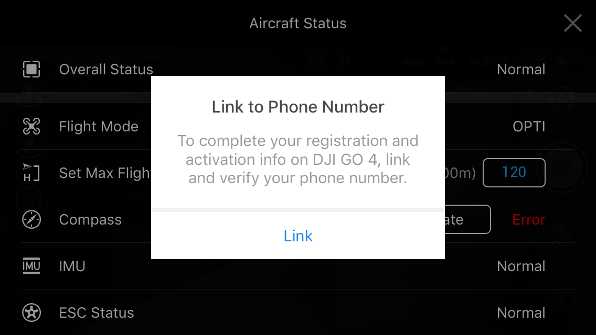
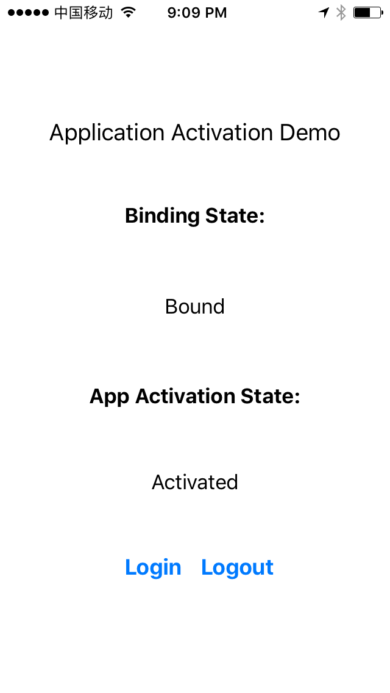

>
> Note: This tutorial only works for applications used in **China**. The same steps can be used for activating applications and binding aircraft in an existing application.

You can download the tutorial's final sample project from this [Github Page](https://github.com/DJI-Mobile-SDK-Tutorials/iOS-ActivationAndBindingDemo).

## Introduction

DJI aircraft firmware requires mobile applications that control DJI aircraft to be activated with the user's DJI account, if that application is being used in China. This will ensure operators use the correct set of geospatial information and flight functions for their aircrafts, as determined by their geographical location and user profile. 

To summarise the activation system:

- Users in China are required to activate their application  by logging into their DJI account at least once every three months within the application.

- Activation will be persistent in the application until the user logs out.

- An internet connection will be required to log into a DJI account.

- Outside of China, the SDK will automatically activate the application without requiring the user to log in.

- Additionally, users in China are required to bind their aircraft to their user account in DJI Go / DJI Go 4. This is required only once. If an application is not activated, the aircraft is not bound (if required), or a legacy version of the SDK (< 4.1) is being used, all **camera live streams** will be **disabled**, and flight will be limited to a zone of 100m diameter and 30m height to ensure the aircraft stays within line of sight. 

## Application Activation

To create a new project in Xcode, choose the **Single View Application** template for your project and press "Next", then enter "ActivationDemo" in the **Product Name** field and keep the other default settings.

### Implementing the UI of Application

Next, let's open the "Main.storyboard", drag and drop 5 UILabel objects and 2 UIButton objects to the View Controller, then place and name them as shown below:

For more detailed configurations of the storyboard, please check the tutorial's Github sample project. 

### Registering the Application

This demo is built based on the [ImportSDKDemo](https://github.com/DJI-Mobile-SDK-Tutorials/iOS-ImportAndActivateSDKInXcode) Github Sample, you can check the [Integrate SDK into Application](../application-development-workflow/workflow-integrate.html#register-application) tutorial to learn how to register the application using DJI Mobile SDK.

### Working on the ViewController

#### Updating the Activation and Binding State Infos

In order to fetch the updated application activation state and aircraft binding state, we can implement the `DJIAppActivationManagerDelegate` methods.

Now, let's open the "ViewController.m" file, and create two IBOutlet properties and two IBAction methods to link the UI elements we just created in the storyboard. Then implement the **DJIAppActivationManagerDelegate** and **DJISDKManagerDelegate** protocols in the interface and create two properties to store the state enum values of `DJIAppActivationState` and `DJIAppActivationAircraftBindingState` as shown below:

~~~objc
@interface ViewController ()<DJIAppActivationManagerDelegate, DJISDKManagerDelegate>

@property (weak, nonatomic) IBOutlet UILabel *bindingStateLabel;
@property (weak, nonatomic) IBOutlet UILabel *appActivationLabel;
@property (nonatomic) DJIAppActivationState activationState;
@property (nonatomic) DJIAppActivationAircraftBindingState aircraftBindingState;

- (IBAction)onLoginClick:(id)sender;
- (IBAction)onLogoutClick:(id)sender;

@end
~~~

Next, replace the code in the `viewDidLoad` method with the followings:

~~~objc
- (void)viewDidLoad {
    [super viewDidLoad];

    [DJISDKManager appActivationManager].delegate = self;
    self.activationState = [DJISDKManager appActivationManager].appActivationState;
    self.aircraftBindingState = [DJISDKManager appActivationManager].aircraftBindingState;
}
~~~

In the code above, we firstly set the delegate of `DJIAppActivationManager` as **ViewController**. Then initialize the `activationState` and `aircraftBindingState` properties with the value of `appActivationState` and `aircraftBindingState` properties of `DJIAppActivationManager`.

Furthermore, create the `updateUI` method as shown below to update the two UILabel properties' text value according to the values of `aircraftBindingState` and `activationState` properties, then invoke it in the `viewDidAppear:` method:

~~~objc
-(void)updateUI {
    switch (self.aircraftBindingState) {
        case DJIAppActivationAircraftBindingStateUnboundButCannotSync:
            self.bindingStateLabel.text = @"Unbound. Please connect Internet to update state. ";
            break;
        case DJIAppActivationAircraftBindingStateUnbound:
            self.bindingStateLabel.text = @"Unbound. Use DJI GO to bind the aircraft. ";
            break;
        case DJIAppActivationAircraftBindingStateUnknown:
            self.bindingStateLabel.text = @"Unknown";
            break;
        case DJIAppActivationAircraftBindingStateBound:
            self.bindingStateLabel.text = @"Bound";
            break;
        case DJIAppActivationAircraftBindingStateInitial:
            self.bindingStateLabel.text = @"Initial";
            break;
        case DJIAppActivationAircraftBindingStateNotRequired:
            self.bindingStateLabel.text = @"Binding is not required. ";
            break;
        case DJIAppActivationAircraftBindingStateNotSupported:
            self.bindingStateLabel.text = @"App Activation is not supported. ";
            break;
    }
    
    switch (self.activationState) {
        case DJIAppActivationStateLoginRequired:
            self.appActivationLabel.text = @"Login is required to activate.";
            break;
        case DJIAppActivationStateUnknown:
            self.appActivationLabel.text = @"Unknown";
            break;
        case DJIAppActivationStateActivated:
            self.appActivationLabel.text = @"Activated";
            break;
        case DJIAppActivationStateNotSupported:
            self.appActivationLabel.text = @"App Activation is not supported.";
            break;
    }
}

- (void)viewDidAppear:(BOOL)animated
{
    [super viewDidAppear:animated];
    [self registerApp];
    [self updateUI];
}
~~~

After you finish the steps above, you should implement the delegate methods of `DJIAppActivationManagerDelegate`:

~~~objc
#pragma mark DJIAppActivationManagerDelegate Methods
-(void)manager:(DJIAppActivationManager *)manager didUpdateAppActivationState:(DJIAppActivationState)appActivationState {
    self.activationState = appActivationState;
    [self updateUI];
}

-(void)manager:(DJIAppActivationManager *)manager didUpdateAircraftBindingState:(DJIAppActivationAircraftBindingState)aircraftBindingState {
    self.aircraftBindingState = aircraftBindingState;
    [self updateUI];
}
~~~

The code above implements:

1. The `manager:didUpdateAppActivationState:` delegate method will be called when the app activation state changes. In this method, we update the value of the `activationState` property and invoke the `updateUI` method to update the text values of the UILabels.

2. The `manager:didUpdateAircraftBindingState:` delegate method will be called when the App Activation manager updates the aircraft binding state. In this method, we update the value of `aircraftBindingState` property and invoke the `updateUI` method to update the text values of the UILabels.

#### Login and Logout DJI User Account

In order to activate the application, we need to login to a DJI user account. Now let's implement the two IBAction methods as shown below:

~~~objc
- (IBAction)onLoginClick:(id)sender {
    [[DJISDKManager userAccountManager] logIntoDJIUserAccountWithAuthorizationRequired:NO withCompletion:^(DJIUserAccountState state, NSError * _Nullable error) {
        if (error) {
            ShowResult(@"Login error: %@", error.description);
        }else{
            ShowResult(@"Login Success");
        }
    }];
}

- (IBAction)onLogoutClick:(id)sender {
    [[DJISDKManager userAccountManager] logOutOfDJIUserAccountWithCompletion:^(NSError * _Nullable error) {
        if (error) {
            ShowResult(@"Logout error: %@", error.description);
        }else{
            ShowResult(@"Logout Success");
        }
    }];
}
~~~

In the `onLoginClick:` IBAction method, we invoke the `logIntoDJIUserAccountWithAuthorizationRequired` method of `DJIUserAccountManager` to login to the DJI User Account and show alert views to inform users. 

Similarly, in the `onLogoutClick:` IBAction method, we invoke the `logOutOfDJIUserAccountWithCompletion:` method of `DJIUserAccountManager` to logout DJI User Account and show alert views to inform users.

For more details, please check the tutorial's Github Sample Project.

Now, to build and run the project, connect the demo application to your aircraft (Please check the [Run Application](../application-development-workflow/workflow-run.html) for more details) and check the features we have implemented so far.

Here are the steps to activate the application:

1. If the application has not activated, you may see the following screenshot:

2. Now, let's press the **Login** button and fill in your email address and password to login and activate the application:

3. If everything goes well, you should see the `appActivationLabel`'s text value changes to "Activated":

## Aircraft Binding

After you finish activating the application, you can now connect your aircraft to [DJI Go 4](https://itunes.apple.com/us/app/dji-go-4-for-phantom-4-series-mavic-and-inspire-2/id1170452592?mt=8)/[DJI Go](https://itunes.apple.com/us/app/dji-go-for-phantom-3-inspire1-osmo-and-matrice/id943780750?mt=8) app and bind your aircraft to your DJI account. This is required only once. If you press the **Enter Device** button, you should see an alertView pop up as shown below:

Now, press the **Link** button to finish the mobile phone link and verification process. After that, connect the aircraft back to the application, you should see the `bindingStateLabel`'s text value has changed to "Bound" as shown below:

Congratulations! Now, your mobile application and aircraft can be used in China without any issue. In other words, your application can now see the aircraft's camera live streams and the flight will not be limited to a zone of 100m diameter and 30m height.

### Summary

In this tutorial, you have learned how to use DJI Mobile SDK to activate the SDK mobile application and use DJI Go app to bind the aircraft to your DJI Acccount. The same steps can be used for activating a application and binding a aircraft in your application. We hope you enjoyed this tutorial, and look forward to seeing you again!

