**Note: This Tutorial and Sample Project is developed based on iOS SDK v3.5.1, an update version for iOS SDK v4.0 will be published soon.**

---

In this tutorial, you will learn how to use the TapFly and ActiveTrack Missions of DJI iOS SDK to create a cool application for Phantom 4. Also you will get familiar with DJIMissionManager and using the Simulator of DJI Assistant 2 for testing, which is convenient for you to test the missions indoor. So let's get started!

You can download the tutorial's final sample code project from this [Github Page](https://github.com/DJI-Mobile-SDK-Tutorials/iOS-Phantom4Missions).
   
## Phantom 4 New Missions  
   
  The Phantom 4 supports the two new TapFly and ActiveTrack missions, which brings you a more autonomous flying experience.
    
### TapFly Mission

TapFly Mission is only supported on Phantom 4. Given a coordinate in the live video stream (which can come from a user tap), the aircraft will calculate and fly towards the coordinate's direction in the real wold. During flight, the aircraft will automatically detect and avoid obstacles.

During the mission, you can use the remote controller's yaw stick to adjust the heading of the aircraft, which also adjusts the direction of flight to the new yaw. Using any other stick controls will cancel the mission.

Here is a <a href="https://dn-djidl2.qbox.me/cloud/6949e90958a3e0dbf1175cd9bb1f851a/720.mp4" target="_blank"> video </a> for you to get the first impression of the TapFly Mission.

### ActiveTrack Mission

ActiveTrack Mission is only supported on Phantom 4. It allows an aircraft to track a moving subject using the vision system and without a GPS tracker on the subject.

The main camera is used to track the target, so the gimbal cannot be adjusted during an ActiveTrack mission. During the mission the aircraft can be manually flown with pitch, roll and throttle to move around the subject being tracked.

Here is a <a href="https://dn-djidl2.qbox.me/cloud/4ebc02c536baf850f5a568d8c27743fc/720.mp4" target="_blank"> video </a> for you to get the first impression of the ActiveTrack Mission.

## Implementing the UI of Application

### Importing the Framework

Now that you know the details of the two new missions of Phantom 4, we can start working on the application.

Let's create a new project in Xcode, choose **Single View Application** template for your project and press "Next", then enter "P4Missions" in the **Product Name** field and keep the other default settings.

Once the project is created, let's import the **DJISDK.framework** to it. If you are not familiar with the process of importing DJI SDK, please check this tutorial: [Importing and Activating DJI SDK in Xcode Project](../application-development-workflow/workflow-integrate.html#Xcode-Project-Integration) for details.

### Importing the VideoPreviewer

 **1**. We use the **FFMPEG** decoding library (found at <a href="http://ffmpeg.org" target="_blank">http://ffmpeg.org</a>) to do software video decoding here. For the hardware video decoding, we provide a **DJIH264Decoder** decoding library. You can find them in the **VideoPreviewer** folder, which you can download it from <a href="https://github.com/dji-sdk/Mobile-SDK-iOS/tree/master/Sample%20Code/VideoPreviewer" target="_blank">DJI iOS SDK Github Repository</a>. Download and copy the entire **VideoPreviewer** folder to your Xcode project's "Frameworks" folder and then add the "VideoPreviewer.xcodeproj" to the "Frameworks" folder in Xcode project navigator, as shown below:
  
 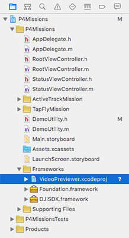
 
> Note: Please Make sure the **VideoPreviewer** folder and **DJISDK.framework** are in the same **Frameworks** folder like this:
> 
> 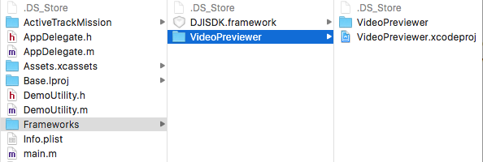
 
 **2**. Next, let's select the "P4Missions" target and open the "General" tab. In the "Embedded Binaries" section, press "+" button to add the "VideoPreviewer.framework" as shown below:
 
  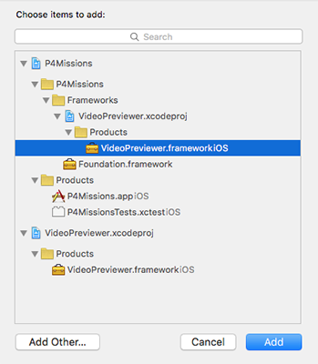
  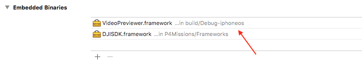

### Setup the Storyboard

#### 1. Creating RootViewController

   Now, let's delete the **ViewController.h** and **ViewController.m** files, which were created by Xcode when you create the project. Then, create a UIView Controller named "**RootViewController**" and set the class of original ViewController object in storyboard to "RootViewController". Next make the ViewController embed in a Navigation Controller and set it as the Storyboard Entry Point in Main.storyboard. 

#### 2. Creating UIButtons

   Drag and drop two UIButton objects to the RootViewController and named them as "TapFly Mission" and "ActiveTrack Mission". Remember to add Auto Layout constraints to the two buttons. Moreover, drag and drop two UIViewController objects from the Object library and place them on the right of the RootViewController.

#### 3. Adding Two ViewControllers

   Control drag from the two buttons to the two new UIViewController objects seperately and choose the "Show" action segue. Here we create two UIViewController classes and named them as "ActiveTrackViewController" and "TapFlyViewController". Then set the class of the two new UIViewController objects in storyboard as these two classes.

#### 4. Setup StatusViewController

   Drag and drop another ViewController object from the Object Library to the right of ActiveTrackViewController in the storyboard. Create another UIViewController class and named it as "StatusViewController", then set the class name in storyboard too.

#### 5. Setup Segues

   Drag two Bar Button Item(Name them as both "Status") from Object Library and place them on the right side of navigation bar of "ActiveTrackViewController" and "TapFlyViewController" objects in the storyboard. Lastly, control drag from the two "Status" Bar Button to the StatusViewController, and select "Show" action segue.

Now, let's check the screenshot of the current storyboard UI:

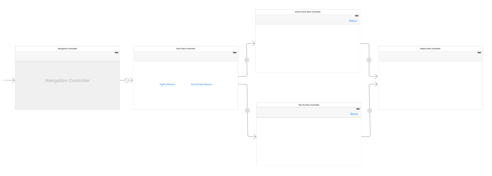

It Looks pretty simple and clear, this will be the workflow of our demo application. 

### Registering the Application

After you finish the above steps, let's register our application. Open the RootViewController.m file and replace it with the following code:

~~~objc
#import "RootViewController.h"
#import "DemoUtility.h"

@interface RootViewController ()<DJISDKManagerDelegate>
@property (weak, nonatomic) IBOutlet UIButton *tapFlyMissionButton;
@property (weak, nonatomic) IBOutlet UIButton *activeTrackMissionButton;

@end

@implementation RootViewController

- (void)viewDidLoad {
    [super viewDidLoad];
    self.title = @"Phantom 4 Missions Demo";
    [self registerApp];
}

- (void)viewDidAppear:(BOOL)animated
{
    [super viewDidAppear:animated];
}

- (void)didReceiveMemoryWarning {
    [super didReceiveMemoryWarning];
}

#pragma mark Custom Methods
- (void)registerApp
{
    NSString *appKey = @"Please enter your App Key here.";
    [DJISDKManager registerApp:appKey withDelegate:self];
}

- (void)showAlertViewWithTitle:(NSString *)title withMessage:(NSString *)message
{
    UIAlertController *alert = [UIAlertController alertControllerWithTitle:title message:message preferredStyle:UIAlertControllerStyleAlert];
    UIAlertAction *okAction = [UIAlertAction actionWithTitle:@"OK" style:UIAlertActionStyleDefault handler:nil];
    [alert addAction:okAction];
    [self presentViewController:alert animated:YES completion:nil];
    
}

#pragma mark DJISDKManagerDelegate Method
-(void) sdkManagerProductDidChangeFrom:(DJIBaseProduct* _Nullable) oldProduct to:(DJIBaseProduct* _Nullable) newProduct
{
    if (newProduct) {
        [self.tapFlyMissionButton setEnabled:YES];
        [self.activeTrackMissionButton setEnabled:YES];
    }else
    {
        [self.tapFlyMissionButton setEnabled:NO];
        [self.activeTrackMissionButton setEnabled:NO];
    }
}

- (void)sdkManagerDidRegisterAppWithError:(NSError *)error
{
    if (error) {
        NSString* message = @"Register App Failed! Please enter your App Key and check the network.";
        [self.tapFlyMissionButton setEnabled:NO];
        [self.activeTrackMissionButton setEnabled:NO];
        [self showAlertViewWithTitle:@"Register App" withMessage:message];

    }else
    {
        NSLog(@"registerAppSuccess");
        [DJISDKManager startConnectionToProduct];
    }
}
@end
~~~

In the code shown above, we implement the following features:

**1.** Implement the `registerApp` method and invoke the `registerApp:withDelegate:` method of DJISDKManager by passing the **App Key** you get when you register the app on DJI Developer website. If you are not familiar with the App Key, please check the [Get Started](../quick-start/index.html).

**2.** Implement the `sdkManagerProductDidChangeFrom:to:` delegate method to check the connection status and hide or show the two UIButtons.

**3.** Implement the `sdkManagerDidRegisterAppWithError:` delegate method to check if register app successfully, then invoke the `startConnectionToProduct` method of DJISDKManager to start a connection to Phantom 4.

## Coordinate Transformations for Missions

Before we dive into the implementation of two missions, let's learn something about the special coordinate transformations of them.

### TapFly Mission Coordinate Transformation

If we check the **DJITapFlyMission.h** file, you can see the following two properties:

~~~objc
@property(nonatomic, readonly) DJIVector direction;
@property(nonatomic, readonly) CGPoint imageLocation;
~~~

**1.** The `direction` property is a DJIVector object, which represents a cartesian vector in 3D space. You can get the actual flying direction of the aircraft using the N-E-D(North-East-Down) coordinate system when the aircraft is executing a TapFly mission.

**2.** The `imageLocation` property is the image point from the live video stream where the vision system should calculate the flight direction from. The image point is normalized to [0,1] where (0,0) is the top left corner and (1,1) is the bottom right.

Here is a diagram to show the coordinate transformation of the mission:

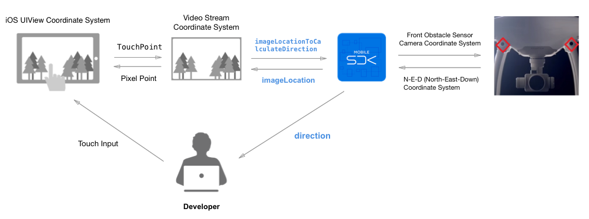

As the diagram shown above, you can see the process of transformation.

- The `imageLocationToCalculateDirection` property shown above is transformed from TouchPoint (CGPoint) to a Video Stream Coordinate System CGPoint.

- The `direction` property shown above belongs to the **N-E-D (North-East-Down) Coordinate System** and will be sent to you by the SDK.

- The `imageLocation` property shown above belongs to the **Video Stream Coordinate System** and will be sent to you by the SDK.

So in our demo application, in order to implement the TapFly mission, we should transform the user's touch location (A CGPoint object) of UIView Coordinate System into the image location (A CGPoint object) of Video Stream Coordination System and pass it to the following `imageLocationToCalculateDirection` property of DJITapFlyMission:

~~~objc
/**
 *  The image point from the video feed where the vision system should calculate the flight direction from. The image point is normalized to [0,1] where (0,0) is the top left corner and (1,1) is the bottom right.
 */
@property(nonatomic, assign) CGPoint imageLocationToCalculateDirection;
~~~

### ActiveTrack Mission Coordinate Transformation

Next, let's check the **DJIActiveTrackMission.h** file, you may see the following two properties.

~~~objc
@property(nonatomic, readonly) CGRect trackingRect;
@property(nonatomic, assign) CGRect rect;
~~~

**1.** The `trackingRect` property is a rectangle in the live video stream view image that represents the target being tracked. The rectangle is normalized to [0,1] where (0,0) is the top left of the video preview and (1,1) is the bottom right.

**2.** The `rect` property is a bounding box for the target. The rectangle is normalized to [0,1] where (0,0) is the top left of the video preview and (1,1) is the bottom right.

   The `size` parameter of `CGRect` can be set to 0 to initialize the mission with a point instead of a rectangle. If the mission is initialized with a point, the vision system will try to recognize object around the point and return the representative rect in the status delegate.
   
   Here is a diagram to show the coordinate transformation of the ActiveTrack mission:

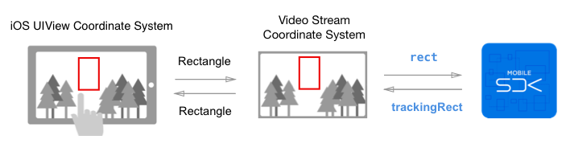

As the diagram shown above, you can see the process of transformation. 

- The `trackingRect` and `rect` properties shown above belongs to the **Video Stream Coordinate System**.

So in order to implement the ActiveTrack Mission, we should transform the user's touch rect (A CGRect object) of UIView Coordinate System into the tracking rect (A CGRect object) of Video Stream Coordination System and pass it to the `rect` property of DJIActiveTrackMission. The SDK will send you the `trackingRect` property to update the rectangle on your screen.

## Implementing the TapFly Mission

### Working on the UI of TapFlyViewController

   Now let's create a new UIView class and name it as "PointingTouchView". We use this UIView to update and draw the tapping point of the direction which you want the drone to fly towards on the screen.

   Go back to the TapFlyViewController object in the storyboard. Drag and drop two UIView objects to the view controller and adjust their size to be full screen. Create two IBOutlets for them in the class extension part of TapFlyViewController.m file and connect them between Storyboard and the .m file as shown below:

~~~objc
@property (weak, nonatomic) IBOutlet UIView *fpvView;
@property (weak, nonatomic) IBOutlet PointingTouchView *touchView;
~~~

   Remember to place the fpvView at the bottom, and change the top UIView object's class to "PointingTouchView".

  Next, Drag and drop two UILabel objects, two UIButton objects, a UISwitch object and a UISlider object on top of the View of Tap Fly View Controller and place them on the positions as shown below:

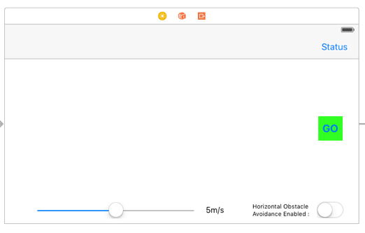

For more details of the UI customization, please check the Github source code of this demo project. Lastly, create three IBOutlets properties and two IBActions methods for them in the TapFlyViewController.m file as shown below:

~~~objc
@property (weak, nonatomic) IBOutlet UIButton* startMissionBtn;
@property (weak, nonatomic) IBOutlet UIButton* stopMissionBtn;
@property (weak, nonatomic) IBOutlet UILabel* speedLabel;
@property (weak, nonatomic) IBOutlet UILabel *horiObstacleAvoidLabel;
~~~

~~~objc
-(IBAction) onSliderValueChanged:(UISlider*)slider
{
}

-(IBAction) onSwitchValueChanged:(UISwitch*)sender
{
}

-(IBAction) onStartMissionButtonAction:(UIButton*)sender
{
}

-(IBAction) onStopMissionButtonAction:(UIButton*)sender
{
}
~~~

### Implementing the Coordinate Transformation Methods

  Let's create a useful NSObject class named "DemoUtility", it contains some useful Macros and Class methods for the demo project. Here is the interface of it:

~~~objc
#import <Foundation/Foundation.h>
#import <DJISDK/DJISDK.h>
#import <VideoPreviewer/VideoPreviewer.h>

#define weakSelf(__TARGET__) __weak typeof(self) __TARGET__=self
#define weakReturn(__TARGET__) if(__TARGET__==nil)return;
#define INVALID_POINT CGPointMake(CGFLOAT_MAX, CGFLOAT_MAX)

extern void ShowResult(NSString *format, ...);

@interface DemoUtility : NSObject

/**
 *  Fetch DJI Project's component Objects.
 */
+ (DJICamera*) fetchCamera;
+ (DJIGimbal*) fetchGimbal;
+ (DJIFlightController *) fetchFlightController;

/**
 *  Help to do the coordinate transformations.
 */
+ (CGPoint) pointToStreamSpace:(CGPoint)point withView:(UIView *)view;
+ (CGPoint) pointFromStreamSpace:(CGPoint)point withView:(UIView *)view;
+ (CGSize) sizeToStreamSpace:(CGSize)size;
+ (CGSize) sizeFromStreamSpace:(CGSize)size;
+ (CGRect) rectToStreamSpace:(CGRect)rect withView:(UIView *)view;
+ (CGRect) rectFromStreamSpace:(CGRect)rect withView:(UIView *)view;
+ (CGRect) rectWithPoint:(CGPoint)point1 andPoint:(CGPoint)point2;

/**
 *  Returns the string object from related enum values.
 */
+ (NSString*) stringFromPointingExecutionState:(DJITapFlyMissionExecutionState)state;
+ (NSString*) stringFromTrackingExecutionState:(DJIActiveTrackMissionExecutionState)state;
+ (NSString*) stringFromByPassDirection:(DJIBypassDirection)direction;

@end
~~~

It firstly imports the DJISDK and VideoPreviewer header files, then defines several methods to do the mission coordinate transformations.

Moreover, here are the coordinate transformations class methods' implementations:

~~~objc
+ (CGPoint) pointToStreamSpace:(CGPoint)point withView:(UIView *)view
{
    VideoPreviewer* previewer = [VideoPreviewer instance];
    CGRect videoFrame = [previewer frame];
    CGPoint videoPoint = [previewer convertPoint:point toVideoViewFromView:view];
    CGPoint normalized = CGPointMake(videoPoint.x/videoFrame.size.width, videoPoint.y/videoFrame.size.height);
    return normalized;
}

+ (CGPoint) pointFromStreamSpace:(CGPoint)point withView:(UIView *)view{
    VideoPreviewer* previewer = [VideoPreviewer instance];
    CGRect videoFrame = [previewer frame];
    CGPoint videoPoint = CGPointMake(point.x*videoFrame.size.width, point.y*videoFrame.size.height);
    return [previewer convertPoint:videoPoint fromVideoViewToView:view];
}

+ (CGSize) sizeToStreamSpace:(CGSize)size{
    VideoPreviewer* previewer = [VideoPreviewer instance];
    CGRect videoFrame = [previewer frame];
    return CGSizeMake(size.width/videoFrame.size.width, size.height/videoFrame.size.height);
}

+ (CGSize) sizeFromStreamSpace:(CGSize)size{
    VideoPreviewer* previewer = [VideoPreviewer instance];
    CGRect videoFrame = [previewer frame];
    return CGSizeMake(size.width*videoFrame.size.width, size.height*videoFrame.size.height);
}

+ (CGRect) rectToStreamSpace:(CGRect)rect withView:(UIView *)view
{
    CGPoint origin = [DemoUtility pointToStreamSpace:rect.origin withView:view];
    CGSize size = [DemoUtility sizeToStreamSpace:rect.size];
    return CGRectMake(origin.x, origin.y, size.width, size.height);
}

+ (CGRect) rectFromStreamSpace:(CGRect)rect withView:(UIView *)view
{
    CGPoint origin = [DemoUtility pointFromStreamSpace:rect.origin withView:view];
    CGSize size = [DemoUtility sizeFromStreamSpace:rect.size];
    return CGRectMake(origin.x, origin.y, size.width, size.height);
}
~~~

The "StreamSpace" in the above method names means the video stream coordinate system. Those methods include tranformations of CGPoint, CGSize and CGRect, we will use them frequently later. For the remaining implementation of this class, please check the Github Source Code.

### Working on the PointingTouchView

Now let's go to PointingTouchView.h file and replace it with the following codes:

~~~objc
#import <UIKit/UIKit.h>

@interface PointingTouchView : UIView
-(void) updatePoint:(CGPoint)point;
-(void) updatePoint:(CGPoint)point andColor:(UIColor*)color;
@end
~~~

Here, we create two methods to update the touching point and its color. 

Next, go to the PointingTouchView.m file and replace it with the following codes:

~~~objc
#import "PointingTouchView.h"
#import "DemoUtility.h"

@interface PointingTouchView ()

@property(nonatomic, assign) CGPoint point;
@property(nonatomic, strong) UIColor* fillColor;

@end

@implementation PointingTouchView

-(void) awakeFromNib
{
    [super awakeFromNib];
    
    self.point = INVALID_POINT;
    self.fillColor = [[UIColor greenColor] colorWithAlphaComponent:0.5];
}

-(void) updatePoint:(CGPoint)point
{
    if (CGPointEqualToPoint(self.point, point)) {
        return;
    }
    
    self.point = point;
    [self setNeedsDisplay];
}

-(void) updatePoint:(CGPoint)point andColor:(UIColor*)color
{
    if (CGPointEqualToPoint(self.point, point) && [self.fillColor isEqual:color]) {
        return;
    }
    
    self.point = point;
    self.fillColor = color;
    [self setNeedsDisplay];
}

-(void) drawRect:(CGRect)rect
{
    [super drawRect:rect];
    if (!CGPointEqualToPoint(self.point, INVALID_POINT)) {
        CGContextRef context = UIGraphicsGetCurrentContext();
        UIColor* strokeColor = [UIColor grayColor];
        CGContextSetStrokeColorWithColor(context, strokeColor.CGColor);
        UIColor* fillColor = self.fillColor;
        CGContextSetFillColorWithColor(context, fillColor.CGColor); // Fill Color
        CGContextSetLineWidth(context, 2.5);// Line width
        CGContextAddArc(context, self.point.x, self.point.y, 40, 0, 2*M_PI, 0); // Draw a circle with radius 40
        CGContextDrawPath(context, kCGPathFillStroke);
    }
}
@end
~~~

In the code above, we implement the `updatePoint:` and `updatePoint:andColor:` methods to update the `point` and `fillColor` instance variables. Moreover, we implement the `-(void)drawRect:(CGRect)rect` method to draw a circle and fill with color for the touching point on the PointingTouchView. 

### Implementing the TapFlyViewController

#### Showing Live Video Stream
   
   In order to show the live video stream in the TapFlyViewController, we should import the following headers and implement the protocols of `DJICameraDelegate`, `DJIMissionManagerDelegate` firstly:

~~~objc
#import "TapFlyViewController.h"
#import "PointingTouchView.h"
#import "DemoUtility.h"
#import "StatusViewController.h"

@interface TapFlyViewController () <DJICameraDelegate, DJIMissionManagerDelegate>

@end
~~~

  Then, invoke the `start` instance method of VideoPreviewer, set its view as `fpvView` property object and set its video stream decoder in the `viewWillAppear` method. We should also set DJICamera's delegate as TapFlyViewController in the `viewWillAppear` method as shown below:

~~~objc
-(void) viewWillAppear:(BOOL)animated
{
    [super viewWillAppear:animated];
    [[VideoPreviewer instance] setDecoderWithProduct:[DJISDKManager product] andDecoderType:VideoPreviewerDecoderTypeSoftwareDecoder];
    [[VideoPreviewer instance] setView:self.fpvView];
    
    [DJIMissionManager sharedInstance].delegate = self;
    
    DJICamera* camera = [DemoUtility fetchCamera];
    if (camera) {
        camera.delegate = self;
    }
 
    [[VideoPreviewer instance] start];
}
~~~

Remember to invoke the `unSetView` method of VideoPreviewer and set its view to nil in the `viewWillDisappear` method to remove the previous glView:

~~~objc
-(void) viewWillDisappear:(BOOL)animated
{
    [super viewWillDisappear:animated];
    [[VideoPreviewer instance] unSetView];
    [[VideoPreviewer instance] setView:nil];
}
~~~

Finally, let's implement the DJICamera's delegate method to show the live video stream on the `fpvView`:

~~~objc
#pragma mark - DJICameraDelegate Method
-(void) camera:(DJICamera*)camera didReceiveVideoData:(uint8_t*)videoBuffer length:(size_t)length
{
    uint8_t* pBuffer = (uint8_t*)malloc(length);
    memcpy(pBuffer, videoBuffer, length);
    [[VideoPreviewer instance] push:pBuffer length:(int)length];
}
~~~

#### Working on the TapFly Mission

##### Setup UITapGestureRecognizer

   If we want to recognize the user's tap gesture on the screen, we need to create a UITapGestureRecognizer instance object in the `viewDidLoad` method and implement its action selector method as shown below:
   
~~~objc
- (void)viewDidLoad {
    [super viewDidLoad];

    self.title = @"TapFly Mission";
    UITapGestureRecognizer* tapGesture = [[UITapGestureRecognizer alloc] initWithTarget:self action:@selector(onScreenTouched:)];
    [self.touchView addGestureRecognizer:tapGesture];    
}
~~~

~~~objc
-(void) onScreenTouched:(UIGestureRecognizer*)recognizer
{
    CGPoint point = [recognizer locationInView:self.touchView];
    [self.touchView updatePoint:point andColor:[[UIColor greenColor] colorWithAlphaComponent:0.5]];
    
    point = [DemoUtility pointToStreamSpace:point withView:self.touchView];
    [self startTapFlyMissionWithPoint:point];
}
~~~

In the `onScreenTouched:` method, we firstly get the CGPoint of touch event by invoking the `locationInView:` method of UIGestureRecognizer. Then we invoke the `updatePoint:andColor:` method of PointingTouchView to draw the point with green color on the screen. Lastly, we call the `pointToStreamSpace:withView:` method of DemoUtility to transform the touch point to a Video Stream Coordinate CGPoint object and pass it to the `startTapFlyMissionWithPoint` method to prepare the TapFly mission.

##### Prepare and Start the Mission

Before we start to create the DJITapFlyMission instance object, let's check the three properties we can set for each DJITapFlyMission:

**1.** AutoFlightSpeed

You can set the aircraft's auto flight speed during the mission by setting this property for DJITapFlyMission. The range for it is [1, 10] m/s.

**2.** IsHorizontalObstacleAvoidanceEnabled

If you want to allow the aircraft to bypass or move around an obstacle by going to the left or right of the obstacle when executing TapFly mission, you can set this property to YES. Otherwise, the aircraft will only go over an obstacle to avoid it.

**3.** ImageLocationToCalculateDirection

This is where we should pass the coordinate transformation CGPoint property to, we can use the DemoUtility class's `pointToStreamSpace:withView:` method to do the coordinate transformation. This property is the image point from the video feed where the vision system should calculate the flight direction from.

Now, let's implement the `startTapFlyMissionWithPoint:` method to prepare and start the TapFly mission as shown below:

~~~objc
-(void) startTapFlyMissionWithPoint:(CGPoint)point
{
    DJITapFlyMission* tapFlyMission = [[DJITapFlyMission alloc] init];
    tapFlyMission.imageLocationToCalculateDirection = point;
    tapFlyMission.autoFlightSpeed = self.speed;
    tapFlyMission.isHorizontalObstacleAvoidanceEnabled = self.isHorizontalObstacleAvoidanceEnabled;
    weakSelf(target);
    [[DJIMissionManager sharedInstance] prepareMission:tapFlyMission withProgress:nil withCompletion:^(NSError * _Nullable error) {
        if (error) {
            weakReturn(target);
            [target.touchView updatePoint:INVALID_POINT];
            ShowResult(@"Prepare Mission Error:%@", error.localizedDescription);
        }
        else
        {
            [target shouldShowStartMissionButton:YES];
        }
    }];
}

//Should Show StartMissionButton and hide StopMissionButton
- (void) shouldShowStartMissionButton:(BOOL)show
{
    if (show) {
        self.startMissionBtn.hidden = NO;
        self.stopMissionBtn.hidden = YES;
    }else
    {
        self.startMissionBtn.hidden = YES;
        self.stopMissionBtn.hidden = NO;
    }
}

~~~

In the code above, we create an DJITapFlyMission instance object and pass the three properties to it. Then we invoke the `prepareMission:withProgress:withCompletion:` method of DJIMissionManager to prepare the mission. Once the mission is prepared successfully, we invoke the `showStartButton` method to show the Start Mission button for the user. Otherwise, invoke the `updatePoint` method of PointingTouchView by passing a  INVALID_POINT to remove the circle drawing on the view.

Let's continue to implement the `onStartMissionButtonAction:` IBAction method as shown below:

~~~objc
-(IBAction) onStartMissionButtonAction:(UIButton*)sender
{
    weakSelf(target);
    [[DJIMissionManager sharedInstance] startMissionExecutionWithCompletion:^(NSError * _Nullable error) {
            ShowResult(@"Start Mission:%@", error.localizedDescription);
            if (!error) {
                weakReturn(target);
                [target shouldShowStartMissionButton:NO];
            }else
            {
                ShowResult(@"StartMission Failed: %@", error.description);
            }
    }];
}
~~~

If we start the TapFly mission successfully, invoke the `shouldShowStartMissionButton:` method to hide the startMissionBtn and show the stopMissionBtn.

During the TapFly mission execution, we can also implement the DJIMissionManagerDelegate methods to check the status. Let's set the DJIMissionManager's delegate as TapFlyViewController in the `viewWillAppear` method, and implement the following two delegate methods:

~~~objc
- (void)missionManager:(DJIMissionManager *_Nonnull)manager didFinishMissionExecution:(NSError *_Nullable)error
{
    ShowResult(@"Mission Finished:%@", error.localizedDescription);
    [self.touchView updatePoint:INVALID_POINT];
    [self hideMissionControlButton];
    self.isMissionRunning = NO;
}

- (void)missionManager:(DJIMissionManager *_Nonnull)manager missionProgressStatus:(DJIMissionProgressStatus *_Nonnull)missionProgress
{
    if ([missionProgress isKindOfClass:[DJITapFlyMissionStatus class]]) {
        self.isMissionRunning = YES;
        DJITapFlyMissionStatus* status = (DJITapFlyMissionStatus*)missionProgress;
        CGPoint point = status.imageLocation;
        point.x = point.x * self.fpvView.frame.size.width;
        point.y = point.y * self.fpvView.frame.size.height;
        if (CGPointEqualToPoint(point, CGPointZero)) {
            point = INVALID_POINT;
        }
        if (status.executionState == DJITapFlyMissionExecutionStateExecuting) {
            [self.touchView updatePoint:point andColor:[[UIColor greenColor] colorWithAlphaComponent:0.5]];
            [self shouldShowStartMissionButton:NO];
        }
        else if (status.executionState == DJITapFlyMissionExecutionStateCannotExecute)
        {
            [self.touchView updatePoint:point andColor:[[UIColor redColor] colorWithAlphaComponent:0.5]];
            [self shouldShowStartMissionButton:NO];
        }
        
        NSLog(@"Direction:{%f, %f, %f} ExecState:%d", status.direction.x, status.direction.y, status.direction.z, (int)status.executionState);
        
        [self.logString appendFormat:@"Execution State:%@\n", [DemoUtility stringFromPointingExecutionState:status.executionState]];
        [self.logString appendFormat:@"ByPass Direction:%@\n", [DemoUtility stringFromByPassDirection:status.bypassDirection]];
        [self.logString appendFormat:@"Direction:{%f, %f, %f}\n", status.direction.x, status.direction.y, status.direction.z];
        [self.logString appendFormat:@"View Point:{%f, %f}\n", point.x, point.y];
        [self.logString appendFormat:@"Error:%@", status.error.localizedDescription];
    }
}
~~~

The first delegate method will be invoked when the mission finish executing. We can reset the UI and clear the circle drawing on the screen here.

For the second delegate method, firstly, we need to check if the missionProgress is the `DJITapFlyMissionStatus` class. Then, we can get the `imageLocation` from it and transform it back to iOS UIView Coordinate System CGPoint object. With CGPoint object, we can update the circle's position and color drawing on the screen based on the `executionState`. Lastly, we can update the `logString` with status info.

If you want to dynamically set the flight speed of TapFly mission, you can invoke the `setAutoFlightSpeed:withCompletion:` method of DJITapFlyMission in the `onSliderValueChanged:` IBAction method as shown below:

~~~objc
-(IBAction) onSliderValueChanged:(UISlider*)slider
{
    float speed = slider.value * 10;
    self.speed = speed;
    self.speedLabel.text = [NSString stringWithFormat:@"%0.1fm/s", speed];
    if (self.isMissionRunning) {
        [DJITapFlyMission setAutoFlightSpeed:self.speed withCompletion:^(NSError * _Nullable error) {
          if(error){        
            NSLog(@"Set TapFly Auto Flight Speed:%0.1f Error:%@", speed, error.localizedDescription);
          }
        }];
    }
}
~~~

##### Stop Mission

Finally, let's implement the `onStopMissionButtonAction:` IBAction method to stop the TapFly mission:

~~~objc
-(IBAction) onStopMissionButtonAction:(UIButton*)sender
{
    
    weakSelf(target);
    [[DJIMissionManager sharedInstance] stopMissionExecutionWithCompletion:^(NSError * _Nullable error) {
        ShowResult(@"Stop Mission:%@", error.localizedDescription);
        if (!error) {
            weakReturn(target);
            [target hideMissionControlButton];
            target.isMissionRunning = NO;
        }
    }];
}
~~~

For more implementation details of the TapFlyViewController file, please check the Github source code. 

Now let's build and run the project, if everything goes well, you should be able to use the TapFly mission of Phantom 4 now.

>**Important**: Remember to switch the remote controller to **P** mode before you test the TapFly mission.

Here are two gif animations for you to get a better understanding of using the TapFly mission, especially the **Horizontal Obstacle Avoidance** feature:

-  Enable Horizontal Obstacle Avoidance

   In the animation, you can see there are two flat surface obstacles stand towards the Phantom 4. We tap on the right obstacle and ask the Phantom 4 to fly towards it. With the help of the front obstacle sensors, Phantom 4 won't hit the obstacle and crash. You may notice that we switch on the "Horizontal Obstacle Avoidance Enable" before the TapFly mission start. 
   
   Press the **GO** button, Phantom 4 will start to fly towards it. When flying close to the obstacle, the Obstacle Sensing System will help to adjust the aircraft's attitude and fly towards the right side of it. 
 
-  Disable Horizontal Obstacle Avoidance

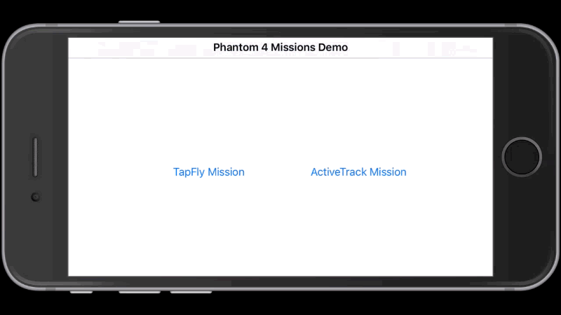

   If we switch off the "Horizontal Obstacle Avoidance Enable", when the Phantom 4 fly close to the obstacle, it will rise to avoid the obstacle and continue to fly towards the origin direction. When you want to stop the mission, just press the **X** button, Phantom 4 will stop immediately and hover there.

## Implementing ActiveTrack Mission

### Working on the UI of ActiveTrackViewController

**1.** Now let's create a new UIView class and name it as "TrackingRenderView". We use this UIView to track the user's UITouch Event and draw the tracking rectangle of the object on it.

**2.** Let's go back to the ActiveTrackViewController object in the storyboard. Drag and drop two UIView objects to the view controller and adjust their size to be full screen. Create two IBOutlets for them in the class extension part of ActiveTrackViewController.m file and connect them between Storyboard and the .m file as shown below:

~~~objc
@property (weak, nonatomic) IBOutlet UIView *fpvView;
@property (weak, nonatomic) IBOutlet TrackingRenderView *renderView;
~~~

Remember to place the fpvView at the bottom, and change the top UIView object's class to "TrackingRenderView".

**3.** Drag and drop a UILabel object, a UIButton object and a UISwitch object on top of the View of Active Track View Controller and place them on the right positions as shown below:

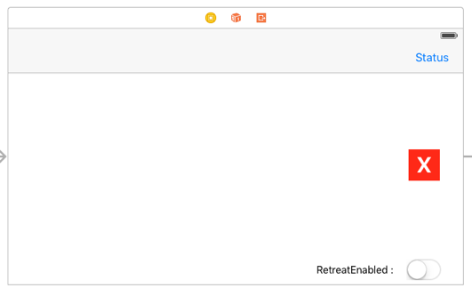

For more details of the UI customization, please check the Github source code of this demo project. Lastly, create two IBOutlet properties and two IBAction methods for them in the ActiveTrackViewController.m file as shown below:

~~~objc
@property (weak, nonatomic) IBOutlet UIButton* stopButton;
@property (weak, nonatomic) IBOutlet UILabel *retreatEnabledLabel;
~~~

~~~objc
- (IBAction)recommendedConfigButtonAction:(id)sender 
{
}

- (IBAction) onStopButtonClicked:(id)sender
{
}
~~~

### Implementing the TrackingRenderView

Let's go to TrackingRenderView.h file and replace it with the following codes:

~~~objc
#import <UIKit/UIKit.h>

@protocol TrackingRenderViewDelegate <NSObject>

@optional

-(void) renderViewDidTouchAtPoint:(CGPoint)point;

-(void) renderViewDidMoveToPoint:(CGPoint)endPoint fromPoint:(CGPoint)startPoint isFinished:(BOOL)finished;

@end

@interface TrackingRenderView : UIView

@property(nonatomic, weak) id<TrackingRenderViewDelegate> delegate;

@property(nonatomic, assign) CGRect trackingRect;

@property(nonatomic, assign) BOOL isDotLine;

@property(nonatomic, strong) NSString* text;

-(void) updateRect:(CGRect)rect fillColor:(UIColor*)fillColor;

@end
~~~

You can see a few things are happening here:

**1.** Firstly, we create two TrackingRenderViewDelegate methods, they are used to track your single touch event and drawing rectangle touch event. 

**2.** We use the `trackingRect` property to store the updated tracking CGRect of moveing subject and draw it on the TrackingRenderView. The `isDottedLine` BOOL value is used for drawing dotted line. The `text` NSString property is used to store and draw text on the TrackingRenderView.

**3.** Lastly, we create the `updateRect:fillColor:` method to update the tracking rect and fill its color.

Next, let's come to the TrackingRenderView.m file and replace it with the following codes:

~~~objc
#import "TrackingRenderView.h"
#define TEXT_RECT_WIDTH (40)

@interface TrackingRenderView ()
@property(nonatomic, strong) UIColor* fillColor;
@property(nonatomic, assign) CGPoint startPoint;
@property(nonatomic, assign) CGPoint endPoint;
@property(nonatomic, assign) BOOL isMoved;
@end

@implementation TrackingRenderView
#pragma mark - UIResponder Methods

- (void)touchesBegan:(NSSet<UITouch *> *)touches withEvent:(nullable UIEvent *)event
{
    self.isMoved = NO;
    self.startPoint = [[touches anyObject] locationInView:self];
}

- (void)touchesMoved:(NSSet<UITouch *> *)touches withEvent:(nullable UIEvent *)event
{
    self.isMoved = YES;
    self.endPoint = [[touches anyObject] locationInView:self];
    if (self.delegate && [self.delegate respondsToSelector:@selector(renderViewDidMoveToPoint:fromPoint:isFinished:)]) {
        [self.delegate renderViewDidMoveToPoint:self.endPoint fromPoint:self.startPoint isFinished:NO];
    }
}

- (void)touchesEnded:(NSSet<UITouch *> *)touches withEvent:(nullable UIEvent *)event
{
    self.endPoint = [[touches anyObject] locationInView:self];
    if (self.isMoved) {
        if (self.delegate && [self.delegate respondsToSelector:@selector(renderViewDidMoveToPoint:fromPoint:isFinished:)]) {
            [self.delegate renderViewDidMoveToPoint:self.endPoint fromPoint:self.startPoint isFinished:YES];
        }
    }
    else
    {
        if (self.delegate && [self.delegate respondsToSelector:@selector(renderViewDidTouchAtPoint:)]) {
            [self.delegate renderViewDidTouchAtPoint:self.startPoint];
        }
    }
}

- (void)touchesCancelled:(nullable NSSet<UITouch *> *)touches withEvent:(nullable UIEvent *)event
{
    self.endPoint = [[touches anyObject] locationInView:self];
    if (self.isMoved) {
        if (self.delegate && [self.delegate respondsToSelector:@selector(renderViewDidMoveToPoint:fromPoint:isFinished:)]) {
            [self.delegate renderViewDidMoveToPoint:self.endPoint fromPoint:self.startPoint isFinished:YES];
        }
    }
}

-(void) updateRect:(CGRect)rect fillColor:(UIColor*)fillColor
{
    if (CGRectEqualToRect(rect, self.trackingRect)) {
        return;
    }
    self.fillColor = fillColor;
    self.trackingRect = rect;
    [self setNeedsDisplay];
}

-(void) setText:(NSString *)text
{
    if ([_text isEqualToString:text]) {
        return;
    }
    _text = text;
    [self setNeedsDisplay];
}

-(void) drawRect:(CGRect)rect
{
    [super drawRect:rect];
    if (CGRectEqualToRect(self.trackingRect, CGRectNull)) {
        return;
    }
    
    CGContextRef context = UIGraphicsGetCurrentContext();
    UIColor* strokeColor = [UIColor grayColor];
    CGContextSetStrokeColorWithColor(context, strokeColor.CGColor);
    UIColor* fillColor = self.fillColor;
    CGContextSetFillColorWithColor(context, fillColor.CGColor); //Fill Color
    CGContextSetLineWidth(context, 1.8); //Width of line
    
    if (self.isDottedLine) {
        CGFloat lenghts[] = {10, 10};
        CGContextSetLineDash(context, 0, lenghts, 2);
    }
    CGContextAddRect(context, self.trackingRect);
    CGContextDrawPath(context, kCGPathFillStroke);
    if (self.text) {
        CGFloat origin_x = self.trackingRect.origin.x + 0.5*self.trackingRect.size.width - 0.5* TEXT_RECT_WIDTH;
        CGFloat origin_y = self.trackingRect.origin.y + 0.5*self.trackingRect.size.height - 0.5* TEXT_RECT_WIDTH;
        CGRect textRect = CGRectMake(origin_x , origin_y, TEXT_RECT_WIDTH, TEXT_RECT_WIDTH);
        NSMutableParagraphStyle* paragraphStyle = [[NSParagraphStyle defaultParagraphStyle] mutableCopy];
        paragraphStyle.lineBreakMode = NSLineBreakByCharWrapping;
        paragraphStyle.alignment = NSTextAlignmentCenter;
        UIFont* font = [UIFont boldSystemFontOfSize:35];
        NSDictionary* dic = @{NSFontAttributeName:font,NSParagraphStyleAttributeName:paragraphStyle,NSForegroundColorAttributeName:[UIColor whiteColor]};
        [self.text drawInRect:textRect withAttributes:dic];
    }
}
@end
~~~

Here, we implement the four event-handling methods for touches to track user's multi touch and invoke the related TrackingRenderViewDelegate methods. Also, we implement the `-(void)drawRect:(CGRect)rect` method to draw the tracking rectangle, dotted line and text on the TrackingRenderView.

### Implementing the ActiveTrackViewController

#### Showing Live Video Stream
   
   In order to show the live video stream of Phantom 4's camera on the app, let's come to ActiveTrackViewController.m file and implement its class extension part firstly. Import the following headers and implement the protocols of `DJICameraDelegate`, `DJIMissionManagerDelegate` and `TrackingRenderViewDelegate`:

~~~objc
#import "ActiveTrackViewController.h"
#import "TrackingRenderView.h"
#import "DemoUtility.h"
#import "StatusViewController.h"

@interface ActiveTrackViewController () <DJICameraDelegate, DJIMissionManagerDelegate, TrackingRenderViewDelegate>

@end
~~~

  Next, we should invoke the `start` instance method of VideoPreviewer, set its view as `fpvView` property object and set its video stream decoder in the `viewWillAppear` method as shown below:

~~~objc
-(void) viewWillAppear:(BOOL)animated
{
    [super viewWillAppear:animated];
    [[VideoPreviewer instance] setDecoderWithProduct:[DJISDKManager product] andDecoderType:VideoPreviewerDecoderTypeSoftwareDecoder];
    [[VideoPreviewer instance] setView:self.fpvView];
    
    [DJIMissionManager sharedInstance].delegate = self;  
    DJICamera* camera = [DemoUtility fetchCamera];
    if (camera) {
        camera.delegate = self;
    }
    
    [[VideoPreviewer instance] start];
}
~~~

Remember to invoke the `unSetView` method of VideoPreviewer and set its view to nil in the `viewWillDisappear` method to remove the previous glView:

~~~objc
-(void) viewWillDisappear:(BOOL)animated
{
    [super viewWillDisappear:animated];
    [[VideoPreviewer instance] unSetView];
    [[VideoPreviewer instance] setView:nil];
}
~~~

Lastly, we should set DJICamera's delegate as ActiveTrackViewController in the `viewWillAppear` method and implement the following method to show the live video stream on the `fpvView`:

~~~objc
#pragma mark - DJICameraDelegate Method
-(void) camera:(DJICamera*)camera didReceiveVideoData:(uint8_t*)videoBuffer length:(size_t)length
{
    uint8_t* pBuffer = (uint8_t*)malloc(length);
    memcpy(pBuffer, videoBuffer, length);
    [[VideoPreviewer instance] push:pBuffer length:(int)length];
}
~~~

#### Setup ActiveTrack Mission

##### Prepare and Start the Mission

  **1.** The Phantom 4's ActiveTrack Mission can track both moving subjects and humans.
  
- Track Moving Subjects

  For moving subjests, you need to provide a CGRect struct of tracking rectangle to the DJIActiveTrackMission object's `rect` property.
  
~~~objc
       DJIActiveTrackMission* mission = [[DJIActiveTrackMission alloc] init];
       mission.rect = CGRectMake(10, 20, 50, 100);   
~~~
  
- Track Humans

  For humans, you can either provide a CGRect struct of tracking rectangle or a CGRect stuct with just CGPoint. Like you can tap on the human on your iPhone's screen.
  
~~~objc
       DJIActiveTrackMission* mission = [[DJIActiveTrackMission alloc] init];
       mission.rect = CGRectMake(10, 20, 0, 0);   
~~~
  
**2.** Now, let's set the TrackingRenderView's delegate as ActiveTrackViewController in the `viewDidLoad` method and implement the delegate methods as shown below:
  
~~~objc
- (void)viewDidLoad {
    [super viewDidLoad];    
    self.renderView.delegate = self;
}
~~~
  
~~~objc
#pragma mark TrackingRenderView Delegate Methods
-(void) renderViewDidTouchAtPoint:(CGPoint)point
{
    if (self.isTrackingMissionRunning && !self.isNeedConfirm) {
        return;
    }
    
    if (self.isNeedConfirm) {
        NSLog(@"TrackingRect:{%0.1f, %0.1f, %0.1f, %0.1f} Point:{%0.1f, %0.1f}", self.currentTrackingRect.origin.x, self.currentTrackingRect.origin.y, self.currentTrackingRect.size.width, self.currentTrackingRect.size.height, point.x, point.y);
        CGRect largeRect = CGRectInset(self.currentTrackingRect, -10, -10);
        if (CGRectContainsPoint(largeRect, point)) {
            [DJIActiveTrackMission acceptConfirmationWithCompletion:^(NSError * _Nullable error) {
                ShowResult(@"Confirm Tracking:%@", error.localizedDescription);
            }];
        }
        else
        {
            [DJIActiveTrackMission rejectConfirmationWithCompletion:^(NSError * _Nullable error) {
                ShowResult(@"Cancel Tracking:%@", error.localizedDescription);
            }];
        }
    }
    else
    {
        weakSelf(target);
        point = [DemoUtility pointToStreamSpace:point withView:self.renderView];
        DJIActiveTrackMission* mission = [[DJIActiveTrackMission alloc] init];
        mission.rect = CGRectMake(point.x, point.y, 0, 0);
        [[DJIMissionManager sharedInstance] prepareMission:mission withProgress:nil withCompletion:^(NSError * _Nullable error) {
            if (error) {
                ShowResult(@"Prepare Mission Error:%@", error.localizedDescription);
                if (error) {
                    weakReturn(target);
                    target.renderView.isDottedLine = NO;
                    [target.renderView updateRect:CGRectNull fillColor:nil];
                }
            }
            else
            {
                [[DJIMissionManager sharedInstance] startMissionExecutionWithCompletion:^(NSError * _Nullable error) {
                    ShowResult(@"Start Mission:%@", error.localizedDescription);
                    if (error) {
                        weakReturn(target);
                        target.renderView.isDottedLine = NO;
                        [target.renderView updateRect:CGRectNull fillColor:nil];
                    }
                }];
            }
        }];
    }
}

-(void) renderViewDidMoveToPoint:(CGPoint)endPoint fromPoint:(CGPoint)startPoint isFinished:(BOOL)finished
{
    if (self.isTrackingMissionRunning) {
        return;
    }
    
    self.renderView.isDottedLine = YES;
    self.renderView.text = nil;
    CGRect rect = [DemoUtility rectWithPoint:startPoint andPoint:endPoint];
    [self.renderView updateRect:rect fillColor:[[UIColor greenColor] colorWithAlphaComponent:0.5]];
    if (finished) {
        CGRect rect = [DemoUtility rectWithPoint:startPoint andPoint:endPoint];
        [self startMissionWithRect:rect];
    }
}
~~~
  
  The `renderViewDidTouchAtPoint:` delegate method get invoked when you do single touch on the screen, there are two situations for it:
  
  - If you draw a tracking rectangle on a moving subject, and the vision system need to confirm it, you can touch the rectangle and invoke the `acceptConfirmationWithCompletion:` method of the DJIActiveTrackMission class, if you want to reject the confirmation, you can touch outside the rectangle, and invoke the `rejectConfirmationWithCompletion:` method. 

  - If you want to track a human, you can touch the human on the screen. By doing that, you will get a CGPoint from the delegate method and invoke the DemoUtility's `pointToStreamSpace:withView:` method to transform the touch CGPoint to a Video Stream Coordinate CGPoint object. Then pass it to the `rect` property of DJIActiveTrackMission and invoke the following method of DJIMissionManager to prepare the ActiveTrack mission:

~~~objc
- (void)prepareMission:(DJIMission *_Nonnull)mission withProgress:(DJIMissionProgressHandler)preparationProgress withCompletion:(DJICompletionBlock)completion;
~~~
  
  Once the mission finish the preparation, you can invoke the following method to start the ActiveTrack mission:
  
~~~objc
- (void)startMissionExecutionWithCompletion:(DJICompletionBlock)completion;
~~~

   Moreover, the `renderViewDidMoveToPoint:fromPoint:isFinished:` delegate method get invoked when user try to draw a rectangle on the screen to track moving subject. You can get the startPoint and endPoint from the delegate method and invoke the DemoUtility's `rectWithPoint:andPoint:` method to convert them to a CGRect object. When you finish drawing the rectangle, invoke the `startMissionWithRect:` method to start the mission.  
   
**3.** Let's implement the `startMissionWithRect:` method here:
   
~~~objc
-(void) startMissionWithRect:(CGRect)rect
{
    CGRect normalizedRect = [DemoUtility rectToStreamSpace:rect withView:self.renderView];
    weakSelf(target);
    NSLog(@"Start Mission:{%f, %f, %f, %f}", normalizedRect.origin.x, normalizedRect.origin.y, normalizedRect.size.width, normalizedRect.size.height);
    DJIActiveTrackMission* trackMission = [[DJIActiveTrackMission alloc] init];
    trackMission.rect = normalizedRect;
    trackMission.isRetreatEnabled = self.isRetreatEnabled;
    [[DJIMissionManager sharedInstance] prepareMission:trackMission withProgress:nil withCompletion:^(NSError * _Nullable error) {
        if (error) {
            weakReturn(target);
            target.renderView.isDottedLine = NO;
            [target.renderView updateRect:CGRectNull fillColor:nil];
            target.isTrackingMissionRunning = NO;
            ShowResult(@"Prepare Error:%@", error.localizedDescription);
        }
        else
        {
            [[DJIMissionManager sharedInstance] startMissionExecutionWithCompletion:^(NSError * _Nullable error) {
                ShowResult(@"Start Mission:%@", error.localizedDescription);
                if (error) {
                    weakReturn(target);
                    target.renderView.isDottedLine = NO;
                    [target.renderView updateRect:CGRectNull fillColor:nil];
                    target.isTrackingMissionRunning = NO;
                }
            }];
        }
    }];
}
~~~

In the code above, we firstly invoke the `rectToStreamSpace:withView:` method of DemoUtility to transform the drawing rectangle to a Video Stream coordinate rectangle, call it `normalizedRect`. Then create the DJIActiveTrackMission instance object and pass the `normalizedRect` to its `rect` property. Also, you can set the `isRetreatEnabled` variable to enable the retreat feature. Here is the details of the retreat feature:

~~~objc
/**
 *  YES if the aircraft can retreat (fly backwards) when the target comes toward it. If no, the aircraft will not retreat and instead rotate the gimbal pitch down to track the target as it goes underneath. If the target goes beyond the gimbal's pitch stop, the target will be lost and the mission will stop. Default is NO.
 */
@property(nonatomic, assign) BOOL isRetreatEnabled;
~~~

Moreover, invoke the `preparMission:withProgress:withCompletion:` and `startMissionExecutionWithCompletion:` methods of DJIMissionManager to start the ActiveTrack Mission.

Finally, we can invoke the `setRecommendedConfigurationWithCompletion:` method of DJIActiveTrackMission in the `viewWillAppear:` method to set the recommended camera and gimbal configuration that optimizes performance for the ActiveTrack Mission in most environments:

~~~objc
-(void) viewWillAppear:(BOOL)animated
{
    [super viewWillAppear:animated];
    
    [[VideoPreviewer instance] setDecoderWithProduct:[DJISDKManager product] andDecoderType:VideoPreviewerDecoderTypeSoftwareDecoder];
    [[VideoPreviewer instance] setView:self.fpvView];
    [DJIMissionManager sharedInstance].delegate = self;
    DJICamera* camera = [DemoUtility fetchCamera];
    if (camera) {
        camera.delegate = self;
    }
    [DJIActiveTrackMission setRecommendedConfigurationWithCompletion:^(NSError * _Nullable error) { 
        if(error){
                ShowResult(@"Set Recommended Camera Settings:%@", error.localizedDescription);
        }
    }];
}
~~~

##### DJIMissionManagerDelegate Method
   
   During the ActiveTrack mission execution, we can use the DJIMissionManagerDelegate methods to update the tracking rectangle on the screen and get the status info of the mission. Let's implement them as shown below:
   
~~~objc
#pragma mark - DJIMissionManagerDelegate Methods
- (void)missionManager:(DJIMissionManager *_Nonnull)manager didFinishMissionExecution:(NSError *_Nullable)error
{
    [self.renderView updateRect:CGRectNull fillColor:nil];
    self.stopButton.hidden = YES;
    self.isTrackingMissionRunning = NO;
}

- (void)missionManager:(DJIMissionManager *_Nonnull)manager missionProgressStatus:(DJIMissionProgressStatus *_Nonnull)missionProgress
{
    if ([missionProgress isKindOfClass:[DJIActiveTrackMissionStatus class]]) {
        self.isTrackingMissionRunning = YES;
        self.stopButton.hidden = NO;
        DJIActiveTrackMissionStatus* status = (DJIActiveTrackMissionStatus*)missionProgress;
        CGRect rect = [DemoUtility rectFromStreamSpace:status.trackingRect withView:self.renderView];
        self.currentTrackingRect = rect;
        if (status.executionState == DJIActiveTrackMissionExecutionStateWaitingForConfirmation) {
            NSLog(@"Mission Need Confirm...");
            self.renderView.text = @"?";
            if (!self.isNeedConfirm) {
                self.isNeedConfirm = YES;
            }
        }
        else if (status.executionState == DJIActiveTrackMissionExecutionStateTargetLost)
        {
            NSLog(@"Mission Target Lost...");
            self.renderView.isDottedLine = NO;
            self.renderView.text = nil;
            self.isNeedConfirm = NO;
            [self.renderView updateRect:CGRectNull fillColor:nil];
        }
        else if (status.executionState == DJIActiveTrackMissionExecutionStateTracking ||
                 status.executionState == DJIActiveTrackMissionExecutionStateTrackingWithLowConfidence)
        {
            self.renderView.isDottedLine = NO;
            self.renderView.text = nil;
            self.isNeedConfirm = NO;
            [self.renderView updateRect:rect fillColor:[[UIColor greenColor] colorWithAlphaComponent:0.5]];
            NSLog(@"Mission Tracking...");
        }
        else if (status.executionState == DJIActiveTrackMissionExecutionStateCannotContinue)
        {
            NSLog(@"Mission Waiting...");
            self.renderView.isDottedLine = NO;
            self.renderView.text = nil;
            self.isNeedConfirm = NO;
            [self.renderView updateRect:rect fillColor:[[UIColor redColor] colorWithAlphaComponent:0.5]];
        }
        
        [self.logString appendFormat:@"Execution State:%@\n", [DemoUtility stringFromTrackingExecutionState:status.executionState]];
        [self.logString appendFormat:@"trackingRect:{%f, %f, %f, %f}\n", status.trackingRect.origin.x, status.trackingRect.origin.y, status.trackingRect.size.width, status.trackingRect.size.height];
        [self.logString appendFormat:@"Error:%@", status.error.localizedDescription];
        
    }
}
~~~
   
   In the first delegate method, we invoke the `updateRect:fillColor:` method of TrackingRenderView to reset the rectangle drawing and reset the related properties.
   
   In the second delegate method, we firstly check if the DJIMissionProgressStatus is `DJIActiveTrackMissionStatus` class. Then we do the `executionState` checking from the `DJIActiveTrackMissionStatus` object. There are several executionState as shown below:
   
~~~objc
/**
 *  Current ActiveTrack Mission execution state.
 */
typedef NS_ENUM(NSInteger, DJIActiveTrackMissionExecutionState)
{
    /**
     *  The ActiveTrack Mission is tracking a target.
     */
    DJIActiveTrackMissionExecutionStateTracking,
    /**
     *  The ActiveTrack Mission is tracking a target with low confidence. This is only an indication that either the aircraft will soon ask for confirmation that the target is correct, or may loose tracking the target entirely if confidence doesn't improve.
     */
    DJIActiveTrackMissionExecutionStateTrackingWithLowConfidence,
    /**
     * At the start of a mission, when a mission is resumed or anytime the aircraft looses sufficient confidence the target it is tracking, the aircraft will ask for confirmation that it is tracking the correct object. The trackingRect in DJIActiveTrackMissionStatus can be used to see what object the aircraft is tracking. In this state, the aircraft will hover in place, but continue to track the target. The methods `acceptConfirmationWithCompletion:` or `rejectConfirmationWithCompletion` can be used to to confirm or reject the tracking rectangle.
     */
    DJIActiveTrackMissionExecutionStateWaitingForConfirmation,
    /**
     *  Used when tracking cannot continue for reasons other than low confidence. User returned error to see more details.
     */
    DJIActiveTrackMissionExecutionStateCannotContinue,
    /**
     *  The tracking target lost.
     */
    DJIActiveTrackMissionExecutionStateTargetLost,
    /**
     *  Unknown state.
     */
    DJIActiveTrackMissionExecutionStateUnknown,
};
~~~

   In each checking, we update the TrackingRenderView's rectangle drawing and fill color. Also, we update the `logString` property with DJIActiveTrackMissionStatus object.
   
##### Stop Mission

Finally, let's implement the `stopMissionExecutionWithCompletion:` method of DJIMissionManager to stop the ActiveTrack Mission. Replace the method content of the `onStopButtonClicked:` IBAction method as shown below:

~~~objc
- (IBAction) onStopButtonClicked:(id)sender
{
    weakSelf(target);
    [[DJIMissionManager sharedInstance] stopMissionExecutionWithCompletion:^(NSError * _Nullable error) {
        ShowResult(@"Stop Mission:%@", error.localizedDescription);
        if (!error) {
            weakReturn(target);
            target.stopButton.hidden = YES;
            [target.renderView updateRect:CGRectNull fillColor:nil];
            target.isTrackingMissionRunning = NO;
        }
    }];
}
~~~

In order to show the status log, let's implement the `prepareForSegue:sender:` method to pass the `logString` property to its `statusText` property.

~~~objc
- (void)prepareForSegue:(UIStoryboardSegue *)segue sender:(id)sender
{
    StatusViewController *statusVC = (StatusViewController *)segue.destinationViewController;
    [statusVC setStatusText:self.logString];
}
~~~

For more implementation details of the ActiveTrackViewController.m file, please check the Github source code. 

Now let's build and run the project, if everything goes well, you should be able to use the ActiveTrack mission of Phantom 4 now. 

>**Important**: Remember to switch the remote controller to **P** mode before you test the ActiveTrack mission.

Here is a gif animation for you to get a better understanding of using the ActiveTrack mission:

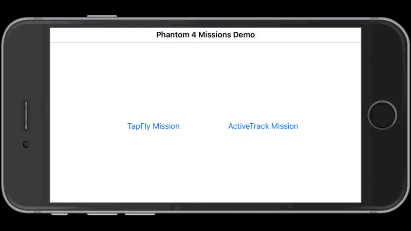

   In the animation, you can see there is a person standing there, you can touch the screen to draw a green rectangle on him. Then the rectangle will turn red and a question mark will appear to ask you for confirmation. You can tap on the rectangle to confirm it or tap outside to reject it. 

   After the confirmation, the ActiveTrack mission starts. The person walks around and the green rectangle will follow it to track its movement. This means that Phantom 4 is now tracking you automatically!
   
   Press the **X** button if you want to stop the ActiveTrack mission. By the way, you can try to switch on the "RetreatEnabled" switcher on the bottom right corner of the screen to enable the **Retreat** feature. Once you go towards the Phantom 4, it will fly backwards.

### Using the DJI Assistant 2 for Mission Testing

Since most of our developers don't have a perfect testing environment, like a big indoor space, wide backyard, etc. If we need to go outdoors and bring our latop to debug and test our application everytime, it's time consuming and not efficient. 

Luckily, we have a new DJI Assistant 2 (Includes the 3D Simulator) for you to test the mission easily on your Mac. The simulator creates a virtual 3D environment from flight data transmitted to the Mac.

You can check the [Using DJI Assistant 2 Simulator](../application-development-workflow/workflow-testing.html#DJI-Assistant-2-Simulator) for its basic usage.

Now you can connect your iPhone which is running the demo application to the remote controller, and start to test the **TapFly** and **ActiveTrack** missions on the simulator of the DJI Assistant 2.  

Moreover, another good news is you can use the DJI Bridge App to test the application directly on the iOS Simulator! If you are not familiar with the DJI Bridge App, please check the [DJI Bridge App Tutorial](./BridgeAppDemo.html). 
   
   Let's go to RootViewController.m file and add a Macro on top of the class extension part as shown below:
   
~~~objc
#define ENTER_DEBUG_MODE 1

@interface RootViewController ()<DJISDKManagerDelegate>
@property (weak, nonatomic) IBOutlet UIButton *tapFlyMissionButton;
@property (weak, nonatomic) IBOutlet UIButton *activeTrackMissionButton;
@end
~~~

  Then modify the DJISDKManagerDelegate method as shown below:
  
~~~objc
- (void)sdkManagerDidRegisterAppWithError:(NSError *)error
{
    if (error) {
        NSString* message = @"Register App Failed! Please enter your App Key and check the network.";
        [self.tapFlyMissionButton setEnabled:NO];
        [self.activeTrackMissionButton setEnabled:NO];
        [self showAlertViewWithTitle:@"Register App" withMessage:message];

    }else
    {
        NSLog(@"registerAppSuccess");
#if ENTER_DEBUG_MODE
        [DJISDKManager enterDebugModeWithDebugId:@"192.168.1.106"];
#else
        [DJISDKManager startConnectionToProduct];
#endif
    }
}
~~~

  Now, make sure your Mac and your iPhone(Running DJI Bridge App) connect to the same WiFi network, pass the **Debug ID** on the DJI Bridge App to the `enterDebugModeWithDebugId:` method. Build and run the app on the iOS Simulator with Xcode, control the remote controller to take off the aircraft in the simulator. You can start to test the **TapFly** and **ActiveTrack** mission directly on your Mac now! 
  
  Here are two screenshots of testing the two missions on your Mac:
  
  - TapFly Mission Test
  
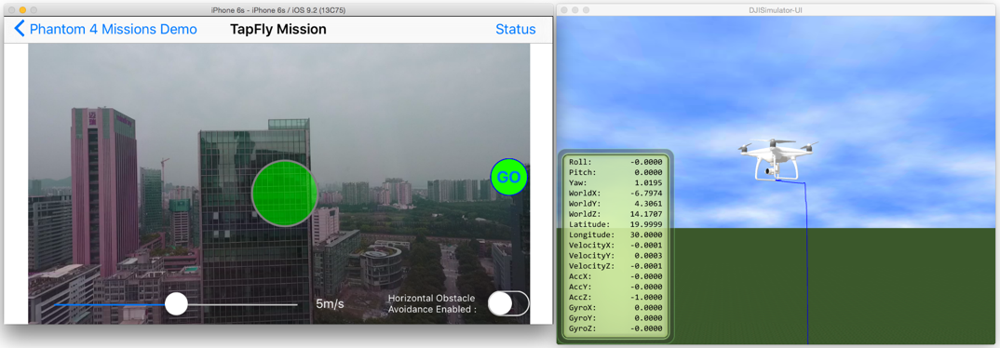
  
  - AciveTrack Mission Test

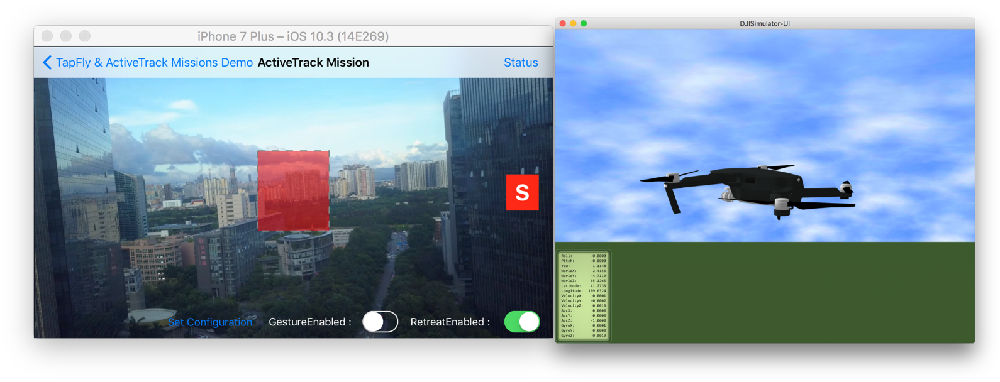

### Summary

  Congratulations! You've finished the demo project and implement the two cool **TapFly** and **ActiveTrack** missions using DJI Mobile SDK. It's easy and straightforward. You've learned how to use the DJITapFlyMission, DJIActiveTrackMission and DJIMissionManager to implement the features. Also, you know how to setup and use the simulator of DJI Assistant 2 and DJI Bridge App to test the two missions on your Mac easily. 

  But, In order to make a cool **TapFly** and **ActiveTrack** mission application, you still have a long way to go. You can add more necessary features like showing the battery percentage, GPS signal quality, add a checklist like DJI Go app to check the aircraft status before flying, etc. Good luck and hope you enjoy this tutorial!

