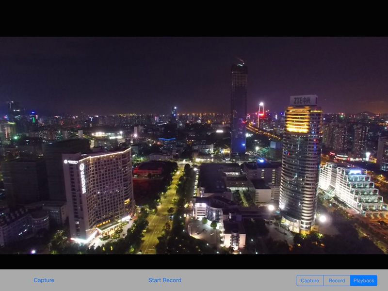
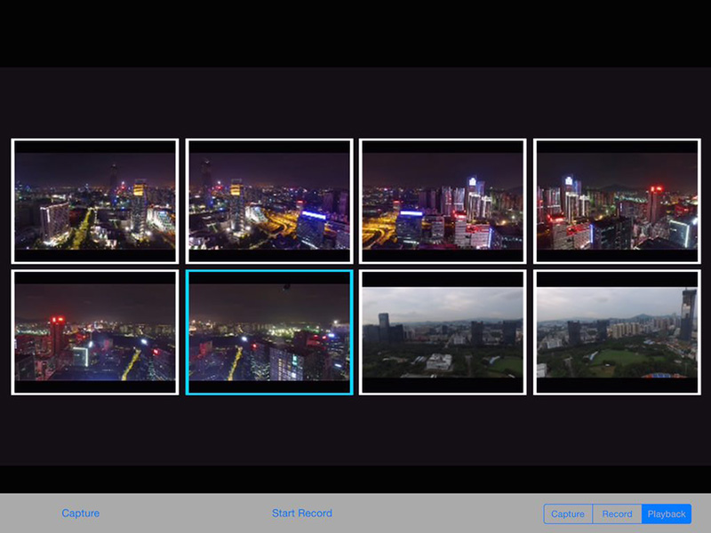
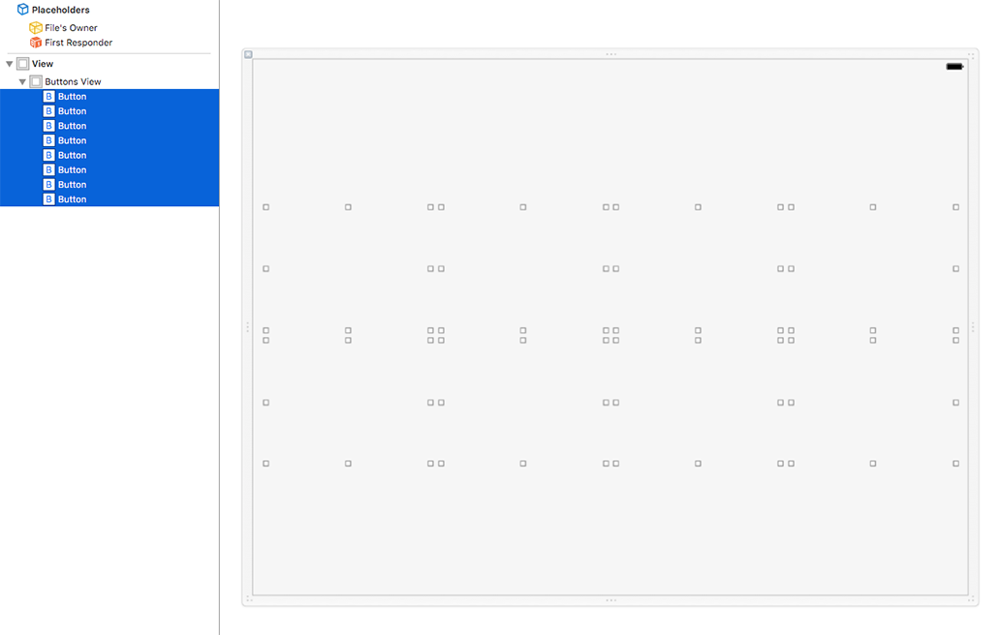
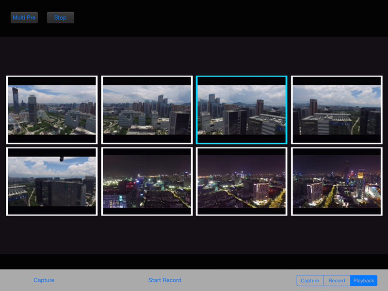
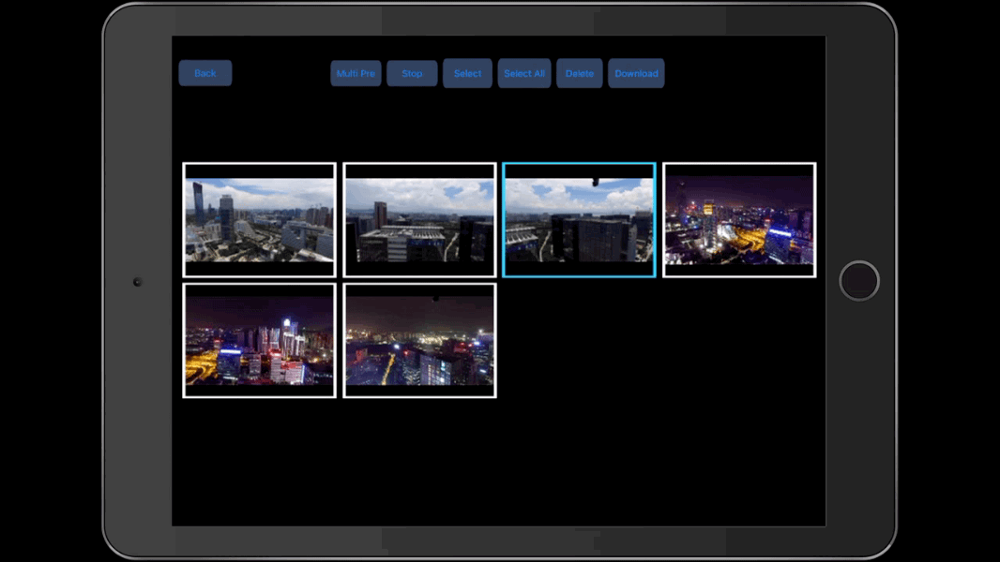

*If you come across any mistakes or bugs in this tutorial, please let us know using a Github issue, a post on the DJI forum. Please feel free to send us Github pull request and help us fix any issues.*

---

In this tutorial, you will learn how to use DJI Mobile SDK to access the media resources in the SD card of the aircraft's camera. By the end of this tutorial you will have an app that you can use to preview photos, play videos, download or delete files and so on.

In order for our app to manage photos and videos, however, it must first be able to take and record them. Fortunately, in our previous tutorial [Creating a Camera Application](./index.html) we show you how to implement **Capture** and **Record** functions. Make sure you have read through that tutorial first before embarking on this one.

You can download the tutorial's final sample code project from this [Github Page](https://github.com/DJI-Mobile-SDK-Tutorials/iOS-PlaybackDemo).

Let's get started!

## Previewing Photos and Videos

### 1. Importing the DJI SDK

Now, let's create a new project in Xcode, choose **Single View Application** template for your project and press "Next", then enter "PlaybackDemo" in the **Product Name** field and keep the other default settings.

Once the project is created, let's import the **DJISDK.framework** to it. If you are not familiar with the process of importing and activating DJI SDK, please check this tutorial: [Importing and Activating DJI SDK in Xcode Project](../application-development-workflow/workflow-integrate.html#Xcode-Project-Integration) for details.

### 2. Importing the VideoPreviewer

 You can check our previous tutorial [Creating a Camera Application](./index.html) to learn how to download and import the **VideoPreviewer** into your Xcode project.
  
### 3. Switching Playback Modes

  Now, let's open the **PlaybackDemo.xcworkspace** and delete the **ViewController.h** and **ViewController.m** files, which were created by Xcode when you created the project. Then, create a viewController named "DJIRootViewController" and set it as the **Root View Controller** in Main.storyboard. This demo and its code was written to be used with the iPad, so we'll have to adjust the User Interface of **Main.storyboard** accordingly. We'll change the **Root View Controller**'s frame. Let's set its size to **Freeform** under the **Size** dropdown in the **Simulated Metrics** section. In the view section, change the width to **1024** and height to **768**. Take a look at the changes made below:

  
  
  
Then, add a UIView inside the **Root View Controller** and set it as an IBOutlet called **fpvPreviewView**. Add two UIButtons and one UISegmentedControl at the bottom of the View Control and set their IBOutlets and IBActions. Here we set three segments in the UISegmentedControl: **Capture**, **Record** and **Playback**. Lastly, drag a UILabel to the top, horizontally center it in the view controller and hide it first.

  
  
 Once that's done, enter the **DJIRootViewController.m** file and import the **DJISDK** and **VideoPreviewer** header files. Then implement the protocols in the class extension. Next, add the two **UIButtons**, the **UISegmentedControl** and the **UILabel**'s IBOutlet properties. Add a boolean property named "isRecording" to check the record state. Lastly, add the IBAction methods for all the UI controls as below:

~~~objc
#import "DJIRootViewController.h"
#import <DJISDK/DJISDK.h>
#import <VideoPreviewer/VideoPreviewer.h>

@interface DJIRootViewController ()<DJICameraDelegate, DJISDKManagerDelegate, DJIPlaybackDelegate, DJIBaseProductDelegate, DJIVideoFeedListener>
@property (weak, nonatomic) IBOutlet UIButton *recordBtn;
@property (weak, nonatomic) IBOutlet UISegmentedControl *changeWorkModeSegmentControl;
@property (weak, nonatomic) IBOutlet UIView *fpvPreviewView;
@property (weak, nonatomic) IBOutlet UILabel *currentRecordTimeLabel;
@property (assign, nonatomic) BOOL isRecording;

- (IBAction)captureAction:(id)sender;
- (IBAction)recordAction:(id)sender;
- (IBAction)changeWorkModeAction:(id)sender;

~~~

In the viewDidAppear method, let's set the **fpvPreviewView** instance as a View of **VideoPreviewer** to show the Video Stream and reset it to nil by calling the `cleanVideoPreview` method in the viewWillDisappear method. Also, in the viewWillDisappear method, we set camera and its playbackManger property's delegate to nil. Then create a new method named "registerApp" for app registration.

~~~objc
- (void)viewDidAppear:(BOOL)animated
{
    [super viewWillAppear:animated];
    [[VideoPreviewer instance] setView:self.fpvPreviewView];
    [self registerApp];
    
}

- (void)viewWillDisappear:(BOOL)animated
{
    [super viewWillDisappear:animated];

    __weak DJICamera* camera = [self fetchCamera];
    if (camera && camera.delegate == self) {
        [camera setDelegate:nil];
    }
    if (camera && camera.playbackManager.delegate == self) {
        [camera.playbackManager setDelegate:nil];
    }
    
    [self cleanVideoPreview];
}

- (void)cleanVideoPreview {
    [[VideoPreviewer instance] setView:nil];
    [[DJISDKManager videoFeeder].primaryVideoFeed removeListener:self];
    
    if (self.fpvPreviewView != nil) {
        [self.fpvPreviewView removeFromSuperview];
        self.fpvPreviewView = nil;
    }
}

- (void)registerApp
{
    [DJISDKManager registerAppWithDelegate:self];
}

~~~

Also, implement the DJISDKManagerDelegate methods to do initial setup after register app success. Moreover, in the `productConnected` delegate method, let's fetch a camera object and set its delegate and its playbackManager property's delegate as shown below:

~~~objc

- (DJICamera*) fetchCamera {
    
    if (![DJISDKManager product]) {
        return nil;
    }
    if ([[DJISDKManager product] isKindOfClass:[DJIAircraft class]]) {
        return ((DJIAircraft*)[DJISDKManager product]).camera;
    }
    return nil;
}

#pragma mark DJISDKManagerDelegate Method

- (void)appRegisteredWithError:(NSError *)error
{
    NSString* message = @"Register App Successed!";
    if (error) {
        message = @"Register App Failed! Please enter your App Key and check the network.";

    }else
    {
        NSLog(@"registerAppSuccess");
        [DJISDKManager startConnectionToProduct];
        [[DJISDKManager videoFeeder].primaryVideoFeed addListener:self withQueue:nil];
        [[VideoPreviewer instance] start];
    }
    
    [self showAlertViewWithTitle:@"Register App" withMessage:message];
}

#pragma mark DJIBaseProductDelegate Method

- (void)productConnected:(DJIBaseProduct *)product
{
    if (product) {
        [product setDelegate:self];
        DJICamera* camera = [self fetchCamera];
        if (camera != nil) {
            camera.delegate = self;
            camera.playbackManager.delegate = self;
        }
    }
}

~~~

  Furthermore, implement the **DJIVideoFeedListener** and **DJICameraDelegate** delegate methods, as shown below:
  
~~~objc

- (NSString *)formattingSeconds:(NSUInteger)seconds
{
    NSDate *date = [NSDate dateWithTimeIntervalSince1970:seconds];
    NSDateFormatter *formatter = [[NSDateFormatter alloc] init];
    [formatter setDateFormat:@"mm:ss"];
    [formatter setTimeZone:[NSTimeZone timeZoneForSecondsFromGMT:0]];
    
    NSString *formattedTimeString = [formatter stringFromDate:date];
    return formattedTimeString;
}

#pragma mark - DJIVideoFeedListener

-(void)videoFeed:(DJIVideoFeed *)videoFeed didUpdateVideoData:(NSData *)videoData {
    [[VideoPreviewer instance] push:(uint8_t *)videoData.bytes length:(int)videoData.length];
}

#pragma mark - DJICameraDelegate

- (void)camera:(DJICamera *)camera didUpdateSystemState:(DJICameraSystemState *)systemState
{   

    //Update currentRecordTimeLabel State
    self.isRecording = systemState.isRecording;
    [self.currentRecordTimeLabel setHidden:!self.isRecording];
    [self.currentRecordTimeLabel setText:[self formattingSeconds:systemState.currentVideoRecordingTimeInSeconds]];
    
    //Update recordBtn State
    if (self.isRecording) {
        [self.recordBtn setTitle:@"Stop Record" forState:UIControlStateNormal];
    }else
    {
        [self.recordBtn setTitle:@"Start Record" forState:UIControlStateNormal];
    }
    
    //Update UISegmented Control's state
    if (systemState.mode == DJICameraModeShootPhoto) {
        [self.changeWorkModeSegmentControl setSelectedSegmentIndex:0];
    }else if (systemState.mode == DJICameraModeRecordVideo){
        [self.changeWorkModeSegmentControl setSelectedSegmentIndex:1];
    }else if (systemState.mode == DJICameraModePlayback){
        [self.changeWorkModeSegmentControl setSelectedSegmentIndex:2];
    }
}

~~~
        
  Lastly, implement the IBAction methods as shown below:
  
~~~objc
- (IBAction)captureAction:(id)sender {
    
    __weak DJICamera* camera = [self fetchCamera];
    if (camera) {
        WeakRef(target);
        [camera setShootPhotoMode:DJICameraShootPhotoModeSingle withCompletion:^(NSError * _Nullable error) {
            dispatch_after(dispatch_time(DISPATCH_TIME_NOW, (int64_t)(1 * NSEC_PER_SEC)), dispatch_get_main_queue(), ^{
                [camera startShootPhotoWithCompletion:^(NSError * _Nullable error) {
                    WeakReturn(target);
                    if (error) {
                        UIAlertView *errorAlert = [[UIAlertView alloc] initWithTitle:@"Take Photo Error" message:error.description delegate:target cancelButtonTitle:@"OK" otherButtonTitles:nil];
                        [errorAlert show];
                    }
                }];
            });
        }];
    }
}

- (IBAction)recordAction:(id)sender {
    
    __weak DJICamera *camera = [self fetchCamera];
    if (camera) {
        WeakRef(target);
        if (self.isRecording) {
            [camera stopRecordVideoWithCompletion:^(NSError * _Nullable error) {
                WeakReturn(target);
                if (error) {
                    UIAlertView *errorAlert = [[UIAlertView alloc] initWithTitle:@"Stop Record Error" message:error.description delegate:target cancelButtonTitle:@"OK" otherButtonTitles:nil];
                    [errorAlert show];
                }
                
            }];
            
        }else
        {
            [camera startRecordVideoWithCompletion:^(NSError * _Nullable error) {
                WeakReturn(target);
                if (error) {
                    UIAlertView *errorAlert = [[UIAlertView alloc] initWithTitle:@"Start Record Error" message:error.description delegate:target cancelButtonTitle:@"OK" otherButtonTitles:nil];
                    [errorAlert show];
                }
            }];
            
        }
    }
    
}

- (IBAction)changeWorkModeAction:(id)sender {
    
    __weak DJICamera *camera = [self fetchCamera];

    if (camera == nil) {
        return;
    }
    WeakRef(target);
    UISegmentedControl *segmentControl = (UISegmentedControl *)sender;
    if (segmentControl.selectedSegmentIndex == 0) { //CaptureMode
        
        [camera setMode:DJICameraModeShootPhoto withCompletion:^(NSError * _Nullable error) {
            WeakReturn(target);
            
            if (!self.playVideoBtn.hidden) {
                [target.playVideoBtn setHidden:YES];
            }
            
            if (error) {
                UIAlertView *errorAlert = [[UIAlertView alloc] initWithTitle:@"Set CameraWorkModeCapture Failed" message:error.description delegate:target cancelButtonTitle:@"OK" otherButtonTitles:nil];
                [errorAlert show];
            }
            
        }];
        
    }else if (segmentControl.selectedSegmentIndex == 1){ //RecordMode
        
        [camera setMode:DJICameraModeRecordVideo withCompletion:^(NSError * _Nullable error) {
            WeakReturn(target);
            
            if (!self.playVideoBtn.hidden) {
                [target.playVideoBtn setHidden:YES];
            }

            if (error) {
                UIAlertView *errorAlert = [[UIAlertView alloc] initWithTitle:@"Set CameraWorkModeRecord Failed" message:error.description delegate:target cancelButtonTitle:@"OK" otherButtonTitles:nil];
                [errorAlert show];
            }
        }];
        
    }else if (segmentControl.selectedSegmentIndex == 2){  //PlaybackMode
        
        [camera setMode:DJICameraModePlayback withCompletion:^(NSError * _Nullable error) {
            WeakReturn(target);
            if (error) {
                UIAlertView *errorAlert = [[UIAlertView alloc] initWithTitle:@"Set CameraWorkModePlayback Failed" message:error.description delegate:target cancelButtonTitle:@"OK" otherButtonTitles:nil];
                [errorAlert show];
            }
        }];
    }
}

~~~

  As you can see, we have implemented the **Playback** work mode method, just call the **setMode** method of the **DJICamera** class and pass the **DJICameraModePlayback** value to it. Show an alertView in case there is any error.
   
  For now, build and run the project in Xcode. You might got a warning of not implementing the **DJIPlaybackDelegate** method, please ignore it for now, we will implement it in the next part. 

  Try to use the **Capture** and **Record** feature to take photos and record videos. Then switch the **Camera Mode** by tapping on the UISegmentControl, switch to **Playback** mode to see if you can see the last photo you took or the last video you recorded. Here is a screenshot of what your playback mode should look like:
  
 
  
### 4. Previewing Single Files

We can switch to the **Playback** mode now. Let's add two **UISwipeGestureRecognizer**s to preview the previous and the next media files in the SD Card.

Open the **DJIRootViewController.m** file, create two properties of **UISwipeGestureRecognizer** and name them **swipeLeftGesture** and **swipeRightGesture** in the class extension. Then initialize them in the **initData** method as follows:

~~~objc

- (void)viewDidLoad {
    [super viewDidLoad];    
    [self initData];
}

- (void)initData
{
    
    self.swipeLeftGesture = [[UISwipeGestureRecognizer alloc] initWithTarget:self action:@selector(swipeLeftGestureAction:)];
    self.swipeLeftGesture.direction = UISwipeGestureRecognizerDirectionLeft;
    self.swipeRightGesture = [[UISwipeGestureRecognizer alloc] initWithTarget:self action:@selector(swipeRightGestureAction:)];
    self.swipeRightGesture.direction = UISwipeGestureRecognizerDirectionRight;

    [self.view addGestureRecognizer:self.swipeLeftGesture];
    [self.view addGestureRecognizer:self.swipeRightGesture];
}

~~~

Implement the gesture action selector methods:

~~~objc 
- (void)swipeLeftGestureAction:(UISwipeGestureRecognizer *)gesture
{
     __weak DJICamera* camera = [self fetchCamera];
     [camera.playbackManager goToNextSinglePreviewPage];
}

- (void)swipeRightGestureAction:(UISwipeGestureRecognizer *)gesture
{
     __weak DJICamera* camera = [self fetchCamera];
     [camera.playbackManager goToPreviousSinglePreviewPage];
}
~~~

The above code uses the **goToNextSinglePreviewPage** and **goToPreviousSinglePreviewPage** methods of DJICamera's playbackManager to preview the next and previous files. Since there are two types of the media files in the SD Card, **Photo** and **Video**, we'll have to implement video playback feature as well.

Open **Main.storyboard**, drag a UIView object and position it on the top of the viewController, then drag a UIButton to the view you just added as subview and named **Stop**. Next, drag a UIButton object to the center of the viewController, set its image as "playVideo"(You can get this image file from the project source code, in the Images.xcassets folder).

 
 
 Here we hide the **Stop** and the **playVideo** buttons. Now let's go to **DJIRootViewController.m** and create IBOutlets and IBActions for the newly added UIs:
 
~~~objc
@property (nonatomic, strong) IBOutlet UIView* playbackBtnsView;
@property (weak, nonatomic) IBOutlet UIButton *playVideoBtn;

- (IBAction)playVideoBtnAction:(id)sender;
- (IBAction)stopVideoBtnAction:(id)sender; 
~~~

Moreover, before implementing the IBAction methods, we'll add two new properties of the DJICameraSystemState class and the DJICameraPlaybackState class and named them as **cameraSystemState** and **cameraPlaybackState** respectively in the class extension as shown below:

~~~objc
@property (strong, nonatomic) DJICameraSystemState* cameraSystemState;
@property (strong, nonatomic) DJICameraPlaybackState* cameraPlaybackState;
~~~

These properties are used to save the current camera system state and the playback state. Let's update the **cameraSystemState** property value and hide the **playbackBtnsView** based on **DJICameraSystemState**'s mode in the `- (void)camera:(DJICamera *)camera didUpdateSystemState:(DJICameraSystemState *)systemState` delegate method:

~~~objc
-(void) camera:(DJICamera*)camera didUpdateSystemState:(DJICameraSystemState*)systemState
{
    self.cameraSystemState = systemState; //Update camera system state

    //Update currentRecordTimeLabel State
    self.isRecording = systemState.isRecording;
    [self.currentRecordTimeLabel setHidden:!self.isRecording];
    [self.currentRecordTimeLabel setText:[self formattingSeconds:systemState.currentVideoRecordingTimeInSeconds]];
    
    //Update playbackBtnsView state
    BOOL isPlayback = (systemState.mode == DJICameraModePlayback) || (systemState.mode == DJICameraModeMediaDownload);
    self.playbackBtnsView.hidden = !isPlayback;
    
    //Update recordBtn State
    if (self.isRecording) {
        [self.recordBtn setTitle:@"Stop Record" forState:UIControlStateNormal];
    }else
    {
        [self.recordBtn setTitle:@"Start Record" forState:UIControlStateNormal];
    }
    
    //Update UISegmented Control's state
    if (systemState.mode == DJICameraModeShootPhoto) {
        [self.changeWorkModeSegmentControl setSelectedSegmentIndex:0];
    }else if (systemState.mode == DJICameraModeRecordVideo){
        [self.changeWorkModeSegmentControl setSelectedSegmentIndex:1];
    }else if (systemState.mode == DJICameraModePlayback){
        [self.changeWorkModeSegmentControl setSelectedSegmentIndex:2];
    }
}
~~~

Additionally, implement the `- (void)playbackManager:(DJIPlaybackManager *)playbackManager didUpdatePlaybackState:(DJICameraPlaybackState *)playbackState` delegate method as shown below:

~~~objc
- (void)playbackManager:(DJIPlaybackManager *)playbackManager didUpdatePlaybackState:(DJICameraPlaybackState *)playbackState
{
    self.cameraPlaybackState = playbackState;
    [self updateUIWithPlaybackState:playbackState];
}

- (void)updateUIWithPlaybackState:(DJICameraPlaybackState *)playbackState
{
    if (playbackState.playbackMode == DJICameraPlaybackModeSingleFilePreview) {
        if (playbackState.fileType == DJICameraPlaybackFileTypeJPEG || playbackState.fileType == DJICameraPlaybackFileTypeRAWDNG) { //Photo Type            
            if (!self.playVideoBtn.hidden) {
                [self.playVideoBtn setHidden:YES];
            }
        }else if (playbackState.fileType == DJICameraPlaybackFileTypeVIDEO) //Video Type
        {
            if (self.playVideoBtn.hidden) {
                [self.playVideoBtn setHidden:NO];
            }
        }
    }else if (playbackState.playbackMode == DJICameraPlaybackModeSingleVideoPlaybackStart)                
    { //Playing Video
        [self.playVideoBtn setHidden:YES];
    }else if (playbackState.playbackMode == DJICameraPlaybackModeMultipleFilesPreview){
        [self.playVideoBtn setHidden:YES];
    }
}
~~~

As you can see, we have updated the **cameraPlaybackState** property's value in the `- (void)playbackManager:(DJIPlaybackManager *)playbackManager didUpdatePlaybackState:(DJICameraPlaybackState *)playbackState` delegate method, and have also updated the **playVideoBtn**'s hidden state based on the DJICameraSystemState's **mode** and the DJICameraPlaybackState's **playbackMode**.

Finally, we can implement the **IBAction** methods as follows:

~~~objc
- (IBAction)playVideoBtnAction:(id)sender {
    __weak DJICamera *camera = [self fetchCamera];
    if (self.cameraPlaybackState.fileType == DJICameraPlaybackFileTypeVIDEO) {
        [camera.playbackManager playVideo];
    }
}

- (IBAction)stopVideoBtnAction:(id)sender {
    __weak DJICamera *camera = [self fetchCamera];
    if (self.cameraPlaybackState.fileType == DJICameraPlaybackFileTypeVIDEO) {
        if (self.cameraPlaybackState.videoPlayProgress > 0) {
            [camera.playbackManager stopVideo];
        }
    }
}
~~~

In the **playVideoBtnAction** and **stopVideoBtnAction** methods, we check if the media type is video, then call the **playVideo** and the **stopVideo** methods of the **DJICamera**'s playbackManager to start and stop playing the video. 

Once it's done, build and run the project. Try swiping left and right in playbackMode to navigate through your photos and videos. If you see the play button at the center of the screen, press it to play the video.

Playing your video through the playback app:

 

### 5. Previewing Multiple Files

Before we move forward, let's explain the **Playback mode**. There are multiple playback modes in the camera, and we can check the **DJICameraPlaybackMode** enum type in the **DJICameraPlaybackState.h** file as follows:

~~~objc
/**
 *  A playback mode represents a task that the Playback manager is executing.
 */
typedef NS_ENUM (uint8_t, DJICameraPlaybackMode){
    /**
     *  Single file preview mode.
     */
    DJICameraPlaybackModeSingleFilePreview = 0,
    /**
     *  Single video playback start.
     */
    DJICameraPlaybackModeSingleVideoPlaybackStart = 2,
    /**
     *  Single video playback pause.
     */
    DJICameraPlaybackModeSingleVideoPlaybackPause = 3,
    /**
     *  Multiple file edit.
     */
    DJICameraPlaybackModeMultipleFilesEdit = 4,
    /**
     *  Multiple media file preview.
     */
    DJICameraPlaybackModeMultipleFilesPreview = 5,
    /**
     *  Download media files.
     */
    DJICameraPlaybackModeDownload = 6,
    /**
     *  Unknown playback mode.
     */
    DJICameraPlaybackModeUnknown = 0xFF,
};
~~~

As shown in the code above, we can preview files in two ways: **Single Preview** and **Multiple Preview**. We can also play videos, delete photos and videos and even download them. 

We will learn how to preview multiple files here. Here is what **Multiple Preview** looks like:

 
 
You can preview at most eight files at the same time. Since the preview images are shown in the **fpvPreviewView**, you cannot interact with them yet. Let's add buttons and swipe gestures to interact with them.

First, we will create a new file named "DJIPlaybackMultiSelectViewController", which will be a subclass of UIViewController. Make sure the check box for **Also create XIB file** is selected when creating the file. Then open the DJIPlaybackMultiSelectViewController.xib file and, under the **Size** dropdown in the **Simulated Metrics** section, set its size to **Freeform** . In the view section, change the width to "1024" and height to "768". Take a look at the changes made below:

  
  
  
Then drag a **UIView** object to the viewController as subview and set its name to **Buttons View**. Next set its frame as follows:

  
  
Moreover, drag eight **UIButton** objects to the **Buttons View** as subviews and position them as follows(You can check the demo project's **DJIPlaybackMultiSelectViewController.xib** file to get the details on how to setup these buttons's frame):

  

These buttons represent eight media files when you are in the **Multiple Preview Mode**. Pressing any of these buttons will enter **Single Preview Mode**. 

Now let's open the **DJIPlaybackMultiSelectViewController.h** file and create two block properties as follows:

~~~objc
#import <UIKit/UIKit.h>

@interface DJIPlaybackMultiSelectViewController : UIViewController

@property (copy, nonatomic) void (^selectItemBtnAction)(int index);
@property (copy, nonatomic) void (^swipeGestureAction)(UISwipeGestureRecognizerDirection direction);

@end
~~~

The first block is used to check the selected button action with index, the second one is used to check the swipe gesture action.

Then go to DJIPlaybackMultiSelectViewController.m file and create four UISwipeGestureRecognizer properties to represent the **left**, **right**, **up** and **down** swipe gestures. Additionally, create eight IBAction methods and link them to the UIButton objects in the DJIPlaybackMultiSelectViewController.xib file:

~~~objc
#import "DJIPlaybackMultiSelectViewController.h"

@interface DJIPlaybackMultiSelectViewController()

@property(nonatomic, strong) UISwipeGestureRecognizer *swipeLeftGesture;
@property(nonatomic, strong) UISwipeGestureRecognizer *swipeRightGesture;
@property(nonatomic, strong) UISwipeGestureRecognizer *swipeUpGesture;
@property(nonatomic, strong) UISwipeGestureRecognizer *swipeDownGesture;

- (IBAction)selectFirstItemBtnAction:(id)sender;
- (IBAction)selectSecondItemBtnAction:(id)sender;
- (IBAction)selectThirdItemBtnAction:(id)sender;
- (IBAction)selectFourthItemBtnAction:(id)sender;
- (IBAction)selectFifthItemBtnAction:(id)sender;
- (IBAction)selectSixthItemBtnAction:(id)sender;
- (IBAction)selectSeventhItemBtnAction:(id)sender;
- (IBAction)selectEighthItemBtnAction:(id)sender;

@end
~~~

Init the swipe gestures properties in the viewDidLoad method and implement the action methods as shown below:

~~~objc
- (void)viewDidLoad {
    [super viewDidLoad];

    self.swipeLeftGesture = [[UISwipeGestureRecognizer alloc] initWithTarget:self action:@selector(swipeLeftGestureAction:)];
    self.swipeLeftGesture.direction = UISwipeGestureRecognizerDirectionLeft;
    self.swipeRightGesture = [[UISwipeGestureRecognizer alloc] initWithTarget:self action:@selector(swipeRightGestureAction:)];
    self.swipeRightGesture.direction = UISwipeGestureRecognizerDirectionRight;
    self.swipeUpGesture = [[UISwipeGestureRecognizer alloc] initWithTarget:self action:@selector(swipeUpGestureAction:)];
    self.swipeUpGesture.direction = UISwipeGestureRecognizerDirectionUp;
    self.swipeDownGesture = [[UISwipeGestureRecognizer alloc] initWithTarget:self action:@selector(swipeDownGestureAction:)];
    self.swipeDownGesture.direction = UISwipeGestureRecognizerDirectionDown;
    
    [self.view addGestureRecognizer:self.swipeLeftGesture];
    [self.view addGestureRecognizer:self.swipeRightGesture];
    [self.view addGestureRecognizer:self.swipeUpGesture];
    [self.view addGestureRecognizer:self.swipeDownGesture];

}

#pragma mark UIGestureAction Methods
- (void)swipeLeftGestureAction:(UISwipeGestureRecognizer *)gesture
{
    if (self.swipeGestureAction) {
        self.swipeGestureAction(UISwipeGestureRecognizerDirectionLeft);
    }
}

- (void)swipeRightGestureAction:(UISwipeGestureRecognizer *)gesture
{
    if (self.swipeGestureAction) {
        self.swipeGestureAction(UISwipeGestureRecognizerDirectionRight);
    }
}

- (void)swipeUpGestureAction:(UISwipeGestureRecognizer *)gesture
{
    if (self.swipeGestureAction) {
        self.swipeGestureAction(UISwipeGestureRecognizerDirectionUp);
    }
}

- (void)swipeDownGestureAction:(UISwipeGestureRecognizer *)gesture
{
    if (self.swipeGestureAction) {
        self.swipeGestureAction(UISwipeGestureRecognizerDirectionDown);
    }
}

~~~

These four swipe gestures are for single and multiple files preview. Swipe left or right to preview files in **Single Preview Mode**, swipe up or down to preview files in **Multiple Preview Mode**. We invoke the **swipeGestureAction** block inside the swipe action method with a **UISwipeGestureRecognizerDirection** value.

Next, implement the IBAction methods for the eight UIButtons as follows:

~~~objc
#pragma mark UIButton Action Methods
- (IBAction)selectFirstItemBtnAction:(id)sender {
    if (self.selectItemBtnAction) {
        self.selectItemBtnAction(0);
    }
}

- (IBAction)selectSecondItemBtnAction:(id)sender {
    if (self.selectItemBtnAction) {
        self.selectItemBtnAction(1);
    }
}

- (IBAction)selectThirdItemBtnAction:(id)sender {
    if (self.selectItemBtnAction) {
        self.selectItemBtnAction(2);
    }
}

- (IBAction)selectFourthItemBtnAction:(id)sender {
    if (self.selectItemBtnAction) {
        self.selectItemBtnAction(3);
    }
}

- (IBAction)selectFifthItemBtnAction:(id)sender {
    if (self.selectItemBtnAction) {
        self.selectItemBtnAction(4);
    }
}

- (IBAction)selectSixthItemBtnAction:(id)sender {
    if (self.selectItemBtnAction) {
        self.selectItemBtnAction(5);
    }
}

- (IBAction)selectSeventhItemBtnAction:(id)sender {
    if (self.selectItemBtnAction) {
        self.selectItemBtnAction(6);
    }
}

- (IBAction)selectEighthItemBtnAction:(id)sender {
    if (self.selectItemBtnAction) {
        self.selectItemBtnAction(7);
    }
}
~~~

We invoke the **selectItemBtnAction** block inside the IBAction methods with related button index. The index starts from 0 here because the file index counted in Playback Multiple Preview Mode starts from 0.

Now, go back to **DJIRootViewController.m** file. Since we have added the swipe left and swipe right gestures in the DJIPlaybackMultiSelectViewController.m file, let's delete the **swipeLeftGesture** and **swipeRightGesture** properties and their related codes in the DJIRootViewController.m file to refactor the code structure. 

Then import the DJIPlaybackMultiSelectViewController.h header file and create a property of DJIPlaybackMultiSelectViewController named **playbackMultiSelectVC**. Next, we create a new method named **initPlaybackMultiSelectVC** and implement it in the **viewDidLoad** method:

~~~objc
- (void)viewDidLoad {
    [super viewDidLoad];

    [self initData];
    [self initPlaybackMultiSelectVC];

}

- (void)initPlaybackMultiSelectVC
{
    self.playbackMultiSelectVC = [[DJIPlaybackMultiSelectViewController alloc] initWithNibName:@"DJIPlaybackMultiSelectViewController" bundle:[NSBundle mainBundle]];
    [self.playbackMultiSelectVC.view setFrame:self.view.frame];
    [self.view insertSubview:self.playbackMultiSelectVC.view aboveSubview:self.fpvPreviewView];
    
    WeakRef(target);
    [self.playbackMultiSelectVC setSelectItemBtnAction:^(int index) {
    
        WeakReturn(target);
        __weak DJICamera* camera = [target fetchCamera];
        if (target.cameraPlaybackState.playbackMode == DJICameraPlaybackModeMultipleFilesPreview) {
            [camera.playbackManager enterSinglePreviewModeWithIndex:index];
        }else if (target.cameraPlaybackState.playbackMode == DJICameraPlaybackModeMultipleFilesEdit){
            [camera.playbackManager toggleFileSelectionAtIndex:index];
        }
    }];
    
    [self.playbackMultiSelectVC setSwipeGestureAction:^(UISwipeGestureRecognizerDirection direction) {
        
        WeakReturn(target);
        __weak DJICamera* camera = [target fetchCamera];

        if (target.cameraPlaybackState.playbackMode == DJICameraPlaybackModeSingleFilePreview) {
            
            if (direction == UISwipeGestureRecognizerDirectionLeft) {
                [camera.playbackManager goToNextSinglePreviewPage];
            }else if (direction == UISwipeGestureRecognizerDirectionRight){
                [camera.playbackManager goToPreviousSinglePreviewPage];
            }
            
        }else if(target.cameraPlaybackState.playbackMode == DJICameraPlaybackModeMultipleFilesPreview){
            
            if (direction == UISwipeGestureRecognizerDirectionUp) {
                [camera.playbackManager goToNextMultiplePreviewPage];
            }else if (direction == UISwipeGestureRecognizerDirectionDown){
                [camera.playbackManager goToPreviousMultiplePreviewPage];
            }
        }
    }];
}
~~~

So in the **initPlaybackMultiSelectVC** method, we init the **playbackMultiSelectVC** property first, and then we invoke the **selectItemBtnAction** block's setter method and implement the **toggleFileSelectionAtIndex** method of the **DJICamera**'s playbackManager with selected index. This way, we can switch to Single Preview Mode from Multiple Preview Mode. 

Furthermore, we invoke the **swipeGestureAction** block's setter method and implement the preview files feature based on the **UISwipeGestureRecognizerDirection** value.

Once this is done, go to **Main.storyboard** and drag a **UIButton** object to the **playbackBtnsView** as subView, naming it as **Multi Pre** and positioning it as follows:

Finally, create an IBAction method named **multiPreviewButtonClicked** and link it to the above UIButton in the **Main.storyboard**. Implement the method as shown below to enter Multiple Preview Mode:

~~~objc
- (IBAction)multiPreviewButtonClicked:(id)sender {

    __weak DJICamera *camera = [self fetchCamera];
    [camera.playbackManager enterMultiplePreviewMode];
    
}
~~~

Let's build and run the project and try to enter Multiple Preview Mode. Use the swipe up and down gestures to preview files. Switch to the Single Preview Mode by pressing any of the eight preview images. Here is a screenshot:

## Deleting Photos and Videos

You can now preview photos and videos in Single Preview Mode and Multiple Preview Mode. But what if you want to delete a file you don't like? Let's implement the delete files feature!

Go to Main.storyboard and drag three UIButtons to the **playbackBtnsView** as subviews and named them **Select**, **Select All** and **Delete**. We hide the "Select" and "Select All" buttons here. Then go to the **DJIRootViewController.m** file and create two IBOutlets for the "Select" and "Select All" buttons, and also the three IBAction methods for the three buttons as follows:

~~~objc
@property (weak, nonatomic) IBOutlet UIButton *selectBtn;
@property (weak, nonatomic) IBOutlet UIButton *selectAllBtn;

- (IBAction)selectButtonAction:(id)sender;
- (IBAction)deleteButtonAction:(id)sender;
- (IBAction)selectAllBtnAction:(id)sender;
~~~

Next, implement the IBAction methods as shown below:

~~~objc
- (IBAction)selectButtonAction:(id)sender {
    __weak DJICamera *camera = [self fetchCamera];
    if (self.cameraPlaybackState.playbackMode == DJICameraPlaybackModeMultipleFilesEdit) {
        [camera.playbackManager exitMultipleEditMode];
    }else
    {
        [camera.playbackManager enterMultipleEditMode];
    }
}

- (IBAction)selectAllBtnAction:(id)sender {
    __weak DJICamera *camera = [self fetchCamera];
    if (self.cameraPlaybackState.isAllFilesInPageSelected) {
        [camera.playbackManager unselectAllFilesInPage];
    }
    else
    {
        [camera.playbackManager selectAllFilesInPage];
    }
}
~~~

The above code implements the selectButtonAction method to enter and exit MultipleEditMode by calling the **exitMultipleEditMode** and **enterMultipleEditMode** methods of DJICamera's playbackManager. Then in selectAllBtnAction IBAction method, we use an if statement to check if all the files in the page are selected and invoke the **selectAllFilesInPage** and **unselectAllFilesInPage** methods of DJICamera's playbackManager.

Moreover, update the **selectBtn** and **selectAllBtn** buttons' hidden values in the following method:

~~~objc

- (void)updateUIWithPlaybackState:(DJICameraPlaybackState *)playbackState
{
    if (playbackState.playbackMode == DJICameraPlaybackModeSingleFilePreview) {

        [self.selectBtn setHidden:YES];
        [self.selectAllBtn setHidden:YES];

        if (playbackState.fileType == DJICameraPlaybackFileTypeJPEG || playbackState.fileType == DJICameraPlaybackFileTypeRAWDNG) { //Photo Type

        if (!self.playVideoBtn.hidden) {
            [self.playVideoBtn setHidden:YES];
        }
    
        }else if (playbackState.fileType == DJICameraPlaybackFileTypeVIDEO) //Video Type    {
            if (self.playVideoBtn.hidden) {
                [self.playVideoBtn setHidden:NO];
            }
        }

     }else if (playbackState.playbackMode == DJICameraPlaybackModeSingleVideoPlaybackStart){ //Playing Video

        [self.selectBtn setHidden:YES];
        [self.selectAllBtn setHidden:YES];
        [self.playVideoBtn setHidden:YES];

     }else if (playbackState.playbackMode == DJICameraPlaybackModeMultipleFilesPreview){

        [self.selectBtn setHidden:NO];
        [self.selectBtn setTitle:@"Select" forState:UIControlStateNormal];
        [self.selectAllBtn setHidden:NO];
        [self.playVideoBtn setHidden:YES];

     }else if (playbackState.playbackMode == DJICameraPlaybackModeMultipleFilesEdit){

        [self.selectBtn setHidden:NO];
        [self.selectBtn setTitle:@"Cancel" forState:UIControlStateNormal];
        [self.selectAllBtn setHidden:NO];
        [self.playVideoBtn setHidden:YES];
        
     }   
}

~~~

Before implementing the **deleteButtonAction** method, let's create two new properties in the class extension as follows:

~~~objc
@property (strong, nonatomic) UIAlertView* statusAlertView;
@property (assign, nonatomic) int selectedFileCount;
~~~

Here, we create an **int** property named **selectedFileCount** to count the number of files currently selected in the Multiple Preview Mode. We also create a **UIAlertView** property named as **statusAlertView** to show alerts when deleting files.

Create the following three methods to **show**, **dismiss** and **update** the alertView:

~~~objc
-(void) showStatusAlertView
{
    if (self.statusAlertView == nil) {
        self.statusAlertView = [[UIAlertView alloc] initWithTitle:@"" message:@"" delegate:nil cancelButtonTitle:nil otherButtonTitles:nil];
        [self.statusAlertView show];
    }
}

-(void) dismissStatusAlertView
{
    if (self.statusAlertView) {
        [self.statusAlertView dismissWithClickedButtonIndex:0 animated:YES];
        self.statusAlertView = nil;
    }       
}

- (void)updateStatusAlertContentWithTitle:(NSString *)title message:(NSString *)message shouldDismissAfterDelay:(BOOL)dismiss
{
    if (self.statusAlertView) {
        [self.statusAlertView setTitle:title];
        [self.statusAlertView setMessage:message];
        
        if (dismiss) {
            [self performSelector:@selector(dismissStatusAlertView) withObject:nil afterDelay:2.0];
        }
    }   
}
~~~

Furthermore, implement the **deleteButtonAction** action method as shown below:

~~~objc
- (IBAction)deleteButtonAction:(id)sender {
    
    self.selectedFileCount = self.cameraPlaybackState.selectedFileCount;
    
    if (self.cameraPlaybackState.playbackMode == DJICameraPlaybackModeMultipleFilesEdit) {

        if (self.selectedFileCount == 0) {
            [self showStatusAlertView];
            [self updateStatusAlertContentWithTitle:@"Please select files to delete!" message:@"" shouldDismissAfterDelay:YES];
            return;
        }else
        {
            NSString *title;
            if (self.selectedFileCount == 1) {
                title = @"Delete Selected File?";
            }else
            {
                title = @"Delete Selected Files?";
            }
            UIAlertView *deleteAllSelFilesAlert = [[UIAlertView alloc] initWithTitle:title message:@"" delegate:self cancelButtonTitle:@"NO" otherButtonTitles:@"YES", nil];
            deleteAllSelFilesAlert.tag = kDeleteAllSelFileAlertTag;
            [deleteAllSelFilesAlert show];
        }

    }else if (self.cameraPlaybackState.playbackMode == DJICameraPlaybackModeSingleFilePreview){
        
        UIAlertView *deleteCurrentFileAlert = [[UIAlertView alloc] initWithTitle:@"Delete The Current File?" message:@"" delegate:self cancelButtonTitle:@"NO" otherButtonTitles:@"YES", nil];
        deleteCurrentFileAlert.tag = kDeleteCurrentFileAlertTag;
        [deleteCurrentFileAlert show];   
    }
    
}
~~~

The above code updates the **selectedFileCount** property value with **cameraPlaybackState**'s "selectedFileCount" value. It then checks the **playbackMode** value of cameraPlaybackState to show alertViews in the "DJICameraPlaybackModeMultipleFilesEdit" and "DJICameraPlaybackModeSingleFilePreview" mode. Here we use macro definition for the UIAlertView's tag property:

~~~objc
#define kDeleteAllSelFileAlertTag 100
#define kDeleteCurrentFileAlertTag 101
~~~

Finally, let's implement the UIAlertView delegate method as follows to call the **deleteAllSelectedFiles** and **deleteCurrentPreviewFile** methods of DJICamera's playbackManager to delete files and update selectBtn's title:

~~~objc 
#pragma mark UIAlertView Delegate Method
- (void)alertView:(UIAlertView *)alertView clickedButtonAtIndex:(NSInteger)buttonIndex
{
    if (alertView.tag == kDeleteAllSelFileAlertTag) {
        if (buttonIndex == 1) {
            [self.camera deleteAllSelectedFiles];
            [self.selectBtn setTitle:@"Select" forState:UIControlStateNormal];
        }
    }else if (alertView.tag == kDeleteCurrentFileAlertTag){
        if (buttonIndex == 1) {
            [self.camera deleteCurrentPreviewFile];
            [self.selectBtn setTitle:@"Select" forState:UIControlStateNormal];
        }   
    }
}
~~~

Build and run the project, and try the select multiple files, delete single and multiple files features. Here's what it should look like:

* Deleting a Single File:

* Deleting Multiple Files:

## Downloading And Saving Photos

### 1. Downloading Photos

Let's implement the download photo feature now. First, go to the **Main.storyboard** file and drag a **UIButton** object to the **playbackBtnsView** and name it "Download". Then position it as shown below:

Then go to **DJIRootViewController.m** file and create the following property objects and IBAction methods in the class extension:

~~~objc
@property (strong, nonatomic) NSMutableData *downloadedImageData;
@property (strong, nonatomic) NSTimer *updateImageDownloadTimer;
@property (strong, nonatomic) NSError *downloadImageError;
@property (strong, nonatomic) NSString* targetFileName;
@property (assign, nonatomic) long totalFileSize;
@property (assign, nonatomic) long currentDownloadSize;
@property (assign, nonatomic) int downloadedFileCount;

- (IBAction)downloadButtonAction:(id)sender;
~~~

Lets briefly explain what each of these properties is for.

- **downloadedImageData** is used to store the downloaded image's **NSData**
- **updateImageDownloadTimer** is used to update the download progress status
- **downloadImageError** is for NSError storage
- **targetFileName** is used to store the current downloaded image file name
- **totalFileSize** is for storing the total file size of each downloading image
- **currentDownloadSize** is used to store the downloaded size of the image
- **downloadedFileCount** is used to store the downloaded file count

Let's init the **downloadedImageData** property in the **initData** method as follows:

~~~objc
- (void)initData
{
    self.downloadedImageData = [NSMutableData data];
}
~~~

Before moving forward, we need to first explain the following method in **DJICamera** class:

~~~objc
/**
 *  Downloads the selected files. When this method is called. The dataBlock gets called continuously until all the data is downloaded.
 *  The prepare and completion blocks are called once for each file being downloaded. In the prepareBlock, you can get the forthcoming file's info, like file name, file size, etc.
 *
 *  If an error occurs before the downloading of any files, only the overallCompletionBlock will be called with an error returned.
 *  If an error occurs during the downloading of a file, both dataBlock and overallCompletionBlock will be called with an error returned.
 *
 *  @param prepareBlock         Callback to prepare each file for download.
 *  @param dataBlock            Callback while a file is downloading. The dataBlock can be called multiple times for a file.
 *  @param fileCompletionBlock  Callback after each file have been downloaded.
 *  @param finishBlock          Callback after the downloading is finished.
 */
- (void)downloadSelectedFilesWithPreparation:(DJIFileDownloadPreparingBlock)prepareBlock process:(DJIFileDownloadingBlock)dataBlock fileCompletion:(DJIFileDownloadCompletionBlock)fileCompletionBlock overallCompletion:(DJICompletionBlock)overallCompletionBlock;
~~~

This method has three params, the first param **prepareBlock** is a file download preparing block. You can do some download initialization work here like showing an alertView to clarify the download file's file name, file size, etc. The second param **dataBlock** is a download data update block, you can append the downloaded data here and increase the downloaded size data. The third param **fileCompletionBlock** is a file download completion block, you can save the current downloaded image to the Photo Album here. The last param **overallCompletionBlock** is an overal file download completion block.

**Important**: We cannot update the download file status UI in the **dataBlock** block, since it will slow down the file download speed. So we should use the **downloadedImageData** property to append downloaded data and use the **updateImageDownloadTimer** to update the UI.

So let's create three new methods here to set up the **updateImageDownloadTimer**:

~~~objc
- (void)updateDownloadProgress:(NSTimer *)updatedTimer
{
    if (self.downloadImageError) {
        
        [self stopTimer];
        [self.selectBtn setTitle:@"Select" forState:UIControlStateNormal];
        [self updateStatusAlertContentWithTitle:@"Download Error" message:[NSString stringWithFormat:@"%@", self.downloadImageError] shouldDismissAfterDelay:YES];
        
    }
    else
    {
        NSString *title = [NSString stringWithFormat:@"Download (%d/%d)", self.downloadedFileCount + 1, self.selectedFileCount];
        NSString *message = [NSString stringWithFormat:@"FileName:%@, FileSize:%0.1fKB, Downloaded:%0.1fKB", self.targetFileName, self.totalFileSize / 1024.0, self.currentDownloadSize / 1024.0];
        [self updateStatusAlertContentWithTitle:title message:message shouldDismissAfterDelay:NO];
    }
    
}

- (void)startUpdateTimer
{
    if (self.updateImageDownloadTimer == nil) {
        self.updateImageDownloadTimer = [NSTimer scheduledTimerWithTimeInterval:0.5 target:self selector:@selector(updateDownloadProgress:) userInfo:nil repeats:YES];
    }
}

- (void)stopTimer
{
    if (self.updateImageDownloadTimer != nil) {
        [self.updateImageDownloadTimer invalidate];
        self.updateImageDownloadTimer = nil;
    }
}
~~~

As you can see, we use the startUpdateTimer and stopTimer methods to start and stop the **updateImageDownloadTimer**. Then we implement the **updateDownloadProgress** selector method to update the **statusAlertView**'s title and message value.

Next, create a new method name **resetDownloadData** to reset all the download related property values:

~~~objc
- (void)resetDownloadData
{
    self.downloadImageError = nil;
    self.totalFileSize = 0;
    self.currentDownloadSize = 0;
    self.downloadedFileCount = 0;
    
    [self.downloadedImageData setData:[NSData dataWithBytes:NULL length:0]];
}
~~~

Furthermore, define two UIAlertView constant tag objects, implement the **downloadButtonAction** method and improve the UIAlertView Delegate Method with the following code:

~~~objc

#define kDownloadAllSelFileAlertTag 102
#define kDownloadCurrentFileAlertTag 103

- (IBAction)downloadButtonAction:(id)sender {
    
    self.selectedFileCount = self.cameraPlaybackState.selectedFileCount;
    
    if (self.cameraPlaybackState.playbackMode == DJICameraPlaybackModeMultipleFilesEdit) {
        
        if (self.selectedFileCount == 0) {
            [self showStatusAlertView];
            [self updateStatusAlertContentWithTitle:@"Please select files to Download!" message:@"" shouldDismissAfterDelay:YES];
            return;
        }else
        {
            NSString *title;
            if (self.selectedFileCount == 1) {
                title = @"Download Selected File?";
            }else
            {
                title = @"Download Selected Files?";
            }
            UIAlertView *downloadSelFileAlert = [[UIAlertView alloc] initWithTitle:title message:@"" delegate:self cancelButtonTitle:@"NO" otherButtonTitles:@"YES", nil];
            downloadSelFileAlert.tag = kDownloadAllSelFileAlertTag;
            [downloadSelFileAlert show];
        }
        
    }else if (self.cameraPlaybackState.playbackMode == DJICameraPlaybackModeSingleFilePreview){
        
        UIAlertView *downloadCurrentFileAlert = [[UIAlertView alloc] initWithTitle:@"Download The Current File?" message:@"" delegate:self cancelButtonTitle:@"NO" otherButtonTitles:@"YES", nil];
        downloadCurrentFileAlert.tag = kDownloadCurrentFileAlertTag;
        [downloadCurrentFileAlert show];
    }
}

#pragma mark UIAlertView Delegate Method
- (void)alertView:(UIAlertView *)alertView clickedButtonAtIndex:(NSInteger)buttonIndex
{
    __weak DJICamera* camera = [self fetchCamera];

    if (alertView.tag == kDeleteAllSelFileAlertTag) {
    
        if (buttonIndex == 1) {
            [camera.playbackManager deleteAllSelectedFiles];
            [self.selectBtn setTitle:@"Select" forState:UIControlStateNormal];
        }
        
    }else if (alertView.tag == kDeleteCurrentFileAlertTag){
    
        if (buttonIndex == 1) {
            [camera.playbackManager deleteCurrentPreviewFile];
            [self.selectBtn setTitle:@"Select" forState:UIControlStateNormal];
        }
        
    }else if (alertView.tag == kDownloadAllSelFileAlertTag){
    
        if (buttonIndex == 1) {
            [self downloadFiles];
        }
        
    }else if (alertView.tag == kDownloadCurrentFileAlertTag){
        
        if (buttonIndex == 1) {
            [self downloadFiles];
        }
    }
    
}
~~~

In **downloadButtonAction** method, we update the **statusAlertView**'s title and message. And create two new **UIAlertView**s to ask users for permission to download files based on the **cameraPlaybackState**'s **playbackMode** value. Finally, in the UIAlertView delegate method, we just implement the **downloadFiles** method once the **OK** button of alertView is pressed. 

Lastly, implement the **downloadFiles** method as shown below:

~~~objc
-(void) downloadFiles
{
    [self resetDownloadData];
    
    if (self.cameraPlaybackState.playbackMode == DJICameraPlaybackModeSingleFilePreview) {
        self.selectedFileCount = 1;
    }

    WeakRef(target);
    __weak DJICamera *camera = [self fetchCamera];
    
    [camera.playbackManager downloadSelectedFilesWithPreparation:^(NSString * _Nullable fileName, DJIDownloadFileType fileType, NSUInteger fileSize, BOOL * _Nonnull skip) {

        WeakReturn(target);    
        [target startUpdateTimer];
        target.totalFileSize = (long)fileSize;
        target.targetFileName = fileName;
        
        [target showStatusAlertView];
        NSString *title = [NSString stringWithFormat:@"Download (%d/%d)", target.downloadedFileCount + 1, target.selectedFileCount];
        NSString *message = [NSString stringWithFormat:@"FileName:%@, FileSize:%0.1fKB, Downloaded:0.0KB", fileName, target.totalFileSize / 1024.0];
        [target updateStatusAlertContentWithTitle:title message:message shouldDismissAfterDelay:NO];
        
    } process:^(NSData * _Nullable data, NSError * _Nullable error) {
        
        WeakReturn(target);

        /**
         *  Important: Don't update Download Progress UI here, it will slow down the download file speed.
         */
        
        if (data) {
            [target.downloadedImageData appendData:data];
            target.currentDownloadSize += data.length;
        }
        target.downloadImageError = error;

    } fileCompletion:^{
        
        WeakReturn(target);
        NSLog(@"Completed Download");
        target.downloadedFileCount++;
        
        UIImage *downloadImage = [[UIImage alloc] initWithData: target.downloadedImageData];
        
        [target.downloadedImageData setData:[NSData dataWithBytes:NULL length:0]]; //Reset DownloadedImageData when download one file finished
        target.currentDownloadSize = 0.0f; //Reset currentDownloadSize when download one file finished
        
        NSString *title = [NSString stringWithFormat:@"Download (%d/%d)", target.downloadedFileCount, target.selectedFileCount];
        [target updateStatusAlertContentWithTitle:title message:@"Completed" shouldDismissAfterDelay:YES];
        
    } overallCompletion:^(NSError * _Nullable error) {
        
        NSLog(@"DownloadFiles Error %@", error.description);
    }];
    
}
~~~

In this method, we call the **resetDownloadData** method to reset data first. We check if the playbackMode is **DJICameraPlaybackModeSingleFilePreview** and update the **selectedFileCount** variable's value. Then we call the following method of the **DJICamera**'s playbackManager:

~~~objc
- (void)downloadSelectedFilesWithPreparation:(DJIFileDownloadPreparingBlock)prepareBlock process:(DJIFileDownloadingBlock)dataBlock fileCompletion:(DJIFileDownloadCompletionBlock)fileCompletionBlock overallCompletion:(DJICompletionBlock)overallCompletionBlock;
~~~

In the first block prepareBlock, we call the **startUpdateTimer** method to start updateImageDownloadTimer. Then, we update the **totalFileSize** and **targetFileName** variables. Next, we show statusAlertView and update its title and message with the download image info.

In the second block dataBlock, we append the **downloadedImageData** with the downloaded image data and update the **currentDownloadSize** and **downloadImageError** variables' values.

In the third block completion, we increase the **downloadedFileCount** variable. We then create an UIImage object with **downloadedImageData**. Next, we reset downloadedImageData's data and currentDownloadSize's value. Moreover, we update **statusAlertView** with the image download info. 

### 2. Saving downloaded photos to Photo Album

Now, we have implemented the download photos features, but if we want to save the downloaded photos to the iOS Photo Album?

To do this, we will create a new property of NSMutableArray class and name it **downloadedImageArray** and initialize it in the **initData** method, also resetting it in the **resetDownloadData** method as follows:

~~~objc
- (void)initData
{
    self.downloadedImageData = [NSMutableData data];
    self.downloadedImageArray = [NSMutableArray array];
}

- (void)resetDownloadData
{
    self.downloadImageError = nil;
    self.totalFileSize = 0;
    self.currentDownloadSize = 0;
    self.downloadedFileCount = 0;
    
    [self.downloadedImageData setData:[NSData dataWithBytes:NULL length:0]];
    [self.downloadedImageArray removeAllObjects];
}
~~~

Once that's done, let's add two new methods as shown below:

~~~objc
- (void)saveDownloadImage
{
    if (self.downloadedImageArray && self.downloadedImageArray.count > 0)
    {
        UIImage *image = [self.downloadedImageArray lastObject];
        UIImageWriteToSavedPhotosAlbum(image, self, @selector(image:didFinishSavingWithError:contextInfo:), nil);
        [self.downloadedImageArray removeLastObject];
    }
}

- (void)image:(UIImage *)image didFinishSavingWithError:(NSError *)error contextInfo:(void *)contextInfo
{

    if (error != NULL)
    {
        // Show message when image saved failed
        [self updateStatusAlertContentWithTitle:@"Save Image Failed!" message:[NSString stringWithFormat:@"%@", error] shouldDismissAfterDelay:NO];
    }
    else
    {
        // Show message when image successfully saved
        if (self.downloadedImageArray)
        {
            [self saveDownloadImage];
            
            if (self.downloadedImageArray.count == 0)
            {
                [self updateStatusAlertContentWithTitle:@"Stored to Photos Album" message:@"" shouldDismissAfterDelay:YES];
            }
            
        }       
    }
    
}
~~~

In the saveDownloadImage method, we check if **downloadedImageArray** is empty and get its last UIImage, assigning it to the **image** variable. Then we use the **UIImageWriteToSavedPhotosAlbum()** method to save the image to the Photo Album and remove the last object from the downloadedImageArray.

Next, in the selector method, we check if an error has occurred and invoke the **saveDownloadImage** method until the **downloadedImageArray** is empty. At the same time, we update the **statusAlertView** with related titles and messages.

At the end, add the downloaded image object to downloadedImageArray, and call the stopTimer method and the saveDownloadImage method in the **fileCompletionBlock** block of the **downloadFiles** method:

~~~objc

fileCompletion:^{
        
        WeakReturn(target);
        NSLog(@"Completed Download");
        target.downloadedFileCount++;
        
        UIImage *downloadImage = [[UIImage alloc] initWithData:target.downloadedImageData];
        if (downloadImage) {
            [target.downloadedImageArray addObject:downloadImage];
        }
        
        [target.downloadedImageData setData:[NSData dataWithBytes:NULL length:0]]; //Reset DownloadedImageData when download one file finished
        target.currentDownloadSize = 0.0f; //Reset currentDownloadSize when download one file finished
        
        NSString *title = [NSString stringWithFormat:@"Download (%d/%d)", target.downloadedFileCount, target.selectedFileCount];
        [target updateStatusAlertContentWithTitle:title message:@"Completed" shouldDismissAfterDelay:YES];
        
        if (target.downloadedFileCount == target.selectedFileCount) { //Downloaded all the selected files
            [target stopTimer];
            [target.selectBtn setTitle:@"Select" forState:UIControlStateNormal];
            [target saveDownloadImage];
        }

    } overallCompletion:^(NSError * _Nullable error) {
        
        NSLog(@"DownloadFiles Error %@", error.description);
    }];
    
~~~

Let's build and run the project. Try to download photos in Single Preview Mode and Multiple Preview Mode. Once it's finished, go to the Photo Album to check if the downloaded photos exist:

* Selecting files and downloading them:

* Download completion and photos being saved to the Photo Album:

### Summary
   
   In this tutorial, you have learned how to preview photos and videos in Single Preview Mode and Multiple Preview Mode, how to enter multiple edit mode and select files for deleting. You also learned how to download and save photos to the iOS Photo Album. Hope you enjoy it!
   
   
